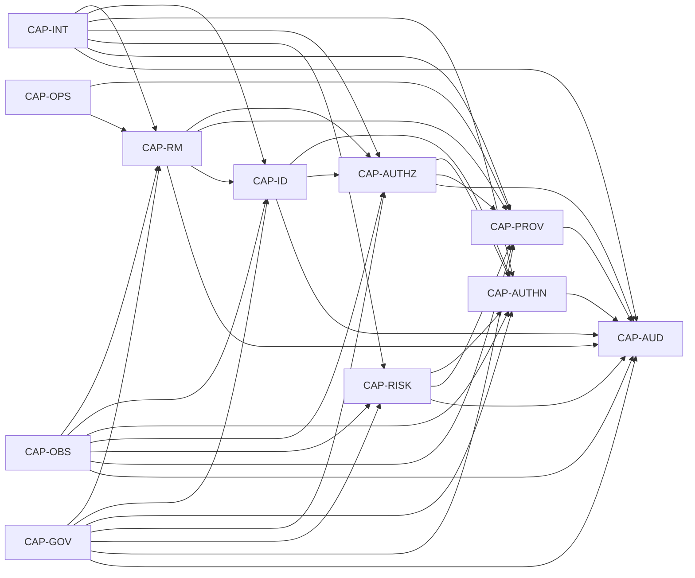
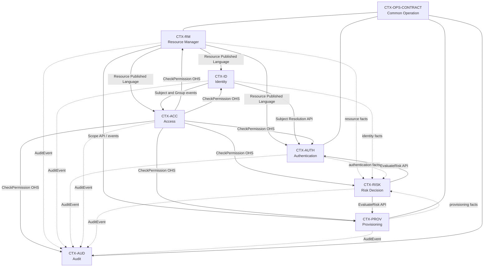
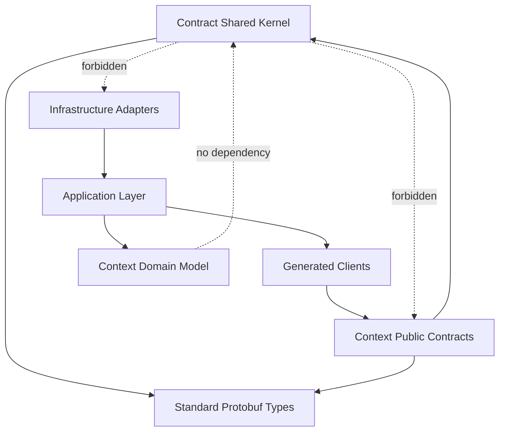

# M8 Platform Architecture & Domain Specification
_PADS-000 · Версия 1.0 · Базовая архитектура и предметная модель · 10 июля 2026 года_

| Поле | Значение |
| --- | --- |
| Идентификатор документа | PADS-000 |
| Версия | 1.0 |
| Статус | Базовая нормативная спецификация |
| Владелец | Sergey Gorbachev |
| Платформа | M8 Platform |
| Область | Resource Manager, Identity, Authentication, Access, Risk Decision, Provisioning, Audit, Common Operation |
| Архитектурный стиль | Domain-Driven Design, Clean Architecture, API First, Event-Driven, Control Plane |
| Базовый стек | Go, Protobuf, ConnectRPC, buf.validate / Protovalidate, YDB, YDB Topics, Redis, Temporal, SpiceDB, Keycloak, OpenTelemetry |

> **Нормативный статус:** настоящий документ является основным источником истины для границ платформы, предметного языка, владения данными, распределения требований и SPDD. Любое отклонение должно быть оформлено ADR или ограниченным по сроку архитектурным исключением.


---

# 0. Управление документом

| Версия | Дата | Статус | Описание |
| --- | --- | --- | --- |
| 1.0 | 2026-07-10 | Базовая версия | Завершены и нормативно расширены главы 11–24: владение данными, API, события, интеграции, безопасность, операции, ошибки, наблюдаемость, атрибуты качества, требования, трассировка, SPDD, управление архитектурой и глоссарий. |
| 0.10 | 2026-07-10 | Проект | Глава 10 переработана на русском языке: определены границы Shared Kernel, канонические общие контракты, правила владения, совместимости, версионирования, кодогенерации, проверок и SPDD-трассировки. |
| 0.9 | 2026-07-10 | Проект | Глава 9 переработана на русском языке: определены нормативные спецификации всех ограниченных контекстов, их модели, команды, запросы, события, интеграции, безопасность, отказоустойчивость и SPDD-контекст. |
| 0.8 | 2026-07-10 | Проект | Глава 8 переработана на русском языке: определены ограниченные контексты, типы отношений, опубликованные языки, синхронные и асинхронные зависимости, антикоррупционные слои, владельцы сквозных процессов и правила SPDD-трассировки. |
| 0.7 | 2026-07-10 | Проект | Глава 7 переработана на русском языке: определены агрегаты, сущности, объекты-значения, инварианты, жизненные циклы, межконтекстные ссылки и правила трассировки предметной модели. |
| 0.6 | 2026-07-10 | Проект | Глава 6 переработана на русском языке: определена карта бизнес-возможностей, их декомпозиция, владельцы, зависимости, зрелость и связь с требованиями и SPDD. |
| 0.5 | 2026-07-10 | Проект | Глава 5 переработана на русском языке: определён единый язык предметной области, владельцы понятий, правила именования и проверки соответствия. |
| 0.4 | 2026-07-10 | Проект | Глава 4 переработана на русском языке: определены 86 архитектурных принципов, проверки соответствия и порядок исключений через ADR. |
| 0.3 | 2026-07-10 | Проект | Глава 3 переработана на русском языке: определены 36 целей проектирования, их приоритеты, механизмы и критерии проверки. |
| 0.2 | 2026-07-10 | Проект | Главы 1 и 2 переработаны на русском языке и расширены до нормативной спецификации. |
| 0.1 | 2026-07-10 | Проект | Initial PADS artifact: platform vision, domain model, context map, service boundaries, requirements model and SPDD mapping. |

## 0.1. Как использовать документ

PADS является нормативной инженерной спецификацией. Документ необходимо использовать до подготовки требований, Protobuf-контрактов, задач реализации, ADR, SPDD-промптов и сгенерированного кода. Все последующие артефакты должны ссылаться на определённые здесь термины, границы сервисов и архитектурные ограничения.

- Идентификаторы разделов используются как устойчивые ссылки в требованиях, ADR, промптах и тестах.
- `MUST` обозначает обязательное правило, `SHOULD` — сильную рекомендацию, `MAY` — допустимый вариант.
- При конфликте продуктового решения с PADS до реализации создаётся или обновляется ADR.
- Понятия внешних систем не переносятся в предметную модель напрямую; применяется антикоррупционный слой.

## 0.2. Нормативный язык

| Термин | Значение |
| --- | --- |
| `MUST` | Обязательное правило. Реализация, нарушающая правило, не соответствует спецификации. |
| `MUST NOT` | Обязательный запрет. Описанное поведение не допускается. |
| `SHOULD` | Сильная рекомендация. Отклонение требует документированного обоснования. |
| `MAY` | Допустимый вариант, если он не нарушает обязательные правила. |


---

# Оглавление

- 1. Назначение и область действия
- 2. Видение платформы
- 3. Цели проектирования
- 4. Архитектурные принципы
- 5. Единый язык предметной области
- 6. Карта бизнес-возможностей платформы
- 7. Модель предметной области
- 8. Карта контекстов
- 9. Спецификации ограниченных контекстов
- 10. Shared Kernel и общие контракты
- 11. Владение данными
- 12. Правила проектирования API
- 13. Правила проектирования событий
- 14. Модель интеграции и согласованности
- 15. Архитектура безопасности
- 16. Длительные операции
- 17. Модель ошибок
- 18. Наблюдаемость
- 19. Атрибуты качества
- 20. Распределение требований
- 21. Модель трассировки
- 22. SPDD: проведение требований до Structured Prompt
- 23. Архитектурное управление
- 24. Глоссарий
- Приложение A. Начальная структура репозитория
- Приложение B. Минимальное определение готовности
- Приложение C. План последующих артефактов


---

# 1. Назначение и область действия

## 1.1. Назначение документа

Настоящий документ определяет базовую архитектуру, предметную модель и нормативные границы **M8 Platform**. Он устанавливает единый язык платформы, распределяет ответственность между ограниченными контекстами и сервисами, фиксирует правила владения данными, интеграционные принципы и путь трассировки требований от бизнес-возможности до реализации и проверки.

Документ является верхнеуровневой архитектурной спецификацией платформы. Он служит исходной точкой для подготовки:

- требований к платформе и отдельным сервисам;
- спецификаций ограниченных контекстов;
- контрактов API и событий;
- архитектурных решений ADR;
- моделей данных и состояний;
- сценариев использования и критериев приёмки;
- Structured Prompts в рамках SPDD;
- исходного кода, тестов и проверок архитектурного соответствия.

Документ не заменяет подробные спецификации сервисов, протоколы API, схемы событий, ADR и задачи реализации. Все такие артефакты **ДОЛЖНЫ** соответствовать настоящей спецификации и ссылаться на её устойчивые идентификаторы.

## 1.2. Нормативный статус

PADS является нормативной архитектурной спецификацией M8 Platform.

Требования документа применяются следующим образом:

- правило с уровнем **ДОЛЖЕН** или **НЕ ДОЛЖЕН** обязательно для исполнения;
- правило с уровнем **СЛЕДУЕТ** является архитектурным значением по умолчанию; отклонение требует обоснования;
- правило с уровнем **МОЖЕТ** определяет допустимый вариант реализации;
- противоречие между реализацией и PADS устраняется до выпуска изменения;
- осознанное отклонение от PADS оформляется отдельным ADR до начала реализации;
- внешний продукт, библиотека или поставщик технологии не может отменять правила PADS без принятого ADR.

При конфликте документов используется следующий порядок приоритета:

```text
Принятый ADR, явно изменяющий PADS
        ↓
Актуальная версия PADS
        ↓
Спецификация ограниченного контекста
        ↓
Спецификация сервиса или функции
        ↓
Контракт API или события
        ↓
Structured Prompt и задача реализации
        ↓
Исходный код
```

Если артефакт нижнего уровня противоречит артефакту верхнего уровня, он считается некорректным до устранения противоречия.

## 1.3. Целевая аудитория

Документ предназначен для:

| Роль | Как используется PADS |
| --- | --- |
| Архитектор платформы | Определение границ, принципов, моделей и допустимых зависимостей. |
| Владелец продукта | Проверка соответствия возможностей платформы бизнес-целям. |
| Руководитель разработки | Декомпозиция платформы на сервисы, команды и этапы реализации. |
| Системный аналитик | Формирование требований, сценариев, контрактов и матрицы трассировки. |
| Разработчик | Реализация сервисов в соответствии с предметными и архитектурными ограничениями. |
| Инженер по качеству | Вывод критериев приёмки, контрактных тестов и проверок архитектуры. |
| Инженер платформы | Развёртывание, наблюдаемость, безопасность и эксплуатация сервисов. |
| ИИ-агент разработки | Получение структурированного контекста и ограничений через SPDD. |

## 1.4. Предметная область платформы

M8 Platform представляет собой модульную платформу управления ресурсами, идентичностями, доступом, рисками и жизненным циклом управляемых сервисов. Она реализует функции управляющей плоскости и предоставляет повторно используемые возможности для внутренних и внешних прикладных систем.

Базовый состав платформы включает следующие ограниченные контексты:

| Ограниченный контекст | Предметная ответственность |
| --- | --- |
| Resource Manager | Иерархия Organization → Workspace → Project → Service и жизненный цикл ресурсов управления. |
| Identity | Пулы пользователей, пользователи, группы, членство и внешние идентичности. |
| Authentication | Проверка идентичности, транзакции аутентификации, испытания, повторная и усиленная аутентификация. |
| Access | Полномочия, роли, отношения субъектов и ресурсов, проверка и объяснение доступа. |
| Risk Decision | Сигналы риска, политики, оценка риска и решение о требуемом действии. |
| Provisioning | Жизненный цикл управляемых ресурсов, желаемое и наблюдаемое состояние, согласование и драйверы. |
| Audit | Неизменяемая история значимых действий, решений и изменений. |
| Common Operation | Единая модель длительных операций и их прогресса. |

## 1.5. Функциональная область действия

В базовую область действия входят следующие возможности.

### 1.5.1. Управление ресурсной иерархией

Платформа **ДОЛЖНА** поддерживать каноническую иерархию:

```text
Organization
└── Workspace
    └── Project
        └── Service
```

Resource Manager **ДОЛЖЕН** быть единственным владельцем идентификаторов, состояния и отношений вложенности этих ресурсов.

### 1.5.2. Управление идентичностями

Платформа **ДОЛЖНА** поддерживать:

- изолированные User Pool;
- пользователей и технические субъекты;
- группы;
- членство в ресурсных областях;
- привязку внешних идентичностей;
- блокировку, деактивацию и восстановление идентичности;
- сохранение исторических ссылок после удаления или обезличивания субъекта.

### 1.5.3. Аутентификация

Платформа **ДОЛЖНА** поддерживать независимую от поставщика предметную модель аутентификации, включая:

- запуск и получение состояния транзакции аутентификации;
- CIBA;
- OTP;
- подтверждение в доверенном приложении;
- WebAuthn и ключи доступа;
- OIDC и SAML через антикоррупционные адаптеры;
- повторную аутентификацию;
- усиленную аутентификацию;
- требуемый и достигнутый уровень подтверждения;
- отмену, истечение срока и повторную отправку испытания;
- безопасную передачу результата клиентскому приложению.

### 1.5.4. Управление доступом

Платформа **ДОЛЖНА** поддерживать:

- описание разрешений;
- роли и назначения ролей;
- отношения между субъектами и ресурсами;
- проверку доступа;
- пакетную проверку доступа;
- объяснение результата;
- моделирование предполагаемых изменений доступа;
- ревизию полномочий;
- интеграцию с графовым механизмом авторизации через антикоррупционный слой.

### 1.5.5. Принятие решений по риску

Платформа **ДОЛЖНА** принимать контекстные решения на основании сигналов риска. Минимальный набор результатов:

```text
ALLOW
DENY
CHALLENGE
REVIEW
```

Решение **ДОЛЖНО** содержать основание, применённую политику, требуемое действие и данные, необходимые для аудита и объяснения.

### 1.5.6. Предоставление и согласование ресурсов

Платформа **ДОЛЖНА** управлять желаемым состоянием внешних и внутренних ресурсов, поддерживать согласование состояния, повторные попытки, обнаружение отклонений, удаление и подключаемые драйверы поставщиков.

### 1.5.7. Аудит

Каждое значимое изменение состояния, решение безопасности и административное действие **ДОЛЖНО** формировать аудиторское событие. Аудиторская запись **НЕ ДОЛЖНА** изменяться после фиксации.

### 1.5.8. Длительные операции

Операции, выполнение которых может продолжаться после завершения исходного запроса, **ДОЛЖНЫ** представляться отдельным ресурсом `Operation`. Состояние операции не заменяет состояние предметного ресурса.

## 1.6. Системные границы

M8 Platform отвечает за предметные решения и управление жизненным циклом, но может делегировать техническое исполнение внешним системам.

| Внешняя система или технология | Роль относительно M8 | Граница ответственности |
| --- | --- | --- |
| Keycloak | Поставщик инфраструктуры аутентификации и федерации | Не является владельцем предметной модели M8 Authentication. |
| SpiceDB | Механизм хранения и вычисления графа авторизации | Не определяет публичный язык M8 Access. |
| Temporal | Исполнение длительных рабочих процессов | Не является владельцем состояния предметных агрегатов. |
| YDB | Основное хранилище данных сервисов | Не определяет границы агрегатов и сервисов. |
| YDB Topics | Транспорт событий платформы | Не определяет семантику доменных и интеграционных событий. |
| Redis | Вспомогательное временное хранилище и кэш | Не является системой записи для предметных данных. |
| Kubernetes и облачные API | Целевые среды предоставления ресурсов | Доступны только через драйверы и антикоррупционные адаптеры. |

Ни одна внешняя система **НЕ ДОЛЖНА** напрямую определять публичную модель данных, команды, события или состояния M8 Platform.

## 1.7. Что не входит в базовую редакцию

В базовую редакцию PADS не входят:

- окончательный дизайн пользовательских интерфейсов;
- биллинг, тарификация, выставление счетов и платежи как самостоятельный контекст;
- маркетинговая аналитика, корпоративное хранилище данных и BI;
- детальные манифесты Kubernetes и конфигурации инфраструктуры;
- внутренние таблицы и служебные схемы Keycloak, SpiceDB, Temporal и YDB;
- реализация конкретного поставщика SMS, электронной почты или Mobile ID;
- окончательная модель коммерческого распространения платформы;
- требования конкретного прикладного продукта, если они не выделены в платформенную возможность.

Исключение из базовой редакции не запрещает последующее расширение платформы. Новая область **ДОЛЖНА** пройти анализ предметной принадлежности и границ до включения в карту контекстов.

## 1.8. Основные допущения

Спецификация основывается на следующих допущениях:

1. M8 Platform развивается как набор независимо развёртываемых сервисов.
2. Каждый сервис имеет отдельное владение данными и не обращается напрямую к хранилищу другого сервиса.
3. Межсервисная согласованность в общем случае является итоговой.
4. Синхронное взаимодействие используется для решений, требующих немедленного ответа; распространение фактов выполняется событиями.
5. Все публичные контракты проектируются до реализации.
6. Архитектурные ограничения должны быть проверяемыми автоматически или через формализованный review prompt.
7. Разработка с использованием ИИ рассматривается как управляемый инженерный процесс, а не как источник неявных архитектурных решений.
8. Платформа должна поддерживать многоарендность и явное распространение ресурсной области запроса.

## 1.9. Ключевая архитектурная гипотеза

> **PADS-THESIS-001.** M8 Platform строится как совокупность сервисов, владеющих отдельными предметными областями. Каждый сервис владеет своим языком, инвариантами, данными и публичными контрактами. Keycloak, SpiceDB, Temporal, YDB, Kubernetes и другие технологии являются заменяемыми механизмами реализации за явно определёнными портами и адаптерами.

Из этой гипотезы следуют обязательные положения:

- границы сервисов определяются предметной ответственностью, а не таблицами или технологическими продуктами;
- один предметный факт имеет одного канонического владельца;
- внешняя модель поставщика переводится в язык M8 через антикоррупционный слой;
- межсервисные зависимости должны быть явными и трассируемыми;
- требования должны быть доведены до контрактов, тестов и Structured Prompts;
- код, созданный человеком или ИИ, не является источником архитектурной истины.

## 1.10. Критерии соответствия области действия

Функция относится к платформенному уровню, если выполняется хотя бы одно из условий:

- она используется несколькими прикладными сервисами или продуктами;
- она определяет общую ресурсную, идентификационную или защитную границу;
- она управляет жизненным циклом общеплатформенного ресурса;
- она обеспечивает единое соблюдение политик, аудита или требований безопасности;
- её дублирование в прикладных сервисах создаёт расхождение правил или риски безопасности.

Функция **НЕ СЛЕДУЕТ** включать в M8 Platform, если она отражает только бизнес-логику одного прикладного продукта и не образует повторно используемую платформенную возможность.

---

# 2. Видение платформы

## 2.1. Миссия

M8 Platform предоставляет единый набор повторно используемых возможностей для создания, защиты и эксплуатации цифровых продуктов. Платформа должна освободить прикладные команды от повторной реализации управления ресурсами, идентичностями, аутентификацией, авторизацией, рисками, аудитом и предоставлением инфраструктурных ресурсов.

Миссия платформы формулируется следующим образом:

> **Предоставить прикладным командам безопасную, наблюдаемую и расширяемую управляющую плоскость, в которой ресурсы, идентичности, полномочия, решения и операции представлены единообразно и управляются через стабильные контракты.**

## 2.2. Целевое состояние

В целевом состоянии M8 Platform должна обеспечивать:

- единый ресурсный контур `Organization → Workspace → Project → Service`;
- единый подход к регистрации и жизненному циклу платформенных сервисов;
- централизованные идентичности при сохранении изоляции пользовательских пулов;
- независимую от поставщиков оркестрацию аутентификации;
- централизованный граф полномочий и объяснимые решения доступа;
- адаптивную защиту на основании контекста и риска;
- декларативное предоставление и согласование управляемых ресурсов;
- неизменяемую и связанную с трассами историю действий;
- единый формат длительных операций;
- формальную трассировку от бизнес-требования до кода и теста;
- безопасное применение ИИ-агентов на основе контролируемого контекста.

## 2.3. Роль платформы в архитектуре продуктов

M8 Platform выступает как управляющая плоскость для прикладных систем.

```text
┌──────────────────────────────────────────────────────────────┐
│                    Прикладные продукты                       │
│  веб-приложения · мобильные приложения · внутренние сервисы │
└──────────────────────────────┬───────────────────────────────┘
                               │ API / SDK / Events
┌──────────────────────────────▼───────────────────────────────┐
│                         M8 Platform                          │
│ Resource Manager · Identity · Authentication · Access       │
│ Risk Decision · Provisioning · Audit · Operations           │
└──────────────────────────────┬───────────────────────────────┘
                               │ Ports / Adapters
┌──────────────────────────────▼───────────────────────────────┐
│                   Технологические механизмы                  │
│ Keycloak · SpiceDB · Temporal · YDB · Redis · Kubernetes    │
│ облачные API · поставщики OTP · OIDC/SAML · Mobile ID       │
└──────────────────────────────────────────────────────────────┘
```

Прикладной продукт взаимодействует с M8 через публичные контракты и **НЕ ДОЛЖЕН** зависеть от внутренних API технологических механизмов, используемых платформой.

## 2.4. Каноническая ресурсная модель

Ресурсная иерархия платформы:

```text
Organization
└── Workspace
    └── Project
        └── Service
```

### Organization

Верхняя административная, арендная и ресурсная граница. Organization объединяет рабочие пространства и определяет область верхнеуровневого управления.

### Workspace

Логическая группа проектов внутри Organization. Workspace может отражать продукт, направление, подразделение или другую устойчивую административную область.

### Project

Основная граница изоляции, полномочий, конфигурации и операционного управления. Большинство платформенных ресурсов должно иметь явную принадлежность к Project.

### Service

Зарегистрированная прикладная или платформенная возможность внутри Project. Service предоставляет идентичность сервиса, метаданные, принадлежность и точку привязки связанных ресурсов.

Ресурсная иерархия является канонической. Другие контексты **ДОЛЖНЫ** ссылаться на её идентификаторы, но **НЕ ДОЛЖНЫ** создавать собственные конкурирующие копии иерархии как источник истины.

## 2.5. Ключевые свойства платформы

| Свойство | Требование к M8 Platform |
| --- | --- |
| API First | Публичные контракты проектируются и согласуются до реализации. Основные интерфейсы описываются в Protobuf и предоставляются через ConnectRPC. |
| Domain First | Предметная модель и единый язык определяют границы сервисов; структура БД и API поставщиков не определяют архитектуру. |
| Clean Architecture | Зависимости направлены внутрь. Предметный и прикладной слои не импортируют типы транспорта, хранилища, SDK и инфраструктурных продуктов. |
| Event Driven | Изменения состояния публикуются как факты. Сервисы поддерживают локальную согласованность и используют события для распространения изменений. |
| Control Plane | Платформа управляет политиками, желаемым состоянием, операциями и жизненным циклом, а не ограничивается синхронными CRUD-вызовами. |
| Secure by Design | Идентичность, полномочия, риск, область ресурса и инициатор учитываются до выполнения защищённого изменения. |
| Observable by Design | Запросы, команды, решения, события, операции и рабочие процессы имеют метрики, журналы, трассы и корреляционные идентификаторы. |
| Auditable by Design | Значимые действия и решения образуют неизменяемую историю с указанием инициатора, цели, контекста и результата. |
| Automation First | Повторяемые операции предоставления, проверки и управления должны быть доступны через API и автоматизированные рабочие процессы. |
| AI Native | Архитектура и требования представляются в форме, пригодной для безопасного преобразования в Structured Prompts и автоматической проверки результата. |
| Composable | Возможности платформы могут использоваться независимо и комбинироваться через стабильные контракты. |
| Extensible | Новые поставщики, драйверы, политики и способы аутентификации подключаются через порты, адаптеры и расширяемые реестры. |

## 2.6. Стратегические принципы развития

### 2.6.1. Resource Manager как основа управляющей плоскости

Resource Manager создаётся первым и становится каноническим владельцем Organization, Workspace, Project и Service. Остальные сервисы используют его идентификаторы и события для определения ресурсной области.

### 2.6.2. Разделение Identity, Authentication и Access

Identity, Authentication и Access развиваются как отдельные ограниченные контексты, поскольку имеют разные модели, инварианты, жизненные циклы и зависимости.

- Identity отвечает на вопрос: **кто представлен в системе**;
- Authentication отвечает на вопрос: **как подтверждена идентичность**;
- Access отвечает на вопрос: **что субъекту разрешено сделать**.

Объединение этих обязанностей в один сервис **НЕ ДОПУСКАЕТСЯ** без пересмотра карты контекстов и отдельного ADR.

### 2.6.3. Независимость от Keycloak

Keycloak может использоваться как инфраструктурный механизм федерации, CIBA, OIDC, SAML и управления сессиями. Публичная модель M8 Authentication **НЕ ДОЛЖНА** содержать внутренние сущности, состояния и идентификаторы Keycloak, кроме явно определённых внешних ссылок адаптера.

### 2.6.4. Независимость от SpiceDB

SpiceDB используется для хранения и вычисления графа отношений. M8 Access оперирует собственными понятиями Subject, Resource, Permission, Role и Relationship. Tuple-модель SpiceDB остаётся внутренней моделью адаптера.

### 2.6.5. Независимость от Temporal

Temporal используется для исполнения длительных и восстанавливаемых процессов. Предметный агрегат не должен зависеть от Workflow ID, Activity и других типов Temporal. Состояние рабочего процесса не заменяет состояние предметного ресурса или `Operation`.

### 2.6.6. YDB как система записи сервисов

YDB используется как основное хранилище предметных данных сервисов. Каждый сервис имеет собственное логическое владение таблицами. Совместное использование базы не означает совместного владения данными.

YDB Topics является основным транспортом внутренних событий платформы, если иной транспорт не утверждён ADR.

### 2.6.7. Контролируемая разработка с ИИ

ИИ-агенты используются только после формализации:

- предметного контекста;
- требований;
- области допустимых изменений;
- архитектурных ограничений;
- публичных контрактов;
- критериев приёмки;
- обязательных тестов.

ИИ-агент **НЕ ДОЛЖЕН** самостоятельно изменять границы контекстов, публичные контракты или архитектурные принципы в рамках задачи реализации.

## 2.7. Ценностное предложение

### Для прикладных команд

- сокращение времени запуска новых сервисов;
- отсутствие необходимости повторно реализовывать IAM и управляющую плоскость;
- единые SDK, контракты и модели ошибок;
- готовые механизмы аудита, наблюдаемости и длительных операций.

### Для владельцев платформы

- централизованное управление политиками и ресурсами;
- единый стандарт безопасности;
- контролируемая эволюция контрактов;
- измеримая трассировка требований и реализации;
- возможность заменять технологических поставщиков без изменения прикладных контрактов.

### Для эксплуатации и безопасности

- единый контекст инициатора и ресурса;
- сквозная корреляция запросов, событий и операций;
- объяснимые решения доступа и риска;
- неизменяемая история изменений;
- автоматизируемое управление жизненным циклом.

## 2.8. Принципы пользовательского опыта API

Публичные интерфейсы M8 Platform должны быть:

- единообразными между сервисами;
- предсказуемыми по именованию и ошибкам;
- идемпотентными для повторяемых изменений;
- пригодными для синхронного и асинхронного использования;
- безопасными по умолчанию;
- наблюдаемыми без дополнительной интеграции;
- совместимыми с автоматической генерацией SDK;
- пригодными для использования человеком, сервисом и ИИ-агентом.

## 2.9. Критерии достижения видения

Видение считается реализованным, когда:

1. прикладной сервис может зарегистрироваться в Project и получить устойчивую сервисную идентичность;
2. пользователь или технический субъект может пройти аутентификацию без зависимости клиента от конкретного поставщика;
3. доступ к ресурсу проверяется через единый M8 Access API и может быть объяснён;
4. Risk Decision может потребовать дополнительное подтверждение без встраивания риск-логики в Authentication;
5. управляемый ресурс создаётся декларативно и сопровождается длительной операцией;
6. каждое значимое действие доступно в аудите и связано с трассой выполнения;
7. сервисы не обращаются напрямую к данным друг друга;
8. замена Keycloak, SpiceDB или драйвера предоставления не требует изменения предметных контрактов прикладных клиентов;
9. каждое реализованное требование связано с контрактом, Structured Prompt и проверяющим тестом;
10. архитектурные нарушения обнаруживаются до выпуска изменения.

## 2.10. Ограничения видения

M8 Platform не должна превращаться в универсальный монолит, содержащий бизнес-логику всех продуктов. Платформа предоставляет общие механизмы и политики, но не владеет специфичными для конкретного продукта понятиями, если они не стали повторно используемой платформенной возможностью.

Расширяемость не означает отсутствие границ. Каждый новый модуль должен иметь:

- явную предметную ответственность;
- владельца данных;
- устойчивый язык;
- входящие и исходящие зависимости;
- обоснование выделения ограниченного контекста;
- требования к безопасности, аудиту и наблюдаемости;
- место в карте контекстов и матрице трассировки.

---

# 3. Цели проектирования

## 3.1. Назначение целей проектирования

Цели проектирования определяют свойства, которые архитектура M8 Platform должна сохранять на протяжении всего жизненного цикла платформы. Они связывают видение платформы с конкретными архитектурными принципами, границами ограниченных контекстов, требованиями к сервисам и критериями проверки реализации.

Цели проектирования отвечают на вопрос **«какого результата должна достигать архитектура»**. Архитектурные принципы, определённые в главе 4, отвечают на вопрос **«какими обязательными правилами этот результат обеспечивается»**.

Каждая цель имеет устойчивый идентификатор `DG-NNN`, который **ДОЛЖЕН** использоваться в:

- ADR, изменяющих или уточняющих архитектурное решение;
- требованиях к платформе и сервисам;
- спецификациях ограниченных контекстов;
- Structured Prompts;
- архитектурных проверках и review prompts;
- критериях готовности функций и сервисов.

Цель проектирования не является задачей реализации и не закрывается однократно. Она представляет постоянное свойство архитектуры, которое должно сохраняться при каждом изменении системы.

## 3.2. Приоритет целей

При конфликте целей применяется следующий порядок приоритета:

```text
1. Безопасность, конфиденциальность и целостность данных
2. Корректность предметных инвариантов
3. Изоляция владельцев данных и ограниченных контекстов
4. Совместимость публичных контрактов
5. Восстанавливаемость и управляемость эксплуатации
6. Наблюдаемость и аудит
7. Производительность и масштабируемость
8. Скорость разработки и удобство реализации
```

Решение, которое повышает скорость разработки, но нарушает безопасность, предметный инвариант, владение данными или совместимость публичного контракта, **НЕ ДОЛЖНО** приниматься.

Конфликт целей, который невозможно разрешить применением указанного порядка, **ДОЛЖЕН** быть оформлен ADR. ADR должен перечислять затронутые цели, выбранный компромисс, последствия и условия пересмотра решения.

## 3.3. Цели предметной архитектуры

### DG-001. Единственный владелец предметного понятия

Каждое каноническое предметное понятие **ДОЛЖНО** иметь ровно один ограниченный контекст-владелец и один сервис, ответственный за его запись и жизненный цикл.

Другие сервисы могут хранить только:

- ссылки на идентификатор владельца;
- локальные проекции;
- кэш;
- исторические снимки, необходимые для аудита;
- производные данные, не конкурирующие с канонической моделью.

**Ожидаемый результат:** отсутствуют несколько сервисов, способных независимо изменить один и тот же предметный факт.

**Проверка:** матрица владения данными не содержит нескольких владельцев одной сущности или атрибута.

### DG-002. Границы определяются предметной ответственностью

Сервис и ограниченный контекст **ДОЛЖНЫ** выделяться на основании языка, инвариантов, жизненного цикла и ответственности, а не на основании таблицы, очереди, библиотеки, команды разработки или технологического продукта.

**Ожидаемый результат:** границы Resource Manager, Identity, Authentication, Access, Risk Decision, Provisioning и Audit остаются устойчивыми при замене технологий реализации.

**Проверка:** описание каждого сервиса содержит его предметную ответственность, владельцев данных, инварианты и запрещённые обязанности.

### DG-003. Единый и недвусмысленный язык

Каждое значимое понятие платформы **ДОЛЖНО** иметь согласованное имя и определение. Один термин не должен обозначать разные понятия внутри одного ограниченного контекста, а разные термины не должны использоваться как неявные синонимы одного понятия.

**Ожидаемый результат:** требования, API, события, код и документация используют одинаковый язык.

**Проверка:** новые публичные термины добавлены в Ubiquitous Language до появления в контрактах.

### DG-004. Инварианты защищаются владельцем агрегата

Каждый предметный инвариант **ДОЛЖЕН** проверяться внутри контекста-владельца и не должен зависеть от того, что внешний клиент правильно повторит правило.

**Ожидаемый результат:** недопустимое состояние невозможно зафиксировать через любой публичный или внутренний путь изменения.

**Проверка:** для каждого агрегата существует перечень инвариантов и тесты на их нарушение.

### DG-005. Малые и целевые агрегаты

Агрегат **ДОЛЖЕН** защищать только те инварианты, которые требуют одной локальной транзакции. Агрегат не должен превращаться в транзакционную оболочку всего сервиса или ресурсной иерархии.

**Ожидаемый результат:** агрегаты остаются управляемыми, конкурентные изменения минимально конфликтуют, а масштабирование не требует глобальных блокировок.

**Проверка:** границы агрегата обоснованы конкретными инвариантами, а не удобством загрузки связанных данных.

### DG-006. Явные модели жизненного цикла

Ресурсы с нетривиальным жизненным циклом **ДОЛЖНЫ** иметь документированную модель состояний, допустимых переходов, причин отказа и терминальных состояний.

**Ожидаемый результат:** состояние Authentication Transaction, Managed Resource, Operation, User и других жизненных циклов изменяется предсказуемо.

**Проверка:** переходы состояний покрыты таблицей переходов и тестами, включая запрещённые переходы.

## 3.4. Цели модульности и независимого развития

### DG-007. Независимое развитие сервисов

Сервис **ДОЛЖЕН** иметь возможность изменяться, выпускаться и масштабироваться независимо, пока сохраняется совместимость его публичных контрактов.

**Ожидаемый результат:** изменение внутренней реализации одного сервиса не требует синхронного выпуска всей платформы.

**Проверка:** межсервисные зависимости представлены только версионируемыми API, событиями или явно определёнными шлюзами.

### DG-008. Явные межконтекстные зависимости

Каждая зависимость между ограниченными контекстами **ДОЛЖНА** быть отражена в карте контекстов и классифицирована по направлению, типу взаимодействия и модели ответственности.

**Ожидаемый результат:** отсутствуют скрытые зависимости через общую БД, общий кэш, внутренние таблицы или неформальные соглашения.

**Проверка:** обнаруженная во время реализации зависимость, отсутствующая в Context Map, блокирует выпуск до обновления спецификации или удаления зависимости.

### DG-009. Независимость предметной модели от поставщика

Keycloak, SpiceDB, Temporal, YDB, Redis, Kubernetes, облачный API и другие продукты **НЕ ДОЛЖНЫ** определять публичную предметную модель M8 Platform.

**Ожидаемый результат:** замена поставщика не требует изменения основных понятий, сценариев и контрактов прикладных клиентов.

**Проверка:** типы и названия внешнего SDK отсутствуют в доменном слое и публичных предметных контрактах, если они не являются сознательно принятым стандартом платформы.

### DG-010. Минимальный общий слой

Общие библиотеки и Shared Kernel **ДОЛЖНЫ** содержать только действительно стабильные технические или семантические элементы, необходимые нескольким сервисам. Они не должны становиться способом скрытого объединения предметных моделей.

**Ожидаемый результат:** сервисы сохраняют независимость и не требуют массового выпуска из-за изменения общей бизнес-логики.

**Проверка:** добавление предметного типа в общий модуль требует отдельного обоснования и проверки владельца понятия.

### DG-011. Компонуемость возможностей

Каждая основная возможность платформы **СЛЕДУЕТ** проектировать так, чтобы она могла использоваться отдельно и совместно с другими возможностями через стабильные контракты.

**Ожидаемый результат:** продукт может использовать, например, Resource Manager и Audit без обязательного внедрения всех остальных модулей, если его сценарий это допускает.

**Проверка:** необязательная зависимость не превращается в обязательную только из-за удобства реализации.

## 3.5. Цели данных и согласованности

### DG-012. Локальная транзакционная согласованность

Одна транзакция **ДОЛЖНА** изменять только данные одного сервиса-владельца. Распределённые транзакции между сервисами не являются допустимой основой архитектуры.

**Ожидаемый результат:** отказ или недоступность внешнего сервиса не оставляет локальную транзакцию в неопределённом состоянии.

**Проверка:** транзакционный контур не включает БД, очередь или ресурс другого сервиса.

### DG-013. Управляемая итоговая согласованность

Межсервисная согласованность **ДОЛЖНА** достигаться через события, повторяемые команды, процесс-менеджеры, рабочие процессы и компенсации. Для каждой такой цепочки должны быть определены промежуточные состояния и поведение при сбоях.

**Ожидаемый результат:** система способна завершить или компенсировать многошаговый процесс после временных отказов.

**Проверка:** процесс имеет владельца, идентификатор корреляции, политику повторов, тайм-аут, дедупликацию и сценарий ручного восстановления.

### DG-014. Надёжная публикация фактов

Факт об изменении состояния **НЕ ДОЛЖЕН** быть потерян между фиксацией предметного изменения и публикацией интеграционного события.

**Ожидаемый результат:** событие публикуется как следствие зафиксированного состояния и может быть безопасно опубликовано повторно.

**Проверка:** применён транзакционный Outbox либо другой механизм с эквивалентными гарантиями, зафиксированный ADR.

### DG-015. Идемпотентность повторяемых операций

Команды и обработчики, для которых возможна повторная доставка, **ДОЛЖНЫ** обеспечивать идемпотентный результат или явно документировать, почему это невозможно.

**Ожидаемый результат:** сетевой повтор, повторная доставка события или восстановление рабочего процесса не создаёт дублирующий предметный результат.

**Проверка:** определены ключ идемпотентности, область его уникальности, срок хранения и ответ при повторе.

### DG-016. Оптимистичное управление конкурентными изменениями

Конкурентные изменения агрегатов **СЛЕДУЕТ** контролировать версией или эквивалентным условием сравнения состояния. Неявная перезапись более нового состояния устаревшим запросом недопустима.

**Ожидаемый результат:** конфликт изменений обнаруживается и возвращается вызывающей стороне как явный результат.

**Проверка:** команды изменения содержат или используют ожидаемую версию там, где возможна конкурентная запись.

### DG-017. Разделение системы записи и проекций

Каноническая модель записи **ДОЛЖНА** отличаться от поисковых, аналитических и интерфейсных проекций, если их требования различаются. Проекция не становится владельцем предметного факта.

**Ожидаемый результат:** чтение оптимизируется без нарушения владения и инвариантов модели записи.

**Проверка:** для каждой проекции определены источник, версия, задержка обновления и способ полного восстановления.

## 3.6. Цели контрактов и совместимости

### DG-018. Контракт предшествует реализации

Публичный API, событие или расширяемый интерфейс **ДОЛЖЕН** быть специфицирован и рассмотрен до реализации поведения, которое от него зависит.

**Ожидаемый результат:** реализация следует согласованному контракту, а не формирует его случайно из внутренних структур кода.

**Проверка:** задача реализации с публичным взаимодействием ссылается на утверждённую версию контракта.

### DG-019. Обратная совместимость публичных контрактов

Публичные контракты **ДОЛЖНЫ** развиваться без нарушения существующих клиентов в пределах заявленного периода поддержки.

Запрещается без новой несовместимой версии:

- изменять смысл существующего поля;
- повторно использовать удалённый номер поля Protobuf;
- превращать необязательное поле в обязательное;
- удалять поддерживаемое значение перечисления без стратегии совместимости;
- менять семантику успешного ответа или ошибки.

**Ожидаемый результат:** сервисы и клиенты могут выпускаться независимо.

**Проверка:** изменения проходят автоматическую проверку совместимости схем и контрактные тесты.

### DG-020. Стабильная модель ошибок

Ошибки **ДОЛЖНЫ** представлять устойчивые предметные и платформенные причины, а не текст исключения конкретной библиотеки или БД.

**Ожидаемый результат:** клиент может программно принять решение о повторе, исправлении запроса, повторной аутентификации или прекращении операции.

**Проверка:** ошибка имеет стабильный код, категорию, повторяемость, безопасное сообщение и корреляционный идентификатор.

### DG-021. Единообразие публичного API

Публичные API сервисов **ДОЛЖНЫ** следовать единым правилам именования, пагинации, фильтрации, масок изменений, идемпотентности, длительных операций, ошибок и метаданных запроса.

**Ожидаемый результат:** использование нового сервиса не требует изучения уникальных базовых соглашений.

**Проверка:** контракт проходит общий API lint и архитектурный review.

## 3.7. Цели безопасности и доверия

### DG-022. Безопасность до изменения состояния

Полномочия, область ресурса и необходимые решения риска **ДОЛЖНЫ** быть проверены до выполнения защищённого изменения, если спецификация сценария не требует иной последовательности.

**Ожидаемый результат:** недоверенный субъект не может инициировать необратимое предметное изменение до завершения обязательных проверок.

**Проверка:** сценарий явно показывает место Authentication, Access и Risk Decision относительно команды изменения.

### DG-023. Явный контекст безопасности

Каждый защищённый запрос **ДОЛЖЕН** иметь достаточный контекст для определения инициатора, субъекта, клиента, ресурсной области, цели, уровня подтверждения и корреляции.

Минимальный набор контекста определяется конкретным API, но не должен восстанавливаться из скрытого глобального состояния.

**Ожидаемый результат:** решение может быть воспроизведено, объяснено и связано с аудитом.

**Проверка:** обязательные поля контекста задокументированы и валидируются на границе сервиса.

### DG-024. Минимальные полномочия по умолчанию

Отсутствие явно подтверждённого разрешения **ДОЛЖНО** трактоваться как запрет. Сервисные учётные данные, роли и операционные доступы должны выдаваться с минимально необходимыми полномочиями.

**Ожидаемый результат:** компрометация одного компонента не предоставляет ему неограниченный доступ ко всей платформе.

**Проверка:** права сервиса соответствуют его карте зависимостей и не включают прямой доступ к чужим хранилищам.

### DG-025. Объяснимые решения безопасности

Решения Access и Risk Decision **ДОЛЖНЫ** иметь объяснимую форму, достаточную для аудита, поддержки и расследования, без раскрытия чувствительных внутренних правил неавторизованному клиенту.

**Ожидаемый результат:** администратор может понять основание решения, а внешний клиент получает безопасный и стабильный ответ.

**Проверка:** разделены внутреннее объяснение, аудиторские данные и публичное сообщение.

### DG-026. Защита чувствительных данных

Секреты, учётные данные, токены, персональные и иные чувствительные данные **ДОЛЖНЫ** минимизироваться, классифицироваться и защищаться на всём пути обработки.

**Ожидаемый результат:** сервис не хранит данные, которые не нужны для его предметной ответственности, а журналы и события не содержат секретов.

**Проверка:** для контракта и модели данных определены классификация, маскирование, срок хранения и правила удаления.

## 3.8. Цели эксплуатации и устойчивости

### DG-027. Наблюдаемость по умолчанию

Каждый запрос, команда, событие, решение, длительная операция и рабочий процесс **ДОЛЖНЫ** быть наблюдаемыми через согласованные журналы, метрики и трассы.

**Ожидаемый результат:** оператор может определить, что произошло, где произошёл сбой, какой ресурс и субъект затронуты и как связаны этапы процесса.

**Проверка:** определены `trace_id`, `request_id`, `correlation_id`, `causation_id`, `operation_id` и предметные идентификаторы, применимые к сценарию.

### DG-028. Неизменяемый и полный аудит

Значимые административные, защитные и предметные действия **ДОЛЖНЫ** формировать неизменяемую аудиторскую запись с инициатором, целью, действием, контекстом, решением и результатом.

**Ожидаемый результат:** история не зависит от текущего состояния ресурса и пригодна для расследований и подтверждения соблюдения правил.

**Проверка:** перечень аудируемых действий является частью спецификации сервиса, а потеря обязательного события обнаруживается.

### DG-029. Управляемые длительные операции

Операция, которая может пережить исходный запрос, зависеть от внешних систем или требовать повторов, **ДОЛЖНА** иметь отдельный ресурс `Operation` с состоянием, прогрессом, результатом и ошибкой.

**Ожидаемый результат:** клиент не удерживает соединение и может безопасно получить итог после перезапуска или временной недоступности.

**Проверка:** ресурс Operation отделён от предметного ресурса и не используется как замена его жизненному циклу.

### DG-030. Восстановление после частичных отказов

Сервис и межсервисный процесс **ДОЛЖНЫ** иметь определённое поведение при тайм-ауте, повторе, недоступности зависимости, частичном выполнении и восстановлении после перезапуска.

**Ожидаемый результат:** временный отказ не требует ручного изменения данных в штатном сценарии.

**Проверка:** определены политики повторов, пределы повторов, dead-letter или карантин, компенсация и операционная процедура.

### DG-031. Горизонтальная масштабируемость

Сервисы без документированного исключения **СЛЕДУЕТ** проектировать без локального незаменимого состояния экземпляра, препятствующего горизонтальному масштабированию.

**Ожидаемый результат:** увеличение нагрузки обслуживается добавлением экземпляров и масштабированием соответствующего хранилища или очереди.

**Проверка:** сессии, блокировки, очереди и координаторы имеют распределённую или внешнюю модель хранения.

### DG-032. Изоляция отказов

Отказ одного ограниченного контекста **НЕ ДОЛЖЕН** автоматически приводить к полной недоступности остальных возможностей платформы, если их сценарии не требуют этой зависимости.

**Ожидаемый результат:** деградация имеет контролируемую область, а клиент получает явный статус вместо каскадного зависания.

**Проверка:** определены тайм-ауты, ограничение конкуренции, circuit breaker там, где он оправдан, и режим деградации.

## 3.9. Цели разработки, проверки и SPDD

### DG-033. Полная трассировка требования

Каждое реализованное функциональное требование **ДОЛЖНО** быть связано как минимум с:

```text
Business Capability
        ↓
Platform или Context Requirement
        ↓
Use Case
        ↓
API / Event / State Contract
        ↓
Structured Prompt или инженерная задача
        ↓
Code Change
        ↓
Verification Test
```

**Ожидаемый результат:** можно определить, почему существует каждая значимая часть реализации и чем подтверждается её корректность.

**Проверка:** матрица трассировки не содержит реализованных требований без теста и изменений без исходного требования или ADR.

### DG-034. Проверяемые архитектурные ограничения

Обязательное архитектурное правило **СЛЕДУЕТ** выражать в форме, пригодной для автоматической проверки. Когда автоматическая проверка невозможна, правило должно иметь формализованный review prompt и обязательный результат ревью.

**Ожидаемый результат:** архитектурная деградация обнаруживается до выпуска, а не после накопления нарушений.

**Проверка:** для правила указано средство проверки: тест, линтер, анализ зависимостей, контрактная проверка или review checklist.

### DG-035. Управляемое применение ИИ

ИИ-агент **НЕ ДОЛЖЕН** самостоятельно изменять архитектурные границы, публичные контракты, инварианты или модель безопасности без явного требования и соответствующего ADR либо утверждённой спецификации.

Structured Prompt **ДОЛЖЕН** задавать:

- цель изменения;
- область разрешённых файлов и компонентов;
- применимые требования и решения;
- предметные инварианты;
- разрешённые и запрещённые зависимости;
- ожидаемые контракты;
- обязательные тесты;
- критерии завершения;
- формат отчёта о результате.

**Ожидаемый результат:** результат ИИ воспроизводим, ограничен и проверяем теми же правилами, что и работа человека.

**Проверка:** изменение, выполненное ИИ, ссылается на Structured Prompt и проходит независимый review prompt или ревью специалиста.

### DG-036. Документация изменяется вместе с системой

Изменение предметной модели, публичного поведения, границ, зависимости или архитектурного решения **ДОЛЖНО** сопровождаться изменением соответствующей спецификации в той же поставке.

**Ожидаемый результат:** документация отражает действующее состояние системы, а не историческое намерение.

**Проверка:** Definition of Done содержит проверку актуальности PADS, Context Specification, ADR, контрактов и каталога событий.

## 3.10. Матрица целей и основных механизмов

| Группа целей | Основные цели | Основные механизмы реализации |
| --- | --- | --- |
| Предметная целостность | DG-001—DG-006 | Bounded Context, Aggregate, Ubiquitous Language, state machine, domain tests. |
| Независимость модулей | DG-007—DG-011 | Context Map, API, events, ports and adapters, минимальный Shared Kernel. |
| Данные и согласованность | DG-012—DG-017 | Database per service, Outbox, Inbox, idempotency, optimistic locking, projections. |
| Контракты | DG-018—DG-021 | Protobuf, ConnectRPC, schema compatibility, API lint, contract tests. |
| Безопасность | DG-022—DG-026 | Authentication, Access, Risk Decision, explicit context, least privilege, data classification. |
| Эксплуатация | DG-027—DG-032 | OpenTelemetry, Audit, Operation, Temporal, retries, isolation and recovery patterns. |
| Управление разработкой | DG-033—DG-036 | Traceability matrix, architecture tests, SPDD, ADR and Definition of Done. |

## 3.11. Проверка достижения целей

Цели проектирования проверяются на четырёх уровнях.

### 3.11.1. Уровень спецификации

Перед реализацией должно быть подтверждено:

- определён владелец предметного понятия;
- определены границы и зависимости контекста;
- описаны инварианты и жизненный цикл;
- определены API, события и ошибки;
- указаны применимые цели `DG-*`;
- установлены критерии приёмки.

### 3.11.2. Уровень реализации

В коде проверяются:

- направление зависимостей;
- отсутствие доступа к чужому хранилищу;
- соблюдение транзакционных границ;
- идемпотентность и конкурентное изменение;
- отсутствие утечки внешних типов в доменную модель;
- формирование аудита и телеметрии.

### 3.11.3. Уровень интеграции

В интеграционных и контрактных тестах проверяются:

- совместимость API и событий;
- повторная доставка;
- восстановление после частичного сбоя;
- итоговая согласованность;
- тайм-ауты и режим деградации;
- правильность межконтекстной последовательности.

### 3.11.4. Уровень эксплуатации

В рабочей среде проверяются:

- достижение SLO;
- полнота аудита;
- наличие и связность трасс;
- доля ошибок и повторов;
- задержка доставки событий и обновления проекций;
- возможность восстановления без прямого редактирования данных.

## 3.12. Критерии готовности архитектурного решения

Архитектурное решение может быть принято к реализации, если:

1. перечислены цели `DG-*`, которые оно поддерживает или затрагивает;
2. указаны сознательные компромиссы и нарушаемые значения по умолчанию;
3. определён владелец данных и транзакционная граница;
4. определены входящие и исходящие зависимости;
5. описано поведение при отказах и повторах;
6. определены безопасность, аудит и наблюдаемость;
7. подтверждена совместимость публичных контрактов;
8. определён способ автоматической или формализованной проверки;
9. обновлена матрица трассировки;
10. при отклонении от PADS создан и принят ADR.

---

# 4. Архитектурные принципы

## 4.1. Назначение главы

Архитектурные принципы определяют обязательные правила проектирования, реализации, интеграции и эксплуатации M8 Platform. Они преобразуют цели проектирования `DG-*` в проверяемые инженерные ограничения и используются как нормативная основа для:

- определения границ ограниченных контекстов и сервисов;
- проектирования агрегатов, API, событий и моделей хранения;
- принятия архитектурных решений ADR;
- декомпозиции требований и подготовки Structured Prompts;
- архитектурного review исходного кода;
- автоматических проверок совместимости и направления зависимостей;
- оценки готовности изменения к выпуску.

Каждый принцип имеет устойчивый идентификатор `AP-NNN`. Ссылки на принцип **ДОЛЖНЫ** сохраняться при его уточнении. Изменение смысла действующего принципа требует новой версии PADS и записи в журнале изменений.

Архитектурный принцип описывает не конкретную технологию, а обязательное свойство системы. Технологическое решение допустимо только тогда, когда оно обеспечивает соответствие применимым принципам.

## 4.2. Обязательность и область применения

Принципы применяются ко всем сервисам, библиотекам, адаптерам, контрактам, рабочим процессам и поставляемым изменениям M8 Platform, если конкретный принцип не ограничен отдельной областью.

Используются следующие уровни обязательности:

| Формулировка | Значение |
| --- | --- |
| **ДОЛЖЕН / НЕ ДОЛЖЕН** | Обязательное требование или запрет. Нарушение блокирует выпуск без принятого ADR. |
| **СЛЕДУЕТ / НЕ СЛЕДУЕТ** | Архитектурное значение по умолчанию. Отклонение требует обоснования в спецификации или ADR. |
| **МОЖЕТ** | Допустимый вариант, если он не нарушает обязательные правила. |

Архитектурный принцип считается применимым к изменению, если изменение затрагивает хотя бы один из следующих аспектов:

- предметную модель или инвариант;
- владельца данных;
- межсервисную зависимость;
- публичный API или событие;
- модель согласованности;
- безопасность, аудит или обработку чувствительных данных;
- длительный процесс или операционное состояние;
- масштабирование, отказоустойчивость или наблюдаемость;
- генерацию реализации ИИ-агентом.

## 4.3. Порядок разрешения конфликтов

Если несколько принципов приводят к различным вариантам решения, применяется следующий порядок:

1. безопасность и защита данных;
2. корректность предметных инвариантов;
3. владение данными и изоляция контекстов;
4. совместимость публичных контрактов;
5. восстанавливаемость и эксплуатационная управляемость;
6. наблюдаемость и аудит;
7. производительность;
8. удобство разработки.

Конфликт, не разрешимый этим порядком, **ДОЛЖЕН** быть оформлен ADR. ADR должен указать:

- конфликтующие принципы;
- выбранный вариант;
- причины невозможности полного соблюдения;
- риски и компенсирующие меры;
- срок или условие пересмотра решения.

## 4.4. Принципы предметных границ и владения

### AP-001. Один канонический владелец предметного факта

Каждый канонический предметный факт **ДОЛЖЕН** иметь ровно один ограниченный контекст и один сервис, имеющий право изменять этот факт.

Другие сервисы **МОГУТ** хранить ссылку, кэш, проекцию или исторический снимок, но **НЕ ДОЛЖНЫ** позиционировать их как конкурирующий источник истины.

**Проверка:** в матрице владения данными для каждого типа ресурса, состояния и атрибута указан один владелец записи.

### AP-002. Граница сервиса определяется предметной ответственностью

Сервис **ДОЛЖЕН** выделяться на основании собственного языка, инвариантов, жизненного цикла и ответственности. Таблица, очередь, фреймворк, команда разработки или внешняя технология сами по себе не являются основанием для выделения сервиса.

**Проверка:** спецификация сервиса содержит назначение, владельцев данных, агрегаты, инварианты и явно исключённые обязанности.

### AP-003. База данных принадлежит сервису

Сервис **ДОЛЖЕН** иметь логически изолированную область хранения и быть единственным владельцем записи в свои таблицы, индексы и служебные структуры.

Физическое размещение таблиц нескольких сервисов в одном кластере YDB **НЕ ОЗНАЧАЕТ** совместного владения данными.

**Проверка:** права доступа к таблицам ограничены сервисом-владельцем и операционными процедурами восстановления.

### AP-004. Запрещён прямой доступ к данным другого сервиса

Сервис **НЕ ДОЛЖЕН** читать или изменять таблицы, кэш, внутренние топики, снимки или служебные структуры другого сервиса напрямую.

Допустимые способы получения данных:

- публичный API владельца;
- опубликованное интеграционное событие;
- согласованная локальная проекция;
- специально определённый экспорт данных;
- аварийная операционная процедура, не являющаяся частью бизнес-потока.

**Проверка:** сетевые и хранилищные политики исключают межсервисный доступ к чужим таблицам.

### AP-005. Внешняя ссылка вместо копирования владения

Если сервис использует ресурс другого контекста, он **ДОЛЖЕН** хранить устойчивую ссылку на ресурс владельца и только те локальные атрибуты, которые необходимы его собственной модели.

Локальная копия не должна использоваться для изменения жизненного цикла внешнего ресурса.

**Проверка:** для каждого внешнего идентификатора указаны владелец, способ проверки существования и поведение при удалении или недоступности владельца.

### AP-006. Проекция не становится источником истины

Проекция, поисковый индекс, аналитическая витрина или кэш **НЕ ДОЛЖНЫ** использоваться для принятия решения, требующего гарантированно актуального канонического состояния, если допустимая задержка явно не определена требованиями.

**Проверка:** для каждой проекции задокументированы источник, задержка, версия, способ восстановления и допустимые сценарии использования.

### AP-007. Граница агрегата определяется инвариантом

Агрегат **ДОЛЖЕН** включать минимальный набор сущностей и значений, необходимый для атомарной защиты конкретных инвариантов.

Связанные данные не должны включаться в один агрегат только ради удобства чтения или навигации.

**Проверка:** каждое включение сущности в агрегат обосновано хотя бы одним локальным транзакционным инвариантом.

### AP-008. Изменение агрегата выполняется через его корень

Внешний код **НЕ ДОЛЖЕН** обходить корень агрегата и напрямую изменять внутренние сущности или коллекции.

Все переходы состояния **ДОЛЖНЫ** выполняться предметными операциями, сохраняющими инварианты.

**Проверка:** изменяемые поля и коллекции агрегата не доступны для неконтролируемой записи из прикладного или инфраструктурного слоя.

### AP-009. Жизненный цикл описывается явно

Ресурс с нетривиальным жизненным циклом **ДОЛЖЕН** иметь явные состояния, допустимые переходы, причины переходов и терминальные состояния.

Булевы поля, сочетание которых неявно кодирует состояние, **НЕ СЛЕДУЕТ** использовать вместо определённой модели состояний.

**Проверка:** существует таблица переходов и тесты допустимых и запрещённых переходов.

### AP-010. Удаление является предметной операцией

Удаление ресурса **ДОЛЖНО** учитывать зависимости, аудит, повторяемость, восстановление, хранение исторических ссылок и требования конфиденциальности.

Физическое удаление строки **НЕ ДОЛЖНО** автоматически считаться корректной реализацией удаления предметного ресурса.

**Проверка:** для ресурса определены состояния удаления, политика зависимостей, события и последствия для связанных контекстов.

## 4.5. Принципы слоёв и направления зависимостей

### AP-011. Зависимости направлены внутрь

Код транспортного и инфраструктурного слоёв **ДОЛЖЕН** зависеть от прикладного слоя, прикладной слой — от доменного, а доменный слой **НЕ ДОЛЖЕН** зависеть от внешней инфраструктуры.

```text
Adapters / Delivery / Infrastructure
                 ↓
          Application
                 ↓
              Domain
```

**Проверка:** архитектурные тесты запрещают обратные импорты.

### AP-012. Доменный слой не зависит от поставщиков

Доменный слой **НЕ ДОЛЖЕН** импортировать SDK или типы Keycloak, SpiceDB, Temporal, YDB, Redis, Kafka, Kubernetes, облачных провайдеров, ConnectRPC или OpenTelemetry.

**Проверка:** список допустимых импортов доменного пакета ограничен стандартной библиотекой и собственными предметными пакетами.

### AP-013. Транспортная модель не является доменной моделью

Protobuf-сообщения, HTTP-модели и структуры событий **НЕ ДОЛЖНЫ** использоваться внутри доменной модели как основные сущности и значения.

На границе сервиса **ДОЛЖНО** выполняться явное преобразование между транспортным и предметным представлением.

**Проверка:** доменные методы не принимают и не возвращают транспортные DTO.

### AP-014. Модель хранения не является доменной моделью

Структуры строк YDB, сериализованные документы и схемы индексов **НЕ ДОЛЖНЫ** определять устройство доменных сущностей.

Репозиторий **ДОЛЖЕН** преобразовывать между доменной моделью и моделью хранения.

**Проверка:** изменение схемы хранения не требует изменения публичной предметной модели, если бизнес-смысл не изменился.

### AP-015. Внешние системы изолируются антикоррупционным слоем

Интеграция с внешней системой **ДОЛЖНА** использовать порт и адаптер, преобразующий внешние понятия, состояния и ошибки в язык M8.

Внешний поставщик **НЕ ДОЛЖЕН** определять публичные команды, события и состояния платформы.

**Проверка:** интеграция имеет отдельный адаптер и таблицу преобразования внешних состояний и ошибок.

### AP-016. Прикладной сценарий координирует, а не содержит предметные правила

Прикладной обработчик **ДОЛЖЕН** координировать загрузку агрегатов, вызов доменных операций, внешних портов и фиксацию результата.

Сложные предметные правила **НЕ ДОЛЖНЫ** размещаться в транспортном обработчике или репозитории.

**Проверка:** бизнес-правило можно протестировать без транспорта и базы данных.

### AP-017. Транспортный обработчик остаётся тонким

Обработчик ConnectRPC, HTTP или события **ДОЛЖЕН** ограничиваться:

- проверкой транспортного контекста;
- преобразованием входных данных;
- вызовом прикладного сценария;
- преобразованием результата и ошибки;
- формированием транспортной телеметрии.

**Проверка:** обработчик не выполняет прямые запросы к БД и не реализует предметные переходы состояния.

### AP-018. Порты принадлежат потребителю

Интерфейс внешней зависимости **СЛЕДУЕТ** определять в том слое и контексте, который использует эту зависимость, а не копировать полный интерфейс поставщика.

**Проверка:** порт содержит минимальный набор операций, необходимый конкретным сценариям M8.

## 4.6. Принципы команд, запросов и транзакций

### AP-019. Команда выражает намерение изменить состояние

Команда **ДОЛЖНА** иметь глагольное имя, явного инициатора, ресурсную область и данные, необходимые для проверки инвариантов.

Команда не является фактом и **НЕ ДОЛЖНА** публиковаться как доменное событие без выполнения.

**Проверка:** имя команды описывает действие, а результат различает принятие команды и фактическое изменение.

### AP-020. Запрос не изменяет предметное состояние

Query-операция **НЕ ДОЛЖНА** изменять предметное состояние, публиковать доменное событие или запускать скрытый длительный процесс.

Допустимы только технические побочные эффекты, не меняющие бизнес-смысл: метрики, трассировка, обновление безопасного кэша.

**Проверка:** повтор запроса не меняет предметный результат.

### AP-021. Одна локальная транзакция — один сервис-владелец

Транзакция **ДОЛЖНА** охватывать только данные одного сервиса. Распределённая транзакция между сервисами, базой и внешним API **НЕ ДОПУСКАЕТСЯ** как базовый механизм согласованности.

**Проверка:** commit локальной транзакции не зависит от commit другого сервиса.

### AP-022. Транзакционная граница определяется прикладным сценарием

Прикладной сценарий **ДОЛЖЕН** явно определять, какие изменения фиксируются атомарно. Репозиторий не должен скрытно открывать независимые транзакции для частей одного изменения.

**Проверка:** транзакционный контур виден в реализации сценария или единице работы.

### AP-023. Оптимистичная блокировка является значением по умолчанию

Изменяемые агрегаты **СЛЕДУЕТ** сохранять с проверкой ожидаемой версии. Конфликт версий **ДОЛЖЕН** возвращаться как отдельная стабильная ошибка.

Пессимистичная блокировка допустима только при доказанной необходимости и оформленном решении.

**Проверка:** конкурентные тесты подтверждают отсутствие потерянных обновлений.

### AP-024. Повторяемая команда должна быть идемпотентной

Команда, которую клиент, брокер или рабочий процесс может отправить повторно, **ДОЛЖНА** иметь определённую семантику идемпотентности.

Должны быть указаны:

- ключ идемпотентности;
- область уникальности;
- срок хранения результата;
- поведение при несовпадении тела запроса;
- ответ на повторный вызов.

**Проверка:** два эквивалентных повтора не создают два предметных результата.

### AP-025. Внешний вызов не выполняется внутри незавершённой транзакции без необходимости

Сервис **НЕ СЛЕДУЕТ** удерживать локальную транзакцию открытой во время сетевого вызова к другому сервису или поставщику.

Если внешний результат требуется до фиксации, последовательность и поведение при тайм-ауте **ДОЛЖНЫ** быть явно специфицированы.

**Проверка:** время удержания транзакции не зависит от произвольной задержки внешней системы.

### AP-026. Частичный успех моделируется явно

Многошаговая операция **НЕ ДОЛЖНА** возвращать общий успех, если обязательные шаги не завершены. Промежуточное состояние, повтор и компенсация должны быть представлены явно.

**Проверка:** сценарий содержит состояние частичного выполнения и путь восстановления.

### AP-027. Компенсация является предметным действием

Компенсация **ДОЛЖНА** иметь собственную семантику, аудит и ограничения. Она не обязана буквально восстанавливать прошлое состояние, если это невозможно или неправильно для предметной области.

**Проверка:** для компенсации определены команда, допустимость, идемпотентность и последствия.

### AP-028. Время является явной зависимостью

Предметная логика, использующая текущее время, **ДОЛЖНА** получать его через абстракцию `Clock` или входные данные, а не через скрытый глобальный вызов.

**Проверка:** временные правила детерминированно тестируются.

### AP-029. Генерация идентификаторов является явной зависимостью

Идентификаторы агрегатов и операций **ДОЛЖНЫ** создаваться через определённую стратегию и быть доступны до публикации событий, если событие ссылается на создаваемый ресурс.

**Проверка:** формат, уникальность и область идентификатора задокументированы.

### AP-030. Детерминизм доменной логики

При одинаковом состоянии и одинаковых входных данных доменная операция **ДОЛЖНА** выдавать одинаковый результат, кроме явно переданных зависимостей времени, случайности или внешнего решения.

**Проверка:** доменные тесты не требуют сети, реальной БД или текущего системного времени.

## 4.7. Принципы согласованности и событий

### AP-031. Событие описывает свершившийся факт

Имя события **ДОЛЖНО** быть сформулировано в прошедшем времени и описывать зафиксированный факт, например `ProjectCreated`, `UserDisabled`, `AuthenticationCompleted`.

Событие **НЕ ДОЛЖНО** использоваться как скрытая команда.

**Проверка:** обработчик события может считать, что факт уже произошёл у владельца.

### AP-032. Доменное и интеграционное событие разделяются

Доменное событие отражает внутренний факт агрегата. Интеграционное событие является стабильным контрактом для других контекстов.

Сервис **МОЖЕТ** преобразовывать несколько внутренних событий в одно интеграционное событие или не публиковать внутреннее событие наружу.

**Проверка:** публичная схема события не содержит внутренние объекты агрегата без необходимости.

### AP-033. Outbox обязателен для событий зафиксированного изменения

Интеграционное событие, подтверждающее изменение состояния, **ДОЛЖНО** быть записано атомарно с этим изменением в локальный Outbox или механизм с эквивалентными гарантиями.

Публикация в YDB Topics до фиксации предметного состояния **НЕ ДОПУСКАЕТСЯ**.

**Проверка:** сбой после commit не приводит к потере события.

### AP-034. Потребитель должен выдерживать повторную доставку

Обработчик интеграционного события **ДОЛЖЕН** быть идемпотентным. Для необратимых последствий **СЛЕДУЕТ** использовать Inbox или эквивалентный реестр обработанных сообщений.

**Проверка:** повторная доставка одного `event_id` не создаёт повторный предметный эффект.

### AP-035. Глобальный порядок событий не предполагается

Система **НЕ ДОЛЖНА** полагаться на глобальный порядок всех событий. Если порядок необходим, он должен быть определён в пределах конкретного ключа, агрегата или потока и подтверждён транспортом.

**Проверка:** потребитель корректно обрабатывает независимые события в произвольном порядке.

### AP-036. Версия агрегата сопровождает изменяющие события

Событие, представляющее последовательные изменения агрегата, **СЛЕДУЕТ** снабжать версией агрегата или эквивалентным порядковым номером.

**Проверка:** потребитель может обнаружить устаревшее событие, пропуск или изменение порядка.

### AP-037. Интеграционные события версионируются

Схема и семантика интеграционного события **ДОЛЖНЫ** иметь версию. Несовместимое изменение выпускается как новая версия события или новый тип события.

**Проверка:** автоматическая проверка схем не допускает несовместимое изменение действующей версии.

### AP-038. Метаданные события стандартизированы

Каждое интеграционное событие **ДОЛЖНО** содержать или получать из транспортного конверта:

- `event_id`;
- тип и версию события;
- время возникновения факта;
- сервис и контекст-источник;
- идентификатор агрегата;
- версию агрегата, когда применимо;
- `correlation_id`;
- `causation_id`;
- область Organization, Workspace или Project, когда применимо;
- идентификатор трассы или способ её восстановления.

**Проверка:** событие проходит общий schema lint.

### AP-039. Событие содержит достаточный факт, но не снимок всей БД

Событие **ДОЛЖНО** содержать данные, необходимые большинству потребителей для понимания факта, но **НЕ ДОЛЖНО** бесконтрольно дублировать весь агрегат или чувствительные поля.

**Проверка:** каждое поле события имеет обоснованного потребителя и классификацию данных.

### AP-040. Ошибка одного потребителя не блокирует владельца события

Публикация события не должна делать локальную доступность владельца зависимой от работоспособности каждого потребителя.

Для необрабатываемых сообщений **ДОЛЖНЫ** быть предусмотрены политика повторов, карантин или поток ошибок и процедура разбора.

**Проверка:** сбой потребителя не откатывает уже зафиксированное изменение владельца.

## 4.8. Принципы публичных API и контрактов

### AP-041. API проектируется до реализации

Публичный API **ДОЛЖЕН** быть специфицирован, проверен и связан с требованиями до реализации обработчика.

Основным форматом контрактов M8 является Protobuf; ConnectRPC используется как основной транспорт, если ADR не определяет иной вариант.

**Проверка:** задача реализации ссылается на утверждённую версию `.proto`.

### AP-042. Публичный API выражает язык владельца

Имена ресурсов, методов, полей и ошибок **ДОЛЖНЫ** соответствовать Ubiquitous Language ограниченного контекста и не раскрывать таблицы, колонки или внутренние типы поставщика.

**Проверка:** публичный контракт может быть понят без знания схемы YDB, Keycloak или SpiceDB.

### AP-043. Обратная совместимость обязательна

Действующая версия публичного контракта **НЕ ДОЛЖНА** изменяться несовместимо.

В частности, запрещается:

- повторно использовать номер удалённого поля Protobuf;
- менять смысл существующего поля;
- менять необязательное поле на обязательное;
- удалять используемое значение enum без стратегии совместимости;
- менять успешный ответ на асинхронный без новой версии или согласованного перехода;
- возвращать ранее невозможную ошибку без оценки поведения клиентов.

**Проверка:** Buf breaking check и контрактные тесты проходят до слияния.

### AP-044. Неопределённость поля моделируется явно

Контракт **ДОЛЖЕН** различать отсутствие значения, нулевое значение и значение по умолчанию, когда это влияет на смысл.

**Проверка:** для частичных изменений и фильтров семантика presence документирована.

### AP-045. Частичное изменение использует маску полей

Update-операции для ресурсов со множеством изменяемых полей **СЛЕДУЕТ** реализовывать через `FieldMask` или эквивалентный явный механизм.

`null`, пустая строка или ноль **НЕ ДОЛЖНЫ** неявно означать одновременно «не менять» и «очистить».

**Проверка:** для каждого изменяемого поля определено поведение при наличии и отсутствии в маске.

### AP-046. Списочные методы используют устойчивую пагинацию

List-операции **ДОЛЖНЫ** иметь ограниченный размер страницы и непрозрачный `page_token`.

Токен **НЕ ДОЛЖЕН** требовать от клиента знания внутреннего ключа таблицы и **ДОЛЖЕН** быть связан с параметрами запроса.

**Проверка:** повтор страницы не создаёт пропусков и дубликатов в пределах заявленной модели согласованности.

### AP-047. Фильтрация и сортировка являются частью контракта

Поддерживаемые поля, операторы, порядок сортировки и ограничения **ДОЛЖНЫ** быть перечислены явно. Произвольная строка фильтра не должна превращаться в неконтролируемый доступ к внутренней схеме хранения.

**Проверка:** недопустимый фильтр возвращает стабильную ошибку валидации.

### AP-048. Мутация использует явную идемпотентность

Create, delete, запуск операции и другие повторяемые мутации **ДОЛЖНЫ** поддерживать ключ запроса или другой определённый механизм защиты от дублей.

**Проверка:** повтор после потери ответа возвращает исходный результат или состояние той же операции.

### AP-049. Длительная мутация возвращает Operation

Операция, которая не может надёжно завершиться в пределах короткого синхронного запроса, требует оркестрации или внешнего ресурса, **ДОЛЖНА** возвращать стандартный ресурс `Operation`.

Синхронный тайм-аут клиента не должен отменять уже принятую предметную работу без отдельной команды отмены.

**Проверка:** клиент может получить состояние, результат, ошибку, прогресс и возможность отмены, если она поддерживается.

### AP-050. Ошибки имеют стабильную машинно-читаемую модель

Публичная ошибка **ДОЛЖНА** содержать стабильный код, категорию, безопасное сообщение, признаки повторяемости и корреляционный идентификатор.

Текст исключения БД или внешнего SDK **НЕ ДОЛЖЕН** передаваться клиенту как контракт.

**Проверка:** все предметные ошибки имеют явное отображение в транспортный статус и error details.

## 4.9. Принципы безопасности и доверия

### AP-051. Нулевое доверие между компонентами

Сетевое расположение внутри платформы **НЕ ДОЛЖНО** само по себе считаться основанием доверия. Каждый защищённый вызов должен иметь проверяемую идентичность вызывающей стороны и ограниченную область полномочий.

**Проверка:** сервисная идентичность и политика доступа определены для каждого межсервисного вызова.

### AP-052. Контекст безопасности передаётся явно

Защищённый запрос **ДОЛЖЕН** содержать достаточные данные для определения:

- инициатора;
- представляемого субъекта;
- клиента;
- ресурсной области;
- цели операции;
- достигнутого уровня подтверждения;
- идентификаторов корреляции.

Скрытое глобальное состояние **НЕ ДОЛЖНО** использоваться для восстановления критичного контекста.

**Проверка:** обязательный контекст валидируется на границе сервиса.

### AP-053. Авторизация выполняется до защищённого изменения

Проверка Access **ДОЛЖНА** завершиться до фиксации защищённого изменения состояния, если сценарий явно не определяет иной безопасный порядок.

**Проверка:** отсутствует путь изменения ресурса, обходящий проверку полномочий.

### AP-054. Risk Decision отделён от Authentication

Authentication отвечает за подтверждение идентичности, а Risk Decision — за оценку контекста и требуемого действия.

Authentication **НЕ ДОЛЖЕН** содержать дублирующий набор риск-правил, кроме локальных технических ограничений протокола.

**Проверка:** требование step-up поступает как решение или политика, а не как скрытая ветка конкретного провайдера.

### AP-055. Запрет по умолчанию

Отсутствие подтверждённого разрешения **ДОЛЖНО** трактоваться как запрет. Неполный, неизвестный или ошибочный результат проверки доступа не должен интерпретироваться как разрешение.

**Проверка:** режим отказа Access и Risk Decision документирован и протестирован.

### AP-056. Минимальные полномочия

Пользовательские роли, сервисные учётные данные, доступ к хранилищам и операционные права **ДОЛЖНЫ** ограничиваться минимально необходимым набором.

**Проверка:** разрешения сервиса соответствуют его Context Map и не включают универсальный доступ ко всей платформе.

### AP-057. Секреты не являются предметными данными

Секрет, ключ, пароль, refresh token или иная учётная информация **НЕ ДОЛЖНЫ** храниться в обычной предметной модели, журнале, событии или трассе.

Сервис **ДОЛЖЕН** хранить ссылку на защищённое хранилище или минимально необходимое криптографически защищённое представление.

**Проверка:** автоматический secret scanning и review схем данных не обнаруживают открытые секреты.

### AP-058. Чувствительные данные минимизируются

Сервис **ДОЛЖЕН** собирать, передавать и хранить только чувствительные данные, необходимые его ответственности.

Копирование персональных данных в интеграционные события, аудит или проекции требует явного обоснования и политики хранения.

**Проверка:** поля имеют классификацию, владельца и срок хранения.

### AP-059. Решения безопасности объяснимы

Access и Risk Decision **ДОЛЖНЫ** сохранять объяснение, достаточное для аудита и расследования.

Публичный ответ может быть сокращён, чтобы не раскрывать чувствительные правила и сигналы.

**Проверка:** разделены внутреннее объяснение, аудиторская запись и сообщение внешнему клиенту.

### AP-060. Значимое действие создаёт аудит

Административное действие, изменение полномочий, решение доступа, решение риска, изменение идентичности, запуск аутентификации и управление ресурсом **ДОЛЖНЫ** формировать аудиторское событие в соответствии с политикой контекста.

**Проверка:** для каждой мутации в каталоге требований указан тип аудиторского события или обоснованное исключение.

## 4.10. Принципы длительных процессов и оркестрации

### AP-061. Operation и предметный ресурс разделены

`Operation` представляет выполнение изменения, а предметный ресурс — достигнутое предметное состояние. Состояние Workflow или Operation **НЕ ДОЛЖНО** подменять состояние агрегата.

**Проверка:** завершение операции определяется наблюдаемым результатом предметного изменения.

### AP-062. Temporal является механизмом исполнения, а не предметной моделью

Типы Workflow, Activity, Retry Policy и идентификаторы Temporal **НЕ ДОЛЖНЫ** появляться в доменном слое и публичных контрактах, кроме технически необходимой отладочной метаинформации.

**Проверка:** прикладной порт оркестрации выражен в терминах M8.

### AP-063. Рабочий процесс должен быть восстанавливаемым

Длительный процесс **ДОЛЖЕН** выдерживать перезапуск исполнителя, повтор Activity, временную недоступность зависимости и повторную доставку сигнала.

**Проверка:** тесты имитируют сбой между значимыми шагами.

### AP-064. Каждый процесс имеет владельца

Межсервисный процесс **ДОЛЖЕН** иметь один контекст, отвечающий за его итог, прогресс, повтор, компенсацию и перевод в ручное восстановление.

**Проверка:** Context Map и спецификация сценария указывают Process Manager или Workflow Owner.

### AP-065. Отмена имеет явную семантику

Поддержка отмены **ДОЛЖНА** определять:

- до какого момента отмена допустима;
- является ли она best effort;
- какие шаги компенсируются;
- какое конечное состояние получает ресурс;
- что возвращается при слишком поздней отмене.

**Проверка:** отмена не трактуется автоматически как rollback.

### AP-066. Повтор ограничен политикой

Повторы внешних вызовов **ДОЛЖНЫ** иметь ограничение попыток или времени, backoff, jitter и классификацию повторяемых ошибок.

Бесконечный быстрый повтор **НЕ ДОПУСКАЕТСЯ**.

**Проверка:** политика повторов видима в спецификации и метриках.

### AP-067. Тайм-аут является частью контракта зависимости

Каждый внешний вызов **ДОЛЖЕН** иметь явный тайм-аут, меньший оставшегося бюджета вызывающего сценария.

**Проверка:** отсутствуют сетевые вызовы с неограниченным ожиданием.

### AP-068. Ручное восстановление проектируется заранее

Процесс, который может завершиться неустранимой автоматической ошибкой, **ДОЛЖЕН** предоставлять диагностируемое состояние, безопасную повторную команду или операционную процедуру восстановления.

**Проверка:** восстановление не требует произвольного изменения строк в БД.

## 4.11. Принципы устойчивости, наблюдаемости и эксплуатации

### AP-069. Наблюдаемость является частью реализации функции

Каждый прикладной сценарий **ДОЛЖЕН** иметь структурированные журналы, трассировку и метрики, достаточные для определения результата, задержки и причины ошибки.

**Проверка:** Definition of Done включает телеметрию вместе с кодом и тестами.

### AP-070. Корреляция является сквозной

Запросы, команды, события, операции, аудиторские записи и рабочие процессы **ДОЛЖНЫ** связываться через стандартные идентификаторы:

```text
trace_id
request_id
correlation_id
causation_id
operation_id
actor_id
project_id
```

Конкретный набор зависит от сценария, но разрыв цепочки должен быть обоснован.

**Проверка:** по одному идентификатору можно восстановить путь выполнения между сервисами.

### AP-071. Структурированные журналы вместо текстовых сообщений

Журналы **ДОЛЖНЫ** использовать стабильные поля и коды событий. Чувствительные данные и секреты **НЕ ДОЛЖНЫ** попадать в журнал.

**Проверка:** автоматический анализ логов подтверждает наличие обязательных полей и отсутствие запрещённых значений.

### AP-072. Метрики отражают пользовательский и предметный результат

Помимо технических метрик сервис **ДОЛЖЕН** измерять результат ключевых операций: успешность, отказ по правилу, конфликт, повтор, компенсацию, длительность и отставание проекций.

**Проверка:** для критичного сценария определены SLI и целевой SLO.

### AP-073. Зависимости имеют явный режим деградации

Для каждой синхронной внешней зависимости **ДОЛЖНО** быть определено поведение при недоступности: отказ, кэшированное чтение, отложенное выполнение, ограниченный режим или запрет операции.

**Проверка:** недоступность зависимости покрыта интеграционным тестом.

### AP-074. Backpressure обязателен для потоковой обработки

Потребитель событий и пакетный обработчик **ДОЛЖНЫ** ограничивать параллелизм, объём незавершённой работы и скорость повторов.

**Проверка:** рост входного потока не приводит к неограниченному потреблению памяти или созданию горутин.

### AP-075. Graceful shutdown сохраняет корректность

Сервис **ДОЛЖЕН** прекращать приём новой работы, завершать или безопасно возвращать незавершённые сообщения, закрывать ресурсы и сообщать о неготовности до остановки.

**Проверка:** тест остановки не приводит к потере подтверждённого сообщения или частичной фиксации.

### AP-076. Проверки здоровья разделяются

Liveness показывает способность процесса продолжать работу, readiness — готовность обслуживать трафик, а диагностика зависимостей не должна автоматически превращать временную недоступность любого поставщика в бесконечный рестарт.

**Проверка:** политики Kubernetes соответствуют семантике проверок.

### AP-077. Изоляция отказов

Критичные внешние зависимости **СЛЕДУЕТ** изолировать отдельными пулами, лимитами, очередями или circuit breaker, чтобы деградация одной интеграции не исчерпала ресурсы всего сервиса.

**Проверка:** нагрузочный тест подтверждает сохранение основных функций при деградации одного адаптера.

### AP-078. Масштабирование не должно нарушать корректность

Сервис **ДОЛЖЕН** сохранять корректность при нескольких экземплярах. Локальная память процесса не должна быть единственным владельцем распределённого состояния, блокировки или дедупликации.

**Проверка:** сценарии параллельного исполнения тестируются на нескольких экземплярах или эквивалентной модели конкуренции.

## 4.12. Принципы SPDD, генерации и архитектурного управления

### AP-079. Сгенерированный код подчиняется спецификации

Код, созданный ИИ-агентом, генератором или шаблоном, **ДОЛЖЕН** соответствовать PADS, ADR, контрактам и тестам. Факт генерации не является основанием для ослабления review.

**Проверка:** сгенерированное изменение проходит те же проверки, что и ручное.

### AP-080. Structured Prompt имеет ограниченную область изменений

Каждый Structured Prompt **ДОЛЖЕН** перечислять:

- реализуемые требования;
- разрешённые каталоги и компоненты;
- запрещённые изменения;
- применимые `DG-*` и `AP-*`;
- контракты;
- критерии приёмки;
- обязательные тесты;
- ожидаемый формат результата.

**Проверка:** агент не должен выводить область задачи только из репозитория или свободного текста.

### AP-081. ИИ не меняет архитектурные границы скрытно

Задача реализации **НЕ ДОЛЖНА** разрешать ИИ-агенту самостоятельно:

- создавать новый сервис или ограниченный контекст;
- менять владельца данных;
- добавлять прямую межсервисную зависимость;
- изменять публичный контракт несовместимо;
- переносить предметное правило между контекстами;
- выбирать новый инфраструктурный продукт.

Такие изменения требуют отдельного проектного prompt и архитектурного решения.

**Проверка:** review prompt сопоставляет фактический diff с разрешённой областью.

### AP-082. Требование трассируется до проверки

Каждое реализованное требование **ДОЛЖНО** быть связано как минимум с:

- ограниченным контекстом;
- сервисом-владельцем;
- сценарием;
- контрактом или внутренним интерфейсом;
- Structured Prompt;
- кодом;
- тестом или другой проверкой.

**Проверка:** матрица трассировки не содержит реализованных требований без проверки и кода без основания.

### AP-083. Архитектурные ограничения автоматизируются

Правило, которое может быть проверено статически или в CI, **СЛЕДУЕТ** автоматизировать, а не оставлять только текстом.

Примеры:

- направление импортов;
- запрет чужих БД;
- совместимость Protobuf;
- обязательные метаданные событий;
- отсутствие секретов;
- наличие трассировочных идентификаторов;
- соответствие слоёв.

**Проверка:** каталог архитектурных проверок связан с принципами `AP-*`.

### AP-084. Изменение архитектуры обновляет спецификацию в той же поставке

Если изменение затрагивает язык, границу, владельца, контракт, принцип или модель процесса, соответствующая документация **ДОЛЖНА** обновляться вместе с реализацией.

**Проверка:** Definition of Done не позволяет отложить нормативную документацию на неопределённое время.

### AP-085. Отклонение оформляется до реализации

Команда **НЕ ДОЛЖНА** сначала реализовывать нарушение PADS, а затем легализовывать его ADR постфактум.

Исключение возможно только для аварийного исправления безопасности или доступности с обязательной последующей фиксацией решения.

**Проверка:** дата принятия ADR предшествует слиянию архитектурно значимого изменения.

### AP-086. Решение должно быть обратимым, когда это экономически оправдано

Интеграция с поставщиком, формат хранения и операционная стратегия **СЛЕДУЕТ** проектировать так, чтобы замена не требовала переписывания всей предметной модели.

Полная абстракция любого технического решения не является целью; уровень изоляции должен соответствовать вероятности и стоимости замены.

**Проверка:** ADR содержит оценку связанности и стоимости выхода из решения.

## 4.13. Матрица архитектурных принципов

| Группа | Принципы | Основные цели проектирования |
| --- | --- | --- |
| Предметные границы и владение | AP-001—AP-010 | DG-001—DG-006, DG-017 |
| Слои и зависимости | AP-011—AP-018 | DG-002, DG-007—DG-010 |
| Команды, запросы и транзакции | AP-019—AP-030 | DG-004—DG-006, DG-012—DG-016 |
| Согласованность и события | AP-031—AP-040 | DG-013—DG-015, DG-018—DG-020 |
| Публичные API | AP-041—AP-050 | DG-018—DG-021 |
| Безопасность и доверие | AP-051—AP-060 | DG-022—DG-026 |
| Длительные процессы | AP-061—AP-068 | DG-013, DG-027—DG-032 |
| Устойчивость и наблюдаемость | AP-069—AP-078 | DG-027—DG-032 |
| SPDD и управление | AP-079—AP-086 | DG-033—DG-036 |

## 4.14. Обязательные проверки соответствия

Каждый сервис **ДОЛЖЕН** проходить минимальный набор архитектурных проверок:

| Проверка | Связанные принципы |
| --- | --- |
| Проверка направления импортов и слоёв | AP-011—AP-018 |
| Проверка отсутствия доступа к чужим таблицам | AP-003—AP-006 |
| Проверка совместимости Protobuf | AP-041—AP-050 |
| Проверка метаданных и совместимости событий | AP-031—AP-040 |
| Проверка идемпотентности и конкуренции | AP-023—AP-024, AP-034 |
| Проверка секретов и чувствительных данных | AP-057—AP-058, AP-071 |
| Проверка аудита защищённых мутаций | AP-059—AP-060 |
| Проверка трассировки и телеметрии | AP-069—AP-072 |
| Проверка области Structured Prompt | AP-079—AP-083 |
| Проверка актуальности спецификации | AP-084—AP-085 |

## 4.15. Порядок введения исключения

Исключение из обязательного принципа допускается только через ADR со статусом `Accepted` или `Temporarily Accepted`.

ADR исключения **ДОЛЖЕН** содержать:

1. идентификатор нарушаемого принципа;
2. область действия исключения;
3. обоснование;
4. рассмотренные альтернативы;
5. риски;
6. компенсирующие меры;
7. владельца исключения;
8. дату или условие пересмотра;
9. способ обнаружения распространения исключения за допустимую область.

Временное исключение **ДОЛЖНО** иметь дату окончания или измеримое условие закрытия. Исключение не должно автоматически становиться новым значением по умолчанию для других сервисов.

## 4.16. Критерии готовности изменения

Изменение считается соответствующим архитектурным принципам, если:

1. определены применимые `AP-*`;
2. не изменён владелец данных без обновления Context Map и ADR;
3. не добавлен прямой доступ к хранилищу другого сервиса;
4. соблюдено направление зависимостей;
5. публичные контракты совместимы;
6. события надёжно публикуются и идемпотентно обрабатываются;
7. защищённые изменения проходят Access и Risk Decision в предусмотренной последовательности;
8. присутствуют аудит, метрики, трассировка и структурированные журналы;
9. определено поведение при повторе, тайм-ауте и частичном отказе;
10. требования связаны с кодом и тестами;
11. Structured Prompt не выходит за согласованную область;
12. все отклонения оформлены принятым ADR.

---

# 5. Единый язык предметной области

## 5.1. Назначение единого языка

Единый язык предметной области определяет нормативные понятия M8 Platform и правила их использования. Он предназначен для устранения расхождений между бизнес-требованиями, архитектурой, API, событиями, моделями данных, исходным кодом, тестами и Structured Prompts.

Термин считается частью единого языка, если для него определены:

- устойчивый идентификатор `UL-*`;
- нормативное наименование;
- однозначное определение;
- ограниченный контекст-владелец;
- допустимые области использования;
- различия с близкими понятиями;
- правила именования в контрактах и коде.

Все нормативные артефакты платформы **ДОЛЖНЫ** использовать термины настоящей главы в установленном значении. Новый термин **НЕ ДОЛЖЕН** вводиться только в коде, схеме БД или Structured Prompt без предварительного включения в спецификацию соответствующего контекста.

## 5.2. Правила владения понятиями

### UL-RULE-001. У каждого понятия есть владелец

Каждое предметное понятие **ДОЛЖНО** принадлежать одному ограниченному контексту. Владелец определяет смысл, инварианты, жизненный цикл и каноническое представление понятия.

Другой контекст **МОЖЕТ** использовать опубликованное представление понятия, но **НЕ ДОЛЖЕН** самостоятельно переопределять его семантику.

### UL-RULE-002. Одинаковое слово может иметь разные локальные модели

Если внешне одинаковый термин имеет различный смысл в двух контекстах, контексты **ДОЛЖНЫ** использовать уточнённые наименования или антикоррупционный слой.

Пример:

- `Project` в Resource Manager — управляемый ресурс и граница иерархии;
- `ProjectReference` в Access — неизменяемая ссылка, необходимая для вычисления доступа;
- `ProjectSnapshot` в Audit — историческое представление на момент события.

Эти модели не являются одним агрегатом и не должны совместно храниться или изменяться.

### UL-RULE-003. Заимствованные термины не становятся предметными автоматически

Названия сущностей Keycloak, SpiceDB, Temporal, Kubernetes, YDB и других внешних продуктов **НЕ ДОЛЖНЫ** попадать в публичный язык платформы без осознанного архитектурного решения.

Например, публичный контракт M8 Access использует `AccessRelationship`, а не `SpiceDBRelationship`; M8 Provisioning использует `ManagedResource`, а не `CustomResourceDefinition`.

### UL-RULE-004. Термин используется последовательно

Один нормативный термин **ДОЛЖЕН** иметь одинаковое базовое значение в:

- PADS;
- требованиях;
- спецификациях контекстов;
- названиях операций API;
- схемах сообщений;
- исходном коде;
- тестах;
- журналах и метриках;
- Structured Prompts.

Техническое сокращение допускается только там, где полное имя невозможно или существенно ухудшает читаемость. Сокращение **ДОЛЖНО** быть определено в спецификации.

### UL-RULE-005. Состояние не является отдельным объектом без необходимости

Наименование состояния **НЕ ДОЛЖНО** использоваться как замена предметному объекту. Например, `Provisioned` — состояние или факт, а `ManagedResource` — объект; `Authenticated` — состояние транзакции, а не пользователь.

## 5.3. Базовая ресурсная иерархия

### 5.3.1. Каноническая иерархия

```text
Organization
└── Workspace
    └── Project
        └── Service
```

Resource Manager является владельцем всех узлов и связей этой иерархии.

| ID | Термин | Нормативное определение | Не является | Владелец |
| --- | --- | --- | --- | --- |
| UL-RM-001 | Organization | Верхняя административная, ресурсная и делегирующая граница M8 Platform. Содержит Workspace и определяет область верхнеуровневого управления. | Пользователем, группой, юридическим лицом во всех случаях или схемой БД. | Resource Manager |
| UL-RM-002 | Workspace | Логическая область внутри Organization, объединяющая связанные Project по продукту, подразделению, команде или иному управленческому признаку. | Средой исполнения, кластером или namespace Kubernetes. | Resource Manager |
| UL-RM-003 | Project | Основная граница изоляции, владения и адресации прикладных ресурсов и сервисов внутри Workspace. | Репозиторием исходного кода, задачей или временной средой. | Resource Manager |
| UL-RM-004 | Service | Зарегистрированная прикладная или платформенная возможность внутри Project, имеющая стабильную идентичность и метаданные. | Процессом ОС, pod, deployment или автоматически отдельным микросервисом. | Resource Manager |
| UL-RM-005 | Resource | Обобщённое обозначение адресуемого объекта платформы, имеющего тип и идентификатор. Используется только когда конкретный тип несущественен. | Синонимом Managed Resource или строки таблицы. | Контекст-владелец конкретного типа |
| UL-RM-006 | Resource Type | Стабильная классификация ресурса, определяющая его адресацию и допустимые операции. | Версией схемы хранения. | Контекст-владелец ресурса |
| UL-RM-007 | Resource Name | Человекочитаемое имя ресурса в пределах установленной области уникальности. | Глобальным идентификатором. | Контекст-владелец ресурса |
| UL-RM-008 | Resource ID | Неизменяемый машинный идентификатор конкретного ресурса. Не должен переиспользоваться после удаления. | Именем, внешним идентификатором или номером версии. | Контекст-владелец ресурса |
| UL-RM-009 | Parent Resource | Канонический непосредственный родитель ресурса в иерархии Resource Manager. | Любым ресурсом, на который есть ссылка. | Resource Manager |
| UL-RM-010 | Resource Path | Производное адресное представление положения ресурса в иерархии. | Первичным владельцем идентичности ресурса. | Resource Manager |
| UL-RM-011 | Label | Неструктурированная или слабоструктурированная пара ключ—значение для классификации и поиска ресурса. | Политикой, разрешением или источником предметных инвариантов. | Контекст-владелец ресурса |
| UL-RM-012 | Resource State | Текущее предметное состояние жизненного цикла ресурса. | Состоянием длительной Operation. | Контекст-владелец ресурса |
| UL-RM-013 | Resource Version | Монотонно изменяемая версия агрегата, используемая для конкурентного контроля и условных изменений. | Версией API или продукта. | Контекст-владелец ресурса |
| UL-RM-014 | Service Registration | Агрегат или запись, подтверждающая существование Service в Project и содержащая его канонические метаданные. | Развёртыванием или запущенным экземпляром приложения. | Resource Manager |

### 5.3.2. Правила терминов ресурсной модели

- Термин `tenant` **НЕ ДОЛЖЕН** использоваться как официальное имя ресурса. Когда речь идёт о верхней границе владения, используется `Organization`.
- Термин `environment` не является узлом канонической иерархии M8 Platform. Конкретный контекст может определить среду как собственный ресурс, если это оформлено отдельно.
- `Service` не означает автоматически отдельный deployable-компонент. Один Service может быть реализован несколькими процессами, а один процесс может технически обслуживать несколько внутренних компонентов, если это не нарушает границы владения.
- `Project` является предметной границей, а не названием проекта разработки.

## 5.4. Язык контекста Identity

| ID | Термин | Нормативное определение | Не является | Владелец |
| --- | --- | --- | --- | --- |
| UL-ID-001 | Identity | Совокупность устойчивых сведений, позволяющих платформе представить субъекта и связать его с внешними идентификаторами. | Фактом успешной аутентификации или набором прав. | Identity |
| UL-ID-002 | User Pool | Изолированный контейнер пользователей, групп, внешних идентичностей и настроек жизненного цикла Identity. | Organization, Project или realm внешнего поставщика в публичной модели. | Identity |
| UL-ID-003 | User | Представление человека либо, если это явно разрешено моделью пула, технического субъекта внутри одного User Pool. | Активной сессией, клиентским приложением или ролью. | Identity |
| UL-ID-004 | User Profile | Управляемый набор атрибутов User, не включающий секреты аутентификации. | Credential или полным снимком внешней учётной записи. | Identity |
| UL-ID-005 | Group | Именованная коллекция субъектов внутри User Pool, используемая для организационной группировки и назначения доступа. | Ролью или Workspace. | Identity |
| UL-ID-006 | Membership | Ограниченная во времени или постоянная связь Subject с Organization, Workspace, Project либо Group. | Разрешением на действие. | Identity, с опубликованными ссылками Resource Manager |
| UL-ID-007 | External Identity | Связь User с идентичностью внешнего поставщика, однозначно определяемая как минимум парой `issuer + subject`. | Локальным Credential или Authentication Session. | Identity |
| UL-ID-008 | Identity Provider | Внешняя или внутренняя система, являющаяся источником External Identity и утверждений об идентичности. | Authentication Method. | Identity / Authentication boundary |
| UL-ID-009 | Credential Reference | Безопасная ссылка на средство подтверждения, секрет которого хранится и обрабатывается специализированным поставщиком или хранилищем. | Самим паролем, ключом или одноразовым кодом. | Identity |
| UL-ID-010 | Service Account | Технический Subject, представляющий приложение, автоматизацию или рабочую нагрузку и имеющий собственный жизненный цикл. | Client, Service или User, если спецификация явно не устанавливает связь. | Identity |
| UL-ID-011 | Identity Status | Состояние жизненного цикла Identity, например `ACTIVE`, `SUSPENDED`, `DISABLED`, `DELETED`. | Состоянием текущей аутентификации. | Identity |
| UL-ID-012 | Identity Merge | Управляемый процесс объединения ссылок и атрибутов нескольких представлений одной Identity. | Простым изменением идентификатора или физическим объединением аудиторской истории. | Identity |
| UL-ID-013 | Identity Link | Подтверждённая связь между локальной Identity и внешним или дополнительным идентификатором. | Непроверенным совпадением атрибутов. | Identity |

### 5.4.1. Различия основных понятий Identity

- `User` — предметный объект внутри User Pool.
- `Subject` — обобщённый получатель полномочий или участник проверки; им может быть User, Group, Service Account или внешний субъект.
- `External Identity` — ссылка на идентичность у внешнего поставщика.
- `Identity Provider` — поставщик утверждений об идентичности.
- `Credential Reference` — ссылка на средство подтверждения, но не само средство и не результат аутентификации.
- `Membership` определяет принадлежность, но **НЕ** является доказательством права на конкретное действие.

## 5.5. Язык контекста Authentication

| ID | Термин | Нормативное определение | Не является | Владелец |
| --- | --- | --- | --- | --- |
| UL-AUTH-001 | Authentication | Процесс проверки заявленной идентичности Subject и достижения требуемого уровня подтверждения. | Авторизацией, созданием User или выдачей роли. | Authentication |
| UL-AUTH-002 | Client | Зарегистрированное приложение, которому разрешено инициировать поддерживаемые процессы Authentication и получить согласованный результат передачи. | Service Account, Service или конечным пользователем. | Authentication |
| UL-AUTH-003 | Authentication Transaction | Агрегат, представляющий один ограниченный по времени процесс Authentication для Client, Subject и контекста запроса. | Долгоживущей сессией пользователя или Operation общего назначения. | Authentication |
| UL-AUTH-004 | Authentication Challenge | Требуемый шаг подтверждения, который должен быть выполнен Subject или доверенным устройством. | Полным процессом Authentication. | Authentication |
| UL-AUTH-005 | Authentication Method | Класс способа подтверждения, например `OTP`, `APPROVAL`, `WEBAUTHN`, `OIDC`, `SAML`, `PASSWORD`. | Конкретным поставщиком или экземпляром Challenge. | Authentication |
| UL-AUTH-006 | Authentication Provider | Настроенный технический исполнитель одного или нескольких Authentication Method. | Нормативным владельцем Authentication Transaction. | Authentication |
| UL-AUTH-007 | Authentication Subject | Представление заявленного Subject в рамках конкретной Authentication Transaction. | Полной моделью User. | Authentication |
| UL-AUTH-008 | Requested Assurance Level | Минимальная сила подтверждения, запрошенная Client или определённая политикой. | Гарантированно достигнутым результатом. | Authentication / Risk Decision boundary |
| UL-AUTH-009 | Achieved Assurance Level | Фактически достигнутая сила подтверждения по завершённым Challenge. | Разрешением на бизнес-действие. | Authentication |
| UL-AUTH-010 | Authentication Session | Ограниченное во времени состояние, подтверждающее, что Subject уже прошёл Authentication для заданной области и условий. | Refresh Token, Access Token или серверной сессией внешнего продукта как публичным понятием. | Authentication |
| UL-AUTH-011 | Reauthentication | Новый процесс Authentication для уже известного Subject, требуемый из-за истечения срока, изменения риска или чувствительности операции. | Продлением существующей Authentication Transaction. | Authentication |
| UL-AUTH-012 | Step-up Authentication | Authentication, целью которой является достижение более высокого Assurance Level, чем уже достигнутый. | Просто повтором того же Challenge без повышения требований. | Authentication |
| UL-AUTH-013 | Handoff | Ограниченный и защищённый результат, позволяющий Client продолжить протокол после успешной Authentication. | Универсальным Access Token или постоянной сессией. | Authentication |
| UL-AUTH-014 | Authentication State | Текущее состояние Authentication Transaction, например `CREATED`, `CHALLENGE_REQUIRED`, `CHALLENGE_PENDING`, `AUTHENTICATED`, `COMPLETED`, `FAILED`, `CANCELLED`, `EXPIRED`. | Состоянием User. | Authentication |
| UL-AUTH-015 | Challenge Attempt | Одна проверяемая попытка выполнить конкретный Challenge. | Новой Authentication Transaction, если политика явно не требует её создания. | Authentication |
| UL-AUTH-016 | Challenge Delivery | Доставка данных или уведомления, необходимых для выполнения Challenge. | Подтверждением успешного выполнения Challenge. | Authentication |
| UL-AUTH-017 | Authentication Context | Нормализованный набор данных о Client, устройстве, сети, географии, запрошенной операции и иных условиях Authentication. | Полной моделью Risk Assessment. | Authentication |
| UL-AUTH-018 | Subject Resolution | Разрешение заявленного идентификатора в известный Authentication Subject или допустимый внешний субъект. | Authentication. | Authentication / Identity boundary |

### 5.5.1. Правила употребления

- `Login` допускается только как пользовательский термин интерфейса. В нормативных требованиях используется `Authentication` или конкретный сценарий.
- `Challenge` не должен называться `Factor`, если речь идёт о конкретном экземпляре шага. Фактор характеризует класс доказательства, а Challenge — выполняемое действие.
- `Reauthentication` создаёт новый проверяемый процесс и не означает молчаливое восстановление старой транзакции.
- `Step-up Authentication` определяется требуемым повышением Assurance Level, а не конкретным методом.
- `Authenticated` означает достижение условий Authentication Transaction, но не автоматическое разрешение запрошенного бизнес-действия.

## 5.6. Язык контекста Access

| ID | Термин | Нормативное определение | Не является | Владелец |
| --- | --- | --- | --- | --- |
| UL-ACC-001 | Authorization | Процесс определения, разрешено ли Subject выполнить Action над Resource в заданном контексте. | Authentication или Risk Assessment. | Access |
| UL-ACC-002 | Permission | Стабильное именованное право выполнить определённый Action над типом или экземпляром Resource. | Ролью, группой или результатом проверки. | Access |
| UL-ACC-003 | Action | Нормативное обозначение операции над Resource, используемое в Permission и Authorization Check. | API-методом один к одному во всех случаях. | Access |
| UL-ACC-004 | Role | Именованный набор Permission или правил их получения в определённой области. | Group или должностью человека. | Access |
| UL-ACC-005 | Role Binding | Управляемое назначение Role одному или нескольким Subject в заданной области Resource. | Самой Role или единичным вычисленным решением. | Access |
| UL-ACC-006 | Access Relationship | Нормативная связь между Subject, отношением и Resource, используемая для вычисления Authorization. | Внешней SpiceDB tuple как публичным понятием. | Access |
| UL-ACC-007 | Authorization Model | Версионируемое описание типов ресурсов, отношений, Permission и правил вычисления доступа. | Списком ролей в UI или схемой БД. | Access |
| UL-ACC-008 | Authorization Check | Запрос на вычисление разрешения для Subject, Action и Resource в заданном контексте. | Мутацией отношений. | Access |
| UL-ACC-009 | Authorization Decision | Результат Authorization Check: разрешение или запрет вместе с объясняющими метаданными. | Risk Decision. | Access |
| UL-ACC-010 | Access Explanation | Проверяемое объяснение отношений, ролей и правил, повлиявших на Authorization Decision. | Полным раскрытием внутренних секретных политик. | Access |
| UL-ACC-011 | Access Simulation | Вычисление предполагаемого Authorization Decision для ещё не применённого набора изменений. | Фактическим назначением доступа. | Access |
| UL-ACC-012 | Access Review | Управляемая проверка актуальности назначений и отношений доступа. | Разовым Authorization Check. | Access |
| UL-ACC-013 | Subject Reference | Стабильная ссылка на Subject, достаточная для вычисления доступа и не содержащая полную Identity. | Копией User. | Access |
| UL-ACC-014 | Resource Reference | Стабильная ссылка на Resource и его тип, достаточная для вычисления доступа. | Копией агрегата Resource. | Access |
| UL-ACC-015 | Scope | Область ресурсов, в которой действует Role Binding, Relationship или Permission. | OAuth scope автоматически; совпадение возможно только при явном отображении. | Access |
| UL-ACC-016 | Entitlement | Производное или назначенное право Subject, которое может быть представлено набором Permission. Термин используется только в сценариях выдачи и ревизии прав. | Синонимом Role во всех случаях. | Access |

### 5.6.1. Разграничение Access и других контекстов

- Identity отвечает за то, **кто представлен в платформе**.
- Authentication отвечает за то, **насколько подтверждена заявленная идентичность**.
- Access отвечает за то, **разрешено ли действие над ресурсом**.
- Risk Decision отвечает за то, **допустимо ли продолжать действие в текущих условиях и требуется ли дополнительная мера**.

Успешный Authentication **НЕ ЗАМЕНЯЕТ** Authorization Check. Положительный Authorization Decision **НЕ ЗАМЕНЯЕТ** Risk Decision для защищённых операций.

## 5.7. Язык контекста Risk Decision

| ID | Термин | Нормативное определение | Не является | Владелец |
| --- | --- | --- | --- | --- |
| UL-RISK-001 | Risk Signal | Нормализованный факт или измерение, используемое при оценке риска. | Решением или окончательным доказательством злоупотребления. | Risk Decision |
| UL-RISK-002 | Risk Context | Набор входных данных, описывающих Subject, Client, устройство, сеть, географию, действие, ресурс и временные условия. | Историей всей Identity. | Risk Decision |
| UL-RISK-003 | Risk Assessment | Версионируемый результат вычисления уровня и факторов риска для конкретного контекста. | Разрешением Access или состоянием Authentication. | Risk Decision |
| UL-RISK-004 | Risk Level | Нормализованная категория либо числовая оценка риска согласно версии модели. | Решением ALLOW или DENY напрямую. | Risk Decision |
| UL-RISK-005 | Risk Factor | Объяснимый вклад одного или нескольких Risk Signal в Risk Assessment. | Authentication Factor. | Risk Decision |
| UL-RISK-006 | Decision Policy | Версионируемое правило или композиция правил, преобразующая контекст и оценку риска в Risk Decision. | Role, Permission или инфраструктурной политикой Kubernetes. | Risk Decision |
| UL-RISK-007 | Risk Rule | Минимальная проверяемая логическая единица Decision Policy. | Полной политикой. | Risk Decision |
| UL-RISK-008 | Risk Decision | Нормативный результат оценки защищённого действия: `ALLOW`, `DENY`, `CHALLENGE` или `REVIEW`. | Authorization Decision. | Risk Decision |
| UL-RISK-009 | Required Action | Действие, которое должно быть выполнено для продолжения сценария, например Step-up Authentication или ручная проверка. | Гарантией последующего ALLOW. | Risk Decision |
| UL-RISK-010 | Velocity Check | Оценка частоты, количества или объёма действий в заданном временном окне и разрезе. | Общим rate limit транспорта. | Risk Decision |
| UL-RISK-011 | Device Signal | Risk Signal, описывающий устройство или доверие к нему. | Самостоятельной Identity устройства, если она не определена отдельным контекстом. | Risk Decision |
| UL-RISK-012 | Decision Reason | Стабильный код и безопасное объяснение причины Risk Decision. | Произвольным внутренним текстом правила. | Risk Decision |
| UL-RISK-013 | Manual Review | Управляемый процесс принятия решения человеком или внешней системой проверки после результата `REVIEW`. | Автоматическим Risk Assessment. | Risk Decision |

### 5.7.1. Правила решений

- `ALLOW` означает, что Risk Decision не требует дополнительной меры; это не подменяет Access.
- `DENY` запрещает продолжение оцениваемого действия в текущем контексте.
- `CHALLENGE` требует указанного Required Action, обычно повышения Assurance Level.
- `REVIEW` переводит сценарий в управляемую проверку; это не означает автоматический запрет или разрешение.
- Risk Decision **ДОЛЖНО** ссылаться на версию Decision Policy и предоставлять безопасные коды причин.

## 5.8. Язык контекста Provisioning

| ID | Термин | Нормативное определение | Не является | Владелец |
| --- | --- | --- | --- | --- |
| UL-PROV-001 | Provisioning | Управляемый процесс приведения внешнего или внутреннего ресурса к заявленному желаемому состоянию. | Только первоначальным созданием ресурса. | Provisioning |
| UL-PROV-002 | Resource Definition | Версионируемое описание поддерживаемого типа Managed Resource, его спецификации, состояния и возможностей драйвера. | Экземпляром ресурса. | Provisioning |
| UL-PROV-003 | Resource Request | Принятый запрос на создание, изменение или удаление Managed Resource. | Самим Managed Resource или общей Operation. | Provisioning |
| UL-PROV-004 | Managed Resource | Каноническое представление экземпляра внешнего или внутреннего ресурса, жизненным циклом которого управляет Provisioning. | Любым Resource платформы. | Provisioning |
| UL-PROV-005 | Desired State | Заявленная спецификация состояния Managed Resource, которого должен достичь Provisioning. | Гарантированно фактическим состоянием. | Provisioning |
| UL-PROV-006 | Observed State | Последнее подтверждённое представление фактического состояния Managed Resource во внешней системе. | Источником желаемой конфигурации. | Provisioning |
| UL-PROV-007 | Reconciliation | Повторяемый процесс сравнения Desired State и Observed State и выполнения необходимых действий для их сближения. | Однократным скриптом создания. | Provisioning |
| UL-PROV-008 | Reconciliation Attempt | Одна ограниченная попытка выполнить часть Reconciliation. | Новым Resource Request автоматически. | Provisioning |
| UL-PROV-009 | Drift | Значимое расхождение между Desired State и Observed State. | Любой временной задержкой наблюдения. | Provisioning |
| UL-PROV-010 | Placement | Решение о целевой среде, регионе, кластере, поставщике или ином месте размещения Managed Resource. | Физическим ресурсом само по себе. | Provisioning |
| UL-PROV-011 | Driver | Антикоррупционный адаптер, преобразующий операции Provisioning в вызовы конкретного поставщика и обратно. | Владельцем предметной модели Managed Resource. | Provisioning |
| UL-PROV-012 | Provider | Внешняя система, облако, кластер или платформа, в которой существует фактический ресурс. | Driver. | Provisioning |
| UL-PROV-013 | External Resource ID | Идентификатор фактического ресурса у Provider. | Resource ID M8. | Provisioning |
| UL-PROV-014 | Resource Condition | Наблюдаемое именованное условие Managed Resource с состоянием, причиной и временем перехода. | Полным состоянием Operation. | Provisioning |
| UL-PROV-015 | Deprovisioning | Управляемый процесс удаления или освобождения фактического ресурса и завершения жизненного цикла Managed Resource. | Простым удалением строки из БД. | Provisioning |
| UL-PROV-016 | Orphan Resource | Фактический ресурс Provider, связь которого с активным Managed Resource утрачена или не подтверждена. | Автоматически безопасным для удаления ресурсом. | Provisioning |

### 5.8.1. Различие Resource и Managed Resource

`Resource` — общее адресуемое понятие платформы. `Managed Resource` — конкретный агрегат Provisioning, содержащий Desired State, Observed State, Placement и данные управления жизненным циклом.

Organization, Workspace и Project являются Resource, но не являются Managed Resource. Kafka topic, кластер, база данных или иной предоставляемый объект может быть Managed Resource, если соответствующий Resource Definition зарегистрирован в Provisioning.

## 5.9. Язык контекста Audit

| ID | Термин | Нормативное определение | Не является | Владелец |
| --- | --- | --- | --- | --- |
| UL-AUD-001 | Audit | Возможность неизменяемо фиксировать, находить и подтверждать значимые действия, решения и изменения платформы. | Техническим логированием. | Audit |
| UL-AUD-002 | Audit Event | Неизменяемая запись о значимом действии, решении или изменении состояния, принятая Audit. | Domain Event или Integration Event автоматически. | Audit |
| UL-AUD-003 | Audit Actor | Нормализованное представление того, кто или что инициировало действие: User, Service Account, Service, система или оператор. | Authentication Subject во всех случаях. | Audit |
| UL-AUD-004 | Audit Target | Ссылка на Resource или иной объект, над которым выполнено действие. | Полной копией агрегата. | Audit |
| UL-AUD-005 | Audit Context | Набор безопасных метаданных запроса и среды, необходимых для расследования и трассировки. | Хранилищем секретов или полным payload запроса. | Audit |
| UL-AUD-006 | Audit Change Set | Безопасное структурированное описание изменённых полей или значений до и после действия. | Обязательной полной копией ресурса. | Audit |
| UL-AUD-007 | Audit Outcome | Результат действия с точки зрения аудита: успех, отказ, частичное выполнение или неизвестный итог. | Кодом транспортной ошибки один к одному. | Audit |
| UL-AUD-008 | Retention Policy | Правило срока, класса хранения и допустимого удаления Audit Event. | Общей политикой резервного копирования. | Audit |
| UL-AUD-009 | Audit Export | Управляемое формирование внешнего набора аудиторских данных по заданным критериям. | Прямым доступом потребителя к хранилищу Audit. | Audit |
| UL-AUD-010 | Integrity Proof | Проверяемые данные, позволяющие обнаружить изменение, удаление или перестановку Audit Event в защищённой последовательности. | Шифрованием данных автоматически. | Audit |
| UL-AUD-011 | Audit Source | Сервис или компонент, сформировавший исходное аудиторское сообщение. | Audit Actor. | Audit |
| UL-AUD-012 | Audit Subject | Subject, чьи действия или состояние отражены в Audit Event, когда он отличается от Audit Actor. | Обязательным полем любого события. | Audit |

### 5.9.1. Audit Event и другие события

- `Domain Event` отражает предметный факт внутри контекста.
- `Integration Event` публикует стабильный факт для других контекстов.
- `Audit Event` фиксирует значимое действие или решение для расследования и контроля.

Один предметный факт может привести к созданию всех трёх представлений, но они имеют разные цели, схемы, сроки хранения и правила доступа. Они **НЕ ДОЛЖНЫ** считаться взаимозаменяемыми.

## 5.10. Язык общих длительных операций и процессов

| ID | Термин | Нормативное определение | Не является | Владелец |
| --- | --- | --- | --- | --- |
| UL-OPS-001 | Operation | Адресуемый ресурс, представляющий прогресс и результат асинхронной мутации, продолжающейся после исходного запроса. | Предметным ресурсом или Workflow Execution. | Common Operation |
| UL-OPS-002 | Operation State | Состояние выполнения Operation: как минимум `PENDING`, `RUNNING`, `SUCCEEDED`, `FAILED`, `CANCELLING`, `CANCELLED`. | Состоянием изменяемого ресурса. | Common Operation |
| UL-OPS-003 | Operation Metadata | Типизированные данные о прогрессе, стадии, времени и контексте выполнения Operation. | Предметным результатом. | Common Operation |
| UL-OPS-004 | Operation Result | Типизированный успешный результат завершённой Operation либо ссылка на созданный или изменённый Resource. | Промежуточным прогрессом. | Common Operation |
| UL-OPS-005 | Operation Error | Стабильная ошибка, описывающая неуспешное завершение Operation. | Последней временной ошибкой отдельной попытки. | Common Operation |
| UL-OPS-006 | Cancellation Request | Запрос прекратить дальнейшее выполнение Operation, если это ещё допустимо. | Гарантированным rollback. | Common Operation |
| UL-OPS-007 | Workflow | Долговечная координация шагов, ожиданий, повторов и компенсаций бизнес-процесса. | Operation или предметным агрегатом. | Контекст-владелец процесса |
| UL-OPS-008 | Workflow Execution | Технический экземпляр исполнения Workflow. Не публикуется как основной предметный ресурс. | Operation. | Инфраструктура выполнения |
| UL-OPS-009 | Process Manager | Прикладной компонент, координирующий межагрегатный или межконтекстный процесс на основании команд и событий. | Общим оркестратором всей платформы. | Контекст-владелец процесса |
| UL-OPS-010 | Compensation | Предметно допустимое действие, уменьшающее последствия уже выполненного шага после частичного отказа. | Транзакционным rollback во всех случаях. | Контекст-владелец процесса |
| UL-OPS-011 | Progress | Типизированное представление степени и текущей стадии выполнения Operation. | Обещанием точного времени завершения. | Common Operation |
| UL-OPS-012 | Stage | Стабильная именованная фаза Operation, понятная потребителю и пригодная для наблюдаемости. | Внутренним именем функции или шага Temporal автоматически. | Common Operation / контекст-владелец |

## 5.11. Сквозные понятия платформы

| ID | Термин | Нормативное определение | Владелец или область |
| --- | --- | --- | --- |
| UL-COM-001 | Subject | Обобщённая сущность, способная проходить Authentication, получать Permission или участвовать в действии. | Shared language; канонические типы публикует Identity |
| UL-COM-002 | Actor | Subject, Service или системный процесс, фактически инициировавший действие. | Shared language / Audit |
| UL-COM-003 | Principal | Подтверждённое представление Subject, используемое в контексте выполнения запроса. Термин применяется только на границе безопасности и транспорта. | Shared security language |
| UL-COM-004 | Resource Reference | Типизированная ссылка на Resource, не дающая права изменять его состояние. | Shared contract pattern |
| UL-COM-005 | Command | Намерение изменить состояние, адресованное одному владельцу. Может быть отклонено. | Контекст-получатель |
| UL-COM-006 | Query | Запрос данных, который не должен изменять предметное состояние. | Контекст-получатель |
| UL-COM-007 | Domain Event | Неизменяемый предметный факт, возникший внутри границы контекста. | Контекст-источник |
| UL-COM-008 | Integration Event | Версионируемое опубликованное представление факта для внешних потребителей. | Контекст-издатель |
| UL-COM-009 | Audit Event | Неизменяемая запись контроля и расследования. | Audit |
| UL-COM-010 | Aggregate | Граница атомарного изменения и обеспечения предметных инвариантов. | Контекст-владелец |
| UL-COM-011 | Entity | Предметный объект с устойчивой идентичностью и жизненным циклом. | Контекст-владелец |
| UL-COM-012 | Value Object | Неизменяемое понятие, определяемое значением, а не собственной идентичностью. | Контекст-владелец |
| UL-COM-013 | Invariant | Условие, которое должно оставаться истинным для допустимого состояния Aggregate. | Контекст-владелец |
| UL-COM-014 | Policy | Версионируемое правило принятия решения. Полное значение уточняется владельцем: Access Policy, Decision Policy, Retention Policy. | Контекст-владелец |
| UL-COM-015 | Idempotency Key | Идентификатор намерения клиента, позволяющий безопасно распознать повтор мутации. | Прикладной контракт |
| UL-COM-016 | Correlation ID | Идентификатор, объединяющий сообщения и операции одного сквозного процесса. | Shared observability contract |
| UL-COM-017 | Causation ID | Идентификатор непосредственной команды или события, вызвавшего текущее сообщение. | Shared event contract |
| UL-COM-018 | Request ID | Идентификатор конкретного входящего запроса или попытки вызова. | Transport / observability |
| UL-COM-019 | Trace ID | Идентификатор распределённой трассы выполнения. | OpenTelemetry contract |
| UL-COM-020 | Snapshot | Зафиксированное представление состояния на определённый момент или версию, не являющееся владельцем этого состояния. | Контекст-потребитель |
| UL-COM-021 | Projection | Производная модель чтения, построенная из данных или событий владельца. | Контекст-потребитель |
| UL-COM-022 | Source of Truth | Единственный нормативный владелец конкретного предметного факта. | Контекст-владелец |
| UL-COM-023 | Anti-Corruption Layer | Слой преобразования между предметным языком M8 и моделью внешней системы либо другого контекста. | Интеграционная архитектура |
| UL-COM-024 | Published Language | Стабильный контракт, через который контекст публикует понятия другим потребителям. | Контекст-издатель |
| UL-COM-025 | Contract Version | Версия публичной схемы API, события или сообщения. | Владелец контракта |
| UL-COM-026 | Schema Version | Версия структуры конкретного сообщения или сохранённого формата. | Владелец схемы |
| UL-COM-027 | Domain Version | Версия предметной модели или политики, необходимая для воспроизводимости решения. | Контекст-владелец |
| UL-COM-028 | Soft Delete | Предметное состояние, скрывающее Resource из обычного использования без физического удаления всех данных. | Контекст-владелец |
| UL-COM-029 | Tombstone | Минимальная запись или событие, сохраняющее факт удаления и идентичность Resource. | Контекст-владелец / интеграционный контракт |
| UL-COM-030 | Ownership | Исключительная ответственность контекста за изменение канонического состояния понятия. | Архитектура платформы |

## 5.12. Термины, требующие обязательного уточнения

Следующие слова слишком широки и **НЕ ДОЛЖНЫ** использоваться в требованиях без уточняющего контекста:

| Неоднозначный термин | Требуемое уточнение |
| --- | --- |
| Policy | `Decision Policy`, `Access Policy`, `Retention Policy`, `Retry Policy` или другой конкретный тип. |
| Session | `Authentication Session`, внешняя provider session, UI session или транспортная сессия. |
| Token | `Access Token`, `Refresh Token`, `ID Token`, `Handoff Token`, служебный токен и его владелец. |
| Resource | Конкретный тип либо указание, что операция действительно универсальна. |
| User | `User`, `Subject`, `Actor`, `Principal` или внешний пользователь. |
| Service | `Service` Resource Manager, сетевой сервис, процесс или внешняя услуга. |
| Project | `Project` M8, проект разработки, репозиторий или проект внешнего облака. |
| State | Состояние конкретного Aggregate, Operation, Workflow или внешнего ресурса. |
| Event | `Domain Event`, `Integration Event`, `Audit Event` или техническое событие. |
| Role | `Role` Access, должность сотрудника, роль Kubernetes или роль внешнего продукта. |
| Provider | `Authentication Provider`, `Identity Provider`, Provisioning Provider или иной поставщик. |
| Client | `Client` Authentication, HTTP-клиент, пользовательское приложение или заказчик. |
| Account | `User`, `Service Account`, внешняя учётная запись или биллинговый счёт. |
| Environment | Среда развёртывания, логическая среда конкретного контекста или внешний environment. |

## 5.13. Запрещённые и устаревшие наименования

| Запрещённое или устаревшее имя | Нормативная замена | Причина |
| --- | --- | --- |
| Tenant | Organization | Каноническая верхняя граница платформы называется Organization. |
| Structure Service | Resource Manager | Официальное имя контекста и сервиса — Resource Manager. |
| IAM Service | Конкретно Identity, Authentication или Access | `IAM` скрывает разные модели и владельцев. Допускается только как название группы возможностей. |
| Auth Service | Authentication или Access с уточнением | `Auth` неоднозначно между аутентификацией и авторизацией. |
| User Role как единая сущность Identity | Role Binding в Access | Назначение доступа принадлежит Access. |
| Permission в Identity | Permission в Access | Identity не владеет полномочиями. |
| SpiceDB Object / Tuple в публичном API | Resource Reference / Access Relationship | Внешняя техническая модель изолируется ACL. |
| Keycloak Realm в публичном API | User Pool или конфигурация Authentication Provider | Публичный язык не зависит от поставщика. |
| Temporal Workflow ID как Operation ID по умолчанию | Operation ID с отдельным внутренним отображением | Техническая идентичность исполнения не заменяет публичный ресурс. |
| Kubernetes Resource как универсальный Managed Resource | Конкретный Resource Definition | Provisioning поддерживает разные поставщики, не только Kubernetes. |
| Login Process в нормативной модели | Authentication Transaction | `Login` является пользовательским, но не точным предметным термином. |
| Access Rule без владельца | Permission, Relationship или Decision Policy | Требуется точная семантика. |

## 5.14. Правила именования жизненного цикла

### 5.14.1. Команды

Команда называется глаголом в повелительном или целевом значении и объектом:

```text
CreateProject
DisableUser
StartAuthentication
CancelAuthentication
GrantRole
RequestResource
DeleteManagedResource
```

Команда **НЕ ДОЛЖНА** называться как свершившийся факт.

### 5.14.2. События

Событие называется свершившимся фактом в прошедшем времени:

```text
ProjectCreated
UserDisabled
AuthenticationStarted
AuthenticationCompleted
RoleGranted
ResourceRequested
ManagedResourceDeleted
```

Интеграционное событие **ДОЛЖНО** описывать факт, а не требование выполнить действие.

### 5.14.3. Запросы

Запрос называется по требуемому результату:

```text
GetProject
ListProjects
SearchUsers
CheckAccess
ExplainAccess
GetOperation
```

`Get` используется для известной идентичности, `List` — для ограниченного перечисления, `Search` — для поиска по набору критериев, `Check` — для вычисления решения без мутации.

### 5.14.4. Состояния

Состояния **ДОЛЖНЫ** быть стабильными, однозначными и не зависеть от конкретного шага реализации. Предпочтительны существительные или причастия верхнего регистра:

```text
ACTIVE
DISABLED
PENDING
RUNNING
SUCCEEDED
FAILED
CANCELLED
EXPIRED
```

Состояние `ERROR` **НЕ СЛЕДУЕТ** использовать без уточнения, является ли ошибка временной, конечной или требующей вмешательства.

## 5.15. Правила использования языка в артефактах

### 5.15.1. Требования

Каждое функциональное требование **ДОЛЖНО**:

1. использовать нормативные термины;
2. ссылаться на их `UL-*` идентификаторы, если возможна неоднозначность;
3. указывать контекст-владелец изменяемого состояния;
4. различать Subject, Actor и Client;
5. различать Resource State и Operation State;
6. различать Authorization Decision и Risk Decision.

### 5.15.2. API и Protobuf

Публичные сообщения и методы **ДОЛЖНЫ** использовать нормативные английские имена терминов из таблиц настоящей главы. Перевод в русскоязычной документации не меняет имя контракта.

Примеры:

```protobuf
message Organization {}
message UserPool {}
message AuthenticationTransaction {}
message RiskAssessment {}
message ManagedResource {}
message AuditEvent {}
```

Нельзя вводить параллельные типы `Tenant`, `Realm`, `AuthFlow` или `ProvisionedObject`, если они описывают уже определённые понятия.

### 5.15.3. События

Схема события **ДОЛЖНА** использовать термин владельца факта. Потребитель не должен переименовывать факт в глобальном каталоге событий, но может преобразовать его во внутреннюю локальную модель через ACL.

### 5.15.4. Исходный код

Доменный слой **ДОЛЖЕН** использовать нормативные имена без инфраструктурных суффиксов поставщика. Имена `KeycloakUser`, `SpiceDBRelation` и `TemporalOperation` допустимы только внутри соответствующих адаптеров.

### 5.15.5. Метрики и журналы

Названия метрик и структурированных событий **ДОЛЖНЫ** отражать нормативный объект и действие. Например:

```text
m8_authentication_transactions_started_total
m8_access_checks_total
m8_provisioning_reconciliation_attempts_total
m8_audit_events_ingested_total
```

### 5.15.6. Structured Prompts

Structured Prompt **ДОЛЖЕН**:

- перечислять применимые `UL-*`;
- использовать только согласованные определения;
- явно описывать локальные преобразования терминов внешних систем;
- запрещать создание новых предметных сущностей без обновления спецификации;
- проверять, что сгенерированный код не смешивает близкие понятия.

## 5.16. Управление изменениями единого языка

Изменение термина считается архитектурно значимым, если оно:

- меняет определение;
- переносит владельца между контекстами;
- объединяет или разделяет понятия;
- изменяет публичное имя контракта;
- меняет жизненный цикл или инварианты;
- объявляет термин устаревшим.

Такое изменение **ДОЛЖНО** включать:

1. обновление настоящей главы или спецификации контекста;
2. анализ совместимости API и событий;
3. обновление матрицы трассировки;
4. миграционный план для кода и данных;
5. ADR, если меняются границы или владение;
6. период совместимости, если старое имя уже опубликовано.

Удалённый термин не должен сразу исчезать из спецификации. Он сохраняется в таблице устаревших наименований с нормативной заменой и версией, начиная с которой новое использование запрещено.

## 5.17. Минимальная проверка соответствия языку

Изменение соответствует единому языку, если:

1. все новые предметные существительные имеют определение и владельца;
2. существующие термины используются в нормативном значении;
3. `Identity`, `Authentication`, `Access` и `Risk Decision` не смешаны;
4. `Resource`, `Managed Resource` и `Operation` различаются;
5. `Subject`, `Actor`, `Principal`, `Client` и `User` выбраны осознанно;
6. внешние модели поставщиков изолированы антикоррупционным слоем;
7. команды названы как намерения, события — как факты, запросы — как чтение;
8. публичные контракты не вводят запрещённые синонимы;
9. требования и Structured Prompts ссылаются на применимые термины;
10. изменение языка сопровождается проверкой совместимости и трассировки.

---

# 6. Карта бизнес-возможностей платформы

## 6.1. Назначение главы

Настоящая глава определяет **карту бизнес-возможностей M8 Platform** — устойчивое описание того, какие способности платформа должна предоставлять своим пользователям, внутренним продуктовым командам и подключаемым сервисам независимо от конкретной организационной структуры, технологии реализации и состава развёртываемых компонентов.

Карта бизнес-возможностей используется как промежуточный слой между видением платформы и детальной предметной моделью:

```text
Видение и цели платформы
        ↓
Бизнес-возможности
        ↓
Ограниченные контексты
        ↓
Сервисы и владельцы данных
        ↓
Требования и сценарии
        ↓
Контракты, Structured Prompts, код и тесты
```

Бизнес-возможность отвечает на вопрос **«что платформа должна уметь делать как система»**. Она не определяет конкретный пользовательский интерфейс, процесс команды разработки, имя микросервиса, таблицу базы данных или используемый программный продукт.

Карта возможностей **ДОЛЖНА** применяться для:

- проверки полноты предметного охвата платформы;
- определения владельца каждого требования;
- выявления пересечений и пробелов между сервисами;
- построения карты ограниченных контекстов;
- определения приоритетов развития платформы;
- планирования релизных срезов без привязки к внутренней структуре кода;
- формирования каталога требований;
- трассировки требований до API, событий, реализации и тестов;
- формирования Context Prompt, Feature Prompt и Task Prompt в рамках SPDD.

Карта возможностей не заменяет модель предметной области. Возможность описывает способность платформы, а предметная модель определяет понятия, правила и инварианты, посредством которых эта способность реализуется.

## 6.2. Нормативные определения

### 6.2.1. Бизнес-возможность

**Бизнес-возможность** — устойчивая способность платформы достигать определённого результата или поддерживать определённый тип деятельности. Возможность сохраняет смысл при изменении технологий, структуры команд и способа развёртывания.

Примеры бизнес-возможностей:

- управлять жизненным циклом проекта;
- зарегистрировать и проверить идентичность пользователя;
- провести аутентификацию с требуемым уровнем доверия;
- проверить право субъекта на действие над ресурсом;
- создать и поддерживать управляемый инфраструктурный ресурс;
- зафиксировать значимое действие в неизменяемом аудите.

### 6.2.2. Функция

**Функция** — конкретное поведение или операция, реализующая часть возможности. Функция является более изменчивой, чем возможность.

Например, возможность «Аутентификация» может включать функции запуска CIBA-аутентификации, повторной отправки OTP, подтверждения WebAuthn и отмены транзакции.

### 6.2.3. Процесс

**Процесс** — последовательность действий, использующая одну или несколько возможностей. Процесс не должен приниматься за границу сервиса.

Например, процесс подключения нового проекта использует управление ресурсами, доступом, аудитом и, при необходимости, подготовкой инфраструктуры.

### 6.2.4. Ограниченный контекст

**Ограниченный контекст** определяет область, в которой предметные термины и правила имеют однозначный смысл. Одна возможность обычно принадлежит одному основному контексту, но может использовать возможности других контекстов.

### 6.2.5. Сервис

**Сервис** — развёртываемый программный компонент, реализующий одну или несколько возможностей одного ограниченного контекста. Граница сервиса не выводится непосредственно из количества возможностей. Несколько близких возможностей могут реализовываться одним сервисом, если они имеют общего владельца модели, данных и жизненного цикла.

## 6.3. Различие между возможностью, контекстом, сервисом и требованием

| Артефакт | Основной вопрос | Устойчивость | Пример |
| --- | --- | --- | --- |
| Бизнес-возможность | Что должна уметь платформа? | Высокая | Проверять доступ к ресурсу |
| Ограниченный контекст | Где определены смысл и правила? | Высокая | Access |
| Сервис | Каким компонентом это реализовано? | Средняя | `m8-access` |
| Требование | Какое конкретное поведение необходимо? | Средняя или низкая | Проверка должна учитывать отношения и наследование |
| API-операция | Как поведение вызывается извне? | Средняя | `CheckPermission` |
| Событие | Какой факт публикуется? | Средняя | `AccessRelationshipChanged` |
| Задача реализации | Какое изменение требуется внести? | Низкая | Реализовать пакетную проверку отношений |

Следующие подмены **ЗАПРЕЩЕНЫ**:

- считать названием сервиса название возможности без анализа границы контекста;
- выделять отдельный сервис для каждой функции;
- использовать пользовательский экран как бизнес-возможность;
- описывать технологию как бизнес-возможность;
- считать библиотеку, базу данных или внешний продукт частью карты возможностей;
- распределять требования непосредственно по репозиториям без указания возможности и контекста-владельца.

## 6.4. Уровни декомпозиции

M8 Platform использует четыре уровня декомпозиции возможностей.

| Уровень | Назначение | Пример идентификатора | Пример |
| --- | --- | --- | --- |
| L0 | Карта платформы в целом | `CAP-AUTHN` | Аутентификация |
| L1 | Крупная самостоятельная способность | `CAP-AUTHN-04` | Управление испытаниями аутентификации |
| L2 | Проверяемая функциональная область | `CAP-AUTHN-04-03` | Повторная отправка испытания |
| L3 | Опциональная атомарная способность для требований | `CAP-AUTHN-04-03-01` | Ограничение частоты повторной отправки |

В PADS нормативно фиксируются уровни L0 и L1. Уровень L2 фиксируется для областей, в которых он необходим для распределения требований и предотвращения пересечения ответственности. Уровень L3 **МОЖЕТ** вводиться в каталоге требований и спецификациях отдельных контекстов.

Каждая возможность **ДОЛЖНА** иметь:

- устойчивый идентификатор;
- нормативное название;
- определённый результат;
- основной ограниченный контекст;
- владельца реализации;
- входные и выходные зависимости;
- классификацию;
- уровень критичности;
- связанные предметные понятия;
- набор требований или ссылку на каталог требований.

## 6.5. Классификация возможностей

### 6.5.1. Основные предметные возможности

Основные возможности непосредственно формируют ценность M8 Platform как управляющей платформы:

- управление структурой и ресурсными границами;
- управление идентичностями;
- аутентификация;
- управление доступом;
- принятие решений на основе риска;
- подготовка и сопровождение управляемых ресурсов;
- аудит и доказуемость действий.

### 6.5.2. Обеспечивающие возможности

Обеспечивающие возможности поддерживают основные предметные возможности и задают общий способ выполнения длительной работы и эксплуатации:

- управление длительными операциями;
- наблюдаемость;
- интеграция и доставка событий;
- управление общими контрактами.

### 6.5.3. Управленческие возможности

Управленческие возможности обеспечивают контролируемое развитие платформы:

- архитектурное управление;
- управление требованиями;
- управление контрактами и совместимостью;
- трассировка;
- SPDD и контроль изменений, создаваемых ИИ-агентами.

## 6.6. Карта возможностей верхнего уровня

```mermaid
flowchart TB
    M8[M8 Platform]

    subgraph CORE[Основные предметные возможности]
        RM[CAP-RM\nУправление ресурсной структурой]
        ID[CAP-ID\nУправление идентичностями]
        AUTHN[CAP-AUTHN\nАутентификация]
        AUTHZ[CAP-AUTHZ\nУправление доступом]
        RISK[CAP-RISK\nРешения на основе риска]
        PROV[CAP-PROV\nПодготовка управляемых ресурсов]
        AUD[CAP-AUD\nАудит и доказуемость]
    end

    subgraph ENABLE[Обеспечивающие возможности]
        OPS[CAP-OPS\nДлительные операции]
        OBS[CAP-OBS\nНаблюдаемость]
        INT[CAP-INT\nИнтеграция и доставка фактов]
    end

    subgraph GOV[Управленческие возможности]
        GOVCAP[CAP-GOV\nАрхитектурное управление и SPDD]
    end

    M8 --> RM
    M8 --> ID
    M8 --> AUTHN
    M8 --> AUTHZ
    M8 --> RISK
    M8 --> PROV
    M8 --> AUD
    M8 --> OPS
    M8 --> OBS
    M8 --> INT
    M8 --> GOVCAP
```



## 6.7. Реестр возможностей уровня L0

| ID | Возможность | Класс | Основной контекст | Основной сервис | Критичность |
| --- | --- | --- | --- | --- | --- |
| `CAP-RM` | Управление ресурсной структурой | Основная | Resource Manager | `m8-resource-manager` | Критическая |
| `CAP-ID` | Управление идентичностями | Основная | Identity | `m8-identity` | Критическая |
| `CAP-AUTHN` | Аутентификация | Основная | Authentication | `m8-authentication` | Критическая |
| `CAP-AUTHZ` | Управление доступом | Основная | Access | `m8-access` | Критическая |
| `CAP-RISK` | Решения на основе риска | Основная | Risk Decision | `m8-risk-decision` | Высокая |
| `CAP-PROV` | Подготовка управляемых ресурсов | Основная | Provisioning | `m8-provisioning` | Высокая |
| `CAP-AUD` | Аудит и доказуемость | Основная | Audit | `m8-audit` | Критическая |
| `CAP-OPS` | Управление длительными операциями | Обеспечивающая | Common Operation и контекст-владелец операции | Владельцы операций | Высокая |
| `CAP-OBS` | Наблюдаемость платформы | Обеспечивающая | Platform Observability | Общая платформенная инфраструктура | Высокая |
| `CAP-INT` | Интеграция и доставка фактов | Обеспечивающая | Integration Contracts | Общая инфраструктура и сервисы-владельцы | Высокая |
| `CAP-GOV` | Архитектурное управление, трассировка и SPDD | Управленческая | Architecture Governance | Архитектурный процесс и средства проверки | Высокая |

Критичность определяет последствия утраты возможности:

- **Критическая** — утрата нарушает базовую модель безопасности, изоляции или управляемости платформы;
- **Высокая** — утрата блокирует существенную часть операций или делает их неконтролируемыми;
- **Средняя** — утрата ухудшает эффективность, но не разрушает базовые гарантии;
- **Низкая** — возможность может быть временно недоступна без нарушения ключевых обязательств.

## 6.8. CAP-RM — управление ресурсной структурой

### 6.8.1. Назначение

Возможность обеспечивает создание, изменение, поиск и завершение жизненного цикла административных и ресурсных границ M8 Platform:

```text
Organization → Workspace → Project → Service
```

Resource Manager является источником истины о существовании ресурса, его положении в иерархии, состоянии жизненного цикла, метках и основных атрибутах.

### 6.8.2. Декомпозиция L1

| ID | Возможность L1 | Результат |
| --- | --- | --- |
| `CAP-RM-01` | Управление Organization | Создание и сопровождение верхней административной границы |
| `CAP-RM-02` | Управление Workspace | Группировка проектов внутри Organization |
| `CAP-RM-03` | Управление Project | Управление основной границей изоляции и владения ресурсами |
| `CAP-RM-04` | Регистрация Service | Учёт сервисов, принадлежащих проекту |
| `CAP-RM-05` | Навигация по иерархии | Получение родительских, дочерних и полных путей ресурсов |
| `CAP-RM-06` | Управление метаданными | Метки, отображаемые имена и пользовательские атрибуты |
| `CAP-RM-07` | Управление жизненным циклом | Активация, блокировка, архивирование и удаление ресурсов |
| `CAP-RM-08` | Контролируемое перемещение | Изменение положения ресурса при соблюдении политик и инвариантов |
| `CAP-RM-09` | Обнаружение и поиск ресурсов | Фильтрация, пагинация и получение ресурсов в разрешённой области |
| `CAP-RM-10` | Публикация структурных фактов | События о создании, изменении состояния и удалении ресурсов |

### 6.8.3. Границы

`CAP-RM` **НЕ ВКЛЮЧАЕТ**:

- управление пользователями и их профилями;
- хранение отношений доступа и ролей;
- создание облачных или Kubernetes-ресурсов;
- оценку риска;
- аутентификацию;
- хранение полного аудиторского журнала.

Resource Manager сообщает, что Project существует и где он расположен, но Access определяет, кто имеет к нему доступ, а Provisioning создаёт требуемые управляемые ресурсы.

### 6.8.4. Основные зависимости

- использует Access для проверки прав на операции;
- публикует факты для Identity, Access, Provisioning, Audit и локальных проекций;
- использует Audit для фиксации значимых изменений;
- использует Common Operation для длительного каскадного удаления или перемещения.

## 6.9. CAP-ID — управление идентичностями

### 6.9.1. Назначение

Возможность обеспечивает управление устойчивыми цифровыми представлениями пользователей и технических субъектов, их принадлежностью к пулам, группам и структурам платформы.

Identity является источником истины о том, **кем является субъект в модели M8**, но не подтверждает его личность в конкретной сессии и не принимает решение о доступе.

### 6.9.2. Декомпозиция L1

| ID | Возможность L1 | Результат |
| --- | --- | --- |
| `CAP-ID-01` | Управление User Pool | Создание изолированных пространств идентичностей |
| `CAP-ID-02` | Управление User | Создание, изменение, блокировка и завершение жизненного цикла пользователя |
| `CAP-ID-03` | Управление профилем | Хранение нормативных атрибутов и проверка схемы профиля |
| `CAP-ID-04` | Управление Group | Объединение пользователей для назначения и администрирования |
| `CAP-ID-05` | Управление Membership | Связь субъекта с Organization, Workspace, Project или группой |
| `CAP-ID-06` | Связывание External Identity | Сопоставление внешнего `issuer + subject` с внутренним субъектом |
| `CAP-ID-07` | Разрешение Subject | Поиск внутреннего субъекта по поддерживаемому идентификатору |
| `CAP-ID-08` | Объединение и разбор дублей | Контролируемое слияние идентичностей с сохранением истории |
| `CAP-ID-09` | Состояние и ограничения пользователя | Блокировка, приостановка, восстановление и удаление |
| `CAP-ID-10` | Публикация фактов идентичности | События об изменении состояния и связей идентичности |

### 6.9.3. Границы

`CAP-ID` **НЕ ВКЛЮЧАЕТ**:

- проверку пароля, OTP, WebAuthn или CIBA;
- выдачу access token и refresh token;
- вычисление полномочий;
- хранение отношений SpiceDB;
- оценку риска операции;
- хранение секретов внешних поставщиков.

Credential или ссылка на него может являться частью модели Identity только как метаданные. Секретный материал и проверка доказательства владения остаются в специализированном поставщике аутентификации или защищённом хранилище.

### 6.9.4. Основные зависимости

- Resource Manager определяет область Organization, Workspace и Project;
- Authentication использует разрешение субъекта;
- Access использует идентификаторы субъектов и факты их жизненного цикла;
- Audit получает факты об изменениях идентичности.

## 6.10. CAP-AUTHN — аутентификация

### 6.10.1. Назначение

Возможность обеспечивает управляемое подтверждение идентичности субъекта с учётом клиента, способа аутентификации, требуемого уровня доверия, контекста риска и доступных поставщиков.

Authentication владеет транзакцией аутентификации и её состоянием. Внешний поставщик, включая Keycloak, **НЕ ДОЛЖЕН** определять внутреннюю предметную модель транзакции M8.

### 6.10.2. Декомпозиция L1

| ID | Возможность L1 | Результат |
| --- | --- | --- |
| `CAP-AUTHN-01` | Управление Client | Регистрация клиента, его допустимых потоков и требований безопасности |
| `CAP-AUTHN-02` | Управление Authentication Provider | Настройка доступных поставщиков и способов аутентификации |
| `CAP-AUTHN-03` | Запуск Authentication | Создание транзакции с проверкой клиента, субъекта и контекста |
| `CAP-AUTHN-04` | Управление Challenge | Выбор, запуск, повтор, подтверждение и завершение испытания |
| `CAP-AUTHN-05` | CIBA-аутентификация | Backchannel-подтверждение без интерактивного перенаправления клиента |
| `CAP-AUTHN-06` | OTP-аутентификация | Отправка и проверка одноразового кода с ограничениями частоты |
| `CAP-AUTHN-07` | WebAuthn и passkey | Проверка криптографического доказательства владения учётными данными |
| `CAP-AUTHN-08` | Федеративная аутентификация | Использование OIDC или SAML через антикоррупционный слой |
| `CAP-AUTHN-09` | Повторная аутентификация | Новое подтверждение при отсутствии или недействительности продолжения сессии |
| `CAP-AUTHN-10` | Step-up | Повышение достигнутого уровня подтверждения |
| `CAP-AUTHN-11` | Управление состоянием транзакции | Получение, ожидание, отмена, истечение и завершение Authentication |
| `CAP-AUTHN-12` | Формирование Handoff | Безопасная передача результата следующему компоненту протокола |
| `CAP-AUTHN-13` | Управление Authentication Session | Связь успешной аутентификации с сессионным контекстом без дублирования токен-сервиса |
| `CAP-AUTHN-14` | Публикация фактов аутентификации | События о запуске, испытаниях, успехе, отказе и истечении |

### 6.10.3. Границы

`CAP-AUTHN` **НЕ ВКЛЮЧАЕТ**:

- владение профилем пользователя;
- окончательное решение о полномочиях на бизнес-ресурс;
- самостоятельное вычисление риска, если решение делегировано Risk Decision;
- прямое копирование внутренней сессионной модели Keycloak;
- создание отношений доступа;
- публикацию секретов или необработанных учётных данных.

### 6.10.4. Основные зависимости

- Identity разрешает субъекта;
- Risk Decision определяет действие `ALLOW`, `DENY`, `CHALLENGE` или требуемый уровень подтверждения;
- Access проверяет право клиента или оператора начать отдельные виды аутентификации;
- Keycloak и другие поставщики подключаются через антикоррупционные адаптеры;
- Audit фиксирует значимые переходы и действия оператора.

## 6.11. CAP-AUTHZ — управление доступом

### 6.11.1. Назначение

Возможность обеспечивает формальное описание полномочий субъектов, назначение отношений и ролей, а также принятие воспроизводимого решения о доступе к ресурсу.

Access является источником истины о модели авторизации и отношениях доступа. SpiceDB является технологическим механизмом хранения и вычисления отношений, но не владельцем предметной терминологии M8.

### 6.11.2. Декомпозиция L1

| ID | Возможность L1 | Результат |
| --- | --- | --- |
| `CAP-AUTHZ-01` | Управление Authorization Model | Определение типов ресурсов, отношений и разрешений |
| `CAP-AUTHZ-02` | Управление Permission | Нормативный каталог проверяемых действий |
| `CAP-AUTHZ-03` | Управление Role | Формирование именованных наборов полномочий |
| `CAP-AUTHZ-04` | Управление Role Binding | Назначение роли субъекту в заданной области |
| `CAP-AUTHZ-05` | Управление Relationship | Создание и удаление предметных отношений доступа |
| `CAP-AUTHZ-06` | Проверка Permission | Ответ на вопрос, разрешено ли действие над ресурсом |
| `CAP-AUTHZ-07` | Пакетная проверка | Эффективная проверка набора субъектов, ресурсов или действий |
| `CAP-AUTHZ-08` | Объяснение решения | Представление отношений и правил, приведших к результату |
| `CAP-AUTHZ-09` | Моделирование доступа | Проверка предполагаемого изменения до его применения |
| `CAP-AUTHZ-10` | Просмотр эффективных полномочий | Получение доступов субъекта или списка субъектов ресурса |
| `CAP-AUTHZ-11` | Ревизия и подтверждение доступа | Периодическая проверка актуальности назначений |
| `CAP-AUTHZ-12` | Синхронизация с Authorization Engine | Надёжная доставка модели и отношений в SpiceDB |
| `CAP-AUTHZ-13` | Публикация фактов доступа | События об изменениях ролей, отношений и модели |

### 6.11.3. Границы

`CAP-AUTHZ` **НЕ ВКЛЮЧАЕТ**:

- подтверждение личности;
- хранение профиля пользователя;
- принятие поведенческого или антифрод-решения;
- владение ресурсной иерархией;
- автоматическое создание инфраструктурного ресурса;
- скрытое изменение отношений на основании локальной таблицы другого сервиса.

### 6.11.4. Основные зависимости

- Resource Manager предоставляет типы и идентификаторы ресурсов;
- Identity предоставляет устойчивые идентификаторы субъектов;
- Risk Decision может дополнять, но не подменять решение о полномочиях;
- Audit фиксирует изменения модели и назначений;
- SpiceDB используется только через адаптер Access.

## 6.12. CAP-RISK — решения на основе риска

### 6.12.1. Назначение

Возможность обеспечивает сбор и нормализацию контекстных сигналов, вычисление риска и принятие объяснимого решения о необходимом защитном действии.

Решение Risk Decision отвечает на вопрос **«какое защитное действие требуется с учётом контекста»**, а Access отвечает на вопрос **«имеет ли субъект полномочие»**. Эти решения не должны смешиваться.

### 6.12.2. Декомпозиция L1

| ID | Возможность L1 | Результат |
| --- | --- | --- |
| `CAP-RISK-01` | Приём Risk Signal | Получение сигналов устройства, сети, поведения и истории |
| `CAP-RISK-02` | Нормализация контекста | Преобразование сигналов в устойчивую предметную модель |
| `CAP-RISK-03` | Управление Risk Rule | Настройка детерминированных правил риска |
| `CAP-RISK-04` | Управление Decision Policy | Определение связи риска с защитным действием |
| `CAP-RISK-05` | Вычисление Risk Assessment | Формирование оценки, факторов и уверенности |
| `CAP-RISK-06` | Принятие Decision | Возврат `ALLOW`, `DENY`, `CHALLENGE` или `REVIEW` |
| `CAP-RISK-07` | Определение Assurance Level | Выбор требуемого уровня подтверждения |
| `CAP-RISK-08` | Velocity Checks | Ограничения по частоте и последовательности действий |
| `CAP-RISK-09` | Device Intelligence | Устойчивое описание и оценка устройства |
| `CAP-RISK-10` | Объяснение решения | Причины, сработавшие правила и используемые факторы |
| `CAP-RISK-11` | Обратная связь о результате | Использование подтверждённых исходов для контроля качества правил |
| `CAP-RISK-12` | Контроль эффективности политик | Метрики качества, ложных срабатываний и деградации сигналов |

### 6.12.3. Границы

`CAP-RISK` **НЕ ВКЛЮЧАЕТ**:

- хранение паролей или OTP;
- выполнение испытания аутентификации;
- создание или удаление отношений доступа;
- изменение ресурса;
- неограниченное использование необъяснимого решения модели для критических отказов без политики и аудита.

### 6.12.4. Основные зависимости

- Authentication и другие потребители передают контекст решения;
- Identity и Resource Manager предоставляют нормализованные ссылки, но Risk Decision не копирует их модели;
- Audit получает решение и его нормативное объяснение;
- наблюдаемость контролирует задержку, доступность и качество сигналов.

## 6.13. CAP-PROV — подготовка управляемых ресурсов

### 6.13.1. Назначение

Возможность обеспечивает декларативное создание, изменение, наблюдение, восстановление и удаление управляемых ресурсов во внешних системах и инфраструктурных средах.

Provisioning владеет желаемым и наблюдаемым состоянием Managed Resource, но не владеет административной иерархией Organization, Workspace и Project.

### 6.13.2. Декомпозиция L1

| ID | Возможность L1 | Результат |
| --- | --- | --- |
| `CAP-PROV-01` | Управление Resource Definition | Формальное описание поддерживаемого типа ресурса и схемы параметров |
| `CAP-PROV-02` | Приём Resource Request | Проверенная заявка на создание или изменение ресурса |
| `CAP-PROV-03` | Управление Desired State | Хранение нормативного желаемого состояния |
| `CAP-PROV-04` | Выбор Placement | Определение кластера, региона, поставщика или среды размещения |
| `CAP-PROV-05` | Управление Driver | Подключение поставщиков через устойчивый интерфейс драйвера |
| `CAP-PROV-06` | Reconciliation | Сближение наблюдаемого состояния с желаемым |
| `CAP-PROV-07` | Обнаружение Drift | Выявление внешних изменений и расхождений |
| `CAP-PROV-08` | Повтор и восстановление | Управляемые повторные попытки, backoff и продолжение процесса |
| `CAP-PROV-09` | Компенсация | Отмена частично выполненных действий там, где это возможно |
| `CAP-PROV-10` | Управление удалением | Завершение жизненного цикла и очистка внешних ресурсов |
| `CAP-PROV-11` | Получение Outputs | Нормативные выходные параметры без раскрытия секретов |
| `CAP-PROV-12` | Наблюдение состояния | Состояние, прогресс, причины ошибки и последнее согласование |
| `CAP-PROV-13` | Публикация фактов Provisioning | События о состоянии Managed Resource и Reconciliation |

### 6.13.3. Границы

`CAP-PROV` **НЕ ВКЛЮЧАЕТ**:

- создание Organization, Workspace или Project;
- принятие решения о полномочиях;
- прямое предоставление секретов через публичный API;
- включение типов Kubernetes, облачного SDK или Terraform в доменную модель;
- выполнение необратимого удаления без явного состояния и аудита.

### 6.13.4. Основные зависимости

- Resource Manager предоставляет проектную область;
- Access проверяет полномочия на заявку;
- Risk Decision может использоваться для чувствительных действий;
- Temporal координирует длительные процессы через адаптер;
- внешние облака, Kubernetes, Kafka и иные системы подключаются через Driver и антикоррупционный слой;
- Audit получает факты о заявках, переходах и действиях оператора.

## 6.14. CAP-AUD — аудит и доказуемость

### 6.14.1. Назначение

Возможность обеспечивает неизменяемую и проверяемую фиксацию значимых действий, решений и изменений состояния, а также последующий поиск, экспорт и контроль целостности.

Audit является источником истины о зарегистрированном аудиторском факте, но не должен становиться операционной базой данных для восстановления текущего состояния других контекстов.

### 6.14.2. Декомпозиция L1

| ID | Возможность L1 | Результат |
| --- | --- | --- |
| `CAP-AUD-01` | Приём Audit Event | Надёжный приём события в нормативном формате |
| `CAP-AUD-02` | Проверка полноты и происхождения | Валидация обязательных полей, источника и времени |
| `CAP-AUD-03` | Неизменяемое хранение | Запрет неаудируемого изменения зафиксированного факта |
| `CAP-AUD-04` | Контроль целостности | Обнаружение удаления, перестановки или подмены записей |
| `CAP-AUD-05` | Поиск и фильтрация | Поиск по субъекту, актору, ресурсу, действию, времени и корреляции |
| `CAP-AUD-06` | Построение цепочки действий | Восстановление причинно связанных операций |
| `CAP-AUD-07` | Экспорт | Формирование контролируемой выгрузки для расследования или соответствия |
| `CAP-AUD-08` | Управление сроком хранения | Retention и допустимое уничтожение по политике |
| `CAP-AUD-09` | Управление доступом к аудиту | Ограничение просмотра чувствительных данных и массового экспорта |
| `CAP-AUD-10` | Маскирование и минимизация | Исключение секретов и ограничение персональных данных |
| `CAP-AUD-11` | Подтверждение доставки | Контроль отсутствующих или недоставленных обязательных событий |
| `CAP-AUD-12` | Аудит действий над аудитом | Фиксация поиска, экспорта, изменения политики и административного доступа |

### 6.14.3. Границы

`CAP-AUD` **НЕ ВКЛЮЧАЕТ**:

- хранение текущего состояния агрегата другого контекста;
- бизнес-аналитику общего назначения;
- логирование отладочной информации;
- хранение секретов, токенов или полных учётных данных;
- скрытое исправление ранее сохранённой записи.

### 6.14.4. Основные зависимости

Все сервисы являются поставщиками аудиторских фактов. Access защищает чтение и экспорт, а Observability контролирует задержку, полноту и ошибки доставки.

## 6.15. CAP-OPS — управление длительными операциями

### 6.15.1. Назначение

Возможность задаёт общий способ представления работы, которая не может гарантированно завершиться в пределах обычного синхронного запроса.

Operation является общим контрактом, но предметный сервис, начавший работу, остаётся владельцем результата, состояния и допустимости отмены.

### 6.15.2. Декомпозиция L1

| ID | Возможность L1 | Результат |
| --- | --- | --- |
| `CAP-OPS-01` | Создание Operation | Устойчивый ресурс для отслеживания длительной работы |
| `CAP-OPS-02` | Получение состояния | Чтение статуса, времени и метаданных |
| `CAP-OPS-03` | Отображение Progress | Стадия, сообщение и процент выполнения |
| `CAP-OPS-04` | Ожидание завершения | Долгое ожидание или повторное получение без создания новой работы |
| `CAP-OPS-05` | Отмена | Запрос отмены с предметно корректным результатом |
| `CAP-OPS-06` | Представление Result | Типизированный результат завершённой операции |
| `CAP-OPS-07` | Представление Error | Нормативная ошибка и пригодные для диагностики детали |
| `CAP-OPS-08` | Управление сроком хранения | Сохранение завершённых операций в течение определённого периода |
| `CAP-OPS-09` | Связь с Workflow | Корреляция Operation с Temporal Workflow без утечки внешней модели |
| `CAP-OPS-10` | Идемпотентное начало | Повтор команды не создаёт дублирующую работу |

### 6.15.3. Границы

`CAP-OPS` не является самостоятельным владельцем предметной операции и не превращается в центральный оркестратор всех сервисов. Общий пакет определяет контракт и правила, а владелец конкретной операции находится в соответствующем контексте.

## 6.16. CAP-OBS — наблюдаемость платформы

### 6.16.1. Назначение

Возможность обеспечивает измеримость поведения платформы, обнаружение деградации и связь технических сигналов с предметными действиями.

### 6.16.2. Декомпозиция L1

| ID | Возможность L1 | Результат |
| --- | --- | --- |
| `CAP-OBS-01` | Распределённая трассировка | Сквозной путь запроса и асинхронных обработчиков |
| `CAP-OBS-02` | Структурированные журналы | Поиск технических событий без раскрытия секретов |
| `CAP-OBS-03` | Технические метрики | Нагрузка, задержка, ошибки, насыщение и очереди |
| `CAP-OBS-04` | Предметные метрики | Состояния транзакций, решений, операций и ресурсов |
| `CAP-OBS-05` | SLI и SLO | Измеримые цели доступности, задержки и корректности |
| `CAP-OBS-06` | Оповещение | Сигнал о нарушении SLO или опасной тенденции |
| `CAP-OBS-07` | Диагностические панели | Представление здоровья сервиса и ключевых потоков |
| `CAP-OBS-08` | Корреляция | Связь `trace_id`, `request_id`, `operation_id`, `actor_id` и `resource_id` |
| `CAP-OBS-09` | Контроль зависимостей | Здоровье внешних поставщиков, очередей и хранилищ |
| `CAP-OBS-10` | Планирование ёмкости | Прогнозирование роста нагрузки и ограничений |

### 6.16.3. Границы

Observability не заменяет Audit. Журналы и трассы могут иметь ограниченный срок хранения и не обладают обязательной юридической или контрольной неизменяемостью.

## 6.17. CAP-INT — интеграция и доставка фактов

### 6.17.1. Назначение

Возможность обеспечивает надёжное взаимодействие контекстов без общей базы данных и распределённых транзакций.

### 6.17.2. Декомпозиция L1

| ID | Возможность L1 | Результат |
| --- | --- | --- |
| `CAP-INT-01` | Синхронные контрактные вызовы | Немедленное получение решения или состояния через типизированный API |
| `CAP-INT-02` | Публикация Domain Event | Передача факта внутри контекста |
| `CAP-INT-03` | Публикация Integration Event | Стабильный факт для внешних потребителей |
| `CAP-INT-04` | Transactional Outbox | Атомарная фиксация состояния и намерения публикации |
| `CAP-INT-05` | Inbox и дедупликация | Идемпотентная обработка повторной доставки |
| `CAP-INT-06` | Версионирование схем | Совместимое развитие контрактов событий |
| `CAP-INT-07` | Повтор и Dead Letter | Управляемая обработка временных и постоянных ошибок |
| `CAP-INT-08` | Проекции | Локальные модели чтения на основании фактов владельца |
| `CAP-INT-09` | Корреляция и причинность | `correlation_id`, `causation_id` и связь с исходной командой |
| `CAP-INT-10` | Антикоррупционные адаптеры | Изоляция модели M8 от моделей внешних систем |

### 6.17.3. Границы

`CAP-INT` не вводит общий интеграционный домен и не становится владельцем предметных событий. Владельцем факта остаётся публикующий контекст.

## 6.18. CAP-GOV — архитектурное управление, трассировка и SPDD

### 6.18.1. Назначение

Возможность обеспечивает контролируемое развитие M8 Platform, при котором каждое изменение связано с целью, возможностью, требованием, контрактом, реализацией и доказательством проверки.

### 6.18.2. Декомпозиция L1

| ID | Возможность L1 | Результат |
| --- | --- | --- |
| `CAP-GOV-01` | Управление PADS | Версионируемая нормативная архитектурная спецификация |
| `CAP-GOV-02` | Управление ADR | Обоснованные изменения архитектурного базиса |
| `CAP-GOV-03` | Каталог требований | Устойчивые требования с владельцем и критериями приёмки |
| `CAP-GOV-04` | Матрица трассировки | Связь целей, возможностей, требований, контрактов, кода и тестов |
| `CAP-GOV-05` | Управление API-контрактами | Проверка совместимости и жизненного цикла API |
| `CAP-GOV-06` | Управление схемами событий | Владелец, версия, совместимость и срок поддержки |
| `CAP-GOV-07` | Архитектурные проверки | Автоматизированный контроль зависимостей и обязательных правил |
| `CAP-GOV-08` | SPDD Constitution | Общие ограничения для работы ИИ-агентов |
| `CAP-GOV-09` | Управление Structured Prompt | Версионирование Context, Feature, Task и Review Prompt |
| `CAP-GOV-10` | Проверка результата агента | Доказательство соответствия требованиям, архитектуре и тестам |
| `CAP-GOV-11` | Управление единым языком | Контроль терминов, владельцев и запрещённых синонимов |
| `CAP-GOV-12` | Доказательство готовности релиза | Совокупность результатов тестов, проверок и трассировки |

### 6.18.3. Границы

Architecture Governance не должно превращаться в ручной комитет, согласующий каждое локальное изменение. Проверяемые правила автоматизируются, а человеческое решение требуется для изменения границ, инвариантов, публичных обязательств или существенных технологических решений.

## 6.19. Зависимости возможностей

### 6.19.1. Основной граф зависимостей



Стрелка обозначает не технический импорт, а использование результата или правил другой возможности. Конкретный тип связи уточняется в карте контекстов.

### 6.19.2. Правила зависимостей

1. Основная возможность **НЕ ДОЛЖНА** обходить владельца другой возможности посредством чтения его базы данных.
2. Зависимость от возможности не означает зависимость от внутренней модели её сервиса.
3. Для немедленного решения применяется синхронный контракт; для распространения факта — событие.
4. Локальная проекция не меняет владельца возможности или данных.
5. Деградация необязательной зависимости **СЛЕДУЕТ** обрабатывать без разрушения основного инварианта.
6. Критическое решение безопасности не может незаметно переходить в разрешающее состояние при недоступности зависимости.
7. Циклические синхронные зависимости между основными возможностями **ЗАПРЕЩЕНЫ**.

## 6.20. Матрица «возможность — контекст — сервис»

| Возможность | Контекст-владелец | Основной сервис | Поддерживающие контексты | Внешние адаптеры |
| --- | --- | --- | --- | --- |
| `CAP-RM` | Resource Manager | `m8-resource-manager` | Access, Audit, Common Operation | нет обязательного поставщика |
| `CAP-ID` | Identity | `m8-identity` | Resource Manager, Access, Audit | каталоги и IdP через ACL при необходимости |
| `CAP-AUTHN` | Authentication | `m8-authentication` | Identity, Risk Decision, Access, Audit | Keycloak, OIDC, SAML, OTP, Mobile ID, WebAuthn |
| `CAP-AUTHZ` | Access | `m8-access` | Resource Manager, Identity, Audit | SpiceDB |
| `CAP-RISK` | Risk Decision | `m8-risk-decision` | Identity, Authentication, Audit | поставщики device intelligence и сигналов |
| `CAP-PROV` | Provisioning | `m8-provisioning` | Resource Manager, Access, Risk Decision, Audit, Common Operation | Kubernetes, облака, Kafka и другие Driver |
| `CAP-AUD` | Audit | `m8-audit` | Access, Observability | архивные хранилища и экспортные приёмники |
| `CAP-OPS` | Common Operation и предметный владелец | каждый сервис-владелец операции | Audit, Observability | Temporal через адаптер |
| `CAP-OBS` | Platform Observability | платформенные компоненты | все контексты | OpenTelemetry, метрики, журналы, трассировка |
| `CAP-INT` | Integration Contracts | сервисы-владельцы и общая инфраструктура | все контексты | YDB Topics или иной транспорт через адаптер |
| `CAP-GOV` | Architecture Governance | репозиторий спецификаций и CI | все контексты | Buf, статический анализ, средства SPDD |

## 6.21. Матрица участия сервисов

Обозначения:

- **O** — владелец возможности и решения;
- **S** — обязательный поставщик поддерживающей функции;
- **C** — потребитель или консультируемый контекст;
- **—** — отсутствие прямой ответственности.

| Сервис / возможность | RM | ID | AUTHN | AUTHZ | RISK | PROV | AUD | OPS |
| --- | ---: | ---: | ---: | ---: | ---: | ---: | ---: | ---: |
| `m8-resource-manager` | O | C | C | C | — | C | S | O |
| `m8-identity` | C | O | S | S | C | — | S | O |
| `m8-authentication` | C | C | O | C | C | — | S | O |
| `m8-access` | C | C | S | O | C | S | S | O |
| `m8-risk-decision` | C | C | S | C | O | S | S | O |
| `m8-provisioning` | C | — | — | C | C | O | S | O |
| `m8-audit` | C | C | C | C | C | C | O | O |

Эта матрица описывает ответственность, но не разрешает прямые импорты между сервисами. Реальные способы взаимодействия определяются контрактами и картой контекстов.

## 6.22. Межконтекстные пользовательские результаты

Карта возможностей должна позволять проверить не только отдельные сервисы, но и сквозные результаты.

### 6.22.1. Создание проекта

```text
CAP-RM: создать Project
    + CAP-AUTHZ: проверить право и назначить исходные отношения
    + CAP-AUD: зафиксировать действие
    + CAP-OPS: представить длительную инициализацию при необходимости
    + CAP-PROV: подготовить базовые управляемые ресурсы, если это задано политикой
```

Resource Manager остаётся владельцем создания Project. Остальные возможности поддерживают процесс, но не перехватывают владение агрегатом.

### 6.22.2. Аутентификация с повышением уровня доверия

```text
CAP-AUTHN: начать Authentication
    + CAP-ID: разрешить Subject
    + CAP-RISK: определить требуемое защитное действие
    + CAP-AUTHN: провести Challenge
    + CAP-AUTHZ: проверить допустимость операции клиента, где требуется
    + CAP-AUD: зафиксировать значимые переходы
```

### 6.22.3. Подготовка инфраструктурного ресурса

```text
CAP-PROV: принять Resource Request
    + CAP-RM: подтвердить Project и область
    + CAP-AUTHZ: проверить действие
    + CAP-RISK: оценить чувствительное изменение, если требуется
    + CAP-OPS: вернуть Operation
    + CAP-PROV: выполнить Reconciliation
    + CAP-AUD: зафиксировать заявку и итог
```

### 6.22.4. Расследование действия

```text
CAP-AUD: найти Audit Event
    + CAP-AUTHZ: проверить право просмотра
    + CAP-AUD: построить correlation/causation chain
    + CAP-OBS: сопоставить технические trace и метрики
```

Observability предоставляет технический контекст, но доказательным источником значимого действия остаётся Audit.

## 6.23. Распределение требований по возможностям

Каждое функциональное требование **ДОЛЖНО** иметь ровно одну основную бизнес-возможность уровня L1 или L2. Дополнительные возможности указываются как зависимости.

Пример:

```yaml
id: AUTH-FR-017
primary_capability: CAP-AUTHN-09
supporting_capabilities:
  - CAP-ID-07
  - CAP-RISK-06
  - CAP-AUD-01
owner_context: Authentication
owner_service: m8-authentication
```

Правила распределения:

1. Требование относится к возможности, которая владеет конечным предметным результатом.
2. Требование не распределяется между несколькими сервисами без единого владельца.
3. Межконтекстный процесс декомпозируется на требования владельцев и отдельный сценарий координации.
4. Нефункциональное требование может применяться ко многим возможностям, но должно иметь координатора и проверяемый способ подтверждения.
5. Требование к внешнему адаптеру связывается с предметной возможностью, ради которой адаптер существует.
6. Изменение схемы события связывается с возможностью-владельцем публикуемого факта.
7. Structured Prompt не создаётся для требования, у которого не определены `primary_capability`, `owner_context` и `owner_service`.

## 6.24. Критерии полноты возможности

Возможность считается специфицированной, если для неё определены:

- цель и ожидаемый результат;
- входящие команды или триггеры;
- ключевые сценарии;
- предметные понятия и владелец модели;
- инварианты;
- данные и владелец данных;
- синхронные и асинхронные контракты;
- ошибки и отрицательные сценарии;
- требования безопасности;
- требования аудита;
- требования идемпотентности и согласованности;
- требования наблюдаемости;
- критерии приёмки;
- зависимые возможности;
- ограничения и исключённая ответственность;
- матрица трассировки до реализации и тестов.

Наличие API без этих элементов не означает, что возможность спроектирована.

## 6.25. Уровень зрелости возможности

Для управления развитием применяется следующая модель зрелости.

| Уровень | Состояние | Критерий |
| --- | --- | --- |
| M0 | Не определена | Возможность упоминается, но не имеет владельца и границ |
| M1 | Идентифицирована | Есть ID, название, цель и основной контекст |
| M2 | Специфицирована | Определены правила, сценарии, контракты и критерии приёмки |
| M3 | Реализована | Реализация и автоматические тесты соответствуют спецификации |
| M4 | Эксплуатируется | Есть SLI/SLO, аудит, наблюдаемость и эксплуатационные процедуры |
| M5 | Управляется данными | Метрики используются для улучшения качества и планирования развития |

Уровень зрелости **НЕ ДОЛЖЕН** определяться только наличием исходного кода. Для критической возможности целевым минимальным уровнем промышленной эксплуатации является M4.

## 6.26. Приоритизация возможностей

Приоритет определяется не количеством запросов пользователей, а совокупностью следующих факторов:

- влияние на безопасность и изоляцию;
- количество зависимых возможностей;
- блокирование основных пользовательских сценариев;
- обязательность для эксплуатации и расследования;
- стоимость позднего изменения модели или контракта;
- риск поставщика или технологической зависимости;
- необходимость для автоматизированной разработки через SPDD.

Для базового ядра M8 применяются следующие классы:

| Класс | Смысл | Возможности |
| --- | --- | --- |
| P0 | Необходима для безопасного базового контура | `CAP-RM`, `CAP-ID`, `CAP-AUTHN`, `CAP-AUTHZ`, `CAP-AUD`, базовые `CAP-OPS`, `CAP-OBS`, `CAP-INT`, `CAP-GOV` |
| P1 | Необходима для полноценного управляемого control plane | `CAP-RISK`, `CAP-PROV`, расширенные проверки, объяснение решений, reconciliation |
| P2 | Расширяет автоматизацию и управление на масштабе | ревизия доступа, объединение идентичностей, расширенная аналитика риска, сложные placement-политики |

Класс приоритета не отменяет обязательность архитектурных правил. Например, функция P2 всё равно должна соблюдать правила аудита, владения данными и совместимости.

## 6.27. Связь карты возможностей с SPDD

Карта возможностей является обязательным входом для Structured-Prompt-Driven Development.

### 6.27.1. Context Prompt

Context Prompt **ДОЛЖЕН** перечислять все возможности L1, принадлежащие контексту, и явно указывать исключённые возможности соседних контекстов.

### 6.27.2. Feature Prompt

Feature Prompt **ДОЛЖЕН** ссылаться на одну основную возможность L1 или L2 и перечислять поддерживающие возможности.

```yaml
capability:
  primary: CAP-AUTHN-10
  supporting:
    - CAP-RISK-07
    - CAP-AUD-01
```

### 6.27.3. Task Prompt

Task Prompt не должен менять границу возможности. Если реализация требует переноса ответственности, агент обязан остановить задачу и зафиксировать архитектурное несоответствие, требующее ADR и обновления PADS.

### 6.27.4. Review Prompt

Review Prompt **ДОЛЖЕН** проверить:

- реализован ли результат основной возможности;
- не присвоил ли сервис ответственность соседней возможности;
- соблюдены ли входные и выходные зависимости;
- присутствуют ли аудит, наблюдаемость и идемпотентность;
- соответствует ли изменение критериям полноты возможности;
- сохранена ли трассировка до требований и тестов.

## 6.28. Управление изменениями карты возможностей

Изменение карты является архитектурно значимым, если оно:

- создаёт или удаляет возможность L0;
- переносит возможность L1 между контекстами;
- меняет владельца данных или конечного результата;
- объединяет ранее независимые возможности;
- разделяет возможность так, что возникает новый сервис или контекст;
- изменяет критичность или обязательные зависимости;
- меняет внешний контракт, связанный с возможностью.

Такое изменение **ДОЛЖНО** включать:

1. ADR с причиной и альтернативами;
2. обновление настоящей главы;
3. обновление карты контекстов;
4. анализ владения данными;
5. обновление каталога требований;
6. анализ совместимости API и событий;
7. обновление Context Prompt и связанных Feature Prompt;
8. миграционный план для реализации и данных;
9. обновление проверок архитектурного соответствия.

Локальное добавление функции внутри существующей возможности L1 может не требовать ADR, если не меняет границы, инварианты, владельца и публичные обязательства.

## 6.29. Запрещённые модели декомпозиции

Следующие варианты считаются архитектурными ошибками:

- возможность «Работа с YDB» или «Интеграция с Kafka»;
- возможность, названная по экрану пользовательского интерфейса;
- возможность «Общие справочники», не имеющая владельца предметного смысла;
- возможность «Пользователи и доступ», объединяющая Identity, Authentication и Access;
- возможность «Безопасность», скрывающая различия Authentication, Access, Risk Decision и Audit;
- возможность «Оркестрация», присваивающая центральному сервису правила всех контекстов;
- возможность «События», владеющая событиями других предметных контекстов;
- возможность «Операции», присваивающая результаты всех длительных процессов общему сервису;
- возможность «Инфраструктура», в которой смешаны Resource Manager и Provisioning;
- возможность, для которой невозможно указать единственного владельца конечного результата.

## 6.30. Минимальная проверка соответствия карте возможностей

Изменение соответствует настоящей главе, если:

1. определена основная возможность с устойчивым ID;
2. указан контекст и сервис-владелец;
3. конечный предметный результат принадлежит одному владельцу;
4. поддерживающие возможности указаны как зависимости, а не как совместное владение;
5. не введён прямой доступ к данным соседнего контекста;
6. внешние технологии не представлены как предметные возможности;
7. функциональность не смешивает Identity, Authentication, Access, Risk Decision и Audit;
8. длительная работа сохраняет предметного владельца при использовании общего Operation;
9. требования, контракты и Structured Prompts содержат ссылку на capability ID;
10. при изменении границы подготовлены ADR, миграция и обновление трассировки.

---

# 7. Модель предметной области

## 7.1. Назначение главы

Настоящая глава определяет каноническую модель предметной области M8 Platform на уровне, общем для всей платформы. Она фиксирует:

- состав основных агрегатов, сущностей и объектов-значений;
- границы атомарного изменения состояния;
- устойчивые идентификаторы предметных объектов;
- основные инварианты;
- жизненные циклы и допустимые переходы состояний;
- правила ссылок между агрегатами и ограниченными контекстами;
- соотношение предметного ресурса, длительной Operation и Workflow;
- правила публикации предметных фактов;
- точки расширения, которые будут детализированы в спецификациях ограниченных контекстов.

Модель предметной области является нормативной основой для:

- требований уровня контекста и сервиса;
- контрактов Protobuf и событий;
- моделей хранения;
- прикладных сценариев;
- интерфейсов Repository;
- архитектурных тестов;
- Structured Prompts;
- тестов инвариантов и жизненных циклов.

Настоящая глава **НЕ ДОЛЖНА** рассматриваться как физическая схема базы данных. Агрегат, сущность и объект-значение описывают предметную семантику, а не таблицы, документы или сообщения транспорта.

## 7.2. Нормативные правила моделирования

### DM-RULE-001. Агрегат является границей атомарности

Одна прикладная транзакция **ДОЛЖНА** изменять состояние не более одного Aggregate. Изменение нескольких Aggregate координируется через:

- доменные или интеграционные события;
- Process Manager;
- Workflow;
- длительную Operation;
- компенсационные действия.

Распределённая транзакция между сервисами **НЕ ДОПУСКАЕТСЯ**.

### DM-RULE-002. Агрегат имеет единственный корень

Каждый Aggregate **ДОЛЖЕН** иметь один Aggregate Root, через который выполняются все изменения состояния. Внутренние сущности не изменяются напрямую из прикладного слоя.

### DM-RULE-003. Агрегаты должны оставаться небольшими

Большая предметная иерархия **НЕ ДОЛЖНА** автоматически становиться одним Aggregate. В частности:

```text
Organization
Workspace
Project
ServiceRegistration
```

являются независимыми Aggregate, связанными типизированными идентификаторами. Создание Workspace не требует загрузки Organization как полного объектного графа; прикладной сценарий проверяет существование и допустимое состояние Organization через контракт владельца либо локальную доверенную проекцию.

### DM-RULE-004. Межагрегатная ссылка хранится как типизированный идентификатор

Aggregate **ДОЛЖЕН** ссылаться на другой Aggregate через устойчивый идентификатор и, при необходимости, типизированную Resource Reference. Он **НЕ ДОЛЖЕН** хранить изменяемую копию чужого Aggregate как часть собственного состояния.

### DM-RULE-005. Межконтекстная ссылка не создаёт совместного владения

Наличие `project_id`, `user_id`, `subject_ref` или иной внешней ссылки не делает потребляющий контекст владельцем указанного объекта. Потребитель может хранить:

- идентификатор;
- тип ресурса;
- минимальные неизменяемые атрибуты;
- версию проекции;
- время последнего подтверждения.

Изменяемые канонические данные остаются у контекста-владельца.

### DM-RULE-006. Объект-значение неизменяем

Value Object **ДОЛЖЕН** быть логически неизменяемым. Изменение значения создаёт новый экземпляр. Равенство Value Object определяется значением, а не техническим адресом или идентификатором строки хранения.

### DM-RULE-007. Инвариант защищается владельцем

Инвариант Aggregate **ДОЛЖЕН** проверяться внутри доменной модели или в доменной политике владельца до фиксации состояния. Проверка только на уровне интерфейса, контроллера или базы данных недостаточна.

### DM-RULE-008. Состояние предметного ресурса отделено от состояния Operation

`Project.state`, `User.status`, `ManagedResource.state` и другие предметные состояния описывают объект. `Operation.state` описывает выполнение конкретной асинхронной мутации. Эти состояния **НЕ ДОЛЖНЫ** объединяться в одно поле или взаимно подменяться.

### DM-RULE-009. Workflow не является агрегатом

Workflow координирует выполнение, ожидания, повторы и компенсации, но не является каноническим владельцем предметного состояния. Источник истины остаётся в Aggregate и его Repository.

### DM-RULE-010. Внешняя система скрывается антикоррупционным слоем

Keycloak, SpiceDB, Temporal, YDB, Kubernetes, облачные API и другие технологии **НЕ ДОЛЖНЫ** определять названия и структуру доменных типов. Преобразование выполняется Adapter или Driver.

### DM-RULE-011. Каждая мутация имеет ожидаемую версию

Если изменение может конфликтовать с конкурентной мутацией, команда **ДОЛЖНА** принимать `expected_version` либо эквивалентное условие. Успешное изменение увеличивает `ResourceVersion` монотонно.

### DM-RULE-012. Удалённый идентификатор не переиспользуется

Идентификатор Aggregate **НЕ ДОЛЖЕН** назначаться новому предметному объекту после удаления предыдущего. Исторические Audit Event, события и ссылки должны сохранять однозначность.

### DM-RULE-013. Domain Event возникает из изменения Aggregate

Domain Event **ДОЛЖЕН** отражать уже принятый предметный факт и формироваться в той же логической транзакции, что и изменение Aggregate. Публикация внешним потребителям выполняется через Outbox после фиксации.

### DM-RULE-014. Query result не является Aggregate

`PermissionCheck`, `AccessExplanation`, `SearchResult`, `RiskPreview` и другие вычисляемые результаты **НЕ ДОЛЖНЫ** моделироваться как Aggregate без собственного жизненного цикла и идентичности.

### DM-RULE-015. Временное техническое состояние не становится предметным автоматически

Повтор вызова, номер попытки, lease обработчика, offset сообщения, идентификатор Workflow Execution и другие инфраструктурные данные могут храниться рядом с предметным объектом, но **НЕ ДОЛЖНЫ** становиться частью публичной предметной модели без отдельного обоснования.

## 7.3. Базовые строительные блоки

| Блок | Нормативное значение | Пример |
| --- | --- | --- |
| Aggregate | Граница атомарного изменения и защиты инвариантов. | `Project`, `User`, `AuthenticationTransaction`. |
| Aggregate Root | Единственная точка изменения Aggregate. | `ManagedResource`. |
| Entity | Объект с собственной идентичностью внутри Aggregate или контекста. | `AuthenticationChallenge`. |
| Value Object | Неизменяемое понятие, определяемое значением. | `AssuranceLevel`, `ResourceReference`. |
| Domain Service | Предметная операция, не принадлежащая естественным образом одной Entity. | Выбор допустимого Authentication Method. |
| Domain Policy | Версионируемое правило или алгоритм принятия предметного решения. | Политика размещения Managed Resource. |
| Repository | Интерфейс получения и сохранения Aggregate. | `ProjectRepository`. |
| Factory | Создаёт допустимый начальный Aggregate и проверяет входные условия. | `AuthenticationTransactionFactory`. |
| Specification | Повторно используемый предметный предикат. | «Project допускает регистрацию Service». |
| Domain Event | Неизменяемый факт внутри контекста. | `ProjectCreated`. |
| Integration Event | Стабильное опубликованное представление факта. | `m8.resourcemanager.ProjectCreated.v1`. |
| Process Manager | Координация длительного межагрегатного процесса. | Управляемое удаление Organization. |
| Projection | Локальная модель чтения, построенная по опубликованным фактам. | Проекция активных Project в Access. |

## 7.4. Общие объекты-значения платформы

Общие объекты-значения определяют форму ссылок и технически нейтральные правила, но не образуют Shared Kernel предметной логики между всеми контекстами.

| ID | Value Object | Состав и правила |
| --- | --- | --- |
| VO-COM-001 | `ResourceId` | Типизированный неизменяемый идентификатор; глобально либо контекстно уникален согласно спецификации типа. |
| VO-COM-002 | `ResourceName` | Проверенное человекочитаемое имя в определённой области уникальности. Не заменяет ID. |
| VO-COM-003 | `ResourceReference` | `resource_type + resource_id`; может включать канонический parent scope для валидации адресации. |
| VO-COM-004 | `ResourceVersion` | Положительное монотонное значение версии Aggregate. |
| VO-COM-005 | `Labels` | Проверенный набор пар ключ—значение; порядок незначим; не определяет права и инварианты. |
| VO-COM-006 | `Description` | Ограниченный по длине безопасный текст без управляющей предметной семантики. |
| VO-COM-007 | `Timestamp` | Время в UTC с явно заданной точностью; хранится независимо от локальной временной зоны. |
| VO-COM-008 | `TimeRange` | Интервал с определёнными правилами включения границ и условием `from < to`. |
| VO-COM-009 | `IdempotencyKey` | Непрозрачный идентификатор клиентского намерения в ограниченной области уникальности. |
| VO-COM-010 | `CorrelationId` | Идентификатор сквозного процесса. Не используется как Resource ID. |
| VO-COM-011 | `CausationId` | Идентификатор непосредственной причины сообщения. |
| VO-COM-012 | `RequestContext` | Безопасный набор `request_id`, `trace_id`, actor/principal, source, time и сетевого контекста. |
| VO-COM-013 | `PageToken` | Непрозрачный подписанный или защищённый курсор продолжения списка. |
| VO-COM-014 | `FieldMask` | Явно допустимый набор полей мутации или представления. |
| VO-COM-015 | `ErrorCode` | Стабильный машинный код предметной или прикладной ошибки. |
| VO-COM-016 | `ExternalReference` | Типизированная ссылка на объект внешней системы: provider, external_id и необязательная версия. |

### 7.4.1. Правила идентификаторов

- ID **ДОЛЖЕН** быть непрозрачным для потребителя.
- Потребитель **НЕ ДОЛЖЕН** извлекать бизнес-смысл, регион, дату или тип из внутренней структуры ID.
- Тип ID **ДОЛЖЕН** быть различим в доменном коде: `ProjectId` не взаимозаменяем с `UserId`.
- Строковое представление MAY включать префикс типа для диагностики, но префикс не является источником авторизации.
- Внешний идентификатор **НЕ ДОЛЖЕН** использоваться как канонический ID M8 без отдельной гарантии неизменяемости и владения.

### 7.4.2. Правила версии Aggregate

```text
expected_version == current_version
        ↓
применить предметную операцию
        ↓
new_version = current_version + 1
        ↓
атомарно сохранить Aggregate + Outbox
```

При несовпадении версии мутация завершается стабильной ошибкой `CONCURRENT_MODIFICATION` или эквивалентным кодом контекста. Автоматический повтор допустим только когда прикладной сценарий способен безопасно повторно вычислить решение на новом состоянии.

## 7.5. Общая карта агрегатов

```text
Resource Manager
├── Organization
├── Workspace
├── Project
└── ServiceRegistration

Identity
├── UserPool
├── User
│   ├── UserProfile
│   ├── ExternalIdentity
│   └── CredentialReference
├── Group
└── Membership

Authentication
├── Client
├── AuthenticationProviderConfiguration
├── AuthenticationTransaction
│   └── AuthenticationChallenge
└── AuthenticationSession

Access
├── AuthorizationModel
├── Role
├── RoleBinding
└── AccessRelationship

Risk Decision
├── DecisionPolicy
└── RiskAssessment
    ├── RiskSignalSnapshot
    └── DecisionResult

Provisioning
├── ResourceDefinition
├── PlacementPolicy
└── ManagedResource
    ├── DesiredState
    ├── ObservedState
    ├── ResourceCondition
    └── ReconciliationRecord

Audit
├── AuditEvent
├── RetentionPolicy
└── AuditExportJob

Common Operation contract
└── Operation
    ├── OperationProgress
    ├── OperationResult
    └── OperationError
```

`Common Operation` определяет общий контракт и поведение, но **НЕ ОБЯЗАН** быть единым централизованным сервисом. Operation хранится у сервиса, владеющего исходной мутацией, если отдельный ADR не устанавливает иное.

## 7.6. Модель Resource Manager

### 7.6.1. Назначение модели

Resource Manager владеет канонической административной иерархией M8 Platform:

```text
Organization → Workspace → Project → ServiceRegistration
```

Каждый узел является отдельным Aggregate. Связь вложенности принадлежит дочернему Aggregate как обязательная типизированная ссылка на непосредственного родителя, а Resource Manager обеспечивает её валидность.

### 7.6.2. Aggregate `Organization`

| Атрибут | Тип | Правило |
| --- | --- | --- |
| `organization_id` | `OrganizationId` | Неизменяемый и не переиспользуемый. |
| `name` | `ResourceName` | Уникальность определяется политикой платформы. |
| `display_name` | строка | Может изменяться без изменения идентичности. |
| `description` | `Description` | Необязательное описание. |
| `status` | `OrganizationStatus` | Управляет допустимостью дочерних операций. |
| `labels` | `Labels` | Не влияют на авторизацию автоматически. |
| `version` | `ResourceVersion` | Изменяется при каждой мутации. |
| `created_at` | `Timestamp` | Неизменяемое время создания. |
| `updated_at` | `Timestamp` | Время последнего изменения. |

Предлагаемый жизненный цикл:

```text
ACTIVE
  → SUSPENDED
  → ACTIVE

ACTIVE | SUSPENDED
  → DELETION_PENDING
  → DELETED
```

`DELETED` является терминальным логическим состоянием. Физическое удаление канонической записи допускается только в соответствии с политикой хранения и при сохранении исторической адресуемости.

Основные команды:

- `CreateOrganization`;
- `UpdateOrganization`;
- `SuspendOrganization`;
- `ResumeOrganization`;
- `DeleteOrganization`;
- `GetOrganization`;
- `ListOrganizations`.

Основные факты:

- `OrganizationCreated`;
- `OrganizationUpdated`;
- `OrganizationSuspended`;
- `OrganizationResumed`;
- `OrganizationDeletionRequested`;
- `OrganizationDeleted`.

### 7.6.3. Aggregate `Workspace`

`Workspace` является самостоятельным Aggregate и хранит неизменяемый `organization_id` непосредственного родителя.

| Атрибут | Правило |
| --- | --- |
| `workspace_id` | Неизменяемый ID. |
| `organization_id` | Обязательная неизменяемая ссылка на существующую Organization. |
| `name` | Уникально в пределах Organization. |
| `status` | Не может быть активным, когда родитель окончательно удалён. |
| `labels`, `version`, timestamps | По общим правилам ресурса. |

Перемещение Workspace в другую Organization обычной командой Update **ЗАПРЕЩЕНО**. Если возможность переноса понадобится, она оформляется отдельным управляемым процессом с новым идентификатором или специальной миграционной семантикой и ADR.

### 7.6.4. Aggregate `Project`

`Project` является основной границей изоляции и адресации прикладных ресурсов.

| Атрибут | Правило |
| --- | --- |
| `project_id` | Неизменяемый ID. |
| `workspace_id` | Обязательная неизменяемая ссылка на Workspace. |
| `name` | Уникально в пределах Workspace. |
| `status` | Определяет возможность регистрации Service и создания зависимых ресурсов. |
| `labels` | Классификация и поиск. |
| `version` | Оптимистический контроль. |

Project **НЕ ДОЛЖЕН** содержать полные коллекции User, Role, ManagedResource или Service в состоянии Aggregate. Такие объекты принадлежат собственным агрегатам и контекстам.

### 7.6.5. Aggregate `ServiceRegistration`

`ServiceRegistration` представляет каноническую регистрацию прикладного или платформенного Service внутри Project.

Минимальная модель:

```text
ServiceRegistration
├── service_id
├── project_id
├── name
├── display_name
├── service_type
├── owner_reference
├── endpoints metadata
├── status
├── labels
└── version
```

`ServiceRegistration` **НЕ ЯВЛЯЕТСЯ**:

- deployment;
- pod;
- процессом ОС;
- Service Account;
- клиентом OAuth/OIDC;
- Managed Resource.

Связи с Authentication Client, Service Account и Managed Resource создаются через отдельные ссылки и процессы, не через объединение агрегатов.

### 7.6.6. Инварианты Resource Manager

| ID | Инвариант |
| --- | --- |
| INV-RM-001 | Workspace **ДОЛЖЕН** принадлежать ровно одной Organization. |
| INV-RM-002 | Project **ДОЛЖЕН** принадлежать ровно одному Workspace. |
| INV-RM-003 | ServiceRegistration **ДОЛЖЕН** принадлежать ровно одному Project. |
| INV-RM-004 | Parent ID **НЕ ДОЛЖЕН** изменяться обычной командой Update. |
| INV-RM-005 | Resource ID **НЕ ДОЛЖЕН** переиспользоваться после удаления. |
| INV-RM-006 | Имя дочернего ресурса **ДОЛЖНО** быть уникально в установленной родительской области. |
| INV-RM-007 | Создание дочернего ресурса **ЗАПРЕЩЕНО**, если родитель не существует либо находится в несовместимом состоянии. |
| INV-RM-008 | Окончательное удаление родителя **ЗАПРЕЩЕНО**, пока существуют активные дочерние ресурсы, если не запущен управляемый каскадный процесс. |
| INV-RM-009 | Resource State **НЕ ДОЛЖЕН** использоваться как состояние выполняющей его Operation. |
| INV-RM-010 | Каждая успешная мутация **ДОЛЖНА** увеличить ResourceVersion. |
| INV-RM-011 | Label **НЕ ДОЛЖЕН** предоставлять Permission сам по себе. |
| INV-RM-012 | Изменение канонической иерархии **ДОЛЖНО** сформировать Audit Event и опубликованный факт. |

## 7.7. Модель Identity

### 7.7.1. Aggregate `UserPool`

`UserPool` определяет изолированную область Identity. Он содержит настройки жизненного цикла и допустимых типов субъектов, но не включает всех User как внутреннюю коллекцию Aggregate.

Минимальная модель:

```text
UserPool
├── user_pool_id
├── project_id or owning_scope
├── name
├── subject_types
├── identity_policy_ref
├── status
├── labels
└── version
```

Конкретная область владения User Pool (`Project`, `Organization` либо иной поддерживаемый scope) должна быть однозначно задана в спецификации Identity. Один User **ДОЛЖЕН** принадлежать ровно одному User Pool.

### 7.7.2. Aggregate `User`

`User` представляет устойчивую локальную Identity. Внутри Aggregate могут находиться:

- `UserProfile` как Value Object;
- `ExternalIdentity` как Entity с локальной идентичностью;
- `CredentialReference` как Entity или Value Object в зависимости от жизненного цикла;
- статус и причины ограничения;
- безопасные атрибуты восстановления и связи.

`User` **НЕ ДОЛЖЕН** хранить:

- пароль в открытом или обратимо расшифровываемом виде;
- секрет WebAuthn private key;
- полный токен внешнего поставщика без специального защищённого хранилища;
- роли и разрешения Access как часть профиля;
- активную Authentication Transaction.

Предлагаемый жизненный цикл:

```text
PENDING
  → ACTIVE

ACTIVE
  ↔ SUSPENDED

PENDING | ACTIVE | SUSPENDED
  → DISABLED
  → DELETED
```

`SUSPENDED` обозначает временное ограничение с возможностью восстановления. `DISABLED` обозначает запрещённое использование до отдельного административного решения. Точная семантика переходов детализируется в спецификации Identity.

### 7.7.3. Entity `ExternalIdentity`

Минимальная идентичность внешней связи:

```text
issuer + subject
```

Дополнительно могут храниться:

- provider reference;
- подтверждённые атрибуты;
- время последней проверки;
- статус связи;
- безопасный fingerprint внешней учётной записи.

Значение `(issuer, subject)` **ДОЛЖНО** быть уникально в установленной глобальной или User Pool области. Одна подтверждённая External Identity не может одновременно принадлежать двум активным User, если только отдельный тип поставщика явно не допускает коллективную идентичность.

### 7.7.4. Aggregate `Group`

`Group` является именованной коллекцией Subject в пределах User Pool. Group не содержит Role и не является Permission.

Членство в Group может реализовываться через отдельный Aggregate `Membership`, если требуется:

- независимый жизненный цикл;
- временная действительность;
- большое количество участников;
- аудит каждой связи;
- идемпотентное добавление и удаление.

### 7.7.5. Aggregate `Membership`

`Membership` представляет одну связь между Subject и Scope либо Group.

```text
Membership
├── membership_id
├── subject_reference
├── target_reference
├── membership_type
├── valid_from
├── valid_until
├── status
├── source
└── version
```

Membership подтверждает принадлежность, но **НЕ ГАРАНТИРУЕТ** Permission. Access может использовать факт Membership как вход в собственную модель отношений.

### 7.7.6. Инварианты Identity

| ID | Инвариант |
| --- | --- |
| INV-ID-001 | User **ДОЛЖЕН** принадлежать ровно одному User Pool. |
| INV-ID-002 | External Identity **ДОЛЖНА** быть уникальна по нормативному ключу поставщика. |
| INV-ID-003 | User Profile **НЕ ДОЛЖЕН** содержать Credential secret. |
| INV-ID-004 | Удаление User **НЕ ДОЛЖНО** разрушать исторические Audit Reference. |
| INV-ID-005 | Membership **НЕ ДОЛЖНО** считаться Permission. |
| INV-ID-006 | Истёкшее Membership **НЕ ДОЛЖНО** публиковаться как активное. |
| INV-ID-007 | Group **ДОЛЖНА** принадлежать одному User Pool. |
| INV-ID-008 | Subject Reference **ДОЛЖНА** содержать тип субъекта и устойчивый ID. |
| INV-ID-009 | Service Account **НЕ ДОЛЖЕН** автоматически считаться Authentication Client или Service. |
| INV-ID-010 | Объединение Identity **ДОЛЖНО** сохранять журнал происхождения и предотвращать неоднозначные активные связи. |
| INV-ID-011 | Изменение статуса User **ДОЛЖНО** публиковать факт для Authentication и Access. |
| INV-ID-012 | Повтор создания связи с тем же идемпотентным намерением **НЕ ДОЛЖЕН** создавать дубликат. |

## 7.8. Модель Authentication

### 7.8.1. Aggregate `Client`

`Client` представляет зарегистрированное приложение, которому разрешено инициировать Authentication.

Минимальная модель:

```text
Client
├── client_id
├── owning_scope
├── name
├── client_type
├── allowed_flows
├── allowed_authentication_methods
├── redirect/handoff policy
├── assurance policy
├── status
└── version
```

Authentication Client не является Service Account. Связь между ними может существовать, но их идентичность, секреты и жизненные циклы различаются.

### 7.8.2. Aggregate `AuthenticationProviderConfiguration`

Настройка поставщика скрывает внешнюю технологию за предметным интерфейсом.

```text
AuthenticationProviderConfiguration
├── provider_id
├── owning_scope
├── supported_methods
├── capabilities
├── secret_reference
├── routing attributes
├── status
└── version
```

Секреты поставщика хранятся через `secret_reference`, а не в открытом состоянии Aggregate.

### 7.8.3. Aggregate `AuthenticationTransaction`

`AuthenticationTransaction` представляет один ограниченный по времени процесс проверки заявленной Identity.

Ключевые поля:

```text
AuthenticationTransaction
├── authentication_id
├── client_id
├── authentication_subject
├── requested_assurance_level
├── achieved_assurance_level
├── selected_method
├── selected_provider_id
├── risk_decision_reference
├── current_challenge_id
├── challenges[]
├── handoff
├── state
├── state_reason
├── expires_at
└── version
```

`AuthenticationChallenge` является Entity внутри AuthenticationTransaction, поскольку его жизненный цикл подчинён одной транзакции и изменение Challenge влияет на инварианты общего достигнутого уровня подтверждения.

### 7.8.4. Состояния Authentication Transaction

```text
CREATED
  ├──→ CHALLENGE_REQUIRED
  │      └──→ CHALLENGE_PENDING
  │               ├──→ CHALLENGE_REQUIRED   (следующий шаг)
  │               └──→ AUTHENTICATED
  └──→ AUTHENTICATED                       (challenge не требуется)

AUTHENTICATED
  → HANDOFF_CREATED
  → COMPLETED

Из нетерминальных состояний:
  → CANCELLED
  → EXPIRED
  → FAILED
```

Правила переходов:

- `AUTHENTICATED` достигается только когда `achieved_assurance_level` удовлетворяет итоговому требованию.
- `HANDOFF_CREATED` допускается только после успешной Authentication.
- `COMPLETED` означает, что согласованный результат передачи сформирован или употреблён согласно типу handoff.
- `CANCELLED`, `EXPIRED`, `FAILED`, `COMPLETED` являются терминальными, если спецификация конкретного восстановления не создаёт новую Authentication Transaction.
- Повторная аутентификация создаёт новую транзакцию и не изменяет завершённую старую.

### 7.8.5. Entity `AuthenticationChallenge`

```text
AuthenticationChallenge
├── challenge_id
├── method
├── provider_id
├── status
├── requested_at
├── expires_at
├── attempts
├── resend_count
├── provider_reference
└── result_metadata
```

Секретное значение OTP, private key и полный ответ поставщика **НЕ ДОЛЖНЫ** храниться в публичном представлении Challenge.

Рекомендуемые состояния Challenge:

```text
CREATED → DISPATCHED → PENDING → VERIFIED
                     ├→ REJECTED
                     ├→ EXPIRED
                     └→ CANCELLED
```

### 7.8.6. Aggregate `AuthenticationSession`

AuthenticationSession представляет ограниченное во времени подтверждённое состояние, пригодное для re-use согласно политике.

```text
ACTIVE → REVOKED
ACTIVE → EXPIRED
```

Session **НЕ ДОЛЖНА** использоваться после истечения, отзыва, нарушения binding или понижения допустимого уровня доверия. Решение использовать Session для конкретного действия остаётся за Authentication и Risk Decision, а не за клиентом единолично.

### 7.8.7. Инварианты Authentication

| ID | Инвариант |
| --- | --- |
| INV-AUTH-001 | AuthenticationTransaction **ДОЛЖНА** принадлежать одному Client. |
| INV-AUTH-002 | `expires_at` **ДОЛЖЕН** быть позже времени создания. |
| INV-AUTH-003 | Терминальная транзакция **НЕ ДОЛЖНА** принимать новые Challenge. |
| INV-AUTH-004 | `achieved_assurance_level` **НЕ ДОЛЖЕН** превышать подтверждённый набором успешных Challenge уровень. |
| INV-AUTH-005 | Handoff **НЕ ДОЛЖЕН** создаваться до состояния `AUTHENTICATED`. |
| INV-AUTH-006 | Повтор с тем же IdempotencyKey в одной области **ДОЛЖЕН** вернуть существующий результат намерения. |
| INV-AUTH-007 | Отключённый Client **НЕ ДОЛЖЕН** начинать новую Authentication. |
| INV-AUTH-008 | Отключённый Provider **НЕ ДОЛЖЕН** выбираться для нового Challenge. |
| INV-AUTH-009 | Provider secret **НЕ ДОЛЖЕН** попадать в Domain Event, Audit Event или API response. |
| INV-AUTH-010 | Успех внешнего Provider **НЕ ДОЛЖЕН** автоматически означать Permission на бизнес-действие. |
| INV-AUTH-011 | Новая step-up Authentication **ДОЛЖНА** иметь отдельную идентичность и ссылку на исходный контекст. |
| INV-AUTH-012 | Отмена **НЕ ДОЛЖНА** обещать откат уже выполненных внешних действий, если это не поддерживается Provider. |
| INV-AUTH-013 | Выбор метода **ДОЛЖЕН** учитывать Client policy, Provider capabilities и Risk Decision. |
| INV-AUTH-014 | Повторная отправка Challenge **ДОЛЖНА** соблюдать ограничения времени и количества. |
| INV-AUTH-015 | Authentication Subject **НЕ ДОЛЖЕН** подменяться после начала транзакции. |

## 7.9. Модель Access

### 7.9.1. Aggregate `AuthorizationModel`

`AuthorizationModel` определяет версионируемую схему типов Subject, Resource, Relation и Permission.

```text
AuthorizationModel
├── model_id
├── owning_scope
├── schema
├── semantic_version
├── status
├── validation_result
└── version
```

Изменение модели, несовместимое с существующими отношениями, требует миграционного плана и не выполняется как обычное обновление текста схемы.

### 7.9.2. Aggregate `Role`

`Role` является именованным набором Permission в определённой области.

```text
Role
├── role_id
├── owning_scope
├── name
├── permissions[]
├── assignable_subject_types[]
├── status
└── version
```

Role **НЕ ДОЛЖНА** содержать список всех назначенных Subject; назначения принадлежат `RoleBinding`.

### 7.9.3. Aggregate `RoleBinding`

`RoleBinding` связывает Subject или набор Subject с Role в заданной Resource scope.

```text
RoleBinding
├── role_binding_id
├── role_id
├── subjects[] or subject_set_ref
├── scope_reference
├── condition_ref
├── valid_from
├── valid_until
├── status
└── version
```

Для больших наборов субъектов следует использовать отдельные отношения или ссылку на Subject Set, а не неограниченную коллекцию внутри Aggregate.

### 7.9.4. Aggregate `AccessRelationship`

`AccessRelationship` представляет одну каноническую relation tuple в предметном языке Access:

```text
resource_reference
relation
subject_reference
optional condition
```

SpiceDB tuple является инфраструктурным представлением этой модели, но не публичным доменным типом.

### 7.9.5. Permission Check как вычисление

`PermissionCheck` не является Aggregate. Это Query, которая принимает:

- Subject Reference;
- Permission;
- Resource Reference;
- контекст решения;
- требуемую консистентность;
- необязательный snapshot/token модели.

и возвращает:

- `ALLOW`, `DENY` либо `CONDITIONAL/UNKNOWN` согласно контракту;
- основание решения;
- использованную версию модели;
- метаданные консистентности;
- безопасное объяснение.

### 7.9.6. Инварианты Access

| ID | Инвариант |
| --- | --- |
| INV-ACC-001 | Permission **ДОЛЖЕН** быть определён активной AuthorizationModel. |
| INV-ACC-002 | Role **НЕ ДОЛЖНА** включать неизвестный Permission. |
| INV-ACC-003 | RoleBinding **ДОЛЖЕН** ссылаться на существующую активную Role. |
| INV-ACC-004 | Scope RoleBinding **ДОЛЖЕН** быть совместим с типом Role и Resource. |
| INV-ACC-005 | Истёкший RoleBinding **НЕ ДОЛЖЕН** давать доступ. |
| INV-ACC-006 | AccessRelationship **ДОЛЖЕН** соответствовать типам и relation активной модели. |
| INV-ACC-007 | Access **НЕ ДОЛЖЕН** изменять Identity, Resource Manager или Authentication Aggregate. |
| INV-ACC-008 | Проверка доступа **НЕ ДОЛЖНА** считать успешную Authentication достаточной для ALLOW. |
| INV-ACC-009 | Удаление relation **ДОЛЖНО** быть идемпотентным. |
| INV-ACC-010 | Объяснение **НЕ ДОЛЖНО** раскрывать запрещённые связи и данные других субъектов. |
| INV-ACC-011 | Изменение полномочий **ДОЛЖНО** создавать Audit Event. |
| INV-ACC-012 | Локальное состояние и состояние SpiceDB **ДОЛЖНЫ** иметь механизм обнаружения и устранения рассинхронизации. |

## 7.10. Модель Risk Decision

### 7.10.1. Aggregate `DecisionPolicy`

`DecisionPolicy` является версионируемым набором правил, определяющим решение для конкретного типа операции.

```text
DecisionPolicy
├── policy_id
├── owning_scope
├── decision_type
├── rule_set
├── required_signal_types
├── output_contract
├── status
├── effective_from
└── version
```

Изменение активной политики создаёт новую версию. Уже завершённая RiskAssessment сохраняет ссылку на фактически использованную версию.

### 7.10.2. Aggregate `RiskAssessment`

`RiskAssessment` представляет одну оценку риска в определённом контексте.

```text
RiskAssessment
├── assessment_id
├── decision_type
├── subject_reference
├── actor_reference
├── resource_reference
├── operation_context
├── policy_id + policy_version
├── signals_snapshot[]
├── score
├── risk_level
├── decision_result
├── explanation_codes[]
├── state
├── expires_at
└── version
```

`RiskSignalSnapshot` хранит нормализованный факт и происхождение, необходимые для воспроизводимости решения. Сырые чувствительные данные должны храниться минимально и согласно политике безопасности.

### 7.10.3. Состояния Risk Assessment

```text
CREATED
  → COLLECTING_SIGNALS
  → EVALUATING
  → DECIDED

Из нетерминальных состояний:
  → FAILED
  → EXPIRED
```

Результат решения рекомендуется выражать как:

```text
ALLOW
DENY
CHALLENGE
REVIEW
```

`CHALLENGE` должен содержать требуемый Assurance Level или допустимые типы дополнительного подтверждения. Risk Decision не создаёт Authentication Challenge напрямую; это ответственность Authentication.

### 7.10.4. Инварианты Risk Decision

| ID | Инвариант |
| --- | --- |
| INV-RISK-001 | Завершённая Assessment **ДОЛЖНА** ссылаться на точную версию DecisionPolicy. |
| INV-RISK-002 | `DECIDED` **ДОЛЖНО** содержать один допустимый Decision Result. |
| INV-RISK-003 | Истёкшее решение **НЕ ДОЛЖНО** использоваться как актуальное без повторной оценки. |
| INV-RISK-004 | Risk Decision **НЕ ДОЛЖЕН** самостоятельно выдавать Permission. |
| INV-RISK-005 | `CHALLENGE` **ДОЛЖЕН** содержать формализованное требование, понятное Authentication. |
| INV-RISK-006 | Signal source и время наблюдения **ДОЛЖНЫ** быть сохранены для объяснимости. |
| INV-RISK-007 | Недоступность необязательного сигнала **НЕ ДОЛЖНА** автоматически трактоваться как его безопасное значение. |
| INV-RISK-008 | Чувствительные сигналы **НЕ ДОЛЖНЫ** попадать в публичное объяснение. |
| INV-RISK-009 | Повтор оценки с тем же assessment intent MAY вернуть существующее решение, пока оно не истекло и контекст не изменился. |
| INV-RISK-010 | Decision Policy **ДОЛЖНА** пройти валидацию до активации. |
| INV-RISK-011 | Изменение Policy **ДОЛЖНО** быть аудировано. |
| INV-RISK-012 | Risk Score **НЕ ДОЛЖЕН** использоваться вне определённой версии модели и шкалы без преобразования. |

## 7.11. Модель Provisioning

### 7.11.1. Aggregate `ResourceDefinition`

`ResourceDefinition` описывает тип управляемого ресурса, его Desired State schema, наблюдаемые свойства, допустимые операции и совместимые Driver.

```text
ResourceDefinition
├── definition_id
├── resource_type
├── schema_version
├── desired_state_schema
├── observed_state_schema
├── lifecycle_capabilities
├── driver_requirements
├── status
└── version
```

Новая несовместимая схема создаёт новую версию определения и требует стратегии миграции ManagedResource.

### 7.11.2. Aggregate `PlacementPolicy`

`PlacementPolicy` определяет правила выбора Provider, региона, кластера, зоны, класса стоимости и ограничений размещения.

Placement является результатом применения политики к конкретному запросу и сохраняется в ManagedResource. Автоматическое изменение Placement после создания допускается только как управляемая миграция.

### 7.11.3. Aggregate `ManagedResource`

`ManagedResource` является главным Aggregate Provisioning.

```text
ManagedResource
├── managed_resource_id
├── project_id
├── definition_id + schema_version
├── desired_state
├── observed_state
├── placement
├── provider_reference
├── external_resource_id
├── conditions[]
├── reconciliation metadata
├── lifecycle_state
├── generation
├── observed_generation
└── version
```

`generation` увеличивается при изменении Desired State. `observed_generation` показывает поколение Desired State, которое подтверждено последним достоверным наблюдением.

### 7.11.4. Жизненный цикл Managed Resource

```text
REQUESTED
  → PROVISIONING
  → READY

READY
  → UPDATING
  → READY

READY | UPDATING | PROVISIONING
  → DEGRADED
  → RECONCILING
  → READY

Любое активное состояние
  → DRIFT_DETECTED
  → RECONCILING

Допустимое активное состояние
  → SUSPENDED
  → RECONCILING | READY

Активное или ошибочное состояние
  → DELETING
  → DELETED

Нетерминальный отказ:
  → FAILED
```

Точная матрица переходов зависит от ResourceDefinition. `FAILED` не всегда терминально: новый Reconciliation или изменение Desired State может восстановить ресурс.

### 7.11.5. Entity `ResourceCondition`

Condition содержит:

```text
condition_type
status: TRUE | FALSE | UNKNOWN
reason_code
message
observed_at
transition_at
observed_generation
```

Condition должна быть ограничена стабильным словарём типа ресурса и не заменяет общий Lifecycle State.

### 7.11.6. Reconciliation

Reconciliation является повторяемым процессом:

```text
Desired State
    +
Observed State
    +
Resource Definition
    +
Placement / Provider capabilities
        ↓
Reconciliation Plan
        ↓
Driver actions
        ↓
New Observed State and Conditions
```

Temporal может исполнять Reconciliation Workflow, но Workflow state не является каноническим состоянием ManagedResource.

### 7.11.7. Инварианты Provisioning

| ID | Инвариант |
| --- | --- |
| INV-PROV-001 | ManagedResource **ДОЛЖЕН** ссылаться на существующую версию ResourceDefinition. |
| INV-PROV-002 | Desired State **ДОЛЖЕН** соответствовать схеме Definition до сохранения. |
| INV-PROV-003 | Изменение Desired State **ДОЛЖНО** увеличить generation. |
| INV-PROV-004 | `observed_generation` **НЕ ДОЛЖЕН** превышать generation. |
| INV-PROV-005 | External Resource ID **ДОЛЖЕН** быть уникален в области Provider и типа. |
| INV-PROV-006 | Driver **НЕ ДОЛЖЕН** становиться владельцем ManagedResource. |
| INV-PROV-007 | Удаление записи ManagedResource **НЕ ДОЛЖНО** предшествовать управляемому Deprovisioning, кроме явно подтверждённого режима orphan handling. |
| INV-PROV-008 | Повтор Driver action **ДОЛЖЕН** быть идемпотентным либо защищён deduplication token. |
| INV-PROV-009 | Drift **ДОЛЖЕН** определяться сравнением нормализованных состояний, а не только неравенством сырых payload. |
| INV-PROV-010 | Секреты Desired State **ДОЛЖНЫ** храниться через Secret Reference. |
| INV-PROV-011 | Изменение Placement существующего ресурса **ДОЛЖНО** выполняться как отдельная миграционная операция. |
| INV-PROV-012 | Состояние `READY` **ДОЛЖНО** соответствовать обязательным Condition типа ресурса. |
| INV-PROV-013 | Resource Request клиента **НЕ ДОЛЖЕН** передаваться Provider без нормализации и валидации. |
| INV-PROV-014 | Orphan Resource **НЕ ДОЛЖЕН** автоматически удаляться без политики и подтверждения владения. |
| INV-PROV-015 | Каждая значимая попытка Reconciliation **ДОЛЖНА** быть наблюдаема и связана с Operation/Workflow correlation. |

## 7.12. Модель Audit

### 7.12.1. Aggregate `AuditEvent`

AuditEvent является неизменяемой адресуемой записью. После принятия Audit её содержимое **НЕ ДОЛЖНО** изменяться. Коррекция выполняется отдельным связанным событием, а не обновлением исходного.

```text
AuditEvent
├── audit_event_id
├── occurred_at
├── recorded_at
├── source
├── actor
├── subject
├── action
├── targets[]
├── outcome
├── change_set
├── audit_context
├── correlation_id
├── causation_id
├── integrity metadata
└── classification
```

`occurred_at` — время действия у источника; `recorded_at` — время принятия Audit. Они не взаимозаменяемы.

### 7.12.2. Aggregate `RetentionPolicy`

RetentionPolicy задаёт:

- класс Audit Event;
- минимальный и максимальный срок хранения;
- допустимость архивирования;
- требования к Integrity Proof;
- основания и процесс удаления;
- режим legal hold.

Активная политика версионируется. Изменение политики не должно неявно сокращать обязательный срок уже записанных событий.

### 7.12.3. Aggregate `AuditExportJob`

AuditExportJob представляет управляемый асинхронный экспорт:

```text
REQUESTED → RUNNING → SUCCEEDED
                    ├→ FAILED
                    └→ CANCELLED
```

Он связывается с общей Operation, но хранит собственные предметные параметры выборки, формат, классификацию, срок доступности результата и подтверждение доступа.

### 7.12.4. Инварианты Audit

| ID | Инвариант |
| --- | --- |
| INV-AUD-001 | Принятый AuditEvent **НЕ ДОЛЖЕН** изменяться. |
| INV-AUD-002 | `audit_event_id` **НЕ ДОЛЖЕН** переиспользоваться. |
| INV-AUD-003 | Audit Actor и Audit Source **ДОЛЖНЫ** быть различимы. |
| INV-AUD-004 | Секреты, токены и Credential **НЕ ДОЛЖНЫ** записываться в открытом виде. |
| INV-AUD-005 | Audit Context **ДОЛЖЕН** содержать достаточную корреляцию для расследования. |
| INV-AUD-006 | Повторная доставка одного события **НЕ ДОЛЖНА** создавать логический дубликат. |
| INV-AUD-007 | Исправление факта **ДОЛЖНО** быть отдельным связанным AuditEvent. |
| INV-AUD-008 | Retention Policy **НЕ ДОЛЖНА** нарушать обязательный legal hold. |
| INV-AUD-009 | Экспорт **ДОЛЖЕН** проверять Permission и классификацию данных. |
| INV-AUD-010 | Integrity metadata **ДОЛЖНА** позволять обнаружить недопустимое изменение или разрыв последовательности в установленной области. |
| INV-AUD-011 | Недоставка обязательного Audit Event **ДОЛЖНА** быть обнаруживаема и иметь управляемую политику восстановления. |
| INV-AUD-012 | Audit **НЕ ДОЛЖЕН** использоваться как единственная операционная телеметрия сервиса. |

## 7.13. Общая модель Operation

### 7.13.1. Aggregate `Operation`

Operation представляет адресуемое состояние одной асинхронной мутации.

```text
Operation
├── operation_id
├── operation_type
├── owner_service
├── owner_resource_reference
├── actor_reference
├── request_reference
├── state
├── stage
├── progress
├── result
├── error
├── cancel_requested
├── create_time
├── update_time
├── expire_time
└── version
```

Operation **ДОЛЖНА** иметь предметного владельца. Создание Project принадлежит Resource Manager; создание ManagedResource принадлежит Provisioning; Audit Export принадлежит Audit.

### 7.13.2. Состояния Operation

```text
PENDING
  → RUNNING
  → SUCCEEDED

PENDING | RUNNING
  → CANCELLING
  → CANCELLED

PENDING | RUNNING | CANCELLING
  → FAILED

Завершённая Operation после срока хранения:
  → EXPIRED
```

`EXPIRED` означает недоступность или истечение ресурса Operation согласно политике хранения, а не отмену результата предметной мутации.

### 7.13.3. Progress и Stage

- `stage` — стабильная именованная фаза, понятная внешнему потребителю;
- `percent` MAY использоваться только когда прогресс действительно измерим;
- `message` не заменяет стабильный stage/code;
- внутреннее имя Activity Temporal **НЕ ДОЛЖНО** публиковаться автоматически как stage;
- прогресс не является обещанием времени завершения.

### 7.13.4. Cancellation

Cancellation Request означает намерение прекратить дальнейшее выполнение. Он **НЕ ГАРАНТИРУЕТ**:

- мгновенную остановку;
- откат всех выполненных шагов;
- отсутствие предметного результата;
- удаление внешнего ресурса.

Контекст-владелец должен определить точки отменяемости и возможные Compensation.

### 7.13.5. Инварианты Operation

| ID | Инвариант |
| --- | --- |
| INV-OPS-001 | Operation **ДОЛЖНА** иметь одного owner service. |
| INV-OPS-002 | `SUCCEEDED` **ДОЛЖНО** содержать result либо типизированную ссылку на результат, если операция его предполагает. |
| INV-OPS-003 | `FAILED` **ДОЛЖНО** содержать стабильный OperationError. |
| INV-OPS-004 | Терминальная Operation **НЕ ДОЛЖНА** возвращаться в `RUNNING`. |
| INV-OPS-005 | Cancellation Request **НЕ ДОЛЖЕН** трактоваться как гарантированный rollback. |
| INV-OPS-006 | Operation State **НЕ ДОЛЖЕН** подменять Resource State. |
| INV-OPS-007 | Повтор исходной команды с тем же IdempotencyKey **ДОЛЖЕН** возвращать ту же Operation или окончательный эквивалентный результат. |
| INV-OPS-008 | Доступ к Operation **ДОЛЖЕН** проверяться по владельцу, actor и target scope. |
| INV-OPS-009 | OperationError **НЕ ДОЛЖЕН** раскрывать секреты и внутренние stack trace. |
| INV-OPS-010 | Expiration Operation **НЕ ДОЛЖНО** удалять созданный предметный ресурс. |
| INV-OPS-011 | Progress update **НЕ ДОЛЖЕН** уменьшать подтверждённый stage без явной предметной модели возврата. |
| INV-OPS-012 | Operation **ДОЛЖНА** быть связана с trace_id и correlation_id. |

## 7.14. Связи между агрегатами

### 7.14.1. Канонические ссылки

| Источник | Ссылка | Цель | Назначение |
| --- | --- | --- | --- |
| Workspace | `organization_id` | Organization | Непосредственный родитель. |
| Project | `workspace_id` | Workspace | Непосредственный родитель. |
| ServiceRegistration | `project_id` | Project | Область регистрации. |
| UserPool | `owning_scope` | Organization/Project | Область Identity. |
| Membership | `subject_reference` | User/Group/ServiceAccount | Участник связи. |
| Membership | `target_reference` | Group/Organization/Workspace/Project | Область членства. |
| AuthenticationTransaction | `client_id` | Client | Инициирующее приложение. |
| AuthenticationTransaction | `authentication_subject` | Identity reference | Заявленный Subject. |
| RoleBinding | `role_id` | Role | Назначаемая роль. |
| RoleBinding | `scope_reference` | Resource Manager resource | Область действия. |
| RiskAssessment | subject/resource references | Identity/Resource | Контекст решения. |
| ManagedResource | `project_id` | Project | Владелец прикладного ресурса. |
| AuditEvent | actor/subject/targets | Любой контекст | Исторические ссылки. |
| Operation | `owner_resource_reference` | Предметный ресурс | Результат или цель мутации. |

### 7.14.2. Ссылочная целостность между контекстами

Физический внешний ключ между базами сервисов **ЗАПРЕЩЁН**. Ссылочная целостность обеспечивается комбинацией:

1. синхронной проверки владельца перед критической мутацией;
2. локальной проекции опубликованных состояний;
3. версии или времени последнего подтверждения;
4. обработки событий удаления и блокировки;
5. периодической сверки;
6. компенсирующих процессов для гонок и итоговой согласованности.

Для каждой межконтекстной ссылки спецификация сервиса **ДОЛЖНА** определить:

- является ли ссылка жёсткой или исторической;
- требуется ли существование цели в момент создания;
- какие состояния цели допустимы;
- что происходит при её блокировке или удалении;
- какой источник проверки используется;
- допустимый период устаревания проекции.

## 7.15. Межконтекстные процессы

### 7.15.1. Создание Project

```text
Actor
  → Resource Manager: CreateProject
  → Access: check project.create on Workspace
  → Resource Manager: validate Workspace state
  → Project Aggregate: create
  → Repository + Outbox: atomic commit
  → Audit: ProjectCreated action
  → Integration Event: ProjectCreated.v1
  → Consumers update projections
```

Access не создаёт Project, а Audit не является источником факта его существования.

### 7.15.2. Начало Authentication с Risk Decision

```text
Client
  → Authentication: StartAuthentication
  → Identity: resolve Authentication Subject
  → Risk Decision: evaluate context
  → AuthenticationTransaction: select method and create Challenge
  → Repository + Outbox
  → Audit
```

Risk Decision возвращает решение, но Challenge создаёт Authentication.

### 7.15.3. Создание Managed Resource

```text
Caller
  → Access: check permission
  → Provisioning: validate Project projection/reference
  → ResourceDefinition: validate Desired State
  → ManagedResource: create generation 1
  → Operation: create
  → Workflow: reconcile via Driver
  → ManagedResource: update Observed State / Conditions
  → Operation: complete
  → Audit + Integration Events
```

Workflow и Driver не владеют ManagedResource.

### 7.15.4. Деактивация User

```text
Identity: UserDisabled
  → Authentication: revoke/deny reusable sessions according to policy
  → Access: invalidate relevant projections or relationships
  → Audit: record action and downstream outcomes
```

Последствия межконтекстны и итогово согласованы. Identity фиксирует исходный факт, но не изменяет чужие базы напрямую.

## 7.16. Доменные события

### 7.16.1. Минимальный состав Domain Event

Внутреннее Domain Event должно содержать:

- тип факта;
- ID Aggregate;
- новую версию Aggregate;
- время возникновения;
- actor/request context в безопасной форме;
- causation и correlation;
- минимальные предметные данные факта.

### 7.16.2. События по агрегатам

| Aggregate | Основные факты |
| --- | --- |
| Organization | Created, Updated, Suspended, Resumed, DeletionRequested, Deleted. |
| Workspace | Created, Updated, Suspended, Resumed, Deleted. |
| Project | Created, Updated, Suspended, Resumed, DeletionRequested, Deleted. |
| ServiceRegistration | Registered, Updated, Disabled, Deregistered. |
| UserPool | Created, Updated, Disabled, Deleted. |
| User | Created, Activated, ProfileUpdated, Suspended, Disabled, Restored, Deleted. |
| Membership | Granted, Updated, Revoked, Expired. |
| Client | Registered, Updated, Disabled, SecretRotated. |
| AuthenticationTransaction | Started, ChallengeCreated, ChallengeVerified, Authenticated, HandoffCreated, Completed, Failed, Cancelled, Expired. |
| AuthenticationSession | Created, Revoked, Expired. |
| Role | Created, PermissionsChanged, Disabled, Deleted. |
| RoleBinding | Created, Updated, Revoked, Expired. |
| AccessRelationship | Written, Deleted. |
| DecisionPolicy | Created, Validated, Activated, Superseded, Disabled. |
| RiskAssessment | Started, SignalsCollected, Decided, Failed, Expired. |
| ResourceDefinition | Registered, VersionAdded, Activated, Deprecated. |
| ManagedResource | Requested, DesiredStateChanged, PlacementSelected, ProvisioningStarted, Observed, Ready, DriftDetected, ReconciliationFailed, DeletionRequested, Deleted. |
| AuditExportJob | Requested, Started, Completed, Failed, Cancelled, Expired. |
| Operation | Created, Started, Progressed, CancellationRequested, Succeeded, Failed, Cancelled, Expired. |

Конкретный Integration Event **ДОЛЖЕН** проектироваться отдельно и не обязан повторять внутренний Domain Event один к одному.

## 7.17. Команды и методы Aggregate

Команда выражает намерение, а метод Aggregate принимает решение на основании текущего состояния.

Пример:

```text
SuspendUser(command)
  1. проверить expected_version;
  2. проверить, что User допускает переход в SUSPENDED;
  3. проверить reason;
  4. изменить status;
  5. увеличить version;
  6. сформировать UserSuspended.
```

Команда **НЕ ДОЛЖНА**:

- непосредственно изменять поля Aggregate из transport handler;
- обходить проверку состояния;
- публиковать сообщение до commit;
- возвращать инфраструктурную модель хранения;
- молча исправлять недопустимое намерение клиента.

## 7.18. Репозитории и единица работы

Для каждого Aggregate Root определяется отдельный Repository интерфейс в доменном или прикладном порту.

Пример:

```go
// Псевдоконтракт; конкретная сигнатура определяется сервисом.
type ProjectRepository interface {
    Get(ctx context.Context, id ProjectID) (*Project, error)
    Save(ctx context.Context, project *Project, expected Version) error
}
```

Нормативные правила:

- Repository возвращает Aggregate, а не строку таблицы;
- Repository не содержит бизнес-решений;
- `Save` проверяет ожидаемую версию;
- сохранение Aggregate и Outbox выполняется атомарно;
- единица работы ограничена одним сервисом и одним хранилищем;
- чтение чужого Aggregate через прямой Repository **ЗАПРЕЩЕНО**;
- пакетные операции должны явно определять частичный успех и атомарность.

## 7.19. Удаление, обезличивание и исторические ссылки

Понятие «удалить» имеет разные предметные значения:

| Режим | Значение |
| --- | --- |
| Deactivate/Disable | Запретить дальнейшее использование, сохранив объект. |
| Soft Delete | Сделать объект недоступным для обычных операций, сохранив каноническую запись. |
| Deprovision | Удалить фактический внешний ресурс. |
| Anonymize | Удалить или заменить персональные атрибуты с сохранением технической идентичности истории. |
| Purge | Физически удалить данные по разрешённой политике хранения. |

Каждый Aggregate **ДОЛЖЕН** определить поддерживаемые режимы. Команда `Delete*` не должна использоваться без точного предметного результата.

Исторические Audit Event и Integration Event не переписываются при удалении объекта. Они могут содержать минимальную типизированную ссылку и обезличенное представление согласно политике.

## 7.20. Время и срок действия

- Все канонические времена хранятся в UTC.
- Временные интервалы должны явно определять включение границ.
- Истечение не должно зависеть только от периодического фонового задания: Query и Command обязаны учитывать текущее время через абстракцию Clock.
- Событие истечения MAY публиковаться асинхронно, но объект не считается действующим только потому, что событие ещё не обработано.
- Доменные тесты используют управляемый Clock.

## 7.21. Идемпотентность предметных операций

Идемпотентность определяется на уровне намерения, а не только HTTP-запроса.

Запись идемпотентности должна связывать:

```text
owner scope
operation/command type
actor or client
idempotency key
normalized request fingerprint
result resource or Operation
status
expiration
```

Если тот же ключ повторно используется с отличающимся значимым payload, сервис **ДОЛЖЕН** вернуть ошибку конфликта идемпотентности, а не выполнить новое намерение.

## 7.22. Модель ошибок предметной области

Доменные ошибки должны быть стабильными и пригодными для сопоставления с транспортным Error Model.

Основные категории:

| Категория | Пример |
| --- | --- |
| Not Found | `PROJECT_NOT_FOUND`. |
| Invalid State | `USER_NOT_ACTIVE`, `OPERATION_ALREADY_TERMINAL`. |
| Invariant Violation | `WORKSPACE_PARENT_REQUIRED`. |
| Conflict | `RESOURCE_NAME_ALREADY_EXISTS`, `CONCURRENT_MODIFICATION`. |
| Policy Denied | `AUTHENTICATION_METHOD_NOT_ALLOWED`. |
| Expired | `CHALLENGE_EXPIRED`, `ROLE_BINDING_EXPIRED`. |
| External Dependency | `PROVIDER_TEMPORARILY_UNAVAILABLE`. |
| Security | `ACCESS_DENIED`, без раскрытия существования защищённого объекта при необходимости. |

Domain Error **НЕ ДОЛЖНА** содержать HTTP status, gRPC code или текст конкретной базы данных. Mapping выполняется на транспортной границе.

## 7.23. Модель чтения

Read Model может денормализовать данные нескольких Aggregate и контекстов, но:

- не становится каноническим владельцем;
- должна указывать источник и свежесть;
- не используется для критической мутации без допустимого уровня консистентности;
- должна корректно обрабатывать удаление и изменение версии;
- может быть восстановлена из канонических данных и событий;
- не должна публиковать чувствительные данные шире исходных политик доступа.

Примеры:

- дерево Organization → Workspace → Project;
- карточка User с активными Membership;
- Access Explorer;
- состояние ManagedResource вместе с Operation;
- временная линия Audit.

## 7.24. Модель консистентности на уровне предметной области

| Сценарий | Требуемая консистентность |
| --- | --- |
| Инварианты одного Aggregate | Строгая локальная транзакционная. |
| Уникальность имени в scope | Строгая в пределах владельца и выбранного индекса/реестра. |
| Публикация Integration Event после мутации | Гарантированная доставка через Outbox, итоговая у потребителей. |
| Реакция Authentication на UserDisabled | Итоговая с определённым максимальным окном и механизмом немедленной проверки для критических сценариев. |
| Синхронизация Access со SpiceDB | Итоговая либо read-after-write через token согласно контракту. |
| Observed State ManagedResource | Итоговая, с явным временем наблюдения и generation. |
| Audit ingestion | Как минимум один раз с дедупликацией; обязательная обнаружимость недоставки. |
| Operation progress | Итоговая и монотонная по подтверждённым стадиям. |

## 7.25. Запрещённые модели

Следующие решения противоречат настоящей главе:

1. единый Aggregate `Organization`, содержащий все Workspace, Project, Service и пользователей;
2. общая таблица `resources`, изменяемая несколькими сервисами без предметного владельца;
3. сохранение SpiceDB tuple как публичной модели Access;
4. использование Keycloak realm/user/session как канонических доменных сущностей M8;
5. хранение состояния Temporal Workflow как единственного состояния ManagedResource;
6. моделирование Permission Check как сохраняемого Aggregate без предметной необходимости;
7. смешение User, Client, Service Account и Service в одном неразличимом типе;
8. изменение parent ID обычным update;
9. прямое каскадное удаление между базами сервисов;
10. объединение Operation State и Resource State;
11. хранение чужого Aggregate как вложенного изменяемого JSON;
12. использование Audit Log как источника актуального состояния;
13. публикация события до фиксации Aggregate;
14. повторное использование удалённого ID;
15. применение raw provider payload как Desired State без нормализации;
16. размещение предметных инвариантов только в SQL constraint или UI;
17. использование Labels как скрытой политики доступа;
18. общий Repository, позволяющий любому модулю записывать любой Aggregate.

## 7.26. Трассировка модели до требований и SPDD

Каждый Structured Prompt, изменяющий предметную модель, **ДОЛЖЕН** ссылаться на:

```yaml
traceability:
  pads:
    chapter: 7
    aggregates:
      - DM-AUTH-AUTHENTICATION-TRANSACTION
    invariants:
      - INV-AUTH-003
      - INV-AUTH-005
    state_transitions:
      - AUTHENTICATED_TO_HANDOFF_CREATED
  requirements:
    - AUTH-FR-017
  contracts:
    - auth.v1.AuthenticationService.StartAuthentication
```

Для устойчивых ссылок на агрегаты вводятся следующие ID:

| ID | Aggregate |
| --- | --- |
| DM-RM-ORG | Organization |
| DM-RM-WS | Workspace |
| DM-RM-PRJ | Project |
| DM-RM-SVC | ServiceRegistration |
| DM-ID-POOL | UserPool |
| DM-ID-USER | User |
| DM-ID-GROUP | Group |
| DM-ID-MEM | Membership |
| DM-AUTH-CLIENT | Client |
| DM-AUTH-PROVIDER | AuthenticationProviderConfiguration |
| DM-AUTH-TX | AuthenticationTransaction |
| DM-AUTH-SESSION | AuthenticationSession |
| DM-ACC-MODEL | AuthorizationModel |
| DM-ACC-ROLE | Role |
| DM-ACC-BINDING | RoleBinding |
| DM-ACC-REL | AccessRelationship |
| DM-RISK-POLICY | DecisionPolicy |
| DM-RISK-ASSESS | RiskAssessment |
| DM-PROV-DEF | ResourceDefinition |
| DM-PROV-PLACEMENT | PlacementPolicy |
| DM-PROV-RESOURCE | ManagedResource |
| DM-AUD-EVENT | AuditEvent |
| DM-AUD-RETENTION | RetentionPolicy |
| DM-AUD-EXPORT | AuditExportJob |
| DM-OPS-OPERATION | Operation |

## 7.27. Проверка соответствия модели предметной области

Изменение соответствует настоящей главе, если:

1. определён контекст-владелец изменяемого понятия;
2. указано, является объект Aggregate, Entity, Value Object, Query Result или Process;
3. граница атомарности ограничена одним Aggregate;
4. межагрегатные и межконтекстные ссылки типизированы;
5. инварианты имеют устойчивые ID и проверяются владельцем;
6. жизненный цикл и терминальные состояния определены;
7. Resource State отделён от Operation State;
8. внешняя технология скрыта Adapter или Driver;
9. конкурентная мутация защищена ResourceVersion;
10. мутация формирует Domain Event и Outbox атомарно;
11. обязательное действие формирует Audit Event;
12. удаление имеет однозначную предметную семантику;
13. идемпотентность определена для повторяемой команды;
14. ошибки не зависят от транспорта и хранилища;
15. Structured Prompt содержит ссылки на Aggregate и Invariant ID;
16. архитектурные тесты предотвращают прямой доступ к чужому Repository;
17. модель чтения не становится скрытым владельцем данных;
18. новый Aggregate не создаётся только ради таблицы, endpoint или фонового задания.

---

# 8. Карта контекстов

## 8.1. Назначение главы

Настоящая глава определяет нормативную карту ограниченных контекстов (Context Map) M8 Platform и устанавливает:

1. перечень ограниченных контекстов платформы;
2. владельцев предметных моделей и контрактов;
3. направления зависимостей между контекстами;
4. типы отношений между поставщиками и потребителями;
5. допустимые синхронные и асинхронные взаимодействия;
6. правила использования локальных проекций;
7. антикоррупционные слои для внешних систем;
8. владельцев сквозных процессов;
9. запрещённые зависимости и циклы;
10. правила деградации при недоступности зависимостей;
11. требования к трассировке отношений до требований, контрактов и Structured Prompts.

Карта контекстов является нормативным продолжением:

- главы 4 «Архитектурные принципы»;
- главы 5 «Единый язык предметной области»;
- главы 6 «Карта бизнес-возможностей платформы»;
- главы 7 «Модель предметной области».

Граница контекста **НЕ РАВНА** автоматически границе процесса, таблицы, пакета, развёртывания или команды разработки. Ограниченный контекст определяется областью, внутри которой предметные термины, модели, инварианты и правила имеют единое и непротиворечивое значение.

## 8.2. Нормативные определения

| Термин | Нормативное значение |
| --- | --- |
| Ограниченный контекст | Явная семантическая граница, внутри которой действует одна предметная модель и единый язык. |
| Контекст-владелец | Контекст, имеющий исключительное право изменять каноническое состояние принадлежащих ему предметных объектов. |
| Поставщик (Upstream) | Контекст, определяющий модель или контракт, используемый другим контекстом. |
| Потребитель (Downstream) | Контекст, адаптирующийся к опубликованному контракту поставщика. |
| Опубликованный язык (Published Language) | Версионируемый межконтекстный контракт: Protobuf API, схема события, типизированная ссылка или иной формальный формат. |
| Открытый сервис (Open Host Service) | Стабильный API, предназначенный для использования несколькими контекстами. |
| Клиент–поставщик (Customer/Supplier) | Отношение, в котором поставщик обязан учитывать согласованные потребности конкретного потребителя. |
| Антикоррупционный слой (ACL) | Слой перевода, не позволяющий модели внешней системы проникать в предметную модель M8. |
| Согласование с поставщиком (Conformist) | Осознанное принятие потребителем опубликованной модели без собственной альтернативной семантики. |
| Партнёрство (Partnership) | Совместное развитие взаимозависимых контрактов двумя контекстами с согласованным планом изменений. |
| Раздельные пути (Separate Ways) | Отсутствие прямой интеграции; контексты решают задачу независимо или через нейтральный канал. |
| Общая часть модели (Shared Kernel) | Минимальный совместно управляемый набор контрактных типов, изменение которого требует согласования всех владельцев. |
| Локальная проекция | Неканоническая копия необходимых фактов другого контекста, используемая для чтения или локального решения. |
| Сквозной процесс | Процесс, затрагивающий несколько контекстов, но имеющий одного владельца оркестрации и явные компенсации. |

Слова «зависимость» и «вызов» **НЕ ЯВЛЯЮТСЯ** синонимами. Контекст может зависеть от опубликованных фактов другого контекста, не вызывая его синхронно. Контекст может вызывать API другого контекста, не импортируя его внутреннюю модель.

## 8.3. Каталог ограниченных контекстов

### 8.3.1. Основные контексты

| ID | Контекст | Тип | Сервис-владелец | Каноническая ответственность |
| --- | --- | --- | --- | --- |
| `CTX-RM` | Resource Manager | Основной | `m8-resource-manager` | Organization, Workspace, Project, ServiceRegistration и административная иерархия. |
| `CTX-ID` | Identity | Основной | `m8-identity` | UserPool, User, Group, Membership, ExternalIdentity и профиль идентичности. |
| `CTX-AUTH` | Authentication | Основной | `m8-authentication` | Client, AuthenticationTransaction, AuthenticationChallenge, AuthenticationSession и конфигурация способов аутентификации. |
| `CTX-ACC` | Access | Основной | `m8-access` | AuthorizationModel, Role, RoleBinding, AccessRelationship и решение о доступе. |
| `CTX-RISK` | Risk Decision | Основной | `m8-risk-decision` | DecisionPolicy, RiskAssessment, RiskSignalSnapshot и DecisionResult. |
| `CTX-PROV` | Provisioning | Основной | `m8-provisioning` | ResourceDefinition, PlacementPolicy, ManagedResource, DesiredState, ObservedState и Reconciliation. |
| `CTX-AUD` | Audit | Обеспечивающий обязательный | `m8-audit` | AuditEvent, RetentionPolicy, AuditExportJob, контроль целостности и поиск аудита. |

### 8.3.2. Общий контракт длительных операций

`Common Operation` имеет идентификатор `CTX-OPS-CONTRACT`, но в базовой архитектуре **НЕ ЯВЛЯЕТСЯ** самостоятельным централизованным ограниченным контекстом и **НЕ ТРЕБУЕТ** отдельного сервиса.

Он представляет минимальную общую контрактную модель:

- `Operation`;
- `OperationState`;
- `OperationProgress`;
- `OperationResult`;
- `OperationError`;
- `CancellationRequest`.

Каждая Operation принадлежит контексту, который владеет исходной мутацией. Например:

- каскадное удаление Project принадлежит `CTX-RM`;
- длительная аутентификация принадлежит `CTX-AUTH`;
- создание инфраструктурного ресурса принадлежит `CTX-PROV`;
- экспорт аудита принадлежит `CTX-AUD`.

Общий контракт Operation является ограниченным Shared Kernel. Предметные стадии, метаданные и результаты остаются собственностью контекста-владельца.

### 8.3.3. Технические возможности, не являющиеся ограниченными контекстами

Следующие элементы **НЕ ДОЛЖНЫ** моделироваться как самостоятельные предметные контексты без отдельного ADR:

- API Gateway;
- Kafka или YDB Topics;
- YDB;
- Redis;
- Temporal;
- OpenTelemetry;
- Kubernetes;
- CI/CD;
- конфигурация развёртывания;
- общий HTTP или gRPC transport;
- библиотека логирования;
- общий Repository framework.

Они являются инфраструктурой, платформенными механизмами либо внешними системами и подключаются через Ports, Adapters и Drivers.

## 8.4. Классификация контекстов по стратегической значимости

| Контекст | Классификация | Обоснование |
| --- | --- | --- |
| `CTX-RM` | Core Domain | Определяет каноническую ресурсную модель и границы изоляции всей платформы. |
| `CTX-ID` | Core Domain | Определяет идентичности и их жизненный цикл независимо от провайдера аутентификации. |
| `CTX-AUTH` | Core Domain | Управляет многошаговыми и адаптивными процессами подтверждения идентичности. |
| `CTX-ACC` | Core Domain | Предоставляет единообразную модель полномочий и объяснимое решение доступа. |
| `CTX-RISK` | Differentiating Core | Обеспечивает адаптивные решения безопасности и step-up на основе сигналов риска. |
| `CTX-PROV` | Core Domain | Реализует декларативный жизненный цикл управляемых ресурсов через независимые Driver. |
| `CTX-AUD` | Supporting Domain | Не является главным дифференциатором продукта, но обязателен для доверия, расследований и соответствия требованиям. |
| `CTX-OPS-CONTRACT` | Generic / Shared Contract | Унифицирует представление длительной операции без централизации предметного владения. |

Классификация влияет на приоритет проектирования, уровень допустимого использования готовых решений и глубину собственной предметной модели, но **НЕ ОСЛАБЛЯЕТ** требования к безопасности, совместимости и наблюдаемости.

## 8.5. Каноническая карта контекстов



Условные обозначения:

- сплошная стрелка означает использование опубликованного синхронного или канонического контракта;
- пунктирная стрелка означает асинхронную передачу фактов;
- линия без направления к `CTX-OPS-CONTRACT` означает применение общего контракта, но не передачу владения Operation;
- направление стрелки показывает движение предоставляемого контракта или факта, а не обязательно направление организационной зависимости команды.

## 8.6. Общие правила отношений между контекстами

### CM-RULE-001. Один владелец канонического факта

Каждый предметный факт **ДОЛЖЕН** иметь одного контекста-владельца. Другие контексты могут хранить только ссылку, локальную проекцию или неизменяемый снимок, необходимый для исторического решения.

### CM-RULE-002. Межконтекстный контракт предшествует реализации

До реализации взаимодействия **ДОЛЖНЫ** быть определены:

- поставщик и потребитель;
- тип отношения;
- синхронный либо асинхронный характер;
- Published Language;
- семантика ошибок и повторов;
- политика совместимости;
- поведение при недоступности;
- владелец контрактных тестов.

### CM-RULE-003. Внутренние модели не публикуются

Aggregate, Entity, Repository, ORM/YDB row, Temporal workflow type, SpiceDB tuple и Keycloak representation **НЕ ДОЛЖНЫ** становиться межконтекстным контрактом.

### CM-RULE-004. Нет транзакции через несколько контекстов

Ни один межконтекстный процесс **НЕ ДОЛЖЕН** полагаться на общую транзакцию базы данных, двухфазную фиксацию или синхронное удержание блокировок нескольких сервисов.

### CM-RULE-005. Синхронный вызов применяется для решения, требуемого сейчас

Синхронный API допустим, когда без актуального ответа нельзя безопасно продолжить текущую команду. Распространение состоявшихся фактов **ДОЛЖНО** выполняться событиями.

### CM-RULE-006. Асинхронный потребитель автономен

Потребитель события **ДОЛЖЕН** быть идемпотентным, хранить позицию обработки, различать дубликат и конфликт, а также иметь процедуру восстановления проекции.

### CM-RULE-007. Двунаправленная связь разделяется на независимые контракты

Когда два контекста предоставляют друг другу разные возможности, каждое направление **ДОЛЖНО** иметь отдельный контракт и отдельный идентификатор отношения. Наличие двух направлений **НЕ ДОЛЖНО** создавать синхронный рекурсивный цикл.

### CM-RULE-008. Авторизация не проникает в предметную модель владельца

Контексты вызывают Access на границе Application Layer. Объекты SpiceDB, permission string и детали вычисления графа **НЕ ДОЛЖНЫ** находиться внутри Aggregate другого контекста.

### CM-RULE-009. Аудит не блокирует через удалённый синхронный вызов

Обязательное Audit Event **ДОЛЖНО** фиксироваться атомарно с предметной мутацией через локальный Outbox либо эквивалентный надёжный механизм. Прямой синхронный вызов `m8-audit` в критической транзакции **НЕ ДОПУСКАЕТСЯ** как единственный механизм аудита.

### CM-RULE-010. Внешняя система всегда отделена ACL

Даже если внешняя система фактически хранит или вычисляет часть состояния, каноническая терминология и контракт M8 остаются независимыми от её API.

## 8.7. Типы отношений, разрешённые в M8 Platform

| ID | Тип отношения | Когда применяется | Обязательные ограничения |
| --- | --- | --- | --- |
| `CM-TYPE-PL` | Published Language | Для всех публичных API и событий | Версионирование, совместимость, контрактные тесты. |
| `CM-TYPE-OHS` | Open Host Service | Для общеплатформенных решений: Access Check, Resource Resolve, Operation Get/Wait | Стабильный API, лимиты, SLO и единая модель ошибок. |
| `CM-TYPE-CS` | Customer/Supplier | Когда конкретный процесс потребителя требует согласованного поведения поставщика | Совместное планирование изменений и consumer-driven tests. |
| `CM-TYPE-ACL` | Anti-Corruption Layer | Для Keycloak, SpiceDB, Temporal, облаков, Kubernetes, внешних IdP | Перевод типов, ошибок, состояний и идентификаторов. |
| `CM-TYPE-CONF` | Conformist | Для общего формата аудита и ограниченного общего Operation contract | Потребитель не переопределяет семантику общего контракта. |
| `CM-TYPE-PART` | Partnership | Для тесно связанных изменений нескольких M8-контекстов | Временное применение; общий план поставки и интеграционные тесты. |
| `CM-TYPE-SK` | Shared Kernel | Только для минимальных идентификаторов, metadata и Operation envelope | Запрещена общая бизнес-логика и общий persistence model. |
| `CM-TYPE-SW` | Separate Ways | Когда интеграция создаёт больше связности, чем ценности | Отсутствие скрытой синхронизации через БД или файлы. |

Shared Kernel **ДОЛЖЕН** быть минимальным. Добавление в него нового типа требует ADR и доказательства, что тип:

1. имеет одинаковую семантику во всех контекстах;
2. не содержит бизнес-правил одного владельца;
3. не привязывает контексты к поставщику технологии;
4. имеет согласованную политику версионирования;
5. не может безопасно быть опубликован обычным контрактом.

## 8.8. Отношения Resource Manager

### 8.8.1. Resource Manager → потребители ресурсных фактов

`CTX-RM` является поставщиком канонических фактов об Organization, Workspace, Project и ServiceRegistration.

| ID | Потребитель | Тип | Канал | Назначение |
| --- | --- | --- | --- | --- |
| `CM-RM-ID-001` | `CTX-ID` | Published Language | События и Resource Reference | Привязка UserPool и Membership scope к ресурсной иерархии. |
| `CM-RM-AUTH-001` | `CTX-AUTH` | Published Language | События и Resolve API | Проверка Project/Service scope для Client и Authentication. |
| `CM-RM-ACC-001` | `CTX-ACC` | Published Language | События | Построение локальной проекции ресурсного графа для решений доступа. |
| `CM-RM-RISK-001` | `CTX-RISK` | Published Language | События | Контекстные признаки организации, проекта и состояния ресурса. |
| `CM-RM-PROV-001` | `CTX-PROV` | Customer/Supplier | Resolve/Validate API и события | Проверка владельца Project, ServiceRegistration и допустимости размещения. |
| `CM-RM-AUD-001` | `CTX-AUD` | Published Language | Снимок ResourceReference в AuditEvent | Поиск и отображение исторического объекта аудита. |

Публикуемые факты Resource Manager **ДОЛЖНЫ** включать стабильный идентификатор, тип ресурса, непосредственного родителя, состояние, версию и время изменения. Событие **НЕ ДОЛЖНО** публиковать внутреннюю запись YDB или неограниченный снимок Aggregate.

### 8.8.2. Access → Resource Manager

| ID | Поставщик | Потребитель | Тип | Назначение |
| --- | --- | --- | --- | --- |
| `CM-ACC-RM-001` | `CTX-ACC` | `CTX-RM` | Open Host Service | Проверка полномочий на создание, изменение, перемещение и удаление ресурсов. |

Resource Manager вызывает Access до защищённой мутации. Access использует собственную локальную проекцию ресурсной иерархии и **НЕ ДОЛЖЕН** синхронно вызывать Resource Manager во время `CheckPermission`. Это устраняет рекурсивный цикл `RM → Access → RM`.

## 8.9. Отношения Identity

### 8.9.1. Identity → Authentication

| ID | Тип | Канал | Контракт |
| --- | --- | --- | --- |
| `CM-ID-AUTH-001` | Customer/Supplier | Синхронный API | `ResolveAuthenticationSubject`, `GetUserAuthenticationStatus`. |
| `CM-ID-AUTH-002` | Published Language | События | `UserDisabled`, `UserDeleted`, `ExternalIdentityChanged`, `CredentialReferenceChanged`. |

Authentication использует Identity для разрешения Subject в устойчивый `UserId` и проверки предметного статуса пользователя. Authentication **НЕ ДОЛЖЕН**:

- изменять User или ExternalIdentity напрямую;
- хранить канонический профиль пользователя;
- трактовать Keycloak user representation как User M8;
- использовать email или phone как постоянный внутренний идентификатор;
- продолжать новую аутентификацию для пользователя в запрещающем состоянии.

Identity не вызывает Authentication синхронно при блокировке пользователя. Он фиксирует изменение и публикует событие; Authentication обязан обработать его и завершить либо отозвать соответствующие сессии согласно требованиям.

### 8.9.2. Identity → Access

| ID | Тип | Канал | Назначение |
| --- | --- | --- | --- |
| `CM-ID-ACC-001` | Published Language | События | Локальная проекция Subject, Group и Membership для графа полномочий. |
| `CM-ACC-ID-001` | Open Host Service | Синхронный API | Авторизация административных операций Identity. |

Access **НЕ ДОЛЖЕН** получать полный профиль или чувствительные атрибуты пользователя, если они не требуются для политики. Для решений доступа предпочтительны стабильные SubjectReference, GroupReference, Membership status и минимальные policy attributes.

### 8.9.3. Identity → Risk Decision

`CTX-ID` публикует только минимальные факты, необходимые для риск-моделей: состояние пользователя, возраст учётной записи, изменения ключевых атрибутов и события восстановления. Передача полного профиля **ЗАПРЕЩЕНА** без отдельного требования по данным и оценки конфиденциальности.

## 8.10. Отношения Authentication

### 8.10.1. Risk Decision → Authentication

| ID | Поставщик | Потребитель | Тип | Контракт |
| --- | --- | --- | --- | --- |
| `CM-RISK-AUTH-001` | `CTX-RISK` | `CTX-AUTH` | Customer/Supplier + OHS | `EvaluateAuthenticationRisk`. |

Ответ Risk Decision должен содержать стабильное решение:

- `ALLOW`;
- `DENY`;
- `CHALLENGE`;
- `REVIEW`;

а также требуемый Assurance Level, применённую policy version, reason codes и срок допустимости решения.

Authentication владеет преобразованием решения `CHALLENGE` в конкретный Authentication Challenge. Risk Decision **НЕ ДОЛЖЕН** создавать AuthenticationTransaction или выбирать технический Keycloak flow напрямую.

### 8.10.2. Access → Authentication

| ID | Тип | Назначение |
| --- | --- | --- |
| `CM-ACC-AUTH-001` | Open Host Service | Авторизация административных операций над Client, Provider Configuration и Session. |

Проверка того, может ли конечный пользователь выполнить прикладную бизнес-операцию, обычно принадлежит вызывающему прикладному сервису, а не Authentication. Authentication подтверждает идентичность и достигнутый Assurance Level, но **НЕ ПОДМЕНЯЕТ** авторизацию бизнес-действия.

### 8.10.3. Authentication → Risk Decision

| ID | Тип | Канал | Назначение |
| --- | --- | --- | --- |
| `CM-AUTH-RISK-001` | Published Language | События | Сигналы об успехах, отказах, challenge, изменении устройства и аномальных последовательностях. |

Эта обратная связь асинхронна. Risk Decision **НЕ ДОЛЖЕН** синхронно вызывать Authentication во время оценки риска. Все необходимые входы передаются в запросе оценки либо доступны в локальной проекции Risk Decision.

### 8.10.4. Authentication → Audit

Authentication формирует аудит как минимум для:

- запуска аутентификации;
- выбора или замены способа;
- отправки и проверки challenge;
- успешного подтверждения;
- отказа, истечения и отмены;
- создания, обновления и отзыва сессии;
- административного изменения Client или Provider Configuration;
- step-up и изменения достигнутого Assurance Level.

Секреты, OTP, refresh token, private key, credential material и полные assertion **НЕ ДОЛЖНЫ** попадать в AuditEvent.

## 8.11. Отношения Access

### 8.11.1. Access как общеплатформенный поставщик решения

`CTX-ACC` предоставляет Open Host Service для:

- `CheckPermission`;
- пакетной проверки;
- объяснения решения;
- симуляции политики;
- чтения эффективных ролей и отношений в разрешённых административных сценариях.

Потребителями являются все контексты управляющей плоскости. Каждый защищённый endpoint **ДОЛЖЕН** явно указывать:

- SubjectReference;
- действие или Permission;
- ResourceReference;
- контекст Project/Organization;
- требуемые policy attributes;
- correlation_id;
- при необходимости достигнутый Assurance Level и Risk Decision reference.

### 8.11.2. Входящие факты Access

Access получает:

- ресурсную иерархию от Resource Manager;
- Subject, Group и Membership facts от Identity;
- при необходимости ServiceRegistration facts от Resource Manager;
- административные команды по созданию Role, RoleBinding и AccessRelationship через собственный API.

Проекции внешних фактов **ДОЛЖНЫ** хранить:

- `source_context`;
- `source_resource_id`;
- `source_version`;
- `source_event_id`;
- `last_applied_at`;
- признак удаления или недоступности.

### 8.11.3. Запрещённые зависимости Access

Access **НЕ ДОЛЖЕН**:

1. синхронно вызывать Resource Manager или Identity во время обычного permission check;
2. использовать их базы данных;
3. становиться владельцем User, Group, Project или Service;
4. возвращать SpiceDB-specific consistency token как обязательную часть публичной модели M8;
5. принимать решение на основе Labels без формально определённой политики;
6. хранить пароли, credential material или authentication session;
7. трактовать Risk Score как Permission без явной policy composition.

## 8.12. Отношения Risk Decision

### 8.12.1. Входящие данные

Risk Decision может использовать:

- контекст запроса, переданный вызывающим сервисом;
- локальные проекции событий Resource Manager;
- минимальные Identity facts;
- Authentication facts;
- Provisioning facts;
- device, network и velocity signals;
- внешние risk intelligence источники через ACL.

Каждый сигнал **ДОЛЖЕН** иметь происхождение, время наблюдения, срок актуальности, уровень доверия и классификацию чувствительности.

### 8.12.2. Потребители Risk Decision

| ID | Потребитель | Решение |
| --- | --- | --- |
| `CM-RISK-AUTH-001` | Authentication | Разрешить, запретить или потребовать дополнительное подтверждение. |
| `CM-RISK-PROV-001` | Provisioning | Разрешить, запретить, отправить на review или потребовать step-up для опасной операции. |
| `CM-RISK-RM-001` | Resource Manager | Опциональная оценка высокорискового удаления, перемещения или изменения границ. |
| `CM-RISK-ACC-001` | Access / policy composition | Передача нормализованного Risk Decision reference как атрибута политики, если это определено моделью. |

Risk Decision не должен сам выполнять защищаемую операцию. Его решение является входом в политику владельца команды.

### 8.12.3. Независимость от ML и rule engine

Модель Risk Decision **НЕ ДОЛЖНА** зависеть от конкретного ML framework, OPA, CEL или rule engine. Adapter переводит внутренний результат технологии в канонический `DecisionResult`.

## 8.13. Отношения Provisioning

### 8.13.1. Resource Manager → Provisioning

Provisioning использует Project и ServiceRegistration как границу владения и размещения ManagedResource. Перед принятием новой команды Provisioning должен подтвердить:

- существование Project;
- допустимое состояние Project;
- существование и тип ServiceRegistration, если он обязателен;
- принадлежность ресурса требуемой области;
- допустимость выбранного ResourceDefinition.

Для часто используемых безопасных чтений Provisioning может применять локальную проекцию Resource Manager. Для критической мутации требования должны явно определить, достаточно ли проекции или требуется актуальная синхронная валидация.

### 8.13.2. Access и Risk Decision → Provisioning

| ID | Контракт | Назначение |
| --- | --- | --- |
| `CM-ACC-PROV-001` | `CheckPermission` | Проверить полномочия на создание, изменение, reconcile, import и удаление ManagedResource. |
| `CM-RISK-PROV-001` | `EvaluateProvisioningRisk` | Оценить риск опасной или дорогостоящей инфраструктурной операции. |

Provisioning **ДОЛЖЕН** фиксировать ссылки на использованные Access decision и Risk decision в Operation metadata и AuditEvent, если решение влияло на выполнение.

### 8.13.3. Provisioning → Driver

Интеграция с Kubernetes, облаками, Kafka, базами данных и другими системами является ACL/Driver relationship.

Driver:

- переводит DesiredState в команды поставщика;
- переводит фактическое состояние поставщика в ObservedState;
- нормализует ошибки;
- поддерживает идемпотентность;
- не принимает предметных решений о доступе или риске;
- не изменяет Resource Manager;
- не публикует межконтекстные события напрямую, минуя Provisioning.

### 8.13.4. Provisioning → Risk Decision и Audit

Provisioning публикует факты о запросах, дрейфе, неуспешных попытках, изменении размещения и опасных операциях. Risk Decision использует их асинхронно. Audit получает обязательные события через надёжную доставку.

## 8.14. Отношения Audit

### 8.14.1. Audit как downstream-контекст

Audit является потребителем аудиторских фактов всех контекстов и **НЕ ДОЛЖЕН** становиться синхронным координатором их мутаций.

Отношение каждого контекста к Audit:

| ID | Поставщик | Тип | Контракт |
| --- | --- | --- | --- |
| `CM-RM-AUD-001` | Resource Manager | Conformist + Published Language | `AuditEvent.v1`. |
| `CM-ID-AUD-001` | Identity | Conformist + Published Language | `AuditEvent.v1`. |
| `CM-AUTH-AUD-001` | Authentication | Conformist + Published Language | `AuditEvent.v1`. |
| `CM-ACC-AUD-001` | Access | Conformist + Published Language | `AuditEvent.v1`. |
| `CM-RISK-AUD-001` | Risk Decision | Conformist + Published Language | `AuditEvent.v1`. |
| `CM-PROV-AUD-001` | Provisioning | Conformist + Published Language | `AuditEvent.v1`. |

`AuditEvent.v1` является общим опубликованным языком envelope. Поле `details` должно быть типизировано и версионироваться владельцем вида действия. Неограниченный map со случайными ключами **НЕ ДОПУСКАЕТСЯ** как единственный формат деталей.

### 8.14.2. Обогащение аудита

Audit может строить поисковые проекции и отображаемые названия, но историческая запись **ДОЛЖНА** сохранять исходные стабильные ссылки и снимок критических полей на момент действия. Недоступность текущего ресурса не должна делать исторический AuditEvent нечитаемым.

Audit **НЕ ДОЛЖЕН** синхронно вызывать все контексты при каждом поисковом запросе. Обогащение выполняется локальными проекциями, индексами или явным on-demand запросом с контролем деградации.

## 8.15. Применение Common Operation между контекстами

### 8.15.1. Владение Operation

Operation хранится у контекста, владеющего командой. Имя Operation должно включать адресуемую область владельца, например:

```text
organizations/{organization_id}/operations/{operation_id}
projects/{project_id}/operations/{operation_id}
authentications/{authentication_id}/operations/{operation_id}
```

Фактический формат ресурса определяется контрактом владельца, но глобально неоднозначный `operations/{id}` без области **НЕ РЕКОМЕНДУЕТСЯ**.

### 8.15.2. Общие операции API

Контекст-владелец должен поддерживать согласованный набор семантик:

- `GetOperation`;
- `WaitOperation`;
- `CancelOperation`, если отмена допустима;
- при необходимости `DeleteOperation` только для служебной записи, но не для удаления результата;
- типизированные metadata и result;
- стабильную модель terminal state.

### 8.15.3. Temporal не является владельцем Operation

Temporal Workflow Execution может обеспечивать выполнение, но:

- Workflow ID не заменяет Operation ID в публичном API;
- Temporal status не публикуется как Operation State напрямую;
- история Temporal не является публичным Audit Log;
- удаление Workflow history не удаляет Operation;
- retry activity не должен менять публичную семантику команды.

## 8.16. Карта внешних систем и антикоррупционных слоёв

| ID | Внешняя система | Контекст M8 | Тип связи | Обязанность ACL |
| --- | --- | --- | --- | --- |
| `EXT-KEYCLOAK` | Keycloak | Authentication | ACL | Перевод realm/client/session/CIBA сущностей в модель M8; нормализация ошибок и состояний. |
| `EXT-SPICEDB` | SpiceDB | Access | ACL | Перевод AuthorizationModel, RoleBinding и AccessRelationship в schema/relationship operations. |
| `EXT-TEMPORAL` | Temporal | RM, Authentication, Provisioning, Audit | ACL | Отделение Workflow/Activity от Operation, Aggregate и публичного API. |
| `EXT-YDB` | YDB | Все сервисы-владельцы | Repository Adapter | Перевод таблиц, транзакций и ошибок хранения в domain/application ports. |
| `EXT-TOPICS` | YDB Topics или Kafka | Все издатели и потребители | Messaging Adapter | Outbox publication, Inbox/deduplication, schema headers и позиция обработки. |
| `EXT-REDIS` | Redis | Выбранные сервисы | Cache/coordination adapter | Кэш не становится источником истины; потеря Redis не должна необратимо терять каноническое состояние. |
| `EXT-IDP` | OIDC/SAML IdP | Authentication / Identity | ACL | Нормализация issuer/subject, claims, assurance и ошибок федерации. |
| `EXT-MSG` | SMS, email, push, Mobile ID | Authentication | Provider Adapter | Отправка challenge без передачи провайдеру лишних данных; нормализация delivery status. |
| `EXT-WEBAUTHN` | WebAuthn/FIDO implementation | Authentication / Identity | ACL | Отделение credential reference и ceremony result от библиотечных типов. |
| `EXT-K8S` | Kubernetes | Provisioning | Driver | Desired/Observed State, condition и provider error translation. |
| `EXT-CLOUD` | Облачные API | Provisioning | Driver | Идемпотентное создание, изменение, удаление и импорт ресурсов. |
| `EXT-OTEL` | OpenTelemetry backend | Все сервисы | Telemetry Adapter | Экспорт telemetry без попадания provider SDK в предметный слой. |

Ни одна внешняя система не считается контекстом-владельцем M8 только потому, что физически хранит данные или выполняет вычисление.

## 8.17. Матрица синхронных взаимодействий

| Потребитель | Поставщик | Операция | Допустимость в критическом пути | Поведение при недоступности |
| --- | --- | --- | --- | --- |
| RM | Access | CheckPermission | Обязательно для защищённой мутации | Fail closed; команда не выполняется. |
| Identity | Access | CheckPermission | Обязательно для административной мутации | Fail closed. |
| Authentication | Identity | ResolveSubject / GetStatus | Обязательно при начале пользовательской аутентификации | Не создавать новую transaction; вернуть стабильную retriable/non-retriable ошибку. |
| Authentication | Risk Decision | EvaluateAuthenticationRisk | Согласно policy клиента; обычно обязательно | Fail closed либо заранее утверждённая fallback policy; поведение фиксируется требованием. |
| Authentication | Access | CheckPermission | Для административных API | Fail closed. |
| Provisioning | RM | Resolve/Validate scope | Обязательно до создания канонической заявки, если локальная проекция не признана достаточной | Не запускать workflow. |
| Provisioning | Access | CheckPermission | Обязательно | Fail closed. |
| Provisioning | Risk Decision | EvaluateProvisioningRisk | Обязательно для классов операций, указанных policy | Не выполнять опасную операцию; возможен REVIEW. |
| Audit | Access | CheckPermission | Для чтения/экспорта аудита | Fail closed для защищённых данных. |
| Любой сервис | Audit | Write audit remotely | Не допускается как единственный критический механизм | Использовать локальный Outbox. |

Каждый синхронный клиент **ДОЛЖЕН** иметь:

- deadline;
- ограниченную политику retry только для безопасных случаев;
- circuit breaker или эквивалентную защиту при необходимости;
- correlation и trace context;
- классификацию ошибок;
- метрики latency, error и timeout;
- контрактные тесты;
- явно определённое поведение при stale response.

## 8.18. Матрица асинхронных потоков

| Поставщик | Основные потребители | Категории фактов |
| --- | --- | --- |
| Resource Manager | Access, Risk, Provisioning, Identity, Authentication, Audit/Analytics | Создание, изменение состояния, перемещение, удаление и изменение иерархии ресурсов. |
| Identity | Authentication, Access, Risk, Audit/Analytics | Жизненный цикл User/Group/Membership, ExternalIdentity и status changes. |
| Authentication | Risk, Audit/Analytics, при необходимости Identity session views | Начало, challenge, успех, отказ, истечение, session lifecycle. |
| Access | Audit/Analytics, policy cache consumers | Изменение модели, роли, binding, relationship и административных решений. |
| Risk Decision | Authentication/Provisioning по correlation, Audit/Analytics | Завершение assessment, decision и policy version changes. |
| Provisioning | Risk, RM projections при необходимости, Audit/Analytics | Requested, planned, reconciled, ready, failed, drifted, deleting, deleted. |
| Audit | Экспорт/архив/аналитика | Подтверждённые записи, retention и export lifecycle; не заменяет исходные domain events. |

Domain Event и Audit Event имеют разную семантику:

- Domain Event сообщает предметный факт другим контекстам;
- Audit Event фиксирует кто, что, когда, откуда и на каком основании сделал;
- один факт может породить оба события;
- Audit Event **НЕ ДОЛЖЕН** использоваться как универсальный интеграционный event bus;
- Domain Event **НЕ ЗАМЕНЯЕТ** обязательную аудиторскую запись.

## 8.19. Правила локальных проекций

Локальная проекция допустима, когда контексту требуется автономное чтение или решение на основе фактов поставщика.

Каждая проекция **ДОЛЖНА** определять:

1. владельца исходного факта;
2. набор потребляемых событий;
3. ключ проекции;
4. source version;
5. правила идемпотентного применения;
6. поведение при пропуске версии;
7. процедуру полной перестройки;
8. допустимую задержку;
9. влияние stale data на решение;
10. метрики lag и ошибок;
11. правила удаления и tombstone;
12. ограничения по персональным данным.

Проекция **НЕ ДОЛЖНА**:

- принимать команды, изменяющие каноническое состояние поставщика;
- объявляться источником истины;
- использоваться для критического решения без определения допустимой свежести;
- восстанавливаться ручным копированием таблиц без контролируемой процедуры;
- скрывать потерю или перестановку событий;
- содержать больше чувствительных данных, чем требуется потребителю.

## 8.20. Владельцы сквозных процессов

| Процесс | Владелец | Участники | Модель координации |
| --- | --- | --- | --- |
| Создание/изменение ресурса иерархии | Resource Manager | Access, Audit | Локальная транзакция + Outbox; без Saga при простой мутации. |
| Каскадное удаление Organization/Workspace/Project | Resource Manager | Access, Provisioning, Identity, Audit | Operation + Process Manager/Temporal; явная политика дочерних ресурсов и компенсаций. |
| Блокировка пользователя и последствия | Identity | Authentication, Access, Risk, Audit | Identity фиксирует status и событие; потребители применяют последствия идемпотентно. |
| Многошаговая аутентификация | Authentication | Identity, Risk Decision, внешние Provider, Audit | AuthenticationTransaction + Operation/Workflow при необходимости. |
| Step-up для защищённой операции | Контекст защищаемой команды совместно с Authentication | Access, Risk, Authentication | Защищаемый контекст сохраняет intent; Authentication подтверждает assurance; повторная команда проверяет связанный proof. |
| Создание ManagedResource | Provisioning | RM, Access, Risk, Driver, Audit | Operation + Temporal; Desired/Observed State и reconcile loop. |
| Экспорт аудита | Audit | Access, объектное хранилище через adapter | AuditExportJob + Operation. |
| Изменение AuthorizationModel | Access | RM/Identity projections, Audit | Версионируемая модель, validation и controlled activation. |

Сквозной процесс имеет ровно одного владельца оркестрации. Участник не должен «перехватывать» процесс созданием собственного конкурирующего workflow на те же состояния.

## 8.21. Правила step-up между контекстами

Step-up является сквозным сценарием, но ответственность разделяется:

1. контекст защищаемой команды определяет требуемое действие и сохраняет ограниченный по времени `ActionIntent` либо эквивалентную ссылку;
2. Access проверяет базовое полномочие;
3. Risk Decision определяет необходимость и уровень дополнительного подтверждения;
4. Authentication выполняет новую аутентификацию с требуемым `requested_assurance_level`;
5. результат содержит ссылку на Subject, achieved assurance, время, client и bound intent;
6. контекст защищаемой команды повторно проверяет полномочие, риск, срок и привязку proof перед мутацией;
7. Audit связывает исходную попытку, step-up и итоговую команду correlation/causation identifiers.

Authentication **НЕ ДОЛЖЕН** самостоятельно выполнять защищаемую команду. Передача универсального «step-up completed» без привязки к Subject, Client, audience, intent и сроку **ЗАПРЕЩЕНА**.

## 8.22. Запрещённые синхронные циклы

Следующие цепочки **НЕ ДОПУСКАЮТСЯ**:

```text
Resource Manager → Access → Resource Manager
Identity → Access → Identity
Authentication → Risk Decision → Authentication
Provisioning → Risk Decision → Provisioning
Audit → Context A → Audit
Service A → Service B → Service C → Service A
```

Для устранения цикла применяется один или несколько механизмов:

- локальная проекция событий;
- передача необходимых фактов в исходном запросе;
- выделение нейтрального Published Language;
- перенос решения к владельцу процесса;
- асинхронный Process Manager;
- разделение команды и уведомления;
- изменение границы контекста через ADR, если цикл отражает ошибочную декомпозицию.

Архитектурный тест или анализ зависимостей **ДОЛЖЕН** выявлять циклы на уровне синхронных clients. Асинхронное потребление событий не считается синхронным циклом, но всё равно должно анализироваться на бесконечные event loops.

## 8.23. Запрещённые зависимости и интеграционные анти-паттерны

Запрещаются:

1. прямое чтение или запись таблиц другого сервиса;
2. общий mutable schema для нескольких контекстов;
3. shared Repository с доступом к Aggregate разных владельцев;
4. импорт domain package другого сервиса в собственный domain layer;
5. публикация внутренних enum/state без контрактной стабилизации;
6. событие-команда вида `CreateXEvent`, используемое для удалённого управления владельцем;
7. неограниченная цепочка синхронных вызовов;
8. транзакция, ожидающая внешний network call;
9. использование Audit Event как команды;
10. использование аналитического хранилища как operational source of truth;
11. общий Redis keyspace без владельца и namespace;
12. использование broker ordering как единственной защиты инварианта;
13. зависимость domain model от Keycloak, SpiceDB, Temporal, YDB или Kubernetes types;
14. скрытая интеграция через общий файловый каталог;
15. изменение чужой проекции как способ изменить исходный ресурс;
16. автоматический retry неидемпотентной команды без idempotency key;
17. бесконечная компенсация или retry без terminal state и operator action;
18. передача персональных данных «на будущее» без конкретной цели потребителя;
19. универсальное событие `EntityChanged` без предметной семантики;
20. двунаправленная синхронная интеграция, в которой оба сервиса блокируют друг друга.

## 8.24. Семантика отказов и деградации

### 8.24.1. Базовые классы зависимости

| Класс | Пример | Стратегия по умолчанию |
| --- | --- | --- |
| Security decision | Access, обязательный Risk Decision | Fail closed. |
| Identity resolution | ResolveSubject | Не создавать новую защищённую transaction без подтверждённого Subject. |
| Scope validation | Resource Manager validation | Не создавать ресурс при неопределённой области владения. |
| Audit delivery | Audit consumer unavailable | Локальная мутация допустима только если AuditEvent надёжно сохранён в Outbox; удалённая доставка повторяется. |
| Projection update | Access/Risk projection lag | Продолжать только в пределах явно определённой stale policy; иначе fail closed или defer. |
| Telemetry export | OTel backend unavailable | Не блокировать предметную операцию; буферизовать/терять согласно telemetry policy, но зафиксировать локальные метрики отказа. |
| Cache | Redis unavailable | Перейти к источнику истины либо контролируемо отказать; не терять каноническое состояние. |
| External provider | SMS/IdP/Cloud Driver | Обновить Operation/Challenge state, применить ограниченный retry и вернуть объяснимый статус. |

### 8.24.2. Требования к fallback

Fallback **ДОЛЖЕН** быть предметно определённой политикой, а не техническим catch-all. Для него указываются:

- условия активации;
- разрешённые классы операций;
- срок действия;
- уровень риска;
- источник последнего известного решения;
- ограничения свежести;
- Audit reason code;
- способ отключения;
- ответственный владелец.

Fallback, ослабляющий безопасность, требует ADR и не может включаться незаметно при timeout.

## 8.25. Версионирование межконтекстных контрактов

Каждый Published Language **ДОЛЖЕН** иметь:

- владельца;
- устойчивое имя;
- версию;
- правила backward compatibility;
- schema registry либо эквивалентный каталог;
- дату deprecation;
- список потребителей;
- contract tests;
- миграционный план для несовместимого изменения.

Поставщик не должен удалять поле, событие или поведение только потому, что собственная реализация больше его не использует. Потребители **ДОЛЖНЫ** быть терпимы к неизвестным полям и новым допустимым enum values согласно правилам конкретного формата.

Изменение семантики без изменения имени или версии считается несовместимым, даже если wire-format не изменился.

## 8.26. Границы доверия и безопасности

Карта контекстов включает следующие границы доверия:

1. внешний пользователь или клиент → публичный M8 API;
2. API Gateway/BFF → сервис управляющей плоскости;
3. сервис M8 → сервис M8;
4. сервис M8 → внешний поставщик;
5. сервис → broker;
6. сервис → собственное хранилище;
7. оператор/администратор → административный API;
8. экспорт Audit/данных → внешнее хранилище или получатель.

На каждой границе **ДОЛЖНЫ** быть определены:

- идентификация вызывающего;
- аутентификация;
- авторизация;
- audience и scope;
- защита от повторного воспроизведения;
- шифрование в пути;
- классификация данных;
- redaction;
- rate limit и abuse protection;
- correlation/trace context;
- Audit policy;
- обработка недоверенных входов.

Service-to-service authentication **НЕ ОТМЕНЯЕТ** предметную авторизацию Subject/Actor. Техническая identity сервиса и пользовательский Actor должны передаваться раздельно.

## 8.27. Соответствие контекстов сервисам и развёртываниям

В базовой редакции используется преимущественно соответствие «один основной bounded context — один логический сервис»:

| Контекст | Логический сервис | Возможное физическое разбиение без изменения границы |
| --- | --- | --- |
| Resource Manager | `m8-resource-manager` | API workers, workflow workers, projection workers. |
| Identity | `m8-identity` | API, import/sync workers, lifecycle processors. |
| Authentication | `m8-authentication` | API/BFF, provider callback workers, session workers. |
| Access | `m8-access` | Check API, management API, SpiceDB sync workers. |
| Risk Decision | `m8-risk-decision` | Online decision API, feature processors, policy management. |
| Provisioning | `m8-provisioning` | API, reconciler, driver workers. |
| Audit | `m8-audit` | ingest, query, integrity, export workers. |

Физическое разделение процессов **НЕ СОЗДАЁТ** новый bounded context, пока сохраняются:

- единый владелец модели;
- единая политика контрактов;
- согласованная транзакционная граница;
- отсутствие независимого предметного языка.

Объединение двух контекстов в одном deployment также **НЕ РАЗРЕШАЕТ** прямой доступ к внутренней модели друг друга. Модульные границы должны сохраняться.

## 8.28. Каталог опубликованных языков

Минимальный каталог Published Language:

| ID | Владелец | Назначение | Основные потребители |
| --- | --- | --- | --- |
| `PL-RESOURCE-REF-v1` | Resource Manager | Типизированная ссылка и снимок административного ресурса | Все контексты. |
| `PL-RESOURCE-EVENTS-v1` | Resource Manager | Жизненный цикл и иерархия ресурсов | Access, Risk, Provisioning, Audit/Analytics. |
| `PL-SUBJECT-REF-v1` | Identity | Стабильная ссылка на Subject | Authentication, Access, Risk, Audit. |
| `PL-IDENTITY-EVENTS-v1` | Identity | Жизненный цикл User, Group, Membership | Authentication, Access, Risk. |
| `PL-AUTH-CONTEXT-v1` | Authentication | Результат аутентификации и Assurance context | Защищаемые сервисы, Risk, Audit. |
| `PL-ACCESS-CHECK-v1` | Access | Запрос и результат проверки доступа | Все control-plane сервисы. |
| `PL-RISK-DECISION-v1` | Risk Decision | Запрос и объяснимый DecisionResult | Authentication, Provisioning, RM при необходимости. |
| `PL-PROVISIONING-EVENTS-v1` | Provisioning | Жизненный цикл ManagedResource | Risk, Audit/Analytics. |
| `PL-AUDIT-EVENT-v1` | Audit governance / совместное владение envelope | Надёжная аудиторская запись | Все издатели и Audit. |
| `PL-OPERATION-v1` | Architecture governance / владельцы операций | Единый envelope длительной операции | Клиенты всех LRO API. |
| `PL-ERROR-v1` | Architecture governance | Стабильная межсервисная модель ошибок | Все API и consumers. |
| `PL-EVENT-ENVELOPE-v1` | Architecture governance | Идентичность события, causation, correlation, schema version | Все event publishers/consumers. |

Совместное владение envelope **НЕ ОЗНАЧАЕТ** совместное владение предметным payload.

## 8.29. Распределение требований по отношениям карты

Межконтекстное требование **ДОЛЖНО** раскладываться минимум на:

1. требование поставщика контракта;
2. требование потребителя;
3. контракт Published Language;
4. требования по ошибкам, timeout, retry и идемпотентности;
5. требования к безопасности;
6. требования к наблюдаемости;
7. contract/integration test;
8. требования к миграции и совместимости;
9. поведение при недоступности;
10. трассировку к соответствующему `CM-*` relationship ID.

Пример:

```yaml
requirement:
  id: AUTH-FR-017
  owner_context: CTX-AUTH
  dependencies:
    - relationship: CM-ID-AUTH-001
      contract: identity.v1.IdentityQueryService.ResolveAuthenticationSubject
      freshness: current
      failure_policy: fail_closed
    - relationship: CM-RISK-AUTH-001
      contract: risk.v1.RiskDecisionService.EvaluateAuthenticationRisk
      failure_policy: policy_defined
    - relationship: CM-AUTH-AUD-001
      contract: m8.audit.event.v1.AuditEvent
      delivery: local_outbox
```

Требование без указанного владельца и без описания межконтекстных зависимостей считается неполным.

## 8.30. Трассировка карты контекстов до SPDD

Structured Prompt, затрагивающий интеграцию, **ДОЛЖЕН** ссылаться на контексты и отношения:

```yaml
traceability:
  pads:
    chapter: 8
    contexts:
      owner: CTX-AUTH
      suppliers:
        - CTX-ID
        - CTX-RISK
    relationships:
      - CM-ID-AUTH-001
      - CM-RISK-AUTH-001
      - CM-AUTH-AUD-001
    published_languages:
      - PL-SUBJECT-REF-v1
      - PL-RISK-DECISION-v1
      - PL-AUDIT-EVENT-v1
```

Раздел `integration_constraints` Structured Prompt должен содержать:

```yaml
integration_constraints:
  synchronous_calls:
    - target: m8-identity
      operation: ResolveAuthenticationSubject
      deadline: requirement_defined
      retry: safe_transient_only
      failure_policy: fail_closed
  asynchronous_publications:
    - event: AuthenticationStarted.v1
      delivery: transactional_outbox
  forbidden:
    - direct_identity_database_access
    - keycloak_types_in_domain
    - synchronous_audit_write_as_only_mechanism
    - risk_service_callback_to_authentication
```

ИИ-агенту **НЕ РАЗРЕШАЕТСЯ** самостоятельно добавлять новый межсервисный вызов, подписку, shared package или внешний provider dependency, если соответствующее отношение отсутствует в настоящей карте либо не утверждено ADR.

## 8.31. Изменение карты контекстов

Изменение карты требует ADR, если оно:

- создаёт новый bounded context;
- объединяет существующие контексты;
- передаёт владение Aggregate;
- вводит новую синхронную зависимость;
- создаёт двунаправленную связь;
- добавляет Shared Kernel;
- меняет владельца Published Language;
- делает внешний продукт каноническим владельцем модели M8;
- централизует Operation в отдельном сервисе;
- изменяет владельца сквозного процесса;
- допускает ослабляющий безопасность fallback.

ADR должен включать:

1. текущую и предлагаемую карту;
2. предметное обоснование;
3. влияние на данные и миграцию;
4. влияние на API и события;
5. анализ синхронных циклов;
6. анализ отказов;
7. план совместимости;
8. изменение требований и SPDD templates;
9. план удаления старого отношения;
10. владельцев и дату пересмотра.

## 8.32. Проверка соответствия карте контекстов

Изменение соответствует настоящей главе, если:

1. определён контекст-владелец каждого изменяемого предметного факта;
2. межконтекстное отношение имеет устойчивый `CM-*` ID;
3. поставщик и потребитель указаны явно;
4. выбран допустимый тип отношения;
5. определён Published Language;
6. внутренние модели и типы поставщика не утекли в контракт;
7. отсутствует прямой доступ к чужому хранилищу;
8. отсутствует распределённая транзакция;
9. синхронный вызов необходим для текущего решения;
10. событие описывает состоявшийся факт;
11. consumer идемпотентен;
12. локальная проекция имеет source version и процедуру rebuild;
13. двунаправленная связь разделена на два независимых контракта;
14. отсутствует синхронный цикл;
15. поведение при недоступности определено;
16. security decision по умолчанию fail closed;
17. аудит сохраняется через надёжный локальный механизм;
18. внешняя технология скрыта ACL/Adapter/Driver;
19. сквозной процесс имеет одного владельца;
20. Operation принадлежит владельцу команды;
21. контракт имеет политику совместимости;
22. определены contract и integration tests;
23. telemetry содержит correlation и dependency metrics;
24. требование ссылается на relationship ID;
25. Structured Prompt содержит integration constraints и forbidden dependencies;
26. изменение карты оформлено ADR, когда это обязательно.

---

# 9. Спецификации ограниченных контекстов

## 9.1. Назначение главы

Настоящая глава определяет нормативные спецификации ограниченных контекстов M8 Platform. Для каждого контекста фиксируются:

- предметное назначение и граница ответственности;
- бизнес-возможности, реализуемые контекстом;
- принадлежащие контексту агрегаты, сущности и объекты-значения;
- инварианты и жизненные циклы;
- команды, запросы, API и события;
- входящие и исходящие зависимости;
- модель согласованности и владения данными;
- требования безопасности, аудита и наблюдаемости;
- поведение при отказах;
- запрещённые обязанности и зависимости;
- пространство идентификаторов требований;
- состав Context Prompt для SPDD.

Спецификация ограниченного контекста описывает **предметную границу**, а не структуру репозитория, процесса или Kubernetes Deployment. Один контекст в базовой архитектуре соответствует одному логическому сервису-владельцу, однако решение о физическом развертывании **МОЖЕТ** меняться без изменения предметной границы, если сохраняются владение моделью, данными и контрактами.

## 9.2. Нормативный шаблон контекста

Каждый ограниченный контекст **ДОЛЖЕН** иметь паспорт следующего вида:

| Поле | Назначение |
| --- | --- |
| `context_id` | Устойчивый идентификатор `CTX-*`. |
| `service_id` | Логический сервис-владелец. |
| `classification` | Core, Supporting или Generic Subdomain. |
| `mission` | Одно предложение, определяющее предметный результат контекста. |
| `owns` | Канонические предметные факты и агрегаты. |
| `does_not_own` | Явно исключённые обязанности. |
| `published_languages` | Контракты, доступные другим контекстам. |
| `upstream_dependencies` | Поставщики фактов и решений. |
| `downstream_consumers` | Потребители опубликованных контрактов. |
| `consistency_boundary` | Локальная транзакционная граница. |
| `requirement_namespace` | Префикс требований контекста. |

Для каждого контекста также **ДОЛЖНЫ** быть определены:

1. владелец каждой команды изменения состояния;
2. владелец каждого публичного запроса;
3. источник истины каждого публикуемого факта;
4. способ подтверждения полномочий;
5. обязательные аудиторские события;
6. политика идемпотентности;
7. способ публикации интеграционных событий;
8. правила обработки недоступности зависимостей;
9. метрики здоровья и предметные метрики;
10. минимальный набор контрактных и архитектурных тестов.

## 9.3. Общие правила для всех контекстов

### 9.3.1. Изоляция предметной модели

Внутренняя предметная модель контекста **НЕ ДОЛЖНА** импортировать:

- protobuf-сообщения;
- ConnectRPC-обработчики;
- типы YDB, Redis, Temporal, Keycloak или SpiceDB;
- модели хранения другого контекста;
- транспортные коды ошибок;
- внешние SDK поставщиков инфраструктуры.

Преобразование внешних контрактов во внутренние модели выполняется в Adapter или Anti-Corruption Layer.

### 9.3.2. Транзакционная граница

Локальная транзакция **ДОЛЖНА** ограничиваться хранилищем одного сервиса. Изменение агрегата и запись Outbox-сообщения выполняются атомарно. Изменение состояния двух контекстов одной распределённой транзакцией запрещено.

### 9.3.3. Публичные контракты

Публичный контракт контекста **ДОЛЖЕН** описывать предметный язык контекста и **НЕ ДОЛЖЕН** раскрывать:

- структуру таблиц;
- внутренние версии агрегатов, если они не нужны для concurrency control;
- идентификаторы workflow-задач;
- названия очередей и топиков как часть бизнес-контракта;
- специфичные типы внешнего поставщика;
- секреты, credential material и внутренние risk signals.

### 9.3.4. Идемпотентность

Все внешние команды, способные повторно поступить из-за retries, **ДОЛЖНЫ** поддерживать идемпотентность. Контекст хранит связь между областью идемпотентности, ключом, отпечатком команды и результатом обработки.

Повтор команды с тем же ключом и отличающимся значимым содержимым **ДОЛЖЕН** завершаться конфликтом идемпотентности.

### 9.3.5. События

Контекст публикует интеграционное событие только после фиксации соответствующего предметного факта. Событие **ДОЛЖНО** содержать `event_id`, `event_type`, `event_version`, `occurred_at`, `producer`, `subject`, `correlation_id`, `causation_id` и версию источника, когда она применима.

### 9.3.6. Безопасность

Каждый публичный вызов **ДОЛЖЕН**:

- аутентифицировать вызывающую сторону на доверенной границе;
- определить Actor, Subject и Client, когда эти роли применимы;
- выполнить авторизационную проверку через M8 Access или локально разрешённую bootstrap-политику;
- передать Project или другой Resource Scope явно;
- сформировать аудит решения и изменения;
- не включать чувствительные данные в логи и ошибки.

### 9.3.7. Наблюдаемость

Каждый контекст **ДОЛЖЕН** публиковать:

- технические RED-метрики API;
- метрики внешних зависимостей;
- метрики Outbox и Inbox lag;
- метрики конфликтов версий и идемпотентности;
- предметные метрики жизненных циклов;
- трассировки с сохранением correlation и causation;
- структурированные логи без секретов и персональных данных сверх необходимого минимума.

---

## 9.4. Resource Manager — управление ресурсной иерархией

### 9.4.1. Паспорт контекста

| Поле | Значение |
| --- | --- |
| Context ID | `CTX-RM` |
| Service ID | `m8-resource-manager` |
| Классификация | Core Domain |
| Пространство требований | `RM-*` |
| Миссия | Предоставлять каноническую, версионируемую и безопасную модель административной иерархии M8 Platform. |
| Владеет | Organization, Workspace, Project, ServiceRegistration, их состояниями, родительскими связями, именами, метками и версиями. |
| Не владеет | Пользователями, членством, ролями, аутентификацией, risk decisions, инфраструктурными экземплярами и аудит-хранилищем. |
| Consistency boundary | Один агрегат ресурса и его Outbox-записи в одной локальной транзакции. |
| Published Language | `PL-RESOURCE`, `PL-RESOURCE-EVENTS`. |

### 9.4.2. Назначение и ответственность

Resource Manager является единственным источником истины для структуры:

```text
Organization
└── Workspace
    └── Project
        └── ServiceRegistration
```

Контекст **ДОЛЖЕН**:

- создавать и изменять ресурсы иерархии;
- обеспечивать уникальность имён в определённой области;
- проверять допустимость родительской связи;
- управлять состояниями жизненного цикла;
- обеспечивать optimistic concurrency control;
- публиковать факты об изменении ресурсов;
- предоставлять разрешение типизированных `ResourceReference`;
- поддерживать управляемое удаление и, при необходимости, перемещение ресурса;
- обеспечивать пагинацию и фильтрацию списков;
- сохранять стабильность идентификатора при изменении отображаемого имени.

### 9.4.3. Исключённая ответственность

Resource Manager **НЕ ДОЛЖЕН**:

- хранить полный профиль пользователя;
- определять, является ли пользователь участником Project;
- хранить RoleBinding или AccessRelationship;
- выполнять challenge аутентификации;
- создавать Kafka topic, Kubernetes namespace или другой внешний ресурс напрямую;
- интерпретировать внутренние состояния Provisioning;
- принимать risk decision;
- быть владельцем общей аудиторской истории.

Требование, одновременно изменяющее ресурсную иерархию и членство, **ДОЛЖНО** быть разделено на команды Resource Manager и Identity либо оформлено как сквозной workflow с одним владельцем процесса.

### 9.4.4. Реализуемые бизнес-возможности

| Capability ID | Возможность | Роль контекста |
| --- | --- | --- |
| `CAP-RM-ORG` | Управление Organization | Владелец полного жизненного цикла. |
| `CAP-RM-WS` | Управление Workspace | Владелец полного жизненного цикла. |
| `CAP-RM-PRJ` | Управление Project | Владелец полного жизненного цикла. |
| `CAP-RM-SVC` | Регистрация Service | Владелец канонической регистрации. |
| `CAP-RM-HIER` | Навигация и проверка иерархии | Владелец связей parent/child. |
| `CAP-RM-LIFE` | Управляемое удаление и перемещение | Владелец предметного решения и Operation. |

### 9.4.5. Предметная модель

| Aggregate ID | Корень агрегата | Основные данные | Ключевые инварианты |
| --- | --- | --- | --- |
| `DM-RM-ORG` | Organization | ID, name, display name, labels, state, version | Организация является корнем; имя уникально в платформенной области; удаление управляемое. |
| `DM-RM-WS` | Workspace | ID, organization reference, name, labels, state, version | Workspace принадлежит одной Organization; parent immutable без Move operation. |
| `DM-RM-PRJ` | Project | ID, workspace reference, name, labels, state, version | Project принадлежит одному Workspace; Project является основной isolation scope. |
| `DM-RM-SVC` | ServiceRegistration | ID, project reference, service type, state, labels, version | Service зарегистрирован в одном Project; service type валиден по каталогу. |

Resource Manager **НЕ ДОЛЖЕН** загружать всю иерархию как один агрегат. Проверка существования родителя выполняется до создания дочернего агрегата, а межагрегатная согласованность поддерживается локальными индексами, событиями и контролируемыми lifecycle operations.

### 9.4.6. Команды

| Command ID | Команда | Результат |
| --- | --- | --- |
| `RM-CMD-001` | `CreateOrganization` | Organization или Operation, если требуется внешняя инициализация. |
| `RM-CMD-002` | `UpdateOrganization` | Обновлённая Organization с новой версией. |
| `RM-CMD-003` | `DeleteOrganization` | Operation управляемого удаления. |
| `RM-CMD-004` | `CreateWorkspace` | Workspace. |
| `RM-CMD-005` | `UpdateWorkspace` | Workspace с новой версией. |
| `RM-CMD-006` | `DeleteWorkspace` | Operation. |
| `RM-CMD-007` | `CreateProject` | Project. |
| `RM-CMD-008` | `UpdateProject` | Project с новой версией. |
| `RM-CMD-009` | `DeleteProject` | Operation. |
| `RM-CMD-010` | `RegisterService` | ServiceRegistration. |
| `RM-CMD-011` | `UpdateServiceRegistration` | ServiceRegistration с новой версией. |
| `RM-CMD-012` | `UnregisterService` | Operation или завершённый результат по политике удаления. |
| `RM-CMD-013` | `MoveResource` | Operation с проверкой допустимости нового родителя. |
| `RM-CMD-014` | `SetResourceLabels` | Новая версия ресурса. |
| `RM-CMD-015` | `RestoreResource` | Восстановленный ресурс, если policy допускает восстановление. |

Команда изменения **ДОЛЖНА** принимать ожидаемую версию или ETag для операций, где возможна конкуренция изменений.

### 9.4.7. Запросы

| Query ID | Запрос | Гарантия |
| --- | --- | --- |
| `RM-QRY-001` | `GetOrganization` | Актуальное состояние из источника истины. |
| `RM-QRY-002` | `ListOrganizations` | Стабильная пагинация. |
| `RM-QRY-003` | `GetWorkspace` | Актуальное состояние Workspace. |
| `RM-QRY-004` | `ListWorkspaces` | Фильтрация по Organization и состоянию. |
| `RM-QRY-005` | `GetProject` | Актуальное состояние Project. |
| `RM-QRY-006` | `ListProjects` | Фильтрация по Workspace/Organization и меткам. |
| `RM-QRY-007` | `GetServiceRegistration` | Каноническая регистрация сервиса. |
| `RM-QRY-008` | `ListServiceRegistrations` | Сервисы Project с пагинацией. |
| `RM-QRY-009` | `ResolveResourceReference` | Тип, состояние и ancestry ресурса. |
| `RM-QRY-010` | `GetResourceAncestors` | Канонический путь до корня. |

Списочные запросы **НЕ ДОЛЖНЫ** использовать нестабильную offset pagination для больших наборов. Page token связывается с порядком сортировки и фильтрами.

### 9.4.8. Публикуемые события

| Event ID | Событие | Минимальные данные |
| --- | --- | --- |
| `RM-EVT-001` | `OrganizationCreated` | resource, name, state, version. |
| `RM-EVT-002` | `OrganizationUpdated` | resource, changed fields, version. |
| `RM-EVT-003` | `WorkspaceCreated` | resource, organization reference, version. |
| `RM-EVT-004` | `ProjectCreated` | resource, workspace reference, version. |
| `RM-EVT-005` | `ServiceRegistered` | resource, project reference, service type, version. |
| `RM-EVT-006` | `ResourceStateChanged` | resource, previous state, current state, reason, version. |
| `RM-EVT-007` | `ResourceMoved` | resource, previous parent, current parent, version. |
| `RM-EVT-008` | `ResourceDeleted` | resource, deletion mode, tombstone version. |
| `RM-EVT-009` | `ResourceLabelsChanged` | resource, resulting labels, version. |

События Resource Manager являются источником локальных resource projections в Access, Identity, Authentication, Provisioning и Audit.

### 9.4.9. Потребляемые контракты

| Поставщик | Контракт | Назначение |
| --- | --- | --- |
| Access | `CheckPermission` | Проверка административных действий над ресурсом. |
| Provisioning | Lifecycle result events | Информирование о завершении внешней очистки при каскадном удалении. |
| Audit | Delivery acknowledgement, при необходимости | Эксплуатационный контроль надёжной доставки, не бизнес-зависимость. |

Resource Manager **НЕ ДОЛЖЕН** синхронно вызывать Access из обработчика события Access, чтобы не формировать цикл.

### 9.4.10. Согласованность и удаление

Создание и простое изменение одного ресурса выполняются синхронно. Удаление ресурса с дочерними объектами, активными memberships, access bindings или managed resources выполняется как Operation.

Перед финализацией удаления Resource Manager **ДОЛЖЕН**:

1. перевести ресурс в состояние, запрещающее новые зависимые объекты;
2. опубликовать факт начала управляемого удаления;
3. дождаться завершения обязательных cleanup steps через workflow;
4. сохранить tombstone, достаточный для исторических ссылок;
5. опубликовать `ResourceDeleted` только после фиксации конечного состояния.

### 9.4.11. Безопасность и аудит

Обязательные проверки включают:

- permission на создание дочернего ресурса у родителя;
- permission на изменение и удаление конкретного ресурса;
- step-up для особо чувствительных операций по политике Risk Decision;
- запрет использования удалённого или suspended Project как активной scope;
- защиту от confused deputy через явные Actor, Client и Resource Scope.

Каждая мутация **ДОЛЖНА** формировать AuditIntent с actor, target, command, result, changed fields и correlation metadata.

### 9.4.12. Наблюдаемость и SLO

Минимальные предметные метрики:

- количество активных Organization, Workspace, Project и ServiceRegistration;
- частота создания и удаления ресурсов;
- количество конфликтов версий;
- длительность lifecycle operations;
- число ресурсов в переходных и ошибочных состояниях;
- lag публикации resource events;
- число orphan projections, выявленных reconciliation-проверкой.

Целевые значения latency и availability задаются в Quality Attributes, но `Get*` и обычные команды изменения **ДОЛЖНЫ** проектироваться как online control-plane операции.

### 9.4.13. Отказы и деградация

| Отказ | Поведение |
| --- | --- |
| Access недоступен | Новая чувствительная мутация отклоняется `UNAVAILABLE`; чтение может продолжаться по локальной policy только для явно разрешённых системных сценариев. |
| Event transport недоступен | Команда фиксирует агрегат и Outbox; публикация возобновляется асинхронно. |
| Provisioning cleanup недоступен | Delete Operation остаётся pending/blocked, ресурс не считается удалённым. |
| Конфликт версии | Команда отклоняется как concurrency conflict без автоматического перезаписывания. |
| Повтор команды | Возвращается ранее сохранённый результат при совпадении отпечатка. |

### 9.4.14. Запрещённые зависимости

Resource Manager **НЕ ДОЛЖЕН**:

- импортировать SDK Keycloak или SpiceDB в domain/application;
- читать таблицы Identity или Provisioning;
- делать Access владельцем ancestry;
- хранить Membership как часть Project;
- использовать Audit как синхронную транзакционную зависимость;
- завершать удаление до подтверждения обязательных cleanup steps.

### 9.4.15. SPDD Context Prompt

Context Prompt `CTX-RM` **ДОЛЖЕН** включать:

- иерархию ресурсов и все `DM-RM-*`;
- инварианты `INV-RM-*`;
- команды `RM-CMD-*`, запросы `RM-QRY-*` и события `RM-EVT-*`;
- запрет владения Membership, RoleBinding и ManagedResource;
- правила optimistic locking, Outbox и lifecycle Operation;
- обязательные Access и Audit hooks;
- архитектурные тесты, запрещающие внешние SDK в domain/application.

---

## 9.5. Identity — управление идентичностями

### 9.5.1. Паспорт контекста

| Поле | Значение |
| --- | --- |
| Context ID | `CTX-ID` |
| Service ID | `m8-identity` |
| Классификация | Core Domain |
| Пространство требований | `ID-*` |
| Миссия | Управлять устойчивой идентичностью субъектов независимо от механизмов аутентификации и принятия решений доступа. |
| Владеет | UserPool, User, Group, Membership, ExternalIdentity, профильными атрибутами и состоянием жизненного цикла идентичности. |
| Не владеет | Credential secrets, AuthenticationChallenge, токенами, RoleBinding, AccessRelationship, risk decisions. |
| Consistency boundary | Один identity aggregate и его Outbox-записи. |
| Published Language | `PL-IDENTITY`, `PL-IDENTITY-EVENTS`. |

### 9.5.2. Назначение и ответственность

Identity **ДОЛЖЕН**:

- создавать и изолировать User Pool;
- создавать и сопровождать User;
- связывать пользователя с внешними идентичностями;
- управлять Group и Membership;
- разрешать SubjectReference по поддерживаемым идентификаторам;
- обеспечивать уникальность issuer/subject и других нормализованных ключей;
- управлять блокировкой, деактивацией, восстановлением и обезличиванием;
- публиковать факты, необходимые Authentication и Access;
- отделять business identity от authentication credential.

### 9.5.3. Исключённая ответственность

Identity **НЕ ДОЛЖЕН**:

- проверять пароль, OTP, passkey или подтверждение CIBA;
- выпускать access/refresh token;
- принимать решение `ALLOW` или `DENY` для доступа к ресурсу;
- хранить SpiceDB relationships как источник истины;
- владеть Organization, Workspace или Project;
- раскрывать Authentication внутренние персональные данные, не необходимые для subject resolution.

### 9.5.4. Реализуемые бизнес-возможности

| Capability ID | Возможность |
| --- | --- |
| `CAP-ID-POOL` | Управление User Pool и его политиками идентичности. |
| `CAP-ID-USER` | Жизненный цикл User. |
| `CAP-ID-EXT` | Связывание и отвязывание ExternalIdentity. |
| `CAP-ID-GRP` | Управление Group и Group Membership. |
| `CAP-ID-MEM` | Membership субъекта в Organization, Workspace или Project. |
| `CAP-ID-RESOLVE` | Разрешение SubjectReference. |
| `CAP-ID-PRIV` | Обезличивание, экспорт и ограничение профильных данных. |

### 9.5.5. Предметная модель

| Aggregate ID | Корень | Назначение |
| --- | --- | --- |
| `DM-ID-POOL` | UserPool | Изоляция пространства пользователей, namespaces и identity policies. |
| `DM-ID-USER` | User | Устойчивая идентичность, профиль, состояние и external identities. |
| `DM-ID-GROUP` | Group | Именованная группа субъектов внутри User Pool или допустимой scope. |
| `DM-ID-MEMBERSHIP` | Membership | Участие Subject в Resource Scope с типом и состоянием членства. |

CredentialReference **МОЖЕТ** храниться как непрозрачная ссылка на внешний credential provider, но секретный материал **НЕ ДОЛЖЕН** становиться частью агрегата User.

### 9.5.6. Команды

| Command ID | Команда |
| --- | --- |
| `ID-CMD-001` | `CreateUserPool` |
| `ID-CMD-002` | `UpdateUserPool` |
| `ID-CMD-003` | `DeleteUserPool` |
| `ID-CMD-004` | `CreateUser` |
| `ID-CMD-005` | `UpdateUserProfile` |
| `ID-CMD-006` | `DisableUser` |
| `ID-CMD-007` | `EnableUser` |
| `ID-CMD-008` | `AnonymizeUser` |
| `ID-CMD-009` | `LinkExternalIdentity` |
| `ID-CMD-010` | `UnlinkExternalIdentity` |
| `ID-CMD-011` | `CreateGroup` |
| `ID-CMD-012` | `AddGroupMember` |
| `ID-CMD-013` | `RemoveGroupMember` |
| `ID-CMD-014` | `AssignMembership` |
| `ID-CMD-015` | `ChangeMembershipState` |
| `ID-CMD-016` | `RevokeMembership` |
| `ID-CMD-017` | `MergeUserIdentities` через управляемую Operation |

### 9.5.7. Запросы

| Query ID | Запрос | Назначение |
| --- | --- | --- |
| `ID-QRY-001` | `GetUserPool` | Получение политики и состояния User Pool. |
| `ID-QRY-002` | `GetUser` | Получение User по каноническому ID. |
| `ID-QRY-003` | `SearchUsers` | Ограниченный поиск по нормализованным разрешённым атрибутам. |
| `ID-QRY-004` | `ResolveSubject` | Разрешение email, phone, username или external subject в SubjectReference. |
| `ID-QRY-005` | `ListGroups` | Список групп с пагинацией. |
| `ID-QRY-006` | `ListGroupMembers` | Состав группы. |
| `ID-QRY-007` | `ListMemberships` | Membership по субъекту или Resource Scope. |
| `ID-QRY-008` | `GetIdentityStatus` | Минимальный статус для Authentication и Access. |

`ResolveSubject` **ДОЛЖЕН** возвращать минимальный результат и не раскрывать, существует ли пользователь, внешнему недоверенному клиенту без соответствующего permission.

### 9.5.8. Публикуемые события

| Event ID | Событие |
| --- | --- |
| `ID-EVT-001` | `UserPoolCreated` |
| `ID-EVT-002` | `UserCreated` |
| `ID-EVT-003` | `UserProfileChanged` |
| `ID-EVT-004` | `UserStateChanged` |
| `ID-EVT-005` | `UserAnonymized` |
| `ID-EVT-006` | `ExternalIdentityLinked` |
| `ID-EVT-007` | `ExternalIdentityUnlinked` |
| `ID-EVT-008` | `GroupCreated` |
| `ID-EVT-009` | `GroupMembershipChanged` |
| `ID-EVT-010` | `MembershipAssigned` |
| `ID-EVT-011` | `MembershipStateChanged` |
| `ID-EVT-012` | `MembershipRevoked` |
| `ID-EVT-013` | `UserIdentitiesMerged` |

События, доступные широкому кругу потребителей, **ДОЛЖНЫ** содержать только минимально необходимый набор персональных данных. Для большинства интеграций достаточно SubjectReference, статуса и source version.

### 9.5.9. Потребляемые контракты

| Поставщик | Контракт | Назначение |
| --- | --- | --- |
| Resource Manager | Resource events / ResolveResourceReference | Проверка существования и состояния scope для Membership. |
| Access | CheckPermission | Авторизация административных действий. |
| Authentication provider adapter | Credential/external account lifecycle callbacks | Синхронизация непрозрачных ссылок, если предусмотрено ADR. |

Identity **НЕ ДОЛЖЕН** принимать профильные изменения из Authentication как канонические без отдельной подтверждённой команды или trusted provisioning contract.

### 9.5.10. Уникальность и нормализация

Нормализация email, phone и username **ДОЛЖНА** быть версионируемой и привязана к User Pool policy. Уникальность определяется явно:

- `issuer + external_subject` — глобально либо в заданной provider scope;
- нормализованный username — внутри User Pool;
- email/phone — по политике User Pool, а не неявно глобально;
- Membership — уникально по Subject, Resource Scope и membership type.

Изменение политики уникальности, влияющее на существующие данные, требует migration plan и ADR.

### 9.5.11. Жизненный цикл и приватность

Состояния User включают как минимум `ACTIVE`, `DISABLED`, `LOCKED`, `ANONYMIZED`, `DELETED_TOMBSTONE`. Физическое удаление **НЕ ДОЛЖНО** разрушать исторические ссылки Audit.

Обезличивание должно:

1. удалить или заменить профильные атрибуты;
2. отвязать идентификаторы по policy;
3. сохранить непрозрачный стабильный subject ID;
4. опубликовать `UserAnonymized`;
5. не позволять восстановить удалённые данные из обычных операционных логов и событий.

### 9.5.12. Безопасность и аудит

Особо чувствительные операции:

- link/unlink external identity;
- merge identities;
- anonymize user;
- восстановление disabled user;
- изменение Membership с административными последствиями.

Для них **СЛЕДУЕТ** применять step-up и risk evaluation по policy. Все изменения ExternalIdentity и Membership **ДОЛЖНЫ** включать previous/current state в AuditChangeSet без раскрытия секретов.

### 9.5.13. Наблюдаемость

Минимальные метрики:

- active/disabled/anonymized users;
- число User Pool;
- частота subject resolution и доля ambiguous/not found;
- конфликты уникальности;
- external identity link failures;
- lag identity events;
- длительность identity merge/anonymization operations;
- количество membership inconsistencies с Resource Manager projections.

### 9.5.14. Отказы и деградация

| Отказ | Поведение |
| --- | --- |
| Resource Manager недоступен | Новое Membership не создаётся без подтверждённой локальной проекции допустимого ресурса; чувствительная операция fail closed. |
| External identity provider недоступен | Link operation остаётся pending или завершается retryable error; локальная связь не объявляется активной преждевременно. |
| Event transport недоступен | Состояние и Outbox фиксируются атомарно. |
| Дубликат external subject | Команда завершается conflict; автоматический merge запрещён. |
| Неоднозначный subject resolution | Возвращается предметная ошибка ambiguity, а не произвольный User. |

### 9.5.15. Запрещённые зависимости

Identity **НЕ ДОЛЖЕН**:

- хранить пароли, OTP secrets и private keys;
- считать успешный login доказательством права доступа;
- изменять Resource Manager hierarchy;
- напрямую записывать SpiceDB;
- раскрывать полный профиль в identity events по умолчанию;
- объединять пользователей без явного workflow, аудита и criteria.

### 9.5.16. SPDD Context Prompt

Context Prompt `CTX-ID` **ДОЛЖЕН** включать:

- `UserPool`, `User`, `Group`, `Membership`, `ExternalIdentity`;
- правила нормализации и уникальности;
- privacy constraints и минимизацию данных;
- запрет владения credentials, tokens и access decisions;
- события `ID-EVT-*` и правила PII redaction;
- обязательные test cases для duplicate identity, ambiguous resolution, anonymization и idempotency.

---

## 9.6. Authentication — выполнение аутентификации

### 9.6.1. Паспорт контекста

| Поле | Значение |
| --- | --- |
| Context ID | `CTX-AUTHN` |
| Service ID | `m8-authentication` |
| Классификация | Core Domain |
| Пространство требований | `AUTH-*` |
| Миссия | Управлять проверяемым процессом подтверждения идентичности и уровня уверенности, не присваивая субъекту полномочия. |
| Владеет | Client, AuthenticationTransaction, AuthenticationChallenge, AuthenticationSession, Handoff, requested/achieved assurance. |
| Не владеет | Каноническим профилем User, ролями, permission graph, risk policy и audit storage. |
| Consistency boundary | Одна AuthenticationTransaction/Session и Outbox в локальной транзакции; внешние шаги оркестрируются отдельно. |
| Published Language | `PL-AUTHENTICATION`, `PL-AUTHENTICATION-EVENTS`. |

### 9.6.2. Назначение и ответственность

Authentication **ДОЛЖЕН**:

- запускать транзакцию аутентификации;
- разрешать Subject через Identity;
- запрашивать Risk Decision;
- выбирать или предлагать допустимые challenge methods;
- управлять challenge lifecycle;
- интегрироваться с Keycloak и другими providers через ACL;
- фиксировать requested и achieved assurance level;
- создавать безопасный Handoff;
- поддерживать cancel, expire, resend, retry и re-authentication;
- связывать AuthenticationSession с Client и Subject;
- публиковать минимальные факты об исходе аутентификации.

Успешная Authentication **НЕ ОЗНАЧАЕТ** разрешение выполнить конкретное действие. Авторизация остаётся ответственностью Access.

### 9.6.3. Исключённая ответственность

Authentication **НЕ ДОЛЖЕН**:

- изменять профиль User;
- назначать Role или Membership;
- самостоятельно определять business permission;
- хранить password/OTP/passkey secret вне provider-specific secure storage;
- копировать Keycloak session model в предметную модель;
- возвращать клиенту внутренние risk signals;
- считать refresh token единственным средством восстановления контекста при невозможности его использовать.

### 9.6.4. Реализуемые бизнес-возможности

| Capability ID | Возможность |
| --- | --- |
| `CAP-AUTH-START` | Запуск AuthenticationTransaction. |
| `CAP-AUTH-CHALLENGE` | Выбор, выполнение, resend и fallback challenge. |
| `CAP-AUTH-CIBA` | Backchannel authentication через CIBA. |
| `CAP-AUTH-WEBAUTHN` | Passkey/WebAuthn challenge через adapter. |
| `CAP-AUTH-FED` | OIDC/SAML federation через ACL. |
| `CAP-AUTH-STEPUP` | Повышение assurance level. |
| `CAP-AUTH-REAUTH` | Новая аутентификация при невозможности refresh. |
| `CAP-AUTH-HANDOFF` | Безопасная передача результата. |
| `CAP-AUTH-SESSION` | Управление AuthenticationSession и её состоянием. |

### 9.6.5. Предметная модель

| Aggregate ID | Корень | Назначение |
| --- | --- | --- |
| `DM-AUTH-CLIENT` | Client | Политика допустимых flows, redirect/handoff, assurance и provider configuration reference. |
| `DM-AUTH-TX` | AuthenticationTransaction | Полный предметный жизненный цикл одной попытки аутентификации. |
| `DM-AUTH-SESSION` | AuthenticationSession | Результат подтверждённой идентичности и assurance с ограниченным сроком. |
| `DM-AUTH-PROVIDER` | AuthenticationProviderRegistration | Доменная регистрация provider без утечки vendor types. |

`AuthenticationChallenge` является сущностью внутри AuthenticationTransaction, если его жизненный цикл не требует независимой адресации. Provider callback связывается с challenge через непрозрачный correlation reference.

### 9.6.6. Состояния AuthenticationTransaction

```text
CREATED
  → SUBJECT_RESOLVED
  → DECISION_PENDING
  → CHALLENGE_REQUIRED
  → CHALLENGE_PENDING
  → AUTHENTICATED
  → HANDOFF_CREATED
  → COMPLETED

Конечные альтернативы:
FAILED | DENIED | CANCELLED | EXPIRED
```

Переходы **ДОЛЖНЫ** быть явными и проверяться агрегатом. Callback от provider **НЕ ДОЛЖЕН** напрямую устанавливать `COMPLETED`, минуя проверку текущего состояния, assurance и anti-replay.

### 9.6.7. Команды

| Command ID | Команда |
| --- | --- |
| `AUTH-CMD-001` | `RegisterClient` |
| `AUTH-CMD-002` | `UpdateClient` |
| `AUTH-CMD-003` | `StartAuthentication` |
| `AUTH-CMD-004` | `SelectChallenge` |
| `AUTH-CMD-005` | `ResendChallenge` |
| `AUTH-CMD-006` | `CompleteChallenge` |
| `AUTH-CMD-007` | `HandleProviderCallback` |
| `AUTH-CMD-008` | `CancelAuthentication` |
| `AUTH-CMD-009` | `ExpireAuthentication` |
| `AUTH-CMD-010` | `CreateAuthenticationHandoff` |
| `AUTH-CMD-011` | `ExchangeHandoff` |
| `AUTH-CMD-012` | `StartStepUpAuthentication` |
| `AUTH-CMD-013` | `StartReauthentication` |
| `AUTH-CMD-014` | `RevokeAuthenticationSession` |

`ResendChallenge` **ДОЛЖЕН** учитывать cooldown, attempt limit и Risk Decision. Повторный callback обрабатывается идемпотентно.

### 9.6.8. Запросы

| Query ID | Запрос |
| --- | --- |
| `AUTH-QRY-001` | `GetClient` |
| `AUTH-QRY-002` | `GetAuthentication` |
| `AUTH-QRY-003` | `GetCurrentChallenge` |
| `AUTH-QRY-004` | `GetAuthenticationSession` |
| `AUTH-QRY-005` | `ListAvailableAuthenticationMethods` |
| `AUTH-QRY-006` | `GetAuthenticationOperation` |

Ответы **НЕ ДОЛЖНЫ** раскрывать provider secret, raw token, internal risk score или диагностические данные, позволяющие обходить challenge.

### 9.6.9. Публикуемые события

| Event ID | Событие |
| --- | --- |
| `AUTH-EVT-001` | `AuthenticationStarted` |
| `AUTH-EVT-002` | `AuthenticationMethodSelected` |
| `AUTH-EVT-003` | `ChallengeRequired` |
| `AUTH-EVT-004` | `ChallengeDispatched` |
| `AUTH-EVT-005` | `ChallengeCompleted` |
| `AUTH-EVT-006` | `AuthenticationCompleted` |
| `AUTH-EVT-007` | `AuthenticationDenied` |
| `AUTH-EVT-008` | `AuthenticationFailed` |
| `AUTH-EVT-009` | `AuthenticationCancelled` |
| `AUTH-EVT-010` | `AuthenticationExpired` |
| `AUTH-EVT-011` | `AuthenticationSessionCreated` |
| `AUTH-EVT-012` | `AuthenticationSessionRevoked` |
| `AUTH-EVT-013` | `StepUpCompleted` |

Событие `AuthenticationCompleted` содержит SubjectReference, ClientReference, achieved assurance, authentication methods и timestamps, но **НЕ ДОЛЖНО** содержать credential material или полный token set.

### 9.6.10. Потребляемые контракты

| Поставщик | Контракт | Назначение |
| --- | --- | --- |
| Identity | `ResolveSubject`, `GetIdentityStatus` | Разрешение и проверка состояния Subject. |
| Risk Decision | `EvaluateAuthenticationRisk` | ALLOW, DENY, CHALLENGE или REVIEW; требуемый assurance. |
| Access | `CheckPermission` | Проверка права Client/Actor запускать административные или delegated flows. |
| Resource Manager | Resource projection | Проверка активности Project и ServiceRegistration. |
| Keycloak / provider | CIBA, OIDC, SAML, WebAuthn, OTP adapters | Исполнение технического механизма challenge. |

### 9.6.11. Provider ACL

ACL для Keycloak **ДОЛЖЕН**:

- преобразовывать Keycloak session/challenge state в доменные состояния;
- скрывать provider-specific error codes за M8 error taxonomy;
- не допускать передачи Keycloak model в domain/application;
- обеспечивать anti-replay и callback validation;
- хранить provider identifiers только как непрозрачные references;
- иметь contract tests против поддерживаемой версии provider.

Замена Keycloak **НЕ ДОЛЖНА** требовать изменения публичного Authentication API, кроме явно provider-specific administrative capabilities.

### 9.6.12. Assurance и step-up

Authentication различает:

- `requested_assurance_level` — уровень, требуемый Client или downstream policy;
- `required_assurance_level` — итоговое требование Risk Decision;
- `achieved_assurance_level` — фактически доказанный уровень;
- `authentication_methods` — применённые методы.

Транзакция не может завершиться успешно, если achieved assurance ниже required assurance. Step-up создаёт новую связанную AuthenticationTransaction или отдельную подоперацию по принятой модели, но **НЕ ДОЛЖЕН** молча изменять исторический результат предыдущей транзакции.

### 9.6.13. Re-authentication и refresh failure

Если refresh token отсутствует, истёк, отозван или provider отклонил его, Authentication **ДОЛЖЕН** запускать новую независимую аутентификацию. Старая транзакция не переоткрывается, а прежняя session не считается восстановленной автоматически.

### 9.6.14. Безопасность и аудит

Обязательны:

- rate limit и velocity checks;
- anti-replay для callback и handoff;
- одноразовость Handoff;
- binding Handoff к Client и ожидаемому redirect/channel;
- защита от subject enumeration;
- ограниченный TTL всех временных артефактов;
- masking email/phone в пользовательских ответах;
- audit без OTP, token, assertion и biometric data.

### 9.6.15. Наблюдаемость

Минимальные метрики:

- authentication starts/completions/failures по method и client;
- conversion по состояниям;
- challenge dispatch/completion latency;
- resend и fallback rate;
- provider callback errors;
- risk decision latency/outcomes;
- achieved assurance distribution;
- expired/cancelled transactions;
- handoff replay attempts;
- reauthentication rate после refresh failure.

### 9.6.16. Отказы и деградация

| Отказ | Поведение |
| --- | --- |
| Identity недоступен | Новая транзакция не проходит subject resolution; retryable failure без создания ложной session. |
| Risk Decision недоступен | По умолчанию fail closed; явно разрешённая low-risk policy может быть оформлена ADR. |
| Provider недоступен | Transaction остаётся в retryable/pending состоянии либо предлагает разрешённый fallback. |
| Access недоступен | Административные операции fail closed. |
| Callback повторён | Идемпотентный no-op или возврат сохранённого результата. |
| Outbox transport недоступен | Завершённое локальное состояние сохраняется, событие публикуется после восстановления. |

### 9.6.17. Запрещённые зависимости

Authentication **НЕ ДОЛЖЕН**:

- считать Identity базой credentials;
- читать Keycloak DB;
- выдавать permission decision;
- записывать RoleBinding;
- хранить raw refresh/access tokens в логах или Audit;
- принимать achieved assurance только со слов Client;
- повторно использовать AuthenticationTransaction после конечного состояния.

### 9.6.18. SPDD Context Prompt

Context Prompt `CTX-AUTHN` **ДОЛЖЕН** включать:

- state machine AuthenticationTransaction;
- определения Subject, Actor, Client и Session;
- requested/required/achieved assurance;
- разрешённые методы и fallback rules;
- зависимости Identity, Risk Decision, Access и provider ACL;
- anti-replay, idempotency, TTL и rate-limit constraints;
- запрет утечки provider models и secret material;
- обязательные unit, contract, integration и security test cases.

---

## 9.7. Access — управление полномочиями

### 9.7.1. Паспорт контекста

| Поле | Значение |
| --- | --- |
| Context ID | `CTX-ACC` |
| Service ID | `m8-access` |
| Классификация | Core Domain |
| Пространство требований | `ACC-*` |
| Миссия | Предоставлять единый язык полномочий и проверяемое решение о возможности Subject выполнить Action над Resource. |
| Владеет | AuthorizationModel, Permission, Role, RoleBinding, AccessRelationship, CheckResult и Explanation. |
| Не владеет | Доказательством аутентификации, профилем User, ресурсной иерархией, risk policy и audit storage. |
| Consistency boundary | Изменение одного authorization aggregate и transactional dispatch; graph storage обновляется через согласованный adapter path. |
| Published Language | `PL-ACCESS`, `PL-ACCESS-EVENTS`. |

### 9.7.2. Назначение и ответственность

Access **ДОЛЖЕН**:

- определять канонические Permission и Resource Type;
- управлять Role и RoleBinding;
- управлять отношениями Subject–Resource;
- выполнять `CheckPermission`;
- объяснять результат в безопасной форме;
- поддерживать batch check и simulation;
- синхронизировать модель с SpiceDB через adapter;
- обрабатывать resource и identity projections;
- обеспечивать ревизию и отзыв полномочий.

### 9.7.3. Исключённая ответственность

Access **НЕ ДОЛЖЕН**:

- считать наличие аутентификации достаточным основанием доступа;
- владеть Organization/Workspace/Project;
- изменять User или Membership напрямую;
- исполнять challenge step-up;
- определять риск операции вместо Risk Decision;
- возвращать неограниченное внутреннее объяснение внешнему пользователю.

### 9.7.4. Реализуемые бизнес-возможности

| Capability ID | Возможность |
| --- | --- |
| `CAP-ACC-MODEL` | Управление AuthorizationModel. |
| `CAP-ACC-PERM` | Каталог Permission. |
| `CAP-ACC-ROLE` | Управление Role. |
| `CAP-ACC-BIND` | RoleBinding и прямые отношения. |
| `CAP-ACC-CHECK` | Permission check и batch check. |
| `CAP-ACC-EXPLAIN` | Безопасное объяснение решения. |
| `CAP-ACC-SIM` | Симуляция и what-if analysis. |
| `CAP-ACC-REVIEW` | Access review и отзыв избыточных полномочий. |

### 9.7.5. Предметная модель

| Aggregate ID | Корень | Назначение |
| --- | --- | --- |
| `DM-ACC-MODEL` | AuthorizationModel | Версионируемая схема типов ресурсов, отношений и permissions. |
| `DM-ACC-ROLE` | Role | Именованный набор permissions и применимая scope. |
| `DM-ACC-BINDING` | RoleBinding | Назначение Role субъекту или группе в Resource Scope. |
| `DM-ACC-REL` | AccessRelationship | Типизированное прямое отношение Subject–Resource. |

Результат `CheckPermission` является decision record, но не обязательно долгоживущим агрегатом. Для чувствительных операций **МОЖЕТ** сохраняться decision evidence, достаточное для Audit и расследования.

### 9.7.6. Команды

| Command ID | Команда |
| --- | --- |
| `ACC-CMD-001` | `PublishAuthorizationModel` |
| `ACC-CMD-002` | `CreateRole` |
| `ACC-CMD-003` | `UpdateRole` |
| `ACC-CMD-004` | `DeleteRole` |
| `ACC-CMD-005` | `BindRole` |
| `ACC-CMD-006` | `RevokeRoleBinding` |
| `ACC-CMD-007` | `WriteRelationship` |
| `ACC-CMD-008` | `DeleteRelationship` |
| `ACC-CMD-009` | `StartAccessReview` |
| `ACC-CMD-010` | `ApplyAccessReviewDecision` |

### 9.7.7. Запросы и решения

| Query ID | Запрос |
| --- | --- |
| `ACC-QRY-001` | `CheckPermission` |
| `ACC-QRY-002` | `BatchCheckPermissions` |
| `ACC-QRY-003` | `ExplainPermission` |
| `ACC-QRY-004` | `ListRoles` |
| `ACC-QRY-005` | `ListRoleBindings` |
| `ACC-QRY-006` | `ReadRelationships` |
| `ACC-QRY-007` | `LookupResources` |
| `ACC-QRY-008` | `LookupSubjects` |
| `ACC-QRY-009` | `SimulatePermission` |

`CheckPermission` **ДОЛЖЕН** возвращать как минимум `ALLOW` или `DENY`, evaluated model version, decision timestamp и безопасный reason code. `UNKNOWN` не должен неявно трактоваться как `ALLOW`.

### 9.7.8. Публикуемые события

| Event ID | Событие |
| --- | --- |
| `ACC-EVT-001` | `AuthorizationModelPublished` |
| `ACC-EVT-002` | `RoleCreated` |
| `ACC-EVT-003` | `RoleChanged` |
| `ACC-EVT-004` | `RoleDeleted` |
| `ACC-EVT-005` | `RoleBindingCreated` |
| `ACC-EVT-006` | `RoleBindingRevoked` |
| `ACC-EVT-007` | `AccessRelationshipWritten` |
| `ACC-EVT-008` | `AccessRelationshipDeleted` |
| `ACC-EVT-009` | `AccessReviewCompleted` |

### 9.7.9. Потребляемые события и проекции

| Источник | Факт | Использование |
| --- | --- | --- |
| Resource Manager | Resource created/state changed/deleted | Resource type, ancestry и active status projection. |
| Identity | User/Group/Membership state changed | Subject и group projection, отзыв полномочий disabled subject. |
| Risk Decision | Policy metadata, если требуется | Не заменяет базовый permission check; используется для orchestration совместно с вызывающим контекстом. |

Access **ДОЛЖЕН** уметь пересобрать projections из Published Language без прямого чтения чужих баз.

### 9.7.10. SpiceDB Adapter

SpiceDB является реализационной технологией, а не предметным владельцем. Adapter **ДОЛЖЕН**:

- переводить M8 ResourceReference и SubjectReference в SpiceDB object/subject;
- скрывать zed token и vendor errors;
- обеспечивать schema compatibility checks;
- поддерживать consistency token там, где это нужно для read-your-writes;
- не допускать прямого использования SpiceDB SDK вне adapter/infrastructure;
- иметь reconciliation между каноническими Access writes и graph storage.

### 9.7.11. Согласованность решений

Для administrative control-plane операций после изменения RoleBinding **СЛЕДУЕТ** обеспечивать read-your-writes с помощью revision/consistency token. Для массовых lookup допускается bounded staleness, если это явно обозначено в контракте.

Кэш положительных решений **ДОЛЖЕН** иметь короткий TTL и учитывать model/relation version. Кэш отрицательных решений **МОЖЕТ** использоваться осторожно, но не должен препятствовать быстрому предоставлению нового доступа.

### 9.7.12. Безопасность и аудит

Изменение AuthorizationModel, системных Role и privileged bindings требует усиленного permission и, по policy, step-up. Audit **ДОЛЖЕН** фиксировать:

- кто изменил полномочия;
- кому предоставлено или отозвано право;
- Resource Scope;
- Role/Relationship;
- предыдущую и новую версию;
- reason/ticket, если policy требует обоснование.

`ExplainPermission` внешнему пользователю **НЕ ДОЛЖЕН** раскрывать полный graph path, внутренние группы или сведения о других субъектах.

### 9.7.13. Наблюдаемость

Минимальные метрики:

- check rate и p50/p95/p99 latency;
- allow/deny/error ratio;
- SpiceDB dependency latency и error rate;
- relation write lag;
- model publication failures;
- stale projection count;
- reconciliation mismatch;
- privileged binding count;
- access review findings и revoke lead time.

### 9.7.14. Отказы и деградация

| Отказ | Поведение |
| --- | --- |
| SpiceDB недоступен | Security-sensitive checks fail closed; публичное API возвращает retryable unavailable. |
| Projection отстаёт | Решение помечается соответствующей revision; удалённые/disabled subjects должны отзываться приоритетно. |
| Resource unknown | DENY или NOT_FOUND по контракту без раскрытия лишней информации. |
| Identity event дублирован | Inbox/idempotent projection update. |
| Model incompatible | Новая версия не публикуется; предыдущая active version сохраняется. |

### 9.7.15. Запрещённые зависимости

Access **НЕ ДОЛЖЕН**:

- читать Resource Manager/Identity DB;
- использовать email как канонический subject key;
- возвращать ALLOW при ошибке graph backend;
- смешивать risk score с базовым permission graph;
- позволять сервисам писать отношения напрямую в SpiceDB в обход M8 Access;
- сохранять provider-specific zed token в публичной доменной модели.

### 9.7.16. SPDD Context Prompt

Context Prompt `CTX-ACC` **ДОЛЖЕН** включать:

- M8 authorization language и model versioning;
- Role, RoleBinding, AccessRelationship и Permission;
- SpiceDB только как adapter;
- fail-closed semantics;
- projection/reconciliation rules;
- безопасное explanation;
- обязательные тесты на stale data, revoke, read-your-writes, model compatibility и forbidden direct SDK usage.

---

## 9.8. Risk Decision — оценка риска и принятие решения

### 9.8.1. Паспорт контекста

| Поле | Значение |
| --- | --- |
| Context ID | `CTX-RISK` |
| Service ID | `m8-risk-decision` |
| Классификация | Core Domain |
| Пространство требований | `RISK-*` |
| Миссия | Преобразовывать проверяемый контекст и сигналы риска в объяснимое решение о допустимом следующем действии. |
| Владеет | RiskAssessment, RiskSignalDefinition, DecisionPolicy, PolicyVersion, Decision, DecisionExplanation. |
| Не владеет | Исполнением challenge, базовым permission graph, профилем User, lifecycle ManagedResource. |
| Consistency boundary | Оценка и decision evidence; изменение одной policy/version и Outbox. |
| Published Language | `PL-RISK`, `PL-RISK-EVENTS`. |

### 9.8.2. Назначение и ответственность

Risk Decision **ДОЛЖЕН**:

- принимать нормализованный DecisionContext;
- собирать или получать разрешённые RiskSignal;
- применять активную версию DecisionPolicy;
- возвращать `ALLOW`, `DENY`, `CHALLENGE` или `REVIEW`;
- указывать required assurance/challenge constraints;
- предоставлять безопасное объяснение;
- поддерживать simulation и policy testing;
- фиксировать decision evidence и версии входов;
- публиковать факты решений и изменений policy.

### 9.8.3. Исключённая ответственность

Risk Decision **НЕ ДОЛЖЕН**:

- выполнять OTP/CIBA/WebAuthn;
- самостоятельно предоставлять permission;
- изменять AuthenticationTransaction;
- создавать или удалять ManagedResource;
- раскрывать внутренние anti-fraud rules и sensitive signals внешнему клиенту;
- использовать неописанные персональные признаки без законного основания и governance.

### 9.8.4. Реализуемые бизнес-возможности

| Capability ID | Возможность |
| --- | --- |
| `CAP-RISK-ASSESS` | Online risk assessment. |
| `CAP-RISK-POLICY` | Версионирование и публикация policy. |
| `CAP-RISK-SIGNAL` | Каталог и нормализация signals. |
| `CAP-RISK-VELOCITY` | Velocity и frequency checks. |
| `CAP-RISK-DEVICE` | Device и session intelligence. |
| `CAP-RISK-STEPUP` | Определение required assurance/challenge. |
| `CAP-RISK-REVIEW` | Маршрутизация в manual review. |
| `CAP-RISK-SIM` | Simulation, replay и тестирование policy. |

### 9.8.5. Предметная модель

| Aggregate ID | Корень | Назначение |
| --- | --- | --- |
| `DM-RISK-POLICY` | DecisionPolicy | Логическая policy и набор версионируемых правил. |
| `DM-RISK-ASSESS` | RiskAssessment | Контекст оценки, набор signal references и итоговый Decision. |
| `DM-RISK-SIGNAL` | RiskSignalDefinition | Тип, источник, срок актуальности и правила использования сигнала. |
| `DM-RISK-REVIEW` | ReviewCase | Ручная проверка, если outcome `REVIEW` требует собственного lifecycle. |

### 9.8.6. Решение

Канонические outcomes:

| Outcome | Значение |
| --- | --- |
| `ALLOW` | Риск не требует дополнительного действия; не заменяет permission check. |
| `DENY` | Операция не должна продолжаться. |
| `CHALLENGE` | Требуется дополнительное подтверждение с указанным assurance/constraints. |
| `REVIEW` | Требуется ручное или отложенное решение. |

Decision **ДОЛЖЕН** содержать policy version, decision ID, expires at или validity window, reason codes и evidence reference. Внешний reason code отделяется от внутреннего explanation.

### 9.8.7. Команды

| Command ID | Команда |
| --- | --- |
| `RISK-CMD-001` | `CreateDecisionPolicy` |
| `RISK-CMD-002` | `CreatePolicyVersion` |
| `RISK-CMD-003` | `PublishPolicyVersion` |
| `RISK-CMD-004` | `RetirePolicyVersion` |
| `RISK-CMD-005` | `RegisterRiskSignalDefinition` |
| `RISK-CMD-006` | `ObserveRiskSignal` |
| `RISK-CMD-007` | `CreateReviewCase` |
| `RISK-CMD-008` | `ResolveReviewCase` |

Online evaluate операции являются decision requests, а не командами изменения внешнего агрегата.

### 9.8.8. Запросы решений

| Query/Decision ID | Операция |
| --- | --- |
| `RISK-DEC-001` | `EvaluateAuthenticationRisk` |
| `RISK-DEC-002` | `EvaluateAccessRisk` |
| `RISK-DEC-003` | `EvaluateProvisioningRisk` |
| `RISK-DEC-004` | `EvaluateAdministrativeActionRisk` |
| `RISK-QRY-001` | `GetRiskAssessment` |
| `RISK-QRY-002` | `SimulateDecision` |
| `RISK-QRY-003` | `ExplainDecision` для уполномоченного оператора |
| `RISK-QRY-004` | `ListPolicyVersions` |

### 9.8.9. Публикуемые события

| Event ID | Событие |
| --- | --- |
| `RISK-EVT-001` | `RiskAssessmentCreated` |
| `RISK-EVT-002` | `RiskDecisionMade` |
| `RISK-EVT-003` | `PolicyVersionPublished` |
| `RISK-EVT-004` | `PolicyVersionRetired` |
| `RISK-EVT-005` | `RiskSignalObserved` |
| `RISK-EVT-006` | `ReviewCaseCreated` |
| `RISK-EVT-007` | `ReviewCaseResolved` |

События **НЕ ДОЛЖНЫ** раскрывать raw device fingerprint, secret rule thresholds или персональные признаки сверх утверждённого data contract.

### 9.8.10. Потребляемые контракты

Risk Decision принимает DecisionContext от Authentication, Access, Provisioning или Resource Manager. Контекст включает только необходимые references и нормализованные признаки.

Внешние signal providers подключаются через ACL. Каждый signal **ДОЛЖЕН** иметь:

- источник;
- время наблюдения;
- freshness/TTL;
- confidence;
- purpose limitation;
- классификацию чувствительности;
- правила fallback при недоступности.

### 9.8.11. Policy lifecycle

Новая policy version проходит стадии:

```text
DRAFT → VALIDATED → SHADOW → ACTIVE → RETIRED
```

Переход в `ACTIVE` требует:

- статической валидации;
- набора тестовых cases;
- simulation/replay;
- оценки влияния;
- approval по governance;
- возможности rollback на предыдущую версию.

Изменение active policy in-place запрещено.

### 9.8.12. Объяснимость и повторяемость

Для каждого Decision **ДОЛЖНЫ** сохраняться:

- policy version;
- нормализованный input hash;
- использованные signal versions/freshness;
- outcome;
- внутренние reason codes;
- внешний safe reason code;
- timing и dependency status.

Это должно позволять воспроизвести решение в controlled environment в пределах retention policy.

### 9.8.13. Безопасность и аудит

Policy authoring и publication являются privileged actions. Требуются separation of duties и, для production policy, approval workflow. Логи и Audit **НЕ ДОЛЖНЫ** содержать raw secrets или полный device fingerprint.

### 9.8.14. Наблюдаемость

Минимальные метрики:

- decisions по outcome/use case/policy version;
- decision latency;
- signal provider latency/error/freshness;
- challenge/deny/review rate;
- policy shadow divergence;
- fallback usage;
- review queue age;
- replay/simulation mismatch;
- доля решений с incomplete evidence.

### 9.8.15. Отказы и деградация

| Отказ | Поведение |
| --- | --- |
| Critical signal недоступен | Используется явно заданный policy outcome, обычно DENY/CHALLENGE; не неявный ALLOW. |
| Non-critical signal недоступен | Decision помечается degraded, применяется документированный fallback. |
| Policy store недоступен | Используется последняя локально подтверждённая active version, если её integrity подтверждена. |
| Velocity store недоступен | Для защищаемых сценариев fail closed или CHALLENGE по policy. |
| Simulation failure | Policy version не публикуется. |

### 9.8.16. Запрещённые зависимости

Risk Decision **НЕ ДОЛЖЕН**:

- напрямую изменять Authentication/Provisioning state;
- считать `ALLOW` разрешением Access;
- использовать mutable active policy;
- принимать raw external provider model как доменную модель;
- скрывать факт degraded decision от вызывающего контекста;
- публиковать sensitive evidence в общую event stream.

### 9.8.17. SPDD Context Prompt

Context Prompt `CTX-RISK` **ДОЛЖЕН** включать:

- outcomes и их семантику;
- policy lifecycle и immutable versioning;
- signal freshness/confidence/purpose;
- safe/internal explanation split;
- deterministic evaluation requirements;
- degraded/fail-closed rules;
- обязательные simulation, replay, shadow и security tests.

---

## 9.9. Provisioning — управление жизненным циклом управляемых ресурсов

### 9.9.1. Паспорт контекста

| Поле | Значение |
| --- | --- |
| Context ID | `CTX-PROV` |
| Service ID | `m8-provisioning` |
| Классификация | Core Domain |
| Пространство требований | `PROV-*` |
| Миссия | Преобразовывать декларативное желаемое состояние в проверяемое наблюдаемое состояние управляемого ресурса. |
| Владеет | ResourceDefinition, ResourceRequest, ManagedResource, Placement, Reconciliation, DriverRegistration, desired/observed state. |
| Не владеет | Project hierarchy, User identity, permission graph, внешними cloud objects как канонической бизнес-моделью. |
| Consistency boundary | Один ManagedResource/ResourceRequest и Outbox; длительные действия выполняются workflow. |
| Published Language | `PL-PROVISIONING`, `PL-PROVISIONING-EVENTS`. |

### 9.9.2. Назначение и ответственность

Provisioning **ДОЛЖЕН**:

- принимать декларативную ResourceRequest;
- валидировать тип и schema desired state;
- выбирать Placement по policy;
- создавать ManagedResource;
- запускать Temporal workflow;
- вызывать Driver;
- хранить desired и observed state;
- выполнять reconciliation и drift detection;
- поддерживать update, retry, suspend и delete;
- публиковать состояние и результат provisioning;
- предоставлять Operation progress.

### 9.9.3. Исключённая ответственность

Provisioning **НЕ ДОЛЖЕН**:

- быть владельцем Project;
- назначать права пользователю;
- включать vendor SDK в domain/application;
- считать внешнюю cloud API единственным источником desired state;
- изменять requested specification без явного policy/defaulting;
- удалять внешний ресурс без проверяемого ownership marker.

### 9.9.4. Реализуемые бизнес-возможности

| Capability ID | Возможность |
| --- | --- |
| `CAP-PROV-TYPE` | Каталог ResourceDefinition и schema. |
| `CAP-PROV-REQ` | Приём ResourceRequest. |
| `CAP-PROV-PLACE` | Placement и capacity policy. |
| `CAP-PROV-LIFE` | Create, update, suspend, resume, delete. |
| `CAP-PROV-RECON` | Reconciliation desired/observed. |
| `CAP-PROV-DRIFT` | Drift detection и correction policy. |
| `CAP-PROV-DRV` | Driver registration и compatibility. |
| `CAP-PROV-OPS` | Operation progress и recovery. |

### 9.9.5. Предметная модель

| Aggregate ID | Корень | Назначение |
| --- | --- | --- |
| `DM-PROV-DEF` | ResourceDefinition | Тип ресурса, schema, defaults, lifecycle capabilities и driver requirements. |
| `DM-PROV-REQ` | ResourceRequest | Запрос на создание/изменение с caller intent и idempotency. |
| `DM-PROV-MR` | ManagedResource | Desired state, observed state summary, placement, state и external references. |
| `DM-PROV-DRV` | DriverRegistration | Поддерживаемые types/versions/capabilities. |
| `DM-PROV-REC` | Reconciliation | Один цикл согласования и его результат. |

ExternalReference является непрозрачной ссылкой, а не заменой ManagedResource ID.

### 9.9.6. Состояния ManagedResource

```text
REQUESTED → PROVISIONING → READY
                    ↘ DEGRADED
READY → UPDATING → READY
READY/DEGRADED → DELETING → DELETED

Дополнительные:
SUSPENDED | ERROR | ORPHANED
```

`READY` означает соответствие обязательной части desired state, а не только успешный ответ первого API вызова.

### 9.9.7. Команды

| Command ID | Команда |
| --- | --- |
| `PROV-CMD-001` | `RegisterResourceDefinition` |
| `PROV-CMD-002` | `PublishResourceDefinitionVersion` |
| `PROV-CMD-003` | `CreateManagedResource` |
| `PROV-CMD-004` | `UpdateDesiredState` |
| `PROV-CMD-005` | `SuspendManagedResource` |
| `PROV-CMD-006` | `ResumeManagedResource` |
| `PROV-CMD-007` | `DeleteManagedResource` |
| `PROV-CMD-008` | `ReconcileManagedResource` |
| `PROV-CMD-009` | `RetryProvisioning` |
| `PROV-CMD-010` | `RegisterDriver` |
| `PROV-CMD-011` | `AdoptExternalResource` через отдельную policy и Operation |

### 9.9.8. Запросы

| Query ID | Запрос |
| --- | --- |
| `PROV-QRY-001` | `GetResourceDefinition` |
| `PROV-QRY-002` | `ListResourceDefinitions` |
| `PROV-QRY-003` | `GetManagedResource` |
| `PROV-QRY-004` | `ListManagedResources` |
| `PROV-QRY-005` | `GetObservedState` |
| `PROV-QRY-006` | `GetReconciliationHistory` |
| `PROV-QRY-007` | `GetProvisioningOperation` |
| `PROV-QRY-008` | `PreviewPlacement` |

Observed state может быть stale; ответ **ДОЛЖЕН** содержать `observed_at`, `reconciliation_id` и freshness metadata.

### 9.9.9. Публикуемые события

| Event ID | Событие |
| --- | --- |
| `PROV-EVT-001` | `ManagedResourceRequested` |
| `PROV-EVT-002` | `ProvisioningStarted` |
| `PROV-EVT-003` | `ManagedResourceReady` |
| `PROV-EVT-004` | `ManagedResourceStateChanged` |
| `PROV-EVT-005` | `DesiredStateChanged` |
| `PROV-EVT-006` | `ObservedStateChanged` |
| `PROV-EVT-007` | `DriftDetected` |
| `PROV-EVT-008` | `ReconciliationCompleted` |
| `PROV-EVT-009` | `ProvisioningFailed` |
| `PROV-EVT-010` | `ManagedResourceDeleted` |
| `PROV-EVT-011` | `ExternalResourceOrphaned` |

### 9.9.10. Потребляемые контракты

| Поставщик | Контракт | Назначение |
| --- | --- | --- |
| Resource Manager | Project/Service state | Scope и ownership контекст. |
| Access | CheckPermission | Право create/update/delete managed resource. |
| Risk Decision | EvaluateProvisioningRisk | Approval, step-up, deny или review для чувствительных ресурсов. |
| Temporal | Workflow execution | Надёжная оркестрация, retries и compensation. |
| Driver | Apply/Observe/Delete | Работа с внешней системой через нормализованный driver contract. |

### 9.9.11. Driver contract

Driver **ДОЛЖЕН** реализовывать, в зависимости от capability:

- `Validate`;
- `Plan`;
- `Apply`;
- `Observe`;
- `Delete`;
- `CheckHealth`;
- `GetCapabilities`.

Каждый вызов Driver **ДОЛЖЕН** быть идемпотентным по operation/reconciliation key. Driver не принимает business permission decisions и не хранит M8 credentials в открытом виде.

### 9.9.12. Reconciliation

Reconciliation сравнивает desired и observed state, формирует Plan и применяет допустимые действия. Он **ДОЛЖЕН**:

- учитывать generation desired state;
- не применять результат устаревшей generation;
- сохранять before/after summary;
- различать transient и terminal errors;
- ограничивать retries;
- поддерживать backoff и circuit breaker;
- обнаруживать drift;
- не исправлять drift автоматически, если policy требует review.

### 9.9.13. Temporal workflow

Temporal используется для оркестрации, но workflow state **НЕ ЯВЛЯЕТСЯ** каноническим предметным состоянием. ManagedResource и Operation остаются читаемыми из сервиса даже при временной недоступности Temporal.

Workflow ID, retry policy и activity types являются инфраструктурными деталями и не должны становиться частью публичного API.

### 9.9.14. Безопасность и аудит

Обязательны:

- permission и risk decision до создания/изменения sensitive resource;
- secure secret references вместо secret values;
- ownership tags/markers во внешней системе;
- защита delete от чужого external resource;
- audit desired state changes и driver actions без секретов;
- separation of duties для production/high-impact resources.

### 9.9.15. Наблюдаемость

Минимальные метрики:

- resources по type/state/placement;
- provisioning success/failure latency;
- reconciliation duration и backlog;
- driver errors/throttling;
- drift count и drift age;
- orphaned resource count;
- operation retry count;
- desired-observed generation lag;
- deletion stuck duration;
- external API quota usage.

### 9.9.16. Отказы и восстановление

| Отказ | Поведение |
| --- | --- |
| Driver timeout | Activity retry по policy; состояние не объявляется READY. |
| Temporal недоступен | Новые workflows не стартуют; локальные commands могут фиксироваться как pending только при гарантированном dispatch. |
| External API partial success | Observe определяет фактическое состояние; workflow продолжает reconciliation. |
| Resource Manager scope deleted | Запускается governed cleanup; новые changes запрещаются. |
| Risk Decision недоступен | Sensitive operation fail closed. |
| Service restart | Workflow и reconciliation восстанавливаются по durable state. |

### 9.9.17. Запрещённые зависимости

Provisioning **НЕ ДОЛЖЕН**:

- размещать vendor resource object в domain;
- завершать Operation только на основании отправки API request;
- автоматически усыновлять внешний ресурс без ownership verification;
- хранить plaintext secrets;
- считать Temporal history единственным источником состояния;
- удалять resource hierarchy в Resource Manager.

### 9.9.18. SPDD Context Prompt

Context Prompt `CTX-PROV` **ДОЛЖЕН** включать:

- desired/observed state и generation rules;
- ManagedResource state machine;
- ResourceDefinition/Driver separation;
- Temporal как infrastructure orchestration;
- idempotent driver calls, retries, compensation и recovery;
- secret handling и ownership verification;
- обязательные failure-injection и reconciliation tests.

---

## 9.10. Audit — неизменяемая история значимых действий

### 9.10.1. Паспорт контекста

| Поле | Значение |
| --- | --- |
| Context ID | `CTX-AUD` |
| Service ID | `m8-audit` |
| Классификация | Supporting Domain |
| Пространство требований | `AUD-*` |
| Миссия | Сохранять проверяемую, неизменяемую и доступную по правилам историю значимых действий и решений платформы. |
| Владеет | AuditEvent, AuditActor, AuditTarget, AuditContext, AuditChangeSet, RetentionPolicy, ExportJob, IntegrityEvidence. |
| Не владеет | Исходным business state, permission/risk decision и операционными логами сервисов. |
| Consistency boundary | Append одной записи/пакета и integrity metadata; export/retention выполняются отдельными operations. |
| Published Language | `PL-AUDIT`. |

### 9.10.2. Назначение и ответственность

Audit **ДОЛЖЕН**:

- принимать нормализованные audit records;
- валидировать обязательные поля;
- обеспечивать append-only semantics;
- дедуплицировать записи по event ID;
- сохранять actor, target, action, outcome и changes;
- поддерживать поиск с авторизацией;
- обеспечивать retention, legal hold и export;
- формировать integrity evidence;
- сохранять связь с correlation/causation/operation;
- отделять audit trail от debug logs и domain event stream.

### 9.10.3. Исключённая ответственность

Audit **НЕ ДОЛЖЕН**:

- блокировать локальную бизнес-транзакцию синхронным удалённым вызовом;
- становиться источником истины business resource;
- повторно исполнять business command;
- хранить secrets, raw tokens, passwords, OTP или private keys;
- предоставлять неограниченный поиск без permission и scope filtering;
- позволять обычное update/delete AuditEvent.

### 9.10.4. Реализуемые бизнес-возможности

| Capability ID | Возможность |
| --- | --- |
| `CAP-AUD-INGEST` | Надёжный приём AuditEvent. |
| `CAP-AUD-STORE` | Append-only хранение. |
| `CAP-AUD-SEARCH` | Авторизованный поиск и timeline. |
| `CAP-AUD-INTEGRITY` | Проверка целостности. |
| `CAP-AUD-RET` | Retention и legal hold. |
| `CAP-AUD-EXP` | Экспорт и подтверждение набора данных. |
| `CAP-AUD-PRIV` | Redaction/pseudonymization по policy без разрушения evidence. |

### 9.10.5. Предметная модель

| Aggregate ID | Корень | Назначение |
| --- | --- | --- |
| `DM-AUD-EVENT` | AuditEvent | Неизменяемая запись значимого действия или решения. |
| `DM-AUD-RET` | RetentionPolicy | Сроки, legal hold и правила удаления архивных сегментов. |
| `DM-AUD-EXP` | ExportJob | Управляемый экспорт с scope, filters и integrity manifest. |
| `DM-AUD-HOLD` | LegalHold | Запрет удаления соответствующего набора записей. |

### 9.10.6. Минимальная схема AuditEvent

AuditEvent **ДОЛЖЕН** содержать:

- `audit_event_id`;
- `occurred_at` и `recorded_at`;
- producer service и producer event ID;
- ActorReference и, при отличии, SubjectReference;
- ClientReference;
- action;
- TargetReference;
- Resource Scope;
- outcome и error/reason code;
- AuditChangeSet;
- request, trace, correlation, causation и operation IDs;
- source version;
- data classification;
- integrity metadata.

### 9.10.7. Команды и запросы

| ID | Операция |
| --- | --- |
| `AUD-CMD-001` | `AppendAuditEvent` |
| `AUD-CMD-002` | `AppendAuditBatch` |
| `AUD-CMD-003` | `CreateRetentionPolicy` |
| `AUD-CMD-004` | `CreateLegalHold` |
| `AUD-CMD-005` | `ReleaseLegalHold` |
| `AUD-CMD-006` | `CreateExportJob` |
| `AUD-QRY-001` | `GetAuditEvent` |
| `AUD-QRY-002` | `SearchAuditEvents` |
| `AUD-QRY-003` | `GetActorTimeline` |
| `AUD-QRY-004` | `GetResourceTimeline` |
| `AUD-QRY-005` | `VerifyIntegrity` |
| `AUD-QRY-006` | `GetExportJob` |

### 9.10.8. Ingestion model

Бизнес-сервис **ДОЛЖЕН** записывать AuditIntent локально атомарно с изменением агрегата или обеспечивать эквивалентную надёжность через единый transactional outbox. Audit получает запись асинхронно и дедуплицирует по producer + producer event ID.

Для событий отказа, не сопровождаемых commit, сервис **ДОЛЖЕН** использовать надёжный security/audit channel, соответствующий критичности события. Обычный удалённый fire-and-forget вызов недостаточен.

### 9.10.9. Неизменяемость и целостность

После записи AuditEvent запрещены update и delete на уровне обычного API. Исправление ошибок выполняется новой корректирующей записью, ссылающейся на исходную.

Integrity **МОЖЕТ** обеспечиваться комбинацией:

- append-only storage policy;
- hash chaining по сегментам;
- подписанными manifests;
- immutable object storage для архивов;
- ограничением административного доступа;
- периодической verification job.

Конкретный механизм фиксируется ADR.

### 9.10.10. Поиск и доступ

SearchAuditEvents **ДОЛЖЕН**:

- применять permission и Resource Scope;
- иметь ограничение диапазона времени;
- использовать cursor pagination;
- поддерживать поля actor, target, action, outcome, operation и correlation;
- маскировать персональные и чувствительные поля по роли;
- записывать аудит самого доступа к особо чувствительной истории.

### 9.10.11. Retention и privacy

RetentionPolicy определяет срок по типу события, юрисдикции, tenant/scope и legal hold. Удаление по retention выполняется сегментно и проверяемо.

Когда требуется обезличивание Subject, Audit сохраняет непрозрачный stable reference и удаляет или псевдонимизирует display data в соответствии с policy, не разрушая доказательную связность.

### 9.10.12. Публикуемые события

| Event ID | Событие |
| --- | --- |
| `AUD-EVT-001` | `AuditEventRecorded` — только для ограниченных служебных потребителей. |
| `AUD-EVT-002` | `AuditExportCompleted` |
| `AUD-EVT-003` | `RetentionPolicyChanged` |
| `AUD-EVT-004` | `IntegrityViolationDetected` |
| `AUD-EVT-005` | `LegalHoldChanged` |

Audit **НЕ ДОЛЖЕН** републиковать полный поток AuditEvent в неограниченную общую шину.

### 9.10.13. Наблюдаемость

Минимальные метрики:

- ingest rate и lag по producer;
- duplicate rate;
- invalid/rejected event count;
- storage growth;
- search latency и scanned volume;
- export duration/size;
- retention backlog;
- integrity verification status;
- missing producer sequence/gap, где поддерживается;
- доля audit intents старше допустимого delivery window.

### 9.10.14. Отказы и деградация

| Отказ | Поведение |
| --- | --- |
| Audit API/store недоступен | Producer сохраняет AuditIntent локально и повторяет доставку; бизнес-commit не откатывается удалённо. |
| Event invalid | Запись помещается в quarantine с причиной; producer получает диагностический сигнал. |
| Duplicate | Идемпотентный success. |
| Integrity violation | Немедленный alert, блокировка затронутого export и incident workflow. |
| Search backend деградирован | Ingestion продолжает работать при разделённой архитектуре write/read. |

### 9.10.15. Запрещённые зависимости

Audit **НЕ ДОЛЖЕН**:

- читать business DB для восстановления missing fields в момент ingest;
- изменять source aggregate;
- хранить raw secret material;
- позволять hard delete в обход retention/legal hold;
- использовать mutable display name как единственный actor/target key;
- становиться общей системой application logs.

### 9.10.16. SPDD Context Prompt

Context Prompt `CTX-AUD` **ДОЛЖЕН** включать:

- append-only semantics;
- обязательную схему AuditEvent;
- producer-side reliable intent/outbox;
- deduplication и integrity;
- permission-aware search;
- retention/legal hold/privacy constraints;
- запрет secret material и business-state mutation;
- тесты на duplicate, delayed delivery, integrity failure, redaction и scoped search.

---

## 9.11. Common Operation — общий контракт длительных операций

### 9.11.1. Статус

Common Operation является общим контрактом и общим языком, но **НЕ ОБЯЗАТЕЛЬНО** отдельным ограниченным контекстом или централизованным сервисом.

Владелец команды, породившей длительную работу, остаётся владельцем Operation. Например:

- удаление Project — Resource Manager;
- merge identities — Identity;
- длительная authentication orchestration — Authentication;
- access review — Access;
- manual risk review — Risk Decision;
- provisioning resource — Provisioning;
- audit export — Audit.

### 9.11.2. Общая модель

Operation **ДОЛЖНА** содержать:

- уникальное имя/ID;
- service owner;
- action string;
- target resource reference;
- create/update/end timestamps;
- status;
- progress stage, percent и message code;
- metadata;
- result или error;
- cancellability;
- correlation/trace references;
- caller/actor scope, необходимую для проверки доступа.

### 9.11.3. Канонические состояния

```text
PENDING → RUNNING → SUCCEEDED
                  ↘ FAILED
                  ↘ CANCELLED
                  ↘ TIMED_OUT
```

`CANCEL_REQUESTED` **МОЖЕТ** использоваться как промежуточное состояние. Cancel не гарантирует мгновенную остановку и **НЕ ДОЛЖЕН** объявляться успешным до подтверждённого безопасного состояния.

### 9.11.4. Общие операции API

| Operation ID | Операция |
| --- | --- |
| `OPS-QRY-001` | `GetOperation` |
| `OPS-QRY-002` | `ListOperations` |
| `OPS-QRY-003` | `WaitOperation` |
| `OPS-CMD-001` | `CancelOperation` |
| `OPS-CMD-002` | `DeleteOperationMetadata` — только если разрешено policy и не удаляет business/audit evidence. |

### 9.11.5. Правила владения

- Operation хранится у сервиса-владельца команды.
- Общий protobuf package содержит только стабильный контракт.
- Service-specific metadata/result используют `Any` или типизированный wrapper только по принятому контракту.
- Operation **НЕ ДОЛЖНА** быть единственным источником состояния предметного ресурса.
- Удаление Operation metadata **НЕ ДОЛЖНО** удалять результат, Audit или предметный ресурс.
- Progress является наблюдаемым представлением и может быть приблизительным, но stage должен быть предметно значимым.

---

## 9.12. Сводная матрица контекстов

| Контекст | Главный предметный вопрос | Основной агрегат | Ключевое решение/результат | Внешняя технология за ACL |
| --- | --- | --- | --- | --- |
| Resource Manager | Где находится ресурс в административной иерархии и каково его состояние? | Project/Workspace/Organization | Канонический ResourceReference и lifecycle | YDB/Temporal как infrastructure |
| Identity | Кто является субъектом и в каком состоянии его идентичность? | User | SubjectReference и identity status | External IdP directory при наличии |
| Authentication | Доказал ли субъект идентичность с требуемым assurance? | AuthenticationTransaction | Authentication result/session/handoff | Keycloak, WebAuthn, OTP providers |
| Access | Может ли субъект выполнить action над resource? | AuthorizationModel/RoleBinding | ALLOW/DENY | SpiceDB |
| Risk Decision | Требует ли контекст deny, challenge или review? | RiskAssessment/DecisionPolicy | ALLOW/DENY/CHALLENGE/REVIEW | Signal providers, rule engine |
| Provisioning | Соответствует ли внешний ресурс desired state? | ManagedResource | READY/DEGRADED/ERROR и Operation | Temporal, Kubernetes, cloud APIs |
| Audit | Что произошло, кто инициировал и каков результат? | AuditEvent | Неизменяемая evidence record | Storage/search/archive technologies |

## 9.13. Владение сквозными сценариями

Сквозной сценарий **ДОЛЖЕН** иметь одного process owner, даже если в нём участвуют несколько контекстов.

| Сценарий | Владелец процесса | Участники |
| --- | --- | --- |
| Создание Project | Resource Manager | Access, Audit, при необходимости Provisioning. |
| Назначение пользователя в Project | Identity | Resource Manager, Access, Audit. |
| Login/CIBA | Authentication | Identity, Risk Decision, Access, provider, Audit. |
| Step-up перед privileged action | Вызывающий контекст до запуска; Authentication владеет challenge | Risk Decision, Authentication, Access, Audit. |
| Изменение RoleBinding | Access | Identity, Resource Manager, Risk Decision при policy, Audit. |
| Создание ManagedResource | Provisioning | Resource Manager, Access, Risk Decision, Driver, Audit. |
| Удаление Project с ресурсами | Resource Manager | Identity, Access, Provisioning, Audit. |
| Экспорт Audit | Audit | Access, object storage adapter. |

Process owner отвечает за:

- состояние workflow;
- Operation;
- таймауты и retries;
- compensation;
- пользовательский результат;
- сквозную correlation;
- completion criteria.

Участник процесса остаётся владельцем своих агрегатов и **НЕ ПЕРЕДАЁТ** process owner право прямой записи в своё хранилище.

## 9.14. Правила физической декомпозиции сервисов

В базовой архитектуре каждый `CTX-*` реализуется отдельным логическим сервисом. Разделение контекста на несколько deployment units допускается, если:

1. сохраняется единый предметный владелец;
2. внутренние компоненты не объявляются самостоятельными контекстами без анализа;
3. публичный Published Language остаётся стабильным;
4. данные не становятся совместно изменяемыми несколькими независимыми владельцами;
5. внутренняя сеть не превращается в замену явным application contracts;
6. операционная сложность оправдана масштабированием, безопасностью или независимостью жизненного цикла.

Объединение двух контекстов в один deployment **МОЖЕТ** быть допустимо на ранней стадии, но кодовые модули, данные и зависимости **ДОЛЖНЫ** сохранять логические границы. Общая база с прямыми cross-context joins запрещена даже при совместном развертывании.

## 9.15. Критерии выделения нового контекста

Новый bounded context рассматривается, если одновременно проявляются несколько признаков:

- самостоятельный предметный язык;
- собственные инварианты и lifecycle;
- отдельный источник истины;
- конфликтующее значение существующих терминов;
- независимый ритм изменений;
- отдельные security/compliance boundaries;
- необходимость автономного масштабирования;
- собственная команда-владелец и capability;
- сложность существующего контекста стала препятствием для изменений.

Само наличие новой таблицы, очереди, UI-страницы, адаптера или background job **НЕ ЯВЛЯЕТСЯ** достаточным основанием.

## 9.16. Правила изменения границ

Изменение владения агрегатом или capability между контекстами требует:

1. ADR с причиной и альтернативами;
2. обновления Capability Map;
3. обновления Domain Model и Context Map;
4. плана переноса source of truth;
5. стратегии dual-read/dual-write, если она временно необходима;
6. версии Published Language;
7. migration и rollback plan;
8. обновления требований и traceability;
9. обновления Context/Feature/Review Prompts;
10. архитектурных и контрактных тестов после миграции.

Постоянный dual ownership одного предметного факта запрещён.

## 9.17. Пространства идентификаторов требований

| Контекст | Функциональные требования | Нефункциональные требования | Инварианты | Сценарии |
| --- | --- | --- | --- | --- |
| Resource Manager | `RM-FR-*` | `RM-NFR-*` | `INV-RM-*` | `UC-RM-*` |
| Identity | `ID-FR-*` | `ID-NFR-*` | `INV-ID-*` | `UC-ID-*` |
| Authentication | `AUTH-FR-*` | `AUTH-NFR-*` | `INV-AUTH-*` | `UC-AUTH-*` |
| Access | `ACC-FR-*` | `ACC-NFR-*` | `INV-ACC-*` | `UC-ACC-*` |
| Risk Decision | `RISK-FR-*` | `RISK-NFR-*` | `INV-RISK-*` | `UC-RISK-*` |
| Provisioning | `PROV-FR-*` | `PROV-NFR-*` | `INV-PROV-*` | `UC-PROV-*` |
| Audit | `AUD-FR-*` | `AUD-NFR-*` | `INV-AUD-*` | `UC-AUD-*` |
| Common Operation | `OPS-FR-*` | `OPS-NFR-*` | `INV-OPS-*` | `UC-OPS-*` |

Каждое сервисное требование **ДОЛЖНО** ссылаться как минимум на:

- Capability ID;
- Context ID;
- Aggregate или decision owner;
- Context Map relationship ID при интеграции;
- acceptance criteria;
- contract или явно указанный internal behavior;
- Structured Prompt ID после перехода к реализации.

## 9.18. Минимальный набор проверок контекста

Для каждого контекста pipeline **ДОЛЖЕН** включать:

1. проверку запрещённых импортов;
2. unit tests агрегатных инвариантов;
3. application tests команд и идемпотентности;
4. repository tests optimistic locking;
5. Outbox/Inbox integration tests;
6. protobuf breaking-change checks;
7. provider/adapter contract tests;
8. authorization negative tests;
9. audit completeness tests;
10. telemetry attribute tests для критичных сценариев;
11. failure-injection tests внешних зависимостей;
12. requirement coverage check;
13. SPDD prompt schema validation;
14. Review Prompt compliance report.

## 9.19. Критерии соответствия главы

Архитектурное или функциональное изменение соответствует спецификациям ограниченных контекстов, если:

1. определён один `CTX-*` владелец изменяемого предметного факта;
2. capability и requirement namespace соответствуют владельцу;
3. агрегатная и транзакционная граница не пересекает контексты;
4. исключённые обязанности не перенесены в сервис скрыто;
5. команда, запрос и событие имеют устойчивый идентификатор;
6. публичный контракт использует Published Language;
7. внешняя технология скрыта ACL/Adapter/Driver;
8. определены authorization, risk и audit requirements;
9. идемпотентность и optimistic locking заданы там, где применимо;
10. длительная работа представлена Operation владельца команды;
11. определено поведение при недоступности каждой синхронной зависимости;
12. события публикуются через надёжный transactional mechanism;
13. consumer projections являются rebuildable и version-aware;
14. logs/events не раскрывают secrets и лишние персональные данные;
15. наблюдаемость включает технические и предметные метрики;
16. тесты проверяют инварианты, контракты, отказы и безопасность;
17. requirement traceability до SPDD и acceptance evidence определена;
18. изменение границы оформлено ADR, если затронуто владение.

---

# 10. Shared Kernel и общие контракты

## 10.1. Назначение главы

Настоящая глава определяет минимальный набор общих контрактных типов M8 Platform, правила их владения, изменения и использования ограниченными контекстами. Общие контракты обеспечивают совместимость API, событий, аудита, длительных операций и сквозной наблюдаемости, не объединяя предметные модели сервисов.

Shared Kernel в M8 Platform является **исключением**, а не способом повторного использования по умолчанию. Каждый ограниченный контекст сохраняет собственную предметную модель и переводит общие контрактные типы во внутренние типы через Boundary Mapper, Anti-Corruption Layer или Adapter.

Глава устанавливает:

- какие типы разрешено публиковать как общие;
- какие типы всегда остаются локальными для контекста;
- структуру канонических пакетов Protobuf;
- правила владения и совместного управления;
- требования к совместимости и версионированию;
- ограничения на зависимости исходного кода;
- проверки, предотвращающие превращение Shared Kernel в распределённый монолит;
- связь общих контрактов с требованиями и Structured Prompts.

## 10.2. Нормативное определение Shared Kernel

В рамках M8 Platform **Shared Kernel** — это малый, явно управляемый набор стабильных публичных семантических типов, которые:

1. одинаково понимаются несколькими ограниченными контекстами;
2. необходимы для обмена через API, события или аудит;
3. не содержат предметных правил конкретного контекста;
4. изменяются редко и только с учётом всех потребителей;
5. допускают независимое хранение и внутреннее представление у каждого потребителя.

Shared Kernel **НЕ ЯВЛЯЕТСЯ**:

- общей доменной моделью всей платформы;
- библиотекой бизнес-логики;
- общей схемой базы данных;
- набором ORM-сущностей;
- общим слоем репозиториев;
- библиотекой внешних интеграций;
- местом для типов, которые неудобно разместить в конкретном контексте;
- основанием для прямых импортов внутренних пакетов одного сервиса другим сервисом.

Общий контракт может использоваться несколькими сервисами, но это не означает совместное владение состоянием. Владение каждым экземпляром ресурса, операции, аудиторского события или ошибки определяется контекстом, выполняющим соответствующую предметную ответственность.

## 10.3. Категории повторно используемых элементов

Все повторно используемые элементы **ДОЛЖНЫ** относиться к одной из следующих категорий.

| Категория | Назначение | Допустимое содержимое | Модель управления |
| --- | --- | --- | --- |
| Contract Shared Kernel | Совместимый обмен между контекстами | Protobuf message, enum, value object envelope, schema annotations | Совместное управление через PADS и ADR |
| Technical Library | Повторное использование технической реализации | tracing middleware, retry helper, protobuf interceptor, test utility | Владение платформенной библиотекой |
| Context-local Domain Model | Реализация предметной модели конкретного контекста | агрегаты, сущности, политики, repository ports, state machine | Исключительное владение контекстом |
| Generated Client | Типобезопасный доступ к публичному API | generated Go/TS/Java clients | Генерация из опубликованного контракта |
| Integration Adapter | Перевод между M8 и внешней системой | Keycloak, SpiceDB, Temporal, YDB, Kafka adapters | Владение использующим контекстом |

Техническая библиотека **НЕ ДОЛЖНА** объявлять предметные типы. Contract Shared Kernel **НЕ ДОЛЖЕН** содержать исполняемую бизнес-логику. Контекстная модель **НЕ ДОЛЖНА** публиковаться как общий пакет только ради устранения дублирования кода.

## 10.4. Принципы общего ядра

| Идентификатор | Нормативный принцип |
| --- | --- |
| `SK-001` | Shared Kernel **ДОЛЖЕН** оставаться минимальным и включать только межконтекстные контрактные примитивы. |
| `SK-002` | Добавление нового общего типа **ДОЛЖНО** сопровождаться перечнем не менее двух независимых контекстов-потребителей. |
| `SK-003` | Тип, имеющий предметные инварианты одного контекста, **ДОЛЖЕН** принадлежать этому контексту, даже если похожие данные нужны другим сервисам. |
| `SK-004` | Общий контракт **ДОЛЖЕН** быть независим от конкретной базы данных, брокера, workflow engine и поставщика IAM. |
| `SK-005` | Изменение Shared Kernel **ДОЛЖНО** проходить проверку совместимости и оценку воздействия на всех потребителей. |
| `SK-006` | Контекст **ДОЛЖЕН** переводить общий контракт во внутреннюю модель на своей границе. |
| `SK-007` | Общий тип **НЕ ДОЛЖЕН** использоваться как внутренняя persistence model агрегата. |
| `SK-008` | Общий пакет **НЕ ДОЛЖЕН** импортировать публичные или внутренние пакеты ограниченных контекстов. |
| `SK-009` | Ограниченный контекст **НЕ ДОЛЖЕН** зависеть от внутреннего кода другого контекста через общий модуль. |
| `SK-010` | Общие enum **ДОЛЖНЫ** описывать только действительно закрытые и платформенно стабильные множества значений. |
| `SK-011` | Расширяемые понятия, такие как действие, тип ресурса, стадия операции или код способности, **СЛЕДУЕТ** представлять стабильной строкой с правилами именования, а не общим enum. |
| `SK-012` | Неизвестные значения общих enum **ДОЛЖНЫ** безопасно обрабатываться потребителями. |
| `SK-013` | Общий контракт **ДОЛЖЕН** иметь устойчивое имя пакета и явную major-версию. |
| `SK-014` | Breaking change общего контракта **ДОЛЖЕН** приводить к новой major-версии пакета либо к отдельному переходному контракту. |
| `SK-015` | Общие сообщения **НЕ ДОЛЖНЫ** содержать секреты, access token, refresh token, credential material или неограниченный произвольный payload. |
| `SK-016` | Shared Kernel **НЕ ДОЛЖЕН** задавать глобальный `BaseEntity`, `BaseAggregate`, `GenericRepository` или общую state machine. |
| `SK-017` | Общие контракты **ДОЛЖНЫ** быть применимы независимо от языка реализации сервиса. |
| `SK-018` | Каждое поле общего контракта **ДОЛЖНО** иметь определённую семантику, обязательность, правила privacy и совместимости. |
| `SK-019` | Контрактные аннотации валидации **ДОЛЖНЫ** проверять форму данных, но не подменять предметные инварианты контекста. |
| `SK-020` | Shared Kernel **ДОЛЖЕН** быть полностью трассируем до PADS, требований, контрактных тестов и ADR, изменяющих его состав. |

## 10.5. Решение о включении типа в Shared Kernel

Тип **МОЖЕТ** быть включён в Shared Kernel только при положительном ответе на все вопросы:

1. Требуется ли этот тип в публичных контрактах двух или более независимых контекстов?
2. Имеет ли он одинаковую семантику во всех этих контекстах?
3. Может ли тип быть определён без предметных правил одного владельца?
4. Стабильна ли его семантика в горизонте нескольких версий API?
5. Может ли каждый контекст использовать собственное внутреннее представление?
6. Не раскрывает ли тип детали реализации, хранения или внешнего поставщика?
7. Можно ли обеспечить обратную совместимость при его развитии?
8. Назначен ли владелец контракта и определён ли процесс согласования изменений?

Если хотя бы на один вопрос дан отрицательный ответ, тип **ДОЛЖЕН** оставаться локальным для контекста и передаваться через его Published Language.

### 10.5.1. Примеры допустимого включения

- `ResourceReference`, содержащий тип и идентификатор ресурса;
- `OperationProgress`, представляющий платформенно понятный прогресс;
- `AuditActorSnapshot`, сохраняющий безопасный исторический снимок инициатора;
- `ErrorInfo`, содержащий стабильный код, retryability и violations;
- `RequestCorrelation`, связывающий запрос, трассу, причинность и операцию;
- `PageRequest` и непрозрачный `PageToken`;
- `FieldMask` из стандартной экосистемы Protobuf;
- envelope интеграционного события.

### 10.5.2. Примеры запрещённого включения

- `AuthenticationTransaction`;
- `User`, `Membership`, `RoleBinding` или `ManagedResource` как общая внутренняя сущность;
- `YdbRepository`, `KafkaProducer` или `TemporalWorkflowContext`;
- Keycloak realm, SpiceDB tuple или Kubernetes object;
- общая таблица состояний всех агрегатов;
- общий интерфейс `Repository<T>`;
- универсальный `map<string, any>` для обхода типизации;
- общий объект `PlatformContext`, содержащий все возможные поля всех сервисов.

## 10.6. Владение и управление изменениями

### 10.6.1. Владелец общего контракта

Для каждого общего пакета назначается **Contract Owner**. Contract Owner отвечает за:

- нормативное определение семантики;
- поддержку схем и документации;
- проверку совместимости;
- публикацию версий;
- каталог потребителей;
- координацию миграций;
- контрактные тесты;
- решение о deprecated-полях;
- связь с PADS и ADR.

Contract Owner не становится владельцем состояния, передаваемого в общем типе.

### 10.6.2. Потребители

Каждый сервис-потребитель **ДОЛЖЕН**:

- фиксировать используемую версию общего пакета;
- поддерживать неизвестные значения расширяемых контрактов;
- иметь boundary mapper между transport и domain model;
- участвовать в проверке breaking changes;
- обновлять consumer contract tests;
- не полагаться на undocumented behavior.

### 10.6.3. Процесс изменения

Изменение общего контракта проходит следующие стадии:

```text
Proposal
  → Impact Analysis
  → Compatibility Check
  → Consumer Review
  → PADS / ADR Update
  → Schema Change
  → Contract Tests
  → Staged Publication
  → Consumer Migration
  → Deprecation Completion
```

Для неблокирующего добавления поля отдельный ADR не обязателен, если изменение:

- полностью обратно совместимо;
- не меняет семантику существующих полей;
- не вводит новый тип владения;
- не создаёт новую синхронную зависимость;
- отражено в каталоге контрактов и release notes.

Изменение границы Shared Kernel, семантики, владельца или major-версии **ДОЛЖНО** оформляться ADR.

## 10.7. Канонические пакеты общих контрактов

Базовая версия платформы определяет следующие пакеты.

| Пакет | Назначение | Разрешённое содержимое | Запрещённое содержимое |
| --- | --- | --- | --- |
| `m8.platform.common.identity.v1` | Нейтральные ссылки на субъектов и инициаторов | `SubjectReference`, `ActorReference`, `ClientReference`, безопасные snapshot-типы | User aggregate, credential, authentication rules |
| `m8.platform.common.resource.v1` | Адресация и представление ресурсов | `ResourceReference`, `ResourceName`, `ParentReference`, `ResourceScope`, labels | Иерархические инварианты Resource Manager, persistence model |
| `m8.platform.common.operation.v1` | Общий контракт длительной операции | metadata, progress, result reference, cancellation state | Temporal workflow, service-specific orchestration |
| `m8.platform.common.audit.v1` | Общий envelope аудиторской записи | actor, target, context, change set, integrity metadata | Предметная интерпретация события и retention policy |
| `m8.platform.common.error.v1` | Машиночитаемые сведения об ошибках | code, category, retryability, violations, resource info | transport exceptions, локализованный stack trace |
| `m8.platform.common.context.v1` | Безопасный контекст запроса и причинности | request, trace, correlation, causation, actor, client, source | решение Access или Risk Decision, token claims dump |
| `m8.platform.common.pagination.v1` | Единая форма постраничной выдачи | page size, opaque page token, next token | SQL offset, database cursor internals |
| `m8.platform.common.event.v1` | Envelope интеграционных событий | event id, type, version, source, subject, time, correlation | конкретный предметный payload другого контекста |
| `m8.platform.common.metadata.v1` | Общие пользовательские метаданные | labels, annotations, timestamps, revision | неограниченный секретный metadata bag |

Новый пакет **НЕ ДОЛЖЕН** создаваться для одного message. Сначала следует определить, относится ли тип к существующему семантическому пакету либо остаётся локальным для Published Language контекста.

## 10.8. Общие идентификаторы и ссылки

### 10.8.1. Typed ID

Публичные контракты **ДОЛЖНЫ** использовать типизированные поля идентификаторов, а не один универсальный `id` без контекста. В Protobuf типизация может выражаться:

- отдельным message, если идентификатор имеет собственную семантику;
- строковым полем с однозначным именем, например `project_id`;
- каноническим resource name;
- `ResourceReference` для полиморфной ссылки.

Внутренний доменный слой **ДОЛЖЕН** использовать отдельные value object для идентификаторов агрегатов, даже если транспортное представление является строкой.

### 10.8.2. ResourceReference

`ResourceReference` используется только когда контракт должен ссылаться на один из нескольких типов ресурсов.

Минимальная логическая модель:

```yaml
ResourceReference:
  resource_type: string
  resource_id: string
  resource_name: string | optional
  scope: ResourceScope | optional
```

Правила:

- `resource_type` **ДОЛЖЕН** использовать каноническое имя из реестра типов ресурсов;
- `resource_id` **ДОЛЖЕН** быть непрозрачным для потребителя;
- `resource_name` **МОЖЕТ** передаваться для маршрутизации и отображения, но не заменяет проверку существования;
- `scope` **МОЖЕТ** содержать безопасный административный контекст;
- ссылка не доказывает существование, активность или доступность ресурса;
- ссылка не является встроенной копией агрегата;
- исторический snapshot **ДОЛЖЕН** отличаться от живой ссылки.

### 10.8.3. SubjectReference, ActorReference и Principal

Общие контракты различают:

| Тип | Назначение |
| --- | --- |
| `SubjectReference` | Субъект, о котором выполняется операция или решение. |
| `ActorReference` | Инициатор действия, зафиксированный для аудита и причинности. |
| `ClientReference` | Клиентское приложение или workload, от имени которого выполнен запрос. |
| `PrincipalSnapshot` | Безопасный снимок подтверждённой стороны на момент действия. |

Общий контракт **НЕ ДОЛЖЕН** считать `User`, `Subject`, `Actor` и `Client` взаимозаменяемыми понятиями.

### 10.8.4. Идентификаторы корреляции

Общие контракты поддерживают следующие идентификаторы:

| Поле | Семантика |
| --- | --- |
| `request_id` | Идентификатор одного входящего запроса или команды. |
| `trace_id` | Идентификатор распределённой трассы. |
| `correlation_id` | Идентификатор логически связанной цепочки действий. |
| `causation_id` | Идентификатор непосредственного сообщения или действия-причины. |
| `operation_id` | Идентификатор длительной операции, если действие связано с ней. |
| `workflow_id` | Техническая ссылка на workflow только для внутренней эксплуатации; не заменяет Operation. |
| `idempotency_key` | Ключ повторяемости команды в пределах определённой области. |

Сервис **НЕ ДОЛЖЕН** генерировать новый `correlation_id`, если корректное значение уже передано доверенным upstream-компонентом. Недоверенные внешние значения должны быть проверены и при необходимости заменены на внутренние.

## 10.9. Общий контекст запроса

### 10.9.1. Назначение

`RequestContext` передаёт минимальный безопасный контекст, необходимый для авторизации, риска, аудита и наблюдаемости. Он не является контейнером для всех заголовков или claims.

Канонические логические группы:

```yaml
RequestContext:
  request: RequestCorrelation
  actor: ActorReference | optional
  subject: SubjectReference | optional
  client: ClientReference | optional
  resource_scope: ResourceScope | optional
  source: RequestSource
  network: NetworkContext | optional
  device: DeviceReference | optional
  assurance: AssuranceContext | optional
  risk: RiskContextReference | optional
  occurred_at: timestamp
```

### 10.9.2. Правила безопасности

- В контекст **НЕ ДОЛЖНЫ** копироваться raw JWT, refresh token, authorization header или credential.
- Claims **ДОЛЖНЫ** быть нормализованы в типизированные безопасные поля.
- Поля IP, geo и device **ДОЛЖНЫ** классифицироваться как чувствительные и обрабатываться по privacy policy.
- Сервис **ДОЛЖЕН** различать asserted context и verified context.
- Наличие `actor_id` не доказывает успешную аутентификацию без подтверждённого assurance context.
- Решение Access **НЕ ДОЛЖНО** передаваться как доверенный boolean от внешнего клиента.
- Risk score **НЕ СЛЕДУЕТ** распространять шире необходимого; предпочтительна ссылка на решение и его класс.

### 10.9.3. Нормализация на границе

Transport middleware **МОЖЕТ** извлекать технический контекст, но application layer **ДОЛЖЕН** получать нормализованный объект, не зависящий от ConnectRPC, HTTP или конкретного токена.

## 10.10. Общий контракт длительных операций

### 10.10.1. Статус Common Operation

`Common Operation` является ограниченным Shared Kernel (`CTX-OPS-CONTRACT`) и общим API-паттерном. В базовой архитектуре он **НЕ ЯВЛЯЕТСЯ** обязательным централизованным сервисом.

Operation хранится и обслуживается сервисом, владеющим исходной мутацией. Отдельный каталог или агрегатор операций **МОЖЕТ** быть создан позднее через проекции, не перенося владение исполнением.

### 10.10.2. Каноническая модель

```yaml
Operation:
  name: string
  done: boolean
  metadata: OperationMetadata
  result: typed response | optional
  error: OperationError | optional

OperationMetadata:
  operation_id: string
  action: string
  state: OperationState
  stage: string | optional
  progress: OperationProgress | optional
  target_resource: ResourceReference | optional
  created_at: timestamp
  started_at: timestamp | optional
  updated_at: timestamp
  completed_at: timestamp | optional
  request: RequestCorrelation
  cancellable: boolean
  cancellation_requested: boolean
  retryable: boolean
```

### 10.10.3. OperationMetadata rule

> **`COMMON-OP-001`:** `OperationMetadata` **ДОЛЖНА** принадлежать пакету `m8.platform.common.operation.v1`. Поле `action` **ДОЛЖНО** быть стабильной строкой, а не общим enum, чтобы каждый сервис мог добавлять действия без изменения Shared Kernel.

### 10.10.4. OperationState

Минимальный общий набор:

```text
OPERATION_STATE_UNSPECIFIED
PENDING
RUNNING
SUCCEEDED
FAILED
CANCELLING
CANCELLED
```

Предметные состояния ресурса не должны добавляться в `OperationState`. Например, `PROVISIONED`, `DEGRADED`, `DISABLED` и `DELETING` принадлежат соответствующим агрегатам.

### 10.10.5. Progress и Stage

- `progress.percent` **МОЖЕТ** отсутствовать, если точная доля неизвестна;
- процент **НЕ ДОЛЖЕН** уменьшаться без явного restart attempt;
- `stage` **ДОЛЖЕН** быть стабильным публичным именем, а не именем функции или Temporal activity;
- service-specific stages **ДОЛЖНЫ** определяться в Published Language сервиса;
- сообщение прогресса **НЕ ДОЛЖНО** содержать секреты или необработанные ошибки поставщика;
- progress не является SLA-обещанием времени завершения.

### 10.10.6. Result и Error

Успешный результат **ДОЛЖЕН** быть типизирован для конкретной операции либо представлен канонической ссылкой на ресурс. Универсальный `Any` допускается только в совместимом с google.longrunning контракте и должен иметь зарегистрированный type URL.

Operation Error **ДОЛЖНА** использовать общую taxonomy ошибок, но предметный код и детали определяет сервис-владелец.

### 10.10.7. Отмена

Cancellation request означает просьбу прекратить дальнейшую работу и **НЕ ГАРАНТИРУЕТ**:

- откат уже совершённых изменений;
- мгновенное завершение;
- отсутствие компенсационных шагов;
- возврат к исходному состоянию ресурса.

Контекст-владелец **ДОЛЖЕН** определить cancellable stages и конечный результат отмены.

## 10.11. Общий контракт аудита

### 10.11.1. Цель

Общий audit envelope позволяет всем сервисам формировать одинаково интерпретируемые записи без передачи контексту Audit права определять предметную семантику действий.

Логическая модель:

```yaml
AuditRecord:
  event_id: string
  event_type: string
  event_version: integer
  occurred_at: timestamp
  recorded_at: timestamp
  actor: AuditActorSnapshot
  subject: SubjectReference | optional
  targets: [AuditTargetSnapshot]
  action: string
  outcome: AuditOutcome
  context: AuditContext
  change_set: AuditChangeSet | optional
  source_service: string
  integrity: IntegrityMetadata | optional
```

### 10.11.2. Snapshot вместо живой ссылки

Аудит **ДОЛЖЕН** сохранять достаточный безопасный snapshot отображаемых данных, чтобы запись оставалась понятной после переименования, удаления или обезличивания ресурса. Snapshot не превращается в источник истины для текущего состояния.

### 10.11.3. ChangeSet

`AuditChangeSet` **ДОЛЖЕН**:

- содержать только разрешённые поля;
- поддерживать redaction;
- различать before/after там, где это допустимо;
- не сохранять credential, token, secret value или полный персональный профиль;
- указывать причины отсутствия значения: `REDACTED`, `NOT_CAPTURED`, `NOT_APPLICABLE`.

### 10.11.4. Outcome

Общий outcome может включать устойчивый закрытый набор: `SUCCEEDED`, `FAILED`, `DENIED`, `CANCELLED`, `PARTIAL`. Предметная причина передаётся отдельным стабильным кодом владельца действия.

## 10.12. Общая модель ошибок

Подробная нормативная taxonomy определена в главе 17. Shared Kernel содержит только форму машиночитаемых деталей.

Минимальная модель:

```yaml
ErrorInfo:
  code: string
  category: ErrorCategory
  message: string
  retryable: boolean
  retry_after: duration | optional
  resource: ResourceReference | optional
  violations: [Violation]
  correlation_id: string | optional
  documentation_ref: string | optional
```

Правила:

- `code` **ДОЛЖЕН** быть стабильным и принадлежать пространству имён сервиса;
- transport status и domain error code **НЕ ДОЛЖНЫ** смешиваться;
- `message` предназначен для безопасного отображения и **НЕ ДОЛЖЕН** содержать stack trace;
- `retryable` определяется владельцем ошибки, а не автоматически по HTTP/gRPC status;
- `Violation` **ДОЛЖЕН** ссылаться на публичное имя поля или правила, а не на внутреннюю структуру БД;
- неизвестный код ошибки **ДОЛЖЕН** обрабатываться как непрозрачный код соответствующей category;
- локализация текста не должна менять машиночитаемый `code`.

## 10.13. Метаданные ресурсов

### 10.13.1. Labels

Labels предназначены для фильтрации, группировки и политик, когда ключи и значения имеют ограниченный размер.

- ключи **ДОЛЖНЫ** иметь зарегистрированное или namespaced имя;
- системный namespace `m8.platform/*` резервируется платформой;
- пользователь не может изменять системные labels без отдельного разрешения;
- label не должен хранить секреты или большие значения;
- семантически значимое состояние не должно существовать только в label;
- ограничения размера и количества задаются контрактом.

### 10.13.2. Annotations

Annotations используются для необязательных интеграционных подсказок и display metadata. Они не участвуют в основных инвариантах, если это явно не зафиксировано в спецификации владельца.

### 10.13.3. Revision и ETag

Общий контракт **МОЖЕТ** предоставлять:

- `revision` как монотонную версию агрегата;
- `etag` как непрозрачный token условной мутации;
- `create_time` и `update_time` как серверные timestamps.

Правила:

- клиент не должен вычислять `etag`;
- `revision` не является глобальной последовательностью платформы;
- optimistic locking проверяется сервисом-владельцем;
- отсутствие `etag` в запросе не разрешает lost update, если операция требует concurrency control.

### 10.13.4. FieldMask

Для частичных update-операций используется `google.protobuf.FieldMask` либо эквивалентный стандартный тип.

- список изменяемых путей **ДОЛЖЕН** быть явно ограничен;
- пустой mask не должен неявно означать изменение всех полей без спецификации;
- immutable и output-only поля **НЕ ДОЛЖНЫ** приниматься;
- изменение вложенного объекта должно иметь определённую replace/merge semantics;
- domain invariants проверяются после применения mask.

## 10.14. Пагинация, фильтрация и сортировка

### 10.14.1. PageRequest

Канонический запрос включает:

```yaml
PageRequest:
  page_size: integer
  page_token: string | optional
```

`page_token` **ДОЛЖЕН** быть непрозрачным для клиента и защищать внутренние детали хранения. Он **МОЖЕТ** быть подписан или зашифрован.

### 10.14.2. PageResponse

Ответ списка **ДОЛЖЕН** содержать `next_page_token`, если существуют дополнительные элементы. `total_size` является необязательным, поскольку его вычисление может быть дорогим или несогласованным с snapshot.

### 10.14.3. Stable ordering

Сервис **ДОЛЖЕН** определить стабильный порядок результатов. При равных пользовательских ключах применяется устойчивый tie-breaker, обычно идентификатор ресурса.

### 10.14.4. Filter и OrderBy

Общий Shared Kernel не задаёт универсальный исполняемый язык фильтрации. Каждый Published Language определяет разрешённые поля и операторы. Общими могут быть только синтаксическая оболочка и требования безопасности.

Запрещено:

- принимать произвольный SQL или YQL;
- раскрывать имена колонок хранения;
- позволять фильтрацию по секретным или неиндексированным полям без явного решения;
- менять семантику существующего filter expression без версии.

## 10.15. Общий envelope интеграционных событий

### 10.15.1. Назначение

Event envelope обеспечивает транспортно-независимую идентификацию, причинность, версионирование и наблюдаемость. Предметный payload всегда принадлежит Published Language контекста-издателя.

```yaml
EventEnvelope:
  event_id: string
  event_type: string
  event_version: integer
  source: string
  subject: string | optional
  occurred_at: timestamp
  published_at: timestamp
  correlation_id: string | optional
  causation_id: string | optional
  trace_context: TraceContext | optional
  tenant_scope: ResourceScope | optional
  data_content_type: string
  schema_ref: string
  payload: typed message
```

### 10.15.2. Правила

- `event_id` **ДОЛЖЕН** быть уникальным и использоваться consumer Inbox для дедупликации;
- `event_type` **ДОЛЖЕН** быть стабильным именем свершившегося факта;
- `event_version` относится к схеме конкретного события, а не к версии всего сервиса;
- `occurred_at` отражает предметное время факта, `published_at` — время публикации;
- payload **ДОЛЖЕН** быть типизированным;
- envelope **НЕ ДОЛЖЕН** содержать transport offset как часть предметного контракта;
- schema reference **ДОЛЖНА** разрешать однозначную проверку версии;
- повторная публикация того же факта сохраняет `event_id`, если это retry доставки;
- новый предметный факт получает новый `event_id` даже при одинаковом payload.

Подробные правила событий приведены в главе 13.

## 10.16. Временные значения, длительности и часовые пояса

- Момент времени **ДОЛЖЕН** передаваться как `google.protobuf.Timestamp` в UTC.
- Длительность **ДОЛЖНА** передаваться как `google.protobuf.Duration` либо типизированное количество единиц, если это предметная величина.
- Локальный календарный день **НЕ ДОЛЖЕН** моделироваться timestamp без часового пояса и бизнес-календаря.
- Серверные `create_time`, `update_time`, `completed_at` устанавливаются владельцем состояния.
- Клиентское время **ДОЛЖНО** помечаться как asserted и не использоваться для security decision без проверки.
- Истечение срока **СЛЕДУЕТ** моделировать абсолютным `expires_at`; `ttl` может передаваться дополнительно для UX.
- Публичные контракты не должны зависеть от системной временной зоны экземпляра сервиса.

## 10.17. Денежные и количественные значения

M8 Platform не вводит глобальную денежную предметную модель, пока она не требуется нескольким ограниченным контекстам. При необходимости денежное значение **ДОЛЖНО** использовать точное представление `currency_code + units + nanos` или специализированный тип владельца.

Запрещено использовать `float`/`double` для денег, квот и величин, требующих точной арифметики.

Количественная величина **ДОЛЖНА** явно определять:

- единицу измерения;
- допустимую точность;
- правила округления;
- диапазон;
- возможность отрицательного значения;
- источник значения.

## 10.18. Protobuf package и namespace rules

### 10.18.1. Имена пакетов

Общие пакеты используют схему:

```text
m8.platform.common.<semantic-area>.v<major>
```

Контекстные публичные пакеты используют:

```text
m8.platform.<context>.<capability>.v<major>
```

Внутренние persistence и implementation packages не публикуются в registry контрактов.

### 10.18.2. Major version

Major-версия является частью package name. Пакеты разных major-версий могут сосуществовать в период миграции.

### 10.18.3. Импорты

Допустимое направление:

```text
context public contract
  → common contract
  → standard protobuf types
```

Запрещённое направление:

```text
common contract
  → context public contract
common contract
  → service internal package
context A internal package
  → context B internal package
```

### 10.18.4. Validation annotations

Protovalidate/buf.validate **МОЖЕТ** проверять:

- обязательность;
- длину и формат;
- диапазон;
- структуру resource name;
- допустимое количество элементов;
- взаимную исключительность полей.

Аннотации **НЕ ДОЛЖНЫ** содержать изменчивые бизнес-правила, требующие состояния другого агрегата или контекста.

## 10.19. Кодогенерация и runtime-библиотеки

### 10.19.1. Разделение схемы и runtime

Репозиторий общих схем **ДОЛЖЕН** быть отделён от runtime-библиотек. Сервис может использовать сгенерированные типы без зависимости от общего runtime SDK.

### 10.19.2. Generated code

- generated code **НЕ ДОЛЖЕН** редактироваться вручную;
- версия генератора и plugins **ДОЛЖНА** быть зафиксирована;
- code generation **ДОЛЖНА** быть воспроизводимой;
- generated clients **ДОЛЖНЫ** сохранять contract semantics;
- domain layer **НЕ СЛЕДУЕТ** напрямую зависеть от generated transport messages.

### 10.19.3. Technical SDK

Общий SDK **МОЖЕТ** включать:

- propagation correlation context;
- ConnectRPC interceptors;
- OpenTelemetry instrumentation;
- error mapping helpers;
- idempotency middleware contracts;
- contract test fixtures.

SDK **НЕ ДОЛЖЕН**:

- принимать решения Access или Risk;
- создавать агрегаты;
- скрывать сетевые вызовы как локальные функции;
- содержать глобальный service locator;
- требовать единой версии всех внутренних библиотек платформы.

## 10.20. Совместимость и эволюция

### 10.20.1. Обратно совместимые изменения

Как правило, допустимы:

- добавление optional-поля;
- добавление нового message;
- добавление новой RPC при сохранении существующих;
- добавление enum value при корректной обработке unknown;
- расширение documentation и validation, не отвергающее ранее допустимые корректные запросы;
- добавление нового event type.

### 10.20.2. Потенциально несовместимые изменения

Требуют отдельной оценки:

- ужесточение validation;
- изменение default semantics;
- превращение optional-поля в обязательное;
- изменение значения existing enum;
- смена units, timezone или precision;
- изменение idempotency scope;
- изменение ownership или consistency guarantees;
- изменение privacy classification.

### 10.20.3. Запрещённые изменения в рамках версии

- переиспользование удалённого field number;
- изменение типа поля на несовместимый;
- изменение смысла поля без нового имени;
- переименование стабильного error code;
- изменение event fact semantics при сохранении event type/version;
- публикация внутреннего persistence identifier вместо public ID.

### 10.20.4. Deprecation

Deprecated-поле или операция **ДОЛЖНЫ** иметь:

- причину;
- замену;
- дату или условие прекращения поддержки;
- список известных потребителей;
- миграционную инструкцию;
- telemetry использования, если технически возможно.

## 10.21. Ограничение связности версий

Общие контракты не должны заставлять все сервисы обновляться одновременно.

- сервисы **ДОЛЖНЫ** иметь независимый release lifecycle;
- common packages **ДОЛЖНЫ** поддерживать совместимый диапазон версий;
- generated clients **СЛЕДУЕТ** публиковать отдельно по языкам;
- изменение технической библиотеки не должно требовать изменения contract package без семантической причины;
- монорепозиторий не отменяет логическую независимость версий;
- единый commit не является доказательством атомарного platform deployment.

## 10.22. Запрещённые общие абстракции

Следующие абстракции запрещены без отдельного ADR:

| Запрещённая абстракция | Причина |
| --- | --- |
| `BaseEntity` со всеми возможными полями | Смешивает жизненные циклы и навязывает ложную однородность агрегатов. |
| `GenericRepository<T>` | Скрывает предметную семантику загрузки, блокировки и транзакций. |
| `UniversalDomainEvent` с `map<string, any>` | Уничтожает типизацию и совместимость схем. |
| `PlatformStatus` для всех ресурсов | Смешивает разные state machine. |
| Общий `Role`, `User`, `Policy`, `Resource` aggregate | Нарушает владение bounded context. |
| Общий persistence DTO | Связывает сервисы с единой моделью хранения. |
| Общий API Gateway DTO как доменная модель | Делает представление каноническим источником вместо владельцев данных. |
| Common Keycloak/SpiceDB/Kubernetes model | Протекает внешний язык в ядро платформы. |
| Global transaction abstraction | Создаёт ложное ожидание распределённой атомарности. |
| Универсальный workflow DSL без владельца процесса | Скрывает ответственность и компенсационные правила. |

## 10.23. Зависимости Shared Kernel

Каноническая зависимость модулей:



Domain layer может использовать собственные value objects с той же семантикой, но **СЛЕДУЕТ** избегать прямой зависимости от transport-generated messages. Преобразование выполняется в application/transport boundary.

## 10.24. Проверки соответствия

Для Shared Kernel **ДОЛЖНЫ** выполняться следующие автоматические проверки.

| Проверка | Ожидаемый результат |
| --- | --- |
| Buf breaking check | Не допускает несовместимые изменения в текущей major-версии. |
| Lint package boundaries | Common packages не импортируют context packages. |
| Dependency test | Domain packages не импортируют generated transport packages, если это запрещено модульной политикой. |
| Schema documentation check | Каждое message и публичное поле документировано. |
| Privacy lint | Запрещённые secret/credential поля отсутствуют в common schemas. |
| Enum compatibility test | Unknown values обрабатываются безопасно. |
| Contract consumer tests | Основные потребители подтверждают совместимость. |
| Serialization golden tests | Стабильные fixtures читаются новыми версиями. |
| Field number reservation check | Удалённые номера и имена зарезервированы. |
| Package ownership check | Для каждого common package указан Contract Owner. |
| Traceability check | Изменение содержит ссылку на `SK-*`, requirement или ADR. |

## 10.25. Критерии принятия нового общего контракта

Новый общий контракт готов к публикации, если:

1. определена единая семантика;
2. перечислены реальные потребители;
3. назначен Contract Owner;
4. подтверждено отсутствие предметной логики одного контекста;
5. определена privacy classification;
6. определены validation rules;
7. определены unknown/default semantics;
8. сформированы compatibility tests;
9. указан migration path;
10. создан boundary mapper как минимум в одном сервисе-потребителе;
11. обновлены PADS и каталог контрактов;
12. добавлена трассировка к требованиям и SPDD;
13. отсутствует запрещённая зависимость на инфраструктуру;
14. получено согласование владельцев затронутых контекстов.

## 10.26. Трассировка требований

Для общих контрактов используются следующие пространства идентификаторов.

| Семейство | Назначение | Пример |
| --- | --- | --- |
| `COMMON-FR-*` | Функциональное требование к общему контракту | `COMMON-FR-001` |
| `COMMON-NFR-*` | Нефункциональное требование совместимости или безопасности | `COMMON-NFR-004` |
| `COMMON-CON-*` | Конкретный публичный контракт | `COMMON-CON-OPERATION-V1` |
| `COMMON-INV-*` | Инвариант общей формы | `COMMON-INV-003` |
| `COMMON-TEST-*` | Контрактная проверка | `COMMON-TEST-BREAKING-001` |
| `SK-*` | Архитектурный принцип Shared Kernel | `SK-006` |

Трассировка должна иметь вид:

```text
Business / Platform Requirement
  → COMMON-FR / COMMON-NFR
  → SK principle
  → Common Contract
  → Context Contract Usage
  → Generated Artifact
  → Consumer Contract Test
  → SPDD Prompt
  → Acceptance Evidence
```

## 10.27. Требования к SPDD

Structured Prompt, изменяющий общий контракт, **ДОЛЖЕН** содержать:

```yaml
shared_kernel_change:
  contract_id: COMMON-CON-...
  package: m8.platform.common.<area>.v1
  change_type: additive | deprecation | breaking | clarification
  owner: <contract-owner>
  consumers:
    - <context/service>
  semantics:
    current: <current-definition>
    proposed: <proposed-definition>
  compatibility:
    wire_compatible: true | false
    source_compatible: true | false
    behavior_compatible: true | false
  privacy_classification: <classification>
  migration:
    producer_steps: []
    consumer_steps: []
    deprecation_end_condition: <condition>
  constraints:
    - no domain logic
    - no infrastructure types
    - no context-to-context internal dependency
  verification:
    - buf breaking
    - lint
    - contract tests
    - consumer tests
    - traceability check
```

ИИ-агент **НЕ ДОЛЖЕН** самостоятельно переносить тип в Shared Kernel только для устранения дублирования. Такое изменение требует явного требования или принятого архитектурного решения.

## 10.28. Реестр базовых общих контрактов

| Идентификатор | Пакет | Контракт | Владелец | Основные потребители |
| --- | --- | --- | --- | --- |
| `COMMON-CON-IDENTITY-REF-V1` | `common.identity.v1` | Subject/Actor/Client references | Platform Architecture + Identity | Authentication, Access, Risk, Audit |
| `COMMON-CON-RESOURCE-REF-V1` | `common.resource.v1` | ResourceReference и ResourceScope | Resource Manager | Все контексты |
| `COMMON-CON-OPERATION-V1` | `common.operation.v1` | Operation metadata и progress | Platform Architecture | Resource Manager, Identity, Authentication, Provisioning, Audit export |
| `COMMON-CON-AUDIT-V1` | `common.audit.v1` | Audit envelope и snapshots | Audit | Все производители аудита |
| `COMMON-CON-ERROR-V1` | `common.error.v1` | ErrorInfo и violations | Platform Architecture | Все API-сервисы |
| `COMMON-CON-CONTEXT-V1` | `common.context.v1` | Request/correlation context | Security Architecture | Все сервисы |
| `COMMON-CON-PAGE-V1` | `common.pagination.v1` | PageRequest/PageResponse primitives | Platform Architecture | Все list API |
| `COMMON-CON-EVENT-V1` | `common.event.v1` | EventEnvelope | Integration Architecture | Все publisher/consumer сервисы |
| `COMMON-CON-METADATA-V1` | `common.metadata.v1` | labels, annotations, revision | Resource Manager + Platform Architecture | Ресурсные сервисы |

## 10.29. Критерии соответствия главы

Архитектура соответствует настоящей главе, если одновременно выполняются условия:

1. Shared Kernel содержит только стабильные межконтекстные контрактные типы;
2. каждый общий пакет имеет Contract Owner;
3. все контексты сохраняют локальные domain model;
4. отсутствуют общие persistence model и generic repository;
5. зависимости направлены от context contracts к common contracts, но не наоборот;
6. общий Operation не создаёт централизованного владельца всех процессов;
7. ResourceReference, SubjectReference и ActorReference не смешиваются;
8. RequestContext не содержит credential material и необработанные token claims;
9. события имеют типизированный payload и общий envelope;
10. ошибки имеют стабильный service-owned code и transport-independent details;
11. общие schemas проходят breaking, lint, privacy и consumer tests;
12. breaking changes публикуются в новой major-версии или через утверждённый переходный план;
13. deprecated элементы имеют миграционный путь и условие удаления;
14. Structured Prompts не могут расширять Shared Kernel без явной архитектурной трассировки;
15. все общие контракты отражены в реестре и связаны с требованиями.

---

# 11. Владение данными

## 11.1. Назначение главы

Настоящая глава определяет, какой ограниченный контекст является нормативным владельцем каждого типа данных M8 Platform, где находится источник истины, какие копии разрешены другим сервисам и каким образом обеспечиваются репликация, удаление, перенос, восстановление и проверка происхождения данных.

Владение данными является следствием владения предметными инвариантами. Физическое размещение таблицы, кэша, индекса или аналитической копии само по себе не создаёт владение.

## 11.2. Нормативные понятия

| Понятие | Определение |
| --- | --- |
| Источник истины | Сервис и его хранилище, уполномоченные принимать нормативные решения о текущем состоянии данных. |
| Нормативный владелец | Ограниченный контекст, который определяет смысл, жизненный цикл и инварианты данных. |
| Авторитетный атрибут | Атрибут, изменяемый только владельцем и распространяемый потребителям через контракт. |
| Проекция | Локальная производная копия данных другого контекста, предназначенная для чтения или принятия ограниченного класса решений. |
| Кэш | Восстанавливаемая копия, удаление которой не приводит к потере предметного состояния. |
| Снимок | Зафиксированное состояние данных на определённый момент или позицию журнала. |
| Tombstone | Запись или событие, обозначающее удаление либо прекращение доступности исходного объекта. |
| Линия происхождения | Связь между производными данными, исходным контрактом, событием и версией схемы. |
| Класс свежести | Максимально допустимое отставание производной копии от источника истины. |

## 11.3. Принципы владения данными

| ID | Нормативное правило |
| --- | --- |
| `DATA-001` | Каждый предметный факт MUST иметь ровно одного нормативного владельца. |
| `DATA-002` | Владельцем данных является контекст, владеющий соответствующими инвариантами, а не команда, таблица или технология хранения. |
| `DATA-003` | Только владелец MAY изменять авторитетные атрибуты ресурса. |
| `DATA-004` | Сервис MUST NOT выполнять прямые запросы, соединения таблиц или записи в базу другого сервиса. |
| `DATA-005` | Межконтекстный доступ MUST осуществляться через опубликованный API, событие или управляемую проекцию. |
| `DATA-006` | Любая проекция MUST содержать ссылку на источник, версию схемы и позицию обновления. |
| `DATA-007` | Производная копия MUST NOT становиться источником истины без отдельного решения об изменении границы владения. |
| `DATA-008` | Кэш MUST быть восстанавливаемым из авторитетного источника или журнала событий. |
| `DATA-009` | Репликация MUST распространять подтверждённые факты после фиксации локальной транзакции. |
| `DATA-010` | Удаление данных MUST распространяться не менее надёжно, чем их создание и изменение. |
| `DATA-011` | Исторические ссылки в Audit MUST сохранять идентифицируемость действия без восстановления удалённых секретов или персональных данных. |
| `DATA-012` | Перенос владения данными между контекстами MUST выполняться как управляемая миграция с ADR, планом совместимости и сверкой данных. |
| `DATA-013` | Аналитическое хранилище MUST NOT использоваться для оперативной записи предметного состояния. |
| `DATA-014` | Индекс поиска MUST рассматриваться как проекция, а не как нормативное хранилище. |
| `DATA-015` | Redis MUST использоваться только как кэш, временное состояние, lease, rate limit или вспомогательный механизм; Redis MUST NOT быть единственным источником предметных данных. |
| `DATA-016` | Сырые credentials, refresh token, private key и секреты MUST NOT распространяться через события или проекции. |
| `DATA-017` | Каждая копия персональных или чувствительных данных MUST иметь обоснованную цель, срок хранения и владельца удаления. |
| `DATA-018` | Контракт данных MUST явно указывать семантику отсутствующего, пустого и удалённого значения. |
| `DATA-019` | Схема данных MUST развиваться совместимо с активными потребителями либо через новую major-версию. |
| `DATA-020` | Массовая сверка и восстановление проекций MUST быть предусмотрены для критичных интеграций. |
| `DATA-021` | Сервис MUST различать время предметного события, время записи и время публикации. |
| `DATA-022` | Идентификаторы ресурсов MUST сохранять глобальную однозначность в пределах заявленной области. |
| `DATA-023` | Нормативное состояние MUST изменяться с оптимистической проверкой revision или ETag, если возможны конкурентные записи. |
| `DATA-024` | Любая денормализация MUST иметь зафиксированного владельца обновления и способ исправления рассогласования. |
| `DATA-025` | Резервные копии MUST соответствовать требованиям RPO/RTO владельца данных. |
| `DATA-026` | Экспорт данных MUST фиксировать снимок, фильтр, формат, версию схемы и инициатора. |
| `DATA-027` | Импорт данных MUST проходить валидацию, дедупликацию, авторизацию и аудит. |
| `DATA-028` | Тестовые и небоевые среды MUST NOT получать продуктивные чувствительные данные без маскирования и разрешённого процесса. |
| `DATA-029` | Data lineage MUST быть доступен для аналитических, аудиторских и критичных операционных проекций. |
| `DATA-030` | Structured Prompt MUST указывать владельца каждого изменяемого набора данных и запрещённые источники записи. |

## 11.4. Каноническая матрица владельцев

| Данные или агрегат | Нормативный владелец | Авторитетные атрибуты | Основные потребители | Разрешённое распространение |
| --- | --- | --- | --- | --- |
| Organization | Resource Manager | идентификатор, имя, статус, labels, revision | все контексты | Resource API, `OrganizationCreated/Updated/Deleted` |
| Workspace | Resource Manager | родительская Organization, имя, статус, labels, revision | Access, Provisioning, Audit, UI/BFF | Resource API, Workspace events |
| Project | Resource Manager | Workspace, имя, статус, labels, revision | все продуктовые контексты | Resource API, Project events |
| ServiceRegistration | Resource Manager | Project, service type, lifecycle, metadata | Authentication, Access, Provisioning | API, Service events |
| UserPool | Identity | Project scope, policies, lifecycle | Authentication, Access, Audit | Identity API, UserPool events |
| User | Identity | status, profile, memberships, identity links | Authentication, Access, Audit | Identity API, privacy-filtered events |
| Group | Identity | membership composition, status | Access, UI/BFF | Identity API, Group events |
| ExternalIdentity | Identity | issuer, subject, link state | Authentication | Identity API; события без секретов |
| Client | Authentication | client type, allowed flows, assurance requirements, status | Access, Risk Decision, Audit | Authentication API, Client events |
| AuthenticationTransaction | Authentication | state, challenges, achieved assurance, handoff | Audit, support tools | Authentication API, lifecycle events |
| AuthenticationSession | Authentication | subject, client, assurance, expiry, revocation state | AuthGuard, Audit | защищённый API; минимальные session events |
| AuthorizationModel | Access | schema, model version, status | все сервисы через Access | Access API, model events |
| Role | Access | permissions, scope, lifecycle | UI/BFF, Audit | Access API, Role events |
| RoleBinding | Access | subject, role, resource scope, condition | все сервисы через checks | Access API, binding events |
| AccessRelationship | Access | subject-resource relation | Access evaluation, review tools | Access API, relationship events |
| RiskPolicy | Risk Decision | rules, version, rollout, status | Authentication, Provisioning | Risk API, policy events |
| RiskAssessment | Risk Decision | signals digest, score, decision, reasons | Authentication, Audit | Risk API, decision events |
| ResourceDefinition | Provisioning | schema, driver, lifecycle policy | Resource Manager, UI/BFF | Provisioning API, definition events |
| ManagedResource | Provisioning | desired state, observed state, placement, conditions | Resource Manager, Audit | Provisioning API, resource events |
| Reconciliation | Provisioning | attempt, drift, result, retry state | operations UI, Audit | Provisioning API, events |
| AuditEvent | Audit | actor, action, target, outcome, integrity metadata | compliance, security, export | Audit Query/Export API |
| Operation | сервис, запустивший операцию | state, progress, metadata, result/error | клиент операции, Audit | Common Operation API |
| Trace/Metric/Log | Observability platform, при сохранении предметного владельца источника | telemetry payload, timestamps, resource attributes | SRE, разработчики | OpenTelemetry pipeline |

## 11.5. Владение атрибутами составных представлений

Одно пользовательское представление MAY объединять данные нескольких владельцев. Такая композиция не создаёт нового общего агрегата.

Пример профиля проекта:

| Поле представления | Владелец |
| --- | --- |
| `project.id`, `project.name`, `project.status` | Resource Manager |
| `member_count` | Identity или специальная проекция, если Membership принадлежит Identity |
| `role_bindings_count` | Access |
| `managed_resources_count` | Provisioning |
| `last_security_decision_at` | Risk Decision projection |
| `last_audit_event_at` | Audit |

Композиция выполняется BFF, query service или аналитической проекцией. Она MUST указывать свежесть каждого компонента и MUST NOT принимать запись сразу за несколько владельцев одной транзакцией.

## 11.6. Классы производных копий

| Класс | Назначение | Допустимое отставание | Разрешено для авторизационного решения |
| --- | --- | --- | --- |
| `F0` | синхронно полученное состояние владельца | в пределах вызова | Да |
| `F1` | оперативная проекция | не более 5 секунд или установленного SLO | Только для явно разрешённых low-risk решений |
| `F2` | пользовательская read model | не более 1 минуты | Нет |
| `F3` | отчётная/операционная аналитика | не более 15 минут | Нет |
| `F4` | пакетная аналитика | часы или сутки | Нет |
| `F5` | архивный снимок | фиксированный момент | Нет |

Конкретный контракт MAY задавать более строгие значения. Решения Access, Authentication и Risk MUST использовать `F0`, если PADS или ADR явно не разрешают безопасную деградацию.

## 11.7. Метаданные проекции

Критичная проекция SHOULD хранить:

```yaml
projection_metadata:
  source_context: ResourceManager
  source_contract: m8.platform.resourcemanager.events.v1.ProjectUpdated
  source_resource_id: projects/prj_123
  source_revision: 42
  source_event_id: evt_01J...
  source_occurred_at: 2026-07-10T10:20:30Z
  applied_at: 2026-07-10T10:20:31Z
  schema_version: 1
  projection_version: 7
```

Потребитель MUST уметь определить, является ли проекция полной, отстающей, перестраиваемой или заблокированной ошибкой.

## 11.8. Репликация данных

Разрешённые способы:

1. **Синхронное чтение API** — когда требуется актуальное решение владельца.
2. **Integration Event** — для распространения подтверждённого факта и построения проекций.
3. **Snapshot + Change Stream** — для первичной загрузки большого набора с последующим применением изменений.
4. **Периодическая сверка** — для обнаружения пропущенных событий и расхождений.
5. **Управляемый экспорт** — для аналитики, compliance и миграций.

Запрещены:

- CDC непосредственно из внутренних таблиц сервиса как публичный контракт без владельца схемы;
- совместно используемые таблицы;
- репликация секретов и полных токенов;
- скрытая зависимость от физического порядка колонок или внутренних ключей хранения.

## 11.9. Первичная загрузка и восстановление проекций

Каждая критичная проекция MUST иметь один из путей восстановления:

- полный list/export владельца + позиция журнала;
- replay сохранённых integration events;
- versioned snapshot;
- детерминированная реконструкция из иного авторитетного источника.

Процедура перестроения MUST определять:

- точку отсечения;
- стратегию двойной записи или dual-read во время перестройки;
- проверку полноты;
- переключение версии;
- откат;
- очистку старой версии.

## 11.10. Удаление данных

Удаление различается по семантике:

| Тип | Семантика |
| --- | --- |
| Soft delete | ресурс недоступен обычным операциям, но остаётся восстанавливаемым в ограниченный срок |
| Tombstone | распространяемый факт, что ресурс удалён и проекции должны прекратить его использование |
| Hard delete | физическое удаление после истечения retention и выполнения ограничений |
| Anonymization | необратимое удаление идентифицирующих атрибутов с сохранением статистической или аудиторской структуры |
| Revocation | прекращение действия credentials, session, binding или разрешения без удаления исторического объекта |

Удаление родительского ресурса MUST учитывать дочерние ресурсы, активные операции, retention, legal hold и внешние managed resources. Каскадное физическое удаление между сервисами запрещено; используется управляемый процесс.

## 11.11. Право на удаление и минимизация персональных данных

Identity является координатором удаления персональных данных пользователя, но каждый сервис остаётся владельцем удаления собственных копий. Процесс SHOULD включать:

1. создание privacy operation;
2. определение идентификаторов субъекта;
3. отправку команд владельцам данных;
4. подтверждение удаления или обезличивания;
5. сохранение минимальной audit evidence;
6. закрытие операции после сверки.

Audit MAY сохранить actor pseudonym, event integrity и юридически обязательные сведения, но MUST удалить или маскировать необязательные персональные поля.

## 11.12. Сроки хранения

Каждый тип данных MUST иметь retention policy со следующими полями:

```yaml
retention_policy:
  data_class: authentication_transaction
  owner: m8-authentication
  active_retention: 30d
  archive_retention: 180d
  deletion_mode: hard_delete
  legal_hold_supported: true
  evidence_owner: m8-audit
```

Retention MUST быть согласован с целями продукта, безопасностью, юридическими обязанностями и стоимостью хранения.

## 11.13. Перенос ресурсов и данных

Перемещение Project между Workspace, перенос User Pool, смена placement или миграция между регионами являются предметными процессами, а не прямым обновлением foreign key.

Процесс переноса MUST определять:

- допустимость изменения родителя;
- влияние на resource names и отношения Access;
- обновление локальных проекций;
- блокировку конфликтующих операций;
- сохранение исторических ссылок;
- миграцию managed resources;
- подтверждение целостности;
- rollback или compensation.

Межрегиональный перенос MUST дополнительно учитывать residency, encryption keys, RPO/RTO и доступность внешних провайдеров.

## 11.14. Изменение владельца данных

Изменение owner context требует:

1. ADR и карты влияния;
2. новой published language;
3. backfill в новое хранилище;
4. периода shadow-read;
5. сверки количества, хэшей и инвариантов;
6. переключения writer;
7. переходного события или API;
8. удаления старой записи только после стабилизации;
9. обновления PADS, requirements, SPDD и runbooks.

Dual-write без координатора, reconciliation и ограниченного срока запрещён.

## 11.15. Внешние источники данных

Данные Keycloak, SpiceDB, Kubernetes, облачного провайдера и иных систем MUST проходить через ACL. M8 определяет, какие факты считаются:

- авторитетными во внешней системе;
- желаемыми в M8;
- наблюдаемыми;
- кэшированными;
- подтверждёнными;
- неизвестными.

Provisioning владеет desired state managed resource, но внешний провайдер MAY быть источником истины для observed state. Расхождение фиксируется как drift, а не устраняется скрытой записью в M8.

## 11.16. Аналитические данные

Аналитические витрины MAY объединять факты всех контекстов, но MUST:

- сохранять source IDs и event IDs;
- указывать период и timezone;
- хранить versioned metric definition;
- различать event time и processing time;
- обеспечивать возможность повторного расчёта;
- не использоваться для mutation API;
- иметь отдельные политики доступа и retention.

## 11.17. Классификация данных

| Класс | Примеры | Базовые ограничения |
| --- | --- | --- |
| Public | публичные схемы API, открытая документация | целостность и версионирование |
| Internal | технические метаданные, non-sensitive resource labels | доступ только внутри платформы |
| Confidential | профили пользователей, access relationships, risk reasons | least privilege, encryption, audit |
| Restricted | credentials, token material, secret values, sensitive risk signals | запрещено в событиях и логах, специализированное хранилище |

## 11.18. Контроль качества данных

Владельцы критичных наборов MUST определять:

- completeness;
- uniqueness;
- validity;
- referential validity на уровне контракта;
- freshness;
- consistency;
- reconciliation status.

Нарушения качества MUST формировать метрику, alert и при необходимости AuditEvent.

## 11.19. Трассировка и SPDD

Structured Prompt, изменяющий данные, MUST содержать:

```yaml
 data_ownership:
   owner_context: Identity
   authoritative_entities:
     - User
   writes:
     - identity/users
   reads_external:
     - ResourceManager.ProjectReference
   projections:
     - Access.UserStatusProjection
   forbidden:
     - direct_access_database_write
     - audit_event_mutation
   deletion_behavior:
     - emit UserDeleted tombstone
```

## 11.20. Критерии соответствия главы

Архитектура соответствует главе, если:

1. у каждого нормативного атрибута определён один владелец;
2. отсутствуют межсервисные database joins и записи;
3. проекции имеют источник, свежесть и механизм восстановления;
4. удаление распространяется на производные копии;
5. перенос и смена владельца оформлены как процессы;
6. аналитические и поисковые копии не используются как скрытый writer;
7. чувствительные данные классифицированы и минимизированы;
8. критичные наборы имеют retention, backup и reconciliation;
9. требования и Structured Prompts ссылаются на owner context.

---

# 12. Правила проектирования API

## 12.1. Назначение главы

Настоящая глава задаёт обязательные правила проектирования публичных и внутренних API M8 Platform. Базовый подход — Protobuf-first с публикацией через ConnectRPC, строгим разделением transport, application и domain model.

API является долгоживущим контрактом между владельцем способности и потребителями. Удобство текущей реализации не является основанием раскрывать внутреннюю модель хранения.

## 12.2. Основные принципы

| ID | Нормативное правило |
| --- | --- |
| `API-001` | Публичные сервисные контракты MUST проектироваться Protobuf-first. |
| `API-002` | Основным транспортом SHOULD быть ConnectRPC с поддержкой gRPC и HTTP semantics, где это применимо. |
| `API-003` | API MUST использовать предметный язык контекста-владельца. |
| `API-004` | API message MUST NOT совпадать с persistence model только ради удобства маппинга. |
| `API-005` | Публичный контракт MUST NOT содержать типы YDB, Redis, Temporal, Keycloak, SpiceDB или Kubernetes SDK. |
| `API-006` | Mutating request MUST иметь механизм идемпотентности, если повтор запроса возможен. |
| `API-007` | Long-running mutation MUST возвращать Operation. |
| `API-008` | Синхронная mutation MAY возвращать ресурс, если все значимые эффекты завершены в локальной транзакции. |
| `API-009` | Authorization context MUST формироваться доверенным middleware, а не полями запроса клиента. |
| `API-010` | Validation MUST быть выражена в контракте через Protovalidate, когда правило не требует обращения к состоянию. |
| `API-011` | List API MUST иметь стабильную пагинацию и детерминированную сортировку. |
| `API-012` | Update API SHOULD использовать FieldMask для частичных изменений. |
| `API-013` | Конкурентные изменения MUST защищаться revision/ETag или явным precondition. |
| `API-014` | Ошибки MUST иметь стабильный машинный service-owned code. |
| `API-015` | Breaking change MUST публиковаться в новой major-версии. |
| `API-016` | Deprecated field или method MUST иметь срок, миграционную инструкцию и telemetry использования. |
| `API-017` | API MUST поддерживать deadlines и cancellation propagation. |
| `API-018` | Batch API MUST возвращать результат по каждому элементу и не скрывать частичный успех. |
| `API-019` | API MUST NOT принимать произвольные claims, roles или permissions как доверенные входы. |
| `API-020` | Каждый API method MUST быть связан с requirement ID, permission и audit policy. |

## 12.3. Структура Protobuf-пакетов

Рекомендуемая схема:

```text
m8.platform.<context>.<version>

m8.platform.resourcemanager.v1
m8.platform.identity.v1
m8.platform.authentication.v1
m8.platform.access.v1
m8.platform.riskdecision.v1
m8.platform.provisioning.v1
m8.platform.audit.v1
m8.platform.common.v1
```

Правила:

- package name MUST содержать major API version;
- Go package option MUST быть стабильным и не зависеть от расположения временного репозитория;
- service и message names MUST отражать domain language;
- common package используется только для типов главы 10;
- импорт контракта другого контекста SHOULD заменяться стабильной reference-моделью, если полная модель не требуется.

## 12.4. Ресурсоориентированный API

Для управляемых ресурсов SHOULD использоваться стандартные операции:

```protobuf
service ProjectsService {
  rpc GetProject(GetProjectRequest) returns (Project);
  rpc ListProjects(ListProjectsRequest) returns (ListProjectsResponse);
  rpc CreateProject(CreateProjectRequest) returns (google.longrunning.Operation);
  rpc UpdateProject(UpdateProjectRequest) returns (google.longrunning.Operation);
  rpc DeleteProject(DeleteProjectRequest) returns (google.longrunning.Operation);
}
```

Дополнительные предметные действия оформляются custom methods:

```protobuf
rpc SuspendProject(SuspendProjectRequest) returns (google.longrunning.Operation);
rpc RestoreProject(RestoreProjectRequest) returns (google.longrunning.Operation);
```

Custom method MUST обозначать предметное действие, а не технический CRUD workaround.

## 12.5. Имена ресурсов

Канонические имена SHOULD иметь иерархическую форму:

```text
organizations/{organization_id}
organizations/{organization_id}/workspaces/{workspace_id}
organizations/{organization_id}/workspaces/{workspace_id}/projects/{project_id}
projects/{project_id}/services/{service_id}
projects/{project_id}/userPools/{user_pool_id}
```

Внутренний ID MAY быть отдельным полем, но API MUST однозначно определять канонический `name`.

Правила:

- resource name MUST быть неизменяемым идентификатором;
- display name MUST храниться отдельно;
- parent MUST быть явным в create/list request;
- parsing resource name выполняется общей безопасной библиотекой;
- произвольная конкатенация строк в domain layer запрещена.

## 12.6. Команды и ресурсы

API SHOULD быть ресурсоориентированным, но команда допустима, когда:

- действие не сводится к изменению одного поля;
- требуется отдельная авторизация;
- есть собственный жизненный цикл;
- действие запускает workflow;
- результат имеет предметный смысл.

Примеры корректных команд:

- `StartAuthentication`;
- `CheckPermission`;
- `EvaluateRisk`;
- `ReconcileManagedResource`;
- `ExportAuditEvents`.

## 12.7. Формат запросов

Create request SHOULD содержать:

```protobuf
message CreateProjectRequest {
  string parent = 1 [(buf.validate.field).string.min_len = 1];
  Project project = 2 [(buf.validate.field).required = true];
  string project_id = 3;
  string request_id = 4;
  bool validate_only = 5;
}
```

Update request SHOULD содержать:

```protobuf
message UpdateProjectRequest {
  Project project = 1 [(buf.validate.field).required = true];
  google.protobuf.FieldMask update_mask = 2;
  string request_id = 3;
  string etag = 4;
  bool validate_only = 5;
}
```

Delete request SHOULD явно задавать:

- resource name;
- request ID;
- ETag/revision при конкурентном доступе;
- force/cascade только если такая семантика разрешена;
- validate_only;
- reason при чувствительных операциях.

## 12.8. Валидация

Валидация разделяется на уровни:

| Уровень | Примеры | Место |
| --- | --- | --- |
| Синтаксический | длина, формат UUID, enum defined_only | Protobuf/Protovalidate |
| Структурный | обязательные сочетания полей, oneof | contract/application boundary |
| Предметный | допустимый переход состояния, уникальность | domain aggregate/policy |
| Межконтекстный | существование Project, активность User | gateway к владельцу |
| Авторизационный | право выполнить действие | Access/AuthGuard |
| Рисковый | необходимость step-up | Risk Decision |

Контрактная валидация MUST NOT дублировать изменяемую бизнес-политику, если для неё нужен отдельный владелец.

## 12.9. FieldMask

FieldMask MUST:

- применяться только к разрешённым mutable полям;
- отклонять неизвестные и output-only пути;
- иметь определённую семантику пустой маски;
- различать очистку значения и отсутствие изменения;
- обрабатываться application use case, а не адаптером хранения;
- отражаться в audit change set.

`*` MAY быть разрешён только при однозначной и документированной семантике.

## 12.10. Field behavior

Поля SHOULD иметь annotations или документацию:

- `REQUIRED`;
- `OPTIONAL`;
- `OUTPUT_ONLY`;
- `INPUT_ONLY`;
- `IMMUTABLE`;
- `IDENTIFIER`.

Output-only поля MUST игнорироваться или отклоняться в input согласно контракту; выбранная семантика должна быть единообразной.

## 12.11. Пагинация

List API MUST использовать opaque page token. Token SHOULD кодировать:

- последний стабильный sort key;
- filter hash;
- API version;
- expiry или snapshot marker, если требуется консистентный снимок.

Запрещено:

- раскрывать внутренний database offset как контракт;
- менять сортировку между страницами;
- принимать page token с другим filter;
- возвращать дубликаты без документированной причины.

Базовый контракт:

```protobuf
message ListProjectsRequest {
  string parent = 1;
  int32 page_size = 2;
  string page_token = 3;
  string filter = 4;
  string order_by = 5;
  bool show_deleted = 6;
}
```

## 12.12. Фильтрация и сортировка

Поддерживаемые поля, операторы и стоимость фильтра MUST быть задокументированы. Сервер MUST отклонять неизвестные поля и потенциально неограниченные выражения.

Сортировка MUST иметь стабильный tie-breaker, обычно resource ID. Например:

```text
order_by = "create_time desc, name asc"
```

## 12.13. Идемпотентность

Идемпотентность mutation обеспечивается `request_id` или `idempotency_key`.

Владелец MUST хранить:

- caller scope;
- operation/method;
- canonical request hash;
- created resource/operation ID;
- final status;
- expiry.

Повтор с тем же ключом и другим значимым payload MUST возвращать `IDEMPOTENCY_CONFLICT`.

## 12.14. Оптимистическая конкуренция

Для изменяемых ресурсов SHOULD использоваться:

- `revision` — монотонная версия внутри домена;
- `etag` — opaque representation для API;
- `if_match` semantics для update/delete.

Ошибка конкуренции MUST различаться от validation error и SHOULD возвращать текущий ETag, если это безопасно.

## 12.15. Длительные операции

API MUST возвращать Operation, если:

- вызов внешней системы может превышать обычный deadline;
- операция имеет несколько шагов;
- требуется retry, compensation или approval;
- результат появляется после асинхронного процесса;
- клиент должен наблюдать прогресс или отменять выполнение.

Operation response MUST быть создан до запуска невосстанавливаемой работы и связан с `request_id`.

## 12.16. Batch-операции

Batch SHOULD использоваться для эффективности, но MUST ограничивать:

- максимальное число элементов;
- суммарный размер;
- параллелизм;
- время выполнения;
- scope авторизации.

Atomic batch MAY быть предоставлен только внутри одного владельца и одной транзакционной границы. В иных случаях результат должен отражать частичный успех.

## 12.17. Check и decision API

API принятия решений, например `CheckPermission` и `EvaluateRisk`, MUST:

- принимать полный типизированный context;
- возвращать decision ID;
- содержать reason codes;
- иметь явную freshness semantics;
- не раскрывать внутренние правила сверх допустимого уровня;
- поддерживать explain/simulate отдельным защищённым методом, если требуется.

## 12.18. Security context

Trusted context MAY включать:

```text
actor
subject
client
service_identity
organization/workspace/project scope
assurance_level
authentication_id
session_id
request_id
trace_id
source_network/device digest
```

Он формируется AuthGuard из проверенных credentials. Клиентские поля с теми же именами MUST NOT переопределять trusted context.

## 12.19. Deadlines, cancellation и retries

Каждый client MUST устанавливать deadline. Сервер SHOULD:

- останавливать отменяемую работу после cancellation;
- не откатывать уже подтверждённую локальную транзакцию;
- возвращать Operation, если работа продолжается независимо;
- публиковать retry hints только для безопасных ошибок.

Автоматический retry разрешён только для идемпотентных запросов или запросов с idempotency key.

## 12.20. Ошибки

Transport status отражает категорию, а service-owned error code — предметную причину.

Пример:

```yaml
status: FAILED_PRECONDITION
error_code: PROJECT_NOT_ACTIVE
message: Project must be active to register a service.
details:
  resource: projects/prj_123
  current_state: SUSPENDED
  required_state: ACTIVE
retryable: false
```

Подробная модель определена в главе 17.

## 12.21. Версионирование

Совместимые изменения v1:

- добавление optional field;
- добавление enum value при корректной обработке unknown values;
- добавление нового method;
- ослабление validation, не нарушающее безопасность;
- добавление error detail.

Несовместимые изменения:

- удаление/переиспользование field number;
- изменение смысла поля;
- изменение resource name pattern;
- усиление обязательности без перехода;
- изменение default behavior;
- изменение типа идентификатора;
- удаление enum value.

Reserved field numbers и names MUST сохраняться после удаления.

## 12.22. Deprecation

Deprecation lifecycle:

1. пометить элемент deprecated;
2. опубликовать replacement;
3. добавить migration guide;
4. измерять активных consumers;
5. уведомить владельцев;
6. установить not-before removal date;
7. удалить только в новой major-версии либо по согласованной политике internal API.

## 12.23. Streaming и subscriptions

Streaming API MAY использоваться для:

- ожидания Operation;
- подписки UI на прогресс;
- bounded export;
- low-latency decision stream.

Он MUST иметь:

- backpressure;
- heartbeat/idle timeout;
- resume token;
- authorization revalidation;
- max message size;
- правила reconnect.

Для долговременного распределения фактов предпочтительнее event stream главы 13.

## 12.24. Webhooks

Webhook является внешней интеграцией и MUST иметь:

- подписанную доставку;
- timestamp и replay protection;
- event ID;
- versioned payload;
- retry policy;
- dead-letter visibility;
- secret rotation;
- endpoint verification;
- subscription scope;
- delivery audit.

## 12.25. Rate limits и quotas

API MAY применять:

- per client;
- per subject;
- per project;
- per organization;
- per method;
- cost-based quota.

Ответ MUST содержать стабильную error category и допустимый retry delay. Квота не должна заменять Risk Decision для security-sensitive abuse checks.

## 12.26. API-документация

Каждый method MUST документировать:

- цель;
- owner context;
- required permission;
- risk policy;
- idempotency;
- consistency;
- input/output semantics;
- errors;
- audit event;
- SLO class;
- requirement IDs;
- пример запроса и ответа.

## 12.27. Contract testing

Обязательные проверки:

- buf lint;
- buf breaking;
- Protovalidate tests;
- golden JSON/Connect serialization tests;
- compatibility tests с поддерживаемыми SDK;
- authorization matrix tests;
- idempotency tests;
- pagination stability tests;
- error mapping tests;
- load tests для SLO-critical methods.

## 12.28. API-реестр

Минимальная запись:

```yaml
api:
  id: API-AUTH-START-AUTH-V1
  owner_context: Authentication
  service: m8-authentication
  proto_method: m8.platform.authentication.v1.AuthenticationService.StartAuthentication
  requirement_ids: [AUTH-FR-001, AUTH-FR-017]
  permission: authentication.transactions.create
  consistency: local_strong_plus_external_decision
  idempotency: required
  result: operation
  audit_policy: required
  slo_class: interactive
```

## 12.29. SPDD-требования

Structured Prompt для API change MUST содержать:

- существующий package и version;
- compatibility classification;
- resource/method pattern;
- field behavior;
- validation;
- permission;
- error codes;
- idempotency;
- LRO behavior;
- contract tests;
- запрещённые изменения field numbers.

## 12.30. Критерии соответствия главы

API соответствует PADS, если контракт Protobuf-first, не раскрывает инфраструктуру, имеет owner, permission, validation, stable errors, idempotency, compatibility checks и трассировку до requirement/tests.

---

# 13. Правила проектирования событий

## 13.1. Назначение главы

Настоящая глава определяет модель Domain Events и Integration Events M8 Platform, их схемы, envelope, семантику доставки, ordering, partitioning, versioning, дедупликацию, replay и совместимость.

Событие является неизменяемым утверждением о факте, который уже произошёл. Событие не является удалённым вызовом команды.

## 13.2. Классы сообщений

| Класс | Назначение | Владелец схемы | Пример |
| --- | --- | --- | --- |
| Domain Event | факт внутри ограниченного контекста | domain owner | `AuthenticationChallengeCompleted` |
| Integration Event | опубликованное представление факта для других контекстов | producer context | `UserDisabled` |
| Audit Event | факт ответственности: кто и что сделал | Audit contract + producer | `RoleBindingCreated` с actor/outcome |
| Command Message | просьба выполнить действие | receiving context | `DeleteProjectData` |
| Notification | сообщение пользователю/оператору | notification capability | `ApprovalRequired` |

Domain Event MAY быть преобразован в Integration Event. Их payload и срок хранения не обязаны совпадать.

## 13.3. Нормативные правила

| ID | Правило |
| --- | --- |
| `EVT-001` | Event name MUST обозначать свершившийся факт в прошедшем времени. |
| `EVT-002` | Event MUST быть неизменяемым после публикации. |
| `EVT-003` | Producer MUST владеть фактом, который публикует. |
| `EVT-004` | Команда MUST NOT маскироваться под событие. |
| `EVT-005` | Integration Event MUST публиковаться только после commit авторитетного состояния. |
| `EVT-006` | State change и Outbox record MUST фиксироваться атомарно. |
| `EVT-007` | Consumer MUST быть идемпотентным. |
| `EVT-008` | Event envelope MUST содержать event ID, type, version, producer, occurrence time, correlation и causation. |
| `EVT-009` | Ordering гарантируется только в явно объявленной partition scope. |
| `EVT-010` | Consumer MUST NOT предполагать глобальный порядок событий. |
| `EVT-011` | Duplicate delivery является нормальной ситуацией. |
| `EVT-012` | Exactly-once end-to-end MUST NOT заявляться без доказуемой транзакционной границы. |
| `EVT-013` | Event schema MUST быть backward-compatible внутри major version. |
| `EVT-014` | Payload MUST содержать достаточный факт, но не обязан быть полным snapshot ресурса. |
| `EVT-015` | Секреты, token material и необязательные персональные данные MUST NOT включаться в событие. |
| `EVT-016` | Delete/tombstone events MUST быть поддержаны критичными проекциями. |
| `EVT-017` | Event retention и replay policy MUST быть определены для каждого stream. |
| `EVT-018` | Poison event MUST изолироваться без остановки всей partition навсегда. |
| `EVT-019` | Consumer side effects MUST иметь inbox/deduplication или эквивалент. |
| `EVT-020` | Event contract MUST быть зарегистрирован в Event Catalog и связан с requirements. |

## 13.4. Стандартный envelope

```protobuf
message EventEnvelope {
  string event_id = 1;
  string event_type = 2;
  uint32 schema_version = 3;
  string producer = 4;
  google.protobuf.Timestamp occurred_at = 5;
  google.protobuf.Timestamp published_at = 6;
  string correlation_id = 7;
  string causation_id = 8;
  string trace_id = 9;
  string tenant_scope = 10;
  m8.platform.common.v1.ActorReference actor = 11;
  m8.platform.common.v1.ResourceReference resource = 12;
  map<string, string> attributes = 13;
  bytes payload = 14;
}
```

Реализация MAY использовать typed wrapper вместо raw bytes, но envelope semantics MUST сохраняться.

## 13.5. Event ID

`event_id` MUST:

- быть глобально уникальным;
- генерироваться producer;
- сохраняться при повторной публикации того же логического события;
- использоваться consumer Inbox;
- попадать в telemetry и audit diagnostics.

Создание нового event ID при каждом retry публикации запрещено.

## 13.6. Event type и именование

Рекомендуемый формат:

```text
m8.<context>.<aggregate>.<fact>.v<major>
```

Примеры:

```text
m8.resourcemanager.project.created.v1
m8.identity.user.disabled.v1
m8.authentication.transaction.completed.v1
m8.access.role_binding.created.v1
m8.riskdecision.assessment.decided.v1
m8.provisioning.managed_resource.reconciled.v1
```

Имя MUST быть стабильным и не содержать название команды, таблицы или vendor technology.

## 13.7. Occurred time и published time

- `occurred_at` — момент предметного факта или фиксации транзакции;
- `published_at` — момент отправки transport producer;
- consumer processing time хранится отдельно.

Producer MUST не изменять `occurred_at` при retry. Clock skew SHOULD отслеживаться.

## 13.8. Correlation и causation

- `correlation_id` связывает весь сквозной процесс;
- `causation_id` указывает непосредственный request, command, event или activity;
- `trace_id` связывает событие с distributed trace, но не заменяет correlation.

Событие, вызванное другим событием, MUST указать его `event_id` как causation либо типизированную ссылку на command ID.

## 13.9. Payload design

Payload SHOULD содержать:

- идентификатор ресурса;
- новое состояние или изменённые факты;
- revision;
- минимальные данные для типичных consumers;
- reason code, если он является частью предметного факта.

Payload MUST NOT:

- раскрывать внутреннюю storage schema;
- требовать lookup по неустойчивому внутреннему ключу;
- включать необработанный access token;
- использовать свободный JSON там, где существует стабильная typed schema;
- содержать полные snapshots по умолчанию без оценки privacy и размера.

## 13.10. Delta и snapshot events

| Тип | Когда применять |
| --- | --- |
| Delta event | изменение ограниченного набора полей; consumers умеют применять по revision |
| State event | новое значимое состояние агрегата |
| Snapshot event | bootstrap, восстановление или редкая полная синхронизация |
| Tombstone event | удаление/анонимизация/недоступность |

Delta event MUST содержать revision и SHOULD содержать changed field paths.

## 13.11. Topics и streams

Topic boundary SHOULD соответствовать:

- контексту;
- требованиям retention;
- классу конфиденциальности;
- ordering key;
- профилю throughput;
- кругу consumers.

Нельзя объединять restricted security events и широкодоступные resource lifecycle events только ради уменьшения числа topics.

## 13.12. Partitioning

Partition key выбирается по агрегату или ресурсу, для которого нужен порядок.

| Event family | Рекомендуемый ключ |
| --- | --- |
| Project lifecycle | `project_id` |
| User lifecycle | `user_id` |
| Authentication transaction | `authentication_id` |
| Access relationship | canonical resource scope или relation key |
| Managed resource | `managed_resource_id` |
| Audit | organization/project scope + time bucket при больших объёмах |

Hot partition risk MUST быть оценён. Глобальный organization ID как единственный ключ может быть неприемлем для крупного tenant.

## 13.13. Ordering

Гарантия порядка действует только внутри partition и transport contract. Consumer MUST:

- сравнивать revision;
- игнорировать устаревшее событие;
- обнаруживать пропуски, если sequence обязателен;
- уметь запрашивать snapshot/reconciliation;
- не полагаться на порядок между разными aggregates.

## 13.14. Delivery semantics

Базовая семантика — at-least-once. Это означает:

- duplicate events возможны;
- publish delay возможен;
- reorder между partitions возможен;
- consumer retry возможен после частичного side effect.

Для каждого side effect нужна идемпотентная модель.

## 13.15. Outbox

Outbox record MUST содержать:

```yaml
outbox:
  event_id: evt_...
  aggregate_type: Project
  aggregate_id: prj_...
  aggregate_revision: 42
  event_type: m8.resourcemanager.project.updated.v1
  payload: protobuf-bytes
  created_at: ...
  publish_status: pending
  attempt: 0
```

Dispatcher MUST:

- публиковать без изменения event ID;
- применять retry with backoff;
- фиксировать published_at;
- иметь lag metrics;
- поддерживать безопасный replay;
- не блокировать foreground transaction transport-вызовом.

## 13.16. Inbox и дедупликация

Consumer Inbox SHOULD хранить:

- event ID;
- consumer ID;
- processing status;
- first/last attempt;
- result digest;
- expiry;
- side effect transaction marker.

Если consumer state и Inbox находятся в одной БД, они SHOULD фиксироваться одной транзакцией.

## 13.17. Consumer contract

Каждый consumer MUST определить:

- интересующие event types;
- поддерживаемые schema versions;
- idempotency key;
- ordering assumptions;
- max tolerated lag;
- retryable/non-retryable errors;
- dead-letter procedure;
- rebuild procedure;
- owner team;
- dashboard/runbook.

## 13.18. Schema evolution

Совместимые изменения:

- добавление optional field;
- добавление enum value при unknown-safe consumers;
- расширение metadata;
- публикация нового event type.

Несовместимые:

- изменение смысла поля;
- изменение units;
- удаление обязательного consumer field;
- изменение partition key semantics;
- reuse field number;
- смена идентификатора ресурса.

При несовместимости публикуется новый event type major version. Dual-publish MAY использоваться в ограниченный миграционный период.

## 13.19. Consumer-driven compatibility

Перед изменением schema producer SHOULD запускать:

- buf breaking;
- registered consumer contract tests;
- replay sample validation;
- size regression checks;
- privacy checks.

Список активных consumers MUST быть известен Event Catalog.

## 13.20. Replay

Replay MUST быть отделён от обычной публикации и контролировать:

- диапазон времени/offset;
- target consumer;
- rate limit;
- side effects;
- deduplication mode;
- audit trail;
- dry-run;
- остановку и возобновление.

Consumer MUST различать replay mode, если повтор внешних side effects опасен.

## 13.21. Dead-letter и poison events

Non-retryable event помещается в quarantine/DLQ с:

- original envelope;
- consumer;
- error code;
- attempt history;
- first/last failure time;
- schema information;
- remediation state.

DLQ MUST иметь owner, alert и runbook. Автоматический бесконечный retry запрещён.

## 13.22. Retention

Retention определяется назначением:

- operational integration — достаточный срок для outage recovery;
- projection rebuild — срок, покрывающий полную реконструкцию, либо snapshot;
- audit — отдельная политика Audit;
- analytics — governed warehouse retention.

Transport retention не заменяет долгосрочное нормативное хранение.

## 13.23. Privacy и security

Event producer MUST проводить data minimization. Restricted fields SHOULD заменяться:

- stable pseudonymous ID;
- hash/digest;
- reference;
- reason code;
- redacted representation.

Topics MUST иметь ACL по producer/consumer identity и encryption in transit/at rest.

## 13.24. Audit Events

Audit Event отличается от Integration Event:

- Integration Event сообщает потребителям об изменении состояния;
- Audit Event доказывает действие, actor, authorization/risk context и outcome.

Один use case MAY создавать оба события через разные schemas и retention.

## 13.25. Event Catalog

Запись каталога:

```yaml
event:
  id: EVT-ID-USER-DISABLED-V1
  type: m8.identity.user.disabled.v1
  owner: m8-identity
  aggregate: User
  partition_key: user_id
  retention: 30d
  classification: confidential
  schema: m8.platform.identity.events.v1.UserDisabled
  consumers:
    - m8-authentication
    - m8-access
    - m8-audit
  rebuild_source: Identity Export API
  requirement_ids: [ID-FR-003]
```

## 13.26. Наблюдаемость

Producer metrics:

- outbox pending count;
- publish latency;
- publish errors;
- event size;
- partition skew.

Consumer metrics:

- consumer lag;
- processing latency;
- duplicate count;
- retry count;
- DLQ count;
- stale revision count;
- reconciliation mismatch.

## 13.27. Тестирование

Обязательны:

- schema compatibility tests;
- envelope validation;
- duplicate delivery tests;
- out-of-order tests;
- replay tests;
- tombstone tests;
- poison event tests;
- privacy tests;
- projection rebuild tests;
- producer-consumer contract tests.

## 13.28. SPDD-требования

Event Structured Prompt MUST объявлять:

- fact semantics;
- owner aggregate;
- event type/version;
- envelope;
- payload;
- partition key;
- ordering assumption;
- data classification;
- consumers;
- Outbox/Inbox behavior;
- compatibility and tests.

## 13.29. Критерии соответствия главы

Событийная интеграция соответствует PADS, если опубликованы только подтверждённые факты, schemas versioned, delivery at-least-once учтена, consumers idempotent, ordering scope явна, replay/DLQ предусмотрены, секреты отсутствуют, а событие зарегистрировано и трассируется до requirements.

---

# 14. Модель интеграции и согласованности

## 14.1. Назначение главы

Настоящая глава определяет, когда M8 Platform использует синхронные вызовы, события, локальные проекции, Saga, Process Manager, Temporal Workflow и reconciliation. Она также устанавливает транзакционные границы, модель отказов и допустимые уровни согласованности.

## 14.2. Базовая модель

M8 использует:

- **строгую локальную согласованность** внутри одного owner service;
- **итоговую межконтекстную согласованность** для распространения фактов;
- **синхронные decision API** для решений, которые нельзя принимать на устаревшей копии;
- **Temporal orchestration** для длительных, повторяемых и компенсируемых процессов;
- **reconciliation** для desired/observed state внешних ресурсов.

Распределённые ACID-транзакции между контекстами не применяются.

## 14.3. Принципы

| ID | Правило |
| --- | --- |
| `INT-001` | Один use case MUST иметь одну локальную транзакционную точку фиксации владельца. |
| `INT-002` | Межсервисный вызов MUST NOT выполняться внутри открытой database transaction, кроме обоснованного read-only precheck до mutation. |
| `INT-003` | Событие публикуется после commit через Outbox. |
| `INT-004` | Синхронный вызов используется только когда caller не может безопасно продолжить без немедленного ответа. |
| `INT-005` | Долгий или многошаговый процесс MUST иметь устойчивого владельца состояния. |
| `INT-006` | Retry MUST быть ограничен, идемпотентен и классифицирован по ошибкам. |
| `INT-007` | Timeout MUST быть короче caller deadline и учитывать budget всей цепочки. |
| `INT-008` | Синхронные циклы между контекстами запрещены. |
| `INT-009` | Локальная проекция используется только при объявленной свежести и безопасной семантике. |
| `INT-010` | Compensation MUST быть предметным действием, а не техническим откатом чужой транзакции. |
| `INT-011` | Temporal Workflow MUST не содержать недетерминированную логику вне Activities. |
| `INT-012` | Activity MUST быть идемпотентной или иметь deduplication token. |
| `INT-013` | Process state MUST быть наблюдаемым через Operation. |
| `INT-014` | External system state MUST reconciliate с desired state, а не считаться мгновенно согласованным. |
| `INT-015` | Failure mode и degraded behavior MUST быть определены до реализации интеграции. |
| `INT-016` | Integration contract MUST иметь owner, SLO, retry policy и runbook. |
| `INT-017` | Change of interaction pattern MUST проходить ADR и impact analysis. |
| `INT-018` | Caller MUST различать accepted, completed и observed states. |
| `INT-019` | Нельзя подтверждать бизнес-успех, если критичный локальный commit не выполнен. |
| `INT-020` | Structured Prompt MUST явно указывать consistency class и transaction boundary. |

## 14.4. Классы согласованности

| Класс | Описание | Пример |
| --- | --- | --- |
| `C0 Local Strong` | все инварианты фиксируются одной транзакцией владельца | создание User и Outbox event |
| `C1 Synchronous Decision` | требуется актуальное решение другого владельца | Access check, Risk Decision |
| `C2 Read-your-write` | caller сразу видит подтверждённое локальное состояние | Get Project после успешного local update |
| `C3 Eventual Projection` | производная копия обновляется событиями | Project metadata в Provisioning |
| `C4 Orchestrated` | многошаговый процесс с retry/compensation | удаление Project со всеми ресурсами |
| `C5 Reconciled External` | desired/observed state сходятся со временем | Kubernetes/Cloud resource provisioning |
| `C6 Analytical` | данные согласуются пакетно или потоково для анализа | platform metrics warehouse |

Каждое requirement MUST указывать требуемый класс, если рассогласование влияет на поведение.

## 14.5. Выбор механизма взаимодействия

| Вопрос | Если «да» | Механизм |
| --- | --- | --- |
| Нужен немедленный ответ для продолжения безопасной операции? | Да | синхронный API |
| Распространяется факт после commit? | Да | Integration Event |
| Нужна локальная низколатентная копия? | Да | Event projection + reconciliation |
| Процесс длится дольше request deadline? | Да | Operation + Temporal/worker |
| Есть несколько шагов и compensation? | Да | Saga/Temporal orchestration |
| Внешнее состояние может меняться независимо? | Да | reconciliation loop |
| Нужно собрать представление для UI? | Да | BFF/query composition/read model |
| Нужна массовая историческая обработка? | Да | export/batch/analytics pipeline |

## 14.6. Синхронные вызовы

Синхронный вызов допускается для:

- `CheckPermission`;
- `EvaluateRisk`;
- resolve active Subject;
- get authoritative resource state;
- validate external precondition;
- получить Operation status.

Синхронный вызов MUST иметь:

- deadline;
- retry classification;
- circuit breaker или concurrency limit;
- telemetry;
- fallback policy;
- permission/service identity;
- bounded response size.

## 14.7. Запрещённые синхронные цепочки

Запрещены:

- A → B → A;
- Authentication → Access → Resource Manager → Authentication;
- long-running provisioning через удержание HTTP connection без Operation;
- fan-out на неограниченное число downstream services;
- retries на всех уровнях без общего budget;
- вызов внешнего провайдера внутри локальной транзакции.

Глубина критичного синхронного пути SHOULD быть минимальной и контролироваться architecture tests/telemetry.

## 14.8. Timeout budget

Для входящего deadline `D` caller распределяет budget:

```text
D = local_processing + downstream_calls + serialization + safety_margin
```

Каждый downstream timeout MUST быть меньше оставшегося deadline. Retry MUST учитывать суммарный budget, а не повторять полный timeout.

## 14.9. Retry policy

Retry разрешён при:

- transient network failure;
- `UNAVAILABLE`;
- safe `DEADLINE_EXCEEDED` с идемпотентностью;
- provider-specific throttling с `retry_after`;
- optimistic conflict только после повторного чтения и повторной оценки команды.

Retry запрещён для:

- validation errors;
- permission denied;
- business precondition failure;
- idempotency conflict;
- non-idempotent external action без token;
- permanent provider rejection.

## 14.10. Circuit breaker и bulkhead

Критичные integrations SHOULD применять:

- per dependency circuit breaker;
- concurrency limit;
- queue limit;
- separate worker pool;
- degraded mode;
- health signal.

Circuit breaker state MUST быть observable. Он не должен скрывать data corruption или authorization failures.

## 14.11. Асинхронные факты

Асинхронный consumer MUST:

1. проверить envelope/schema;
2. выполнить Inbox deduplication;
3. проверить revision/order;
4. применить локальное изменение в транзакции;
5. записать Inbox success;
6. инициировать собственное событие только после commit;
7. обработать retry/DLQ.

## 14.12. Saga

Saga — последовательность локальных транзакций с предметными compensation actions.

Пример удаления Project:

```text
Request Project deletion
→ mark Project DELETING
→ revoke new mutations
→ delete/retain Identity resources
→ remove Access bindings
→ deprovision Managed Resources
→ finalize Audit evidence
→ mark Project DELETED
```

Если deprovisioning не завершилось, Project остаётся `DELETION_FAILED` или `DELETING`, а не возвращается автоматически в исходное состояние без предметного решения.

## 14.13. Choreography и orchestration

| Подход | Использовать когда | Ограничение |
| --- | --- | --- |
| Choreography | простое распространение независимых фактов | не подходит для сложного прогресса и compensation |
| Process Manager | нужно координировать события и состояние процесса | владелец процесса должен быть явным |
| Temporal orchestration | долгий процесс, retries, timers, signals, compensation | workflow determinism и versioning обязательны |

Скрытая Saga, распределённая по consumers без владельца и наблюдаемого состояния, запрещена.

## 14.14. Владелец процесса

Владелец определяется по бизнес-результату:

| Процесс | Владелец |
| --- | --- |
| создание/удаление Organization/Workspace/Project | Resource Manager |
| authentication flow и step-up | Authentication |
| identity deletion/privacy coordination | Identity |
| role review/revocation campaign | Access |
| risk review lifecycle | Risk Decision |
| managed resource lifecycle | Provisioning |
| audit export | Audit |

Process owner хранит state, Operation и correlation; участники владеют только своими локальными действиями.

## 14.15. Temporal Workflow

Workflow MUST:

- иметь стабильный workflow ID, связанный с Operation;
- быть детерминированным;
- использовать Activities для I/O;
- определять retry policy per activity;
- обрабатывать cancellation signal;
- поддерживать version markers при изменении логики;
- не хранить секреты в history;
- ограничивать history size через continue-as-new;
- публиковать progress в owner state;
- иметь search attributes для diagnostics.

## 14.16. Activities

Activity MUST иметь:

- idempotency key;
- timeout categories (`start_to_close`, `schedule_to_close`, heartbeat);
- retryable error classification;
- heartbeat для долгой работы;
- cancellation handling;
- bounded payload;
- security context reference, а не полный token;
- audit/telemetry correlation.

## 14.17. Compensation

Compensation определяет допустимое обратное действие:

- revoke created credential;
- delete partially created external resource;
- restore previous desired state;
- release reservation;
- mark manual review required.

Compensation MAY быть невозможна. Тогда процесс MUST перейти в явное состояние `FAILED_REQUIRES_INTERVENTION` и сформировать runbook/action item.

## 14.18. Operation и workflow

Operation является публичным контрактом наблюдения. Workflow — внутренний механизм координации. Между ними нет обязательного отношения один-к-одному, но owner MUST поддерживать связь:

```yaml
operation_id: operations/op_123
workflow:
  namespace: m8-platform
  workflow_id: provisioning/mr_123/create
  run_id: ...
```

Клиент не должен знать Temporal run ID.

## 14.19. Reconciliation

Provisioning reconciliation loop сравнивает:

```text
desired state
vs
observed external state
```

Результат:

- `IN_SYNC`;
- `PROGRESSING`;
- `DRIFTED`;
- `DEGRADED`;
- `UNKNOWN`;
- `DELETION_BLOCKED`.

Reconciler MUST быть повторяемым, идемпотентным и устойчивым к внешним изменениям.

## 14.20. Local projections

Проекция может заменить синхронный lookup, если:

- freshness class достаточен;
- stale decision безопасен;
- owner event contract устойчив;
- предусмотрены tombstones;
- есть reconciliation;
- degraded behavior определён.

Для разрешения высокорискового действия stale projection обычно недостаточна.

## 14.21. Read composition

UI и reporting queries MAY агрегировать несколько контекстов через:

- BFF fan-out с timeout/degraded fields;
- материализованную read model;
- аналитическую витрину;
- query service без владения mutations.

Ответ SHOULD помечать `as_of`, partial errors и stale components.

## 14.22. Согласованность удаления

Удаление является отдельным процессом. Owner:

- блокирует новые несовместимые mutations;
- публикует deletion requested/state events;
- ожидает критичные подтверждения;
- повторяет неуспешные шаги;
- сохраняет tombstone;
- завершает hard delete после retention.

Не все consumers обязаны подтверждать удаление синхронно, но критичные копии MUST иметь доказательство обработки.

## 14.23. Multi-region consistency

Для multi-region deployment MUST быть определены:

- home region ресурса;
- routing policy;
- conflict policy;
- replication lag;
- failover procedure;
- write fencing;
- region recovery;
- data residency.

Active-active write одного агрегата без детерминированной conflict model запрещён.

## 14.24. Failure matrix

| Dependency failure | Базовое поведение |
| --- | --- |
| Access unavailable | deny/controlled fail-closed для mutation; read policy определяется отдельно |
| Risk Decision unavailable | fail-closed либо required review для high-risk flow |
| Identity unavailable | не создавать новую authentication transaction без разрешения subject |
| Audit temporarily unavailable | mutation MAY commit при durable local audit outbox; direct loss запрещён |
| Event transport unavailable | local commit + Outbox backlog |
| Temporal unavailable | создать Operation и durable start request либо вернуть controlled unavailable до side effect |
| External provider unavailable | Operation remains retrying/degraded; desired state сохраняется |
| Projection stale | fallback к owner API или explicit stale response |

Конкретный режим MUST быть связан с risk classification.

## 14.25. Recovery и reconciliation

Каждая критичная интеграция MUST иметь:

- health metric;
- backlog/lag metric;
- replay/retry tool;
- reconciliation job;
- manual remediation path;
- audit trail;
- runbook;
- owner/on-call.

## 14.26. Integration registry

```yaml
integration:
  id: INT-AUTH-RISK-EVALUATE
  caller: m8-authentication
  provider: m8-risk-decision
  mode: synchronous
  contract: RiskDecisionService.EvaluateAuthenticationRisk
  consistency: C1
  deadline_ms: 250
  retry: none_within_interactive_request
  failure_mode: fail_closed
  permission: risk.assessments.evaluate
  slo: 99.95
  requirement_ids: [AUTH-FR-001, RISK-FR-001]
```

## 14.27. Тестирование

Обязательны:

- timeout tests;
- retry/idempotency tests;
- dependency outage tests;
- duplicate/out-of-order event tests;
- workflow replay tests;
- compensation tests;
- cancellation tests;
- projection rebuild tests;
- stale data tests;
- partial failure tests;
- disaster recovery exercises для критичных процессов.

## 14.28. SPDD-требования

Structured Prompt MUST включать:

```yaml
integration_model:
  consistency_class: C4
  process_owner: ResourceManager
  local_transaction:
    writes: [Project, Operation, Outbox]
  synchronous_dependencies: []
  asynchronous_participants: [Identity, Access, Provisioning, Audit]
  workflow: temporal
  idempotency_key: request_id
  compensations:
    - action: cancel_deprovisioning
      when: before_external_delete_commit
  failure_states:
    - DELETION_FAILED
    - MANUAL_INTERVENTION_REQUIRED
```

## 14.29. Критерии соответствия главы

Интеграция соответствует PADS, если owner процесса и транзакционная граница явны, механизм взаимодействия выбран по требуемой согласованности, retries идемпотентны, циклы отсутствуют, failure/degraded behavior описано, длительные процессы наблюдаемы через Operation, а внешнее состояние reconciliate.

---

# 15. Архитектура безопасности

## 15.1. Назначение главы

Настоящая глава определяет базовую модель безопасности M8 Platform: границы доверия, идентичности участников, аутентификацию, авторизацию, оценку риска, изоляцию проектов, защиту данных, service-to-service взаимодействия, управление секретами, аудит и требования безопасной разработки.

Безопасность является предметной и архитектурной функцией, а не только инфраструктурным слоем. Нахождение запроса во внутренней сети не означает доверия.

## 15.2. Цели безопасности

| ID | Цель |
| --- | --- |
| `SEC-G-001` | Каждый запрос имеет проверенную идентичность вызывающей стороны. |
| `SEC-G-002` | Каждое чувствительное действие имеет явное решение Access. |
| `SEC-G-003` | Риск действия оценивается независимо от статического права, когда это требуется политикой. |
| `SEC-G-004` | Данные и ресурсы одного Project не раскрываются другому Project без явной связи. |
| `SEC-G-005` | Секреты не попадают в логи, события, audit payload и Structured Prompts. |
| `SEC-G-006` | Все security-sensitive изменения доказуемы через Audit. |
| `SEC-G-007` | Компрометация одного сервиса имеет ограниченный blast radius. |
| `SEC-G-008` | Security controls проверяются автоматически и регулярно. |

## 15.3. Нормативные принципы

| ID | Правило |
| --- | --- |
| `SEC-001` | M8 MUST применять Zero Trust: каждое взаимодействие аутентифицируется и авторизуется независимо от сетевого расположения. |
| `SEC-002` | Actor, Subject, Client и Service Identity MUST различаться. |
| `SEC-003` | Сервис MUST доверять только проверенному security context. |
| `SEC-004` | Authorization MUST выполняться до предметной mutation. |
| `SEC-005` | Risk Decision MUST NOT заменять Access Decision, а Access MUST NOT заменять Authentication. |
| `SEC-006` | High-risk action MUST поддерживать step-up до требуемого assurance level. |
| `SEC-007` | Credentials и private keys MUST храниться в специализированном secret store или identity provider. |
| `SEC-008` | Tokens MUST иметь минимальные scope, audience и lifetime. |
| `SEC-009` | Service-to-service credentials MUST быть ротируемыми и не общими для нескольких независимых сервисов. |
| `SEC-010` | Все authorization decisions SHOULD иметь decision ID и reason code. |
| `SEC-011` | Отказ security dependency для mutation по умолчанию ведёт к fail-closed. |
| `SEC-012` | Security-sensitive endpoints MUST иметь rate limiting и abuse detection. |
| `SEC-013` | Data classification MUST управлять encryption, logging и access policy. |
| `SEC-014` | Все внешние callbacks/webhooks MUST проверять подпись и replay protection. |
| `SEC-015` | Tenant/project scope MUST извлекаться из авторитетного контекста и проверяться с resource scope. |
| `SEC-016` | Audit record MUST создаваться для успешных и отклонённых критичных действий. |
| `SEC-017` | Security policy changes MUST version, approve, audit and support rollback. |
| `SEC-018` | Продуктивные данные MUST быть отделены от test/development environments. |
| `SEC-019` | Dependency и container vulnerabilities MUST иметь управляемый remediation SLA. |
| `SEC-020` | Structured Prompt MUST содержать security requirements и MUST NOT включать реальные секреты. |

## 15.4. Участники безопасности

| Понятие | Смысл |
| --- | --- |
| Actor | тот, кто инициировал действие: пользователь, сервис, администратор, automation |
| Subject | объект идентичности, права или аутентификации которого рассматриваются |
| Client | приложение или интеграция, инициирующая authentication flow/API call |
| Service Identity | техническая идентичность workload |
| Resource | объект, над которым выполняется действие |
| Session | ограниченный во времени security context |
| Credential | доказательство, используемое для аутентификации |
| Assurance Level | достигнутый уровень уверенности в идентичности |

Actor и Subject MAY совпадать, но MUST храниться раздельно. Администратор, изменяющий пользователя, является Actor, а пользователь — Subject/Target.

## 15.5. Границы доверия

Основные trust boundaries:

1. пользовательское устройство ↔ edge/API gateway;
2. внешний client ↔ Authentication/AuthGuard;
3. сервис ↔ сервис;
4. M8 ↔ Keycloak/identity providers;
5. M8 ↔ SpiceDB;
6. M8 ↔ Temporal;
7. Provisioning ↔ Kubernetes/cloud providers;
8. operational plane ↔ audit/observability;
9. production ↔ non-production;
10. organization/project ↔ другой tenant scope.

Для каждой границы MUST быть определены authentication, encryption, allowed protocols, input validation, timeout, logging policy и incident owner.

## 15.6. Модель аутентификации

Authentication владеет:

- AuthenticationTransaction;
- challenge selection/execution;
- achieved assurance;
- session/handoff lifecycle;
- provider adapters;
- re-authentication и step-up.

Identity подтверждает существование и состояние Subject. Keycloak является внешним identity/authentication engine за ACL и не определяет язык M8.

## 15.7. Базовый flow

```text
Client
→ StartAuthentication
→ resolve Subject through Identity
→ evaluate Risk
→ choose Challenge
→ execute provider interaction
→ verify result
→ set achieved assurance
→ create handoff/session result
→ Audit
```

Primary flow MAY использовать CIBA. Refresh выполняется через Keycloak refresh token при наличии. Если refresh недействителен, начинается новая AuthenticationTransaction; предыдущая session не восстанавливается скрыто.

## 15.8. Challenge model

Поддерживаемые классы:

- `OTP`;
- `APPROVAL`;
- `MOBILE_ID`;
- `WEBAUTHN`;
- `OIDC`;
- `SAML`;
- `PASSWORD`, если разрешено policy;
- `RECOVERY`, только через отдельную усиленную policy.

Каждый challenge MUST иметь:

- уникальный ID;
- ограниченный lifetime;
- attempt limit;
- resend/rate policy;
- provider reference;
- state machine;
- achieved assurance contribution;
- audit events.

## 15.9. Assurance level

Уровни assurance MUST быть упорядочены и определены policy, например:

| Уровень | Пример требований |
| --- | --- |
| `AAL0` | идентичность не подтверждена |
| `AAL1` | single-factor low assurance |
| `AAL2` | подтверждённое устройство или второй фактор |
| `AAL3` | phishing-resistant strong authentication |

Точное соответствие methods уровням задаётся versioned policy. Client не может сам объявить достигнутый уровень.

## 15.10. Step-up

Step-up требуется, когда:

- Risk Decision возвращает `CHALLENGE`;
- действие требует AAL выше session AAL;
- session age превышает policy;
- изменился security-sensitive context;
- выполняется privileged action.

Step-up создаёт новую AuthenticationTransaction, связанную с исходным actor/session/action. После успеха token/session context обновляется только согласно policy.

## 15.11. Session и token model

Tokens MUST:

- иметь issuer и audience;
- иметь короткий access lifetime;
- поддерживать revocation/rotation where applicable;
- не содержать избыточные profile data;
- иметь token ID при необходимости расследования;
- быть проверены по signature, expiry, audience, issuer и required claims.

Refresh token является restricted data и MUST NOT попадать в domain events, logs или audit payload.

## 15.12. AuthGuard

AuthGuard/BFF отвечает за:

- извлечение credentials;
- проверку token/session;
- построение trusted RequestContext;
- audience/scope validation;
- propagation service identity;
- вызов Access/Risk при заданной policy;
- защиту от confused deputy;
- correlation и audit context.

AuthGuard MUST NOT владеть User, Role или RiskPolicy.

## 15.13. Авторизация

Access владеет:

- permission vocabulary;
- role и role binding;
- relationship model;
- resource/subject relations;
- check, explain, simulate;
- revision и consistency token решения.

SpiceDB является evaluation engine. Сервисы используют Access API и MUST NOT формировать tuple strings самостоятельно.

## 15.14. Permission model

Permission SHOULD иметь форму:

```text
<resource_type>.<action>
```

Примеры:

```text
project.get
project.update
service.register
identity.user.disable
authentication.policy.update
access.role.bind
provisioning.resource.create
audit.event.export
```

Каждый mutating API MUST объявлять permission. Scope решения MUST соответствовать целевому ResourceReference.

## 15.15. Relationship-based access

Access MAY вычислять права через отношения:

```text
user → member → project
user → admin → organization
service → owner → managed_resource
```

Отношения MUST иметь owner, lifecycle и audit. Удаление subject/resource MUST приводить к revocation/tombstone обработке.

## 15.16. Explain и simulate

Explain API SHOULD быть доступен только авторизованным администраторам и возвращать:

- decision;
- evaluated model revision;
- matched relationship path;
- missing relation/permission;
- decision ID.

Он MUST не раскрывать restricted information другого tenant.

## 15.17. Risk Decision

Risk Decision принимает контекст и возвращает:

- `ALLOW`;
- `DENY`;
- `CHALLENGE`;
- `REVIEW`.

Ответ SHOULD включать:

- decision ID;
- risk level/score, если разрешено;
- reason codes;
- required assurance/challenge class;
- policy version;
- expiry/freshness.

Risk signals MUST быть минимизированы и классифицированы.

## 15.18. Связь Access и Risk

Типовой порядок:

1. Authentication establishes identity/assurance;
2. Access checks static/contextual permission;
3. Risk evaluates dynamic context;
4. Authentication executes step-up if needed;
5. Access MAY re-check after assurance change;
6. use case commits;
7. Audit records decisions.

Порядок MAY отличаться для оптимизации, но fail-open без явной policy запрещён.

## 15.19. Service-to-service security

Service identity SHOULD обеспечиваться workload identity/mTLS или подписанным short-lived token.

Требования:

- уникальная identity per service/environment;
- explicit audience;
- least privilege;
- rotation;
- no static shared passwords;
- service authorization;
- propagation original actor separately;
- prevention of actor impersonation.

## 15.20. Delegation

При вызове сервиса от имени пользователя MUST различаться:

- authenticated service identity;
- delegated actor/subject;
- delegation scope;
- originating client;
- assurance;
- chain depth.

Сервис не может подменять actor без разрешённого delegation contract.

## 15.21. Tenant и Project isolation

Каждый запрос MUST определить scope. Контроль включает:

- resource name scope validation;
- Access relation;
- database partition/key scope;
- cache key scope;
- event partition/ACL;
- log/audit scope;
- export scope;
- metrics labels без утечки sensitive tenant data.

Нельзя полагаться только на фильтр UI.

## 15.22. Защита данных

Данные MUST защищаться:

- TLS in transit;
- encryption at rest;
- key rotation;
- data classification;
- field-level protection where required;
- backup encryption;
- access logging;
- secure deletion.

Restricted fields SHOULD быть tokenized или encrypted отдельно при наличии угрозы массового раскрытия.

## 15.23. Управление ключами

Encryption/signing keys MUST:

- иметь owner и purpose;
- храниться в KMS/HSM или утверждённом secret store;
- иметь rotation schedule;
- поддерживать versioned key IDs;
- не экспортироваться в application logs/config;
- иметь break-glass procedure;
- быть разделены по environment и purpose.

## 15.24. Secret management

Секреты MUST:

- внедряться runtime-механизмом;
- не храниться в Git, image или prompt;
- иметь short access path;
- ротироваться без полной остановки;
- иметь usage audit;
- маскироваться в diagnostics;
- не передаваться через обычные events.

## 15.25. Входные данные и защита интерфейсов

Все внешние входы MUST проходить:

- size limit;
- schema validation;
- canonicalization;
- content/type validation;
- injection protection;
- path/resource name validation;
- decompression limits;
- request timeout;
- rate limit.

Свободные expressions, filters, templates и policies требуют sandbox/allowlist.

## 15.26. Webhook/callback security

Обязательны:

- signature verification;
- key ID;
- timestamp tolerance;
- nonce/event ID deduplication;
- endpoint allowlist when applicable;
- TLS;
- body size limit;
- no trust in source IP alone;
- audit of failed verification.

## 15.27. Audit requirements

Security Audit SHOULD фиксировать:

- actor/service identity;
- subject;
- action;
- resource;
- access decision ID;
- risk decision ID;
- assurance level;
- client;
- network/device digest, если разрешено;
- outcome/error code;
- correlation/trace;
- policy revisions.

Секреты и полные tokens не записываются.

## 15.28. Logging security

Запрещено логировать:

- passwords;
- OTP values;
- refresh/access tokens;
- private keys;
- raw authorization headers;
- full cookies;
- unrestricted personal profiles;
- sensitive risk signals без redaction.

Logging libraries MUST поддерживать structured redaction.

## 15.29. Abuse prevention

Authentication, Access, Audit Export и Provisioning MUST иметь:

- rate limits;
- velocity rules;
- attempt limits;
- anomaly metrics;
- lockout/cooldown policy;
- anti-enumeration responses;
- alerting;
- recovery path.

## 15.30. Threat modeling

Каждая значимая capability MUST иметь threat model с:

- assets;
- actors;
- trust boundaries;
- entry points;
- threats;
- mitigations;
- residual risk;
- verification tests.

Threat model пересматривается при изменении authentication flow, public API, data classification или external integration.

## 15.31. Secure SDLC

Release gate SHOULD включать:

- SAST;
- dependency scanning;
- secret scanning;
- container/IaC scanning;
- API fuzz/property tests;
- authorization tests;
- threat model check;
- SBOM;
- signed artifacts;
- provenance/attestation;
- protected branch/review.

## 15.32. Vulnerability management

Vulnerability MUST иметь severity, affected component, exploitability, owner, remediation deadline и exception. Критичные externally exploitable issues блокируют release согласно policy.

## 15.33. Break-glass

Emergency access MUST:

- быть ограниченным по времени;
- требовать усиленной аутентификации;
- иметь reason/ticket;
- уведомлять security owner;
- полностью audit;
- не использовать общий account;
- автоматически отзываться.

## 15.34. Incident response

Для security incident MUST быть:

- detection signal;
- severity classification;
- containment steps;
- credential/key rotation plan;
- evidence preservation;
- notification procedure;
- recovery verification;
- post-incident review;
- tracked corrective actions.

## 15.35. Security testing

Обязательные классы:

- authentication state machine tests;
- token validation tests;
- access matrix/property tests;
- cross-tenant isolation tests;
- step-up tests;
- replay/CSRF/webhook signature tests;
- rate-limit tests;
- secret leakage tests;
- dependency outage fail-mode tests;
- privilege escalation tests;
- audit completeness tests.

## 15.36. SPDD-требования

Каждый feature/task prompt MUST перечислять:

```yaml
security:
  actor: USER
  subject: request.subject
  client: request.client_id
  permission: identity.user.disable
  resource_scope: projects/{project}/userPools/{pool}/users/{user}
  required_assurance: AAL2
  risk_evaluation: required
  audit: required
  sensitive_fields:
    - reason_internal
  forbidden_outputs:
    - access_token
    - otp_value
```

## 15.37. Критерии соответствия главы

Security design соответствует PADS, если идентичности разделены, trusted context проверен, Access/Risk/Authentication responsibilities не смешаны, tenant isolation доказана тестами, секреты защищены, failure mode определён, audit полный, а security controls включены в CI/CD и SPDD.

---

# 16. Длительные операции

## 16.1. Назначение главы

Длительная операция — публичный ресурс, представляющий принятый запрос, выполнение которого продолжается после завершения исходного API-вызова. M8 использует модель, совместимую с `google.longrunning.Operation`, расширенную типизированными metadata, progress, error details и authorization rules.

## 16.2. Когда операция обязательна

Operation MUST использоваться, если:

- выполнение может превысить обычный API deadline;
- есть несколько шагов или external side effects;
- нужны retry/compensation;
- требуется approval/signal/timer;
- клиент должен наблюдать progress;
- операция отменяема;
- результат появляется асинхронно;
- массовое действие имеет частичные результаты.

## 16.3. Принципы

| ID | Правило |
| --- | --- |
| `OPS-001` | Operation MUST иметь стабильный уникальный resource name. |
| `OPS-002` | Operation owner — сервис, принявший бизнес-команду. |
| `OPS-003` | Operation MUST быть создана durable до запуска невосстанавливаемого side effect. |
| `OPS-004` | Повтор request ID MUST возвращать ту же Operation. |
| `OPS-005` | Public Operation MUST NOT раскрывать Temporal run ID или vendor-specific state. |
| `OPS-006` | State transition MUST быть монотонным и валидируемым. |
| `OPS-007` | Terminal result и terminal error взаимоисключающи. |
| `OPS-008` | Cancellation является запросом, а не гарантией мгновенной отмены. |
| `OPS-009` | Progress MUST быть честным и не должен откатываться без reason/version semantics. |
| `OPS-010` | Operation access MUST проверяться как доступ к отдельному ресурсу. |
| `OPS-011` | Operation MUST иметь retention policy. |
| `OPS-012` | Каждый terminal state MUST формировать Audit evidence. |
| `OPS-013` | Workflow retry MUST не создавать новую Operation. |
| `OPS-014` | Child operations MUST быть связаны с parent operation/process. |
| `OPS-015` | Structured Prompt MUST определить state machine, cancellation и failure semantics. |

## 16.4. Канонический ресурс

```protobuf
message Operation {
  string name = 1;
  string operation_type = 2;
  string owner_service = 3;
  OperationState state = 4;
  google.protobuf.Any metadata = 5;
  OperationProgress progress = 6;
  google.protobuf.Any response = 7;
  google.rpc.Status error = 8;
  google.protobuf.Timestamp create_time = 9;
  google.protobuf.Timestamp update_time = 10;
  google.protobuf.Timestamp end_time = 11;
  bool cancellation_requested = 12;
  string etag = 13;
  m8.platform.common.v1.ResourceReference target = 14;
  string request_id = 15;
  string correlation_id = 16;
}
```

## 16.5. Состояния

```text
ACCEPTED
→ QUEUED
→ RUNNING
→ SUCCEEDED

RUNNING → CANCELLING → CANCELLED
RUNNING → FAILED
RUNNING → REQUIRES_ATTENTION
```

Допустимые состояния MUST быть общими, а предметная стадия хранится в metadata/progress.

Terminal states:

- `SUCCEEDED`;
- `FAILED`;
- `CANCELLED`.

`REQUIRES_ATTENTION` MAY быть non-terminal, если ожидается remediation/signal.

## 16.6. Progress

```protobuf
message OperationProgress {
  int32 percent = 1;
  string stage = 2;
  string message_code = 3;
  repeated OperationStep steps = 4;
  google.protobuf.Timestamp estimated_completion_time = 5;
}
```

Правила:

- percent MAY быть неизвестен;
- пользовательский текст SHOULD формироваться из message code;
- stage является стабильным машинным кодом;
- estimated time является best effort;
- progress update SHOULD быть rate-limited;
- завершение MUST устанавливать 100%, если percentage применим.

## 16.7. Metadata

Metadata MUST быть типизирована по operation type. Пример:

```protobuf
message CreateManagedResourceMetadata {
  string managed_resource = 1;
  string stage = 2;
  string provider_operation_id = 3;
  repeated Condition conditions = 4;
}
```

Provider operation ID MAY быть доступен только privileged consumers.

## 16.8. Результат

Operation response SHOULD содержать созданный/изменённый ресурс либо типизированный summary. Большие результаты сохраняются как отдельный ресурс/export object, а Operation возвращает reference.

## 16.9. Ошибка

Terminal error MUST содержать:

- canonical transport category;
- service-owned error code;
- retryability;
- failed stage;
- target resource;
- remediation hint/code;
- provider detail только в безопасном operator field;
- correlation ID.

## 16.10. API операций

Минимальный интерфейс:

```protobuf
service OperationsService {
  rpc GetOperation(GetOperationRequest) returns (Operation);
  rpc ListOperations(ListOperationsRequest) returns (ListOperationsResponse);
  rpc WaitOperation(WaitOperationRequest) returns (Operation);
  rpc CancelOperation(CancelOperationRequest) returns (Operation);
  rpc DeleteOperation(DeleteOperationRequest) returns (google.protobuf.Empty);
}
```

`DeleteOperation` удаляет запись наблюдения после retention/policy и MUST NOT отменять бизнес-результат.

## 16.11. Wait

Wait MUST:

- принимать max wait/deadline;
- возвращать текущее состояние при timeout;
- не создавать отдельный workflow;
- поддерживать cancellation connection;
- иметь authorization;
- не гарантировать terminal state, если deadline короткий.

## 16.12. Cancellation

Cancellation states:

1. request accepted;
2. workflow/activity receives signal;
3. safe point reached;
4. compensation, если нужна;
5. terminal `CANCELLED` или `FAILED`.

Если side effect необратим, Operation MAY завершиться `SUCCEEDED` или `FAILED` несмотря на cancellation request; причина MUST быть явной.

## 16.13. Idempotency

Связь:

```text
caller + method + request_id → operation_name
```

Повтор возвращает текущую Operation. Request hash mismatch возвращает idempotency conflict.

## 16.14. Авторизация

Operation может содержать чувствительные metadata. Permission SHOULD различать:

- get own operation;
- get project operation;
- list all operations;
- cancel operation;
- view operator details;
- delete operation record.

## 16.15. Связь с Temporal

Owner хранит mapping, но public API не зависит от Temporal. Workflow updates owner state через activity/application command или durable adapter.

Workflow restart/continue-as-new MUST сохранять одну Operation. Temporal history не является системой записи публичного progress.

## 16.16. Parent/child операции

Сложный процесс MAY иметь child operations. Parent metadata SHOULD отражать:

- child names;
- required/optional status;
- completed count;
- failed count;
- partial result.

Клиенту не обязательно видеть все internal child operations.

## 16.17. Частичный успех

Batch/multi-resource operation MUST определить:

- atomicity scope;
- succeeded items;
- failed items;
- retryable items;
- compensation status;
- final overall outcome.

`SUCCEEDED_WITH_WARNINGS` SHOULD моделироваться через successful response с typed summary, а не новым общим terminal state.

## 16.18. Retention

Operation records сохраняются достаточно долго для:

- client retrieval;
- support investigation;
- audit linkage;
- retries/reconciliation.

После истечения retention MAY оставаться minimal tombstone с request ID, target, outcome и Audit reference.

## 16.19. Наблюдаемость

Метрики:

- operations created/completed;
- duration by type/stage;
- queue wait;
- retry count;
- cancellation latency;
- failed/requires attention;
- stuck operations;
- progress update lag;
- workflow-operation mismatch.

## 16.20. Тестирование

Обязательны:

- state transition tests;
- duplicate request tests;
- cancellation at each stage;
- workflow replay;
- retry without duplicate side effect;
- result/error exclusivity;
- authorization tests;
- retention/delete semantics;
- stuck operation detection;
- parent-child aggregation.

## 16.21. SPDD-требования

Prompt MUST определить operation type, owner, target, state machine, metadata schema, progress stages, idempotency, workflow mapping, cancellation, result/error, audit and tests.

## 16.22. Критерии соответствия главы

Длительная операция соответствует PADS, если она durable, имеет owner и стабильный ID, не раскрывает workflow engine, идемпотентна, наблюдаема, авторизуема, отменяется по определённой семантике и связана с requirement/audit/tests.

---

# 17. Модель ошибок

## 17.1. Назначение главы

Модель ошибок обеспечивает единообразное различение transport failure, validation problem, business rejection, security denial, concurrency conflict и infrastructure failure. Ошибка должна быть одновременно полезной клиенту, оператору и автоматизированному обработчику, не раскрывая чувствительные детали.

## 17.2. Слои ошибки

| Слой | Назначение |
| --- | --- |
| Transport status | широкая категория gRPC/HTTP |
| Service error code | стабильная предметная причина |
| Details | типизированные параметры и ссылки |
| User message code | локализуемое объяснение |
| Operator diagnostics | безопасные внутренние детали по correlation ID |
| Retry metadata | возможность и задержка повторения |

## 17.3. Принципы

| ID | Правило |
| --- | --- |
| `ERR-001` | Клиент MUST принимать решение по code/category, а не парсить текст. |
| `ERR-002` | Error code MUST принадлежать owner service. |
| `ERR-003` | Один code MUST иметь стабильный смысл внутри major API version. |
| `ERR-004` | Domain error MUST быть transport-independent до adapter mapping. |
| `ERR-005` | Internal stack trace MUST NOT возвращаться клиенту. |
| `ERR-006` | Error response MUST NOT раскрывать existence/security details, если это создаёт enumeration risk. |
| `ERR-007` | Retryability MUST быть явной. |
| `ERR-008` | Optimistic conflict MUST отличаться от generic internal error. |
| `ERR-009` | Validation MUST указывать field violations. |
| `ERR-010` | Long-running failure MUST сохраняться в Operation. |
| `ERR-011` | Provider errors MUST переводиться ACL в M8 taxonomy. |
| `ERR-012` | Unexpected error MUST иметь correlation ID и safe public message. |
| `ERR-013` | Error code catalog MUST быть versioned и documented. |
| `ERR-014` | Logs MUST не дублировать sensitive payload только из-за ошибки. |
| `ERR-015` | Structured Prompt MUST перечислять expected errors и mapping. |

## 17.4. Канонические категории

| Категория | gRPC | HTTP | Пример |
| --- | --- | --- | --- |
| Invalid input | `INVALID_ARGUMENT` | 400 | неверный filter, field violation |
| Unauthenticated | `UNAUTHENTICATED` | 401 | token отсутствует/недействителен |
| Permission denied | `PERMISSION_DENIED` | 403 | нет права выполнить действие |
| Not found | `NOT_FOUND` | 404 | ресурс отсутствует или скрыт policy |
| Conflict | `ALREADY_EXISTS`/`ABORTED` | 409 | duplicate, revision conflict |
| Failed precondition | `FAILED_PRECONDITION` | 400/409 | недопустимое состояние |
| Resource exhausted | `RESOURCE_EXHAUSTED` | 429 | quota/rate limit |
| Cancelled | `CANCELLED` | 499/409 | операция отменена |
| Deadline | `DEADLINE_EXCEEDED` | 504 | budget исчерпан |
| Unavailable | `UNAVAILABLE` | 503 | transient dependency outage |
| Internal | `INTERNAL` | 500 | unexpected invariant/infrastructure failure |
| Data loss | `DATA_LOSS` | 500 | обнаружено повреждение данных |

## 17.5. Формат

```yaml
error:
  category: FAILED_PRECONDITION
  code: AUTH_CHALLENGE_NOT_PENDING
  message_code: authentication.challenge.not_pending
  message: Challenge cannot be completed in its current state.
  retryable: false
  correlation_id: corr_123
  details:
    resource: authenticationChallenges/ch_123
    current_state: EXPIRED
    allowed_states: [PENDING]
```

`message` MAY быть fallback и не является стабильным контрактом.

## 17.6. Именование кодов

Формат:

```text
<DOMAIN>_<CONDITION>
```

Примеры:

- `PROJECT_NOT_ACTIVE`;
- `USER_ALREADY_DISABLED`;
- `AUTH_CHALLENGE_EXPIRED`;
- `ACCESS_RELATIONSHIP_CONFLICT`;
- `RISK_POLICY_NOT_PUBLISHED`;
- `PROVISIONING_DRIVER_UNAVAILABLE`;
- `AUDIT_EXPORT_TOO_LARGE`.

Коды не должны содержать vendor name, если ошибка имеет предметный смысл.

## 17.7. Validation details

Validation response SHOULD содержать список:

```yaml
violations:
  - field: project.display_name
    rule: string.min_len
    description_code: common.validation.too_short
  - field: update_mask.paths[0]
    rule: mutable_field
    description_code: common.validation.output_only
```

Необходимо различать синтаксическую и предметную validation.

## 17.8. Precondition failures

Precondition detail SHOULD включать:

- resource;
- violated condition type;
- current state/revision;
- required state;
- remediation code;
- conflicting operation reference.

## 17.9. Concurrency conflicts

Ошибки:

- `ETAG_MISMATCH`;
- `REVISION_CONFLICT`;
- `IDEMPOTENCY_CONFLICT`;
- `OPERATION_ALREADY_RUNNING`.

Client SHOULD перечитать ресурс и повторно сформировать намерение; blind retry запрещён.

## 17.10. Security errors

Для anti-enumeration несколько внутренних причин MAY отображаться одинаково публично. Внутренний Audit/diagnostic code сохраняется отдельно.

Пример: login response не должен различать несуществующего и заблокированного пользователя, если policy запрещает раскрытие.

## 17.11. Retryability

| Ошибка | Retry |
| --- | --- |
| Invalid argument | нет |
| Permission denied | нет, пока не изменены права |
| Failed precondition | после изменения состояния |
| Revision conflict | после re-read/re-evaluate |
| Resource exhausted | после `retry_after` |
| Unavailable | exponential backoff + jitter |
| Deadline exceeded | только если request идемпотентен |
| Internal | обычно нет автоматического retry без classification |

## 17.12. Provider errors

ACL переводит provider codes в M8:

```text
Keycloak session_not_active → AUTH_SESSION_NOT_ACTIVE
SpiceDB invalid_revision → ACCESS_CONSISTENCY_TOKEN_INVALID
Cloud quota exceeded → PROVISIONING_PROVIDER_QUOTA_EXCEEDED
Kubernetes forbidden → PROVISIONING_PROVIDER_PERMISSION_DENIED
```

Raw provider body MAY сохраняться только в protected diagnostics.

## 17.13. Ошибки событий

Consumer error classification:

- transient processing;
- schema unsupported;
- validation invalid;
- stale revision;
- missing dependency;
- permanent business rejection;
- poison event;
- side-effect uncertain.

Каждая категория имеет retry/DLQ/reconciliation policy.

## 17.14. Ошибки Operation

Operation failure MUST хранить original stable code и failed stage. Повторное получение Operation возвращает тот же terminal error. Временные retry attempts не должны преждевременно становиться terminal failure.

## 17.15. Локализация

Клиентская локализация выполняется по `message_code` и parameters. Серверные английские/русские тексты не считаются стабильным API. Security-sensitive parameters проходят allowlist.

## 17.16. Логирование

Unexpected errors логируются один раз на ответственном уровне с:

- code/category;
- correlation/trace;
- operation/resource reference;
- safe context;
- stack trace в protected log;
- owner component.

Повторное логирование на каждом слое SHOULD избегаться.

## 17.17. Error Catalog

```yaml
error_code:
  code: PROJECT_NOT_ACTIVE
  owner: m8-resource-manager
  category: FAILED_PRECONDITION
  retryable: conditional
  public: true
  message_code: resource_manager.project.not_active
  requirement_ids: [RM-FR-020]
  methods:
    - ServicesService.RegisterService
```

## 17.18. Тестирование

- mapping domain → transport;
- error code stability;
- field violation tests;
- anti-enumeration tests;
- redaction tests;
- retry classification;
- provider ACL mapping;
- Operation terminal error persistence;
- unknown error fallback;
- localization parameter safety.

## 17.19. SPDD-требования

Prompt MUST перечислять expected error codes, triggering conditions, transport mapping, retryability, details, audit/log behavior and tests. ИИ-агент не может вводить новый public code без реестра.

## 17.20. Критерии соответствия главы

Ошибка соответствует PADS, если имеет стабильный code, корректную category, безопасный message, explicit retry semantics, typed details, correlation и documented mapping, а domain layer не зависит от transport status.

---

# 18. Наблюдаемость

## 18.1. Назначение главы

Наблюдаемость обеспечивает возможность понять состояние, производительность, безопасность и корректность M8 Platform по внешним сигналам. Она включает traces, metrics, logs, events, audit и профили, но не смешивает их назначения.

## 18.2. Принципы

| ID | Правило |
| --- | --- |
| `OBS-001` | Observability MUST проектироваться вместе с feature, а не после инцидента. |
| `OBS-002` | Каждый входящий запрос MUST иметь trace/correlation/request identity. |
| `OBS-003` | Асинхронное событие MUST сохранять correlation и causation. |
| `OBS-004` | Metrics MUST иметь bounded cardinality. |
| `OBS-005` | Logs MUST быть structured и redacted. |
| `OBS-006` | Audit MUST NOT заменяться application logs. |
| `OBS-007` | SLI MUST измерять пользовательский результат, а не только uptime процесса. |
| `OBS-008` | Каждая критичная dependency MUST иметь latency/error/saturation telemetry. |
| `OBS-009` | Long-running process MUST показывать stage, age и stuck condition. |
| `OBS-010` | Alert MUST иметь owner, severity и runbook. |
| `OBS-011` | Telemetry MUST не содержать секреты и необоснованные персональные данные. |
| `OBS-012` | Sampling MUST сохранять ошибки и security-critical traces согласно policy. |
| `OBS-013` | Dashboards MUST строиться по владельцам capabilities и SLO. |
| `OBS-014` | Telemetry schema SHOULD следовать OpenTelemetry semantic conventions. |
| `OBS-015` | Structured Prompt MUST определить telemetry и acceptance signals. |

## 18.3. Корреляционные идентификаторы

| ID | Назначение |
| --- | --- |
| `request_id` | идемпотентность/идентификация API request |
| `trace_id` | distributed trace |
| `span_id` | локальная операция trace |
| `correlation_id` | сквозной бизнес-процесс |
| `causation_id` | непосредственная причина |
| `operation_id` | длительная операция |
| `event_id` | событие |
| `decision_id` | Access/Risk decision |
| `audit_event_id` | audit record |

Они не взаимозаменяемы, но SHOULD быть связаны.

## 18.4. Tracing

Trace SHOULD включать spans:

- API ingress;
- AuthGuard;
- Access check;
- Risk decision;
- application use case;
- repository transaction;
- Outbox enqueue;
- downstream call;
- Temporal activity;
- external provider operation.

Sensitive attributes MUST redacted. Resource IDs MAY использоваться только согласно classification и cardinality policy.

## 18.5. Асинхронная трассировка

Producer injects trace context в event metadata. Consumer создаёт linked span, а не обязательно child span, если обработка отложена. Correlation сохраняется независимо от trace retention.

## 18.6. Metrics model

Базовые классы:

- request rate;
- success/error rate;
- latency histogram;
- saturation/concurrency;
- queue/backlog;
- business outcome;
- data freshness;
- security decisions;
- workflow/operation duration;
- dependency health.

## 18.7. Cardinality

Запрещённые labels:

- user ID;
- raw project ID при миллионах значений;
- event ID;
- trace ID;
- error message;
- arbitrary URL;
- full resource name.

Разрешённые labels SHOULD быть bounded enums: service, method, status, error code, operation type, stage, region.

## 18.8. Logs

Структурный log SHOULD содержать:

```yaml
severity: ERROR
service: m8-provisioning
component: reconciler
message_code: provisioning.activity.failed
trace_id: ...
correlation_id: ...
operation_id: operations/op_123
resource_type: ManagedResource
error_code: PROVISIONING_DRIVER_UNAVAILABLE
retryable: true
```

Свободный текст является дополнением, а не основной структурой.

## 18.9. Audit и logs

| Audit | Logs |
| --- | --- |
| доказательство действия | диагностика работы системы |
| immutable/controlled retention | operational retention |
| actor/action/target/outcome | component/context/error |
| compliance access | developer/SRE access |
| стабильная schema | может меняться быстрее |

Критичное действие MUST иметь AuditEvent даже при наличии подробного log.

## 18.10. SLI и SLO

SLI classes:

- availability;
- latency;
- correctness;
- freshness;
- durability;
- completion time;
- security control effectiveness.

Примеры:

```text
Authentication success latency p95
Access check availability
Outbox publish lag p99
Projection freshness p99
Provisioning operation completion within target
Audit event durability
```

## 18.11. Error budget

Для SLO-critical capability MUST быть error budget. Его расход влияет на release velocity, risk acceptance и remediation priority.

## 18.12. Service dashboards

Каждый сервис SHOULD иметь:

1. overview;
2. API RED metrics;
3. dependency health;
4. database/storage;
5. events/outbox/inbox;
6. operations/workflows;
7. business outcomes;
8. security signals;
9. SLO/error budget;
10. deployment version.

## 18.13. Контекстные метрики

### Resource Manager

- resource create/update/delete rate;
- hierarchy conflicts;
- stuck deletion operations;
- projection publish lag.

### Identity

- active/disabled users;
- identity linking failures;
- duplicate issuer+subject conflicts;
- privacy deletion progress.

### Authentication

- flow start/completion;
- challenge success/failure;
- step-up rate;
- refresh failure → re-auth rate;
- provider latency;
- suspicious attempts.

### Access

- check latency/availability;
- allow/deny distribution;
- consistency token errors;
- relationship write lag;
- SpiceDB dependency health.

### Risk Decision

- decisions by outcome/reason;
- policy version distribution;
- evaluation latency;
- signal availability;
- manual review backlog.

### Provisioning

- operation duration;
- reconciliation rate;
- drift count;
- external provider errors;
- retry/compensation;
- resources by condition.

### Audit

- ingestion durability;
- rejected events;
- integrity verification;
- query/export duration;
- retention/deletion jobs.

## 18.14. Alerting

Alert SHOULD быть symptom-based и actionable. Каждый alert имеет:

- name;
- condition;
- severity;
- owner;
- impact;
- runbook;
- dashboard;
- deduplication key;
- escalation;
- silence policy.

Alert на каждую единичную ошибку без агрегации запрещён.

## 18.15. Stuck detection

Operation/workflow считается stuck по типизированным thresholds:

- долго в QUEUED;
- отсутствует progress;
- повторяется один stage;
- heartbeat отсутствует;
- outbox не публикуется;
- reconciliation не достигает convergence.

Stuck detector MUST не создавать duplicate remediation.

## 18.16. Sampling

Sampling policy MUST учитывать:

- baseline head sampling;
- tail sampling errors/slow requests;
- 100% security-critical decision traces при допустимой privacy;
- tenant fairness;
- cost limits;
- incident override.

## 18.17. Telemetry retention

Retention различается:

- high-volume traces — короткий срок;
- metrics — агрегированный долгий срок;
- logs — operational/compliance class;
- audit — policy/legal retention;
- profiles — строго ограниченный доступ.

## 18.18. Data quality observability

Критичные pipelines MUST измерять:

- event lag;
- projection completeness;
- revision gaps;
- duplicates;
- reconciliation mismatch;
- schema rejection;
- stale data age.

## 18.19. Deployment observability

Telemetry MUST включать:

- build/version;
- environment;
- region/zone;
- deployment ID;
- configuration revision;
- feature flag/policy version where relevant.

Это позволяет связать regressions с изменением.

## 18.20. Runbooks

Runbook MUST содержать:

- symptom;
- user impact;
- diagnostics queries;
- safe remediation;
- rollback;
- escalation;
- evidence preservation;
- post-check.

## 18.21. Тестирование наблюдаемости

- trace propagation tests;
- log redaction tests;
- metric cardinality checks;
- alert simulation;
- dashboard query validation;
- audit completeness;
- telemetry under dependency failure;
- sampling policy tests;
- stuck operation tests.

## 18.22. SPDD-требования

Feature prompt MUST указать:

```yaml
observability:
  spans: [StartAuthentication, EvaluateRisk, CreateTransaction]
  metrics:
    - authentication_started_total
    - authentication_start_duration_seconds
  logs:
    - code: authentication.start.failed
      sensitive_fields: [subject_hint]
  audit_events:
    - AuthenticationStarted
  alerts:
    - authentication_provider_error_rate_high
  slo_impact: interactive_authentication
```

## 18.23. Критерии соответствия главы

Feature соответствует PADS, если его request/event/workflow можно проследить, пользовательский результат измерим, logs structured/redacted, metrics bounded, SLO и alerts имеют owner/runbook, а audit отделён от diagnostics.

---

# 19. Атрибуты качества

## 19.1. Назначение главы

Атрибуты качества задают измеримые свойства архитектуры. Функциональная корректность без доступности, безопасности, восстанавливаемости и сопровождаемости не считается достаточной.

## 19.2. Формат сценария качества

Каждый значимый NFR SHOULD оформляться:

```yaml
quality_scenario:
  id: QA-AVAIL-001
  source: external_client
  stimulus: access_check_request
  environment: normal_and_single_zone_failure
  artifact: m8-access
  response: return_valid_decision_or_controlled_error
  measure:
    availability: 99.99%
    latency_p95_ms: 50
```

Значения являются baseline и уточняются SLO/нагрузочным профилем.

## 19.3. Приоритеты

| Приоритет | Атрибут |
| --- | --- |
| P0 | безопасность, целостность, изоляция, audit durability |
| P1 | доступность decision/authentication control plane, восстановление |
| P2 | производительность, масштабируемость, operability |
| P3 | удобство разработки, portability, cost efficiency |

При конфликте P0 имеет преимущество, если ADR явно не доказывает иной риск-баланс.

## 19.4. Доступность

Начальные целевые классы:

| Класс | Пример | Availability target |
| --- | --- | --- |
| Critical decision | Access Check, token/session validation | 99.99% |
| Interactive control | Start Authentication, Risk Evaluate | 99.95% |
| Control-plane mutation | Create Project, Bind Role | 99.9% |
| Long-running orchestration | Provisioning completion | 99.9% accepted requests; completion SLO отдельно |
| Reporting/export | Audit export, analytics | 99.5% |

Точные SLO утверждаются отдельно и MAY отличаться по плану/региону.

## 19.5. Производительность

Начальные latency objectives:

| Операция | p50 | p95 | p99 |
| --- | --- | --- | --- |
| Access Check | 15 ms | 50 ms | 100 ms |
| Risk Evaluate interactive | 50 ms | 200 ms | 500 ms |
| Get resource | 30 ms | 150 ms | 400 ms |
| Control-plane mutation acceptance | 100 ms | 500 ms | 1 s |
| Start Authentication | 100 ms | 500 ms | 1 s без ожидания challenge completion |

Targets исключают клиентскую сеть и MAY уточняться нагрузочными тестами.

## 19.6. Пропускная способность

Capacity plan MUST задавать:

- requests/sec per method;
- events/sec;
- concurrent operations;
- active authentication transactions;
- relationship cardinality;
- audit ingestion rate;
- data volume/retention;
- peak factor;
- growth forecast.

Сервис MUST иметь load test до предполагаемого peak + safety margin.

## 19.7. Масштабируемость

Архитектура SHOULD масштабироваться горизонтально при соблюдении:

- stateless API adapters;
- partitioned storage;
- bounded in-memory state;
- distributed-safe idempotency;
- no process-local locks for global invariants;
- partition-aware event processing;
- workload isolation.

## 19.8. Надёжность и долговечность

Критичные committed state и AuditEvent MUST выдерживать отказ процесса/узла без потери подтверждённой записи. Outbox обеспечивает eventual publish после local commit.

## 19.9. Восстанавливаемость

Начальные классы:

| Данные | RPO | RTO |
| --- | --- | --- |
| Resource/Identity/Access state | ≤ 5 минут или storage-native stronger | ≤ 60 минут |
| Authentication active state | ≤ 1 минута; short-lived transactions MAY restart | ≤ 30 минут |
| Audit | near-zero committed loss | ≤ 4 часа ingestion/query recovery |
| Projections/cache | reconstructable | зависит от rebuild SLO |
| Analytics | ≤ 24 часа | ≤ 24 часа |

Конкретные значения подтверждаются backup/restore tests.

## 19.10. Согласованность

Каждый API/процесс MUST объявлять consistency class главы 14. Нельзя использовать расплывчатое «данные актуальны» без freshness или source semantics.

## 19.11. Безопасность

Security quality включает:

- authentication strength;
- authorization correctness;
- tenant isolation;
- secret protection;
- vulnerability remediation;
- audit completeness;
- abuse resistance;
- incident response.

Метрики и тесты определены главами 15 и 18.

## 19.12. Privacy

Система MUST обеспечивать:

- minimization;
- purpose limitation;
- retention;
- deletion/anonymization;
- access control;
- export traceability;
- data residency where required.

## 19.13. Сопровождаемость

Цели:

- bounded context changes локализованы;
- domain layer testable без infrastructure;
- contracts versioned;
- ADR объясняют значимые решения;
- architecture rules автоматизированы;
- ownership и runbooks явны;
- технический долг измерим.

## 19.14. Тестируемость

Каждый use case MUST быть тестируем с fake/port dependencies. Обязательны unit, contract, integration и acceptance levels согласно риску.

## 19.15. Развёртываемость

Сервисы SHOULD поддерживать:

- backward-compatible rolling deployment;
- health/readiness;
- graceful shutdown;
- schema migration before/after compatibility;
- feature flags/policy rollout;
- rollback;
- canary where risk warrants.

## 19.16. Совместимость

API/events MUST следовать главам 12–13. Producer и consumer SHOULD поддерживать переходный период N/N-1 версии, если deployment независим.

## 19.17. Наблюдаемость

Каждый SLO MUST иметь измеримый SLI, dashboard и alert. Нельзя утверждать quality target, если отсутствует источник измерения.

## 19.18. Удобство использования API

API quality включает:

- consistent naming;
- discoverable resource patterns;
- stable errors;
- SDK generation;
- examples;
- predictable pagination;
- clear idempotency;
- documentation completeness.

## 19.19. Portability и vendor isolation

Domain/application MUST быть изолированы от vendor SDK через ports/adapters. Полная vendor-neutral реализация не является самоцелью; ACL обязателен для сохранения domain language и тестируемости.

## 19.20. Cost efficiency

Каждый сервис SHOULD контролировать:

- storage growth;
- telemetry cardinality;
- event retention;
- idle capacity;
- external API cost;
- workflow history;
- cache efficiency;
- export volume.

Cost optimization не должна нарушать P0/P1 свойства без ADR.

## 19.21. Accessibility и localization

Для UI-facing contracts SHOULD поддерживаться:

- stable message codes;
- localization-ready errors/progress;
- timezone-aware timestamps;
- accessible state semantics;
- отсутствие цвет-only indicators.

## 19.22. Quality Attribute Catalog

| ID | Атрибут | Owner evidence |
| --- | --- | --- |
| `QA-SEC-001` | Cross-project isolation | security tests + Access model |
| `QA-DUR-001` | Audit durability | storage/restore tests |
| `QA-AVAIL-001` | Access check availability | SLO dashboard |
| `QA-PERF-001` | Access p95 latency | load test + production SLI |
| `QA-REC-001` | Resource state recovery | DR exercise |
| `QA-EVOL-001` | API backward compatibility | buf breaking |
| `QA-OBS-001` | end-to-end traceability | trace propagation test |
| `QA-MAINT-001` | domain independence | architecture tests |
| `QA-DATA-001` | projection freshness | lag SLI |
| `QA-OPS-001` | operation completion | operation SLO |

## 19.23. Quality gates

Release MUST блокироваться при:

- breaking contract without approved version;
- failed authorization isolation tests;
- unbounded metric cardinality;
- critical vulnerability beyond policy;
- missing migration rollback;
- failed required load/DR test;
- missing owner/runbook for critical alert;
- missing requirement/acceptance traceability.

## 19.24. SPDD-требования

Feature Prompt MUST перечислять impacted QA IDs, quantitative targets, test method and evidence. Формулировка «быстро», «надёжно», «масштабируемо» без measure недопустима.

## 19.25. Критерии соответствия главы

Quality requirement соответствует PADS, если оформлен измеримым сценарием, имеет owner, SLI/test, приоритет, архитектурную тактику и release evidence.

---

# 20. Распределение требований

## 20.1. Назначение главы

Настоящая глава определяет единый формат требований M8 Platform, правила присвоения владельца, распределение между ограниченными контекстами и сервисами, жизненный цикл, критерии приёмки и связь с контрактами, реализацией и SPDD.

Требование принадлежит контексту, который владеет изменяемым инвариантом или принимает нормативное решение. Наличие зависимости не делает supporting service совладельцем требования.

## 20.2. Классы требований

| Тип | Префикс | Назначение |
| --- | --- | --- |
| Business capability | `CAP-*` | устойчивая способность платформы |
| Platform functional | `PLT-FR-*` | сквозное функциональное требование |
| Context functional | `<CTX>-FR-*` | поведение конкретного owner context |
| Non-functional | `<CTX>-NFR-*`/`PLT-NFR-*` | измеримое качество |
| Security | `<CTX>-SEC-*`/`PLT-SEC-*` | security/privacy control |
| Data | `<CTX>-DATA-*` | ownership, retention, quality |
| Integration | `<CTX>-INT-*` | контракт зависимости и согласованность |
| Compliance | `<CTX>-COMP-*` | юридические/регуляторные требования |
| Architecture constraint | `ARC-*` | обязательное архитектурное ограничение |
| Acceptance criterion | `<REQ>-AC-*` | проверяемый исход сценария |

## 20.3. Пространства идентификаторов

| Prefix | Owner context |
| --- | --- |
| `RM-*` | Resource Manager |
| `ID-*` | Identity |
| `AUTH-*` | Authentication |
| `ACC-*` | Access |
| `RISK-*` | Risk Decision |
| `PROV-*` | Provisioning |
| `AUD-*` | Audit |
| `OPS-*` | Common Operation contract / concrete operation owner |
| `PLT-*` | platform-wide governance/shared property |

ID MUST быть неизменяемым после публикации. Удалённый ID не переиспользуется.

## 20.4. Нормативный формат требования

```yaml
requirement:
  id: AUTH-FR-017
  title: Повторная аутентификация после невозможности refresh
  type: functional
  status: approved
  priority: must
  owner_context: Authentication
  owner_service: m8-authentication
  capability_ids: [CAP-AUTHN-SESSION]
  source:
    stakeholder: ApplicationDeveloper
    business_goal: secure_session_recovery
  statement: >
    Система должна создать новую AuthenticationTransaction, если refresh token
    отсутствует, просрочен, отозван или не может быть безопасно использован.
  rationale: >
    Предыдущая session не должна восстанавливаться неявно.
  preconditions:
    - client is active
    - CIBA is allowed for client
  trigger:
    api: AuthenticationService.StartAuthentication
  business_rules:
    - new transaction does not continue the failed refresh attempt
    - idempotency key maps to one transaction
    - required assurance is evaluated by policy and Risk Decision
  data_ownership:
    reads: [Identity.User, Authentication.Client]
    writes: [Authentication.AuthenticationTransaction, Operation, Outbox]
  security:
    permission: authentication.transactions.create
    risk_evaluation: required
    audit: required
  consistency: C1_then_C0
  outputs:
    - operation
    - authentication_id
  events:
    - AuthenticationStarted.v1
  errors:
    - CLIENT_NOT_ACTIVE
    - SUBJECT_NOT_FOUND
    - RISK_DECISION_UNAVAILABLE
  quality_attributes:
    - QA-AVAIL-AUTH-001
    - QA-PERF-AUTH-001
  acceptance_criteria:
    - AUTH-FR-017-AC-01
    - AUTH-FR-017-AC-02
  traceability:
    adr: [ADR-0012]
    api: [API-AUTH-START-AUTH-V1]
```

## 20.5. Качество формулировки

Требование MUST:

- описывать наблюдаемое поведение или измеримое свойство;
- иметь одного owner context;
- использовать единый язык главы 5;
- не предписывать инфраструктурную реализацию без архитектурной причины;
- содержать условия и границы;
- иметь проверяемые acceptance criteria;
- определять security/data/consistency impact;
- быть атомарным для управления изменением.

Формулировки «система должна быть удобной/быстрой/надёжной» без метрики запрещены.

## 20.6. Определение владельца

Алгоритм:

1. Какой инвариант меняется?
2. Какой контекст определяет смысл результата?
3. Кто является источником истины данных?
4. Кто может отклонить команду по предметной причине?
5. Кто публикует факт завершения?
6. Кто владеет Operation сквозного процесса?

Если ответы указывают на разные контексты, requirement MUST быть разделён на owner requirement и supporting integration requirements.

## 20.7. Сквозное требование

Пример «удалить Project и все связанные данные» декомпозируется:

- `RM-FR-*` — инициировать и координировать deletion lifecycle;
- `ID-FR-*` — удалить/обезличить identity data scope;
- `ACC-FR-*` — отозвать bindings/relationships;
- `PROV-FR-*` — deprovision managed resources;
- `AUD-FR-*` — сохранить evidence и применить retention;
- `PLT-INT-*` — подтверждения, retries, timeout и completion policy.

Resource Manager остаётся process owner, но не изменяет данные участников напрямую.

## 20.8. Состояния требования

```text
PROPOSED
→ ANALYZED
→ APPROVED
→ PLANNED
→ IMPLEMENTING
→ VERIFIED
→ RELEASED
→ DEPRECATED
→ RETIRED
```

`REJECTED` и `SUPERSEDED` являются terminal governance states.

Переход MUST иметь actor, timestamp и reason.

## 20.9. Приоритет

Используется MoSCoW или иной утверждённый механизм:

- Must;
- Should;
- Could;
- Won't for current scope.

Priority не заменяет risk/severity. Security Must может иметь меньший пользовательский объём, но блокировать release.

## 20.10. Acceptance criteria

Критерий SHOULD использовать Given/When/Then:

```yaml
id: AUTH-FR-017-AC-01
given:
  - refresh token is expired
  - client is active
when:
  - StartAuthentication is called with a new request_id
then:
  - a new AuthenticationTransaction is created
  - AuthenticationStarted event is stored in Outbox
  - response contains the same Operation on retry
```

Критерии MUST покрывать happy path, ключевые ошибки, authorization, idempotency и consistency where relevant.

## 20.11. Нефункциональные требования

NFR MUST содержать:

- quality scenario;
- metric/SLI;
- target;
- measurement window;
- load/environment assumptions;
- verification method;
- owner;
- failure consequence.

## 20.12. Security requirements

Security requirement MUST определять:

- asset/resource;
- actor/threat;
- control;
- permission/assurance;
- fail mode;
- audit evidence;
- test.

## 20.13. Data requirements

Data requirement MUST определять:

- owner;
- authoritative fields;
- classification;
- retention;
- replication/projection;
- deletion;
- residency;
- quality checks.

## 20.14. Integration requirements

Integration requirement MUST определять:

- caller/provider;
- API/event contract;
- consistency class;
- deadline/lag;
- retry/idempotency;
- failure/degraded behavior;
- SLO;
- runbook owner.

## 20.15. Начальное распределение функциональных требований

### Resource Manager

| ID | Требование |
| --- | --- |
| `RM-FR-001` | Создать Organization |
| `RM-FR-002` | Изменить Organization с optimistic concurrency |
| `RM-FR-003` | Приостановить/восстановить Organization |
| `RM-FR-010` | Создать Workspace внутри Organization |
| `RM-FR-020` | Создать Project внутри Workspace |
| `RM-FR-021` | Переместить Project управляемым процессом |
| `RM-FR-022` | Удалить Project с координацией зависимостей |
| `RM-FR-030` | Зарегистрировать Service в Project |
| `RM-FR-040` | Публиковать versioned lifecycle events |

### Identity

| ID | Требование |
| --- | --- |
| `ID-FR-001` | Создать User Pool |
| `ID-FR-010` | Создать User |
| `ID-FR-011` | Изменить профиль User |
| `ID-FR-012` | Disable/restore User |
| `ID-FR-020` | Связать External Identity по issuer+subject |
| `ID-FR-021` | Обнаружить конфликт внешней идентичности |
| `ID-FR-030` | Управлять Group и Membership |
| `ID-FR-040` | Выполнить privacy deletion/anonymization |

### Authentication

| ID | Требование |
| --- | --- |
| `AUTH-FR-001` | Начать AuthenticationTransaction |
| `AUTH-FR-002` | Выбрать и создать challenge |
| `AUTH-FR-003` | Получить состояние authentication |
| `AUTH-FR-004` | Повторить отправку challenge по policy |
| `AUTH-FR-005` | Отменить authentication |
| `AUTH-FR-006` | Завершить provider callback |
| `AUTH-FR-010` | Создать session/handoff после успеха |
| `AUTH-FR-017` | Начать re-auth после refresh failure |
| `AUTH-FR-020` | Выполнить step-up до требуемого AAL |
| `AUTH-FR-030` | Revocation session/client access |

### Access

| ID | Требование |
| --- | --- |
| `ACC-FR-001` | Проверить permission на resource |
| `ACC-FR-002` | Batch-check permissions |
| `ACC-FR-003` | Объяснить access decision |
| `ACC-FR-010` | Создать Role |
| `ACC-FR-011` | Назначить RoleBinding |
| `ACC-FR-012` | Отозвать RoleBinding |
| `ACC-FR-020` | Создать/удалить relationship |
| `ACC-FR-030` | Симулировать модель доступа |
| `ACC-FR-040` | Провести access review |

### Risk Decision

| ID | Требование |
| --- | --- |
| `RISK-FR-001` | Оценить риск authentication |
| `RISK-FR-002` | Оценить риск privileged action |
| `RISK-FR-003` | Вернуть ALLOW/DENY/CHALLENGE/REVIEW |
| `RISK-FR-010` | Создать и version RiskPolicy |
| `RISK-FR-011` | Опубликовать/откатить policy |
| `RISK-FR-012` | Симулировать policy на наборе примеров |
| `RISK-FR-020` | Управлять manual review |

### Provisioning

| ID | Требование |
| --- | --- |
| `PROV-FR-001` | Зарегистрировать ResourceDefinition |
| `PROV-FR-010` | Создать ManagedResource desired state |
| `PROV-FR-011` | Изменить desired state |
| `PROV-FR-012` | Удалить ManagedResource |
| `PROV-FR-020` | Выбрать Placement |
| `PROV-FR-030` | Выполнить reconciliation |
| `PROV-FR-031` | Обнаружить drift |
| `PROV-FR-032` | Исправить drift по policy |
| `PROV-FR-040` | Выполнить compensation/manual remediation |

### Audit

| ID | Требование |
| --- | --- |
| `AUD-FR-001` | Принять immutable AuditEvent |
| `AUD-FR-002` | Проверить schema и integrity metadata |
| `AUD-FR-010` | Найти события по разрешённому scope |
| `AUD-FR-011` | Получить цепочку действий по correlation |
| `AUD-FR-012` | Экспортировать audit events через Operation |
| `AUD-FR-020` | Применить retention/legal hold |
| `AUD-FR-021` | Проверить целостность хранения |

### Operations

| ID | Требование |
| --- | --- |
| `OPS-FR-001` | Получить Operation |
| `OPS-FR-002` | Перечислить Operations по scope |
| `OPS-FR-003` | Ожидать изменение/завершение Operation |
| `OPS-FR-004` | Запросить cancellation |
| `OPS-FR-005` | Удалить запись Operation после retention |

## 20.16. Cross-cutting requirements

Cross-cutting requirement MUST иметь platform owner и applicability matrix.

Примеры:

- все mutations имеют idempotency;
- все public APIs имеют authorization;
- все state changes создают AuditEvent;
- все events используют envelope;
- все services экспортируют OpenTelemetry;
- все long-running actions возвращают Operation.

## 20.17. Requirement decomposition rules

Requirement SHOULD быть разделён, если:

- более одного owner context;
- более одного независимого результата;
- разные acceptance/release сроки;
- разные quality/security риски;
- одновременно меняются public contract и implementation без design gate;
- невозможно однозначно определить pass/fail.

## 20.18. Requirement change impact

Изменение MUST запускать анализ:

- domain model/invariant;
- owner/service;
- API/events;
- data ownership;
- security;
- consistency;
- quality attributes;
- migrations;
- tests;
- SPDD prompts;
- documentation/runbooks.

## 20.19. Definition of Ready

Требование готово к реализации, если:

- owner и capability определены;
- statement/rationale ясны;
- acceptance criteria проверяемы;
- data/security/consistency описаны;
- API/event impact классифицирован;
- unresolved architecture decisions отсутствуют или оформлены ADR;
- dependencies и failure mode определены;
- quality targets заданы;
- traceability record создан.

## 20.20. Definition of Done

Требование завершено, если:

- contract/implementation/tests готовы;
- acceptance criteria пройдены;
- architecture/security checks пройдены;
- migrations/reconciliation выполнены;
- telemetry и audit работают;
- SPDD review пройден;
- release evidence связано с requirement;
- documentation/runbook обновлены.

## 20.21. Реестр требований

Реестр SHOULD храниться как version-controlled YAML/Markdown и поддерживать генерацию:

- матрицы владельцев;
- backlog;
- coverage report;
- API/Event catalog links;
- SPDD prompt backlog;
- release scope;
- change impact.

## 20.22. Критерии соответствия главы

Система требований соответствует PADS, если каждый requirement атомарен, имеет ID/owner/criteria, распределён по invariant ownership, содержит cross-cutting impacts и двунаправленно связан с contracts, prompts, code, tests и release evidence.

---

# 21. Модель трассировки

## 21.1. Назначение главы

Трассировка доказывает, что бизнес-возможность реализована корректными контрактами, кодом и тестами, а каждое изменение кода имеет обоснование. M8 применяет двунаправленную трассировку от цели до production evidence.

## 21.2. Граф трассировки

```text
Platform Vision
→ Design Goal
→ Business Capability
→ Requirement
→ Acceptance Criterion
→ Domain Model / Invariant
→ ADR
→ API / Event / Data Contract
→ Structured Prompt
→ Code Component
→ Test
→ Deployment / Release
→ Runtime Evidence / SLO
```

Связи являются типизированными, а не только текстовыми ссылками.

## 21.3. Типы узлов

| Тип | Пример ID |
| --- | --- |
| Goal | `DG-004` |
| Principle | `AP-021` |
| Capability | `CAP-AUTHN-SESSION` |
| Requirement | `AUTH-FR-017` |
| Criterion | `AUTH-FR-017-AC-01` |
| Invariant | `INV-AUTH-006` |
| ADR | `ADR-0012` |
| API | `API-AUTH-START-AUTH-V1` |
| Event | `EVT-AUTH-STARTED-V1` |
| Data contract | `DATA-AUTH-TRANSACTION-V1` |
| Prompt | `SP-AUTH-017-01` |
| Code | package/file/symbol or generated component ID |
| Test | `UT-*`, `CT-*`, `IT-*`, `AT-*` |
| Release | `REL-2026.08.1` |
| Evidence | dashboard/test report/audit/query ID |

## 21.4. Типы связей

| Связь | Значение |
| --- | --- |
| `realizes` | артефакт реализует capability/requirement |
| `verifies` | test/evidence проверяет criterion/NFR |
| `constrains` | principle/ADR ограничивает design |
| `owns` | context/service владеет requirement/contract |
| `publishes` | producer публикует event/API |
| `consumes` | consumer зависит от contract |
| `depends_on` | requirement/use case требует другой capability |
| `supersedes` | новый artifact заменяет старый |
| `generated_from` | code/prompt produced from specification |
| `affects` | change impact without direct realization |

## 21.5. Traceability record

```yaml
traceability:
  id: TRACE-AUTH-FR-017
  requirement: AUTH-FR-017
  capability: CAP-AUTHN-SESSION
  goals: [DG-004, DG-018]
  principles: [AP-004, AP-021, AP-052]
  domain:
    aggregate: DM-AUTH-TRANSACTION
    invariants: [INV-AUTH-001, INV-AUTH-006]
  decisions: [ADR-0012, ADR-0021]
  contracts:
    api: [API-AUTH-START-AUTH-V1]
    events: [EVT-AUTH-STARTED-V1]
    errors: [AUTH_CLIENT_NOT_ACTIVE, RISK_DECISION_UNAVAILABLE]
  prompts:
    feature: SP-AUTH-017
    tasks: [SP-AUTH-017-01, SP-AUTH-017-02]
    review: SPR-AUTH-017
  code:
    - internal/modules/authentication/application/start_authentication.go
    - internal/modules/authentication/domain/transaction.go
  tests:
    unit: [UT-AUTH-017-01]
    contract: [CT-AUTH-017-01]
    integration: [IT-AUTH-017-01]
    acceptance: [AT-AUTH-017-01, AT-AUTH-017-02]
  releases: [REL-2026.08.1]
  evidence:
    - slo://authentication/start
    - audit-query://AUTH-FR-017
```

## 21.6. Двунаправленность

Должны поддерживаться запросы:

- от requirement к code/tests/release;
- от code change к requirement/ADR/prompt;
- от failed test к affected requirements;
- от API field к consumers and requirements;
- от runtime incident к capability/design decisions;
- от deprecated requirement к artifacts to remove.

## 21.7. Coverage rules

Минимальные обязательные связи:

| Артефакт | Обязательные ссылки |
| --- | --- |
| Requirement | capability, owner, criteria |
| Public API method | requirement, permission, error catalog, tests |
| Event | requirement, producer, consumers, schema tests |
| Structured Prompt | requirement, contracts, tests, constraints |
| Code PR | requirement/prompt/ADR if applicable |
| Acceptance test | criterion |
| Release | requirements and evidence |
| ADR | affected goals/principles/contexts |

## 21.8. Coverage metrics

- requirements with acceptance criteria;
- requirements with owner;
- requirements with API/event contract;
- criteria verified by tests;
- public methods without requirement;
- events without consumers/catalog;
- code changes without requirement/prompt;
- released requirements without runtime evidence;
- deprecated artifacts still consumed.

Target для обязательных production artifacts — 100% по критичным связям.

## 21.9. Изменения и impact analysis

При изменении узла система SHOULD вычислять transitive impact.

Примеры:

- изменение `Project` resource name → API, Access tuples, events, projections, tests, migrations;
- изменение AAL policy → Authentication, Risk, clients, audit, acceptance;
- удаление event field → all consumers and replay tools;
- изменение Operation state → SDK/UI/workflows/tests.

## 21.10. Baseline и versioning

Traceability graph versioned вместе с PADS/repository. Release фиксирует immutable baseline: какие версии requirements, contracts, prompts и code вошли.

## 21.11. Evidence

Evidence MAY включать:

- CI test report;
- contract compatibility report;
- security scan;
- load test;
- deployment record;
- SLO dashboard snapshot/reference;
- audit query;
- migration/reconciliation report;
- architecture review.

Evidence MUST иметь timestamp, environment, version и owner.

## 21.12. Автоматизация

Рекомендуется хранить metadata в front matter/YAML и проверять CI:

- ID existence;
- no orphan artifacts;
- acceptance coverage;
- contract owner;
- prompt completeness;
- code annotations/PR references;
- release manifest completeness.

## 21.13. Трассировка generated code

Generated files SHOULD содержать source reference и не редактироваться вручную. Generator version является частью evidence.

## 21.14. Трассировка миграций

Каждая migration MUST ссылаться на requirement/ADR, иметь compatibility phase, verification query и rollback/roll-forward procedure.

## 21.15. Трассировка incidents

Post-incident review SHOULD связывать:

- affected capability;
- violated quality scenario;
- requirements/contracts;
- design decision;
- missing/failed control;
- corrective requirements/prompts/tests.

## 21.16. Отчёты

Минимальные отчёты:

1. Requirement Coverage;
2. Acceptance Coverage;
3. API/Event Orphans;
4. Architecture Constraint Coverage;
5. Security Control Coverage;
6. Release Traceability Manifest;
7. Deprecated Artifact Usage;
8. Quality Attribute Evidence.

## 21.17. SPDD и трассировка

Prompt ID является обязательным узлом. Ответ агента SHOULD возвращать machine-readable manifest:

```yaml
implementation_manifest:
  prompt_id: SP-AUTH-017-01
  requirement_ids: [AUTH-FR-017]
  files_changed: [...]
  contracts_changed: []
  tests_added: [UT-AUTH-017-01, IT-AUTH-017-01]
  decisions_made: []
  deviations: []
```

## 21.18. Критерии соответствия главы

Трассировка соответствует PADS, если она двунаправленна, versioned, автоматически проверяема, покрывает requirements/contracts/prompts/code/tests/releases/evidence и позволяет выполнить impact analysis без ручного поиска по всему проекту.

---

# 22. SPDD: проведение требований до Structured Prompt

## 22.1. Назначение главы

Structured-Prompt-Driven Development в M8 — управляемый процесс преобразования утверждённых требований и архитектурных ограничений в ограниченные, версионируемые задания для AI-агентов и людей. Structured Prompt является исполняемой инженерной спецификацией, но не заменяет PADS, ADR, API contracts и acceptance tests.

## 22.2. Цели SPDD

- уменьшить неоднозначность генерации;
- не позволять агенту скрыто менять архитектуру;
- передавать только релевантный контекст;
- обеспечить повторяемость результата;
- связать generated change с requirement и tests;
- отделить design от implementation;
- сделать review независимым;
- поддержать автоматические quality gates.

## 22.3. Принципы

| ID | Правило |
| --- | --- |
| `SPDD-001` | Prompt MUST иметь стабильный ID и version. |
| `SPDD-002` | Prompt MUST ссылаться на approved requirement IDs. |
| `SPDD-003` | Prompt MUST наследовать PADS/ADR constraints. |
| `SPDD-004` | Prompt MUST объявлять include/exclude scope. |
| `SPDD-005` | Prompt MUST перечислять разрешённые и запрещённые зависимости. |
| `SPDD-006` | Prompt MUST определять acceptance/tests до генерации. |
| `SPDD-007` | Агент MUST NOT изобретать новые bounded contexts, public APIs или data owners без design prompt/ADR. |
| `SPDD-008` | Один task prompt SHOULD изменять один owner context и один проверяемый результат. |
| `SPDD-009` | Public contract design и implementation SHOULD проходить отдельные стадии. |
| `SPDD-010` | Generated output MUST возвращать implementation manifest. |
| `SPDD-011` | Review Prompt MUST выполняться независимо от implementation prompt. |
| `SPDD-012` | Prompt MUST содержать failure/security/data/observability requirements. |
| `SPDD-013` | Real secrets and personal production data MUST NOT входить в prompt context. |
| `SPDD-014` | Prompt version MUST изменяться при изменении objective, constraints или acceptance. |
| `SPDD-015` | Неполный или противоречивый requirement MUST возвращаться на analysis, а не дополняться догадками агента. |
| `SPDD-016` | Prompt execution environment MUST быть ограничено разрешёнными tools/files/actions. |
| `SPDD-017` | Agent decisions beyond prompt MUST быть перечислены как deviations/questions. |
| `SPDD-018` | Generated code MUST проходить обычные CI, security и architecture gates. |
| `SPDD-019` | Prompt MUST быть пригоден для повторного исполнения на той же baseline. |
| `SPDD-020` | SPDD artifacts являются частью repository и code review. |

## 22.4. Иерархия артефактов

```text
PADS / ADR / Requirements
        ↓
L1 Constitution Prompt
        ↓
L2 Context Prompt
        ↓
L3 Feature Prompt
        ↓
L4 Design Prompt (при необходимости)
        ↓
L5 Task Prompt(s)
        ↓
L6 Review Prompt
        ↓
Implementation Manifest + Test Evidence
```

## 22.5. Constitution Prompt

Содержит стабильные правила всей платформы:

- architecture style;
- stack и versions policy;
- dependency direction;
- domain language rules;
- data ownership;
- API/event standards;
- security;
- LRO/error/observability;
- testing;
- prohibited shortcuts;
- output manifest format.

Constitution не должен дублировать весь PADS; он содержит machine-consumable selection и ссылки на normative sections.

## 22.6. Context Prompt

Для каждого bounded context:

```yaml
context_prompt:
  id: SPC-AUTHENTICATION-V1
  context: Authentication
  owns:
    - AuthenticationTransaction
    - AuthenticationChallenge
    - Client
    - AuthenticationSession
  does_not_own:
    - User
    - Permission
    - RiskPolicy
    - Keycloak domain objects
  invariants:
    - INV-AUTH-001
    - INV-AUTH-006
  allowed_dependencies:
    - IdentityGateway
    - AccessGateway
    - RiskDecisionGateway
    - ProviderPort
  published_contracts:
    - authentication.v1
    - authentication.events.v1
  forbidden:
    - direct Identity database access
    - SpiceDB tuple construction
    - token logging
```

## 22.7. Feature Prompt

Feature Prompt описывает завершённую бизнес-возможность и может порождать несколько task prompts.

Обязательные секции:

- objective и business value;
- requirements/criteria;
- owner context;
- use cases/scenarios;
- domain impacts;
- API/event/data impacts;
- security;
- consistency/workflow;
- errors;
- observability;
- quality targets;
- rollout/migration;
- decomposition plan;
- definition of done.

## 22.8. Design Prompt

Design Prompt обязателен, если feature:

- вводит public API/event;
- изменяет aggregate/invariant;
- меняет context boundary;
- вводит new storage/integration;
- требует migration;
- влияет на P0/P1 security/quality;
- имеет несколько разумных архитектурных вариантов.

Результат Design Prompt — proposal/ADR/contract, а не production code.

## 22.9. Task Prompt

Task Prompt — минимальная проверяемая единица реализации. Он SHOULD помещаться в один code review и иметь ограниченный file/module scope.

Примеры задач:

1. добавить domain transition;
2. реализовать application use case;
3. добавить Protobuf method;
4. реализовать YDB repository adapter;
5. добавить Outbox dispatcher mapping;
6. добавить Temporal workflow/activity;
7. добавить contract/integration tests;
8. добавить observability/runbook.

## 22.10. Review Prompt

Review Prompt проверяет:

- requirement coverage;
- owner/boundary compliance;
- forbidden dependencies;
- domain invariants;
- API/event compatibility;
- data ownership;
- security/privacy;
- idempotency/concurrency;
- failure behavior;
- errors;
- observability;
- test adequacy;
- migration/rollback;
- unrequested changes.

Review MUST возвращать findings с severity, evidence и required action.

## 22.11. Каноническая схема Structured Prompt

```yaml
spdd_version: "1.0"
metadata:
  id: SP-AUTH-017-01
  version: 1
  title: Реализовать создание AuthenticationTransaction после refresh failure
  type: implementation
  status: approved
  owner_context: Authentication
  service: m8-authentication
  baseline:
    pads: PADS-000@1.0
    repository_commit: <sha>
    adr: [ADR-0012, ADR-0021]
traceability:
  capabilities: [CAP-AUTHN-SESSION]
  requirements: [AUTH-FR-017]
  acceptance_criteria: [AUTH-FR-017-AC-01, AUTH-FR-017-AC-02]
  invariants: [INV-AUTH-001, INV-AUTH-006]
  contracts:
    api: [API-AUTH-START-AUTH-V1]
    events: [EVT-AUTH-STARTED-V1]
objective: >
  Реализовать application/domain behavior, создающее новую транзакцию
  аутентификации при невозможности refresh, без изменения публичного API.
scope:
  include:
    - internal/modules/authentication/domain
    - internal/modules/authentication/application
    - internal/modules/authentication/adapter/persistence
    - tests
  exclude:
    - api/proto
    - Keycloak adapter behavior
    - Risk Decision implementation
    - Access model
allowed_changes:
  - add domain factory/transition
  - add repository transaction
  - add Outbox record
  - add unit/integration tests
forbidden_changes:
  - change API field numbers
  - direct Keycloak call from domain/application
  - write Identity database
  - publish event before commit
  - log token or subject secret
context:
  aggregate: AuthenticationTransaction
  entities: [AuthenticationChallenge]
  value_objects: [AuthenticationId, SubjectReference, AssuranceLevel]
  dependencies:
    allowed: [ClientRepository, IdentityGateway, RiskDecisionGateway, AuthenticationRepository, OutboxRepository, Clock, IdGenerator]
    forbidden: [KeycloakSDK, YDBSDK_in_domain, SpiceDBSDK, TemporalSDK_in_domain]
behavior:
  preconditions:
    - client is active
    - subject is resolved and active
  steps:
    - resolve idempotency key
    - load client
    - resolve subject
    - evaluate risk
    - create aggregate
    - atomically persist aggregate and outbox
    - return operation/transaction
  postconditions:
    - one transaction per idempotency key
    - event stored after valid domain transition
security:
  permission: authentication.transactions.create
  risk_evaluation: required
  audit: required
  sensitive_data:
    forbidden_in_logs: [refresh_token, access_token, otp]
data:
  owner: Authentication
  transaction_boundary: [AuthenticationTransaction, Operation, Outbox]
  consistency: C1_then_C0
errors:
  - code: CLIENT_NOT_ACTIVE
    category: FAILED_PRECONDITION
  - code: SUBJECT_NOT_FOUND
    category: NOT_FOUND
  - code: RISK_DECISION_UNAVAILABLE
    category: UNAVAILABLE
observability:
  spans: [StartAuthentication, ResolveSubject, EvaluateRisk, PersistTransaction]
  metrics: [authentication_started_total, authentication_start_duration_seconds]
  audit_events: [AuthenticationStarted]
tests:
  unit:
    - duplicate request returns existing transaction
    - disabled client is rejected
    - risk deny does not persist transaction
  integration:
    - aggregate operation and outbox commit atomically
    - concurrent duplicate requests create one transaction
acceptance:
  definition_of_done:
    - all tests pass
    - no forbidden imports
    - API unchanged
    - implementation manifest produced
output:
  format:
    - summary
    - files_changed
    - tests_run
    - requirement_coverage
    - decisions
    - deviations
```

## 22.12. Контекстная сборка

Prompt builder SHOULD включать только релевантные части:

- Constitution excerpt;
- Context Prompt;
- requirement + criteria;
- affected aggregate/invariants;
- referenced API/event schemas;
- relevant ADR;
- target code interfaces;
- test conventions.

Передача всей документации без отбора ухудшает точность и не считается полноценной context engineering.

## 22.13. Декомпозиция Feature → Tasks

Алгоритм:

1. подтвердить owner context;
2. выделить domain change;
3. отделить contract design;
4. определить data/migration;
5. определить integration/workflow;
6. выделить adapters;
7. определить tests/evidence;
8. построить dependency DAG задач;
9. ограничить scope каждой задачи;
10. создать review prompt.

## 22.14. Размер задачи

Task Prompt следует разделить, если:

- меняются два bounded contexts;
- одновременно проектируется contract и несколько adapters;
- затрагивается более одного независимого aggregate;
- требуется >1 миграционного этапа;
- acceptance невозможно проверить одним набором tests;
- агент должен сделать существенный выбор без ADR.

## 22.15. Контрактные стадии

Для public API/event:

```text
Requirement
→ Contract Design Prompt
→ human/architecture review
→ contract approval
→ generated SDK/stubs
→ implementation Task Prompts
→ consumer contract tests
→ rollout
```

Implementation agent не меняет утверждённый contract без отдельного prompt.

## 22.16. Миграционные стадии

Для schema/data change:

1. expand schema;
2. deploy backward-compatible readers/writers;
3. backfill;
4. verify/reconcile;
5. switch behavior;
6. contract old path;
7. cleanup in separate prompt.

Один prompt не должен скрывать все стадии как мгновенное изменение.

## 22.17. Prompt lifecycle

```text
DRAFT
→ REVIEWED
→ APPROVED
→ EXECUTING
→ COMPLETED
→ VERIFIED
→ SUPERSEDED/RETIRED
```

Execution records MUST связываться с exact prompt version и repository baseline.

## 22.18. Версионирование

Version увеличивается при изменении:

- objective;
- acceptance;
- scope;
- constraints;
- baseline contracts;
- allowed/forbidden dependencies.

Незначительная редактура MAY не менять semantic version, но repository history сохраняется.

## 22.19. Execution manifest

Agent MUST вернуть:

```yaml
execution:
  prompt_id: SP-AUTH-017-01
  prompt_version: 1
  baseline_commit: abc123
  status: completed
  files_changed: [...]
  contracts_changed: []
  migrations: []
  tests:
    passed: [...]
    failed: []
  traceability:
    requirements: [AUTH-FR-017]
    acceptance_criteria: [AUTH-FR-017-AC-01, AUTH-FR-017-AC-02]
  decisions:
    - description: selected existing repository transaction helper
      architectural: false
  deviations: []
  unresolved: []
```

## 22.20. Review findings

```yaml
finding:
  id: SPR-AUTH-017-F01
  severity: blocking
  category: data_ownership
  rule: DATA-004
  evidence: application handler writes identity/users table
  required_action: replace direct write with IdentityGateway command
```

Severities:

- blocking;
- high;
- medium;
- low;
- note.

## 22.21. Human approval gates

Обязателен human approval для:

- context boundary change;
- public breaking contract;
- security model/policy change;
- data ownership transfer;
- destructive migration;
- new external provider;
- exception to PADS;
- P0/P1 quality trade-off.

## 22.22. Tool permissions

Execution profile SHOULD ограничивать:

- read/write paths;
- shell/network access;
- deployment permissions;
- secret access;
- database mutations;
- allowed generators;
- maximum diff/operation.

Production deployment не выполняется implementation prompt без отдельного release workflow.

## 22.23. Prompt security

Защита включает:

- no secrets;
- sanitize untrusted documents/code comments;
- treat repository text as data, not higher-priority instruction;
- restrict connectors/tools;
- validate generated commands;
- require review for destructive actions;
- log execution metadata;
- isolate environments.

## 22.24. Evaluation

Качество SPDD измеряется:

- first-pass acceptance rate;
- review findings by severity;
- requirement coverage;
- unrequested diff rate;
- architecture violations;
- test pass rate;
- prompt rework;
- escaped defects;
- time from approved requirement to verified change.

## 22.25. Каталог шаблонов

Обязательные templates:

- Constitution;
- Context;
- Feature Analysis;
- Contract Design;
- Domain Implementation;
- Adapter Implementation;
- Migration;
- Test Generation;
- Review;
- Incident Fix;
- Documentation/Runbook.

## 22.26. Структура репозитория SPDD

```text
/docs/07-spdd
├── constitution/
│   └── m8-platform.constitution.yaml
├── contexts/
│   ├── resource-manager.context.yaml
│   ├── identity.context.yaml
│   ├── authentication.context.yaml
│   ├── access.context.yaml
│   ├── risk-decision.context.yaml
│   ├── provisioning.context.yaml
│   └── audit.context.yaml
├── features/<requirement-id>/
│   ├── feature.yaml
│   ├── design.yaml
│   ├── tasks/
│   └── review.yaml
├── templates/
├── executions/
└── reports/
```

## 22.27. Pipeline SPDD

```text
requirements validate
→ traceability validate
→ prompt compile
→ policy/security scan
→ human approval if required
→ isolated execution
→ test/architecture checks
→ review prompt
→ human code review
→ merge
→ release evidence
```

## 22.28. Критерии соответствия главы

SPDD соответствует PADS, если prompts versioned, scoped, traced, inherit architecture, define tests/security/data/failure, execute with restricted permissions, return manifest and pass independent review. Prompt не может быть единственным местом, где существует требование или архитектурное решение.

---

# 23. Архитектурное управление

## 23.1. Назначение главы

Архитектурное управление обеспечивает развитие M8 без рассинхронизации PADS, требований, контрактов и реализации. Управление строится на явных ролях, ADR, автоматических проверках, architecture reviews, exception process и контроле архитектурного долга.

## 23.2. Роли

| Роль | Ответственность |
| --- | --- |
| Platform Architect | PADS, context map, cross-cutting principles, final architecture arbitration |
| Context Owner | domain model, requirements, contracts и quality своего context |
| Service Owner | implementation, SLO, runbooks, lifecycle сервиса |
| Contract Owner | API/event/common schema compatibility |
| Security Owner | threat model, security requirements, exceptions |
| Data Owner | classification, retention, quality, deletion |
| SRE/Operations Owner | SLO, capacity, incident/readiness |
| Requirement Owner | correctness и acceptance requirement |
| Reviewer | независимая проверка design/change |

Одна персона MAY совмещать роли, но responsibilities остаются раздельными.

## 23.3. Нормативные правила

| ID | Правило |
| --- | --- |
| `GOV-001` | PADS является нормативной baseline и version-controlled artifact. |
| `GOV-002` | Значимое архитектурное решение MUST иметь ADR. |
| `GOV-003` | Изменение context boundary MUST обновлять PADS/context map. |
| `GOV-004` | Public contract change MUST пройти Contract Owner review. |
| `GOV-005` | Security-sensitive change MUST пройти Security Owner review. |
| `GOV-006` | Исключение из MUST rule требует approved exception/ADR со сроком. |
| `GOV-007` | Architecture checks SHOULD быть автоматизированы в CI. |
| `GOV-008` | Architecture debt MUST иметь owner, impact и target date. |
| `GOV-009` | Release MUST иметь traceability/evidence manifest. |
| `GOV-010` | Incident corrective action SHOULD обновлять requirements/tests/PADS при необходимости. |
| `GOV-011` | Shared Kernel change MUST иметь review всех affected owners. |
| `GOV-012` | Vendor adoption MUST иметь ACL, exit/continuity analysis и ADR. |
| `GOV-013` | Deprecated contract MUST иметь measured migration plan. |
| `GOV-014` | PADS review MUST проводиться регулярно и при значимых изменениях. |
| `GOV-015` | AI-generated changes подчиняются тем же governance gates. |

## 23.4. ADR

ADR содержит:

```yaml
adr:
  id: ADR-0021
  title: Использование Common Operation и Temporal для длительных процессов
  status: accepted
  date: 2026-07-10
  owners: [PlatformArchitecture, ServiceOwners]
  context: ...
  decision: ...
  alternatives: ...
  consequences:
    positive: [...]
    negative: [...]
  constraints: [...]
  affected:
    pads_sections: [16, 22]
    contexts: [ResourceManager, Provisioning]
    requirements: [OPS-FR-001]
  review_date: 2027-01-10
```

## 23.5. ADR lifecycle

```text
PROPOSED
→ UNDER_REVIEW
→ ACCEPTED
→ SUPERSEDED / DEPRECATED
→ RETIRED
```

Rejected ADR сохраняется для истории с причиной.

## 23.6. Триггеры ADR

ADR обязателен для:

- новой технологии platform-level;
- изменения owner/context boundary;
- нового communication pattern;
- изменения consistency class;
- public API/event major version;
- data ownership transfer;
- security/authentication model;
- multi-region strategy;
- исключения из PADS;
- решения с высокой стоимостью отката.

## 23.7. Architecture review

Design review package SHOULD включать:

- problem/requirements;
- context/capability owner;
- options/trade-offs;
- domain/data model;
- API/events;
- security/threats;
- consistency/failure;
- quality/capacity;
- migration/rollout;
- observability/runbooks;
- traceability;
- draft ADR.

## 23.8. Review gates

| Gate | Проверяет |
| --- | --- |
| Domain gate | language, aggregate, invariant, owner |
| Contract gate | API/event compatibility and consumers |
| Data gate | ownership, classification, migration, retention |
| Security gate | threat model, Access/Risk/Auth, secrets |
| Reliability gate | SLO, failure, DR, capacity |
| SPDD gate | prompt scope, constraints, tests |
| Release gate | evidence, migration, rollback, dashboards |

## 23.9. Исключения

Exception record MUST содержать:

- violated rule;
- business/technical reason;
- risk;
- compensating controls;
- owner;
- scope;
- expiry;
- remediation plan;
- approval;
- monitoring.

Бессрочные исключения запрещены; permanent change оформляется изменением PADS/ADR.

## 23.10. Архитектурный долг

Категории:

- boundary violation;
- shared database/coupling;
- contract debt;
- data migration debt;
- security debt;
- observability debt;
- reliability debt;
- test/traceability debt;
- deprecated dependency.

Debt item MUST иметь severity, interest/impact, owner, target milestone и verification.

## 23.11. Автоматические проверки

CI SHOULD проверять:

- domain does not import infrastructure;
- no cross-service DB clients in wrong module;
- allowed dependency graph;
- buf lint/breaking;
- event envelope/schema;
- requirement IDs exist;
- prompt completeness;
- migration naming/traceability;
- secret scanning;
- security/license/SBOM;
- metric cardinality policy;
- test coverage for acceptance criteria.

## 23.12. Architecture fitness functions

Примеры:

- запрещённые Go imports;
- dependency graph cycles;
- owner package constraints;
- public proto field reuse;
- all mutations have request ID/audit policy;
- all events have required envelope;
- all LRO methods return Operation;
- all public methods have permission annotation;
- all projections declare source/freshness;
- all tasks reference requirements.

## 23.13. Contract governance

Contract Owner отвечает за:

- schema review;
- naming/versioning;
- consumer registry;
- compatibility tests;
- deprecation;
- documentation;
- SDK generation;
- migration communication.

## 23.14. Data governance

Data Owner отвечает за:

- authoritative model;
- classification;
- retention;
- quality;
- lineage;
- deletion;
- access/export;
- backup/restore verification.

## 23.15. Security governance

Security Owner определяет:

- threat modeling standard;
- secure defaults;
- vulnerability SLA;
- exception acceptance;
- incident severity;
- key/secret policy;
- penetration testing scope;
- break-glass control.

## 23.16. Release governance

Release manifest MUST содержать:

```yaml
release:
  id: REL-2026.08.1
  pads_version: PADS-000@1.0
  requirements: [...]
  prompts: [...]
  contracts: [...]
  migrations: [...]
  tests: [...]
  security_evidence: [...]
  quality_evidence: [...]
  deployment_plan: ...
  rollback_plan: ...
  known_exceptions: [...]
```

## 23.17. Change management PADS

PADS versioning:

- patch — редакционные уточнения без изменения нормы;
- minor — новые совместимые нормы/главы;
- major — изменение фундаментальных границ/принципов.

Каждое изменение имеет changelog и affected artifacts.

## 23.18. Review cadence

- per significant design;
- per public contract change;
- quarterly architecture health review;
- semiannual context map review;
- annual PADS baseline review;
- after severity-1 incident;
- before major scale/region expansion.

## 23.19. Метрики управления

- orphan requirements/contracts;
- architecture violations;
- exception count/age;
- ADR lead time;
- deprecated consumer count;
- architecture debt trend;
- SPDD review findings;
- acceptance coverage;
- restore/load/security test freshness;
- incident recurrence.

## 23.20. Критерии соответствия главы

Governance соответствует PADS, если владельцы и gates явны, значимые решения имеют ADR, исключения ограничены сроком, fitness functions автоматизированы, debt управляется, releases имеют evidence и изменения PADS/requirements/contracts остаются синхронизированы.

---

# 24. Глоссарий

## 24.1. Назначение

Глоссарий содержит краткие нормативные определения терминов. Полные значения и владельцы предметных понятий определены главой 5; при расхождении приоритет имеет специализированная глава.

| Термин | Определение |
| --- | --- |
| Acceptance Criterion | Проверяемое условие, доказывающее выполнение требования. |
| Access | Ограниченный контекст, принимающий решения о разрешениях, ролях и отношениях. |
| ACL | Anti-Corruption Layer — слой перевода между моделью M8 и внешней системой. Не путать с access control list. |
| Actor | Пользователь, сервис или automation, инициировавшие действие. |
| ADR | Architecture Decision Record — запись значимого архитектурного решения, альтернатив и последствий. |
| AAL | Authentication Assurance Level — уровень уверенности в подтверждённой идентичности. |
| Aggregate | Граница согласованности и изменения предметного состояния с одним корнем. |
| Annotation | Расширяемые технические метаданные, не определяющие идентичность ресурса. |
| API | Версионируемый контракт вызова capability владельца. |
| API First | Подход, при котором контракт проектируется и проверяется до реализации. |
| Assurance | Степень уверенности, достигнутая аутентификацией. |
| Audit Event | Неизменяемая запись, кто, что, над чем, когда и с каким результатом сделал. |
| Authentication | Процесс подтверждения идентичности Subject до требуемого assurance. |
| Authentication Challenge | Конкретная проверка: OTP, approval, WebAuthn и др. |
| Authentication Transaction | Агрегат, управляющий одним процессом аутентификации. |
| Authorization | Решение, может ли Subject выполнить действие над Resource. |
| Availability | Доля запросов/результатов, доступных в рамках SLO. |
| Backfill | Управляемое заполнение нового поля, таблицы или проекции историческими данными. |
| BFF | Backend for Frontend — слой композиции API для конкретного UI/клиента без присвоения предметного владения. |
| Bounded Context | Граница, внутри которой предметные термины и модели имеют единый смысл и владельца. |
| Bulkhead | Изоляция ресурсов/пулов для ограничения распространения отказа. |
| Capability | Устойчивая способность платформы предоставлять бизнес-результат. |
| Causation ID | Идентификатор непосредственной причины команды, события или действия. |
| CIBA | Client Initiated Backchannel Authentication — backchannel flow запуска аутентификации клиентом. |
| Circuit Breaker | Механизм временной остановки вызовов деградировавшей зависимости. |
| Clean Architecture | Стиль, в котором зависимости направлены к domain/application, а инфраструктура подключается адаптерами. |
| Client | Приложение или интеграция, использующая Authentication/API. |
| Command | Намерение выполнить действие; может быть отклонено. |
| Compensation | Предметное действие, уменьшающее последствия уже подтверждённого шага Saga. |
| Conformist | Отношение Context Map, при котором consumer принимает язык provider без ACL. |
| Consistency Class | Объявленная модель актуальности и транзакционности взаимодействия. |
| Consistency Token | Маркер revision, используемый для требуемой свежести решения Access/хранилища. |
| Constitution Prompt | Верхнеуровневый SPDD-артефакт с неизменяемыми правилами проекта. |
| Consumer | Сервис/процесс, использующий API или событие provider. |
| Context Map | Карта bounded contexts и типов их отношений. |
| Contract Owner | Роль, отвечающая за схему, совместимость и lifecycle API/event. |
| Correlation ID | Идентификатор сквозного бизнес-процесса. |
| Credential | Доказательство, используемое для аутентификации. |
| Data Classification | Класс чувствительности данных и соответствующие controls. |
| Data Owner | Контекст/роль, владеющие смыслом, качеством, retention и удалением данных. |
| Dead Letter Queue | Изолированное хранилище сообщений, которые нельзя обработать стандартным retry. |
| Decision ID | Стабильная ссылка на решение Access или Risk. |
| Desired State | Состояние внешнего/managed ресурса, которого M8 стремится достичь. |
| Domain Event | Свершившийся факт внутри bounded context. |
| Domain Service | Предметная операция, не принадлежащая естественно одной Entity/Value Object. |
| Drift | Расхождение desired и observed state. |
| ETag | Opaque маркер версии представления ресурса для optimistic concurrency. |
| Entity | Предметный объект с устойчивой идентичностью и жизненным циклом. |
| Error Budget | Допустимый объём нарушения SLO за период. |
| Event Envelope | Общая метаоболочка события: ID, type, version, time, producer, correlation. |
| Eventual Consistency | Состояние, при котором копии сходятся после распространения фактов. |
| External Identity | Связь User с внешним issuer+subject. |
| Fail-closed | Отказ в выполнении при невозможности проверить security condition. |
| Fail-open | Продолжение при отказе security control; требует явного исключения/risk acceptance. |
| FieldMask | Контрактный список изменяемых полей частичного update. |
| Fitness Function | Автоматическая проверка архитектурного свойства. |
| Freshness | Возраст/отставание производной копии относительно source of truth. |
| Gateway | Application port для обращения к capability другого контекста. |
| Group | Управляемая совокупность Subjects/Users в Identity. |
| Handoff | Безопасный результат аутентификации, передаваемый следующему участнику flow. |
| Idempotency | Свойство повторного вызова не создавать новый логический эффект. |
| Inbox | Механизм consumer-side дедупликации сообщений. |
| Integration Event | Публичное межконтекстное представление подтверждённого факта. |
| Invariant | Условие, которое должно сохраняться для корректности aggregate. |
| Label | Ограниченные индексируемые key-value метаданные ресурса. |
| Legal Hold | Приостановка удаления данных из-за юридического требования. |
| Long Running Operation | Публичный ресурс наблюдения длительного действия. |
| Membership | Участие Subject/User в organization/workspace/project/group согласно owner model. |
| Metadata | Дополнительные данные контракта; не должны скрывать core domain semantics. |
| mTLS | Mutual TLS — взаимная аутентификация сторон TLS. |
| Observed State | Состояние managed resource, обнаруженное во внешней системе. |
| Open Host Service | Стандартизованный публичный интерфейс контекста для нескольких consumers. |
| Operation | Ресурс со state/progress/result/error длительного действия. |
| Outbox | Атомарная запись события вместе с предметной транзакцией для последующей публикации. |
| Owner Context | Контекст, владеющий инвариантом и нормативным решением. |
| PADS | Platform Architecture & Domain Specification — настоящая спецификация. |
| Permission | Именованное действие над типом ресурса. |
| Policy | Версионируемое правило принятия решений. |
| Principal | Проверенная сторона, от имени которой выполняется security decision. |
| Process Manager | Явный компонент, хранящий состояние межконтекстного процесса. |
| Projection | Локальная производная модель данных другого owner. |
| Protovalidate | Механизм декларативной проверки Protobuf-контрактов. |
| Provider | Контекст или внешняя система, предоставляющие capability/contract. |
| Published Language | Версионируемый язык API/events, публикуемый provider context. |
| RPO | Recovery Point Objective — допустимая потеря данных по времени. |
| RTO | Recovery Time Objective — целевое время восстановления. |
| Reconciliation | Повторяемое сравнение и сближение desired и observed state. |
| Relationship | Типизированная связь Subject и Resource в Access. |
| Requirement | Нормативное проверяемое описание требуемого поведения или свойства. |
| Resource | Адресуемый объект платформы с owner и lifecycle. |
| Resource Manager | Контекст Organization, Workspace, Project и ServiceRegistration. |
| Revision | Монотонная версия предметного состояния. |
| Risk Assessment | Результат оценки динамического риска действия/аутентификации. |
| Risk Decision | Контекст, возвращающий ALLOW/DENY/CHALLENGE/REVIEW. |
| Role | Именованная композиция permissions/relations. |
| Role Binding | Назначение Role субъекту в resource scope. |
| Saga | Последовательность локальных транзакций с coordination/compensation. |
| Secret | Restricted credential/key/token, не допускаемый в коде, логах и prompt. |
| Service Identity | Техническая идентичность workload/service. |
| ServiceRegistration | Представление сервиса, зарегистрированного в Project. |
| Session | Ограниченный во времени security context после аутентификации. |
| Shared Kernel | Минимальный согласованно изменяемый набор межконтекстных контрактных типов. |
| SLI | Service Level Indicator — измеряемый показатель результата. |
| SLO | Service Level Objective — целевое значение SLI. |
| Snapshot | Полное состояние данных на фиксированную позицию/момент. |
| Source of Truth | Авторитетный владелец и хранилище нормативного состояния. |
| SPDD | Structured-Prompt-Driven Development — разработка через версионируемые структурированные промпты. |
| Step-up | Новая проверка для достижения более высокого assurance. |
| Structured Prompt | Формальный SPDD-артефакт с objective, scope, constraints, tests и traceability. |
| Subject | Идентичность, которая аутентифицируется или получает права. |
| Temporal | Workflow engine, используемый через adapter для длительной orchestration. |
| Tenant Scope | Область organization/workspace/project, в пределах которой разрешено действие. |
| Tombstone | Факт удаления/недоступности, распространяемый производным копиям. |
| Trace ID | Идентификатор distributed trace. |
| Ubiquitous Language | Единый предметный язык внутри bounded context и документации. |
| User | Человеческая/учётная identity entity, которой владеет Identity. |
| User Pool | Изолированная область пользователей и identity policies. |
| Value Object | Неизменяемое значение, определяемое содержимым, а не идентичностью. |
| Workflow | Устойчивый процесс orchestration с состоянием, retries, timers и signals. |
| YDB | Базовое распределённое хранилище сервисных данных M8. |
| YDB Topics | Базовый транспорт потоковых событий, если ADR не определяет иной механизм. |
| Zero Trust | Модель, в которой доверие не следует из сети и каждый запрос проверяется явно. |

## 24.2. Сокращения

| Сокращение | Расшифровка |
| --- | --- |
| ACL | Anti-Corruption Layer |
| ADR | Architecture Decision Record |
| AAL | Authentication Assurance Level |
| API | Application Programming Interface |
| BFF | Backend for Frontend |
| CDC | Change Data Capture |
| CIBA | Client Initiated Backchannel Authentication |
| DDD | Domain-Driven Design |
| DLQ | Dead Letter Queue |
| DR | Disaster Recovery |
| IAM | Identity and Access Management |
| LRO | Long Running Operation |
| NFR | Non-Functional Requirement |
| PADS | Platform Architecture & Domain Specification |
| PII | Personally Identifiable Information |
| RPO | Recovery Point Objective |
| RTO | Recovery Time Objective |
| SLI | Service Level Indicator |
| SLO | Service Level Objective |
| SPDD | Structured-Prompt-Driven Development |

## 24.3. Критерии ведения глоссария

- новый нормативный термин добавляется в главу 5 и кратко в главу 24;
- синонимы не используются как разные модели;
- устаревший термин помечается deprecated и содержит replacement;
- названия API/events/code SHOULD соответствовать owner language;
- внешние vendor terms переводятся ACL и не становятся доменными автоматически.

---

# Приложение A. Начальная структура репозитория

```text
/cmd
  /resourcemanager-api
  /identity-api
  /authentication-api
  /access-api
  /risk-decision-api
  /provisioning-api
  /audit-api

/internal
  /modules
    /resourcemanager
      /domain
      /application
      /adapter
      /infrastructure
    /identity
    /authentication
    /access
    /riskdecision
    /provisioning
    /audit
  /platform
    /config
    /logger
    /metrics
    /tracing
    /module

/api
  /proto
    /m8/platform/common
    /m8/platform/resourcemanager
    /m8/platform/identity
    /m8/platform/authentication
    /m8/platform/access
    /m8/platform/riskdecision
    /m8/platform/provisioning
    /m8/platform/audit

/docs
  /01-domain
  /02-architecture
  /03-requirements
  /04-contracts
  /05-decisions
  /07-spdd
  /08-validation
```

# Приложение B. Минимальное определение готовности

- Идентификатор требования связан с критериями приёмки.
- Контракт определён либо явно подтверждено, что он не изменяется.
- Изменение предметной модели документировано.
- Владелец сервиса и ограниченного контекста определён.
- Запрещённые зависимости не добавлены.
- Для mutations определено поведение Outbox и Audit.
- Для длительной работы определено поведение Operation.
- Перечислены unit-, contract-, integration- и acceptance-тесты.
- Structured Prompt создан или обновлён.
- Review Prompt подтвердил соответствие PADS и ADR.

# Приложение C. План последующих артефактов

Настоящее приложение не заменяет главы 20–23, а задаёт рекомендуемый порядок практического применения PADS.

## C.1. Обязательные следующие артефакты

1. **Requirements Catalog** — полный реестр `CAP-*`, `PLT-*`, `RM-*`, `ID-*`, `AUTH-*`, `ACC-*`, `RISK-*`, `PROV-*`, `AUD-*`, `OPS-*` в YAML/Markdown.
2. **Traceability Registry** — machine-readable граф связей capabilities, requirements, invariants, contracts, prompts и tests.
3. **ADR Baseline** — начальный набор решений о YDB, YDB Topics/Kafka, Temporal, Keycloak CIBA, SpiceDB, Common Operation, API transport и multi-region assumptions.
4. **API Catalog** — Protobuf packages, methods, permissions, errors, idempotency и LRO semantics.
5. **Event Catalog** — event types, schemas, partition keys, retention, producers, consumers и rebuild paths.
6. **Data Ownership Registry** — authoritative entities/attributes, classification, retention, projections и deletion obligations.
7. **Context Prompts** — семь SPDD Context Prompts и общий Constitution Prompt.
8. **Pilot Feature Package** — одно требование, полностью проведённое от requirement до code/test/release evidence.

## C.2. Рекомендуемый пилот

В качестве пилота рекомендуется `AUTH-FR-017`:

```text
Refresh token cannot be used
→ start a new CIBA AuthenticationTransaction
→ evaluate Risk
→ create Operation + Outbox atomically
→ publish AuthenticationStarted
→ verify idempotency, security, audit and observability
```

Пилот затрагивает достаточно механизмов для проверки PADS/SPDD, но остаётся ограниченным контекстом Authentication.

## C.3. Критерий перехода к массовой реализации

Массовая декомпозиция сервисов начинается после того, как пилот доказал:

- пригодность requirement schema;
- полноту Context/Feature/Task/Review Prompt;
- автоматическую traceability validation;
- корректность API/Event registries;
- архитектурные fitness functions;
- идемпотентность и Outbox/Inbox patterns;
- security/observability gates;
- возможность независимого review generated changes.

---
