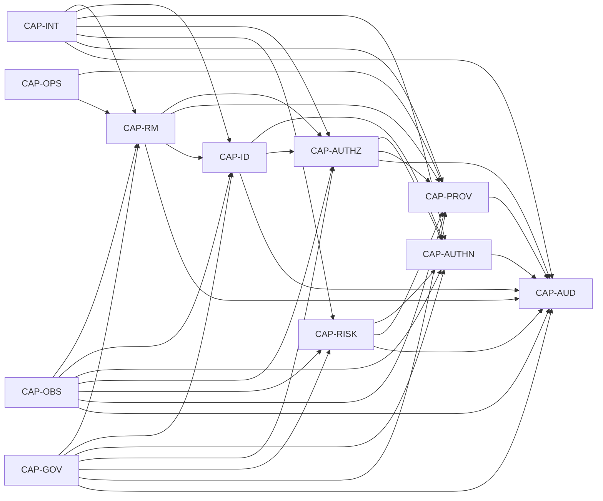
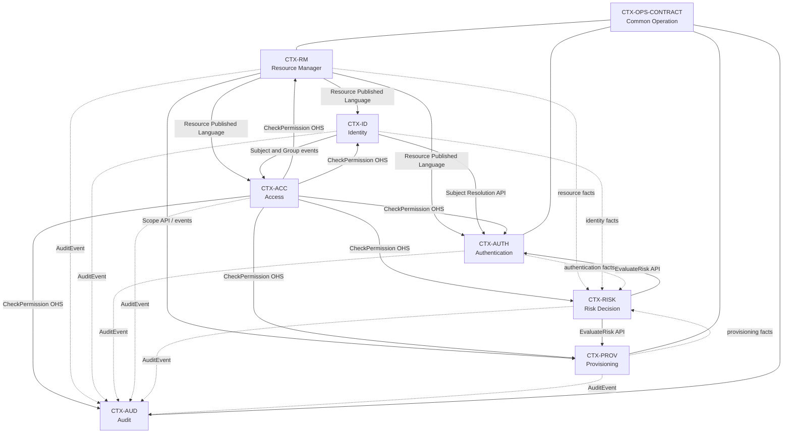

# M8 Platform Architecture & Domain Specification
_PADS-000 · Версия 0.8 · Базовая архитектура и предметная модель · 10 июля 2026 года_

| Field | Value |
| --- | --- |
| Document ID | PADS-000 |
| Version | 0.8 |
| Status | Проект базовой спецификации |
| Owner | Sergey Gorbachev |
| Platform | M8 Platform |
| Scope | Resource Manager, Identity, Authentication, Access, Risk Decision, Provisioning, Audit, Common Operation |
| Architecture style | Domain-Driven Design, Clean Architecture, API First, Event-Driven, Control Plane |
| Core stack | Go, Protobuf, ConnectRPC, buf.validate / Protovalidate, YDB, YDB Topics, Redis, Temporal, SpiceDB, Keycloak, OpenTelemetry |

> **Normative intent:** This document is the first source of truth for platform boundaries, domain language, ownership, requirements distribution and SPDD mapping. Any deviation must be recorded as an ADR.


---

# 0. Document Control

| Version | Date | Status | Description |
| --- | --- | --- | --- |
| 0.8 | 2026-07-10 | Draft baseline | Глава 8 переработана на русском языке: определены ограниченные контексты, типы отношений, опубликованные языки, синхронные и асинхронные зависимости, антикоррупционные слои, владельцы сквозных процессов и правила SPDD-трассировки. |
| 0.7 | 2026-07-10 | Draft baseline | Глава 7 переработана на русском языке: определены агрегаты, сущности, объекты-значения, инварианты, жизненные циклы, межконтекстные ссылки и правила трассировки предметной модели. |
| 0.6 | 2026-07-10 | Draft baseline | Глава 6 переработана на русском языке: определена карта бизнес-возможностей, их декомпозиция, владельцы, зависимости, зрелость и связь с требованиями и SPDD. |
| 0.5 | 2026-07-10 | Draft baseline | Глава 5 переработана на русском языке: определён единый язык предметной области, владельцы понятий, правила именования и проверки соответствия. |
| 0.4 | 2026-07-10 | Draft baseline | Глава 4 переработана на русском языке: определены 86 архитектурных принципов, проверки соответствия и порядок исключений через ADR. |
| 0.3 | 2026-07-10 | Draft baseline | Глава 3 переработана на русском языке: определены 36 целей проектирования, их приоритеты, механизмы и критерии проверки. |
| 0.2 | 2026-07-10 | Draft baseline | Главы 1 и 2 переработаны на русском языке и расширены до нормативной спецификации. |
| 0.1 | 2026-07-10 | Draft baseline | Initial PADS artifact: platform vision, domain model, context map, service boundaries, requirements model and SPDD mapping. |

## 0.1 How to use this document

PADS is a normative engineering specification. It should be read before writing requirements, protobuf contracts, implementation tasks, ADRs, SPDD prompts or generated code. It defines the vocabulary, service boundaries and architectural constraints that all subsequent artifacts must reference.

- Use section identifiers as stable anchors in requirements, ADRs, prompts and tests.
- Use MUST for mandatory constraints, SHOULD for strong defaults and MAY for allowed optional behavior.
- When a product decision conflicts with this document, create or update an ADR before implementation.
- Do not copy external system concepts directly into the domain model; use anti-corruption layers.

## 0.2 Normative language

| Term | Meaning |
| --- | --- |
| MUST | Mandatory rule. Implementation is invalid when the rule is violated. |
| MUST NOT | Mandatory prohibition. The system must not implement the described behavior. |
| SHOULD | Strong recommendation. Deviation requires documented reasoning. |
| MAY | Allowed option. Implementation may choose it when it does not violate mandatory rules. |


---

# Table of Contents

- 1. Назначение и область действия
- 2. Видение платформы
- 3. Цели проектирования
- 4. Архитектурные принципы
- 5. Единый язык предметной области
- 6. Карта бизнес-возможностей платформы
- 7. Модель предметной области
- 8. Карта контекстов
- 9. Bounded Context Specifications
- 10. Shared Kernel and Common Contracts
- 11. Data Ownership
- 12. API Design Rules
- 13. Event Design Rules
- 14. Integration and Consistency Model
- 15. Security Architecture
- 16. Long Running Operations
- 17. Error Model
- 18. Observability
- 19. Quality Attributes
- 20. Requirements Distribution
- 21. Traceability Model
- 22. SPDD Mapping
- 23. Architecture Governance
- 24. Glossary


---

# 1. Назначение и область действия

## 1.1. Назначение документа

Настоящий документ определяет базовую архитектуру, предметную модель и нормативные границы **M8 Platform**. Он устанавливает единый язык платформы, распределяет ответственность между ограниченными контекстами и сервисами, фиксирует правила владения данными, интеграционные принципы и путь трассировки требований от бизнес-возможности до реализации и проверки.

Документ является верхнеуровневой архитектурной спецификацией платформы. Он служит исходной точкой для подготовки:

- требований к платформе и отдельным сервисам;
- спецификаций ограниченных контекстов;
- контрактов API и событий;
- архитектурных решений ADR;
- моделей данных и состояний;
- сценариев использования и критериев приёмки;
- Structured Prompts в рамках SPDD;
- исходного кода, тестов и проверок архитектурного соответствия.

Документ не заменяет подробные спецификации сервисов, протоколы API, схемы событий, ADR и задачи реализации. Все такие артефакты **ДОЛЖНЫ** соответствовать настоящей спецификации и ссылаться на её устойчивые идентификаторы.

## 1.2. Нормативный статус

PADS является нормативной архитектурной спецификацией M8 Platform.

Требования документа применяются следующим образом:

- правило с уровнем **ДОЛЖЕН** или **НЕ ДОЛЖЕН** обязательно для исполнения;
- правило с уровнем **СЛЕДУЕТ** является архитектурным значением по умолчанию; отклонение требует обоснования;
- правило с уровнем **МОЖЕТ** определяет допустимый вариант реализации;
- противоречие между реализацией и PADS устраняется до выпуска изменения;
- осознанное отклонение от PADS оформляется отдельным ADR до начала реализации;
- внешний продукт, библиотека или поставщик технологии не может отменять правила PADS без принятого ADR.

При конфликте документов используется следующий порядок приоритета:

```text
Принятый ADR, явно изменяющий PADS
        ↓
Актуальная версия PADS
        ↓
Спецификация ограниченного контекста
        ↓
Спецификация сервиса или функции
        ↓
Контракт API или события
        ↓
Structured Prompt и задача реализации
        ↓
Исходный код
```

Если артефакт нижнего уровня противоречит артефакту верхнего уровня, он считается некорректным до устранения противоречия.

## 1.3. Целевая аудитория

Документ предназначен для:

| Роль | Как используется PADS |
| --- | --- |
| Архитектор платформы | Определение границ, принципов, моделей и допустимых зависимостей. |
| Владелец продукта | Проверка соответствия возможностей платформы бизнес-целям. |
| Руководитель разработки | Декомпозиция платформы на сервисы, команды и этапы реализации. |
| Системный аналитик | Формирование требований, сценариев, контрактов и матрицы трассировки. |
| Разработчик | Реализация сервисов в соответствии с предметными и архитектурными ограничениями. |
| Инженер по качеству | Вывод критериев приёмки, контрактных тестов и проверок архитектуры. |
| Инженер платформы | Развёртывание, наблюдаемость, безопасность и эксплуатация сервисов. |
| ИИ-агент разработки | Получение структурированного контекста и ограничений через SPDD. |

## 1.4. Предметная область платформы

M8 Platform представляет собой модульную платформу управления ресурсами, идентичностями, доступом, рисками и жизненным циклом управляемых сервисов. Она реализует функции управляющей плоскости и предоставляет повторно используемые возможности для внутренних и внешних прикладных систем.

Базовый состав платформы включает следующие ограниченные контексты:

| Ограниченный контекст | Предметная ответственность |
| --- | --- |
| Resource Manager | Иерархия Organization → Workspace → Project → Service и жизненный цикл ресурсов управления. |
| Identity | Пулы пользователей, пользователи, группы, членство и внешние идентичности. |
| Authentication | Проверка идентичности, транзакции аутентификации, испытания, повторная и усиленная аутентификация. |
| Access | Полномочия, роли, отношения субъектов и ресурсов, проверка и объяснение доступа. |
| Risk Decision | Сигналы риска, политики, оценка риска и решение о требуемом действии. |
| Provisioning | Жизненный цикл управляемых ресурсов, желаемое и наблюдаемое состояние, согласование и драйверы. |
| Audit | Неизменяемая история значимых действий, решений и изменений. |
| Common Operation | Единая модель длительных операций и их прогресса. |

## 1.5. Функциональная область действия

В базовую область действия входят следующие возможности.

### 1.5.1. Управление ресурсной иерархией

Платформа **ДОЛЖНА** поддерживать каноническую иерархию:

```text
Organization
└── Workspace
    └── Project
        └── Service
```

Resource Manager **ДОЛЖЕН** быть единственным владельцем идентификаторов, состояния и отношений вложенности этих ресурсов.

### 1.5.2. Управление идентичностями

Платформа **ДОЛЖНА** поддерживать:

- изолированные User Pool;
- пользователей и технические субъекты;
- группы;
- членство в ресурсных областях;
- привязку внешних идентичностей;
- блокировку, деактивацию и восстановление идентичности;
- сохранение исторических ссылок после удаления или обезличивания субъекта.

### 1.5.3. Аутентификация

Платформа **ДОЛЖНА** поддерживать независимую от поставщика предметную модель аутентификации, включая:

- запуск и получение состояния транзакции аутентификации;
- CIBA;
- OTP;
- подтверждение в доверенном приложении;
- WebAuthn и ключи доступа;
- OIDC и SAML через антикоррупционные адаптеры;
- повторную аутентификацию;
- усиленную аутентификацию;
- требуемый и достигнутый уровень подтверждения;
- отмену, истечение срока и повторную отправку испытания;
- безопасную передачу результата клиентскому приложению.

### 1.5.4. Управление доступом

Платформа **ДОЛЖНА** поддерживать:

- описание разрешений;
- роли и назначения ролей;
- отношения между субъектами и ресурсами;
- проверку доступа;
- пакетную проверку доступа;
- объяснение результата;
- моделирование предполагаемых изменений доступа;
- ревизию полномочий;
- интеграцию с графовым механизмом авторизации через антикоррупционный слой.

### 1.5.5. Принятие решений по риску

Платформа **ДОЛЖНА** принимать контекстные решения на основании сигналов риска. Минимальный набор результатов:

```text
ALLOW
DENY
CHALLENGE
REVIEW
```

Решение **ДОЛЖНО** содержать основание, применённую политику, требуемое действие и данные, необходимые для аудита и объяснения.

### 1.5.6. Предоставление и согласование ресурсов

Платформа **ДОЛЖНА** управлять желаемым состоянием внешних и внутренних ресурсов, поддерживать согласование состояния, повторные попытки, обнаружение отклонений, удаление и подключаемые драйверы поставщиков.

### 1.5.7. Аудит

Каждое значимое изменение состояния, решение безопасности и административное действие **ДОЛЖНО** формировать аудиторское событие. Аудиторская запись **НЕ ДОЛЖНА** изменяться после фиксации.

### 1.5.8. Длительные операции

Операции, выполнение которых может продолжаться после завершения исходного запроса, **ДОЛЖНЫ** представляться отдельным ресурсом `Operation`. Состояние операции не заменяет состояние предметного ресурса.

## 1.6. Системные границы

M8 Platform отвечает за предметные решения и управление жизненным циклом, но может делегировать техническое исполнение внешним системам.

| Внешняя система или технология | Роль относительно M8 | Граница ответственности |
| --- | --- | --- |
| Keycloak | Поставщик инфраструктуры аутентификации и федерации | Не является владельцем предметной модели M8 Authentication. |
| SpiceDB | Механизм хранения и вычисления графа авторизации | Не определяет публичный язык M8 Access. |
| Temporal | Исполнение длительных рабочих процессов | Не является владельцем состояния предметных агрегатов. |
| YDB | Основное хранилище данных сервисов | Не определяет границы агрегатов и сервисов. |
| YDB Topics | Транспорт событий платформы | Не определяет семантику доменных и интеграционных событий. |
| Redis | Вспомогательное временное хранилище и кэш | Не является системой записи для предметных данных. |
| Kubernetes и облачные API | Целевые среды предоставления ресурсов | Доступны только через драйверы и антикоррупционные адаптеры. |

Ни одна внешняя система **НЕ ДОЛЖНА** напрямую определять публичную модель данных, команды, события или состояния M8 Platform.

## 1.7. Что не входит в базовую редакцию

В базовую редакцию PADS не входят:

- окончательный дизайн пользовательских интерфейсов;
- биллинг, тарификация, выставление счетов и платежи как самостоятельный контекст;
- маркетинговая аналитика, корпоративное хранилище данных и BI;
- детальные манифесты Kubernetes и конфигурации инфраструктуры;
- внутренние таблицы и служебные схемы Keycloak, SpiceDB, Temporal и YDB;
- реализация конкретного поставщика SMS, электронной почты или Mobile ID;
- окончательная модель коммерческого распространения платформы;
- требования конкретного прикладного продукта, если они не выделены в платформенную возможность.

Исключение из базовой редакции не запрещает последующее расширение платформы. Новая область **ДОЛЖНА** пройти анализ предметной принадлежности и границ до включения в карту контекстов.

## 1.8. Основные допущения

Спецификация основывается на следующих допущениях:

1. M8 Platform развивается как набор независимо развёртываемых сервисов.
2. Каждый сервис имеет отдельное владение данными и не обращается напрямую к хранилищу другого сервиса.
3. Межсервисная согласованность в общем случае является итоговой.
4. Синхронное взаимодействие используется для решений, требующих немедленного ответа; распространение фактов выполняется событиями.
5. Все публичные контракты проектируются до реализации.
6. Архитектурные ограничения должны быть проверяемыми автоматически или через формализованный review prompt.
7. Разработка с использованием ИИ рассматривается как управляемый инженерный процесс, а не как источник неявных архитектурных решений.
8. Платформа должна поддерживать многоарендность и явное распространение ресурсной области запроса.

## 1.9. Ключевая архитектурная гипотеза

> **PADS-THESIS-001.** M8 Platform строится как совокупность сервисов, владеющих отдельными предметными областями. Каждый сервис владеет своим языком, инвариантами, данными и публичными контрактами. Keycloak, SpiceDB, Temporal, YDB, Kubernetes и другие технологии являются заменяемыми механизмами реализации за явно определёнными портами и адаптерами.

Из этой гипотезы следуют обязательные положения:

- границы сервисов определяются предметной ответственностью, а не таблицами или технологическими продуктами;
- один предметный факт имеет одного канонического владельца;
- внешняя модель поставщика переводится в язык M8 через антикоррупционный слой;
- межсервисные зависимости должны быть явными и трассируемыми;
- требования должны быть доведены до контрактов, тестов и Structured Prompts;
- код, созданный человеком или ИИ, не является источником архитектурной истины.

## 1.10. Критерии соответствия области действия

Функция относится к платформенному уровню, если выполняется хотя бы одно из условий:

- она используется несколькими прикладными сервисами или продуктами;
- она определяет общую ресурсную, идентификационную или защитную границу;
- она управляет жизненным циклом общеплатформенного ресурса;
- она обеспечивает единое соблюдение политик, аудита или требований безопасности;
- её дублирование в прикладных сервисах создаёт расхождение правил или риски безопасности.

Функция **НЕ СЛЕДУЕТ** включать в M8 Platform, если она отражает только бизнес-логику одного прикладного продукта и не образует повторно используемую платформенную возможность.

---

# 2. Видение платформы

## 2.1. Миссия

M8 Platform предоставляет единый набор повторно используемых возможностей для создания, защиты и эксплуатации цифровых продуктов. Платформа должна освободить прикладные команды от повторной реализации управления ресурсами, идентичностями, аутентификацией, авторизацией, рисками, аудитом и предоставлением инфраструктурных ресурсов.

Миссия платформы формулируется следующим образом:

> **Предоставить прикладным командам безопасную, наблюдаемую и расширяемую управляющую плоскость, в которой ресурсы, идентичности, полномочия, решения и операции представлены единообразно и управляются через стабильные контракты.**

## 2.2. Целевое состояние

В целевом состоянии M8 Platform должна обеспечивать:

- единый ресурсный контур `Organization → Workspace → Project → Service`;
- единый подход к регистрации и жизненному циклу платформенных сервисов;
- централизованные идентичности при сохранении изоляции пользовательских пулов;
- независимую от поставщиков оркестрацию аутентификации;
- централизованный граф полномочий и объяснимые решения доступа;
- адаптивную защиту на основании контекста и риска;
- декларативное предоставление и согласование управляемых ресурсов;
- неизменяемую и связанную с трассами историю действий;
- единый формат длительных операций;
- формальную трассировку от бизнес-требования до кода и теста;
- безопасное применение ИИ-агентов на основе контролируемого контекста.

## 2.3. Роль платформы в архитектуре продуктов

M8 Platform выступает как управляющая плоскость для прикладных систем.

```text
┌──────────────────────────────────────────────────────────────┐
│                    Прикладные продукты                       │
│  веб-приложения · мобильные приложения · внутренние сервисы │
└──────────────────────────────┬───────────────────────────────┘
                               │ API / SDK / Events
┌──────────────────────────────▼───────────────────────────────┐
│                         M8 Platform                          │
│ Resource Manager · Identity · Authentication · Access       │
│ Risk Decision · Provisioning · Audit · Operations           │
└──────────────────────────────┬───────────────────────────────┘
                               │ Ports / Adapters
┌──────────────────────────────▼───────────────────────────────┐
│                   Технологические механизмы                  │
│ Keycloak · SpiceDB · Temporal · YDB · Redis · Kubernetes    │
│ облачные API · поставщики OTP · OIDC/SAML · Mobile ID       │
└──────────────────────────────────────────────────────────────┘
```

Прикладной продукт взаимодействует с M8 через публичные контракты и **НЕ ДОЛЖЕН** зависеть от внутренних API технологических механизмов, используемых платформой.

## 2.4. Каноническая ресурсная модель

Ресурсная иерархия платформы:

```text
Organization
└── Workspace
    └── Project
        └── Service
```

### Organization

Верхняя административная, арендная и ресурсная граница. Organization объединяет рабочие пространства и определяет область верхнеуровневого управления.

### Workspace

Логическая группа проектов внутри Organization. Workspace может отражать продукт, направление, подразделение или другую устойчивую административную область.

### Project

Основная граница изоляции, полномочий, конфигурации и операционного управления. Большинство платформенных ресурсов должно иметь явную принадлежность к Project.

### Service

Зарегистрированная прикладная или платформенная возможность внутри Project. Service предоставляет идентичность сервиса, метаданные, принадлежность и точку привязки связанных ресурсов.

Ресурсная иерархия является канонической. Другие контексты **ДОЛЖНЫ** ссылаться на её идентификаторы, но **НЕ ДОЛЖНЫ** создавать собственные конкурирующие копии иерархии как источник истины.

## 2.5. Ключевые свойства платформы

| Свойство | Требование к M8 Platform |
| --- | --- |
| API First | Публичные контракты проектируются и согласуются до реализации. Основные интерфейсы описываются в Protobuf и предоставляются через ConnectRPC. |
| Domain First | Предметная модель и единый язык определяют границы сервисов; структура БД и API поставщиков не определяют архитектуру. |
| Clean Architecture | Зависимости направлены внутрь. Предметный и прикладной слои не импортируют типы транспорта, хранилища, SDK и инфраструктурных продуктов. |
| Event Driven | Изменения состояния публикуются как факты. Сервисы поддерживают локальную согласованность и используют события для распространения изменений. |
| Control Plane | Платформа управляет политиками, желаемым состоянием, операциями и жизненным циклом, а не ограничивается синхронными CRUD-вызовами. |
| Secure by Design | Идентичность, полномочия, риск, область ресурса и инициатор учитываются до выполнения защищённого изменения. |
| Observable by Design | Запросы, команды, решения, события, операции и рабочие процессы имеют метрики, журналы, трассы и корреляционные идентификаторы. |
| Auditable by Design | Значимые действия и решения образуют неизменяемую историю с указанием инициатора, цели, контекста и результата. |
| Automation First | Повторяемые операции предоставления, проверки и управления должны быть доступны через API и автоматизированные рабочие процессы. |
| AI Native | Архитектура и требования представляются в форме, пригодной для безопасного преобразования в Structured Prompts и автоматической проверки результата. |
| Composable | Возможности платформы могут использоваться независимо и комбинироваться через стабильные контракты. |
| Extensible | Новые поставщики, драйверы, политики и способы аутентификации подключаются через порты, адаптеры и расширяемые реестры. |

## 2.6. Стратегические принципы развития

### 2.6.1. Resource Manager как основа управляющей плоскости

Resource Manager создаётся первым и становится каноническим владельцем Organization, Workspace, Project и Service. Остальные сервисы используют его идентификаторы и события для определения ресурсной области.

### 2.6.2. Разделение Identity, Authentication и Access

Identity, Authentication и Access развиваются как отдельные ограниченные контексты, поскольку имеют разные модели, инварианты, жизненные циклы и зависимости.

- Identity отвечает на вопрос: **кто представлен в системе**;
- Authentication отвечает на вопрос: **как подтверждена идентичность**;
- Access отвечает на вопрос: **что субъекту разрешено сделать**.

Объединение этих обязанностей в один сервис **НЕ ДОПУСКАЕТСЯ** без пересмотра карты контекстов и отдельного ADR.

### 2.6.3. Независимость от Keycloak

Keycloak может использоваться как инфраструктурный механизм федерации, CIBA, OIDC, SAML и управления сессиями. Публичная модель M8 Authentication **НЕ ДОЛЖНА** содержать внутренние сущности, состояния и идентификаторы Keycloak, кроме явно определённых внешних ссылок адаптера.

### 2.6.4. Независимость от SpiceDB

SpiceDB используется для хранения и вычисления графа отношений. M8 Access оперирует собственными понятиями Subject, Resource, Permission, Role и Relationship. Tuple-модель SpiceDB остаётся внутренней моделью адаптера.

### 2.6.5. Независимость от Temporal

Temporal используется для исполнения длительных и восстанавливаемых процессов. Предметный агрегат не должен зависеть от Workflow ID, Activity и других типов Temporal. Состояние рабочего процесса не заменяет состояние предметного ресурса или `Operation`.

### 2.6.6. YDB как система записи сервисов

YDB используется как основное хранилище предметных данных сервисов. Каждый сервис имеет собственное логическое владение таблицами. Совместное использование базы не означает совместного владения данными.

YDB Topics является основным транспортом внутренних событий платформы, если иной транспорт не утверждён ADR.

### 2.6.7. Контролируемая разработка с ИИ

ИИ-агенты используются только после формализации:

- предметного контекста;
- требований;
- области допустимых изменений;
- архитектурных ограничений;
- публичных контрактов;
- критериев приёмки;
- обязательных тестов.

ИИ-агент **НЕ ДОЛЖЕН** самостоятельно изменять границы контекстов, публичные контракты или архитектурные принципы в рамках задачи реализации.

## 2.7. Ценностное предложение

### Для прикладных команд

- сокращение времени запуска новых сервисов;
- отсутствие необходимости повторно реализовывать IAM и управляющую плоскость;
- единые SDK, контракты и модели ошибок;
- готовые механизмы аудита, наблюдаемости и длительных операций.

### Для владельцев платформы

- централизованное управление политиками и ресурсами;
- единый стандарт безопасности;
- контролируемая эволюция контрактов;
- измеримая трассировка требований и реализации;
- возможность заменять технологических поставщиков без изменения прикладных контрактов.

### Для эксплуатации и безопасности

- единый контекст инициатора и ресурса;
- сквозная корреляция запросов, событий и операций;
- объяснимые решения доступа и риска;
- неизменяемая история изменений;
- автоматизируемое управление жизненным циклом.

## 2.8. Принципы пользовательского опыта API

Публичные интерфейсы M8 Platform должны быть:

- единообразными между сервисами;
- предсказуемыми по именованию и ошибкам;
- идемпотентными для повторяемых изменений;
- пригодными для синхронного и асинхронного использования;
- безопасными по умолчанию;
- наблюдаемыми без дополнительной интеграции;
- совместимыми с автоматической генерацией SDK;
- пригодными для использования человеком, сервисом и ИИ-агентом.

## 2.9. Критерии достижения видения

Видение считается реализованным, когда:

1. прикладной сервис может зарегистрироваться в Project и получить устойчивую сервисную идентичность;
2. пользователь или технический субъект может пройти аутентификацию без зависимости клиента от конкретного поставщика;
3. доступ к ресурсу проверяется через единый M8 Access API и может быть объяснён;
4. Risk Decision может потребовать дополнительное подтверждение без встраивания риск-логики в Authentication;
5. управляемый ресурс создаётся декларативно и сопровождается длительной операцией;
6. каждое значимое действие доступно в аудите и связано с трассой выполнения;
7. сервисы не обращаются напрямую к данным друг друга;
8. замена Keycloak, SpiceDB или драйвера предоставления не требует изменения предметных контрактов прикладных клиентов;
9. каждое реализованное требование связано с контрактом, Structured Prompt и проверяющим тестом;
10. архитектурные нарушения обнаруживаются до выпуска изменения.

## 2.10. Ограничения видения

M8 Platform не должна превращаться в универсальный монолит, содержащий бизнес-логику всех продуктов. Платформа предоставляет общие механизмы и политики, но не владеет специфичными для конкретного продукта понятиями, если они не стали повторно используемой платформенной возможностью.

Расширяемость не означает отсутствие границ. Каждый новый модуль должен иметь:

- явную предметную ответственность;
- владельца данных;
- устойчивый язык;
- входящие и исходящие зависимости;
- обоснование выделения ограниченного контекста;
- требования к безопасности, аудиту и наблюдаемости;
- место в карте контекстов и матрице трассировки.

---

# 3. Цели проектирования

## 3.1. Назначение целей проектирования

Цели проектирования определяют свойства, которые архитектура M8 Platform должна сохранять на протяжении всего жизненного цикла платформы. Они связывают видение платформы с конкретными архитектурными принципами, границами ограниченных контекстов, требованиями к сервисам и критериями проверки реализации.

Цели проектирования отвечают на вопрос **«какого результата должна достигать архитектура»**. Архитектурные принципы, определённые в главе 4, отвечают на вопрос **«какими обязательными правилами этот результат обеспечивается»**.

Каждая цель имеет устойчивый идентификатор `DG-NNN`, который **ДОЛЖЕН** использоваться в:

- ADR, изменяющих или уточняющих архитектурное решение;
- требованиях к платформе и сервисам;
- спецификациях ограниченных контекстов;
- Structured Prompts;
- архитектурных проверках и review prompts;
- критериях готовности функций и сервисов.

Цель проектирования не является задачей реализации и не закрывается однократно. Она представляет постоянное свойство архитектуры, которое должно сохраняться при каждом изменении системы.

## 3.2. Приоритет целей

При конфликте целей применяется следующий порядок приоритета:

```text
1. Безопасность, конфиденциальность и целостность данных
2. Корректность предметных инвариантов
3. Изоляция владельцев данных и ограниченных контекстов
4. Совместимость публичных контрактов
5. Восстанавливаемость и управляемость эксплуатации
6. Наблюдаемость и аудит
7. Производительность и масштабируемость
8. Скорость разработки и удобство реализации
```

Решение, которое повышает скорость разработки, но нарушает безопасность, предметный инвариант, владение данными или совместимость публичного контракта, **НЕ ДОЛЖНО** приниматься.

Конфликт целей, который невозможно разрешить применением указанного порядка, **ДОЛЖЕН** быть оформлен ADR. ADR должен перечислять затронутые цели, выбранный компромисс, последствия и условия пересмотра решения.

## 3.3. Цели предметной архитектуры

### DG-001. Единственный владелец предметного понятия

Каждое каноническое предметное понятие **ДОЛЖНО** иметь ровно один ограниченный контекст-владелец и один сервис, ответственный за его запись и жизненный цикл.

Другие сервисы могут хранить только:

- ссылки на идентификатор владельца;
- локальные проекции;
- кэш;
- исторические снимки, необходимые для аудита;
- производные данные, не конкурирующие с канонической моделью.

**Ожидаемый результат:** отсутствуют несколько сервисов, способных независимо изменить один и тот же предметный факт.

**Проверка:** матрица владения данными не содержит нескольких владельцев одной сущности или атрибута.

### DG-002. Границы определяются предметной ответственностью

Сервис и ограниченный контекст **ДОЛЖНЫ** выделяться на основании языка, инвариантов, жизненного цикла и ответственности, а не на основании таблицы, очереди, библиотеки, команды разработки или технологического продукта.

**Ожидаемый результат:** границы Resource Manager, Identity, Authentication, Access, Risk Decision, Provisioning и Audit остаются устойчивыми при замене технологий реализации.

**Проверка:** описание каждого сервиса содержит его предметную ответственность, владельцев данных, инварианты и запрещённые обязанности.

### DG-003. Единый и недвусмысленный язык

Каждое значимое понятие платформы **ДОЛЖНО** иметь согласованное имя и определение. Один термин не должен обозначать разные понятия внутри одного ограниченного контекста, а разные термины не должны использоваться как неявные синонимы одного понятия.

**Ожидаемый результат:** требования, API, события, код и документация используют одинаковый язык.

**Проверка:** новые публичные термины добавлены в Ubiquitous Language до появления в контрактах.

### DG-004. Инварианты защищаются владельцем агрегата

Каждый предметный инвариант **ДОЛЖЕН** проверяться внутри контекста-владельца и не должен зависеть от того, что внешний клиент правильно повторит правило.

**Ожидаемый результат:** недопустимое состояние невозможно зафиксировать через любой публичный или внутренний путь изменения.

**Проверка:** для каждого агрегата существует перечень инвариантов и тесты на их нарушение.

### DG-005. Малые и целевые агрегаты

Агрегат **ДОЛЖЕН** защищать только те инварианты, которые требуют одной локальной транзакции. Агрегат не должен превращаться в транзакционную оболочку всего сервиса или ресурсной иерархии.

**Ожидаемый результат:** агрегаты остаются управляемыми, конкурентные изменения минимально конфликтуют, а масштабирование не требует глобальных блокировок.

**Проверка:** границы агрегата обоснованы конкретными инвариантами, а не удобством загрузки связанных данных.

### DG-006. Явные модели жизненного цикла

Ресурсы с нетривиальным жизненным циклом **ДОЛЖНЫ** иметь документированную модель состояний, допустимых переходов, причин отказа и терминальных состояний.

**Ожидаемый результат:** состояние Authentication Transaction, Managed Resource, Operation, User и других жизненных циклов изменяется предсказуемо.

**Проверка:** переходы состояний покрыты таблицей переходов и тестами, включая запрещённые переходы.

## 3.4. Цели модульности и независимого развития

### DG-007. Независимое развитие сервисов

Сервис **ДОЛЖЕН** иметь возможность изменяться, выпускаться и масштабироваться независимо, пока сохраняется совместимость его публичных контрактов.

**Ожидаемый результат:** изменение внутренней реализации одного сервиса не требует синхронного выпуска всей платформы.

**Проверка:** межсервисные зависимости представлены только версионируемыми API, событиями или явно определёнными шлюзами.

### DG-008. Явные межконтекстные зависимости

Каждая зависимость между ограниченными контекстами **ДОЛЖНА** быть отражена в карте контекстов и классифицирована по направлению, типу взаимодействия и модели ответственности.

**Ожидаемый результат:** отсутствуют скрытые зависимости через общую БД, общий кэш, внутренние таблицы или неформальные соглашения.

**Проверка:** обнаруженная во время реализации зависимость, отсутствующая в Context Map, блокирует выпуск до обновления спецификации или удаления зависимости.

### DG-009. Независимость предметной модели от поставщика

Keycloak, SpiceDB, Temporal, YDB, Redis, Kubernetes, облачный API и другие продукты **НЕ ДОЛЖНЫ** определять публичную предметную модель M8 Platform.

**Ожидаемый результат:** замена поставщика не требует изменения основных понятий, сценариев и контрактов прикладных клиентов.

**Проверка:** типы и названия внешнего SDK отсутствуют в доменном слое и публичных предметных контрактах, если они не являются сознательно принятым стандартом платформы.

### DG-010. Минимальный общий слой

Общие библиотеки и Shared Kernel **ДОЛЖНЫ** содержать только действительно стабильные технические или семантические элементы, необходимые нескольким сервисам. Они не должны становиться способом скрытого объединения предметных моделей.

**Ожидаемый результат:** сервисы сохраняют независимость и не требуют массового выпуска из-за изменения общей бизнес-логики.

**Проверка:** добавление предметного типа в общий модуль требует отдельного обоснования и проверки владельца понятия.

### DG-011. Компонуемость возможностей

Каждая основная возможность платформы **СЛЕДУЕТ** проектировать так, чтобы она могла использоваться отдельно и совместно с другими возможностями через стабильные контракты.

**Ожидаемый результат:** продукт может использовать, например, Resource Manager и Audit без обязательного внедрения всех остальных модулей, если его сценарий это допускает.

**Проверка:** необязательная зависимость не превращается в обязательную только из-за удобства реализации.

## 3.5. Цели данных и согласованности

### DG-012. Локальная транзакционная согласованность

Одна транзакция **ДОЛЖНА** изменять только данные одного сервиса-владельца. Распределённые транзакции между сервисами не являются допустимой основой архитектуры.

**Ожидаемый результат:** отказ или недоступность внешнего сервиса не оставляет локальную транзакцию в неопределённом состоянии.

**Проверка:** транзакционный контур не включает БД, очередь или ресурс другого сервиса.

### DG-013. Управляемая итоговая согласованность

Межсервисная согласованность **ДОЛЖНА** достигаться через события, повторяемые команды, процесс-менеджеры, рабочие процессы и компенсации. Для каждой такой цепочки должны быть определены промежуточные состояния и поведение при сбоях.

**Ожидаемый результат:** система способна завершить или компенсировать многошаговый процесс после временных отказов.

**Проверка:** процесс имеет владельца, идентификатор корреляции, политику повторов, тайм-аут, дедупликацию и сценарий ручного восстановления.

### DG-014. Надёжная публикация фактов

Факт об изменении состояния **НЕ ДОЛЖЕН** быть потерян между фиксацией предметного изменения и публикацией интеграционного события.

**Ожидаемый результат:** событие публикуется как следствие зафиксированного состояния и может быть безопасно опубликовано повторно.

**Проверка:** применён транзакционный Outbox либо другой механизм с эквивалентными гарантиями, зафиксированный ADR.

### DG-015. Идемпотентность повторяемых операций

Команды и обработчики, для которых возможна повторная доставка, **ДОЛЖНЫ** обеспечивать идемпотентный результат или явно документировать, почему это невозможно.

**Ожидаемый результат:** сетевой повтор, повторная доставка события или восстановление рабочего процесса не создаёт дублирующий предметный результат.

**Проверка:** определены ключ идемпотентности, область его уникальности, срок хранения и ответ при повторе.

### DG-016. Оптимистичное управление конкурентными изменениями

Конкурентные изменения агрегатов **СЛЕДУЕТ** контролировать версией или эквивалентным условием сравнения состояния. Неявная перезапись более нового состояния устаревшим запросом недопустима.

**Ожидаемый результат:** конфликт изменений обнаруживается и возвращается вызывающей стороне как явный результат.

**Проверка:** команды изменения содержат или используют ожидаемую версию там, где возможна конкурентная запись.

### DG-017. Разделение системы записи и проекций

Каноническая модель записи **ДОЛЖНА** отличаться от поисковых, аналитических и интерфейсных проекций, если их требования различаются. Проекция не становится владельцем предметного факта.

**Ожидаемый результат:** чтение оптимизируется без нарушения владения и инвариантов модели записи.

**Проверка:** для каждой проекции определены источник, версия, задержка обновления и способ полного восстановления.

## 3.6. Цели контрактов и совместимости

### DG-018. Контракт предшествует реализации

Публичный API, событие или расширяемый интерфейс **ДОЛЖЕН** быть специфицирован и рассмотрен до реализации поведения, которое от него зависит.

**Ожидаемый результат:** реализация следует согласованному контракту, а не формирует его случайно из внутренних структур кода.

**Проверка:** задача реализации с публичным взаимодействием ссылается на утверждённую версию контракта.

### DG-019. Обратная совместимость публичных контрактов

Публичные контракты **ДОЛЖНЫ** развиваться без нарушения существующих клиентов в пределах заявленного периода поддержки.

Запрещается без новой несовместимой версии:

- изменять смысл существующего поля;
- повторно использовать удалённый номер поля Protobuf;
- превращать необязательное поле в обязательное;
- удалять поддерживаемое значение перечисления без стратегии совместимости;
- менять семантику успешного ответа или ошибки.

**Ожидаемый результат:** сервисы и клиенты могут выпускаться независимо.

**Проверка:** изменения проходят автоматическую проверку совместимости схем и контрактные тесты.

### DG-020. Стабильная модель ошибок

Ошибки **ДОЛЖНЫ** представлять устойчивые предметные и платформенные причины, а не текст исключения конкретной библиотеки или БД.

**Ожидаемый результат:** клиент может программно принять решение о повторе, исправлении запроса, повторной аутентификации или прекращении операции.

**Проверка:** ошибка имеет стабильный код, категорию, повторяемость, безопасное сообщение и корреляционный идентификатор.

### DG-021. Единообразие публичного API

Публичные API сервисов **ДОЛЖНЫ** следовать единым правилам именования, пагинации, фильтрации, масок изменений, идемпотентности, длительных операций, ошибок и метаданных запроса.

**Ожидаемый результат:** использование нового сервиса не требует изучения уникальных базовых соглашений.

**Проверка:** контракт проходит общий API lint и архитектурный review.

## 3.7. Цели безопасности и доверия

### DG-022. Безопасность до изменения состояния

Полномочия, область ресурса и необходимые решения риска **ДОЛЖНЫ** быть проверены до выполнения защищённого изменения, если спецификация сценария не требует иной последовательности.

**Ожидаемый результат:** недоверенный субъект не может инициировать необратимое предметное изменение до завершения обязательных проверок.

**Проверка:** сценарий явно показывает место Authentication, Access и Risk Decision относительно команды изменения.

### DG-023. Явный контекст безопасности

Каждый защищённый запрос **ДОЛЖЕН** иметь достаточный контекст для определения инициатора, субъекта, клиента, ресурсной области, цели, уровня подтверждения и корреляции.

Минимальный набор контекста определяется конкретным API, но не должен восстанавливаться из скрытого глобального состояния.

**Ожидаемый результат:** решение может быть воспроизведено, объяснено и связано с аудитом.

**Проверка:** обязательные поля контекста задокументированы и валидируются на границе сервиса.

### DG-024. Минимальные полномочия по умолчанию

Отсутствие явно подтверждённого разрешения **ДОЛЖНО** трактоваться как запрет. Сервисные учётные данные, роли и операционные доступы должны выдаваться с минимально необходимыми полномочиями.

**Ожидаемый результат:** компрометация одного компонента не предоставляет ему неограниченный доступ ко всей платформе.

**Проверка:** права сервиса соответствуют его карте зависимостей и не включают прямой доступ к чужим хранилищам.

### DG-025. Объяснимые решения безопасности

Решения Access и Risk Decision **ДОЛЖНЫ** иметь объяснимую форму, достаточную для аудита, поддержки и расследования, без раскрытия чувствительных внутренних правил неавторизованному клиенту.

**Ожидаемый результат:** администратор может понять основание решения, а внешний клиент получает безопасный и стабильный ответ.

**Проверка:** разделены внутреннее объяснение, аудиторские данные и публичное сообщение.

### DG-026. Защита чувствительных данных

Секреты, учётные данные, токены, персональные и иные чувствительные данные **ДОЛЖНЫ** минимизироваться, классифицироваться и защищаться на всём пути обработки.

**Ожидаемый результат:** сервис не хранит данные, которые не нужны для его предметной ответственности, а журналы и события не содержат секретов.

**Проверка:** для контракта и модели данных определены классификация, маскирование, срок хранения и правила удаления.

## 3.8. Цели эксплуатации и устойчивости

### DG-027. Наблюдаемость по умолчанию

Каждый запрос, команда, событие, решение, длительная операция и рабочий процесс **ДОЛЖНЫ** быть наблюдаемыми через согласованные журналы, метрики и трассы.

**Ожидаемый результат:** оператор может определить, что произошло, где произошёл сбой, какой ресурс и субъект затронуты и как связаны этапы процесса.

**Проверка:** определены `trace_id`, `request_id`, `correlation_id`, `causation_id`, `operation_id` и предметные идентификаторы, применимые к сценарию.

### DG-028. Неизменяемый и полный аудит

Значимые административные, защитные и предметные действия **ДОЛЖНЫ** формировать неизменяемую аудиторскую запись с инициатором, целью, действием, контекстом, решением и результатом.

**Ожидаемый результат:** история не зависит от текущего состояния ресурса и пригодна для расследований и подтверждения соблюдения правил.

**Проверка:** перечень аудируемых действий является частью спецификации сервиса, а потеря обязательного события обнаруживается.

### DG-029. Управляемые длительные операции

Операция, которая может пережить исходный запрос, зависеть от внешних систем или требовать повторов, **ДОЛЖНА** иметь отдельный ресурс `Operation` с состоянием, прогрессом, результатом и ошибкой.

**Ожидаемый результат:** клиент не удерживает соединение и может безопасно получить итог после перезапуска или временной недоступности.

**Проверка:** ресурс Operation отделён от предметного ресурса и не используется как замена его жизненному циклу.

### DG-030. Восстановление после частичных отказов

Сервис и межсервисный процесс **ДОЛЖНЫ** иметь определённое поведение при тайм-ауте, повторе, недоступности зависимости, частичном выполнении и восстановлении после перезапуска.

**Ожидаемый результат:** временный отказ не требует ручного изменения данных в штатном сценарии.

**Проверка:** определены политики повторов, пределы повторов, dead-letter или карантин, компенсация и операционная процедура.

### DG-031. Горизонтальная масштабируемость

Сервисы без документированного исключения **СЛЕДУЕТ** проектировать без локального незаменимого состояния экземпляра, препятствующего горизонтальному масштабированию.

**Ожидаемый результат:** увеличение нагрузки обслуживается добавлением экземпляров и масштабированием соответствующего хранилища или очереди.

**Проверка:** сессии, блокировки, очереди и координаторы имеют распределённую или внешнюю модель хранения.

### DG-032. Изоляция отказов

Отказ одного ограниченного контекста **НЕ ДОЛЖЕН** автоматически приводить к полной недоступности остальных возможностей платформы, если их сценарии не требуют этой зависимости.

**Ожидаемый результат:** деградация имеет контролируемую область, а клиент получает явный статус вместо каскадного зависания.

**Проверка:** определены тайм-ауты, ограничение конкуренции, circuit breaker там, где он оправдан, и режим деградации.

## 3.9. Цели разработки, проверки и SPDD

### DG-033. Полная трассировка требования

Каждое реализованное функциональное требование **ДОЛЖНО** быть связано как минимум с:

```text
Business Capability
        ↓
Platform или Context Requirement
        ↓
Use Case
        ↓
API / Event / State Contract
        ↓
Structured Prompt или инженерная задача
        ↓
Code Change
        ↓
Verification Test
```

**Ожидаемый результат:** можно определить, почему существует каждая значимая часть реализации и чем подтверждается её корректность.

**Проверка:** матрица трассировки не содержит реализованных требований без теста и изменений без исходного требования или ADR.

### DG-034. Проверяемые архитектурные ограничения

Обязательное архитектурное правило **СЛЕДУЕТ** выражать в форме, пригодной для автоматической проверки. Когда автоматическая проверка невозможна, правило должно иметь формализованный review prompt и обязательный результат ревью.

**Ожидаемый результат:** архитектурная деградация обнаруживается до выпуска, а не после накопления нарушений.

**Проверка:** для правила указано средство проверки: тест, линтер, анализ зависимостей, контрактная проверка или review checklist.

### DG-035. Управляемое применение ИИ

ИИ-агент **НЕ ДОЛЖЕН** самостоятельно изменять архитектурные границы, публичные контракты, инварианты или модель безопасности без явного требования и соответствующего ADR либо утверждённой спецификации.

Structured Prompt **ДОЛЖЕН** задавать:

- цель изменения;
- область разрешённых файлов и компонентов;
- применимые требования и решения;
- предметные инварианты;
- разрешённые и запрещённые зависимости;
- ожидаемые контракты;
- обязательные тесты;
- критерии завершения;
- формат отчёта о результате.

**Ожидаемый результат:** результат ИИ воспроизводим, ограничен и проверяем теми же правилами, что и работа человека.

**Проверка:** изменение, выполненное ИИ, ссылается на Structured Prompt и проходит независимый review prompt или ревью специалиста.

### DG-036. Документация изменяется вместе с системой

Изменение предметной модели, публичного поведения, границ, зависимости или архитектурного решения **ДОЛЖНО** сопровождаться изменением соответствующей спецификации в той же поставке.

**Ожидаемый результат:** документация отражает действующее состояние системы, а не историческое намерение.

**Проверка:** Definition of Done содержит проверку актуальности PADS, Context Specification, ADR, контрактов и каталога событий.

## 3.10. Матрица целей и основных механизмов

| Группа целей | Основные цели | Основные механизмы реализации |
| --- | --- | --- |
| Предметная целостность | DG-001—DG-006 | Bounded Context, Aggregate, Ubiquitous Language, state machine, domain tests. |
| Независимость модулей | DG-007—DG-011 | Context Map, API, events, ports and adapters, минимальный Shared Kernel. |
| Данные и согласованность | DG-012—DG-017 | Database per service, Outbox, Inbox, idempotency, optimistic locking, projections. |
| Контракты | DG-018—DG-021 | Protobuf, ConnectRPC, schema compatibility, API lint, contract tests. |
| Безопасность | DG-022—DG-026 | Authentication, Access, Risk Decision, explicit context, least privilege, data classification. |
| Эксплуатация | DG-027—DG-032 | OpenTelemetry, Audit, Operation, Temporal, retries, isolation and recovery patterns. |
| Управление разработкой | DG-033—DG-036 | Traceability matrix, architecture tests, SPDD, ADR and Definition of Done. |

## 3.11. Проверка достижения целей

Цели проектирования проверяются на четырёх уровнях.

### 3.11.1. Уровень спецификации

Перед реализацией должно быть подтверждено:

- определён владелец предметного понятия;
- определены границы и зависимости контекста;
- описаны инварианты и жизненный цикл;
- определены API, события и ошибки;
- указаны применимые цели `DG-*`;
- установлены критерии приёмки.

### 3.11.2. Уровень реализации

В коде проверяются:

- направление зависимостей;
- отсутствие доступа к чужому хранилищу;
- соблюдение транзакционных границ;
- идемпотентность и конкурентное изменение;
- отсутствие утечки внешних типов в доменную модель;
- формирование аудита и телеметрии.

### 3.11.3. Уровень интеграции

В интеграционных и контрактных тестах проверяются:

- совместимость API и событий;
- повторная доставка;
- восстановление после частичного сбоя;
- итоговая согласованность;
- тайм-ауты и режим деградации;
- правильность межконтекстной последовательности.

### 3.11.4. Уровень эксплуатации

В рабочей среде проверяются:

- достижение SLO;
- полнота аудита;
- наличие и связность трасс;
- доля ошибок и повторов;
- задержка доставки событий и обновления проекций;
- возможность восстановления без прямого редактирования данных.

## 3.12. Критерии готовности архитектурного решения

Архитектурное решение может быть принято к реализации, если:

1. перечислены цели `DG-*`, которые оно поддерживает или затрагивает;
2. указаны сознательные компромиссы и нарушаемые значения по умолчанию;
3. определён владелец данных и транзакционная граница;
4. определены входящие и исходящие зависимости;
5. описано поведение при отказах и повторах;
6. определены безопасность, аудит и наблюдаемость;
7. подтверждена совместимость публичных контрактов;
8. определён способ автоматической или формализованной проверки;
9. обновлена матрица трассировки;
10. при отклонении от PADS создан и принят ADR.

---

# 4. Архитектурные принципы

## 4.1. Назначение главы

Архитектурные принципы определяют обязательные правила проектирования, реализации, интеграции и эксплуатации M8 Platform. Они преобразуют цели проектирования `DG-*` в проверяемые инженерные ограничения и используются как нормативная основа для:

- определения границ ограниченных контекстов и сервисов;
- проектирования агрегатов, API, событий и моделей хранения;
- принятия архитектурных решений ADR;
- декомпозиции требований и подготовки Structured Prompts;
- архитектурного review исходного кода;
- автоматических проверок совместимости и направления зависимостей;
- оценки готовности изменения к выпуску.

Каждый принцип имеет устойчивый идентификатор `AP-NNN`. Ссылки на принцип **ДОЛЖНЫ** сохраняться при его уточнении. Изменение смысла действующего принципа требует новой версии PADS и записи в журнале изменений.

Архитектурный принцип описывает не конкретную технологию, а обязательное свойство системы. Технологическое решение допустимо только тогда, когда оно обеспечивает соответствие применимым принципам.

## 4.2. Обязательность и область применения

Принципы применяются ко всем сервисам, библиотекам, адаптерам, контрактам, рабочим процессам и поставляемым изменениям M8 Platform, если конкретный принцип не ограничен отдельной областью.

Используются следующие уровни обязательности:

| Формулировка | Значение |
| --- | --- |
| **ДОЛЖЕН / НЕ ДОЛЖЕН** | Обязательное требование или запрет. Нарушение блокирует выпуск без принятого ADR. |
| **СЛЕДУЕТ / НЕ СЛЕДУЕТ** | Архитектурное значение по умолчанию. Отклонение требует обоснования в спецификации или ADR. |
| **МОЖЕТ** | Допустимый вариант, если он не нарушает обязательные правила. |

Архитектурный принцип считается применимым к изменению, если изменение затрагивает хотя бы один из следующих аспектов:

- предметную модель или инвариант;
- владельца данных;
- межсервисную зависимость;
- публичный API или событие;
- модель согласованности;
- безопасность, аудит или обработку чувствительных данных;
- длительный процесс или операционное состояние;
- масштабирование, отказоустойчивость или наблюдаемость;
- генерацию реализации ИИ-агентом.

## 4.3. Порядок разрешения конфликтов

Если несколько принципов приводят к различным вариантам решения, применяется следующий порядок:

1. безопасность и защита данных;
2. корректность предметных инвариантов;
3. владение данными и изоляция контекстов;
4. совместимость публичных контрактов;
5. восстанавливаемость и эксплуатационная управляемость;
6. наблюдаемость и аудит;
7. производительность;
8. удобство разработки.

Конфликт, не разрешимый этим порядком, **ДОЛЖЕН** быть оформлен ADR. ADR должен указать:

- конфликтующие принципы;
- выбранный вариант;
- причины невозможности полного соблюдения;
- риски и компенсирующие меры;
- срок или условие пересмотра решения.

## 4.4. Принципы предметных границ и владения

### AP-001. Один канонический владелец предметного факта

Каждый канонический предметный факт **ДОЛЖЕН** иметь ровно один ограниченный контекст и один сервис, имеющий право изменять этот факт.

Другие сервисы **МОГУТ** хранить ссылку, кэш, проекцию или исторический снимок, но **НЕ ДОЛЖНЫ** позиционировать их как конкурирующий источник истины.

**Проверка:** в матрице владения данными для каждого типа ресурса, состояния и атрибута указан один владелец записи.

### AP-002. Граница сервиса определяется предметной ответственностью

Сервис **ДОЛЖЕН** выделяться на основании собственного языка, инвариантов, жизненного цикла и ответственности. Таблица, очередь, фреймворк, команда разработки или внешняя технология сами по себе не являются основанием для выделения сервиса.

**Проверка:** спецификация сервиса содержит назначение, владельцев данных, агрегаты, инварианты и явно исключённые обязанности.

### AP-003. База данных принадлежит сервису

Сервис **ДОЛЖЕН** иметь логически изолированную область хранения и быть единственным владельцем записи в свои таблицы, индексы и служебные структуры.

Физическое размещение таблиц нескольких сервисов в одном кластере YDB **НЕ ОЗНАЧАЕТ** совместного владения данными.

**Проверка:** права доступа к таблицам ограничены сервисом-владельцем и операционными процедурами восстановления.

### AP-004. Запрещён прямой доступ к данным другого сервиса

Сервис **НЕ ДОЛЖЕН** читать или изменять таблицы, кэш, внутренние топики, снимки или служебные структуры другого сервиса напрямую.

Допустимые способы получения данных:

- публичный API владельца;
- опубликованное интеграционное событие;
- согласованная локальная проекция;
- специально определённый экспорт данных;
- аварийная операционная процедура, не являющаяся частью бизнес-потока.

**Проверка:** сетевые и хранилищные политики исключают межсервисный доступ к чужим таблицам.

### AP-005. Внешняя ссылка вместо копирования владения

Если сервис использует ресурс другого контекста, он **ДОЛЖЕН** хранить устойчивую ссылку на ресурс владельца и только те локальные атрибуты, которые необходимы его собственной модели.

Локальная копия не должна использоваться для изменения жизненного цикла внешнего ресурса.

**Проверка:** для каждого внешнего идентификатора указаны владелец, способ проверки существования и поведение при удалении или недоступности владельца.

### AP-006. Проекция не становится источником истины

Проекция, поисковый индекс, аналитическая витрина или кэш **НЕ ДОЛЖНЫ** использоваться для принятия решения, требующего гарантированно актуального канонического состояния, если допустимая задержка явно не определена требованиями.

**Проверка:** для каждой проекции задокументированы источник, задержка, версия, способ восстановления и допустимые сценарии использования.

### AP-007. Граница агрегата определяется инвариантом

Агрегат **ДОЛЖЕН** включать минимальный набор сущностей и значений, необходимый для атомарной защиты конкретных инвариантов.

Связанные данные не должны включаться в один агрегат только ради удобства чтения или навигации.

**Проверка:** каждое включение сущности в агрегат обосновано хотя бы одним локальным транзакционным инвариантом.

### AP-008. Изменение агрегата выполняется через его корень

Внешний код **НЕ ДОЛЖЕН** обходить корень агрегата и напрямую изменять внутренние сущности или коллекции.

Все переходы состояния **ДОЛЖНЫ** выполняться предметными операциями, сохраняющими инварианты.

**Проверка:** изменяемые поля и коллекции агрегата не доступны для неконтролируемой записи из прикладного или инфраструктурного слоя.

### AP-009. Жизненный цикл описывается явно

Ресурс с нетривиальным жизненным циклом **ДОЛЖЕН** иметь явные состояния, допустимые переходы, причины переходов и терминальные состояния.

Булевы поля, сочетание которых неявно кодирует состояние, **НЕ СЛЕДУЕТ** использовать вместо определённой модели состояний.

**Проверка:** существует таблица переходов и тесты допустимых и запрещённых переходов.

### AP-010. Удаление является предметной операцией

Удаление ресурса **ДОЛЖНО** учитывать зависимости, аудит, повторяемость, восстановление, хранение исторических ссылок и требования конфиденциальности.

Физическое удаление строки **НЕ ДОЛЖНО** автоматически считаться корректной реализацией удаления предметного ресурса.

**Проверка:** для ресурса определены состояния удаления, политика зависимостей, события и последствия для связанных контекстов.

## 4.5. Принципы слоёв и направления зависимостей

### AP-011. Зависимости направлены внутрь

Код транспортного и инфраструктурного слоёв **ДОЛЖЕН** зависеть от прикладного слоя, прикладной слой — от доменного, а доменный слой **НЕ ДОЛЖЕН** зависеть от внешней инфраструктуры.

```text
Adapters / Delivery / Infrastructure
                 ↓
          Application
                 ↓
              Domain
```

**Проверка:** архитектурные тесты запрещают обратные импорты.

### AP-012. Доменный слой не зависит от поставщиков

Доменный слой **НЕ ДОЛЖЕН** импортировать SDK или типы Keycloak, SpiceDB, Temporal, YDB, Redis, Kafka, Kubernetes, облачных провайдеров, ConnectRPC или OpenTelemetry.

**Проверка:** список допустимых импортов доменного пакета ограничен стандартной библиотекой и собственными предметными пакетами.

### AP-013. Транспортная модель не является доменной моделью

Protobuf-сообщения, HTTP-модели и структуры событий **НЕ ДОЛЖНЫ** использоваться внутри доменной модели как основные сущности и значения.

На границе сервиса **ДОЛЖНО** выполняться явное преобразование между транспортным и предметным представлением.

**Проверка:** доменные методы не принимают и не возвращают транспортные DTO.

### AP-014. Модель хранения не является доменной моделью

Структуры строк YDB, сериализованные документы и схемы индексов **НЕ ДОЛЖНЫ** определять устройство доменных сущностей.

Репозиторий **ДОЛЖЕН** преобразовывать между доменной моделью и моделью хранения.

**Проверка:** изменение схемы хранения не требует изменения публичной предметной модели, если бизнес-смысл не изменился.

### AP-015. Внешние системы изолируются антикоррупционным слоем

Интеграция с внешней системой **ДОЛЖНА** использовать порт и адаптер, преобразующий внешние понятия, состояния и ошибки в язык M8.

Внешний поставщик **НЕ ДОЛЖЕН** определять публичные команды, события и состояния платформы.

**Проверка:** интеграция имеет отдельный адаптер и таблицу преобразования внешних состояний и ошибок.

### AP-016. Прикладной сценарий координирует, а не содержит предметные правила

Прикладной обработчик **ДОЛЖЕН** координировать загрузку агрегатов, вызов доменных операций, внешних портов и фиксацию результата.

Сложные предметные правила **НЕ ДОЛЖНЫ** размещаться в транспортном обработчике или репозитории.

**Проверка:** бизнес-правило можно протестировать без транспорта и базы данных.

### AP-017. Транспортный обработчик остаётся тонким

Обработчик ConnectRPC, HTTP или события **ДОЛЖЕН** ограничиваться:

- проверкой транспортного контекста;
- преобразованием входных данных;
- вызовом прикладного сценария;
- преобразованием результата и ошибки;
- формированием транспортной телеметрии.

**Проверка:** обработчик не выполняет прямые запросы к БД и не реализует предметные переходы состояния.

### AP-018. Порты принадлежат потребителю

Интерфейс внешней зависимости **СЛЕДУЕТ** определять в том слое и контексте, который использует эту зависимость, а не копировать полный интерфейс поставщика.

**Проверка:** порт содержит минимальный набор операций, необходимый конкретным сценариям M8.

## 4.6. Принципы команд, запросов и транзакций

### AP-019. Команда выражает намерение изменить состояние

Команда **ДОЛЖНА** иметь глагольное имя, явного инициатора, ресурсную область и данные, необходимые для проверки инвариантов.

Команда не является фактом и **НЕ ДОЛЖНА** публиковаться как доменное событие без выполнения.

**Проверка:** имя команды описывает действие, а результат различает принятие команды и фактическое изменение.

### AP-020. Запрос не изменяет предметное состояние

Query-операция **НЕ ДОЛЖНА** изменять предметное состояние, публиковать доменное событие или запускать скрытый длительный процесс.

Допустимы только технические побочные эффекты, не меняющие бизнес-смысл: метрики, трассировка, обновление безопасного кэша.

**Проверка:** повтор запроса не меняет предметный результат.

### AP-021. Одна локальная транзакция — один сервис-владелец

Транзакция **ДОЛЖНА** охватывать только данные одного сервиса. Распределённая транзакция между сервисами, базой и внешним API **НЕ ДОПУСКАЕТСЯ** как базовый механизм согласованности.

**Проверка:** commit локальной транзакции не зависит от commit другого сервиса.

### AP-022. Транзакционная граница определяется прикладным сценарием

Прикладной сценарий **ДОЛЖЕН** явно определять, какие изменения фиксируются атомарно. Репозиторий не должен скрытно открывать независимые транзакции для частей одного изменения.

**Проверка:** транзакционный контур виден в реализации сценария или единице работы.

### AP-023. Оптимистичная блокировка является значением по умолчанию

Изменяемые агрегаты **СЛЕДУЕТ** сохранять с проверкой ожидаемой версии. Конфликт версий **ДОЛЖЕН** возвращаться как отдельная стабильная ошибка.

Пессимистичная блокировка допустима только при доказанной необходимости и оформленном решении.

**Проверка:** конкурентные тесты подтверждают отсутствие потерянных обновлений.

### AP-024. Повторяемая команда должна быть идемпотентной

Команда, которую клиент, брокер или рабочий процесс может отправить повторно, **ДОЛЖНА** иметь определённую семантику идемпотентности.

Должны быть указаны:

- ключ идемпотентности;
- область уникальности;
- срок хранения результата;
- поведение при несовпадении тела запроса;
- ответ на повторный вызов.

**Проверка:** два эквивалентных повтора не создают два предметных результата.

### AP-025. Внешний вызов не выполняется внутри незавершённой транзакции без необходимости

Сервис **НЕ СЛЕДУЕТ** удерживать локальную транзакцию открытой во время сетевого вызова к другому сервису или поставщику.

Если внешний результат требуется до фиксации, последовательность и поведение при тайм-ауте **ДОЛЖНЫ** быть явно специфицированы.

**Проверка:** время удержания транзакции не зависит от произвольной задержки внешней системы.

### AP-026. Частичный успех моделируется явно

Многошаговая операция **НЕ ДОЛЖНА** возвращать общий успех, если обязательные шаги не завершены. Промежуточное состояние, повтор и компенсация должны быть представлены явно.

**Проверка:** сценарий содержит состояние частичного выполнения и путь восстановления.

### AP-027. Компенсация является предметным действием

Компенсация **ДОЛЖНА** иметь собственную семантику, аудит и ограничения. Она не обязана буквально восстанавливать прошлое состояние, если это невозможно или неправильно для предметной области.

**Проверка:** для компенсации определены команда, допустимость, идемпотентность и последствия.

### AP-028. Время является явной зависимостью

Предметная логика, использующая текущее время, **ДОЛЖНА** получать его через абстракцию `Clock` или входные данные, а не через скрытый глобальный вызов.

**Проверка:** временные правила детерминированно тестируются.

### AP-029. Генерация идентификаторов является явной зависимостью

Идентификаторы агрегатов и операций **ДОЛЖНЫ** создаваться через определённую стратегию и быть доступны до публикации событий, если событие ссылается на создаваемый ресурс.

**Проверка:** формат, уникальность и область идентификатора задокументированы.

### AP-030. Детерминизм доменной логики

При одинаковом состоянии и одинаковых входных данных доменная операция **ДОЛЖНА** выдавать одинаковый результат, кроме явно переданных зависимостей времени, случайности или внешнего решения.

**Проверка:** доменные тесты не требуют сети, реальной БД или текущего системного времени.

## 4.7. Принципы согласованности и событий

### AP-031. Событие описывает свершившийся факт

Имя события **ДОЛЖНО** быть сформулировано в прошедшем времени и описывать зафиксированный факт, например `ProjectCreated`, `UserDisabled`, `AuthenticationCompleted`.

Событие **НЕ ДОЛЖНО** использоваться как скрытая команда.

**Проверка:** обработчик события может считать, что факт уже произошёл у владельца.

### AP-032. Доменное и интеграционное событие разделяются

Доменное событие отражает внутренний факт агрегата. Интеграционное событие является стабильным контрактом для других контекстов.

Сервис **МОЖЕТ** преобразовывать несколько внутренних событий в одно интеграционное событие или не публиковать внутреннее событие наружу.

**Проверка:** публичная схема события не содержит внутренние объекты агрегата без необходимости.

### AP-033. Outbox обязателен для событий зафиксированного изменения

Интеграционное событие, подтверждающее изменение состояния, **ДОЛЖНО** быть записано атомарно с этим изменением в локальный Outbox или механизм с эквивалентными гарантиями.

Публикация в YDB Topics до фиксации предметного состояния **НЕ ДОПУСКАЕТСЯ**.

**Проверка:** сбой после commit не приводит к потере события.

### AP-034. Потребитель должен выдерживать повторную доставку

Обработчик интеграционного события **ДОЛЖЕН** быть идемпотентным. Для необратимых последствий **СЛЕДУЕТ** использовать Inbox или эквивалентный реестр обработанных сообщений.

**Проверка:** повторная доставка одного `event_id` не создаёт повторный предметный эффект.

### AP-035. Глобальный порядок событий не предполагается

Система **НЕ ДОЛЖНА** полагаться на глобальный порядок всех событий. Если порядок необходим, он должен быть определён в пределах конкретного ключа, агрегата или потока и подтверждён транспортом.

**Проверка:** потребитель корректно обрабатывает независимые события в произвольном порядке.

### AP-036. Версия агрегата сопровождает изменяющие события

Событие, представляющее последовательные изменения агрегата, **СЛЕДУЕТ** снабжать версией агрегата или эквивалентным порядковым номером.

**Проверка:** потребитель может обнаружить устаревшее событие, пропуск или изменение порядка.

### AP-037. Интеграционные события версионируются

Схема и семантика интеграционного события **ДОЛЖНЫ** иметь версию. Несовместимое изменение выпускается как новая версия события или новый тип события.

**Проверка:** автоматическая проверка схем не допускает несовместимое изменение действующей версии.

### AP-038. Метаданные события стандартизированы

Каждое интеграционное событие **ДОЛЖНО** содержать или получать из транспортного конверта:

- `event_id`;
- тип и версию события;
- время возникновения факта;
- сервис и контекст-источник;
- идентификатор агрегата;
- версию агрегата, когда применимо;
- `correlation_id`;
- `causation_id`;
- область Organization, Workspace или Project, когда применимо;
- идентификатор трассы или способ её восстановления.

**Проверка:** событие проходит общий schema lint.

### AP-039. Событие содержит достаточный факт, но не снимок всей БД

Событие **ДОЛЖНО** содержать данные, необходимые большинству потребителей для понимания факта, но **НЕ ДОЛЖНО** бесконтрольно дублировать весь агрегат или чувствительные поля.

**Проверка:** каждое поле события имеет обоснованного потребителя и классификацию данных.

### AP-040. Ошибка одного потребителя не блокирует владельца события

Публикация события не должна делать локальную доступность владельца зависимой от работоспособности каждого потребителя.

Для необрабатываемых сообщений **ДОЛЖНЫ** быть предусмотрены политика повторов, карантин или поток ошибок и процедура разбора.

**Проверка:** сбой потребителя не откатывает уже зафиксированное изменение владельца.

## 4.8. Принципы публичных API и контрактов

### AP-041. API проектируется до реализации

Публичный API **ДОЛЖЕН** быть специфицирован, проверен и связан с требованиями до реализации обработчика.

Основным форматом контрактов M8 является Protobuf; ConnectRPC используется как основной транспорт, если ADR не определяет иной вариант.

**Проверка:** задача реализации ссылается на утверждённую версию `.proto`.

### AP-042. Публичный API выражает язык владельца

Имена ресурсов, методов, полей и ошибок **ДОЛЖНЫ** соответствовать Ubiquitous Language ограниченного контекста и не раскрывать таблицы, колонки или внутренние типы поставщика.

**Проверка:** публичный контракт может быть понят без знания схемы YDB, Keycloak или SpiceDB.

### AP-043. Обратная совместимость обязательна

Действующая версия публичного контракта **НЕ ДОЛЖНА** изменяться несовместимо.

В частности, запрещается:

- повторно использовать номер удалённого поля Protobuf;
- менять смысл существующего поля;
- менять необязательное поле на обязательное;
- удалять используемое значение enum без стратегии совместимости;
- менять успешный ответ на асинхронный без новой версии или согласованного перехода;
- возвращать ранее невозможную ошибку без оценки поведения клиентов.

**Проверка:** Buf breaking check и контрактные тесты проходят до слияния.

### AP-044. Неопределённость поля моделируется явно

Контракт **ДОЛЖЕН** различать отсутствие значения, нулевое значение и значение по умолчанию, когда это влияет на смысл.

**Проверка:** для частичных изменений и фильтров семантика presence документирована.

### AP-045. Частичное изменение использует маску полей

Update-операции для ресурсов со множеством изменяемых полей **СЛЕДУЕТ** реализовывать через `FieldMask` или эквивалентный явный механизм.

`null`, пустая строка или ноль **НЕ ДОЛЖНЫ** неявно означать одновременно «не менять» и «очистить».

**Проверка:** для каждого изменяемого поля определено поведение при наличии и отсутствии в маске.

### AP-046. Списочные методы используют устойчивую пагинацию

List-операции **ДОЛЖНЫ** иметь ограниченный размер страницы и непрозрачный `page_token`.

Токен **НЕ ДОЛЖЕН** требовать от клиента знания внутреннего ключа таблицы и **ДОЛЖЕН** быть связан с параметрами запроса.

**Проверка:** повтор страницы не создаёт пропусков и дубликатов в пределах заявленной модели согласованности.

### AP-047. Фильтрация и сортировка являются частью контракта

Поддерживаемые поля, операторы, порядок сортировки и ограничения **ДОЛЖНЫ** быть перечислены явно. Произвольная строка фильтра не должна превращаться в неконтролируемый доступ к внутренней схеме хранения.

**Проверка:** недопустимый фильтр возвращает стабильную ошибку валидации.

### AP-048. Мутация использует явную идемпотентность

Create, delete, запуск операции и другие повторяемые мутации **ДОЛЖНЫ** поддерживать ключ запроса или другой определённый механизм защиты от дублей.

**Проверка:** повтор после потери ответа возвращает исходный результат или состояние той же операции.

### AP-049. Длительная мутация возвращает Operation

Операция, которая не может надёжно завершиться в пределах короткого синхронного запроса, требует оркестрации или внешнего ресурса, **ДОЛЖНА** возвращать стандартный ресурс `Operation`.

Синхронный тайм-аут клиента не должен отменять уже принятую предметную работу без отдельной команды отмены.

**Проверка:** клиент может получить состояние, результат, ошибку, прогресс и возможность отмены, если она поддерживается.

### AP-050. Ошибки имеют стабильную машинно-читаемую модель

Публичная ошибка **ДОЛЖНА** содержать стабильный код, категорию, безопасное сообщение, признаки повторяемости и корреляционный идентификатор.

Текст исключения БД или внешнего SDK **НЕ ДОЛЖЕН** передаваться клиенту как контракт.

**Проверка:** все предметные ошибки имеют явное отображение в транспортный статус и error details.

## 4.9. Принципы безопасности и доверия

### AP-051. Нулевое доверие между компонентами

Сетевое расположение внутри платформы **НЕ ДОЛЖНО** само по себе считаться основанием доверия. Каждый защищённый вызов должен иметь проверяемую идентичность вызывающей стороны и ограниченную область полномочий.

**Проверка:** сервисная идентичность и политика доступа определены для каждого межсервисного вызова.

### AP-052. Контекст безопасности передаётся явно

Защищённый запрос **ДОЛЖЕН** содержать достаточные данные для определения:

- инициатора;
- представляемого субъекта;
- клиента;
- ресурсной области;
- цели операции;
- достигнутого уровня подтверждения;
- идентификаторов корреляции.

Скрытое глобальное состояние **НЕ ДОЛЖНО** использоваться для восстановления критичного контекста.

**Проверка:** обязательный контекст валидируется на границе сервиса.

### AP-053. Авторизация выполняется до защищённого изменения

Проверка Access **ДОЛЖНА** завершиться до фиксации защищённого изменения состояния, если сценарий явно не определяет иной безопасный порядок.

**Проверка:** отсутствует путь изменения ресурса, обходящий проверку полномочий.

### AP-054. Risk Decision отделён от Authentication

Authentication отвечает за подтверждение идентичности, а Risk Decision — за оценку контекста и требуемого действия.

Authentication **НЕ ДОЛЖЕН** содержать дублирующий набор риск-правил, кроме локальных технических ограничений протокола.

**Проверка:** требование step-up поступает как решение или политика, а не как скрытая ветка конкретного провайдера.

### AP-055. Запрет по умолчанию

Отсутствие подтверждённого разрешения **ДОЛЖНО** трактоваться как запрет. Неполный, неизвестный или ошибочный результат проверки доступа не должен интерпретироваться как разрешение.

**Проверка:** режим отказа Access и Risk Decision документирован и протестирован.

### AP-056. Минимальные полномочия

Пользовательские роли, сервисные учётные данные, доступ к хранилищам и операционные права **ДОЛЖНЫ** ограничиваться минимально необходимым набором.

**Проверка:** разрешения сервиса соответствуют его Context Map и не включают универсальный доступ ко всей платформе.

### AP-057. Секреты не являются предметными данными

Секрет, ключ, пароль, refresh token или иная учётная информация **НЕ ДОЛЖНЫ** храниться в обычной предметной модели, журнале, событии или трассе.

Сервис **ДОЛЖЕН** хранить ссылку на защищённое хранилище или минимально необходимое криптографически защищённое представление.

**Проверка:** автоматический secret scanning и review схем данных не обнаруживают открытые секреты.

### AP-058. Чувствительные данные минимизируются

Сервис **ДОЛЖЕН** собирать, передавать и хранить только чувствительные данные, необходимые его ответственности.

Копирование персональных данных в интеграционные события, аудит или проекции требует явного обоснования и политики хранения.

**Проверка:** поля имеют классификацию, владельца и срок хранения.

### AP-059. Решения безопасности объяснимы

Access и Risk Decision **ДОЛЖНЫ** сохранять объяснение, достаточное для аудита и расследования.

Публичный ответ может быть сокращён, чтобы не раскрывать чувствительные правила и сигналы.

**Проверка:** разделены внутреннее объяснение, аудиторская запись и сообщение внешнему клиенту.

### AP-060. Значимое действие создаёт аудит

Административное действие, изменение полномочий, решение доступа, решение риска, изменение идентичности, запуск аутентификации и управление ресурсом **ДОЛЖНЫ** формировать аудиторское событие в соответствии с политикой контекста.

**Проверка:** для каждой мутации в каталоге требований указан тип аудиторского события или обоснованное исключение.

## 4.10. Принципы длительных процессов и оркестрации

### AP-061. Operation и предметный ресурс разделены

`Operation` представляет выполнение изменения, а предметный ресурс — достигнутое предметное состояние. Состояние Workflow или Operation **НЕ ДОЛЖНО** подменять состояние агрегата.

**Проверка:** завершение операции определяется наблюдаемым результатом предметного изменения.

### AP-062. Temporal является механизмом исполнения, а не предметной моделью

Типы Workflow, Activity, Retry Policy и идентификаторы Temporal **НЕ ДОЛЖНЫ** появляться в доменном слое и публичных контрактах, кроме технически необходимой отладочной метаинформации.

**Проверка:** прикладной порт оркестрации выражен в терминах M8.

### AP-063. Рабочий процесс должен быть восстанавливаемым

Длительный процесс **ДОЛЖЕН** выдерживать перезапуск исполнителя, повтор Activity, временную недоступность зависимости и повторную доставку сигнала.

**Проверка:** тесты имитируют сбой между значимыми шагами.

### AP-064. Каждый процесс имеет владельца

Межсервисный процесс **ДОЛЖЕН** иметь один контекст, отвечающий за его итог, прогресс, повтор, компенсацию и перевод в ручное восстановление.

**Проверка:** Context Map и спецификация сценария указывают Process Manager или Workflow Owner.

### AP-065. Отмена имеет явную семантику

Поддержка отмены **ДОЛЖНА** определять:

- до какого момента отмена допустима;
- является ли она best effort;
- какие шаги компенсируются;
- какое конечное состояние получает ресурс;
- что возвращается при слишком поздней отмене.

**Проверка:** отмена не трактуется автоматически как rollback.

### AP-066. Повтор ограничен политикой

Повторы внешних вызовов **ДОЛЖНЫ** иметь ограничение попыток или времени, backoff, jitter и классификацию повторяемых ошибок.

Бесконечный быстрый повтор **НЕ ДОПУСКАЕТСЯ**.

**Проверка:** политика повторов видима в спецификации и метриках.

### AP-067. Тайм-аут является частью контракта зависимости

Каждый внешний вызов **ДОЛЖЕН** иметь явный тайм-аут, меньший оставшегося бюджета вызывающего сценария.

**Проверка:** отсутствуют сетевые вызовы с неограниченным ожиданием.

### AP-068. Ручное восстановление проектируется заранее

Процесс, который может завершиться неустранимой автоматической ошибкой, **ДОЛЖЕН** предоставлять диагностируемое состояние, безопасную повторную команду или операционную процедуру восстановления.

**Проверка:** восстановление не требует произвольного изменения строк в БД.

## 4.11. Принципы устойчивости, наблюдаемости и эксплуатации

### AP-069. Наблюдаемость является частью реализации функции

Каждый прикладной сценарий **ДОЛЖЕН** иметь структурированные журналы, трассировку и метрики, достаточные для определения результата, задержки и причины ошибки.

**Проверка:** Definition of Done включает телеметрию вместе с кодом и тестами.

### AP-070. Корреляция является сквозной

Запросы, команды, события, операции, аудиторские записи и рабочие процессы **ДОЛЖНЫ** связываться через стандартные идентификаторы:

```text
trace_id
request_id
correlation_id
causation_id
operation_id
actor_id
project_id
```

Конкретный набор зависит от сценария, но разрыв цепочки должен быть обоснован.

**Проверка:** по одному идентификатору можно восстановить путь выполнения между сервисами.

### AP-071. Структурированные журналы вместо текстовых сообщений

Журналы **ДОЛЖНЫ** использовать стабильные поля и коды событий. Чувствительные данные и секреты **НЕ ДОЛЖНЫ** попадать в журнал.

**Проверка:** автоматический анализ логов подтверждает наличие обязательных полей и отсутствие запрещённых значений.

### AP-072. Метрики отражают пользовательский и предметный результат

Помимо технических метрик сервис **ДОЛЖЕН** измерять результат ключевых операций: успешность, отказ по правилу, конфликт, повтор, компенсацию, длительность и отставание проекций.

**Проверка:** для критичного сценария определены SLI и целевой SLO.

### AP-073. Зависимости имеют явный режим деградации

Для каждой синхронной внешней зависимости **ДОЛЖНО** быть определено поведение при недоступности: отказ, кэшированное чтение, отложенное выполнение, ограниченный режим или запрет операции.

**Проверка:** недоступность зависимости покрыта интеграционным тестом.

### AP-074. Backpressure обязателен для потоковой обработки

Потребитель событий и пакетный обработчик **ДОЛЖНЫ** ограничивать параллелизм, объём незавершённой работы и скорость повторов.

**Проверка:** рост входного потока не приводит к неограниченному потреблению памяти или созданию горутин.

### AP-075. Graceful shutdown сохраняет корректность

Сервис **ДОЛЖЕН** прекращать приём новой работы, завершать или безопасно возвращать незавершённые сообщения, закрывать ресурсы и сообщать о неготовности до остановки.

**Проверка:** тест остановки не приводит к потере подтверждённого сообщения или частичной фиксации.

### AP-076. Проверки здоровья разделяются

Liveness показывает способность процесса продолжать работу, readiness — готовность обслуживать трафик, а диагностика зависимостей не должна автоматически превращать временную недоступность любого поставщика в бесконечный рестарт.

**Проверка:** политики Kubernetes соответствуют семантике проверок.

### AP-077. Изоляция отказов

Критичные внешние зависимости **СЛЕДУЕТ** изолировать отдельными пулами, лимитами, очередями или circuit breaker, чтобы деградация одной интеграции не исчерпала ресурсы всего сервиса.

**Проверка:** нагрузочный тест подтверждает сохранение основных функций при деградации одного адаптера.

### AP-078. Масштабирование не должно нарушать корректность

Сервис **ДОЛЖЕН** сохранять корректность при нескольких экземплярах. Локальная память процесса не должна быть единственным владельцем распределённого состояния, блокировки или дедупликации.

**Проверка:** сценарии параллельного исполнения тестируются на нескольких экземплярах или эквивалентной модели конкуренции.

## 4.12. Принципы SPDD, генерации и архитектурного управления

### AP-079. Сгенерированный код подчиняется спецификации

Код, созданный ИИ-агентом, генератором или шаблоном, **ДОЛЖЕН** соответствовать PADS, ADR, контрактам и тестам. Факт генерации не является основанием для ослабления review.

**Проверка:** сгенерированное изменение проходит те же проверки, что и ручное.

### AP-080. Structured Prompt имеет ограниченную область изменений

Каждый Structured Prompt **ДОЛЖЕН** перечислять:

- реализуемые требования;
- разрешённые каталоги и компоненты;
- запрещённые изменения;
- применимые `DG-*` и `AP-*`;
- контракты;
- критерии приёмки;
- обязательные тесты;
- ожидаемый формат результата.

**Проверка:** агент не должен выводить область задачи только из репозитория или свободного текста.

### AP-081. ИИ не меняет архитектурные границы скрытно

Задача реализации **НЕ ДОЛЖНА** разрешать ИИ-агенту самостоятельно:

- создавать новый сервис или ограниченный контекст;
- менять владельца данных;
- добавлять прямую межсервисную зависимость;
- изменять публичный контракт несовместимо;
- переносить предметное правило между контекстами;
- выбирать новый инфраструктурный продукт.

Такие изменения требуют отдельного проектного prompt и архитектурного решения.

**Проверка:** review prompt сопоставляет фактический diff с разрешённой областью.

### AP-082. Требование трассируется до проверки

Каждое реализованное требование **ДОЛЖНО** быть связано как минимум с:

- ограниченным контекстом;
- сервисом-владельцем;
- сценарием;
- контрактом или внутренним интерфейсом;
- Structured Prompt;
- кодом;
- тестом или другой проверкой.

**Проверка:** матрица трассировки не содержит реализованных требований без проверки и кода без основания.

### AP-083. Архитектурные ограничения автоматизируются

Правило, которое может быть проверено статически или в CI, **СЛЕДУЕТ** автоматизировать, а не оставлять только текстом.

Примеры:

- направление импортов;
- запрет чужих БД;
- совместимость Protobuf;
- обязательные метаданные событий;
- отсутствие секретов;
- наличие трассировочных идентификаторов;
- соответствие слоёв.

**Проверка:** каталог архитектурных проверок связан с принципами `AP-*`.

### AP-084. Изменение архитектуры обновляет спецификацию в той же поставке

Если изменение затрагивает язык, границу, владельца, контракт, принцип или модель процесса, соответствующая документация **ДОЛЖНА** обновляться вместе с реализацией.

**Проверка:** Definition of Done не позволяет отложить нормативную документацию на неопределённое время.

### AP-085. Отклонение оформляется до реализации

Команда **НЕ ДОЛЖНА** сначала реализовывать нарушение PADS, а затем легализовывать его ADR постфактум.

Исключение возможно только для аварийного исправления безопасности или доступности с обязательной последующей фиксацией решения.

**Проверка:** дата принятия ADR предшествует слиянию архитектурно значимого изменения.

### AP-086. Решение должно быть обратимым, когда это экономически оправдано

Интеграция с поставщиком, формат хранения и операционная стратегия **СЛЕДУЕТ** проектировать так, чтобы замена не требовала переписывания всей предметной модели.

Полная абстракция любого технического решения не является целью; уровень изоляции должен соответствовать вероятности и стоимости замены.

**Проверка:** ADR содержит оценку связанности и стоимости выхода из решения.

## 4.13. Матрица архитектурных принципов

| Группа | Принципы | Основные цели проектирования |
| --- | --- | --- |
| Предметные границы и владение | AP-001—AP-010 | DG-001—DG-006, DG-017 |
| Слои и зависимости | AP-011—AP-018 | DG-002, DG-007—DG-010 |
| Команды, запросы и транзакции | AP-019—AP-030 | DG-004—DG-006, DG-012—DG-016 |
| Согласованность и события | AP-031—AP-040 | DG-013—DG-015, DG-018—DG-020 |
| Публичные API | AP-041—AP-050 | DG-018—DG-021 |
| Безопасность и доверие | AP-051—AP-060 | DG-022—DG-026 |
| Длительные процессы | AP-061—AP-068 | DG-013, DG-027—DG-032 |
| Устойчивость и наблюдаемость | AP-069—AP-078 | DG-027—DG-032 |
| SPDD и управление | AP-079—AP-086 | DG-033—DG-036 |

## 4.14. Обязательные проверки соответствия

Каждый сервис **ДОЛЖЕН** проходить минимальный набор архитектурных проверок:

| Проверка | Связанные принципы |
| --- | --- |
| Проверка направления импортов и слоёв | AP-011—AP-018 |
| Проверка отсутствия доступа к чужим таблицам | AP-003—AP-006 |
| Проверка совместимости Protobuf | AP-041—AP-050 |
| Проверка метаданных и совместимости событий | AP-031—AP-040 |
| Проверка идемпотентности и конкуренции | AP-023—AP-024, AP-034 |
| Проверка секретов и чувствительных данных | AP-057—AP-058, AP-071 |
| Проверка аудита защищённых мутаций | AP-059—AP-060 |
| Проверка трассировки и телеметрии | AP-069—AP-072 |
| Проверка области Structured Prompt | AP-079—AP-083 |
| Проверка актуальности спецификации | AP-084—AP-085 |

## 4.15. Порядок введения исключения

Исключение из обязательного принципа допускается только через ADR со статусом `Accepted` или `Temporarily Accepted`.

ADR исключения **ДОЛЖЕН** содержать:

1. идентификатор нарушаемого принципа;
2. область действия исключения;
3. обоснование;
4. рассмотренные альтернативы;
5. риски;
6. компенсирующие меры;
7. владельца исключения;
8. дату или условие пересмотра;
9. способ обнаружения распространения исключения за допустимую область.

Временное исключение **ДОЛЖНО** иметь дату окончания или измеримое условие закрытия. Исключение не должно автоматически становиться новым значением по умолчанию для других сервисов.

## 4.16. Критерии готовности изменения

Изменение считается соответствующим архитектурным принципам, если:

1. определены применимые `AP-*`;
2. не изменён владелец данных без обновления Context Map и ADR;
3. не добавлен прямой доступ к хранилищу другого сервиса;
4. соблюдено направление зависимостей;
5. публичные контракты совместимы;
6. события надёжно публикуются и идемпотентно обрабатываются;
7. защищённые изменения проходят Access и Risk Decision в предусмотренной последовательности;
8. присутствуют аудит, метрики, трассировка и структурированные журналы;
9. определено поведение при повторе, тайм-ауте и частичном отказе;
10. требования связаны с кодом и тестами;
11. Structured Prompt не выходит за согласованную область;
12. все отклонения оформлены принятым ADR.

---

# 5. Единый язык предметной области

## 5.1. Назначение единого языка

Единый язык предметной области определяет нормативные понятия M8 Platform и правила их использования. Он предназначен для устранения расхождений между бизнес-требованиями, архитектурой, API, событиями, моделями данных, исходным кодом, тестами и Structured Prompts.

Термин считается частью единого языка, если для него определены:

- устойчивый идентификатор `UL-*`;
- нормативное наименование;
- однозначное определение;
- ограниченный контекст-владелец;
- допустимые области использования;
- различия с близкими понятиями;
- правила именования в контрактах и коде.

Все нормативные артефакты платформы **ДОЛЖНЫ** использовать термины настоящей главы в установленном значении. Новый термин **НЕ ДОЛЖЕН** вводиться только в коде, схеме БД или Structured Prompt без предварительного включения в спецификацию соответствующего контекста.

## 5.2. Правила владения понятиями

### UL-RULE-001. У каждого понятия есть владелец

Каждое предметное понятие **ДОЛЖНО** принадлежать одному ограниченному контексту. Владелец определяет смысл, инварианты, жизненный цикл и каноническое представление понятия.

Другой контекст **МОЖЕТ** использовать опубликованное представление понятия, но **НЕ ДОЛЖЕН** самостоятельно переопределять его семантику.

### UL-RULE-002. Одинаковое слово может иметь разные локальные модели

Если внешне одинаковый термин имеет различный смысл в двух контекстах, контексты **ДОЛЖНЫ** использовать уточнённые наименования или антикоррупционный слой.

Пример:

- `Project` в Resource Manager — управляемый ресурс и граница иерархии;
- `ProjectReference` в Access — неизменяемая ссылка, необходимая для вычисления доступа;
- `ProjectSnapshot` в Audit — историческое представление на момент события.

Эти модели не являются одним агрегатом и не должны совместно храниться или изменяться.

### UL-RULE-003. Заимствованные термины не становятся предметными автоматически

Названия сущностей Keycloak, SpiceDB, Temporal, Kubernetes, YDB и других внешних продуктов **НЕ ДОЛЖНЫ** попадать в публичный язык платформы без осознанного архитектурного решения.

Например, публичный контракт M8 Access использует `AccessRelationship`, а не `SpiceDBRelationship`; M8 Provisioning использует `ManagedResource`, а не `CustomResourceDefinition`.

### UL-RULE-004. Термин используется последовательно

Один нормативный термин **ДОЛЖЕН** иметь одинаковое базовое значение в:

- PADS;
- требованиях;
- спецификациях контекстов;
- названиях операций API;
- схемах сообщений;
- исходном коде;
- тестах;
- журналах и метриках;
- Structured Prompts.

Техническое сокращение допускается только там, где полное имя невозможно или существенно ухудшает читаемость. Сокращение **ДОЛЖНО** быть определено в спецификации.

### UL-RULE-005. Состояние не является отдельным объектом без необходимости

Наименование состояния **НЕ ДОЛЖНО** использоваться как замена предметному объекту. Например, `Provisioned` — состояние или факт, а `ManagedResource` — объект; `Authenticated` — состояние транзакции, а не пользователь.

## 5.3. Базовая ресурсная иерархия

### 5.3.1. Каноническая иерархия

```text
Organization
└── Workspace
    └── Project
        └── Service
```

Resource Manager является владельцем всех узлов и связей этой иерархии.

| ID | Термин | Нормативное определение | Не является | Владелец |
| --- | --- | --- | --- | --- |
| UL-RM-001 | Organization | Верхняя административная, ресурсная и делегирующая граница M8 Platform. Содержит Workspace и определяет область верхнеуровневого управления. | Пользователем, группой, юридическим лицом во всех случаях или схемой БД. | Resource Manager |
| UL-RM-002 | Workspace | Логическая область внутри Organization, объединяющая связанные Project по продукту, подразделению, команде или иному управленческому признаку. | Средой исполнения, кластером или namespace Kubernetes. | Resource Manager |
| UL-RM-003 | Project | Основная граница изоляции, владения и адресации прикладных ресурсов и сервисов внутри Workspace. | Репозиторием исходного кода, задачей или временной средой. | Resource Manager |
| UL-RM-004 | Service | Зарегистрированная прикладная или платформенная возможность внутри Project, имеющая стабильную идентичность и метаданные. | Процессом ОС, pod, deployment или автоматически отдельным микросервисом. | Resource Manager |
| UL-RM-005 | Resource | Обобщённое обозначение адресуемого объекта платформы, имеющего тип и идентификатор. Используется только когда конкретный тип несущественен. | Синонимом Managed Resource или строки таблицы. | Контекст-владелец конкретного типа |
| UL-RM-006 | Resource Type | Стабильная классификация ресурса, определяющая его адресацию и допустимые операции. | Версией схемы хранения. | Контекст-владелец ресурса |
| UL-RM-007 | Resource Name | Человекочитаемое имя ресурса в пределах установленной области уникальности. | Глобальным идентификатором. | Контекст-владелец ресурса |
| UL-RM-008 | Resource ID | Неизменяемый машинный идентификатор конкретного ресурса. Не должен переиспользоваться после удаления. | Именем, внешним идентификатором или номером версии. | Контекст-владелец ресурса |
| UL-RM-009 | Parent Resource | Канонический непосредственный родитель ресурса в иерархии Resource Manager. | Любым ресурсом, на который есть ссылка. | Resource Manager |
| UL-RM-010 | Resource Path | Производное адресное представление положения ресурса в иерархии. | Первичным владельцем идентичности ресурса. | Resource Manager |
| UL-RM-011 | Label | Неструктурированная или слабоструктурированная пара ключ—значение для классификации и поиска ресурса. | Политикой, разрешением или источником предметных инвариантов. | Контекст-владелец ресурса |
| UL-RM-012 | Resource State | Текущее предметное состояние жизненного цикла ресурса. | Состоянием длительной Operation. | Контекст-владелец ресурса |
| UL-RM-013 | Resource Version | Монотонно изменяемая версия агрегата, используемая для конкурентного контроля и условных изменений. | Версией API или продукта. | Контекст-владелец ресурса |
| UL-RM-014 | Service Registration | Агрегат или запись, подтверждающая существование Service в Project и содержащая его канонические метаданные. | Развёртыванием или запущенным экземпляром приложения. | Resource Manager |

### 5.3.2. Правила терминов ресурсной модели

- Термин `tenant` **НЕ ДОЛЖЕН** использоваться как официальное имя ресурса. Когда речь идёт о верхней границе владения, используется `Organization`.
- Термин `environment` не является узлом канонической иерархии M8 Platform. Конкретный контекст может определить среду как собственный ресурс, если это оформлено отдельно.
- `Service` не означает автоматически отдельный deployable-компонент. Один Service может быть реализован несколькими процессами, а один процесс может технически обслуживать несколько внутренних компонентов, если это не нарушает границы владения.
- `Project` является предметной границей, а не названием проекта разработки.

## 5.4. Язык контекста Identity

| ID | Термин | Нормативное определение | Не является | Владелец |
| --- | --- | --- | --- | --- |
| UL-ID-001 | Identity | Совокупность устойчивых сведений, позволяющих платформе представить субъекта и связать его с внешними идентификаторами. | Фактом успешной аутентификации или набором прав. | Identity |
| UL-ID-002 | User Pool | Изолированный контейнер пользователей, групп, внешних идентичностей и настроек жизненного цикла Identity. | Organization, Project или realm внешнего поставщика в публичной модели. | Identity |
| UL-ID-003 | User | Представление человека либо, если это явно разрешено моделью пула, технического субъекта внутри одного User Pool. | Активной сессией, клиентским приложением или ролью. | Identity |
| UL-ID-004 | User Profile | Управляемый набор атрибутов User, не включающий секреты аутентификации. | Credential или полным снимком внешней учётной записи. | Identity |
| UL-ID-005 | Group | Именованная коллекция субъектов внутри User Pool, используемая для организационной группировки и назначения доступа. | Ролью или Workspace. | Identity |
| UL-ID-006 | Membership | Ограниченная во времени или постоянная связь Subject с Organization, Workspace, Project либо Group. | Разрешением на действие. | Identity, с опубликованными ссылками Resource Manager |
| UL-ID-007 | External Identity | Связь User с идентичностью внешнего поставщика, однозначно определяемая как минимум парой `issuer + subject`. | Локальным Credential или Authentication Session. | Identity |
| UL-ID-008 | Identity Provider | Внешняя или внутренняя система, являющаяся источником External Identity и утверждений об идентичности. | Authentication Method. | Identity / Authentication boundary |
| UL-ID-009 | Credential Reference | Безопасная ссылка на средство подтверждения, секрет которого хранится и обрабатывается специализированным поставщиком или хранилищем. | Самим паролем, ключом или одноразовым кодом. | Identity |
| UL-ID-010 | Service Account | Технический Subject, представляющий приложение, автоматизацию или рабочую нагрузку и имеющий собственный жизненный цикл. | Client, Service или User, если спецификация явно не устанавливает связь. | Identity |
| UL-ID-011 | Identity Status | Состояние жизненного цикла Identity, например `ACTIVE`, `SUSPENDED`, `DISABLED`, `DELETED`. | Состоянием текущей аутентификации. | Identity |
| UL-ID-012 | Identity Merge | Управляемый процесс объединения ссылок и атрибутов нескольких представлений одной Identity. | Простым изменением идентификатора или физическим объединением аудиторской истории. | Identity |
| UL-ID-013 | Identity Link | Подтверждённая связь между локальной Identity и внешним или дополнительным идентификатором. | Непроверенным совпадением атрибутов. | Identity |

### 5.4.1. Различия основных понятий Identity

- `User` — предметный объект внутри User Pool.
- `Subject` — обобщённый получатель полномочий или участник проверки; им может быть User, Group, Service Account или внешний субъект.
- `External Identity` — ссылка на идентичность у внешнего поставщика.
- `Identity Provider` — поставщик утверждений об идентичности.
- `Credential Reference` — ссылка на средство подтверждения, но не само средство и не результат аутентификации.
- `Membership` определяет принадлежность, но **НЕ** является доказательством права на конкретное действие.

## 5.5. Язык контекста Authentication

| ID | Термин | Нормативное определение | Не является | Владелец |
| --- | --- | --- | --- | --- |
| UL-AUTH-001 | Authentication | Процесс проверки заявленной идентичности Subject и достижения требуемого уровня подтверждения. | Авторизацией, созданием User или выдачей роли. | Authentication |
| UL-AUTH-002 | Client | Зарегистрированное приложение, которому разрешено инициировать поддерживаемые процессы Authentication и получить согласованный результат передачи. | Service Account, Service или конечным пользователем. | Authentication |
| UL-AUTH-003 | Authentication Transaction | Агрегат, представляющий один ограниченный по времени процесс Authentication для Client, Subject и контекста запроса. | Долгоживущей сессией пользователя или Operation общего назначения. | Authentication |
| UL-AUTH-004 | Authentication Challenge | Требуемый шаг подтверждения, который должен быть выполнен Subject или доверенным устройством. | Полным процессом Authentication. | Authentication |
| UL-AUTH-005 | Authentication Method | Класс способа подтверждения, например `OTP`, `APPROVAL`, `WEBAUTHN`, `OIDC`, `SAML`, `PASSWORD`. | Конкретным поставщиком или экземпляром Challenge. | Authentication |
| UL-AUTH-006 | Authentication Provider | Настроенный технический исполнитель одного или нескольких Authentication Method. | Нормативным владельцем Authentication Transaction. | Authentication |
| UL-AUTH-007 | Authentication Subject | Представление заявленного Subject в рамках конкретной Authentication Transaction. | Полной моделью User. | Authentication |
| UL-AUTH-008 | Requested Assurance Level | Минимальная сила подтверждения, запрошенная Client или определённая политикой. | Гарантированно достигнутым результатом. | Authentication / Risk Decision boundary |
| UL-AUTH-009 | Achieved Assurance Level | Фактически достигнутая сила подтверждения по завершённым Challenge. | Разрешением на бизнес-действие. | Authentication |
| UL-AUTH-010 | Authentication Session | Ограниченное во времени состояние, подтверждающее, что Subject уже прошёл Authentication для заданной области и условий. | Refresh Token, Access Token или серверной сессией внешнего продукта как публичным понятием. | Authentication |
| UL-AUTH-011 | Reauthentication | Новый процесс Authentication для уже известного Subject, требуемый из-за истечения срока, изменения риска или чувствительности операции. | Продлением существующей Authentication Transaction. | Authentication |
| UL-AUTH-012 | Step-up Authentication | Authentication, целью которой является достижение более высокого Assurance Level, чем уже достигнутый. | Просто повтором того же Challenge без повышения требований. | Authentication |
| UL-AUTH-013 | Handoff | Ограниченный и защищённый результат, позволяющий Client продолжить протокол после успешной Authentication. | Универсальным Access Token или постоянной сессией. | Authentication |
| UL-AUTH-014 | Authentication State | Текущее состояние Authentication Transaction, например `CREATED`, `CHALLENGE_REQUIRED`, `CHALLENGE_PENDING`, `AUTHENTICATED`, `COMPLETED`, `FAILED`, `CANCELLED`, `EXPIRED`. | Состоянием User. | Authentication |
| UL-AUTH-015 | Challenge Attempt | Одна проверяемая попытка выполнить конкретный Challenge. | Новой Authentication Transaction, если политика явно не требует её создания. | Authentication |
| UL-AUTH-016 | Challenge Delivery | Доставка данных или уведомления, необходимых для выполнения Challenge. | Подтверждением успешного выполнения Challenge. | Authentication |
| UL-AUTH-017 | Authentication Context | Нормализованный набор данных о Client, устройстве, сети, географии, запрошенной операции и иных условиях Authentication. | Полной моделью Risk Assessment. | Authentication |
| UL-AUTH-018 | Subject Resolution | Разрешение заявленного идентификатора в известный Authentication Subject или допустимый внешний субъект. | Authentication. | Authentication / Identity boundary |

### 5.5.1. Правила употребления

- `Login` допускается только как пользовательский термин интерфейса. В нормативных требованиях используется `Authentication` или конкретный сценарий.
- `Challenge` не должен называться `Factor`, если речь идёт о конкретном экземпляре шага. Фактор характеризует класс доказательства, а Challenge — выполняемое действие.
- `Reauthentication` создаёт новый проверяемый процесс и не означает молчаливое восстановление старой транзакции.
- `Step-up Authentication` определяется требуемым повышением Assurance Level, а не конкретным методом.
- `Authenticated` означает достижение условий Authentication Transaction, но не автоматическое разрешение запрошенного бизнес-действия.

## 5.6. Язык контекста Access

| ID | Термин | Нормативное определение | Не является | Владелец |
| --- | --- | --- | --- | --- |
| UL-ACC-001 | Authorization | Процесс определения, разрешено ли Subject выполнить Action над Resource в заданном контексте. | Authentication или Risk Assessment. | Access |
| UL-ACC-002 | Permission | Стабильное именованное право выполнить определённый Action над типом или экземпляром Resource. | Ролью, группой или результатом проверки. | Access |
| UL-ACC-003 | Action | Нормативное обозначение операции над Resource, используемое в Permission и Authorization Check. | API-методом один к одному во всех случаях. | Access |
| UL-ACC-004 | Role | Именованный набор Permission или правил их получения в определённой области. | Group или должностью человека. | Access |
| UL-ACC-005 | Role Binding | Управляемое назначение Role одному или нескольким Subject в заданной области Resource. | Самой Role или единичным вычисленным решением. | Access |
| UL-ACC-006 | Access Relationship | Нормативная связь между Subject, отношением и Resource, используемая для вычисления Authorization. | Внешней SpiceDB tuple как публичным понятием. | Access |
| UL-ACC-007 | Authorization Model | Версионируемое описание типов ресурсов, отношений, Permission и правил вычисления доступа. | Списком ролей в UI или схемой БД. | Access |
| UL-ACC-008 | Authorization Check | Запрос на вычисление разрешения для Subject, Action и Resource в заданном контексте. | Мутацией отношений. | Access |
| UL-ACC-009 | Authorization Decision | Результат Authorization Check: разрешение или запрет вместе с объясняющими метаданными. | Risk Decision. | Access |
| UL-ACC-010 | Access Explanation | Проверяемое объяснение отношений, ролей и правил, повлиявших на Authorization Decision. | Полным раскрытием внутренних секретных политик. | Access |
| UL-ACC-011 | Access Simulation | Вычисление предполагаемого Authorization Decision для ещё не применённого набора изменений. | Фактическим назначением доступа. | Access |
| UL-ACC-012 | Access Review | Управляемая проверка актуальности назначений и отношений доступа. | Разовым Authorization Check. | Access |
| UL-ACC-013 | Subject Reference | Стабильная ссылка на Subject, достаточная для вычисления доступа и не содержащая полную Identity. | Копией User. | Access |
| UL-ACC-014 | Resource Reference | Стабильная ссылка на Resource и его тип, достаточная для вычисления доступа. | Копией агрегата Resource. | Access |
| UL-ACC-015 | Scope | Область ресурсов, в которой действует Role Binding, Relationship или Permission. | OAuth scope автоматически; совпадение возможно только при явном отображении. | Access |
| UL-ACC-016 | Entitlement | Производное или назначенное право Subject, которое может быть представлено набором Permission. Термин используется только в сценариях выдачи и ревизии прав. | Синонимом Role во всех случаях. | Access |

### 5.6.1. Разграничение Access и других контекстов

- Identity отвечает за то, **кто представлен в платформе**.
- Authentication отвечает за то, **насколько подтверждена заявленная идентичность**.
- Access отвечает за то, **разрешено ли действие над ресурсом**.
- Risk Decision отвечает за то, **допустимо ли продолжать действие в текущих условиях и требуется ли дополнительная мера**.

Успешный Authentication **НЕ ЗАМЕНЯЕТ** Authorization Check. Положительный Authorization Decision **НЕ ЗАМЕНЯЕТ** Risk Decision для защищённых операций.

## 5.7. Язык контекста Risk Decision

| ID | Термин | Нормативное определение | Не является | Владелец |
| --- | --- | --- | --- | --- |
| UL-RISK-001 | Risk Signal | Нормализованный факт или измерение, используемое при оценке риска. | Решением или окончательным доказательством злоупотребления. | Risk Decision |
| UL-RISK-002 | Risk Context | Набор входных данных, описывающих Subject, Client, устройство, сеть, географию, действие, ресурс и временные условия. | Историей всей Identity. | Risk Decision |
| UL-RISK-003 | Risk Assessment | Версионируемый результат вычисления уровня и факторов риска для конкретного контекста. | Разрешением Access или состоянием Authentication. | Risk Decision |
| UL-RISK-004 | Risk Level | Нормализованная категория либо числовая оценка риска согласно версии модели. | Решением ALLOW или DENY напрямую. | Risk Decision |
| UL-RISK-005 | Risk Factor | Объяснимый вклад одного или нескольких Risk Signal в Risk Assessment. | Authentication Factor. | Risk Decision |
| UL-RISK-006 | Decision Policy | Версионируемое правило или композиция правил, преобразующая контекст и оценку риска в Risk Decision. | Role, Permission или инфраструктурной политикой Kubernetes. | Risk Decision |
| UL-RISK-007 | Risk Rule | Минимальная проверяемая логическая единица Decision Policy. | Полной политикой. | Risk Decision |
| UL-RISK-008 | Risk Decision | Нормативный результат оценки защищённого действия: `ALLOW`, `DENY`, `CHALLENGE` или `REVIEW`. | Authorization Decision. | Risk Decision |
| UL-RISK-009 | Required Action | Действие, которое должно быть выполнено для продолжения сценария, например Step-up Authentication или ручная проверка. | Гарантией последующего ALLOW. | Risk Decision |
| UL-RISK-010 | Velocity Check | Оценка частоты, количества или объёма действий в заданном временном окне и разрезе. | Общим rate limit транспорта. | Risk Decision |
| UL-RISK-011 | Device Signal | Risk Signal, описывающий устройство или доверие к нему. | Самостоятельной Identity устройства, если она не определена отдельным контекстом. | Risk Decision |
| UL-RISK-012 | Decision Reason | Стабильный код и безопасное объяснение причины Risk Decision. | Произвольным внутренним текстом правила. | Risk Decision |
| UL-RISK-013 | Manual Review | Управляемый процесс принятия решения человеком или внешней системой проверки после результата `REVIEW`. | Автоматическим Risk Assessment. | Risk Decision |

### 5.7.1. Правила решений

- `ALLOW` означает, что Risk Decision не требует дополнительной меры; это не подменяет Access.
- `DENY` запрещает продолжение оцениваемого действия в текущем контексте.
- `CHALLENGE` требует указанного Required Action, обычно повышения Assurance Level.
- `REVIEW` переводит сценарий в управляемую проверку; это не означает автоматический запрет или разрешение.
- Risk Decision **ДОЛЖНО** ссылаться на версию Decision Policy и предоставлять безопасные коды причин.

## 5.8. Язык контекста Provisioning

| ID | Термин | Нормативное определение | Не является | Владелец |
| --- | --- | --- | --- | --- |
| UL-PROV-001 | Provisioning | Управляемый процесс приведения внешнего или внутреннего ресурса к заявленному желаемому состоянию. | Только первоначальным созданием ресурса. | Provisioning |
| UL-PROV-002 | Resource Definition | Версионируемое описание поддерживаемого типа Managed Resource, его спецификации, состояния и возможностей драйвера. | Экземпляром ресурса. | Provisioning |
| UL-PROV-003 | Resource Request | Принятый запрос на создание, изменение или удаление Managed Resource. | Самим Managed Resource или общей Operation. | Provisioning |
| UL-PROV-004 | Managed Resource | Каноническое представление экземпляра внешнего или внутреннего ресурса, жизненным циклом которого управляет Provisioning. | Любым Resource платформы. | Provisioning |
| UL-PROV-005 | Desired State | Заявленная спецификация состояния Managed Resource, которого должен достичь Provisioning. | Гарантированно фактическим состоянием. | Provisioning |
| UL-PROV-006 | Observed State | Последнее подтверждённое представление фактического состояния Managed Resource во внешней системе. | Источником желаемой конфигурации. | Provisioning |
| UL-PROV-007 | Reconciliation | Повторяемый процесс сравнения Desired State и Observed State и выполнения необходимых действий для их сближения. | Однократным скриптом создания. | Provisioning |
| UL-PROV-008 | Reconciliation Attempt | Одна ограниченная попытка выполнить часть Reconciliation. | Новым Resource Request автоматически. | Provisioning |
| UL-PROV-009 | Drift | Значимое расхождение между Desired State и Observed State. | Любой временной задержкой наблюдения. | Provisioning |
| UL-PROV-010 | Placement | Решение о целевой среде, регионе, кластере, поставщике или ином месте размещения Managed Resource. | Физическим ресурсом само по себе. | Provisioning |
| UL-PROV-011 | Driver | Антикоррупционный адаптер, преобразующий операции Provisioning в вызовы конкретного поставщика и обратно. | Владельцем предметной модели Managed Resource. | Provisioning |
| UL-PROV-012 | Provider | Внешняя система, облако, кластер или платформа, в которой существует фактический ресурс. | Driver. | Provisioning |
| UL-PROV-013 | External Resource ID | Идентификатор фактического ресурса у Provider. | Resource ID M8. | Provisioning |
| UL-PROV-014 | Resource Condition | Наблюдаемое именованное условие Managed Resource с состоянием, причиной и временем перехода. | Полным состоянием Operation. | Provisioning |
| UL-PROV-015 | Deprovisioning | Управляемый процесс удаления или освобождения фактического ресурса и завершения жизненного цикла Managed Resource. | Простым удалением строки из БД. | Provisioning |
| UL-PROV-016 | Orphan Resource | Фактический ресурс Provider, связь которого с активным Managed Resource утрачена или не подтверждена. | Автоматически безопасным для удаления ресурсом. | Provisioning |

### 5.8.1. Различие Resource и Managed Resource

`Resource` — общее адресуемое понятие платформы. `Managed Resource` — конкретный агрегат Provisioning, содержащий Desired State, Observed State, Placement и данные управления жизненным циклом.

Organization, Workspace и Project являются Resource, но не являются Managed Resource. Kafka topic, кластер, база данных или иной предоставляемый объект может быть Managed Resource, если соответствующий Resource Definition зарегистрирован в Provisioning.

## 5.9. Язык контекста Audit

| ID | Термин | Нормативное определение | Не является | Владелец |
| --- | --- | --- | --- | --- |
| UL-AUD-001 | Audit | Возможность неизменяемо фиксировать, находить и подтверждать значимые действия, решения и изменения платформы. | Техническим логированием. | Audit |
| UL-AUD-002 | Audit Event | Неизменяемая запись о значимом действии, решении или изменении состояния, принятая Audit. | Domain Event или Integration Event автоматически. | Audit |
| UL-AUD-003 | Audit Actor | Нормализованное представление того, кто или что инициировало действие: User, Service Account, Service, система или оператор. | Authentication Subject во всех случаях. | Audit |
| UL-AUD-004 | Audit Target | Ссылка на Resource или иной объект, над которым выполнено действие. | Полной копией агрегата. | Audit |
| UL-AUD-005 | Audit Context | Набор безопасных метаданных запроса и среды, необходимых для расследования и трассировки. | Хранилищем секретов или полным payload запроса. | Audit |
| UL-AUD-006 | Audit Change Set | Безопасное структурированное описание изменённых полей или значений до и после действия. | Обязательной полной копией ресурса. | Audit |
| UL-AUD-007 | Audit Outcome | Результат действия с точки зрения аудита: успех, отказ, частичное выполнение или неизвестный итог. | Кодом транспортной ошибки один к одному. | Audit |
| UL-AUD-008 | Retention Policy | Правило срока, класса хранения и допустимого удаления Audit Event. | Общей политикой резервного копирования. | Audit |
| UL-AUD-009 | Audit Export | Управляемое формирование внешнего набора аудиторских данных по заданным критериям. | Прямым доступом потребителя к хранилищу Audit. | Audit |
| UL-AUD-010 | Integrity Proof | Проверяемые данные, позволяющие обнаружить изменение, удаление или перестановку Audit Event в защищённой последовательности. | Шифрованием данных автоматически. | Audit |
| UL-AUD-011 | Audit Source | Сервис или компонент, сформировавший исходное аудиторское сообщение. | Audit Actor. | Audit |
| UL-AUD-012 | Audit Subject | Subject, чьи действия или состояние отражены в Audit Event, когда он отличается от Audit Actor. | Обязательным полем любого события. | Audit |

### 5.9.1. Audit Event и другие события

- `Domain Event` отражает предметный факт внутри контекста.
- `Integration Event` публикует стабильный факт для других контекстов.
- `Audit Event` фиксирует значимое действие или решение для расследования и контроля.

Один предметный факт может привести к созданию всех трёх представлений, но они имеют разные цели, схемы, сроки хранения и правила доступа. Они **НЕ ДОЛЖНЫ** считаться взаимозаменяемыми.

## 5.10. Язык общих длительных операций и процессов

| ID | Термин | Нормативное определение | Не является | Владелец |
| --- | --- | --- | --- | --- |
| UL-OPS-001 | Operation | Адресуемый ресурс, представляющий прогресс и результат асинхронной мутации, продолжающейся после исходного запроса. | Предметным ресурсом или Workflow Execution. | Common Operation |
| UL-OPS-002 | Operation State | Состояние выполнения Operation: как минимум `PENDING`, `RUNNING`, `SUCCEEDED`, `FAILED`, `CANCELLING`, `CANCELLED`. | Состоянием изменяемого ресурса. | Common Operation |
| UL-OPS-003 | Operation Metadata | Типизированные данные о прогрессе, стадии, времени и контексте выполнения Operation. | Предметным результатом. | Common Operation |
| UL-OPS-004 | Operation Result | Типизированный успешный результат завершённой Operation либо ссылка на созданный или изменённый Resource. | Промежуточным прогрессом. | Common Operation |
| UL-OPS-005 | Operation Error | Стабильная ошибка, описывающая неуспешное завершение Operation. | Последней временной ошибкой отдельной попытки. | Common Operation |
| UL-OPS-006 | Cancellation Request | Запрос прекратить дальнейшее выполнение Operation, если это ещё допустимо. | Гарантированным rollback. | Common Operation |
| UL-OPS-007 | Workflow | Долговечная координация шагов, ожиданий, повторов и компенсаций бизнес-процесса. | Operation или предметным агрегатом. | Контекст-владелец процесса |
| UL-OPS-008 | Workflow Execution | Технический экземпляр исполнения Workflow. Не публикуется как основной предметный ресурс. | Operation. | Инфраструктура выполнения |
| UL-OPS-009 | Process Manager | Прикладной компонент, координирующий межагрегатный или межконтекстный процесс на основании команд и событий. | Общим оркестратором всей платформы. | Контекст-владелец процесса |
| UL-OPS-010 | Compensation | Предметно допустимое действие, уменьшающее последствия уже выполненного шага после частичного отказа. | Транзакционным rollback во всех случаях. | Контекст-владелец процесса |
| UL-OPS-011 | Progress | Типизированное представление степени и текущей стадии выполнения Operation. | Обещанием точного времени завершения. | Common Operation |
| UL-OPS-012 | Stage | Стабильная именованная фаза Operation, понятная потребителю и пригодная для наблюдаемости. | Внутренним именем функции или шага Temporal автоматически. | Common Operation / контекст-владелец |

## 5.11. Сквозные понятия платформы

| ID | Термин | Нормативное определение | Владелец или область |
| --- | --- | --- | --- |
| UL-COM-001 | Subject | Обобщённая сущность, способная проходить Authentication, получать Permission или участвовать в действии. | Shared language; канонические типы публикует Identity |
| UL-COM-002 | Actor | Subject, Service или системный процесс, фактически инициировавший действие. | Shared language / Audit |
| UL-COM-003 | Principal | Подтверждённое представление Subject, используемое в контексте выполнения запроса. Термин применяется только на границе безопасности и транспорта. | Shared security language |
| UL-COM-004 | Resource Reference | Типизированная ссылка на Resource, не дающая права изменять его состояние. | Shared contract pattern |
| UL-COM-005 | Command | Намерение изменить состояние, адресованное одному владельцу. Может быть отклонено. | Контекст-получатель |
| UL-COM-006 | Query | Запрос данных, который не должен изменять предметное состояние. | Контекст-получатель |
| UL-COM-007 | Domain Event | Неизменяемый предметный факт, возникший внутри границы контекста. | Контекст-источник |
| UL-COM-008 | Integration Event | Версионируемое опубликованное представление факта для внешних потребителей. | Контекст-издатель |
| UL-COM-009 | Audit Event | Неизменяемая запись контроля и расследования. | Audit |
| UL-COM-010 | Aggregate | Граница атомарного изменения и обеспечения предметных инвариантов. | Контекст-владелец |
| UL-COM-011 | Entity | Предметный объект с устойчивой идентичностью и жизненным циклом. | Контекст-владелец |
| UL-COM-012 | Value Object | Неизменяемое понятие, определяемое значением, а не собственной идентичностью. | Контекст-владелец |
| UL-COM-013 | Invariant | Условие, которое должно оставаться истинным для допустимого состояния Aggregate. | Контекст-владелец |
| UL-COM-014 | Policy | Версионируемое правило принятия решения. Полное значение уточняется владельцем: Access Policy, Decision Policy, Retention Policy. | Контекст-владелец |
| UL-COM-015 | Idempotency Key | Идентификатор намерения клиента, позволяющий безопасно распознать повтор мутации. | Прикладной контракт |
| UL-COM-016 | Correlation ID | Идентификатор, объединяющий сообщения и операции одного сквозного процесса. | Shared observability contract |
| UL-COM-017 | Causation ID | Идентификатор непосредственной команды или события, вызвавшего текущее сообщение. | Shared event contract |
| UL-COM-018 | Request ID | Идентификатор конкретного входящего запроса или попытки вызова. | Transport / observability |
| UL-COM-019 | Trace ID | Идентификатор распределённой трассы выполнения. | OpenTelemetry contract |
| UL-COM-020 | Snapshot | Зафиксированное представление состояния на определённый момент или версию, не являющееся владельцем этого состояния. | Контекст-потребитель |
| UL-COM-021 | Projection | Производная модель чтения, построенная из данных или событий владельца. | Контекст-потребитель |
| UL-COM-022 | Source of Truth | Единственный нормативный владелец конкретного предметного факта. | Контекст-владелец |
| UL-COM-023 | Anti-Corruption Layer | Слой преобразования между предметным языком M8 и моделью внешней системы либо другого контекста. | Интеграционная архитектура |
| UL-COM-024 | Published Language | Стабильный контракт, через который контекст публикует понятия другим потребителям. | Контекст-издатель |
| UL-COM-025 | Contract Version | Версия публичной схемы API, события или сообщения. | Владелец контракта |
| UL-COM-026 | Schema Version | Версия структуры конкретного сообщения или сохранённого формата. | Владелец схемы |
| UL-COM-027 | Domain Version | Версия предметной модели или политики, необходимая для воспроизводимости решения. | Контекст-владелец |
| UL-COM-028 | Soft Delete | Предметное состояние, скрывающее Resource из обычного использования без физического удаления всех данных. | Контекст-владелец |
| UL-COM-029 | Tombstone | Минимальная запись или событие, сохраняющее факт удаления и идентичность Resource. | Контекст-владелец / интеграционный контракт |
| UL-COM-030 | Ownership | Исключительная ответственность контекста за изменение канонического состояния понятия. | Архитектура платформы |

## 5.12. Термины, требующие обязательного уточнения

Следующие слова слишком широки и **НЕ ДОЛЖНЫ** использоваться в требованиях без уточняющего контекста:

| Неоднозначный термин | Требуемое уточнение |
| --- | --- |
| Policy | `Decision Policy`, `Access Policy`, `Retention Policy`, `Retry Policy` или другой конкретный тип. |
| Session | `Authentication Session`, внешняя provider session, UI session или транспортная сессия. |
| Token | `Access Token`, `Refresh Token`, `ID Token`, `Handoff Token`, служебный токен и его владелец. |
| Resource | Конкретный тип либо указание, что операция действительно универсальна. |
| User | `User`, `Subject`, `Actor`, `Principal` или внешний пользователь. |
| Service | `Service` Resource Manager, сетевой сервис, процесс или внешняя услуга. |
| Project | `Project` M8, проект разработки, репозиторий или проект внешнего облака. |
| State | Состояние конкретного Aggregate, Operation, Workflow или внешнего ресурса. |
| Event | `Domain Event`, `Integration Event`, `Audit Event` или техническое событие. |
| Role | `Role` Access, должность сотрудника, роль Kubernetes или роль внешнего продукта. |
| Provider | `Authentication Provider`, `Identity Provider`, Provisioning Provider или иной поставщик. |
| Client | `Client` Authentication, HTTP-клиент, пользовательское приложение или заказчик. |
| Account | `User`, `Service Account`, внешняя учётная запись или биллинговый счёт. |
| Environment | Среда развёртывания, логическая среда конкретного контекста или внешний environment. |

## 5.13. Запрещённые и устаревшие наименования

| Запрещённое или устаревшее имя | Нормативная замена | Причина |
| --- | --- | --- |
| Tenant | Organization | Каноническая верхняя граница платформы называется Organization. |
| Structure Service | Resource Manager | Официальное имя контекста и сервиса — Resource Manager. |
| IAM Service | Конкретно Identity, Authentication или Access | `IAM` скрывает разные модели и владельцев. Допускается только как название группы возможностей. |
| Auth Service | Authentication или Access с уточнением | `Auth` неоднозначно между аутентификацией и авторизацией. |
| User Role как единая сущность Identity | Role Binding в Access | Назначение доступа принадлежит Access. |
| Permission в Identity | Permission в Access | Identity не владеет полномочиями. |
| SpiceDB Object / Tuple в публичном API | Resource Reference / Access Relationship | Внешняя техническая модель изолируется ACL. |
| Keycloak Realm в публичном API | User Pool или конфигурация Authentication Provider | Публичный язык не зависит от поставщика. |
| Temporal Workflow ID как Operation ID по умолчанию | Operation ID с отдельным внутренним отображением | Техническая идентичность исполнения не заменяет публичный ресурс. |
| Kubernetes Resource как универсальный Managed Resource | Конкретный Resource Definition | Provisioning поддерживает разные поставщики, не только Kubernetes. |
| Login Process в нормативной модели | Authentication Transaction | `Login` является пользовательским, но не точным предметным термином. |
| Access Rule без владельца | Permission, Relationship или Decision Policy | Требуется точная семантика. |

## 5.14. Правила именования жизненного цикла

### 5.14.1. Команды

Команда называется глаголом в повелительном или целевом значении и объектом:

```text
CreateProject
DisableUser
StartAuthentication
CancelAuthentication
GrantRole
RequestResource
DeleteManagedResource
```

Команда **НЕ ДОЛЖНА** называться как свершившийся факт.

### 5.14.2. События

Событие называется свершившимся фактом в прошедшем времени:

```text
ProjectCreated
UserDisabled
AuthenticationStarted
AuthenticationCompleted
RoleGranted
ResourceRequested
ManagedResourceDeleted
```

Интеграционное событие **ДОЛЖНО** описывать факт, а не требование выполнить действие.

### 5.14.3. Запросы

Запрос называется по требуемому результату:

```text
GetProject
ListProjects
SearchUsers
CheckAccess
ExplainAccess
GetOperation
```

`Get` используется для известной идентичности, `List` — для ограниченного перечисления, `Search` — для поиска по набору критериев, `Check` — для вычисления решения без мутации.

### 5.14.4. Состояния

Состояния **ДОЛЖНЫ** быть стабильными, однозначными и не зависеть от конкретного шага реализации. Предпочтительны существительные или причастия верхнего регистра:

```text
ACTIVE
DISABLED
PENDING
RUNNING
SUCCEEDED
FAILED
CANCELLED
EXPIRED
```

Состояние `ERROR` **НЕ СЛЕДУЕТ** использовать без уточнения, является ли ошибка временной, конечной или требующей вмешательства.

## 5.15. Правила использования языка в артефактах

### 5.15.1. Требования

Каждое функциональное требование **ДОЛЖНО**:

1. использовать нормативные термины;
2. ссылаться на их `UL-*` идентификаторы, если возможна неоднозначность;
3. указывать контекст-владелец изменяемого состояния;
4. различать Subject, Actor и Client;
5. различать Resource State и Operation State;
6. различать Authorization Decision и Risk Decision.

### 5.15.2. API и Protobuf

Публичные сообщения и методы **ДОЛЖНЫ** использовать нормативные английские имена терминов из таблиц настоящей главы. Перевод в русскоязычной документации не меняет имя контракта.

Примеры:

```protobuf
message Organization {}
message UserPool {}
message AuthenticationTransaction {}
message RiskAssessment {}
message ManagedResource {}
message AuditEvent {}
```

Нельзя вводить параллельные типы `Tenant`, `Realm`, `AuthFlow` или `ProvisionedObject`, если они описывают уже определённые понятия.

### 5.15.3. События

Схема события **ДОЛЖНА** использовать термин владельца факта. Потребитель не должен переименовывать факт в глобальном каталоге событий, но может преобразовать его во внутреннюю локальную модель через ACL.

### 5.15.4. Исходный код

Доменный слой **ДОЛЖЕН** использовать нормативные имена без инфраструктурных суффиксов поставщика. Имена `KeycloakUser`, `SpiceDBRelation` и `TemporalOperation` допустимы только внутри соответствующих адаптеров.

### 5.15.5. Метрики и журналы

Названия метрик и структурированных событий **ДОЛЖНЫ** отражать нормативный объект и действие. Например:

```text
m8_authentication_transactions_started_total
m8_access_checks_total
m8_provisioning_reconciliation_attempts_total
m8_audit_events_ingested_total
```

### 5.15.6. Structured Prompts

Structured Prompt **ДОЛЖЕН**:

- перечислять применимые `UL-*`;
- использовать только согласованные определения;
- явно описывать локальные преобразования терминов внешних систем;
- запрещать создание новых предметных сущностей без обновления спецификации;
- проверять, что сгенерированный код не смешивает близкие понятия.

## 5.16. Управление изменениями единого языка

Изменение термина считается архитектурно значимым, если оно:

- меняет определение;
- переносит владельца между контекстами;
- объединяет или разделяет понятия;
- изменяет публичное имя контракта;
- меняет жизненный цикл или инварианты;
- объявляет термин устаревшим.

Такое изменение **ДОЛЖНО** включать:

1. обновление настоящей главы или спецификации контекста;
2. анализ совместимости API и событий;
3. обновление матрицы трассировки;
4. миграционный план для кода и данных;
5. ADR, если меняются границы или владение;
6. период совместимости, если старое имя уже опубликовано.

Удалённый термин не должен сразу исчезать из спецификации. Он сохраняется в таблице устаревших наименований с нормативной заменой и версией, начиная с которой новое использование запрещено.

## 5.17. Минимальная проверка соответствия языку

Изменение соответствует единому языку, если:

1. все новые предметные существительные имеют определение и владельца;
2. существующие термины используются в нормативном значении;
3. `Identity`, `Authentication`, `Access` и `Risk Decision` не смешаны;
4. `Resource`, `Managed Resource` и `Operation` различаются;
5. `Subject`, `Actor`, `Principal`, `Client` и `User` выбраны осознанно;
6. внешние модели поставщиков изолированы антикоррупционным слоем;
7. команды названы как намерения, события — как факты, запросы — как чтение;
8. публичные контракты не вводят запрещённые синонимы;
9. требования и Structured Prompts ссылаются на применимые термины;
10. изменение языка сопровождается проверкой совместимости и трассировки.

---

# 6. Карта бизнес-возможностей платформы

## 6.1. Назначение главы

Настоящая глава определяет **карту бизнес-возможностей M8 Platform** — устойчивое описание того, какие способности платформа должна предоставлять своим пользователям, внутренним продуктовым командам и подключаемым сервисам независимо от конкретной организационной структуры, технологии реализации и состава развёртываемых компонентов.

Карта бизнес-возможностей используется как промежуточный слой между видением платформы и детальной предметной моделью:

```text
Видение и цели платформы
        ↓
Бизнес-возможности
        ↓
Ограниченные контексты
        ↓
Сервисы и владельцы данных
        ↓
Требования и сценарии
        ↓
Контракты, Structured Prompts, код и тесты
```

Бизнес-возможность отвечает на вопрос **«что платформа должна уметь делать как система»**. Она не определяет конкретный пользовательский интерфейс, процесс команды разработки, имя микросервиса, таблицу базы данных или используемый программный продукт.

Карта возможностей **ДОЛЖНА** применяться для:

- проверки полноты предметного охвата платформы;
- определения владельца каждого требования;
- выявления пересечений и пробелов между сервисами;
- построения карты ограниченных контекстов;
- определения приоритетов развития платформы;
- планирования релизных срезов без привязки к внутренней структуре кода;
- формирования каталога требований;
- трассировки требований до API, событий, реализации и тестов;
- формирования Context Prompt, Feature Prompt и Task Prompt в рамках SPDD.

Карта возможностей не заменяет модель предметной области. Возможность описывает способность платформы, а предметная модель определяет понятия, правила и инварианты, посредством которых эта способность реализуется.

## 6.2. Нормативные определения

### 6.2.1. Бизнес-возможность

**Бизнес-возможность** — устойчивая способность платформы достигать определённого результата или поддерживать определённый тип деятельности. Возможность сохраняет смысл при изменении технологий, структуры команд и способа развёртывания.

Примеры бизнес-возможностей:

- управлять жизненным циклом проекта;
- зарегистрировать и проверить идентичность пользователя;
- провести аутентификацию с требуемым уровнем доверия;
- проверить право субъекта на действие над ресурсом;
- создать и поддерживать управляемый инфраструктурный ресурс;
- зафиксировать значимое действие в неизменяемом аудите.

### 6.2.2. Функция

**Функция** — конкретное поведение или операция, реализующая часть возможности. Функция является более изменчивой, чем возможность.

Например, возможность «Аутентификация» может включать функции запуска CIBA-аутентификации, повторной отправки OTP, подтверждения WebAuthn и отмены транзакции.

### 6.2.3. Процесс

**Процесс** — последовательность действий, использующая одну или несколько возможностей. Процесс не должен приниматься за границу сервиса.

Например, процесс подключения нового проекта использует управление ресурсами, доступом, аудитом и, при необходимости, подготовкой инфраструктуры.

### 6.2.4. Ограниченный контекст

**Ограниченный контекст** определяет область, в которой предметные термины и правила имеют однозначный смысл. Одна возможность обычно принадлежит одному основному контексту, но может использовать возможности других контекстов.

### 6.2.5. Сервис

**Сервис** — развёртываемый программный компонент, реализующий одну или несколько возможностей одного ограниченного контекста. Граница сервиса не выводится непосредственно из количества возможностей. Несколько близких возможностей могут реализовываться одним сервисом, если они имеют общего владельца модели, данных и жизненного цикла.

## 6.3. Различие между возможностью, контекстом, сервисом и требованием

| Артефакт | Основной вопрос | Устойчивость | Пример |
| --- | --- | --- | --- |
| Бизнес-возможность | Что должна уметь платформа? | Высокая | Проверять доступ к ресурсу |
| Ограниченный контекст | Где определены смысл и правила? | Высокая | Access |
| Сервис | Каким компонентом это реализовано? | Средняя | `m8-access` |
| Требование | Какое конкретное поведение необходимо? | Средняя или низкая | Проверка должна учитывать отношения и наследование |
| API-операция | Как поведение вызывается извне? | Средняя | `CheckPermission` |
| Событие | Какой факт публикуется? | Средняя | `AccessRelationshipChanged` |
| Задача реализации | Какое изменение требуется внести? | Низкая | Реализовать пакетную проверку отношений |

Следующие подмены **ЗАПРЕЩЕНЫ**:

- считать названием сервиса название возможности без анализа границы контекста;
- выделять отдельный сервис для каждой функции;
- использовать пользовательский экран как бизнес-возможность;
- описывать технологию как бизнес-возможность;
- считать библиотеку, базу данных или внешний продукт частью карты возможностей;
- распределять требования непосредственно по репозиториям без указания возможности и контекста-владельца.

## 6.4. Уровни декомпозиции

M8 Platform использует четыре уровня декомпозиции возможностей.

| Уровень | Назначение | Пример идентификатора | Пример |
| --- | --- | --- | --- |
| L0 | Карта платформы в целом | `CAP-AUTHN` | Аутентификация |
| L1 | Крупная самостоятельная способность | `CAP-AUTHN-04` | Управление испытаниями аутентификации |
| L2 | Проверяемая функциональная область | `CAP-AUTHN-04-03` | Повторная отправка испытания |
| L3 | Опциональная атомарная способность для требований | `CAP-AUTHN-04-03-01` | Ограничение частоты повторной отправки |

В PADS нормативно фиксируются уровни L0 и L1. Уровень L2 фиксируется для областей, в которых он необходим для распределения требований и предотвращения пересечения ответственности. Уровень L3 **МОЖЕТ** вводиться в каталоге требований и спецификациях отдельных контекстов.

Каждая возможность **ДОЛЖНА** иметь:

- устойчивый идентификатор;
- нормативное название;
- определённый результат;
- основной ограниченный контекст;
- владельца реализации;
- входные и выходные зависимости;
- классификацию;
- уровень критичности;
- связанные предметные понятия;
- набор требований или ссылку на каталог требований.

## 6.5. Классификация возможностей

### 6.5.1. Основные предметные возможности

Основные возможности непосредственно формируют ценность M8 Platform как управляющей платформы:

- управление структурой и ресурсными границами;
- управление идентичностями;
- аутентификация;
- управление доступом;
- принятие решений на основе риска;
- подготовка и сопровождение управляемых ресурсов;
- аудит и доказуемость действий.

### 6.5.2. Обеспечивающие возможности

Обеспечивающие возможности поддерживают основные предметные возможности и задают общий способ выполнения длительной работы и эксплуатации:

- управление длительными операциями;
- наблюдаемость;
- интеграция и доставка событий;
- управление общими контрактами.

### 6.5.3. Управленческие возможности

Управленческие возможности обеспечивают контролируемое развитие платформы:

- архитектурное управление;
- управление требованиями;
- управление контрактами и совместимостью;
- трассировка;
- SPDD и контроль изменений, создаваемых ИИ-агентами.

## 6.6. Карта возможностей верхнего уровня

```mermaid
flowchart TB
    M8[M8 Platform]

    subgraph CORE[Основные предметные возможности]
        RM[CAP-RM\nУправление ресурсной структурой]
        ID[CAP-ID\nУправление идентичностями]
        AUTHN[CAP-AUTHN\nАутентификация]
        AUTHZ[CAP-AUTHZ\nУправление доступом]
        RISK[CAP-RISK\nРешения на основе риска]
        PROV[CAP-PROV\nПодготовка управляемых ресурсов]
        AUD[CAP-AUD\nАудит и доказуемость]
    end

    subgraph ENABLE[Обеспечивающие возможности]
        OPS[CAP-OPS\nДлительные операции]
        OBS[CAP-OBS\nНаблюдаемость]
        INT[CAP-INT\nИнтеграция и доставка фактов]
    end

    subgraph GOV[Управленческие возможности]
        GOVCAP[CAP-GOV\nАрхитектурное управление и SPDD]
    end

    M8 --> RM
    M8 --> ID
    M8 --> AUTHN
    M8 --> AUTHZ
    M8 --> RISK
    M8 --> PROV
    M8 --> AUD
    M8 --> OPS
    M8 --> OBS
    M8 --> INT
    M8 --> GOVCAP
```



## 6.7. Реестр возможностей уровня L0

| ID | Возможность | Класс | Основной контекст | Основной сервис | Критичность |
| --- | --- | --- | --- | --- | --- |
| `CAP-RM` | Управление ресурсной структурой | Основная | Resource Manager | `m8-resource-manager` | Критическая |
| `CAP-ID` | Управление идентичностями | Основная | Identity | `m8-identity` | Критическая |
| `CAP-AUTHN` | Аутентификация | Основная | Authentication | `m8-authentication` | Критическая |
| `CAP-AUTHZ` | Управление доступом | Основная | Access | `m8-access` | Критическая |
| `CAP-RISK` | Решения на основе риска | Основная | Risk Decision | `m8-risk-decision` | Высокая |
| `CAP-PROV` | Подготовка управляемых ресурсов | Основная | Provisioning | `m8-provisioning` | Высокая |
| `CAP-AUD` | Аудит и доказуемость | Основная | Audit | `m8-audit` | Критическая |
| `CAP-OPS` | Управление длительными операциями | Обеспечивающая | Common Operation и контекст-владелец операции | Владельцы операций | Высокая |
| `CAP-OBS` | Наблюдаемость платформы | Обеспечивающая | Platform Observability | Общая платформенная инфраструктура | Высокая |
| `CAP-INT` | Интеграция и доставка фактов | Обеспечивающая | Integration Contracts | Общая инфраструктура и сервисы-владельцы | Высокая |
| `CAP-GOV` | Архитектурное управление, трассировка и SPDD | Управленческая | Architecture Governance | Архитектурный процесс и средства проверки | Высокая |

Критичность определяет последствия утраты возможности:

- **Критическая** — утрата нарушает базовую модель безопасности, изоляции или управляемости платформы;
- **Высокая** — утрата блокирует существенную часть операций или делает их неконтролируемыми;
- **Средняя** — утрата ухудшает эффективность, но не разрушает базовые гарантии;
- **Низкая** — возможность может быть временно недоступна без нарушения ключевых обязательств.

## 6.8. CAP-RM — управление ресурсной структурой

### 6.8.1. Назначение

Возможность обеспечивает создание, изменение, поиск и завершение жизненного цикла административных и ресурсных границ M8 Platform:

```text
Organization → Workspace → Project → Service
```

Resource Manager является источником истины о существовании ресурса, его положении в иерархии, состоянии жизненного цикла, метках и основных атрибутах.

### 6.8.2. Декомпозиция L1

| ID | Возможность L1 | Результат |
| --- | --- | --- |
| `CAP-RM-01` | Управление Organization | Создание и сопровождение верхней административной границы |
| `CAP-RM-02` | Управление Workspace | Группировка проектов внутри Organization |
| `CAP-RM-03` | Управление Project | Управление основной границей изоляции и владения ресурсами |
| `CAP-RM-04` | Регистрация Service | Учёт сервисов, принадлежащих проекту |
| `CAP-RM-05` | Навигация по иерархии | Получение родительских, дочерних и полных путей ресурсов |
| `CAP-RM-06` | Управление метаданными | Метки, отображаемые имена и пользовательские атрибуты |
| `CAP-RM-07` | Управление жизненным циклом | Активация, блокировка, архивирование и удаление ресурсов |
| `CAP-RM-08` | Контролируемое перемещение | Изменение положения ресурса при соблюдении политик и инвариантов |
| `CAP-RM-09` | Обнаружение и поиск ресурсов | Фильтрация, пагинация и получение ресурсов в разрешённой области |
| `CAP-RM-10` | Публикация структурных фактов | События о создании, изменении состояния и удалении ресурсов |

### 6.8.3. Границы

`CAP-RM` **НЕ ВКЛЮЧАЕТ**:

- управление пользователями и их профилями;
- хранение отношений доступа и ролей;
- создание облачных или Kubernetes-ресурсов;
- оценку риска;
- аутентификацию;
- хранение полного аудиторского журнала.

Resource Manager сообщает, что Project существует и где он расположен, но Access определяет, кто имеет к нему доступ, а Provisioning создаёт требуемые управляемые ресурсы.

### 6.8.4. Основные зависимости

- использует Access для проверки прав на операции;
- публикует факты для Identity, Access, Provisioning, Audit и локальных проекций;
- использует Audit для фиксации значимых изменений;
- использует Common Operation для длительного каскадного удаления или перемещения.

## 6.9. CAP-ID — управление идентичностями

### 6.9.1. Назначение

Возможность обеспечивает управление устойчивыми цифровыми представлениями пользователей и технических субъектов, их принадлежностью к пулам, группам и структурам платформы.

Identity является источником истины о том, **кем является субъект в модели M8**, но не подтверждает его личность в конкретной сессии и не принимает решение о доступе.

### 6.9.2. Декомпозиция L1

| ID | Возможность L1 | Результат |
| --- | --- | --- |
| `CAP-ID-01` | Управление User Pool | Создание изолированных пространств идентичностей |
| `CAP-ID-02` | Управление User | Создание, изменение, блокировка и завершение жизненного цикла пользователя |
| `CAP-ID-03` | Управление профилем | Хранение нормативных атрибутов и проверка схемы профиля |
| `CAP-ID-04` | Управление Group | Объединение пользователей для назначения и администрирования |
| `CAP-ID-05` | Управление Membership | Связь субъекта с Organization, Workspace, Project или группой |
| `CAP-ID-06` | Связывание External Identity | Сопоставление внешнего `issuer + subject` с внутренним субъектом |
| `CAP-ID-07` | Разрешение Subject | Поиск внутреннего субъекта по поддерживаемому идентификатору |
| `CAP-ID-08` | Объединение и разбор дублей | Контролируемое слияние идентичностей с сохранением истории |
| `CAP-ID-09` | Состояние и ограничения пользователя | Блокировка, приостановка, восстановление и удаление |
| `CAP-ID-10` | Публикация фактов идентичности | События об изменении состояния и связей идентичности |

### 6.9.3. Границы

`CAP-ID` **НЕ ВКЛЮЧАЕТ**:

- проверку пароля, OTP, WebAuthn или CIBA;
- выдачу access token и refresh token;
- вычисление полномочий;
- хранение отношений SpiceDB;
- оценку риска операции;
- хранение секретов внешних поставщиков.

Credential или ссылка на него может являться частью модели Identity только как метаданные. Секретный материал и проверка доказательства владения остаются в специализированном поставщике аутентификации или защищённом хранилище.

### 6.9.4. Основные зависимости

- Resource Manager определяет область Organization, Workspace и Project;
- Authentication использует разрешение субъекта;
- Access использует идентификаторы субъектов и факты их жизненного цикла;
- Audit получает факты об изменениях идентичности.

## 6.10. CAP-AUTHN — аутентификация

### 6.10.1. Назначение

Возможность обеспечивает управляемое подтверждение идентичности субъекта с учётом клиента, способа аутентификации, требуемого уровня доверия, контекста риска и доступных поставщиков.

Authentication владеет транзакцией аутентификации и её состоянием. Внешний поставщик, включая Keycloak, **НЕ ДОЛЖЕН** определять внутреннюю предметную модель транзакции M8.

### 6.10.2. Декомпозиция L1

| ID | Возможность L1 | Результат |
| --- | --- | --- |
| `CAP-AUTHN-01` | Управление Client | Регистрация клиента, его допустимых потоков и требований безопасности |
| `CAP-AUTHN-02` | Управление Authentication Provider | Настройка доступных поставщиков и способов аутентификации |
| `CAP-AUTHN-03` | Запуск Authentication | Создание транзакции с проверкой клиента, субъекта и контекста |
| `CAP-AUTHN-04` | Управление Challenge | Выбор, запуск, повтор, подтверждение и завершение испытания |
| `CAP-AUTHN-05` | CIBA-аутентификация | Backchannel-подтверждение без интерактивного перенаправления клиента |
| `CAP-AUTHN-06` | OTP-аутентификация | Отправка и проверка одноразового кода с ограничениями частоты |
| `CAP-AUTHN-07` | WebAuthn и passkey | Проверка криптографического доказательства владения учётными данными |
| `CAP-AUTHN-08` | Федеративная аутентификация | Использование OIDC или SAML через антикоррупционный слой |
| `CAP-AUTHN-09` | Повторная аутентификация | Новое подтверждение при отсутствии или недействительности продолжения сессии |
| `CAP-AUTHN-10` | Step-up | Повышение достигнутого уровня подтверждения |
| `CAP-AUTHN-11` | Управление состоянием транзакции | Получение, ожидание, отмена, истечение и завершение Authentication |
| `CAP-AUTHN-12` | Формирование Handoff | Безопасная передача результата следующему компоненту протокола |
| `CAP-AUTHN-13` | Управление Authentication Session | Связь успешной аутентификации с сессионным контекстом без дублирования токен-сервиса |
| `CAP-AUTHN-14` | Публикация фактов аутентификации | События о запуске, испытаниях, успехе, отказе и истечении |

### 6.10.3. Границы

`CAP-AUTHN` **НЕ ВКЛЮЧАЕТ**:

- владение профилем пользователя;
- окончательное решение о полномочиях на бизнес-ресурс;
- самостоятельное вычисление риска, если решение делегировано Risk Decision;
- прямое копирование внутренней сессионной модели Keycloak;
- создание отношений доступа;
- публикацию секретов или необработанных учётных данных.

### 6.10.4. Основные зависимости

- Identity разрешает субъекта;
- Risk Decision определяет действие `ALLOW`, `DENY`, `CHALLENGE` или требуемый уровень подтверждения;
- Access проверяет право клиента или оператора начать отдельные виды аутентификации;
- Keycloak и другие поставщики подключаются через антикоррупционные адаптеры;
- Audit фиксирует значимые переходы и действия оператора.

## 6.11. CAP-AUTHZ — управление доступом

### 6.11.1. Назначение

Возможность обеспечивает формальное описание полномочий субъектов, назначение отношений и ролей, а также принятие воспроизводимого решения о доступе к ресурсу.

Access является источником истины о модели авторизации и отношениях доступа. SpiceDB является технологическим механизмом хранения и вычисления отношений, но не владельцем предметной терминологии M8.

### 6.11.2. Декомпозиция L1

| ID | Возможность L1 | Результат |
| --- | --- | --- |
| `CAP-AUTHZ-01` | Управление Authorization Model | Определение типов ресурсов, отношений и разрешений |
| `CAP-AUTHZ-02` | Управление Permission | Нормативный каталог проверяемых действий |
| `CAP-AUTHZ-03` | Управление Role | Формирование именованных наборов полномочий |
| `CAP-AUTHZ-04` | Управление Role Binding | Назначение роли субъекту в заданной области |
| `CAP-AUTHZ-05` | Управление Relationship | Создание и удаление предметных отношений доступа |
| `CAP-AUTHZ-06` | Проверка Permission | Ответ на вопрос, разрешено ли действие над ресурсом |
| `CAP-AUTHZ-07` | Пакетная проверка | Эффективная проверка набора субъектов, ресурсов или действий |
| `CAP-AUTHZ-08` | Объяснение решения | Представление отношений и правил, приведших к результату |
| `CAP-AUTHZ-09` | Моделирование доступа | Проверка предполагаемого изменения до его применения |
| `CAP-AUTHZ-10` | Просмотр эффективных полномочий | Получение доступов субъекта или списка субъектов ресурса |
| `CAP-AUTHZ-11` | Ревизия и подтверждение доступа | Периодическая проверка актуальности назначений |
| `CAP-AUTHZ-12` | Синхронизация с Authorization Engine | Надёжная доставка модели и отношений в SpiceDB |
| `CAP-AUTHZ-13` | Публикация фактов доступа | События об изменениях ролей, отношений и модели |

### 6.11.3. Границы

`CAP-AUTHZ` **НЕ ВКЛЮЧАЕТ**:

- подтверждение личности;
- хранение профиля пользователя;
- принятие поведенческого или антифрод-решения;
- владение ресурсной иерархией;
- автоматическое создание инфраструктурного ресурса;
- скрытое изменение отношений на основании локальной таблицы другого сервиса.

### 6.11.4. Основные зависимости

- Resource Manager предоставляет типы и идентификаторы ресурсов;
- Identity предоставляет устойчивые идентификаторы субъектов;
- Risk Decision может дополнять, но не подменять решение о полномочиях;
- Audit фиксирует изменения модели и назначений;
- SpiceDB используется только через адаптер Access.

## 6.12. CAP-RISK — решения на основе риска

### 6.12.1. Назначение

Возможность обеспечивает сбор и нормализацию контекстных сигналов, вычисление риска и принятие объяснимого решения о необходимом защитном действии.

Решение Risk Decision отвечает на вопрос **«какое защитное действие требуется с учётом контекста»**, а Access отвечает на вопрос **«имеет ли субъект полномочие»**. Эти решения не должны смешиваться.

### 6.12.2. Декомпозиция L1

| ID | Возможность L1 | Результат |
| --- | --- | --- |
| `CAP-RISK-01` | Приём Risk Signal | Получение сигналов устройства, сети, поведения и истории |
| `CAP-RISK-02` | Нормализация контекста | Преобразование сигналов в устойчивую предметную модель |
| `CAP-RISK-03` | Управление Risk Rule | Настройка детерминированных правил риска |
| `CAP-RISK-04` | Управление Decision Policy | Определение связи риска с защитным действием |
| `CAP-RISK-05` | Вычисление Risk Assessment | Формирование оценки, факторов и уверенности |
| `CAP-RISK-06` | Принятие Decision | Возврат `ALLOW`, `DENY`, `CHALLENGE` или `REVIEW` |
| `CAP-RISK-07` | Определение Assurance Level | Выбор требуемого уровня подтверждения |
| `CAP-RISK-08` | Velocity Checks | Ограничения по частоте и последовательности действий |
| `CAP-RISK-09` | Device Intelligence | Устойчивое описание и оценка устройства |
| `CAP-RISK-10` | Объяснение решения | Причины, сработавшие правила и используемые факторы |
| `CAP-RISK-11` | Обратная связь о результате | Использование подтверждённых исходов для контроля качества правил |
| `CAP-RISK-12` | Контроль эффективности политик | Метрики качества, ложных срабатываний и деградации сигналов |

### 6.12.3. Границы

`CAP-RISK` **НЕ ВКЛЮЧАЕТ**:

- хранение паролей или OTP;
- выполнение испытания аутентификации;
- создание или удаление отношений доступа;
- изменение ресурса;
- неограниченное использование необъяснимого решения модели для критических отказов без политики и аудита.

### 6.12.4. Основные зависимости

- Authentication и другие потребители передают контекст решения;
- Identity и Resource Manager предоставляют нормализованные ссылки, но Risk Decision не копирует их модели;
- Audit получает решение и его нормативное объяснение;
- наблюдаемость контролирует задержку, доступность и качество сигналов.

## 6.13. CAP-PROV — подготовка управляемых ресурсов

### 6.13.1. Назначение

Возможность обеспечивает декларативное создание, изменение, наблюдение, восстановление и удаление управляемых ресурсов во внешних системах и инфраструктурных средах.

Provisioning владеет желаемым и наблюдаемым состоянием Managed Resource, но не владеет административной иерархией Organization, Workspace и Project.

### 6.13.2. Декомпозиция L1

| ID | Возможность L1 | Результат |
| --- | --- | --- |
| `CAP-PROV-01` | Управление Resource Definition | Формальное описание поддерживаемого типа ресурса и схемы параметров |
| `CAP-PROV-02` | Приём Resource Request | Проверенная заявка на создание или изменение ресурса |
| `CAP-PROV-03` | Управление Desired State | Хранение нормативного желаемого состояния |
| `CAP-PROV-04` | Выбор Placement | Определение кластера, региона, поставщика или среды размещения |
| `CAP-PROV-05` | Управление Driver | Подключение поставщиков через устойчивый интерфейс драйвера |
| `CAP-PROV-06` | Reconciliation | Сближение наблюдаемого состояния с желаемым |
| `CAP-PROV-07` | Обнаружение Drift | Выявление внешних изменений и расхождений |
| `CAP-PROV-08` | Повтор и восстановление | Управляемые повторные попытки, backoff и продолжение процесса |
| `CAP-PROV-09` | Компенсация | Отмена частично выполненных действий там, где это возможно |
| `CAP-PROV-10` | Управление удалением | Завершение жизненного цикла и очистка внешних ресурсов |
| `CAP-PROV-11` | Получение Outputs | Нормативные выходные параметры без раскрытия секретов |
| `CAP-PROV-12` | Наблюдение состояния | Состояние, прогресс, причины ошибки и последнее согласование |
| `CAP-PROV-13` | Публикация фактов Provisioning | События о состоянии Managed Resource и Reconciliation |

### 6.13.3. Границы

`CAP-PROV` **НЕ ВКЛЮЧАЕТ**:

- создание Organization, Workspace или Project;
- принятие решения о полномочиях;
- прямое предоставление секретов через публичный API;
- включение типов Kubernetes, облачного SDK или Terraform в доменную модель;
- выполнение необратимого удаления без явного состояния и аудита.

### 6.13.4. Основные зависимости

- Resource Manager предоставляет проектную область;
- Access проверяет полномочия на заявку;
- Risk Decision может использоваться для чувствительных действий;
- Temporal координирует длительные процессы через адаптер;
- внешние облака, Kubernetes, Kafka и иные системы подключаются через Driver и антикоррупционный слой;
- Audit получает факты о заявках, переходах и действиях оператора.

## 6.14. CAP-AUD — аудит и доказуемость

### 6.14.1. Назначение

Возможность обеспечивает неизменяемую и проверяемую фиксацию значимых действий, решений и изменений состояния, а также последующий поиск, экспорт и контроль целостности.

Audit является источником истины о зарегистрированном аудиторском факте, но не должен становиться операционной базой данных для восстановления текущего состояния других контекстов.

### 6.14.2. Декомпозиция L1

| ID | Возможность L1 | Результат |
| --- | --- | --- |
| `CAP-AUD-01` | Приём Audit Event | Надёжный приём события в нормативном формате |
| `CAP-AUD-02` | Проверка полноты и происхождения | Валидация обязательных полей, источника и времени |
| `CAP-AUD-03` | Неизменяемое хранение | Запрет неаудируемого изменения зафиксированного факта |
| `CAP-AUD-04` | Контроль целостности | Обнаружение удаления, перестановки или подмены записей |
| `CAP-AUD-05` | Поиск и фильтрация | Поиск по субъекту, актору, ресурсу, действию, времени и корреляции |
| `CAP-AUD-06` | Построение цепочки действий | Восстановление причинно связанных операций |
| `CAP-AUD-07` | Экспорт | Формирование контролируемой выгрузки для расследования или соответствия |
| `CAP-AUD-08` | Управление сроком хранения | Retention и допустимое уничтожение по политике |
| `CAP-AUD-09` | Управление доступом к аудиту | Ограничение просмотра чувствительных данных и массового экспорта |
| `CAP-AUD-10` | Маскирование и минимизация | Исключение секретов и ограничение персональных данных |
| `CAP-AUD-11` | Подтверждение доставки | Контроль отсутствующих или недоставленных обязательных событий |
| `CAP-AUD-12` | Аудит действий над аудитом | Фиксация поиска, экспорта, изменения политики и административного доступа |

### 6.14.3. Границы

`CAP-AUD` **НЕ ВКЛЮЧАЕТ**:

- хранение текущего состояния агрегата другого контекста;
- бизнес-аналитику общего назначения;
- логирование отладочной информации;
- хранение секретов, токенов или полных учётных данных;
- скрытое исправление ранее сохранённой записи.

### 6.14.4. Основные зависимости

Все сервисы являются поставщиками аудиторских фактов. Access защищает чтение и экспорт, а Observability контролирует задержку, полноту и ошибки доставки.

## 6.15. CAP-OPS — управление длительными операциями

### 6.15.1. Назначение

Возможность задаёт общий способ представления работы, которая не может гарантированно завершиться в пределах обычного синхронного запроса.

Operation является общим контрактом, но предметный сервис, начавший работу, остаётся владельцем результата, состояния и допустимости отмены.

### 6.15.2. Декомпозиция L1

| ID | Возможность L1 | Результат |
| --- | --- | --- |
| `CAP-OPS-01` | Создание Operation | Устойчивый ресурс для отслеживания длительной работы |
| `CAP-OPS-02` | Получение состояния | Чтение статуса, времени и метаданных |
| `CAP-OPS-03` | Отображение Progress | Стадия, сообщение и процент выполнения |
| `CAP-OPS-04` | Ожидание завершения | Долгое ожидание или повторное получение без создания новой работы |
| `CAP-OPS-05` | Отмена | Запрос отмены с предметно корректным результатом |
| `CAP-OPS-06` | Представление Result | Типизированный результат завершённой операции |
| `CAP-OPS-07` | Представление Error | Нормативная ошибка и пригодные для диагностики детали |
| `CAP-OPS-08` | Управление сроком хранения | Сохранение завершённых операций в течение определённого периода |
| `CAP-OPS-09` | Связь с Workflow | Корреляция Operation с Temporal Workflow без утечки внешней модели |
| `CAP-OPS-10` | Идемпотентное начало | Повтор команды не создаёт дублирующую работу |

### 6.15.3. Границы

`CAP-OPS` не является самостоятельным владельцем предметной операции и не превращается в центральный оркестратор всех сервисов. Общий пакет определяет контракт и правила, а владелец конкретной операции находится в соответствующем контексте.

## 6.16. CAP-OBS — наблюдаемость платформы

### 6.16.1. Назначение

Возможность обеспечивает измеримость поведения платформы, обнаружение деградации и связь технических сигналов с предметными действиями.

### 6.16.2. Декомпозиция L1

| ID | Возможность L1 | Результат |
| --- | --- | --- |
| `CAP-OBS-01` | Распределённая трассировка | Сквозной путь запроса и асинхронных обработчиков |
| `CAP-OBS-02` | Структурированные журналы | Поиск технических событий без раскрытия секретов |
| `CAP-OBS-03` | Технические метрики | Нагрузка, задержка, ошибки, насыщение и очереди |
| `CAP-OBS-04` | Предметные метрики | Состояния транзакций, решений, операций и ресурсов |
| `CAP-OBS-05` | SLI и SLO | Измеримые цели доступности, задержки и корректности |
| `CAP-OBS-06` | Оповещение | Сигнал о нарушении SLO или опасной тенденции |
| `CAP-OBS-07` | Диагностические панели | Представление здоровья сервиса и ключевых потоков |
| `CAP-OBS-08` | Корреляция | Связь `trace_id`, `request_id`, `operation_id`, `actor_id` и `resource_id` |
| `CAP-OBS-09` | Контроль зависимостей | Здоровье внешних поставщиков, очередей и хранилищ |
| `CAP-OBS-10` | Планирование ёмкости | Прогнозирование роста нагрузки и ограничений |

### 6.16.3. Границы

Observability не заменяет Audit. Журналы и трассы могут иметь ограниченный срок хранения и не обладают обязательной юридической или контрольной неизменяемостью.

## 6.17. CAP-INT — интеграция и доставка фактов

### 6.17.1. Назначение

Возможность обеспечивает надёжное взаимодействие контекстов без общей базы данных и распределённых транзакций.

### 6.17.2. Декомпозиция L1

| ID | Возможность L1 | Результат |
| --- | --- | --- |
| `CAP-INT-01` | Синхронные контрактные вызовы | Немедленное получение решения или состояния через типизированный API |
| `CAP-INT-02` | Публикация Domain Event | Передача факта внутри контекста |
| `CAP-INT-03` | Публикация Integration Event | Стабильный факт для внешних потребителей |
| `CAP-INT-04` | Transactional Outbox | Атомарная фиксация состояния и намерения публикации |
| `CAP-INT-05` | Inbox и дедупликация | Идемпотентная обработка повторной доставки |
| `CAP-INT-06` | Версионирование схем | Совместимое развитие контрактов событий |
| `CAP-INT-07` | Повтор и Dead Letter | Управляемая обработка временных и постоянных ошибок |
| `CAP-INT-08` | Проекции | Локальные модели чтения на основании фактов владельца |
| `CAP-INT-09` | Корреляция и причинность | `correlation_id`, `causation_id` и связь с исходной командой |
| `CAP-INT-10` | Антикоррупционные адаптеры | Изоляция модели M8 от моделей внешних систем |

### 6.17.3. Границы

`CAP-INT` не вводит общий интеграционный домен и не становится владельцем предметных событий. Владельцем факта остаётся публикующий контекст.

## 6.18. CAP-GOV — архитектурное управление, трассировка и SPDD

### 6.18.1. Назначение

Возможность обеспечивает контролируемое развитие M8 Platform, при котором каждое изменение связано с целью, возможностью, требованием, контрактом, реализацией и доказательством проверки.

### 6.18.2. Декомпозиция L1

| ID | Возможность L1 | Результат |
| --- | --- | --- |
| `CAP-GOV-01` | Управление PADS | Версионируемая нормативная архитектурная спецификация |
| `CAP-GOV-02` | Управление ADR | Обоснованные изменения архитектурного базиса |
| `CAP-GOV-03` | Каталог требований | Устойчивые требования с владельцем и критериями приёмки |
| `CAP-GOV-04` | Матрица трассировки | Связь целей, возможностей, требований, контрактов, кода и тестов |
| `CAP-GOV-05` | Управление API-контрактами | Проверка совместимости и жизненного цикла API |
| `CAP-GOV-06` | Управление схемами событий | Владелец, версия, совместимость и срок поддержки |
| `CAP-GOV-07` | Архитектурные проверки | Автоматизированный контроль зависимостей и обязательных правил |
| `CAP-GOV-08` | SPDD Constitution | Общие ограничения для работы ИИ-агентов |
| `CAP-GOV-09` | Управление Structured Prompt | Версионирование Context, Feature, Task и Review Prompt |
| `CAP-GOV-10` | Проверка результата агента | Доказательство соответствия требованиям, архитектуре и тестам |
| `CAP-GOV-11` | Управление единым языком | Контроль терминов, владельцев и запрещённых синонимов |
| `CAP-GOV-12` | Доказательство готовности релиза | Совокупность результатов тестов, проверок и трассировки |

### 6.18.3. Границы

Architecture Governance не должно превращаться в ручной комитет, согласующий каждое локальное изменение. Проверяемые правила автоматизируются, а человеческое решение требуется для изменения границ, инвариантов, публичных обязательств или существенных технологических решений.

## 6.19. Зависимости возможностей

### 6.19.1. Основной граф зависимостей



Стрелка обозначает не технический импорт, а использование результата или правил другой возможности. Конкретный тип связи уточняется в карте контекстов.

### 6.19.2. Правила зависимостей

1. Основная возможность **НЕ ДОЛЖНА** обходить владельца другой возможности посредством чтения его базы данных.
2. Зависимость от возможности не означает зависимость от внутренней модели её сервиса.
3. Для немедленного решения применяется синхронный контракт; для распространения факта — событие.
4. Локальная проекция не меняет владельца возможности или данных.
5. Деградация необязательной зависимости **СЛЕДУЕТ** обрабатывать без разрушения основного инварианта.
6. Критическое решение безопасности не может незаметно переходить в разрешающее состояние при недоступности зависимости.
7. Циклические синхронные зависимости между основными возможностями **ЗАПРЕЩЕНЫ**.

## 6.20. Матрица «возможность — контекст — сервис»

| Возможность | Контекст-владелец | Основной сервис | Поддерживающие контексты | Внешние адаптеры |
| --- | --- | --- | --- | --- |
| `CAP-RM` | Resource Manager | `m8-resource-manager` | Access, Audit, Common Operation | нет обязательного поставщика |
| `CAP-ID` | Identity | `m8-identity` | Resource Manager, Access, Audit | каталоги и IdP через ACL при необходимости |
| `CAP-AUTHN` | Authentication | `m8-authentication` | Identity, Risk Decision, Access, Audit | Keycloak, OIDC, SAML, OTP, Mobile ID, WebAuthn |
| `CAP-AUTHZ` | Access | `m8-access` | Resource Manager, Identity, Audit | SpiceDB |
| `CAP-RISK` | Risk Decision | `m8-risk-decision` | Identity, Authentication, Audit | поставщики device intelligence и сигналов |
| `CAP-PROV` | Provisioning | `m8-provisioning` | Resource Manager, Access, Risk Decision, Audit, Common Operation | Kubernetes, облака, Kafka и другие Driver |
| `CAP-AUD` | Audit | `m8-audit` | Access, Observability | архивные хранилища и экспортные приёмники |
| `CAP-OPS` | Common Operation и предметный владелец | каждый сервис-владелец операции | Audit, Observability | Temporal через адаптер |
| `CAP-OBS` | Platform Observability | платформенные компоненты | все контексты | OpenTelemetry, метрики, журналы, трассировка |
| `CAP-INT` | Integration Contracts | сервисы-владельцы и общая инфраструктура | все контексты | YDB Topics или иной транспорт через адаптер |
| `CAP-GOV` | Architecture Governance | репозиторий спецификаций и CI | все контексты | Buf, статический анализ, средства SPDD |

## 6.21. Матрица участия сервисов

Обозначения:

- **O** — владелец возможности и решения;
- **S** — обязательный поставщик поддерживающей функции;
- **C** — потребитель или консультируемый контекст;
- **—** — отсутствие прямой ответственности.

| Сервис / возможность | RM | ID | AUTHN | AUTHZ | RISK | PROV | AUD | OPS |
| --- | ---: | ---: | ---: | ---: | ---: | ---: | ---: | ---: |
| `m8-resource-manager` | O | C | C | C | — | C | S | O |
| `m8-identity` | C | O | S | S | C | — | S | O |
| `m8-authentication` | C | C | O | C | C | — | S | O |
| `m8-access` | C | C | S | O | C | S | S | O |
| `m8-risk-decision` | C | C | S | C | O | S | S | O |
| `m8-provisioning` | C | — | — | C | C | O | S | O |
| `m8-audit` | C | C | C | C | C | C | O | O |

Эта матрица описывает ответственность, но не разрешает прямые импорты между сервисами. Реальные способы взаимодействия определяются контрактами и картой контекстов.

## 6.22. Межконтекстные пользовательские результаты

Карта возможностей должна позволять проверить не только отдельные сервисы, но и сквозные результаты.

### 6.22.1. Создание проекта

```text
CAP-RM: создать Project
    + CAP-AUTHZ: проверить право и назначить исходные отношения
    + CAP-AUD: зафиксировать действие
    + CAP-OPS: представить длительную инициализацию при необходимости
    + CAP-PROV: подготовить базовые управляемые ресурсы, если это задано политикой
```

Resource Manager остаётся владельцем создания Project. Остальные возможности поддерживают процесс, но не перехватывают владение агрегатом.

### 6.22.2. Аутентификация с повышением уровня доверия

```text
CAP-AUTHN: начать Authentication
    + CAP-ID: разрешить Subject
    + CAP-RISK: определить требуемое защитное действие
    + CAP-AUTHN: провести Challenge
    + CAP-AUTHZ: проверить допустимость операции клиента, где требуется
    + CAP-AUD: зафиксировать значимые переходы
```

### 6.22.3. Подготовка инфраструктурного ресурса

```text
CAP-PROV: принять Resource Request
    + CAP-RM: подтвердить Project и область
    + CAP-AUTHZ: проверить действие
    + CAP-RISK: оценить чувствительное изменение, если требуется
    + CAP-OPS: вернуть Operation
    + CAP-PROV: выполнить Reconciliation
    + CAP-AUD: зафиксировать заявку и итог
```

### 6.22.4. Расследование действия

```text
CAP-AUD: найти Audit Event
    + CAP-AUTHZ: проверить право просмотра
    + CAP-AUD: построить correlation/causation chain
    + CAP-OBS: сопоставить технические trace и метрики
```

Observability предоставляет технический контекст, но доказательным источником значимого действия остаётся Audit.

## 6.23. Распределение требований по возможностям

Каждое функциональное требование **ДОЛЖНО** иметь ровно одну основную бизнес-возможность уровня L1 или L2. Дополнительные возможности указываются как зависимости.

Пример:

```yaml
id: AUTH-FR-017
primary_capability: CAP-AUTHN-09
supporting_capabilities:
  - CAP-ID-07
  - CAP-RISK-06
  - CAP-AUD-01
owner_context: Authentication
owner_service: m8-authentication
```

Правила распределения:

1. Требование относится к возможности, которая владеет конечным предметным результатом.
2. Требование не распределяется между несколькими сервисами без единого владельца.
3. Межконтекстный процесс декомпозируется на требования владельцев и отдельный сценарий координации.
4. Нефункциональное требование может применяться ко многим возможностям, но должно иметь координатора и проверяемый способ подтверждения.
5. Требование к внешнему адаптеру связывается с предметной возможностью, ради которой адаптер существует.
6. Изменение схемы события связывается с возможностью-владельцем публикуемого факта.
7. Structured Prompt не создаётся для требования, у которого не определены `primary_capability`, `owner_context` и `owner_service`.

## 6.24. Критерии полноты возможности

Возможность считается специфицированной, если для неё определены:

- цель и ожидаемый результат;
- входящие команды или триггеры;
- ключевые сценарии;
- предметные понятия и владелец модели;
- инварианты;
- данные и владелец данных;
- синхронные и асинхронные контракты;
- ошибки и отрицательные сценарии;
- требования безопасности;
- требования аудита;
- требования идемпотентности и согласованности;
- требования наблюдаемости;
- критерии приёмки;
- зависимые возможности;
- ограничения и исключённая ответственность;
- матрица трассировки до реализации и тестов.

Наличие API без этих элементов не означает, что возможность спроектирована.

## 6.25. Уровень зрелости возможности

Для управления развитием применяется следующая модель зрелости.

| Уровень | Состояние | Критерий |
| --- | --- | --- |
| M0 | Не определена | Возможность упоминается, но не имеет владельца и границ |
| M1 | Идентифицирована | Есть ID, название, цель и основной контекст |
| M2 | Специфицирована | Определены правила, сценарии, контракты и критерии приёмки |
| M3 | Реализована | Реализация и автоматические тесты соответствуют спецификации |
| M4 | Эксплуатируется | Есть SLI/SLO, аудит, наблюдаемость и эксплуатационные процедуры |
| M5 | Управляется данными | Метрики используются для улучшения качества и планирования развития |

Уровень зрелости **НЕ ДОЛЖЕН** определяться только наличием исходного кода. Для критической возможности целевым минимальным уровнем промышленной эксплуатации является M4.

## 6.26. Приоритизация возможностей

Приоритет определяется не количеством запросов пользователей, а совокупностью следующих факторов:

- влияние на безопасность и изоляцию;
- количество зависимых возможностей;
- блокирование основных пользовательских сценариев;
- обязательность для эксплуатации и расследования;
- стоимость позднего изменения модели или контракта;
- риск поставщика или технологической зависимости;
- необходимость для автоматизированной разработки через SPDD.

Для базового ядра M8 применяются следующие классы:

| Класс | Смысл | Возможности |
| --- | --- | --- |
| P0 | Необходима для безопасного базового контура | `CAP-RM`, `CAP-ID`, `CAP-AUTHN`, `CAP-AUTHZ`, `CAP-AUD`, базовые `CAP-OPS`, `CAP-OBS`, `CAP-INT`, `CAP-GOV` |
| P1 | Необходима для полноценного управляемого control plane | `CAP-RISK`, `CAP-PROV`, расширенные проверки, объяснение решений, reconciliation |
| P2 | Расширяет автоматизацию и управление на масштабе | ревизия доступа, объединение идентичностей, расширенная аналитика риска, сложные placement-политики |

Класс приоритета не отменяет обязательность архитектурных правил. Например, функция P2 всё равно должна соблюдать правила аудита, владения данными и совместимости.

## 6.27. Связь карты возможностей с SPDD

Карта возможностей является обязательным входом для Structured-Prompt-Driven Development.

### 6.27.1. Context Prompt

Context Prompt **ДОЛЖЕН** перечислять все возможности L1, принадлежащие контексту, и явно указывать исключённые возможности соседних контекстов.

### 6.27.2. Feature Prompt

Feature Prompt **ДОЛЖЕН** ссылаться на одну основную возможность L1 или L2 и перечислять поддерживающие возможности.

```yaml
capability:
  primary: CAP-AUTHN-10
  supporting:
    - CAP-RISK-07
    - CAP-AUD-01
```

### 6.27.3. Task Prompt

Task Prompt не должен менять границу возможности. Если реализация требует переноса ответственности, агент обязан остановить задачу и зафиксировать архитектурное несоответствие, требующее ADR и обновления PADS.

### 6.27.4. Review Prompt

Review Prompt **ДОЛЖЕН** проверить:

- реализован ли результат основной возможности;
- не присвоил ли сервис ответственность соседней возможности;
- соблюдены ли входные и выходные зависимости;
- присутствуют ли аудит, наблюдаемость и идемпотентность;
- соответствует ли изменение критериям полноты возможности;
- сохранена ли трассировка до требований и тестов.

## 6.28. Управление изменениями карты возможностей

Изменение карты является архитектурно значимым, если оно:

- создаёт или удаляет возможность L0;
- переносит возможность L1 между контекстами;
- меняет владельца данных или конечного результата;
- объединяет ранее независимые возможности;
- разделяет возможность так, что возникает новый сервис или контекст;
- изменяет критичность или обязательные зависимости;
- меняет внешний контракт, связанный с возможностью.

Такое изменение **ДОЛЖНО** включать:

1. ADR с причиной и альтернативами;
2. обновление настоящей главы;
3. обновление карты контекстов;
4. анализ владения данными;
5. обновление каталога требований;
6. анализ совместимости API и событий;
7. обновление Context Prompt и связанных Feature Prompt;
8. миграционный план для реализации и данных;
9. обновление проверок архитектурного соответствия.

Локальное добавление функции внутри существующей возможности L1 может не требовать ADR, если не меняет границы, инварианты, владельца и публичные обязательства.

## 6.29. Запрещённые модели декомпозиции

Следующие варианты считаются архитектурными ошибками:

- возможность «Работа с YDB» или «Интеграция с Kafka»;
- возможность, названная по экрану пользовательского интерфейса;
- возможность «Общие справочники», не имеющая владельца предметного смысла;
- возможность «Пользователи и доступ», объединяющая Identity, Authentication и Access;
- возможность «Безопасность», скрывающая различия Authentication, Access, Risk Decision и Audit;
- возможность «Оркестрация», присваивающая центральному сервису правила всех контекстов;
- возможность «События», владеющая событиями других предметных контекстов;
- возможность «Операции», присваивающая результаты всех длительных процессов общему сервису;
- возможность «Инфраструктура», в которой смешаны Resource Manager и Provisioning;
- возможность, для которой невозможно указать единственного владельца конечного результата.

## 6.30. Минимальная проверка соответствия карте возможностей

Изменение соответствует настоящей главе, если:

1. определена основная возможность с устойчивым ID;
2. указан контекст и сервис-владелец;
3. конечный предметный результат принадлежит одному владельцу;
4. поддерживающие возможности указаны как зависимости, а не как совместное владение;
5. не введён прямой доступ к данным соседнего контекста;
6. внешние технологии не представлены как предметные возможности;
7. функциональность не смешивает Identity, Authentication, Access, Risk Decision и Audit;
8. длительная работа сохраняет предметного владельца при использовании общего Operation;
9. требования, контракты и Structured Prompts содержат ссылку на capability ID;
10. при изменении границы подготовлены ADR, миграция и обновление трассировки.

---

# 7. Модель предметной области

## 7.1. Назначение главы

Настоящая глава определяет каноническую модель предметной области M8 Platform на уровне, общем для всей платформы. Она фиксирует:

- состав основных агрегатов, сущностей и объектов-значений;
- границы атомарного изменения состояния;
- устойчивые идентификаторы предметных объектов;
- основные инварианты;
- жизненные циклы и допустимые переходы состояний;
- правила ссылок между агрегатами и ограниченными контекстами;
- соотношение предметного ресурса, длительной Operation и Workflow;
- правила публикации предметных фактов;
- точки расширения, которые будут детализированы в спецификациях ограниченных контекстов.

Модель предметной области является нормативной основой для:

- требований уровня контекста и сервиса;
- контрактов Protobuf и событий;
- моделей хранения;
- прикладных сценариев;
- интерфейсов Repository;
- архитектурных тестов;
- Structured Prompts;
- тестов инвариантов и жизненных циклов.

Настоящая глава **НЕ ДОЛЖНА** рассматриваться как физическая схема базы данных. Агрегат, сущность и объект-значение описывают предметную семантику, а не таблицы, документы или сообщения транспорта.

## 7.2. Нормативные правила моделирования

### DM-RULE-001. Агрегат является границей атомарности

Одна прикладная транзакция **ДОЛЖНА** изменять состояние не более одного Aggregate. Изменение нескольких Aggregate координируется через:

- доменные или интеграционные события;
- Process Manager;
- Workflow;
- длительную Operation;
- компенсационные действия.

Распределённая транзакция между сервисами **НЕ ДОПУСКАЕТСЯ**.

### DM-RULE-002. Агрегат имеет единственный корень

Каждый Aggregate **ДОЛЖЕН** иметь один Aggregate Root, через который выполняются все изменения состояния. Внутренние сущности не изменяются напрямую из прикладного слоя.

### DM-RULE-003. Агрегаты должны оставаться небольшими

Большая предметная иерархия **НЕ ДОЛЖНА** автоматически становиться одним Aggregate. В частности:

```text
Organization
Workspace
Project
ServiceRegistration
```

являются независимыми Aggregate, связанными типизированными идентификаторами. Создание Workspace не требует загрузки Organization как полного объектного графа; прикладной сценарий проверяет существование и допустимое состояние Organization через контракт владельца либо локальную доверенную проекцию.

### DM-RULE-004. Межагрегатная ссылка хранится как типизированный идентификатор

Aggregate **ДОЛЖЕН** ссылаться на другой Aggregate через устойчивый идентификатор и, при необходимости, типизированную Resource Reference. Он **НЕ ДОЛЖЕН** хранить изменяемую копию чужого Aggregate как часть собственного состояния.

### DM-RULE-005. Межконтекстная ссылка не создаёт совместного владения

Наличие `project_id`, `user_id`, `subject_ref` или иной внешней ссылки не делает потребляющий контекст владельцем указанного объекта. Потребитель может хранить:

- идентификатор;
- тип ресурса;
- минимальные неизменяемые атрибуты;
- версию проекции;
- время последнего подтверждения.

Изменяемые канонические данные остаются у контекста-владельца.

### DM-RULE-006. Объект-значение неизменяем

Value Object **ДОЛЖЕН** быть логически неизменяемым. Изменение значения создаёт новый экземпляр. Равенство Value Object определяется значением, а не техническим адресом или идентификатором строки хранения.

### DM-RULE-007. Инвариант защищается владельцем

Инвариант Aggregate **ДОЛЖЕН** проверяться внутри доменной модели или в доменной политике владельца до фиксации состояния. Проверка только на уровне интерфейса, контроллера или базы данных недостаточна.

### DM-RULE-008. Состояние предметного ресурса отделено от состояния Operation

`Project.state`, `User.status`, `ManagedResource.state` и другие предметные состояния описывают объект. `Operation.state` описывает выполнение конкретной асинхронной мутации. Эти состояния **НЕ ДОЛЖНЫ** объединяться в одно поле или взаимно подменяться.

### DM-RULE-009. Workflow не является агрегатом

Workflow координирует выполнение, ожидания, повторы и компенсации, но не является каноническим владельцем предметного состояния. Источник истины остаётся в Aggregate и его Repository.

### DM-RULE-010. Внешняя система скрывается антикоррупционным слоем

Keycloak, SpiceDB, Temporal, YDB, Kubernetes, облачные API и другие технологии **НЕ ДОЛЖНЫ** определять названия и структуру доменных типов. Преобразование выполняется Adapter или Driver.

### DM-RULE-011. Каждая мутация имеет ожидаемую версию

Если изменение может конфликтовать с конкурентной мутацией, команда **ДОЛЖНА** принимать `expected_version` либо эквивалентное условие. Успешное изменение увеличивает `ResourceVersion` монотонно.

### DM-RULE-012. Удалённый идентификатор не переиспользуется

Идентификатор Aggregate **НЕ ДОЛЖЕН** назначаться новому предметному объекту после удаления предыдущего. Исторические Audit Event, события и ссылки должны сохранять однозначность.

### DM-RULE-013. Domain Event возникает из изменения Aggregate

Domain Event **ДОЛЖЕН** отражать уже принятый предметный факт и формироваться в той же логической транзакции, что и изменение Aggregate. Публикация внешним потребителям выполняется через Outbox после фиксации.

### DM-RULE-014. Query result не является Aggregate

`PermissionCheck`, `AccessExplanation`, `SearchResult`, `RiskPreview` и другие вычисляемые результаты **НЕ ДОЛЖНЫ** моделироваться как Aggregate без собственного жизненного цикла и идентичности.

### DM-RULE-015. Временное техническое состояние не становится предметным автоматически

Повтор вызова, номер попытки, lease обработчика, offset сообщения, идентификатор Workflow Execution и другие инфраструктурные данные могут храниться рядом с предметным объектом, но **НЕ ДОЛЖНЫ** становиться частью публичной предметной модели без отдельного обоснования.

## 7.3. Базовые строительные блоки

| Блок | Нормативное значение | Пример |
| --- | --- | --- |
| Aggregate | Граница атомарного изменения и защиты инвариантов. | `Project`, `User`, `AuthenticationTransaction`. |
| Aggregate Root | Единственная точка изменения Aggregate. | `ManagedResource`. |
| Entity | Объект с собственной идентичностью внутри Aggregate или контекста. | `AuthenticationChallenge`. |
| Value Object | Неизменяемое понятие, определяемое значением. | `AssuranceLevel`, `ResourceReference`. |
| Domain Service | Предметная операция, не принадлежащая естественным образом одной Entity. | Выбор допустимого Authentication Method. |
| Domain Policy | Версионируемое правило или алгоритм принятия предметного решения. | Политика размещения Managed Resource. |
| Repository | Интерфейс получения и сохранения Aggregate. | `ProjectRepository`. |
| Factory | Создаёт допустимый начальный Aggregate и проверяет входные условия. | `AuthenticationTransactionFactory`. |
| Specification | Повторно используемый предметный предикат. | «Project допускает регистрацию Service». |
| Domain Event | Неизменяемый факт внутри контекста. | `ProjectCreated`. |
| Integration Event | Стабильное опубликованное представление факта. | `m8.resourcemanager.ProjectCreated.v1`. |
| Process Manager | Координация длительного межагрегатного процесса. | Управляемое удаление Organization. |
| Projection | Локальная модель чтения, построенная по опубликованным фактам. | Проекция активных Project в Access. |

## 7.4. Общие объекты-значения платформы

Общие объекты-значения определяют форму ссылок и технически нейтральные правила, но не образуют Shared Kernel предметной логики между всеми контекстами.

| ID | Value Object | Состав и правила |
| --- | --- | --- |
| VO-COM-001 | `ResourceId` | Типизированный неизменяемый идентификатор; глобально либо контекстно уникален согласно спецификации типа. |
| VO-COM-002 | `ResourceName` | Проверенное человекочитаемое имя в определённой области уникальности. Не заменяет ID. |
| VO-COM-003 | `ResourceReference` | `resource_type + resource_id`; может включать канонический parent scope для валидации адресации. |
| VO-COM-004 | `ResourceVersion` | Положительное монотонное значение версии Aggregate. |
| VO-COM-005 | `Labels` | Проверенный набор пар ключ—значение; порядок незначим; не определяет права и инварианты. |
| VO-COM-006 | `Description` | Ограниченный по длине безопасный текст без управляющей предметной семантики. |
| VO-COM-007 | `Timestamp` | Время в UTC с явно заданной точностью; хранится независимо от локальной временной зоны. |
| VO-COM-008 | `TimeRange` | Интервал с определёнными правилами включения границ и условием `from < to`. |
| VO-COM-009 | `IdempotencyKey` | Непрозрачный идентификатор клиентского намерения в ограниченной области уникальности. |
| VO-COM-010 | `CorrelationId` | Идентификатор сквозного процесса. Не используется как Resource ID. |
| VO-COM-011 | `CausationId` | Идентификатор непосредственной причины сообщения. |
| VO-COM-012 | `RequestContext` | Безопасный набор `request_id`, `trace_id`, actor/principal, source, time и сетевого контекста. |
| VO-COM-013 | `PageToken` | Непрозрачный подписанный или защищённый курсор продолжения списка. |
| VO-COM-014 | `FieldMask` | Явно допустимый набор полей мутации или представления. |
| VO-COM-015 | `ErrorCode` | Стабильный машинный код предметной или прикладной ошибки. |
| VO-COM-016 | `ExternalReference` | Типизированная ссылка на объект внешней системы: provider, external_id и необязательная версия. |

### 7.4.1. Правила идентификаторов

- ID **ДОЛЖЕН** быть непрозрачным для потребителя.
- Потребитель **НЕ ДОЛЖЕН** извлекать бизнес-смысл, регион, дату или тип из внутренней структуры ID.
- Тип ID **ДОЛЖЕН** быть различим в доменном коде: `ProjectId` не взаимозаменяем с `UserId`.
- Строковое представление MAY включать префикс типа для диагностики, но префикс не является источником авторизации.
- Внешний идентификатор **НЕ ДОЛЖЕН** использоваться как канонический ID M8 без отдельной гарантии неизменяемости и владения.

### 7.4.2. Правила версии Aggregate

```text
expected_version == current_version
        ↓
применить предметную операцию
        ↓
new_version = current_version + 1
        ↓
атомарно сохранить Aggregate + Outbox
```

При несовпадении версии мутация завершается стабильной ошибкой `CONCURRENT_MODIFICATION` или эквивалентным кодом контекста. Автоматический повтор допустим только когда прикладной сценарий способен безопасно повторно вычислить решение на новом состоянии.

## 7.5. Общая карта агрегатов

```text
Resource Manager
├── Organization
├── Workspace
├── Project
└── ServiceRegistration

Identity
├── UserPool
├── User
│   ├── UserProfile
│   ├── ExternalIdentity
│   └── CredentialReference
├── Group
└── Membership

Authentication
├── Client
├── AuthenticationProviderConfiguration
├── AuthenticationTransaction
│   └── AuthenticationChallenge
└── AuthenticationSession

Access
├── AuthorizationModel
├── Role
├── RoleBinding
└── AccessRelationship

Risk Decision
├── DecisionPolicy
└── RiskAssessment
    ├── RiskSignalSnapshot
    └── DecisionResult

Provisioning
├── ResourceDefinition
├── PlacementPolicy
└── ManagedResource
    ├── DesiredState
    ├── ObservedState
    ├── ResourceCondition
    └── ReconciliationRecord

Audit
├── AuditEvent
├── RetentionPolicy
└── AuditExportJob

Common Operation contract
└── Operation
    ├── OperationProgress
    ├── OperationResult
    └── OperationError
```

`Common Operation` определяет общий контракт и поведение, но **НЕ ОБЯЗАН** быть единым централизованным сервисом. Operation хранится у сервиса, владеющего исходной мутацией, если отдельный ADR не устанавливает иное.

## 7.6. Модель Resource Manager

### 7.6.1. Назначение модели

Resource Manager владеет канонической административной иерархией M8 Platform:

```text
Organization → Workspace → Project → ServiceRegistration
```

Каждый узел является отдельным Aggregate. Связь вложенности принадлежит дочернему Aggregate как обязательная типизированная ссылка на непосредственного родителя, а Resource Manager обеспечивает её валидность.

### 7.6.2. Aggregate `Organization`

| Атрибут | Тип | Правило |
| --- | --- | --- |
| `organization_id` | `OrganizationId` | Неизменяемый и не переиспользуемый. |
| `name` | `ResourceName` | Уникальность определяется политикой платформы. |
| `display_name` | строка | Может изменяться без изменения идентичности. |
| `description` | `Description` | Необязательное описание. |
| `status` | `OrganizationStatus` | Управляет допустимостью дочерних операций. |
| `labels` | `Labels` | Не влияют на авторизацию автоматически. |
| `version` | `ResourceVersion` | Изменяется при каждой мутации. |
| `created_at` | `Timestamp` | Неизменяемое время создания. |
| `updated_at` | `Timestamp` | Время последнего изменения. |

Предлагаемый жизненный цикл:

```text
ACTIVE
  → SUSPENDED
  → ACTIVE

ACTIVE | SUSPENDED
  → DELETION_PENDING
  → DELETED
```

`DELETED` является терминальным логическим состоянием. Физическое удаление канонической записи допускается только в соответствии с политикой хранения и при сохранении исторической адресуемости.

Основные команды:

- `CreateOrganization`;
- `UpdateOrganization`;
- `SuspendOrganization`;
- `ResumeOrganization`;
- `DeleteOrganization`;
- `GetOrganization`;
- `ListOrganizations`.

Основные факты:

- `OrganizationCreated`;
- `OrganizationUpdated`;
- `OrganizationSuspended`;
- `OrganizationResumed`;
- `OrganizationDeletionRequested`;
- `OrganizationDeleted`.

### 7.6.3. Aggregate `Workspace`

`Workspace` является самостоятельным Aggregate и хранит неизменяемый `organization_id` непосредственного родителя.

| Атрибут | Правило |
| --- | --- |
| `workspace_id` | Неизменяемый ID. |
| `organization_id` | Обязательная неизменяемая ссылка на существующую Organization. |
| `name` | Уникально в пределах Organization. |
| `status` | Не может быть активным, когда родитель окончательно удалён. |
| `labels`, `version`, timestamps | По общим правилам ресурса. |

Перемещение Workspace в другую Organization обычной командой Update **ЗАПРЕЩЕНО**. Если возможность переноса понадобится, она оформляется отдельным управляемым процессом с новым идентификатором или специальной миграционной семантикой и ADR.

### 7.6.4. Aggregate `Project`

`Project` является основной границей изоляции и адресации прикладных ресурсов.

| Атрибут | Правило |
| --- | --- |
| `project_id` | Неизменяемый ID. |
| `workspace_id` | Обязательная неизменяемая ссылка на Workspace. |
| `name` | Уникально в пределах Workspace. |
| `status` | Определяет возможность регистрации Service и создания зависимых ресурсов. |
| `labels` | Классификация и поиск. |
| `version` | Оптимистический контроль. |

Project **НЕ ДОЛЖЕН** содержать полные коллекции User, Role, ManagedResource или Service в состоянии Aggregate. Такие объекты принадлежат собственным агрегатам и контекстам.

### 7.6.5. Aggregate `ServiceRegistration`

`ServiceRegistration` представляет каноническую регистрацию прикладного или платформенного Service внутри Project.

Минимальная модель:

```text
ServiceRegistration
├── service_id
├── project_id
├── name
├── display_name
├── service_type
├── owner_reference
├── endpoints metadata
├── status
├── labels
└── version
```

`ServiceRegistration` **НЕ ЯВЛЯЕТСЯ**:

- deployment;
- pod;
- процессом ОС;
- Service Account;
- клиентом OAuth/OIDC;
- Managed Resource.

Связи с Authentication Client, Service Account и Managed Resource создаются через отдельные ссылки и процессы, не через объединение агрегатов.

### 7.6.6. Инварианты Resource Manager

| ID | Инвариант |
| --- | --- |
| INV-RM-001 | Workspace **ДОЛЖЕН** принадлежать ровно одной Organization. |
| INV-RM-002 | Project **ДОЛЖЕН** принадлежать ровно одному Workspace. |
| INV-RM-003 | ServiceRegistration **ДОЛЖЕН** принадлежать ровно одному Project. |
| INV-RM-004 | Parent ID **НЕ ДОЛЖЕН** изменяться обычной командой Update. |
| INV-RM-005 | Resource ID **НЕ ДОЛЖЕН** переиспользоваться после удаления. |
| INV-RM-006 | Имя дочернего ресурса **ДОЛЖНО** быть уникально в установленной родительской области. |
| INV-RM-007 | Создание дочернего ресурса **ЗАПРЕЩЕНО**, если родитель не существует либо находится в несовместимом состоянии. |
| INV-RM-008 | Окончательное удаление родителя **ЗАПРЕЩЕНО**, пока существуют активные дочерние ресурсы, если не запущен управляемый каскадный процесс. |
| INV-RM-009 | Resource State **НЕ ДОЛЖЕН** использоваться как состояние выполняющей его Operation. |
| INV-RM-010 | Каждая успешная мутация **ДОЛЖНА** увеличить ResourceVersion. |
| INV-RM-011 | Label **НЕ ДОЛЖЕН** предоставлять Permission сам по себе. |
| INV-RM-012 | Изменение канонической иерархии **ДОЛЖНО** сформировать Audit Event и опубликованный факт. |

## 7.7. Модель Identity

### 7.7.1. Aggregate `UserPool`

`UserPool` определяет изолированную область Identity. Он содержит настройки жизненного цикла и допустимых типов субъектов, но не включает всех User как внутреннюю коллекцию Aggregate.

Минимальная модель:

```text
UserPool
├── user_pool_id
├── project_id or owning_scope
├── name
├── subject_types
├── identity_policy_ref
├── status
├── labels
└── version
```

Конкретная область владения User Pool (`Project`, `Organization` либо иной поддерживаемый scope) должна быть однозначно задана в спецификации Identity. Один User **ДОЛЖЕН** принадлежать ровно одному User Pool.

### 7.7.2. Aggregate `User`

`User` представляет устойчивую локальную Identity. Внутри Aggregate могут находиться:

- `UserProfile` как Value Object;
- `ExternalIdentity` как Entity с локальной идентичностью;
- `CredentialReference` как Entity или Value Object в зависимости от жизненного цикла;
- статус и причины ограничения;
- безопасные атрибуты восстановления и связи.

`User` **НЕ ДОЛЖЕН** хранить:

- пароль в открытом или обратимо расшифровываемом виде;
- секрет WebAuthn private key;
- полный токен внешнего поставщика без специального защищённого хранилища;
- роли и разрешения Access как часть профиля;
- активную Authentication Transaction.

Предлагаемый жизненный цикл:

```text
PENDING
  → ACTIVE

ACTIVE
  ↔ SUSPENDED

PENDING | ACTIVE | SUSPENDED
  → DISABLED
  → DELETED
```

`SUSPENDED` обозначает временное ограничение с возможностью восстановления. `DISABLED` обозначает запрещённое использование до отдельного административного решения. Точная семантика переходов детализируется в спецификации Identity.

### 7.7.3. Entity `ExternalIdentity`

Минимальная идентичность внешней связи:

```text
issuer + subject
```

Дополнительно могут храниться:

- provider reference;
- подтверждённые атрибуты;
- время последней проверки;
- статус связи;
- безопасный fingerprint внешней учётной записи.

Значение `(issuer, subject)` **ДОЛЖНО** быть уникально в установленной глобальной или User Pool области. Одна подтверждённая External Identity не может одновременно принадлежать двум активным User, если только отдельный тип поставщика явно не допускает коллективную идентичность.

### 7.7.4. Aggregate `Group`

`Group` является именованной коллекцией Subject в пределах User Pool. Group не содержит Role и не является Permission.

Членство в Group может реализовываться через отдельный Aggregate `Membership`, если требуется:

- независимый жизненный цикл;
- временная действительность;
- большое количество участников;
- аудит каждой связи;
- идемпотентное добавление и удаление.

### 7.7.5. Aggregate `Membership`

`Membership` представляет одну связь между Subject и Scope либо Group.

```text
Membership
├── membership_id
├── subject_reference
├── target_reference
├── membership_type
├── valid_from
├── valid_until
├── status
├── source
└── version
```

Membership подтверждает принадлежность, но **НЕ ГАРАНТИРУЕТ** Permission. Access может использовать факт Membership как вход в собственную модель отношений.

### 7.7.6. Инварианты Identity

| ID | Инвариант |
| --- | --- |
| INV-ID-001 | User **ДОЛЖЕН** принадлежать ровно одному User Pool. |
| INV-ID-002 | External Identity **ДОЛЖНА** быть уникальна по нормативному ключу поставщика. |
| INV-ID-003 | User Profile **НЕ ДОЛЖЕН** содержать Credential secret. |
| INV-ID-004 | Удаление User **НЕ ДОЛЖНО** разрушать исторические Audit Reference. |
| INV-ID-005 | Membership **НЕ ДОЛЖНО** считаться Permission. |
| INV-ID-006 | Истёкшее Membership **НЕ ДОЛЖНО** публиковаться как активное. |
| INV-ID-007 | Group **ДОЛЖНА** принадлежать одному User Pool. |
| INV-ID-008 | Subject Reference **ДОЛЖНА** содержать тип субъекта и устойчивый ID. |
| INV-ID-009 | Service Account **НЕ ДОЛЖЕН** автоматически считаться Authentication Client или Service. |
| INV-ID-010 | Объединение Identity **ДОЛЖНО** сохранять журнал происхождения и предотвращать неоднозначные активные связи. |
| INV-ID-011 | Изменение статуса User **ДОЛЖНО** публиковать факт для Authentication и Access. |
| INV-ID-012 | Повтор создания связи с тем же идемпотентным намерением **НЕ ДОЛЖЕН** создавать дубликат. |

## 7.8. Модель Authentication

### 7.8.1. Aggregate `Client`

`Client` представляет зарегистрированное приложение, которому разрешено инициировать Authentication.

Минимальная модель:

```text
Client
├── client_id
├── owning_scope
├── name
├── client_type
├── allowed_flows
├── allowed_authentication_methods
├── redirect/handoff policy
├── assurance policy
├── status
└── version
```

Authentication Client не является Service Account. Связь между ними может существовать, но их идентичность, секреты и жизненные циклы различаются.

### 7.8.2. Aggregate `AuthenticationProviderConfiguration`

Настройка поставщика скрывает внешнюю технологию за предметным интерфейсом.

```text
AuthenticationProviderConfiguration
├── provider_id
├── owning_scope
├── supported_methods
├── capabilities
├── secret_reference
├── routing attributes
├── status
└── version
```

Секреты поставщика хранятся через `secret_reference`, а не в открытом состоянии Aggregate.

### 7.8.3. Aggregate `AuthenticationTransaction`

`AuthenticationTransaction` представляет один ограниченный по времени процесс проверки заявленной Identity.

Ключевые поля:

```text
AuthenticationTransaction
├── authentication_id
├── client_id
├── authentication_subject
├── requested_assurance_level
├── achieved_assurance_level
├── selected_method
├── selected_provider_id
├── risk_decision_reference
├── current_challenge_id
├── challenges[]
├── handoff
├── state
├── state_reason
├── expires_at
└── version
```

`AuthenticationChallenge` является Entity внутри AuthenticationTransaction, поскольку его жизненный цикл подчинён одной транзакции и изменение Challenge влияет на инварианты общего достигнутого уровня подтверждения.

### 7.8.4. Состояния Authentication Transaction

```text
CREATED
  ├──→ CHALLENGE_REQUIRED
  │      └──→ CHALLENGE_PENDING
  │               ├──→ CHALLENGE_REQUIRED   (следующий шаг)
  │               └──→ AUTHENTICATED
  └──→ AUTHENTICATED                       (challenge не требуется)

AUTHENTICATED
  → HANDOFF_CREATED
  → COMPLETED

Из нетерминальных состояний:
  → CANCELLED
  → EXPIRED
  → FAILED
```

Правила переходов:

- `AUTHENTICATED` достигается только когда `achieved_assurance_level` удовлетворяет итоговому требованию.
- `HANDOFF_CREATED` допускается только после успешной Authentication.
- `COMPLETED` означает, что согласованный результат передачи сформирован или употреблён согласно типу handoff.
- `CANCELLED`, `EXPIRED`, `FAILED`, `COMPLETED` являются терминальными, если спецификация конкретного восстановления не создаёт новую Authentication Transaction.
- Повторная аутентификация создаёт новую транзакцию и не изменяет завершённую старую.

### 7.8.5. Entity `AuthenticationChallenge`

```text
AuthenticationChallenge
├── challenge_id
├── method
├── provider_id
├── status
├── requested_at
├── expires_at
├── attempts
├── resend_count
├── provider_reference
└── result_metadata
```

Секретное значение OTP, private key и полный ответ поставщика **НЕ ДОЛЖНЫ** храниться в публичном представлении Challenge.

Рекомендуемые состояния Challenge:

```text
CREATED → DISPATCHED → PENDING → VERIFIED
                     ├→ REJECTED
                     ├→ EXPIRED
                     └→ CANCELLED
```

### 7.8.6. Aggregate `AuthenticationSession`

AuthenticationSession представляет ограниченное во времени подтверждённое состояние, пригодное для re-use согласно политике.

```text
ACTIVE → REVOKED
ACTIVE → EXPIRED
```

Session **НЕ ДОЛЖНА** использоваться после истечения, отзыва, нарушения binding или понижения допустимого уровня доверия. Решение использовать Session для конкретного действия остаётся за Authentication и Risk Decision, а не за клиентом единолично.

### 7.8.7. Инварианты Authentication

| ID | Инвариант |
| --- | --- |
| INV-AUTH-001 | AuthenticationTransaction **ДОЛЖНА** принадлежать одному Client. |
| INV-AUTH-002 | `expires_at` **ДОЛЖЕН** быть позже времени создания. |
| INV-AUTH-003 | Терминальная транзакция **НЕ ДОЛЖНА** принимать новые Challenge. |
| INV-AUTH-004 | `achieved_assurance_level` **НЕ ДОЛЖЕН** превышать подтверждённый набором успешных Challenge уровень. |
| INV-AUTH-005 | Handoff **НЕ ДОЛЖЕН** создаваться до состояния `AUTHENTICATED`. |
| INV-AUTH-006 | Повтор с тем же IdempotencyKey в одной области **ДОЛЖЕН** вернуть существующий результат намерения. |
| INV-AUTH-007 | Отключённый Client **НЕ ДОЛЖЕН** начинать новую Authentication. |
| INV-AUTH-008 | Отключённый Provider **НЕ ДОЛЖЕН** выбираться для нового Challenge. |
| INV-AUTH-009 | Provider secret **НЕ ДОЛЖЕН** попадать в Domain Event, Audit Event или API response. |
| INV-AUTH-010 | Успех внешнего Provider **НЕ ДОЛЖЕН** автоматически означать Permission на бизнес-действие. |
| INV-AUTH-011 | Новая step-up Authentication **ДОЛЖНА** иметь отдельную идентичность и ссылку на исходный контекст. |
| INV-AUTH-012 | Отмена **НЕ ДОЛЖНА** обещать откат уже выполненных внешних действий, если это не поддерживается Provider. |
| INV-AUTH-013 | Выбор метода **ДОЛЖЕН** учитывать Client policy, Provider capabilities и Risk Decision. |
| INV-AUTH-014 | Повторная отправка Challenge **ДОЛЖНА** соблюдать ограничения времени и количества. |
| INV-AUTH-015 | Authentication Subject **НЕ ДОЛЖЕН** подменяться после начала транзакции. |

## 7.9. Модель Access

### 7.9.1. Aggregate `AuthorizationModel`

`AuthorizationModel` определяет версионируемую схему типов Subject, Resource, Relation и Permission.

```text
AuthorizationModel
├── model_id
├── owning_scope
├── schema
├── semantic_version
├── status
├── validation_result
└── version
```

Изменение модели, несовместимое с существующими отношениями, требует миграционного плана и не выполняется как обычное обновление текста схемы.

### 7.9.2. Aggregate `Role`

`Role` является именованным набором Permission в определённой области.

```text
Role
├── role_id
├── owning_scope
├── name
├── permissions[]
├── assignable_subject_types[]
├── status
└── version
```

Role **НЕ ДОЛЖНА** содержать список всех назначенных Subject; назначения принадлежат `RoleBinding`.

### 7.9.3. Aggregate `RoleBinding`

`RoleBinding` связывает Subject или набор Subject с Role в заданной Resource scope.

```text
RoleBinding
├── role_binding_id
├── role_id
├── subjects[] or subject_set_ref
├── scope_reference
├── condition_ref
├── valid_from
├── valid_until
├── status
└── version
```

Для больших наборов субъектов следует использовать отдельные отношения или ссылку на Subject Set, а не неограниченную коллекцию внутри Aggregate.

### 7.9.4. Aggregate `AccessRelationship`

`AccessRelationship` представляет одну каноническую relation tuple в предметном языке Access:

```text
resource_reference
relation
subject_reference
optional condition
```

SpiceDB tuple является инфраструктурным представлением этой модели, но не публичным доменным типом.

### 7.9.5. Permission Check как вычисление

`PermissionCheck` не является Aggregate. Это Query, которая принимает:

- Subject Reference;
- Permission;
- Resource Reference;
- контекст решения;
- требуемую консистентность;
- необязательный snapshot/token модели.

и возвращает:

- `ALLOW`, `DENY` либо `CONDITIONAL/UNKNOWN` согласно контракту;
- основание решения;
- использованную версию модели;
- метаданные консистентности;
- безопасное объяснение.

### 7.9.6. Инварианты Access

| ID | Инвариант |
| --- | --- |
| INV-ACC-001 | Permission **ДОЛЖЕН** быть определён активной AuthorizationModel. |
| INV-ACC-002 | Role **НЕ ДОЛЖНА** включать неизвестный Permission. |
| INV-ACC-003 | RoleBinding **ДОЛЖЕН** ссылаться на существующую активную Role. |
| INV-ACC-004 | Scope RoleBinding **ДОЛЖЕН** быть совместим с типом Role и Resource. |
| INV-ACC-005 | Истёкший RoleBinding **НЕ ДОЛЖЕН** давать доступ. |
| INV-ACC-006 | AccessRelationship **ДОЛЖЕН** соответствовать типам и relation активной модели. |
| INV-ACC-007 | Access **НЕ ДОЛЖЕН** изменять Identity, Resource Manager или Authentication Aggregate. |
| INV-ACC-008 | Проверка доступа **НЕ ДОЛЖНА** считать успешную Authentication достаточной для ALLOW. |
| INV-ACC-009 | Удаление relation **ДОЛЖНО** быть идемпотентным. |
| INV-ACC-010 | Объяснение **НЕ ДОЛЖНО** раскрывать запрещённые связи и данные других субъектов. |
| INV-ACC-011 | Изменение полномочий **ДОЛЖНО** создавать Audit Event. |
| INV-ACC-012 | Локальное состояние и состояние SpiceDB **ДОЛЖНЫ** иметь механизм обнаружения и устранения рассинхронизации. |

## 7.10. Модель Risk Decision

### 7.10.1. Aggregate `DecisionPolicy`

`DecisionPolicy` является версионируемым набором правил, определяющим решение для конкретного типа операции.

```text
DecisionPolicy
├── policy_id
├── owning_scope
├── decision_type
├── rule_set
├── required_signal_types
├── output_contract
├── status
├── effective_from
└── version
```

Изменение активной политики создаёт новую версию. Уже завершённая RiskAssessment сохраняет ссылку на фактически использованную версию.

### 7.10.2. Aggregate `RiskAssessment`

`RiskAssessment` представляет одну оценку риска в определённом контексте.

```text
RiskAssessment
├── assessment_id
├── decision_type
├── subject_reference
├── actor_reference
├── resource_reference
├── operation_context
├── policy_id + policy_version
├── signals_snapshot[]
├── score
├── risk_level
├── decision_result
├── explanation_codes[]
├── state
├── expires_at
└── version
```

`RiskSignalSnapshot` хранит нормализованный факт и происхождение, необходимые для воспроизводимости решения. Сырые чувствительные данные должны храниться минимально и согласно политике безопасности.

### 7.10.3. Состояния Risk Assessment

```text
CREATED
  → COLLECTING_SIGNALS
  → EVALUATING
  → DECIDED

Из нетерминальных состояний:
  → FAILED
  → EXPIRED
```

Результат решения рекомендуется выражать как:

```text
ALLOW
DENY
CHALLENGE
REVIEW
```

`CHALLENGE` должен содержать требуемый Assurance Level или допустимые типы дополнительного подтверждения. Risk Decision не создаёт Authentication Challenge напрямую; это ответственность Authentication.

### 7.10.4. Инварианты Risk Decision

| ID | Инвариант |
| --- | --- |
| INV-RISK-001 | Завершённая Assessment **ДОЛЖНА** ссылаться на точную версию DecisionPolicy. |
| INV-RISK-002 | `DECIDED` **ДОЛЖНО** содержать один допустимый Decision Result. |
| INV-RISK-003 | Истёкшее решение **НЕ ДОЛЖНО** использоваться как актуальное без повторной оценки. |
| INV-RISK-004 | Risk Decision **НЕ ДОЛЖЕН** самостоятельно выдавать Permission. |
| INV-RISK-005 | `CHALLENGE` **ДОЛЖЕН** содержать формализованное требование, понятное Authentication. |
| INV-RISK-006 | Signal source и время наблюдения **ДОЛЖНЫ** быть сохранены для объяснимости. |
| INV-RISK-007 | Недоступность необязательного сигнала **НЕ ДОЛЖНА** автоматически трактоваться как его безопасное значение. |
| INV-RISK-008 | Чувствительные сигналы **НЕ ДОЛЖНЫ** попадать в публичное объяснение. |
| INV-RISK-009 | Повтор оценки с тем же assessment intent MAY вернуть существующее решение, пока оно не истекло и контекст не изменился. |
| INV-RISK-010 | Decision Policy **ДОЛЖНА** пройти валидацию до активации. |
| INV-RISK-011 | Изменение Policy **ДОЛЖНО** быть аудировано. |
| INV-RISK-012 | Risk Score **НЕ ДОЛЖЕН** использоваться вне определённой версии модели и шкалы без преобразования. |

## 7.11. Модель Provisioning

### 7.11.1. Aggregate `ResourceDefinition`

`ResourceDefinition` описывает тип управляемого ресурса, его Desired State schema, наблюдаемые свойства, допустимые операции и совместимые Driver.

```text
ResourceDefinition
├── definition_id
├── resource_type
├── schema_version
├── desired_state_schema
├── observed_state_schema
├── lifecycle_capabilities
├── driver_requirements
├── status
└── version
```

Новая несовместимая схема создаёт новую версию определения и требует стратегии миграции ManagedResource.

### 7.11.2. Aggregate `PlacementPolicy`

`PlacementPolicy` определяет правила выбора Provider, региона, кластера, зоны, класса стоимости и ограничений размещения.

Placement является результатом применения политики к конкретному запросу и сохраняется в ManagedResource. Автоматическое изменение Placement после создания допускается только как управляемая миграция.

### 7.11.3. Aggregate `ManagedResource`

`ManagedResource` является главным Aggregate Provisioning.

```text
ManagedResource
├── managed_resource_id
├── project_id
├── definition_id + schema_version
├── desired_state
├── observed_state
├── placement
├── provider_reference
├── external_resource_id
├── conditions[]
├── reconciliation metadata
├── lifecycle_state
├── generation
├── observed_generation
└── version
```

`generation` увеличивается при изменении Desired State. `observed_generation` показывает поколение Desired State, которое подтверждено последним достоверным наблюдением.

### 7.11.4. Жизненный цикл Managed Resource

```text
REQUESTED
  → PROVISIONING
  → READY

READY
  → UPDATING
  → READY

READY | UPDATING | PROVISIONING
  → DEGRADED
  → RECONCILING
  → READY

Любое активное состояние
  → DRIFT_DETECTED
  → RECONCILING

Допустимое активное состояние
  → SUSPENDED
  → RECONCILING | READY

Активное или ошибочное состояние
  → DELETING
  → DELETED

Нетерминальный отказ:
  → FAILED
```

Точная матрица переходов зависит от ResourceDefinition. `FAILED` не всегда терминально: новый Reconciliation или изменение Desired State может восстановить ресурс.

### 7.11.5. Entity `ResourceCondition`

Condition содержит:

```text
condition_type
status: TRUE | FALSE | UNKNOWN
reason_code
message
observed_at
transition_at
observed_generation
```

Condition должна быть ограничена стабильным словарём типа ресурса и не заменяет общий Lifecycle State.

### 7.11.6. Reconciliation

Reconciliation является повторяемым процессом:

```text
Desired State
    +
Observed State
    +
Resource Definition
    +
Placement / Provider capabilities
        ↓
Reconciliation Plan
        ↓
Driver actions
        ↓
New Observed State and Conditions
```

Temporal может исполнять Reconciliation Workflow, но Workflow state не является каноническим состоянием ManagedResource.

### 7.11.7. Инварианты Provisioning

| ID | Инвариант |
| --- | --- |
| INV-PROV-001 | ManagedResource **ДОЛЖЕН** ссылаться на существующую версию ResourceDefinition. |
| INV-PROV-002 | Desired State **ДОЛЖЕН** соответствовать схеме Definition до сохранения. |
| INV-PROV-003 | Изменение Desired State **ДОЛЖНО** увеличить generation. |
| INV-PROV-004 | `observed_generation` **НЕ ДОЛЖЕН** превышать generation. |
| INV-PROV-005 | External Resource ID **ДОЛЖЕН** быть уникален в области Provider и типа. |
| INV-PROV-006 | Driver **НЕ ДОЛЖЕН** становиться владельцем ManagedResource. |
| INV-PROV-007 | Удаление записи ManagedResource **НЕ ДОЛЖНО** предшествовать управляемому Deprovisioning, кроме явно подтверждённого режима orphan handling. |
| INV-PROV-008 | Повтор Driver action **ДОЛЖЕН** быть идемпотентным либо защищён deduplication token. |
| INV-PROV-009 | Drift **ДОЛЖЕН** определяться сравнением нормализованных состояний, а не только неравенством сырых payload. |
| INV-PROV-010 | Секреты Desired State **ДОЛЖНЫ** храниться через Secret Reference. |
| INV-PROV-011 | Изменение Placement существующего ресурса **ДОЛЖНО** выполняться как отдельная миграционная операция. |
| INV-PROV-012 | Состояние `READY` **ДОЛЖНО** соответствовать обязательным Condition типа ресурса. |
| INV-PROV-013 | Resource Request клиента **НЕ ДОЛЖЕН** передаваться Provider без нормализации и валидации. |
| INV-PROV-014 | Orphan Resource **НЕ ДОЛЖЕН** автоматически удаляться без политики и подтверждения владения. |
| INV-PROV-015 | Каждая значимая попытка Reconciliation **ДОЛЖНА** быть наблюдаема и связана с Operation/Workflow correlation. |

## 7.12. Модель Audit

### 7.12.1. Aggregate `AuditEvent`

AuditEvent является неизменяемой адресуемой записью. После принятия Audit её содержимое **НЕ ДОЛЖНО** изменяться. Коррекция выполняется отдельным связанным событием, а не обновлением исходного.

```text
AuditEvent
├── audit_event_id
├── occurred_at
├── recorded_at
├── source
├── actor
├── subject
├── action
├── targets[]
├── outcome
├── change_set
├── audit_context
├── correlation_id
├── causation_id
├── integrity metadata
└── classification
```

`occurred_at` — время действия у источника; `recorded_at` — время принятия Audit. Они не взаимозаменяемы.

### 7.12.2. Aggregate `RetentionPolicy`

RetentionPolicy задаёт:

- класс Audit Event;
- минимальный и максимальный срок хранения;
- допустимость архивирования;
- требования к Integrity Proof;
- основания и процесс удаления;
- режим legal hold.

Активная политика версионируется. Изменение политики не должно неявно сокращать обязательный срок уже записанных событий.

### 7.12.3. Aggregate `AuditExportJob`

AuditExportJob представляет управляемый асинхронный экспорт:

```text
REQUESTED → RUNNING → SUCCEEDED
                    ├→ FAILED
                    └→ CANCELLED
```

Он связывается с общей Operation, но хранит собственные предметные параметры выборки, формат, классификацию, срок доступности результата и подтверждение доступа.

### 7.12.4. Инварианты Audit

| ID | Инвариант |
| --- | --- |
| INV-AUD-001 | Принятый AuditEvent **НЕ ДОЛЖЕН** изменяться. |
| INV-AUD-002 | `audit_event_id` **НЕ ДОЛЖЕН** переиспользоваться. |
| INV-AUD-003 | Audit Actor и Audit Source **ДОЛЖНЫ** быть различимы. |
| INV-AUD-004 | Секреты, токены и Credential **НЕ ДОЛЖНЫ** записываться в открытом виде. |
| INV-AUD-005 | Audit Context **ДОЛЖЕН** содержать достаточную корреляцию для расследования. |
| INV-AUD-006 | Повторная доставка одного события **НЕ ДОЛЖНА** создавать логический дубликат. |
| INV-AUD-007 | Исправление факта **ДОЛЖНО** быть отдельным связанным AuditEvent. |
| INV-AUD-008 | Retention Policy **НЕ ДОЛЖНА** нарушать обязательный legal hold. |
| INV-AUD-009 | Экспорт **ДОЛЖЕН** проверять Permission и классификацию данных. |
| INV-AUD-010 | Integrity metadata **ДОЛЖНА** позволять обнаружить недопустимое изменение или разрыв последовательности в установленной области. |
| INV-AUD-011 | Недоставка обязательного Audit Event **ДОЛЖНА** быть обнаруживаема и иметь управляемую политику восстановления. |
| INV-AUD-012 | Audit **НЕ ДОЛЖЕН** использоваться как единственная операционная телеметрия сервиса. |

## 7.13. Общая модель Operation

### 7.13.1. Aggregate `Operation`

Operation представляет адресуемое состояние одной асинхронной мутации.

```text
Operation
├── operation_id
├── operation_type
├── owner_service
├── owner_resource_reference
├── actor_reference
├── request_reference
├── state
├── stage
├── progress
├── result
├── error
├── cancel_requested
├── create_time
├── update_time
├── expire_time
└── version
```

Operation **ДОЛЖНА** иметь предметного владельца. Создание Project принадлежит Resource Manager; создание ManagedResource принадлежит Provisioning; Audit Export принадлежит Audit.

### 7.13.2. Состояния Operation

```text
PENDING
  → RUNNING
  → SUCCEEDED

PENDING | RUNNING
  → CANCELLING
  → CANCELLED

PENDING | RUNNING | CANCELLING
  → FAILED

Завершённая Operation после срока хранения:
  → EXPIRED
```

`EXPIRED` означает недоступность или истечение ресурса Operation согласно политике хранения, а не отмену результата предметной мутации.

### 7.13.3. Progress и Stage

- `stage` — стабильная именованная фаза, понятная внешнему потребителю;
- `percent` MAY использоваться только когда прогресс действительно измерим;
- `message` не заменяет стабильный stage/code;
- внутреннее имя Activity Temporal **НЕ ДОЛЖНО** публиковаться автоматически как stage;
- прогресс не является обещанием времени завершения.

### 7.13.4. Cancellation

Cancellation Request означает намерение прекратить дальнейшее выполнение. Он **НЕ ГАРАНТИРУЕТ**:

- мгновенную остановку;
- откат всех выполненных шагов;
- отсутствие предметного результата;
- удаление внешнего ресурса.

Контекст-владелец должен определить точки отменяемости и возможные Compensation.

### 7.13.5. Инварианты Operation

| ID | Инвариант |
| --- | --- |
| INV-OPS-001 | Operation **ДОЛЖНА** иметь одного owner service. |
| INV-OPS-002 | `SUCCEEDED` **ДОЛЖНО** содержать result либо типизированную ссылку на результат, если операция его предполагает. |
| INV-OPS-003 | `FAILED` **ДОЛЖНО** содержать стабильный OperationError. |
| INV-OPS-004 | Терминальная Operation **НЕ ДОЛЖНА** возвращаться в `RUNNING`. |
| INV-OPS-005 | Cancellation Request **НЕ ДОЛЖЕН** трактоваться как гарантированный rollback. |
| INV-OPS-006 | Operation State **НЕ ДОЛЖЕН** подменять Resource State. |
| INV-OPS-007 | Повтор исходной команды с тем же IdempotencyKey **ДОЛЖЕН** возвращать ту же Operation или окончательный эквивалентный результат. |
| INV-OPS-008 | Доступ к Operation **ДОЛЖЕН** проверяться по владельцу, actor и target scope. |
| INV-OPS-009 | OperationError **НЕ ДОЛЖЕН** раскрывать секреты и внутренние stack trace. |
| INV-OPS-010 | Expiration Operation **НЕ ДОЛЖНО** удалять созданный предметный ресурс. |
| INV-OPS-011 | Progress update **НЕ ДОЛЖЕН** уменьшать подтверждённый stage без явной предметной модели возврата. |
| INV-OPS-012 | Operation **ДОЛЖНА** быть связана с trace_id и correlation_id. |

## 7.14. Связи между агрегатами

### 7.14.1. Канонические ссылки

| Источник | Ссылка | Цель | Назначение |
| --- | --- | --- | --- |
| Workspace | `organization_id` | Organization | Непосредственный родитель. |
| Project | `workspace_id` | Workspace | Непосредственный родитель. |
| ServiceRegistration | `project_id` | Project | Область регистрации. |
| UserPool | `owning_scope` | Organization/Project | Область Identity. |
| Membership | `subject_reference` | User/Group/ServiceAccount | Участник связи. |
| Membership | `target_reference` | Group/Organization/Workspace/Project | Область членства. |
| AuthenticationTransaction | `client_id` | Client | Инициирующее приложение. |
| AuthenticationTransaction | `authentication_subject` | Identity reference | Заявленный Subject. |
| RoleBinding | `role_id` | Role | Назначаемая роль. |
| RoleBinding | `scope_reference` | Resource Manager resource | Область действия. |
| RiskAssessment | subject/resource references | Identity/Resource | Контекст решения. |
| ManagedResource | `project_id` | Project | Владелец прикладного ресурса. |
| AuditEvent | actor/subject/targets | Любой контекст | Исторические ссылки. |
| Operation | `owner_resource_reference` | Предметный ресурс | Результат или цель мутации. |

### 7.14.2. Ссылочная целостность между контекстами

Физический внешний ключ между базами сервисов **ЗАПРЕЩЁН**. Ссылочная целостность обеспечивается комбинацией:

1. синхронной проверки владельца перед критической мутацией;
2. локальной проекции опубликованных состояний;
3. версии или времени последнего подтверждения;
4. обработки событий удаления и блокировки;
5. периодической сверки;
6. компенсирующих процессов для гонок и итоговой согласованности.

Для каждой межконтекстной ссылки спецификация сервиса **ДОЛЖНА** определить:

- является ли ссылка жёсткой или исторической;
- требуется ли существование цели в момент создания;
- какие состояния цели допустимы;
- что происходит при её блокировке или удалении;
- какой источник проверки используется;
- допустимый период устаревания проекции.

## 7.15. Межконтекстные процессы

### 7.15.1. Создание Project

```text
Actor
  → Resource Manager: CreateProject
  → Access: check project.create on Workspace
  → Resource Manager: validate Workspace state
  → Project Aggregate: create
  → Repository + Outbox: atomic commit
  → Audit: ProjectCreated action
  → Integration Event: ProjectCreated.v1
  → Consumers update projections
```

Access не создаёт Project, а Audit не является источником факта его существования.

### 7.15.2. Начало Authentication с Risk Decision

```text
Client
  → Authentication: StartAuthentication
  → Identity: resolve Authentication Subject
  → Risk Decision: evaluate context
  → AuthenticationTransaction: select method and create Challenge
  → Repository + Outbox
  → Audit
```

Risk Decision возвращает решение, но Challenge создаёт Authentication.

### 7.15.3. Создание Managed Resource

```text
Caller
  → Access: check permission
  → Provisioning: validate Project projection/reference
  → ResourceDefinition: validate Desired State
  → ManagedResource: create generation 1
  → Operation: create
  → Workflow: reconcile via Driver
  → ManagedResource: update Observed State / Conditions
  → Operation: complete
  → Audit + Integration Events
```

Workflow и Driver не владеют ManagedResource.

### 7.15.4. Деактивация User

```text
Identity: UserDisabled
  → Authentication: revoke/deny reusable sessions according to policy
  → Access: invalidate relevant projections or relationships
  → Audit: record action and downstream outcomes
```

Последствия межконтекстны и итогово согласованы. Identity фиксирует исходный факт, но не изменяет чужие базы напрямую.

## 7.16. Доменные события

### 7.16.1. Минимальный состав Domain Event

Внутреннее Domain Event должно содержать:

- тип факта;
- ID Aggregate;
- новую версию Aggregate;
- время возникновения;
- actor/request context в безопасной форме;
- causation и correlation;
- минимальные предметные данные факта.

### 7.16.2. События по агрегатам

| Aggregate | Основные факты |
| --- | --- |
| Organization | Created, Updated, Suspended, Resumed, DeletionRequested, Deleted. |
| Workspace | Created, Updated, Suspended, Resumed, Deleted. |
| Project | Created, Updated, Suspended, Resumed, DeletionRequested, Deleted. |
| ServiceRegistration | Registered, Updated, Disabled, Deregistered. |
| UserPool | Created, Updated, Disabled, Deleted. |
| User | Created, Activated, ProfileUpdated, Suspended, Disabled, Restored, Deleted. |
| Membership | Granted, Updated, Revoked, Expired. |
| Client | Registered, Updated, Disabled, SecretRotated. |
| AuthenticationTransaction | Started, ChallengeCreated, ChallengeVerified, Authenticated, HandoffCreated, Completed, Failed, Cancelled, Expired. |
| AuthenticationSession | Created, Revoked, Expired. |
| Role | Created, PermissionsChanged, Disabled, Deleted. |
| RoleBinding | Created, Updated, Revoked, Expired. |
| AccessRelationship | Written, Deleted. |
| DecisionPolicy | Created, Validated, Activated, Superseded, Disabled. |
| RiskAssessment | Started, SignalsCollected, Decided, Failed, Expired. |
| ResourceDefinition | Registered, VersionAdded, Activated, Deprecated. |
| ManagedResource | Requested, DesiredStateChanged, PlacementSelected, ProvisioningStarted, Observed, Ready, DriftDetected, ReconciliationFailed, DeletionRequested, Deleted. |
| AuditExportJob | Requested, Started, Completed, Failed, Cancelled, Expired. |
| Operation | Created, Started, Progressed, CancellationRequested, Succeeded, Failed, Cancelled, Expired. |

Конкретный Integration Event **ДОЛЖЕН** проектироваться отдельно и не обязан повторять внутренний Domain Event один к одному.

## 7.17. Команды и методы Aggregate

Команда выражает намерение, а метод Aggregate принимает решение на основании текущего состояния.

Пример:

```text
SuspendUser(command)
  1. проверить expected_version;
  2. проверить, что User допускает переход в SUSPENDED;
  3. проверить reason;
  4. изменить status;
  5. увеличить version;
  6. сформировать UserSuspended.
```

Команда **НЕ ДОЛЖНА**:

- непосредственно изменять поля Aggregate из transport handler;
- обходить проверку состояния;
- публиковать сообщение до commit;
- возвращать инфраструктурную модель хранения;
- молча исправлять недопустимое намерение клиента.

## 7.18. Репозитории и единица работы

Для каждого Aggregate Root определяется отдельный Repository интерфейс в доменном или прикладном порту.

Пример:

```go
// Псевдоконтракт; конкретная сигнатура определяется сервисом.
type ProjectRepository interface {
    Get(ctx context.Context, id ProjectID) (*Project, error)
    Save(ctx context.Context, project *Project, expected Version) error
}
```

Нормативные правила:

- Repository возвращает Aggregate, а не строку таблицы;
- Repository не содержит бизнес-решений;
- `Save` проверяет ожидаемую версию;
- сохранение Aggregate и Outbox выполняется атомарно;
- единица работы ограничена одним сервисом и одним хранилищем;
- чтение чужого Aggregate через прямой Repository **ЗАПРЕЩЕНО**;
- пакетные операции должны явно определять частичный успех и атомарность.

## 7.19. Удаление, обезличивание и исторические ссылки

Понятие «удалить» имеет разные предметные значения:

| Режим | Значение |
| --- | --- |
| Deactivate/Disable | Запретить дальнейшее использование, сохранив объект. |
| Soft Delete | Сделать объект недоступным для обычных операций, сохранив каноническую запись. |
| Deprovision | Удалить фактический внешний ресурс. |
| Anonymize | Удалить или заменить персональные атрибуты с сохранением технической идентичности истории. |
| Purge | Физически удалить данные по разрешённой политике хранения. |

Каждый Aggregate **ДОЛЖЕН** определить поддерживаемые режимы. Команда `Delete*` не должна использоваться без точного предметного результата.

Исторические Audit Event и Integration Event не переписываются при удалении объекта. Они могут содержать минимальную типизированную ссылку и обезличенное представление согласно политике.

## 7.20. Время и срок действия

- Все канонические времена хранятся в UTC.
- Временные интервалы должны явно определять включение границ.
- Истечение не должно зависеть только от периодического фонового задания: Query и Command обязаны учитывать текущее время через абстракцию Clock.
- Событие истечения MAY публиковаться асинхронно, но объект не считается действующим только потому, что событие ещё не обработано.
- Доменные тесты используют управляемый Clock.

## 7.21. Идемпотентность предметных операций

Идемпотентность определяется на уровне намерения, а не только HTTP-запроса.

Запись идемпотентности должна связывать:

```text
owner scope
operation/command type
actor or client
idempotency key
normalized request fingerprint
result resource or Operation
status
expiration
```

Если тот же ключ повторно используется с отличающимся значимым payload, сервис **ДОЛЖЕН** вернуть ошибку конфликта идемпотентности, а не выполнить новое намерение.

## 7.22. Модель ошибок предметной области

Доменные ошибки должны быть стабильными и пригодными для сопоставления с транспортным Error Model.

Основные категории:

| Категория | Пример |
| --- | --- |
| Not Found | `PROJECT_NOT_FOUND`. |
| Invalid State | `USER_NOT_ACTIVE`, `OPERATION_ALREADY_TERMINAL`. |
| Invariant Violation | `WORKSPACE_PARENT_REQUIRED`. |
| Conflict | `RESOURCE_NAME_ALREADY_EXISTS`, `CONCURRENT_MODIFICATION`. |
| Policy Denied | `AUTHENTICATION_METHOD_NOT_ALLOWED`. |
| Expired | `CHALLENGE_EXPIRED`, `ROLE_BINDING_EXPIRED`. |
| External Dependency | `PROVIDER_TEMPORARILY_UNAVAILABLE`. |
| Security | `ACCESS_DENIED`, без раскрытия существования защищённого объекта при необходимости. |

Domain Error **НЕ ДОЛЖНА** содержать HTTP status, gRPC code или текст конкретной базы данных. Mapping выполняется на транспортной границе.

## 7.23. Модель чтения

Read Model может денормализовать данные нескольких Aggregate и контекстов, но:

- не становится каноническим владельцем;
- должна указывать источник и свежесть;
- не используется для критической мутации без допустимого уровня консистентности;
- должна корректно обрабатывать удаление и изменение версии;
- может быть восстановлена из канонических данных и событий;
- не должна публиковать чувствительные данные шире исходных политик доступа.

Примеры:

- дерево Organization → Workspace → Project;
- карточка User с активными Membership;
- Access Explorer;
- состояние ManagedResource вместе с Operation;
- временная линия Audit.

## 7.24. Модель консистентности на уровне предметной области

| Сценарий | Требуемая консистентность |
| --- | --- |
| Инварианты одного Aggregate | Строгая локальная транзакционная. |
| Уникальность имени в scope | Строгая в пределах владельца и выбранного индекса/реестра. |
| Публикация Integration Event после мутации | Гарантированная доставка через Outbox, итоговая у потребителей. |
| Реакция Authentication на UserDisabled | Итоговая с определённым максимальным окном и механизмом немедленной проверки для критических сценариев. |
| Синхронизация Access со SpiceDB | Итоговая либо read-after-write через token согласно контракту. |
| Observed State ManagedResource | Итоговая, с явным временем наблюдения и generation. |
| Audit ingestion | Как минимум один раз с дедупликацией; обязательная обнаружимость недоставки. |
| Operation progress | Итоговая и монотонная по подтверждённым стадиям. |

## 7.25. Запрещённые модели

Следующие решения противоречат настоящей главе:

1. единый Aggregate `Organization`, содержащий все Workspace, Project, Service и пользователей;
2. общая таблица `resources`, изменяемая несколькими сервисами без предметного владельца;
3. сохранение SpiceDB tuple как публичной модели Access;
4. использование Keycloak realm/user/session как канонических доменных сущностей M8;
5. хранение состояния Temporal Workflow как единственного состояния ManagedResource;
6. моделирование Permission Check как сохраняемого Aggregate без предметной необходимости;
7. смешение User, Client, Service Account и Service в одном неразличимом типе;
8. изменение parent ID обычным update;
9. прямое каскадное удаление между базами сервисов;
10. объединение Operation State и Resource State;
11. хранение чужого Aggregate как вложенного изменяемого JSON;
12. использование Audit Log как источника актуального состояния;
13. публикация события до фиксации Aggregate;
14. повторное использование удалённого ID;
15. применение raw provider payload как Desired State без нормализации;
16. размещение предметных инвариантов только в SQL constraint или UI;
17. использование Labels как скрытой политики доступа;
18. общий Repository, позволяющий любому модулю записывать любой Aggregate.

## 7.26. Трассировка модели до требований и SPDD

Каждый Structured Prompt, изменяющий предметную модель, **ДОЛЖЕН** ссылаться на:

```yaml
traceability:
  pads:
    chapter: 7
    aggregates:
      - DM-AUTH-AUTHENTICATION-TRANSACTION
    invariants:
      - INV-AUTH-003
      - INV-AUTH-005
    state_transitions:
      - AUTHENTICATED_TO_HANDOFF_CREATED
  requirements:
    - AUTH-FR-017
  contracts:
    - auth.v1.AuthenticationService.StartAuthentication
```

Для устойчивых ссылок на агрегаты вводятся следующие ID:

| ID | Aggregate |
| --- | --- |
| DM-RM-ORG | Organization |
| DM-RM-WS | Workspace |
| DM-RM-PRJ | Project |
| DM-RM-SVC | ServiceRegistration |
| DM-ID-POOL | UserPool |
| DM-ID-USER | User |
| DM-ID-GROUP | Group |
| DM-ID-MEM | Membership |
| DM-AUTH-CLIENT | Client |
| DM-AUTH-PROVIDER | AuthenticationProviderConfiguration |
| DM-AUTH-TX | AuthenticationTransaction |
| DM-AUTH-SESSION | AuthenticationSession |
| DM-ACC-MODEL | AuthorizationModel |
| DM-ACC-ROLE | Role |
| DM-ACC-BINDING | RoleBinding |
| DM-ACC-REL | AccessRelationship |
| DM-RISK-POLICY | DecisionPolicy |
| DM-RISK-ASSESS | RiskAssessment |
| DM-PROV-DEF | ResourceDefinition |
| DM-PROV-PLACEMENT | PlacementPolicy |
| DM-PROV-RESOURCE | ManagedResource |
| DM-AUD-EVENT | AuditEvent |
| DM-AUD-RETENTION | RetentionPolicy |
| DM-AUD-EXPORT | AuditExportJob |
| DM-OPS-OPERATION | Operation |

## 7.27. Проверка соответствия модели предметной области

Изменение соответствует настоящей главе, если:

1. определён контекст-владелец изменяемого понятия;
2. указано, является объект Aggregate, Entity, Value Object, Query Result или Process;
3. граница атомарности ограничена одним Aggregate;
4. межагрегатные и межконтекстные ссылки типизированы;
5. инварианты имеют устойчивые ID и проверяются владельцем;
6. жизненный цикл и терминальные состояния определены;
7. Resource State отделён от Operation State;
8. внешняя технология скрыта Adapter или Driver;
9. конкурентная мутация защищена ResourceVersion;
10. мутация формирует Domain Event и Outbox атомарно;
11. обязательное действие формирует Audit Event;
12. удаление имеет однозначную предметную семантику;
13. идемпотентность определена для повторяемой команды;
14. ошибки не зависят от транспорта и хранилища;
15. Structured Prompt содержит ссылки на Aggregate и Invariant ID;
16. архитектурные тесты предотвращают прямой доступ к чужому Repository;
17. модель чтения не становится скрытым владельцем данных;
18. новый Aggregate не создаётся только ради таблицы, endpoint или фонового задания.

---

# 8. Карта контекстов

## 8.1. Назначение главы

Настоящая глава определяет нормативную карту ограниченных контекстов (Context Map) M8 Platform и устанавливает:

1. перечень ограниченных контекстов платформы;
2. владельцев предметных моделей и контрактов;
3. направления зависимостей между контекстами;
4. типы отношений между поставщиками и потребителями;
5. допустимые синхронные и асинхронные взаимодействия;
6. правила использования локальных проекций;
7. антикоррупционные слои для внешних систем;
8. владельцев сквозных процессов;
9. запрещённые зависимости и циклы;
10. правила деградации при недоступности зависимостей;
11. требования к трассировке отношений до требований, контрактов и Structured Prompts.

Карта контекстов является нормативным продолжением:

- главы 4 «Архитектурные принципы»;
- главы 5 «Единый язык предметной области»;
- главы 6 «Карта бизнес-возможностей платформы»;
- главы 7 «Модель предметной области».

Граница контекста **НЕ РАВНА** автоматически границе процесса, таблицы, пакета, развёртывания или команды разработки. Ограниченный контекст определяется областью, внутри которой предметные термины, модели, инварианты и правила имеют единое и непротиворечивое значение.

## 8.2. Нормативные определения

| Термин | Нормативное значение |
| --- | --- |
| Ограниченный контекст | Явная семантическая граница, внутри которой действует одна предметная модель и единый язык. |
| Контекст-владелец | Контекст, имеющий исключительное право изменять каноническое состояние принадлежащих ему предметных объектов. |
| Поставщик (Upstream) | Контекст, определяющий модель или контракт, используемый другим контекстом. |
| Потребитель (Downstream) | Контекст, адаптирующийся к опубликованному контракту поставщика. |
| Опубликованный язык (Published Language) | Версионируемый межконтекстный контракт: Protobuf API, схема события, типизированная ссылка или иной формальный формат. |
| Открытый сервис (Open Host Service) | Стабильный API, предназначенный для использования несколькими контекстами. |
| Клиент–поставщик (Customer/Supplier) | Отношение, в котором поставщик обязан учитывать согласованные потребности конкретного потребителя. |
| Антикоррупционный слой (ACL) | Слой перевода, не позволяющий модели внешней системы проникать в предметную модель M8. |
| Согласование с поставщиком (Conformist) | Осознанное принятие потребителем опубликованной модели без собственной альтернативной семантики. |
| Партнёрство (Partnership) | Совместное развитие взаимозависимых контрактов двумя контекстами с согласованным планом изменений. |
| Раздельные пути (Separate Ways) | Отсутствие прямой интеграции; контексты решают задачу независимо или через нейтральный канал. |
| Общая часть модели (Shared Kernel) | Минимальный совместно управляемый набор контрактных типов, изменение которого требует согласования всех владельцев. |
| Локальная проекция | Неканоническая копия необходимых фактов другого контекста, используемая для чтения или локального решения. |
| Сквозной процесс | Процесс, затрагивающий несколько контекстов, но имеющий одного владельца оркестрации и явные компенсации. |

Слова «зависимость» и «вызов» **НЕ ЯВЛЯЮТСЯ** синонимами. Контекст может зависеть от опубликованных фактов другого контекста, не вызывая его синхронно. Контекст может вызывать API другого контекста, не импортируя его внутреннюю модель.

## 8.3. Каталог ограниченных контекстов

### 8.3.1. Основные контексты

| ID | Контекст | Тип | Сервис-владелец | Каноническая ответственность |
| --- | --- | --- | --- | --- |
| `CTX-RM` | Resource Manager | Основной | `m8-resource-manager` | Organization, Workspace, Project, ServiceRegistration и административная иерархия. |
| `CTX-ID` | Identity | Основной | `m8-identity` | UserPool, User, Group, Membership, ExternalIdentity и профиль идентичности. |
| `CTX-AUTH` | Authentication | Основной | `m8-authentication` | Client, AuthenticationTransaction, AuthenticationChallenge, AuthenticationSession и конфигурация способов аутентификации. |
| `CTX-ACC` | Access | Основной | `m8-access` | AuthorizationModel, Role, RoleBinding, AccessRelationship и решение о доступе. |
| `CTX-RISK` | Risk Decision | Основной | `m8-risk-decision` | DecisionPolicy, RiskAssessment, RiskSignalSnapshot и DecisionResult. |
| `CTX-PROV` | Provisioning | Основной | `m8-provisioning` | ResourceDefinition, PlacementPolicy, ManagedResource, DesiredState, ObservedState и Reconciliation. |
| `CTX-AUD` | Audit | Обеспечивающий обязательный | `m8-audit` | AuditEvent, RetentionPolicy, AuditExportJob, контроль целостности и поиск аудита. |

### 8.3.2. Общий контракт длительных операций

`Common Operation` имеет идентификатор `CTX-OPS-CONTRACT`, но в базовой архитектуре **НЕ ЯВЛЯЕТСЯ** самостоятельным централизованным ограниченным контекстом и **НЕ ТРЕБУЕТ** отдельного сервиса.

Он представляет минимальную общую контрактную модель:

- `Operation`;
- `OperationState`;
- `OperationProgress`;
- `OperationResult`;
- `OperationError`;
- `CancellationRequest`.

Каждая Operation принадлежит контексту, который владеет исходной мутацией. Например:

- каскадное удаление Project принадлежит `CTX-RM`;
- длительная аутентификация принадлежит `CTX-AUTH`;
- создание инфраструктурного ресурса принадлежит `CTX-PROV`;
- экспорт аудита принадлежит `CTX-AUD`.

Общий контракт Operation является ограниченным Shared Kernel. Предметные стадии, метаданные и результаты остаются собственностью контекста-владельца.

### 8.3.3. Технические возможности, не являющиеся ограниченными контекстами

Следующие элементы **НЕ ДОЛЖНЫ** моделироваться как самостоятельные предметные контексты без отдельного ADR:

- API Gateway;
- Kafka или YDB Topics;
- YDB;
- Redis;
- Temporal;
- OpenTelemetry;
- Kubernetes;
- CI/CD;
- конфигурация развёртывания;
- общий HTTP или gRPC transport;
- библиотека логирования;
- общий Repository framework.

Они являются инфраструктурой, платформенными механизмами либо внешними системами и подключаются через Ports, Adapters и Drivers.

## 8.4. Классификация контекстов по стратегической значимости

| Контекст | Классификация | Обоснование |
| --- | --- | --- |
| `CTX-RM` | Core Domain | Определяет каноническую ресурсную модель и границы изоляции всей платформы. |
| `CTX-ID` | Core Domain | Определяет идентичности и их жизненный цикл независимо от провайдера аутентификации. |
| `CTX-AUTH` | Core Domain | Управляет многошаговыми и адаптивными процессами подтверждения идентичности. |
| `CTX-ACC` | Core Domain | Предоставляет единообразную модель полномочий и объяснимое решение доступа. |
| `CTX-RISK` | Differentiating Core | Обеспечивает адаптивные решения безопасности и step-up на основе сигналов риска. |
| `CTX-PROV` | Core Domain | Реализует декларативный жизненный цикл управляемых ресурсов через независимые Driver. |
| `CTX-AUD` | Supporting Domain | Не является главным дифференциатором продукта, но обязателен для доверия, расследований и соответствия требованиям. |
| `CTX-OPS-CONTRACT` | Generic / Shared Contract | Унифицирует представление длительной операции без централизации предметного владения. |

Классификация влияет на приоритет проектирования, уровень допустимого использования готовых решений и глубину собственной предметной модели, но **НЕ ОСЛАБЛЯЕТ** требования к безопасности, совместимости и наблюдаемости.

## 8.5. Каноническая карта контекстов



Условные обозначения:

- сплошная стрелка означает использование опубликованного синхронного или канонического контракта;
- пунктирная стрелка означает асинхронную передачу фактов;
- линия без направления к `CTX-OPS-CONTRACT` означает применение общего контракта, но не передачу владения Operation;
- направление стрелки показывает движение предоставляемого контракта или факта, а не обязательно направление организационной зависимости команды.

## 8.6. Общие правила отношений между контекстами

### CM-RULE-001. Один владелец канонического факта

Каждый предметный факт **ДОЛЖЕН** иметь одного контекста-владельца. Другие контексты могут хранить только ссылку, локальную проекцию или неизменяемый снимок, необходимый для исторического решения.

### CM-RULE-002. Межконтекстный контракт предшествует реализации

До реализации взаимодействия **ДОЛЖНЫ** быть определены:

- поставщик и потребитель;
- тип отношения;
- синхронный либо асинхронный характер;
- Published Language;
- семантика ошибок и повторов;
- политика совместимости;
- поведение при недоступности;
- владелец контрактных тестов.

### CM-RULE-003. Внутренние модели не публикуются

Aggregate, Entity, Repository, ORM/YDB row, Temporal workflow type, SpiceDB tuple и Keycloak representation **НЕ ДОЛЖНЫ** становиться межконтекстным контрактом.

### CM-RULE-004. Нет транзакции через несколько контекстов

Ни один межконтекстный процесс **НЕ ДОЛЖЕН** полагаться на общую транзакцию базы данных, двухфазную фиксацию или синхронное удержание блокировок нескольких сервисов.

### CM-RULE-005. Синхронный вызов применяется для решения, требуемого сейчас

Синхронный API допустим, когда без актуального ответа нельзя безопасно продолжить текущую команду. Распространение состоявшихся фактов **ДОЛЖНО** выполняться событиями.

### CM-RULE-006. Асинхронный потребитель автономен

Потребитель события **ДОЛЖЕН** быть идемпотентным, хранить позицию обработки, различать дубликат и конфликт, а также иметь процедуру восстановления проекции.

### CM-RULE-007. Двунаправленная связь разделяется на независимые контракты

Когда два контекста предоставляют друг другу разные возможности, каждое направление **ДОЛЖНО** иметь отдельный контракт и отдельный идентификатор отношения. Наличие двух направлений **НЕ ДОЛЖНО** создавать синхронный рекурсивный цикл.

### CM-RULE-008. Авторизация не проникает в предметную модель владельца

Контексты вызывают Access на границе Application Layer. Объекты SpiceDB, permission string и детали вычисления графа **НЕ ДОЛЖНЫ** находиться внутри Aggregate другого контекста.

### CM-RULE-009. Аудит не блокирует через удалённый синхронный вызов

Обязательное Audit Event **ДОЛЖНО** фиксироваться атомарно с предметной мутацией через локальный Outbox либо эквивалентный надёжный механизм. Прямой синхронный вызов `m8-audit` в критической транзакции **НЕ ДОПУСКАЕТСЯ** как единственный механизм аудита.

### CM-RULE-010. Внешняя система всегда отделена ACL

Даже если внешняя система фактически хранит или вычисляет часть состояния, каноническая терминология и контракт M8 остаются независимыми от её API.

## 8.7. Типы отношений, разрешённые в M8 Platform

| ID | Тип отношения | Когда применяется | Обязательные ограничения |
| --- | --- | --- | --- |
| `CM-TYPE-PL` | Published Language | Для всех публичных API и событий | Версионирование, совместимость, контрактные тесты. |
| `CM-TYPE-OHS` | Open Host Service | Для общеплатформенных решений: Access Check, Resource Resolve, Operation Get/Wait | Стабильный API, лимиты, SLO и единая модель ошибок. |
| `CM-TYPE-CS` | Customer/Supplier | Когда конкретный процесс потребителя требует согласованного поведения поставщика | Совместное планирование изменений и consumer-driven tests. |
| `CM-TYPE-ACL` | Anti-Corruption Layer | Для Keycloak, SpiceDB, Temporal, облаков, Kubernetes, внешних IdP | Перевод типов, ошибок, состояний и идентификаторов. |
| `CM-TYPE-CONF` | Conformist | Для общего формата аудита и ограниченного общего Operation contract | Потребитель не переопределяет семантику общего контракта. |
| `CM-TYPE-PART` | Partnership | Для тесно связанных изменений нескольких M8-контекстов | Временное применение; общий план поставки и интеграционные тесты. |
| `CM-TYPE-SK` | Shared Kernel | Только для минимальных идентификаторов, metadata и Operation envelope | Запрещена общая бизнес-логика и общий persistence model. |
| `CM-TYPE-SW` | Separate Ways | Когда интеграция создаёт больше связности, чем ценности | Отсутствие скрытой синхронизации через БД или файлы. |

Shared Kernel **ДОЛЖЕН** быть минимальным. Добавление в него нового типа требует ADR и доказательства, что тип:

1. имеет одинаковую семантику во всех контекстах;
2. не содержит бизнес-правил одного владельца;
3. не привязывает контексты к поставщику технологии;
4. имеет согласованную политику версионирования;
5. не может безопасно быть опубликован обычным контрактом.

## 8.8. Отношения Resource Manager

### 8.8.1. Resource Manager → потребители ресурсных фактов

`CTX-RM` является поставщиком канонических фактов об Organization, Workspace, Project и ServiceRegistration.

| ID | Потребитель | Тип | Канал | Назначение |
| --- | --- | --- | --- | --- |
| `CM-RM-ID-001` | `CTX-ID` | Published Language | События и Resource Reference | Привязка UserPool и Membership scope к ресурсной иерархии. |
| `CM-RM-AUTH-001` | `CTX-AUTH` | Published Language | События и Resolve API | Проверка Project/Service scope для Client и Authentication. |
| `CM-RM-ACC-001` | `CTX-ACC` | Published Language | События | Построение локальной проекции ресурсного графа для решений доступа. |
| `CM-RM-RISK-001` | `CTX-RISK` | Published Language | События | Контекстные признаки организации, проекта и состояния ресурса. |
| `CM-RM-PROV-001` | `CTX-PROV` | Customer/Supplier | Resolve/Validate API и события | Проверка владельца Project, ServiceRegistration и допустимости размещения. |
| `CM-RM-AUD-001` | `CTX-AUD` | Published Language | Снимок ResourceReference в AuditEvent | Поиск и отображение исторического объекта аудита. |

Публикуемые факты Resource Manager **ДОЛЖНЫ** включать стабильный идентификатор, тип ресурса, непосредственного родителя, состояние, версию и время изменения. Событие **НЕ ДОЛЖНО** публиковать внутреннюю запись YDB или неограниченный снимок Aggregate.

### 8.8.2. Access → Resource Manager

| ID | Поставщик | Потребитель | Тип | Назначение |
| --- | --- | --- | --- | --- |
| `CM-ACC-RM-001` | `CTX-ACC` | `CTX-RM` | Open Host Service | Проверка полномочий на создание, изменение, перемещение и удаление ресурсов. |

Resource Manager вызывает Access до защищённой мутации. Access использует собственную локальную проекцию ресурсной иерархии и **НЕ ДОЛЖЕН** синхронно вызывать Resource Manager во время `CheckPermission`. Это устраняет рекурсивный цикл `RM → Access → RM`.

## 8.9. Отношения Identity

### 8.9.1. Identity → Authentication

| ID | Тип | Канал | Контракт |
| --- | --- | --- | --- |
| `CM-ID-AUTH-001` | Customer/Supplier | Синхронный API | `ResolveAuthenticationSubject`, `GetUserAuthenticationStatus`. |
| `CM-ID-AUTH-002` | Published Language | События | `UserDisabled`, `UserDeleted`, `ExternalIdentityChanged`, `CredentialReferenceChanged`. |

Authentication использует Identity для разрешения Subject в устойчивый `UserId` и проверки предметного статуса пользователя. Authentication **НЕ ДОЛЖЕН**:

- изменять User или ExternalIdentity напрямую;
- хранить канонический профиль пользователя;
- трактовать Keycloak user representation как User M8;
- использовать email или phone как постоянный внутренний идентификатор;
- продолжать новую аутентификацию для пользователя в запрещающем состоянии.

Identity не вызывает Authentication синхронно при блокировке пользователя. Он фиксирует изменение и публикует событие; Authentication обязан обработать его и завершить либо отозвать соответствующие сессии согласно требованиям.

### 8.9.2. Identity → Access

| ID | Тип | Канал | Назначение |
| --- | --- | --- | --- |
| `CM-ID-ACC-001` | Published Language | События | Локальная проекция Subject, Group и Membership для графа полномочий. |
| `CM-ACC-ID-001` | Open Host Service | Синхронный API | Авторизация административных операций Identity. |

Access **НЕ ДОЛЖЕН** получать полный профиль или чувствительные атрибуты пользователя, если они не требуются для политики. Для решений доступа предпочтительны стабильные SubjectReference, GroupReference, Membership status и минимальные policy attributes.

### 8.9.3. Identity → Risk Decision

`CTX-ID` публикует только минимальные факты, необходимые для риск-моделей: состояние пользователя, возраст учётной записи, изменения ключевых атрибутов и события восстановления. Передача полного профиля **ЗАПРЕЩЕНА** без отдельного требования по данным и оценки конфиденциальности.

## 8.10. Отношения Authentication

### 8.10.1. Risk Decision → Authentication

| ID | Поставщик | Потребитель | Тип | Контракт |
| --- | --- | --- | --- | --- |
| `CM-RISK-AUTH-001` | `CTX-RISK` | `CTX-AUTH` | Customer/Supplier + OHS | `EvaluateAuthenticationRisk`. |

Ответ Risk Decision должен содержать стабильное решение:

- `ALLOW`;
- `DENY`;
- `CHALLENGE`;
- `REVIEW`;

а также требуемый Assurance Level, применённую policy version, reason codes и срок допустимости решения.

Authentication владеет преобразованием решения `CHALLENGE` в конкретный Authentication Challenge. Risk Decision **НЕ ДОЛЖЕН** создавать AuthenticationTransaction или выбирать технический Keycloak flow напрямую.

### 8.10.2. Access → Authentication

| ID | Тип | Назначение |
| --- | --- | --- |
| `CM-ACC-AUTH-001` | Open Host Service | Авторизация административных операций над Client, Provider Configuration и Session. |

Проверка того, может ли конечный пользователь выполнить прикладную бизнес-операцию, обычно принадлежит вызывающему прикладному сервису, а не Authentication. Authentication подтверждает идентичность и достигнутый Assurance Level, но **НЕ ПОДМЕНЯЕТ** авторизацию бизнес-действия.

### 8.10.3. Authentication → Risk Decision

| ID | Тип | Канал | Назначение |
| --- | --- | --- | --- |
| `CM-AUTH-RISK-001` | Published Language | События | Сигналы об успехах, отказах, challenge, изменении устройства и аномальных последовательностях. |

Эта обратная связь асинхронна. Risk Decision **НЕ ДОЛЖЕН** синхронно вызывать Authentication во время оценки риска. Все необходимые входы передаются в запросе оценки либо доступны в локальной проекции Risk Decision.

### 8.10.4. Authentication → Audit

Authentication формирует аудит как минимум для:

- запуска аутентификации;
- выбора или замены способа;
- отправки и проверки challenge;
- успешного подтверждения;
- отказа, истечения и отмены;
- создания, обновления и отзыва сессии;
- административного изменения Client или Provider Configuration;
- step-up и изменения достигнутого Assurance Level.

Секреты, OTP, refresh token, private key, credential material и полные assertion **НЕ ДОЛЖНЫ** попадать в AuditEvent.

## 8.11. Отношения Access

### 8.11.1. Access как общеплатформенный поставщик решения

`CTX-ACC` предоставляет Open Host Service для:

- `CheckPermission`;
- пакетной проверки;
- объяснения решения;
- симуляции политики;
- чтения эффективных ролей и отношений в разрешённых административных сценариях.

Потребителями являются все контексты управляющей плоскости. Каждый защищённый endpoint **ДОЛЖЕН** явно указывать:

- SubjectReference;
- действие или Permission;
- ResourceReference;
- контекст Project/Organization;
- требуемые policy attributes;
- correlation_id;
- при необходимости достигнутый Assurance Level и Risk Decision reference.

### 8.11.2. Входящие факты Access

Access получает:

- ресурсную иерархию от Resource Manager;
- Subject, Group и Membership facts от Identity;
- при необходимости ServiceRegistration facts от Resource Manager;
- административные команды по созданию Role, RoleBinding и AccessRelationship через собственный API.

Проекции внешних фактов **ДОЛЖНЫ** хранить:

- `source_context`;
- `source_resource_id`;
- `source_version`;
- `source_event_id`;
- `last_applied_at`;
- признак удаления или недоступности.

### 8.11.3. Запрещённые зависимости Access

Access **НЕ ДОЛЖЕН**:

1. синхронно вызывать Resource Manager или Identity во время обычного permission check;
2. использовать их базы данных;
3. становиться владельцем User, Group, Project или Service;
4. возвращать SpiceDB-specific consistency token как обязательную часть публичной модели M8;
5. принимать решение на основе Labels без формально определённой политики;
6. хранить пароли, credential material или authentication session;
7. трактовать Risk Score как Permission без явной policy composition.

## 8.12. Отношения Risk Decision

### 8.12.1. Входящие данные

Risk Decision может использовать:

- контекст запроса, переданный вызывающим сервисом;
- локальные проекции событий Resource Manager;
- минимальные Identity facts;
- Authentication facts;
- Provisioning facts;
- device, network и velocity signals;
- внешние risk intelligence источники через ACL.

Каждый сигнал **ДОЛЖЕН** иметь происхождение, время наблюдения, срок актуальности, уровень доверия и классификацию чувствительности.

### 8.12.2. Потребители Risk Decision

| ID | Потребитель | Решение |
| --- | --- | --- |
| `CM-RISK-AUTH-001` | Authentication | Разрешить, запретить или потребовать дополнительное подтверждение. |
| `CM-RISK-PROV-001` | Provisioning | Разрешить, запретить, отправить на review или потребовать step-up для опасной операции. |
| `CM-RISK-RM-001` | Resource Manager | Опциональная оценка высокорискового удаления, перемещения или изменения границ. |
| `CM-RISK-ACC-001` | Access / policy composition | Передача нормализованного Risk Decision reference как атрибута политики, если это определено моделью. |

Risk Decision не должен сам выполнять защищаемую операцию. Его решение является входом в политику владельца команды.

### 8.12.3. Независимость от ML и rule engine

Модель Risk Decision **НЕ ДОЛЖНА** зависеть от конкретного ML framework, OPA, CEL или rule engine. Adapter переводит внутренний результат технологии в канонический `DecisionResult`.

## 8.13. Отношения Provisioning

### 8.13.1. Resource Manager → Provisioning

Provisioning использует Project и ServiceRegistration как границу владения и размещения ManagedResource. Перед принятием новой команды Provisioning должен подтвердить:

- существование Project;
- допустимое состояние Project;
- существование и тип ServiceRegistration, если он обязателен;
- принадлежность ресурса требуемой области;
- допустимость выбранного ResourceDefinition.

Для часто используемых безопасных чтений Provisioning может применять локальную проекцию Resource Manager. Для критической мутации требования должны явно определить, достаточно ли проекции или требуется актуальная синхронная валидация.

### 8.13.2. Access и Risk Decision → Provisioning

| ID | Контракт | Назначение |
| --- | --- | --- |
| `CM-ACC-PROV-001` | `CheckPermission` | Проверить полномочия на создание, изменение, reconcile, import и удаление ManagedResource. |
| `CM-RISK-PROV-001` | `EvaluateProvisioningRisk` | Оценить риск опасной или дорогостоящей инфраструктурной операции. |

Provisioning **ДОЛЖЕН** фиксировать ссылки на использованные Access decision и Risk decision в Operation metadata и AuditEvent, если решение влияло на выполнение.

### 8.13.3. Provisioning → Driver

Интеграция с Kubernetes, облаками, Kafka, базами данных и другими системами является ACL/Driver relationship.

Driver:

- переводит DesiredState в команды поставщика;
- переводит фактическое состояние поставщика в ObservedState;
- нормализует ошибки;
- поддерживает идемпотентность;
- не принимает предметных решений о доступе или риске;
- не изменяет Resource Manager;
- не публикует межконтекстные события напрямую, минуя Provisioning.

### 8.13.4. Provisioning → Risk Decision и Audit

Provisioning публикует факты о запросах, дрейфе, неуспешных попытках, изменении размещения и опасных операциях. Risk Decision использует их асинхронно. Audit получает обязательные события через надёжную доставку.

## 8.14. Отношения Audit

### 8.14.1. Audit как downstream-контекст

Audit является потребителем аудиторских фактов всех контекстов и **НЕ ДОЛЖЕН** становиться синхронным координатором их мутаций.

Отношение каждого контекста к Audit:

| ID | Поставщик | Тип | Контракт |
| --- | --- | --- | --- |
| `CM-RM-AUD-001` | Resource Manager | Conformist + Published Language | `AuditEvent.v1`. |
| `CM-ID-AUD-001` | Identity | Conformist + Published Language | `AuditEvent.v1`. |
| `CM-AUTH-AUD-001` | Authentication | Conformist + Published Language | `AuditEvent.v1`. |
| `CM-ACC-AUD-001` | Access | Conformist + Published Language | `AuditEvent.v1`. |
| `CM-RISK-AUD-001` | Risk Decision | Conformist + Published Language | `AuditEvent.v1`. |
| `CM-PROV-AUD-001` | Provisioning | Conformist + Published Language | `AuditEvent.v1`. |

`AuditEvent.v1` является общим опубликованным языком envelope. Поле `details` должно быть типизировано и версионироваться владельцем вида действия. Неограниченный map со случайными ключами **НЕ ДОПУСКАЕТСЯ** как единственный формат деталей.

### 8.14.2. Обогащение аудита

Audit может строить поисковые проекции и отображаемые названия, но историческая запись **ДОЛЖНА** сохранять исходные стабильные ссылки и снимок критических полей на момент действия. Недоступность текущего ресурса не должна делать исторический AuditEvent нечитаемым.

Audit **НЕ ДОЛЖЕН** синхронно вызывать все контексты при каждом поисковом запросе. Обогащение выполняется локальными проекциями, индексами или явным on-demand запросом с контролем деградации.

## 8.15. Применение Common Operation между контекстами

### 8.15.1. Владение Operation

Operation хранится у контекста, владеющего командой. Имя Operation должно включать адресуемую область владельца, например:

```text
organizations/{organization_id}/operations/{operation_id}
projects/{project_id}/operations/{operation_id}
authentications/{authentication_id}/operations/{operation_id}
```

Фактический формат ресурса определяется контрактом владельца, но глобально неоднозначный `operations/{id}` без области **НЕ РЕКОМЕНДУЕТСЯ**.

### 8.15.2. Общие операции API

Контекст-владелец должен поддерживать согласованный набор семантик:

- `GetOperation`;
- `WaitOperation`;
- `CancelOperation`, если отмена допустима;
- при необходимости `DeleteOperation` только для служебной записи, но не для удаления результата;
- типизированные metadata и result;
- стабильную модель terminal state.

### 8.15.3. Temporal не является владельцем Operation

Temporal Workflow Execution может обеспечивать выполнение, но:

- Workflow ID не заменяет Operation ID в публичном API;
- Temporal status не публикуется как Operation State напрямую;
- история Temporal не является публичным Audit Log;
- удаление Workflow history не удаляет Operation;
- retry activity не должен менять публичную семантику команды.

## 8.16. Карта внешних систем и антикоррупционных слоёв

| ID | Внешняя система | Контекст M8 | Тип связи | Обязанность ACL |
| --- | --- | --- | --- | --- |
| `EXT-KEYCLOAK` | Keycloak | Authentication | ACL | Перевод realm/client/session/CIBA сущностей в модель M8; нормализация ошибок и состояний. |
| `EXT-SPICEDB` | SpiceDB | Access | ACL | Перевод AuthorizationModel, RoleBinding и AccessRelationship в schema/relationship operations. |
| `EXT-TEMPORAL` | Temporal | RM, Authentication, Provisioning, Audit | ACL | Отделение Workflow/Activity от Operation, Aggregate и публичного API. |
| `EXT-YDB` | YDB | Все сервисы-владельцы | Repository Adapter | Перевод таблиц, транзакций и ошибок хранения в domain/application ports. |
| `EXT-TOPICS` | YDB Topics или Kafka | Все издатели и потребители | Messaging Adapter | Outbox publication, Inbox/deduplication, schema headers и позиция обработки. |
| `EXT-REDIS` | Redis | Выбранные сервисы | Cache/coordination adapter | Кэш не становится источником истины; потеря Redis не должна необратимо терять каноническое состояние. |
| `EXT-IDP` | OIDC/SAML IdP | Authentication / Identity | ACL | Нормализация issuer/subject, claims, assurance и ошибок федерации. |
| `EXT-MSG` | SMS, email, push, Mobile ID | Authentication | Provider Adapter | Отправка challenge без передачи провайдеру лишних данных; нормализация delivery status. |
| `EXT-WEBAUTHN` | WebAuthn/FIDO implementation | Authentication / Identity | ACL | Отделение credential reference и ceremony result от библиотечных типов. |
| `EXT-K8S` | Kubernetes | Provisioning | Driver | Desired/Observed State, condition и provider error translation. |
| `EXT-CLOUD` | Облачные API | Provisioning | Driver | Идемпотентное создание, изменение, удаление и импорт ресурсов. |
| `EXT-OTEL` | OpenTelemetry backend | Все сервисы | Telemetry Adapter | Экспорт telemetry без попадания provider SDK в предметный слой. |

Ни одна внешняя система не считается контекстом-владельцем M8 только потому, что физически хранит данные или выполняет вычисление.

## 8.17. Матрица синхронных взаимодействий

| Потребитель | Поставщик | Операция | Допустимость в критическом пути | Поведение при недоступности |
| --- | --- | --- | --- | --- |
| RM | Access | CheckPermission | Обязательно для защищённой мутации | Fail closed; команда не выполняется. |
| Identity | Access | CheckPermission | Обязательно для административной мутации | Fail closed. |
| Authentication | Identity | ResolveSubject / GetStatus | Обязательно при начале пользовательской аутентификации | Не создавать новую transaction; вернуть стабильную retriable/non-retriable ошибку. |
| Authentication | Risk Decision | EvaluateAuthenticationRisk | Согласно policy клиента; обычно обязательно | Fail closed либо заранее утверждённая fallback policy; поведение фиксируется требованием. |
| Authentication | Access | CheckPermission | Для административных API | Fail closed. |
| Provisioning | RM | Resolve/Validate scope | Обязательно до создания канонической заявки, если локальная проекция не признана достаточной | Не запускать workflow. |
| Provisioning | Access | CheckPermission | Обязательно | Fail closed. |
| Provisioning | Risk Decision | EvaluateProvisioningRisk | Обязательно для классов операций, указанных policy | Не выполнять опасную операцию; возможен REVIEW. |
| Audit | Access | CheckPermission | Для чтения/экспорта аудита | Fail closed для защищённых данных. |
| Любой сервис | Audit | Write audit remotely | Не допускается как единственный критический механизм | Использовать локальный Outbox. |

Каждый синхронный клиент **ДОЛЖЕН** иметь:

- deadline;
- ограниченную политику retry только для безопасных случаев;
- circuit breaker или эквивалентную защиту при необходимости;
- correlation и trace context;
- классификацию ошибок;
- метрики latency, error и timeout;
- контрактные тесты;
- явно определённое поведение при stale response.

## 8.18. Матрица асинхронных потоков

| Поставщик | Основные потребители | Категории фактов |
| --- | --- | --- |
| Resource Manager | Access, Risk, Provisioning, Identity, Authentication, Audit/Analytics | Создание, изменение состояния, перемещение, удаление и изменение иерархии ресурсов. |
| Identity | Authentication, Access, Risk, Audit/Analytics | Жизненный цикл User/Group/Membership, ExternalIdentity и status changes. |
| Authentication | Risk, Audit/Analytics, при необходимости Identity session views | Начало, challenge, успех, отказ, истечение, session lifecycle. |
| Access | Audit/Analytics, policy cache consumers | Изменение модели, роли, binding, relationship и административных решений. |
| Risk Decision | Authentication/Provisioning по correlation, Audit/Analytics | Завершение assessment, decision и policy version changes. |
| Provisioning | Risk, RM projections при необходимости, Audit/Analytics | Requested, planned, reconciled, ready, failed, drifted, deleting, deleted. |
| Audit | Экспорт/архив/аналитика | Подтверждённые записи, retention и export lifecycle; не заменяет исходные domain events. |

Domain Event и Audit Event имеют разную семантику:

- Domain Event сообщает предметный факт другим контекстам;
- Audit Event фиксирует кто, что, когда, откуда и на каком основании сделал;
- один факт может породить оба события;
- Audit Event **НЕ ДОЛЖЕН** использоваться как универсальный интеграционный event bus;
- Domain Event **НЕ ЗАМЕНЯЕТ** обязательную аудиторскую запись.

## 8.19. Правила локальных проекций

Локальная проекция допустима, когда контексту требуется автономное чтение или решение на основе фактов поставщика.

Каждая проекция **ДОЛЖНА** определять:

1. владельца исходного факта;
2. набор потребляемых событий;
3. ключ проекции;
4. source version;
5. правила идемпотентного применения;
6. поведение при пропуске версии;
7. процедуру полной перестройки;
8. допустимую задержку;
9. влияние stale data на решение;
10. метрики lag и ошибок;
11. правила удаления и tombstone;
12. ограничения по персональным данным.

Проекция **НЕ ДОЛЖНА**:

- принимать команды, изменяющие каноническое состояние поставщика;
- объявляться источником истины;
- использоваться для критического решения без определения допустимой свежести;
- восстанавливаться ручным копированием таблиц без контролируемой процедуры;
- скрывать потерю или перестановку событий;
- содержать больше чувствительных данных, чем требуется потребителю.

## 8.20. Владельцы сквозных процессов

| Процесс | Владелец | Участники | Модель координации |
| --- | --- | --- | --- |
| Создание/изменение ресурса иерархии | Resource Manager | Access, Audit | Локальная транзакция + Outbox; без Saga при простой мутации. |
| Каскадное удаление Organization/Workspace/Project | Resource Manager | Access, Provisioning, Identity, Audit | Operation + Process Manager/Temporal; явная политика дочерних ресурсов и компенсаций. |
| Блокировка пользователя и последствия | Identity | Authentication, Access, Risk, Audit | Identity фиксирует status и событие; потребители применяют последствия идемпотентно. |
| Многошаговая аутентификация | Authentication | Identity, Risk Decision, внешние Provider, Audit | AuthenticationTransaction + Operation/Workflow при необходимости. |
| Step-up для защищённой операции | Контекст защищаемой команды совместно с Authentication | Access, Risk, Authentication | Защищаемый контекст сохраняет intent; Authentication подтверждает assurance; повторная команда проверяет связанный proof. |
| Создание ManagedResource | Provisioning | RM, Access, Risk, Driver, Audit | Operation + Temporal; Desired/Observed State и reconcile loop. |
| Экспорт аудита | Audit | Access, объектное хранилище через adapter | AuditExportJob + Operation. |
| Изменение AuthorizationModel | Access | RM/Identity projections, Audit | Версионируемая модель, validation и controlled activation. |

Сквозной процесс имеет ровно одного владельца оркестрации. Участник не должен «перехватывать» процесс созданием собственного конкурирующего workflow на те же состояния.

## 8.21. Правила step-up между контекстами

Step-up является сквозным сценарием, но ответственность разделяется:

1. контекст защищаемой команды определяет требуемое действие и сохраняет ограниченный по времени `ActionIntent` либо эквивалентную ссылку;
2. Access проверяет базовое полномочие;
3. Risk Decision определяет необходимость и уровень дополнительного подтверждения;
4. Authentication выполняет новую аутентификацию с требуемым `requested_assurance_level`;
5. результат содержит ссылку на Subject, achieved assurance, время, client и bound intent;
6. контекст защищаемой команды повторно проверяет полномочие, риск, срок и привязку proof перед мутацией;
7. Audit связывает исходную попытку, step-up и итоговую команду correlation/causation identifiers.

Authentication **НЕ ДОЛЖЕН** самостоятельно выполнять защищаемую команду. Передача универсального «step-up completed» без привязки к Subject, Client, audience, intent и сроку **ЗАПРЕЩЕНА**.

## 8.22. Запрещённые синхронные циклы

Следующие цепочки **НЕ ДОПУСКАЮТСЯ**:

```text
Resource Manager → Access → Resource Manager
Identity → Access → Identity
Authentication → Risk Decision → Authentication
Provisioning → Risk Decision → Provisioning
Audit → Context A → Audit
Service A → Service B → Service C → Service A
```

Для устранения цикла применяется один или несколько механизмов:

- локальная проекция событий;
- передача необходимых фактов в исходном запросе;
- выделение нейтрального Published Language;
- перенос решения к владельцу процесса;
- асинхронный Process Manager;
- разделение команды и уведомления;
- изменение границы контекста через ADR, если цикл отражает ошибочную декомпозицию.

Архитектурный тест или анализ зависимостей **ДОЛЖЕН** выявлять циклы на уровне синхронных clients. Асинхронное потребление событий не считается синхронным циклом, но всё равно должно анализироваться на бесконечные event loops.

## 8.23. Запрещённые зависимости и интеграционные анти-паттерны

Запрещаются:

1. прямое чтение или запись таблиц другого сервиса;
2. общий mutable schema для нескольких контекстов;
3. shared Repository с доступом к Aggregate разных владельцев;
4. импорт domain package другого сервиса в собственный domain layer;
5. публикация внутренних enum/state без контрактной стабилизации;
6. событие-команда вида `CreateXEvent`, используемое для удалённого управления владельцем;
7. неограниченная цепочка синхронных вызовов;
8. транзакция, ожидающая внешний network call;
9. использование Audit Event как команды;
10. использование аналитического хранилища как operational source of truth;
11. общий Redis keyspace без владельца и namespace;
12. использование broker ordering как единственной защиты инварианта;
13. зависимость domain model от Keycloak, SpiceDB, Temporal, YDB или Kubernetes types;
14. скрытая интеграция через общий файловый каталог;
15. изменение чужой проекции как способ изменить исходный ресурс;
16. автоматический retry неидемпотентной команды без idempotency key;
17. бесконечная компенсация или retry без terminal state и operator action;
18. передача персональных данных «на будущее» без конкретной цели потребителя;
19. универсальное событие `EntityChanged` без предметной семантики;
20. двунаправленная синхронная интеграция, в которой оба сервиса блокируют друг друга.

## 8.24. Семантика отказов и деградации

### 8.24.1. Базовые классы зависимости

| Класс | Пример | Стратегия по умолчанию |
| --- | --- | --- |
| Security decision | Access, обязательный Risk Decision | Fail closed. |
| Identity resolution | ResolveSubject | Не создавать новую защищённую transaction без подтверждённого Subject. |
| Scope validation | Resource Manager validation | Не создавать ресурс при неопределённой области владения. |
| Audit delivery | Audit consumer unavailable | Локальная мутация допустима только если AuditEvent надёжно сохранён в Outbox; удалённая доставка повторяется. |
| Projection update | Access/Risk projection lag | Продолжать только в пределах явно определённой stale policy; иначе fail closed или defer. |
| Telemetry export | OTel backend unavailable | Не блокировать предметную операцию; буферизовать/терять согласно telemetry policy, но зафиксировать локальные метрики отказа. |
| Cache | Redis unavailable | Перейти к источнику истины либо контролируемо отказать; не терять каноническое состояние. |
| External provider | SMS/IdP/Cloud Driver | Обновить Operation/Challenge state, применить ограниченный retry и вернуть объяснимый статус. |

### 8.24.2. Требования к fallback

Fallback **ДОЛЖЕН** быть предметно определённой политикой, а не техническим catch-all. Для него указываются:

- условия активации;
- разрешённые классы операций;
- срок действия;
- уровень риска;
- источник последнего известного решения;
- ограничения свежести;
- Audit reason code;
- способ отключения;
- ответственный владелец.

Fallback, ослабляющий безопасность, требует ADR и не может включаться незаметно при timeout.

## 8.25. Версионирование межконтекстных контрактов

Каждый Published Language **ДОЛЖЕН** иметь:

- владельца;
- устойчивое имя;
- версию;
- правила backward compatibility;
- schema registry либо эквивалентный каталог;
- дату deprecation;
- список потребителей;
- contract tests;
- миграционный план для несовместимого изменения.

Поставщик не должен удалять поле, событие или поведение только потому, что собственная реализация больше его не использует. Потребители **ДОЛЖНЫ** быть терпимы к неизвестным полям и новым допустимым enum values согласно правилам конкретного формата.

Изменение семантики без изменения имени или версии считается несовместимым, даже если wire-format не изменился.

## 8.26. Границы доверия и безопасности

Карта контекстов включает следующие границы доверия:

1. внешний пользователь или клиент → публичный M8 API;
2. API Gateway/BFF → сервис управляющей плоскости;
3. сервис M8 → сервис M8;
4. сервис M8 → внешний поставщик;
5. сервис → broker;
6. сервис → собственное хранилище;
7. оператор/администратор → административный API;
8. экспорт Audit/данных → внешнее хранилище или получатель.

На каждой границе **ДОЛЖНЫ** быть определены:

- идентификация вызывающего;
- аутентификация;
- авторизация;
- audience и scope;
- защита от повторного воспроизведения;
- шифрование в пути;
- классификация данных;
- redaction;
- rate limit и abuse protection;
- correlation/trace context;
- Audit policy;
- обработка недоверенных входов.

Service-to-service authentication **НЕ ОТМЕНЯЕТ** предметную авторизацию Subject/Actor. Техническая identity сервиса и пользовательский Actor должны передаваться раздельно.

## 8.27. Соответствие контекстов сервисам и развёртываниям

В базовой редакции используется преимущественно соответствие «один основной bounded context — один логический сервис»:

| Контекст | Логический сервис | Возможное физическое разбиение без изменения границы |
| --- | --- | --- |
| Resource Manager | `m8-resource-manager` | API workers, workflow workers, projection workers. |
| Identity | `m8-identity` | API, import/sync workers, lifecycle processors. |
| Authentication | `m8-authentication` | API/BFF, provider callback workers, session workers. |
| Access | `m8-access` | Check API, management API, SpiceDB sync workers. |
| Risk Decision | `m8-risk-decision` | Online decision API, feature processors, policy management. |
| Provisioning | `m8-provisioning` | API, reconciler, driver workers. |
| Audit | `m8-audit` | ingest, query, integrity, export workers. |

Физическое разделение процессов **НЕ СОЗДАЁТ** новый bounded context, пока сохраняются:

- единый владелец модели;
- единая политика контрактов;
- согласованная транзакционная граница;
- отсутствие независимого предметного языка.

Объединение двух контекстов в одном deployment также **НЕ РАЗРЕШАЕТ** прямой доступ к внутренней модели друг друга. Модульные границы должны сохраняться.

## 8.28. Каталог опубликованных языков

Минимальный каталог Published Language:

| ID | Владелец | Назначение | Основные потребители |
| --- | --- | --- | --- |
| `PL-RESOURCE-REF-v1` | Resource Manager | Типизированная ссылка и снимок административного ресурса | Все контексты. |
| `PL-RESOURCE-EVENTS-v1` | Resource Manager | Жизненный цикл и иерархия ресурсов | Access, Risk, Provisioning, Audit/Analytics. |
| `PL-SUBJECT-REF-v1` | Identity | Стабильная ссылка на Subject | Authentication, Access, Risk, Audit. |
| `PL-IDENTITY-EVENTS-v1` | Identity | Жизненный цикл User, Group, Membership | Authentication, Access, Risk. |
| `PL-AUTH-CONTEXT-v1` | Authentication | Результат аутентификации и Assurance context | Защищаемые сервисы, Risk, Audit. |
| `PL-ACCESS-CHECK-v1` | Access | Запрос и результат проверки доступа | Все control-plane сервисы. |
| `PL-RISK-DECISION-v1` | Risk Decision | Запрос и объяснимый DecisionResult | Authentication, Provisioning, RM при необходимости. |
| `PL-PROVISIONING-EVENTS-v1` | Provisioning | Жизненный цикл ManagedResource | Risk, Audit/Analytics. |
| `PL-AUDIT-EVENT-v1` | Audit governance / совместное владение envelope | Надёжная аудиторская запись | Все издатели и Audit. |
| `PL-OPERATION-v1` | Architecture governance / владельцы операций | Единый envelope длительной операции | Клиенты всех LRO API. |
| `PL-ERROR-v1` | Architecture governance | Стабильная межсервисная модель ошибок | Все API и consumers. |
| `PL-EVENT-ENVELOPE-v1` | Architecture governance | Идентичность события, causation, correlation, schema version | Все event publishers/consumers. |

Совместное владение envelope **НЕ ОЗНАЧАЕТ** совместное владение предметным payload.

## 8.29. Распределение требований по отношениям карты

Межконтекстное требование **ДОЛЖНО** раскладываться минимум на:

1. требование поставщика контракта;
2. требование потребителя;
3. контракт Published Language;
4. требования по ошибкам, timeout, retry и идемпотентности;
5. требования к безопасности;
6. требования к наблюдаемости;
7. contract/integration test;
8. требования к миграции и совместимости;
9. поведение при недоступности;
10. трассировку к соответствующему `CM-*` relationship ID.

Пример:

```yaml
requirement:
  id: AUTH-FR-017
  owner_context: CTX-AUTH
  dependencies:
    - relationship: CM-ID-AUTH-001
      contract: identity.v1.IdentityQueryService.ResolveAuthenticationSubject
      freshness: current
      failure_policy: fail_closed
    - relationship: CM-RISK-AUTH-001
      contract: risk.v1.RiskDecisionService.EvaluateAuthenticationRisk
      failure_policy: policy_defined
    - relationship: CM-AUTH-AUD-001
      contract: m8.audit.event.v1.AuditEvent
      delivery: local_outbox
```

Требование без указанного владельца и без описания межконтекстных зависимостей считается неполным.

## 8.30. Трассировка карты контекстов до SPDD

Structured Prompt, затрагивающий интеграцию, **ДОЛЖЕН** ссылаться на контексты и отношения:

```yaml
traceability:
  pads:
    chapter: 8
    contexts:
      owner: CTX-AUTH
      suppliers:
        - CTX-ID
        - CTX-RISK
    relationships:
      - CM-ID-AUTH-001
      - CM-RISK-AUTH-001
      - CM-AUTH-AUD-001
    published_languages:
      - PL-SUBJECT-REF-v1
      - PL-RISK-DECISION-v1
      - PL-AUDIT-EVENT-v1
```

Раздел `integration_constraints` Structured Prompt должен содержать:

```yaml
integration_constraints:
  synchronous_calls:
    - target: m8-identity
      operation: ResolveAuthenticationSubject
      deadline: requirement_defined
      retry: safe_transient_only
      failure_policy: fail_closed
  asynchronous_publications:
    - event: AuthenticationStarted.v1
      delivery: transactional_outbox
  forbidden:
    - direct_identity_database_access
    - keycloak_types_in_domain
    - synchronous_audit_write_as_only_mechanism
    - risk_service_callback_to_authentication
```

ИИ-агенту **НЕ РАЗРЕШАЕТСЯ** самостоятельно добавлять новый межсервисный вызов, подписку, shared package или внешний provider dependency, если соответствующее отношение отсутствует в настоящей карте либо не утверждено ADR.

## 8.31. Изменение карты контекстов

Изменение карты требует ADR, если оно:

- создаёт новый bounded context;
- объединяет существующие контексты;
- передаёт владение Aggregate;
- вводит новую синхронную зависимость;
- создаёт двунаправленную связь;
- добавляет Shared Kernel;
- меняет владельца Published Language;
- делает внешний продукт каноническим владельцем модели M8;
- централизует Operation в отдельном сервисе;
- изменяет владельца сквозного процесса;
- допускает ослабляющий безопасность fallback.

ADR должен включать:

1. текущую и предлагаемую карту;
2. предметное обоснование;
3. влияние на данные и миграцию;
4. влияние на API и события;
5. анализ синхронных циклов;
6. анализ отказов;
7. план совместимости;
8. изменение требований и SPDD templates;
9. план удаления старого отношения;
10. владельцев и дату пересмотра.

## 8.32. Проверка соответствия карте контекстов

Изменение соответствует настоящей главе, если:

1. определён контекст-владелец каждого изменяемого предметного факта;
2. межконтекстное отношение имеет устойчивый `CM-*` ID;
3. поставщик и потребитель указаны явно;
4. выбран допустимый тип отношения;
5. определён Published Language;
6. внутренние модели и типы поставщика не утекли в контракт;
7. отсутствует прямой доступ к чужому хранилищу;
8. отсутствует распределённая транзакция;
9. синхронный вызов необходим для текущего решения;
10. событие описывает состоявшийся факт;
11. consumer идемпотентен;
12. локальная проекция имеет source version и процедуру rebuild;
13. двунаправленная связь разделена на два независимых контракта;
14. отсутствует синхронный цикл;
15. поведение при недоступности определено;
16. security decision по умолчанию fail closed;
17. аудит сохраняется через надёжный локальный механизм;
18. внешняя технология скрыта ACL/Adapter/Driver;
19. сквозной процесс имеет одного владельца;
20. Operation принадлежит владельцу команды;
21. контракт имеет политику совместимости;
22. определены contract и integration tests;
23. telemetry содержит correlation и dependency metrics;
24. требование ссылается на relationship ID;
25. Structured Prompt содержит integration constraints и forbidden dependencies;
26. изменение карты оформлено ADR, когда это обязательно.

---

# 9. Bounded Context Specifications

## 9.1 Resource Manager (CTX-RM)

| Property | Specification |
| --- | --- |
| Service | m8-resource-manager |
| Purpose | Canonical owner of Organization, Workspace, Project and ServiceRegistration. It is the first platform service and the source of truth for resource hierarchy. |
| Owns | Organization, Workspace, Project, ServiceRegistration, resource lifecycle state, labels, version, resource references. |
| Does not own | Users, credentials, roles, permissions, authentication sessions, risk scoring, external infrastructure resources. |
| Primary commands | CreateOrganization, UpdateOrganization, DeleteOrganization, CreateWorkspace, CreateProject, RegisterService, MoveResource through governed operation if allowed. |
| Primary events | OrganizationCreated, WorkspaceCreated, ProjectCreated, ServiceRegistered, ResourceStateChanged, ResourceDeleted. |
| Integrations | Access for authorization; Audit for audit events; YDB for persistence; YDB Topics for event publication; Temporal for long-running lifecycle operations. |

## 9.2 Identity (CTX-ID)

| Property | Specification |
| --- | --- |
| Service | m8-identity |
| Purpose | Manage identities independently from authentication mechanics and authorization decisions. |
| Owns | UserPool, User, Group, Membership, ExternalIdentity, user lifecycle status, subject references. |
| Does not own | Authentication challenges, token issuing, access graph decisions, risk policy decisions. |
| Primary commands | CreateUserPool, CreateUser, DisableUser, LinkExternalIdentity, CreateGroup, AddUserToGroup, AssignMembership. |
| Primary events | UserPoolCreated, UserCreated, UserDisabled, ExternalIdentityLinked, GroupCreated, MembershipChanged. |
| Integrations | Authentication for subject resolution; Access for subject/group publication; Audit for state changes. |

## 9.3 Authentication (CTX-AUTHN)

| Property | Specification |
| --- | --- |
| Service | m8-authentication |
| Purpose | Start, execute, complete, cancel and expire authentication processes for clients and subjects. |
| Owns | Client, AuthenticationTransaction, AuthenticationChallenge, AuthenticationSession, requested/achieved assurance level. |
| Does not own | User profile ownership, role assignment, policy graph, persistent audit storage, direct resource hierarchy mutation. |
| Primary commands | StartAuthentication, SelectChallenge, ResendChallenge, CompleteChallenge, CancelAuthentication, CreateHandoff, RefreshSessionDecision. |
| Primary events | AuthenticationStarted, ChallengeRequired, ChallengeCompleted, AuthenticationCompleted, AuthenticationFailed, AuthenticationCancelled. |
| Integrations | Identity for subject resolution; Risk Decision for step-up/deny/challenge; Access for client/resource permission; Keycloak adapter; Audit. |

## 9.4 Access (CTX-ACC)

| Property | Specification |
| --- | --- |
| Service | m8-access |
| Purpose | Manage authorization language and evaluate whether a subject can perform an action on a resource. |
| Owns | AuthorizationModel, Permission, Role, RoleBinding, AccessRelationship, permission check explanation. |
| Does not own | Authentication proof, user credentials, resource hierarchy ownership, audit storage. |
| Primary commands | CreateRole, UpdateRole, BindRole, RemoveRoleBinding, WriteRelationship, DeleteRelationship, CheckPermission, ExplainPermission. |
| Primary events | RoleCreated, RoleBindingChanged, AccessRelationshipChanged, AuthorizationModelPublished. |
| Integrations | SpiceDB adapter; Resource Manager and Identity published languages; Audit. |

## 9.5 Risk Decision (CTX-RISK)

| Property | Specification |
| --- | --- |
| Service | m8-risk-decision |
| Purpose | Evaluate risk signals and policies to determine allow, deny, challenge or manual review outcomes. |
| Owns | RiskAssessment, RiskSignal, DecisionPolicy, Decision, challenge requirement, risk explanation. |
| Does not own | Executing authentication challenge, managing users, changing access graph, provisioning resources directly. |
| Primary commands | EvaluateAuthenticationRisk, EvaluateAccessRisk, EvaluateProvisioningRisk, CreatePolicy, UpdatePolicy, SimulateDecision. |
| Primary events | RiskAssessmentCreated, RiskDecisionMade, PolicyChanged, RiskSignalObserved. |
| Integrations | Authentication, Provisioning, Access, Audit and optional external signal providers. |

## 9.6 Provisioning (CTX-PROV)

| Property | Specification |
| --- | --- |
| Service | m8-provisioning |
| Purpose | Manage desired state and lifecycle of platform-managed resources through reconciliation. |
| Owns | ResourceDefinition, ResourceRequest, ManagedResource, Reconciliation, Driver, desired and observed state. |
| Does not own | Organization hierarchy ownership, identity ownership, authorization graph ownership. |
| Primary commands | CreateManagedResource, UpdateDesiredState, DeleteManagedResource, ReconcileResource, RegisterDriver, DetectDrift. |
| Primary events | ResourceRequested, ProvisioningStarted, ResourceProvisioned, DriftDetected, ResourceDeleted, ProvisioningFailed. |
| Integrations | Temporal for orchestration; drivers for Kubernetes/cloud/Yandex/self-hosted; Resource Manager; Risk Decision; Audit. |

## 9.7 Audit (CTX-AUD)

| Property | Specification |
| --- | --- |
| Service | m8-audit |
| Purpose | Receive, validate, store, search, export and retain immutable audit events. |
| Owns | AuditEvent, AuditActor, AuditTarget, AuditContext, AuditChangeSet, RetentionPolicy, ExportJob. |
| Does not own | Business-state mutation in source services, authorization decisions, risk scoring. |
| Primary commands | AppendAuditEvent, SearchAuditEvents, CreateExportJob, ConfigureRetention, VerifyIntegrity. |
| Primary events | AuditEventAppended, AuditExportCreated, RetentionPolicyChanged. |
| Integrations | All services as producers; YDB/YDB Topics; object storage for export if needed. |

# 10. Shared Kernel and Common Contracts

The shared kernel must remain small. It contains stable primitives required across services. It must not become a dumping ground for domain logic.

| Package | Allowed contents | Forbidden contents |
| --- | --- | --- |
| m8.platform.common.resource.v1 | ResourceReference, ResourceName, ParentReference, labels, lifecycle enums used in public contracts. | Resource Manager business rules or persistence models. |
| m8.platform.common.operation.v1 | OperationMetadata, OperationProgress, action string, stage, progress percent, timestamps, request correlation. | Service-specific workflow logic. |
| m8.platform.common.audit.v1 | Common audit actor, target, context and change set envelope. | Service-specific event interpretation. |
| m8.platform.common.error.v1 | Error code taxonomy, localized-safe message fields, retryability and violation details. | Transport-specific exception types. |
| m8.platform.common.context.v1 | Request, actor, subject, client, project, correlation and risk context references. | Authentication or authorization business decisions. |

## 10.1 OperationMetadata rule

> **COMMON-OP-001:** OperationMetadata belongs to m8.platform.common.operation.v1. Its action field is a string, not a fixed enum, so every service can define action names without changing the shared contract.

# 11. Data Ownership

| Data / Concept | Owner service | Consumers | Replication method |
| --- | --- | --- | --- |
| Organization, Workspace, Project | m8-resource-manager | All services | API lookups and Resource events. |
| ServiceRegistration | m8-resource-manager | Authentication, Access, Provisioning, Audit | API and ServiceRegistered event. |
| UserPool, User, Group | m8-identity | Authentication, Access, Audit | API and Identity events. |
| Client, AuthenticationTransaction | m8-authentication | Risk Decision, Audit | API and Authentication events. |
| Role, RoleBinding, Relationship | m8-access | Authentication, Resource Manager, UI/BFF | Access API, SpiceDB adapter and Access events. |
| RiskAssessment, DecisionPolicy | m8-risk-decision | Authentication, Provisioning, Audit | Risk API and Risk events. |
| ManagedResource, Reconciliation | m8-provisioning | Resource Manager, Risk, Audit | Provisioning API and events. |
| AuditEvent | m8-audit | Compliance, admin UI, export | Append-only audit API and event stream. |

## 11.1 Data ownership prohibitions

- A service MUST NOT join tables from another service database.
- A service MUST NOT update another service resource state directly.
- A service MAY store a projection of another service data when the source and freshness are explicit.
- A projection MUST be treated as stale unless a contract states otherwise.
- External analytics stores may consume events but must not become the source of truth for operational decisions unless explicitly designed as such.

# 12. API Design Rules

| Rule ID | Rule |
| --- | --- |
| API-001 | Public service contracts SHOULD be Protobuf-first and exposed through ConnectRPC. |
| API-002 | Validation SHOULD be expressed through buf.validate / Protovalidate where possible. |
| API-003 | Mutation APIs SHOULD include request_id or idempotency_key when clients may retry. |
| API-004 | Long-running mutations SHOULD return google.longrunning.Operation or a compatible operation envelope. |
| API-005 | Public API messages MUST NOT expose persistence table names, YDB SDK types or vendor-specific structures. |
| API-006 | List APIs MUST support pagination and stable ordering. |
| API-007 | Filter syntax MUST be documented and validated. |
| API-008 | Errors MUST use shared error taxonomy and include machine-readable codes. |
| API-009 | Security context MUST be derived from trusted authentication/authorization middleware, not arbitrary user-provided fields. |
| API-010 | Breaking changes require a new API version. |

## 12.1 Canonical mutation pattern

```text
Client
  → API Adapter
  → Authentication / AuthGuard
  → Access Check
  → Risk Decision where applicable
  → Application Use Case
  → Domain Aggregate
  → Repository transaction
  → Outbox
  → Operation / Response
  → Audit
```

# 13. Event Design Rules

| Rule ID | Rule |
| --- | --- |
| EVT-001 | Events MUST describe facts in past tense. |
| EVT-002 | Commands MUST NOT be published as events. |
| EVT-003 | Events MUST include event_id, event_type, occurred_at, producer, schema_version, correlation_id and causation_id. |
| EVT-004 | Events MUST include resource references when a resource is affected. |
| EVT-005 | Events SHOULD be published through the Outbox pattern. |
| EVT-006 | Consumers SHOULD be idempotent and use Inbox or equivalent deduplication. |
| EVT-007 | Event schemas MUST be backward compatible within a major version. |
| EVT-008 | Audit events and domain events are related but not identical; domain events describe business facts, audit events describe accountability facts. |

## 13.1 Standard event envelope

```text
event_id: string
schema_version: string
event_type: string
producer_service: string
occurred_at: timestamp
published_at: timestamp
correlation_id: string
causation_id: string
actor: AuditActor | optional
resource: ResourceReference | optional
payload: service_specific_message
```

# 14. Integration and Consistency Model

## 14.1 Consistency classes

| Class | Use when | Allowed mechanism |
| --- | --- | --- |
| Strong local consistency | Single service owns all affected aggregates and invariants. | Single YDB transaction within one service boundary. |
| Read-your-write within service | Client needs immediate confirmation of mutation in same service. | Return updated view or Operation state from owner service. |
| Eventual consistency | Other services need to learn about committed facts. | YDB Topics + Outbox/Inbox + projections. |
| Orchestrated consistency | Multi-step lifecycle across systems. | Temporal workflow + idempotent activities + compensations. |
| External eventual consistency | Vendor or infrastructure API changes asynchronously. | Provisioning reconciliation with desired/observed state. |

## 14.2 Integration patterns

- Synchronous API is used for immediate decisions: permission check, risk decision, subject resolution or operation status.
- Events are used to distribute facts after commit.
- Temporal is used for long-running, retryable, compensatable workflows.
- Redis may be used for cache, leases or rate limiting, but it is not a system of record.
- YDB is the application system of record for service-owned state.

# 15. Security Architecture

M8 Platform follows explicit security context propagation and zero-trust-oriented checks. A request is not trusted only because it came from an internal network. The service must know the actor, subject, client, resource scope, requested action and relevant risk context.

| Security concern | Primary owner | Specification |
| --- | --- | --- |
| Authentication | m8-authentication | Verifies subject identity and achieves required assurance level. |
| Identity lifecycle | m8-identity | Determines whether the subject exists, is active and belongs to a user pool. |
| Authorization | m8-access | Determines whether the subject can perform action on resource. |
| Risk step-up | m8-risk-decision | Determines whether additional challenge or denial is required. |
| Auditability | m8-audit | Records who did what, when, where, why and with which decision context. |

## 15.1 Authentication model

- Primary interactive/login flow uses CIBA where appropriate.
- Refresh uses Keycloak refresh_token when available.
- When refresh fails, a new CIBA authentication is started instead of silently restoring the previous session.
- Step-up starts a new authentication transaction with a higher requested assurance level.
- Authentication supports challenge types such as OTP, approval, Mobile ID, WebAuthn, OIDC, SAML and password when allowed by policy.

## 15.2 Authorization model

- M8 Access owns business authorization language: permissions, roles and relationships.
- SpiceDB is the graph evaluation engine behind the Access adapter.
- Domain logic must not construct SpiceDB tuple strings directly.
- Every mutation must define which permission is required before implementation.

## 15.3 Risk decision model

- Risk Decision can return ALLOW, DENY, CHALLENGE or REVIEW.
- CHALLENGE includes the required assurance level or challenge class.
- Risk Decision must explain the reason in machine-readable terms suitable for audit and debugging.
- Authentication executes the challenge; Risk Decision only decides that challenge is required.

# 16. Long Running Operations

Long-running operations are first-class resources. Mutation APIs that trigger asynchronous work should return an operation immediately and allow clients to get, wait, cancel or observe progress.

## 16.1 Operation contract

```text
operation:
  name: operations/{operation_id}
  done: boolean
  metadata:
    type: m8.platform.common.operation.v1.OperationMetadata
    action: string
    target_resource: ResourceReference
    progress:
      stage: string
      message: string
      percent: int32
    request_id: string
    correlation_id: string
    create_time: timestamp
    update_time: timestamp
  result: service_specific_result | optional
  error: OperationError | optional
```

## 16.2 Operation rules

- Operation state is not the same as resource state.
- Operation cancellation is a request, not a guaranteed immediate rollback.
- Operation metadata must be safe to expose to an authorized caller.
- Each operation must have a stable action string such as resource_manager.projects.create.
- Temporal workflow identifiers may be stored in service persistence but must not leak into public Operation contracts.

# 17. Error Model

| Error category | Examples | HTTP/gRPC mapping intent |
| --- | --- | --- |
| Validation | INVALID_ARGUMENT, FIELD_VIOLATION | Client sent malformed or invalid request. |
| Not found | RESOURCE_NOT_FOUND, USER_NOT_FOUND, CLIENT_NOT_FOUND | Requested resource does not exist or is not visible. |
| Conflict | VERSION_CONFLICT, IDEMPOTENCY_CONFLICT, RESOURCE_ALREADY_EXISTS | Request conflicts with current state. |
| Precondition | RESOURCE_NOT_ACTIVE, CLIENT_DISABLED, DELETE_BLOCKED | Request is valid but cannot be applied in current state. |
| Permission | PERMISSION_DENIED, ACCESS_CHECK_FAILED | Actor is not allowed to perform action. |
| Risk | RISK_DENIED, STEP_UP_REQUIRED, MANUAL_REVIEW_REQUIRED | Risk policy changed the outcome. |
| Dependency | IDENTITY_UNAVAILABLE, RISK_DECISION_UNAVAILABLE, PROVIDER_UNAVAILABLE | Required dependency is unavailable. |

## 17.1 Error response rules

- Every error must include a stable machine-readable code.
- User-facing text must not leak secrets, internal identifiers or provider error details.
- Retryable errors must be explicitly marked as retryable.
- Validation errors should include field-level violations.
- Domain errors must be mapped at the adapter boundary, not thrown as transport exceptions from domain code.

# 18. Observability

| Signal | Required content |
| --- | --- |
| Logs | timestamp, severity, service, operation, request_id, correlation_id, actor/resource references where safe, error code. |
| Traces | incoming request span, use case span, repository span, external dependency span, event publication span. |
| Metrics | request count, latency, error rate, operation duration, event lag, dependency failure rate, workflow retries. |
| Audit | actor, action, target, decision, context, before/after change set when applicable. |

## 18.1 Correlation identifiers

```text
request_id       unique request identifier
correlation_id   end-to-end business flow identifier
causation_id     event or command that caused the current action
operation_id     long-running operation identifier
trace_id         distributed trace identifier
actor_id         authenticated actor where known
subject_id       identity subject where relevant
project_id       resource scope where relevant
```

# 19. Quality Attributes

| Attribute | Baseline target / rule |
| --- | --- |
| Availability | Core authentication, access and resource-read APIs SHOULD target high availability. Service-specific SLOs are defined later. |
| Latency | Permission checks and simple reads SHOULD be optimized for low latency. Long-running work MUST use Operation instead of blocking. |
| Scalability | Event consumers, API services and workers SHOULD scale horizontally. |
| Reliability | Retries must be idempotent. External dependency failures must be bounded with timeouts and circuit breakers where appropriate. |
| Maintainability | Clean Architecture, small bounded contexts, explicit contracts and ADRs are mandatory governance mechanisms. |
| Security | Authentication, authorization, risk and audit are first-class architecture concerns. |
| Recoverability | Services should support replaying events or rebuilding projections where feasible. |
| Testability | Domain and use cases must be testable without running external systems. |

# 20. Requirements Distribution

Requirements are distributed by ownership. A requirement belongs to the service that owns the affected domain invariant. Supporting services may be listed as dependencies but must not become hidden owners.

## 20.1 Requirement identifier families

| Prefix | Owner | Examples |
| --- | --- | --- |
| PLT-* | Platform-level governance | PLT-NFR-001, PLT-SEC-002 |
| RM-* | Resource Manager | RM-FR-001 Create Organization, RM-FR-020 Register Service |
| ID-* | Identity | ID-FR-001 Create User Pool, ID-FR-010 Link External Identity |
| AUTH-* | Authentication | AUTH-FR-001 Start Authentication, AUTH-FR-017 Re-authentication after refresh failure |
| ACC-* | Access | ACC-FR-001 Check Permission, ACC-FR-012 Explain Access Decision |
| RISK-* | Risk Decision | RISK-FR-001 Evaluate Authentication Risk, RISK-FR-011 Simulate Policy |
| PROV-* | Provisioning | PROV-FR-001 Create Managed Resource, PROV-FR-020 Detect Drift |
| AUD-* | Audit | AUD-FR-001 Append Audit Event, AUD-FR-012 Export Audit Events |
| OPS-* | Operations | OPS-FR-001 Get Operation, OPS-FR-004 Cancel Operation |

## 20.2 Initial service requirement allocation

| Requirement ID | Requirement | Owner | Notes |
| --- | --- | --- | --- |
| RM-FR-001 | Create Organization | m8-resource-manager | Organization aggregate, Operation, audit event. |
| RM-FR-002 | Create Workspace | m8-resource-manager | Workspace under Organization, version checks. |
| RM-FR-003 | Create Project | m8-resource-manager | Project under Workspace, Operation return. |
| RM-FR-004 | Register Service | m8-resource-manager | ServiceRegistration inside Project. |
| ID-FR-001 | Create User Pool | m8-identity | UserPool aggregate and audit. |
| ID-FR-002 | Create User | m8-identity | User aggregate, external identity optional. |
| ID-FR-003 | Disable User | m8-identity | User lifecycle event consumed by Authentication and Access. |
| AUTH-FR-001 | Start Authentication | m8-authentication | AuthenticationTransaction creation with risk and identity dependencies. |
| AUTH-FR-017 | Re-authentication after refresh failure | m8-authentication | Start new CIBA flow; do not restore previous session silently. |
| ACC-FR-001 | Check Permission | m8-access | SpiceDB-backed decision through M8 Access language. |
| ACC-FR-002 | Bind Role | m8-access | RoleBinding and AccessRelationship write. |
| RISK-FR-001 | Evaluate Authentication Risk | m8-risk-decision | ALLOW/DENY/CHALLENGE/REVIEW decision. |
| PROV-FR-001 | Create Managed Resource | m8-provisioning | Desired state + Temporal orchestration + Operation. |
| PROV-FR-002 | Reconcile Managed Resource | m8-provisioning | Desired/observed state reconciliation. |
| AUD-FR-001 | Append Audit Event | m8-audit | Immutable storage and integrity metadata. |
| OPS-FR-001 | Get Operation | Service-specific owner + common operation contract | Read operation by authorized caller. |

# 21. Traceability Model

```text
Business Capability
  → Platform Requirement
    → Context Requirement
      → Service Requirement
        → Use Case
          → API / Event Contract
            → Structured Prompt
              → Code Change
                → Unit Test
                  → Contract Test
                    → Acceptance Test
                      → Release Evidence
```

## 21.1 Traceability record

```text
traceability:
  capability: CAP-AUTHN
  platform_requirement: PLT-AUTHN-001
  context_requirement: AUTH-FR-017
  service: m8-authentication
  use_case: UC-AUTH-009
  contracts:
    - auth.v1.AuthenticationService.StartAuthentication
    - m8.authentication.AuthenticationStarted.v1
  structured_prompts:
    - SP-AUTH-017-01
  tests:
    - UT-AUTH-017-01
    - CT-AUTH-017-01
    - AT-AUTH-017-01
  adr:
    - ADR-0012-keycloak-ciba
    - ADR-0021-operation-model
```

# 22. SPDD Mapping

SPDD means Structured-Prompt-Driven Development for M8 Platform. Structured Prompts are not casual chat prompts. They are versioned engineering artifacts that bind requirements, domain language, contracts, constraints, tests and review rules.

## 22.1 SPDD artifact hierarchy

```text
/docs/07-spdd
├── constitution
│   └── M8-SPDD-CONSTITUTION.md
├── contexts
│   ├── resource-manager.prompt.md
│   ├── identity.prompt.md
│   ├── authentication.prompt.md
│   ├── access.prompt.md
│   ├── risk-decision.prompt.md
│   ├── provisioning.prompt.md
│   └── audit.prompt.md
├── features
├── tasks
├── reviews
└── templates
```

## 22.2 Prompt levels

| Level | Artifact | Purpose |
| --- | --- | --- |
| L1 | Constitution Prompt | Global architecture, stack, dependency rules, security rules, testing and prohibited shortcuts. |
| L2 | Context Prompt | Bounded-context language, responsibilities, aggregates, dependencies and forbidden ownership. |
| L3 | Feature Prompt | One business feature with requirements, scenarios, contracts and acceptance criteria. |
| L4 | Task Prompt | Small implementation unit with allowed files, constraints and tests. |
| L5 | Review Prompt | Independent review against PADS, ADRs, contracts, tests and architecture rules. |

## 22.3 Structured Prompt template

```text
spdd_version: "1.0"
metadata:
  id: SP-AUTH-017-01
  title: Implement re-authentication after refresh token failure
  context: Authentication
  service: m8-authentication
  type: implementation
  status: draft
traceability:
  requirements:
    - AUTH-FR-017
  use_cases:
    - UC-AUTH-009
  contracts:
    - auth.v1.AuthenticationService.StartAuthentication
    - m8.authentication.AuthenticationStarted.v1
objective: >
  Implement StartAuthentication behavior for creating a new CIBA authentication
  transaction when refresh token cannot be used.
scope:
  include:
    - application use case
    - domain aggregate behavior
    - repository transaction
    - outbox event
    - unit tests
  exclude:
    - protobuf contract changes
    - Keycloak adapter implementation
    - Risk Decision service implementation
constraints:
  architecture:
    - Clean Architecture dependency rule
    - domain must not import Keycloak, YDB, Temporal, ConnectRPC or SpiceDB types
  data:
    - use service-owned repository only
    - store outbox atomically with aggregate state
  security:
    - check client state
    - resolve subject through IdentityGateway
    - call RiskDecisionGateway before mutation where required
acceptance:
  - AUTH-FR-017-AC-01
  - AUTH-FR-017-AC-02
tests:
  unit:
    - duplicate idempotency key returns existing transaction
    - disabled client is rejected
    - risk denial prevents transaction creation
  integration:
    - aggregate and outbox are committed atomically
review:
  must_check:
    - no forbidden imports
    - no direct Keycloak calls from use case
    - no event publish before transaction commit
    - error codes mapped through shared model
```

## 22.4 SPDD constitution rules

- A prompt MUST reference requirement IDs and acceptance criteria IDs.
- A prompt MUST declare allowed and forbidden areas of change.
- A prompt MUST include architecture constraints inherited from PADS.
- A prompt MUST define tests before implementation.
- A generated change MUST be reviewed by a Review Prompt before merge.
- A prompt MUST NOT ask an agent to invent service boundaries or bypass ADRs.

# 23. Architecture Governance

## 23.1 ADR policy

Every significant architectural decision must be captured as an ADR. PADS defines the current baseline; ADRs explain why a decision was made and when it supersedes or refines a baseline rule.

| ADR trigger | Examples |
| --- | --- |
| Technology choice | Choosing YDB Topics over Kafka for internal event streaming. |
| Boundary change | Moving Membership ownership between Identity and Resource Manager. |
| Contract change | Introducing a new public API version. |
| Consistency change | Moving from synchronous decision to event-driven projection. |
| Security change | Changing primary authentication flow or assurance-level rules. |

## 23.2 Architecture checks

- Static import checks: domain must not import infrastructure, SDK or transport packages.
- Contract checks: protobuf breaking-change detection through buf.
- Architecture tests: repository and adapter dependencies must point inward.
- Event schema checks: event envelopes must include required metadata.
- SPDD checks: prompts must include traceability, scope and tests.
- Review checks: every feature branch must include requirement coverage evidence.

# 24. Glossary

| Term | Definition |
| --- | --- |
| ACL | Anti-Corruption Layer. Translation layer isolating domain model from external systems. |
| ADR | Architecture Decision Record. A short document explaining a significant architectural decision. |
| Bounded Context | A DDD boundary where a model has a specific meaning and owner. |
| CIBA | Client Initiated Backchannel Authentication. Used as a primary authentication flow where applicable. |
| Clean Architecture | Architecture style where dependencies point inward toward use cases and domain. |
| ConnectRPC | HTTP/gRPC-compatible RPC framework used as the primary API transport. |
| LRO | Long Running Operation. Standard asynchronous operation resource. |
| Outbox | Pattern for atomically storing state change and event to publish after commit. |
| Projection | Local copy/read model derived from another owner service events. |
| SPDD | Structured-Prompt-Driven Development. Versioned prompts tied to requirements and architecture constraints. |
| YDB Topics | M8 baseline event stream mechanism for domain and integration events. |


---

# Appendix A. Initial Repository Layout

```text
/cmd
  /resourcemanager-api
  /identity-api
  /authentication-api
  /access-api
  /risk-decision-api
  /provisioning-api
  /audit-api

/internal
  /modules
    /resourcemanager
      /domain
      /application
      /adapter
      /infrastructure
    /identity
    /authentication
    /access
    /riskdecision
    /provisioning
    /audit
  /platform
    /config
    /logger
    /metrics
    /tracing
    /module

/api
  /proto
    /m8/platform/common
    /m8/platform/resourcemanager
    /m8/platform/identity
    /m8/platform/authentication
    /m8/platform/access
    /m8/platform/riskdecision
    /m8/platform/provisioning
    /m8/platform/audit

/docs
  /01-domain
  /02-architecture
  /03-requirements
  /04-contracts
  /05-decisions
  /07-spdd
  /08-validation
```

# Appendix B. Minimal Definition of Done

- Requirement ID and acceptance criteria are linked.
- Contract is defined or explicitly unchanged.
- Domain model change is documented.
- Service owner is clear.
- No forbidden dependency is introduced.
- Outbox/audit behavior is specified for mutations.
- Operation behavior is specified for long-running work.
- Unit, contract and acceptance tests are listed.
- Structured Prompt is created or updated.
- Review Prompt confirms compliance with PADS and ADRs.
