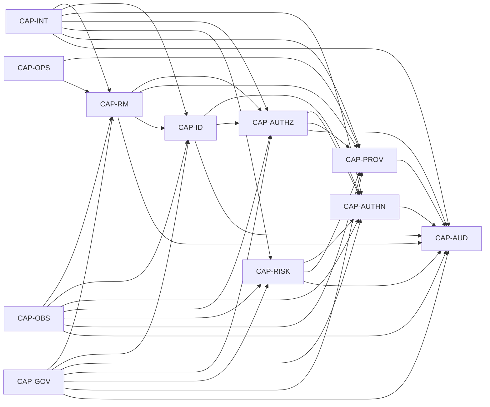

# 6. Карта бизнес-возможностей платформы {#pads-capability-map}



[Оглавление PADS](../index.md) | [Предыдущий раздел: 5. Единый язык предметной области](05-ubiquitous-language.md) | [Следующий раздел: 7. Модель предметной области](07-domain-model.md)



## 6.1. Назначение главы

Настоящая глава определяет **карту бизнес-возможностей M8 Platform** — устойчивое описание того, какие способности платформа должна предоставлять своим пользователям, внутренним продуктовым командам и подключаемым сервисам независимо от конкретной организационной структуры, технологии реализации и состава развёртываемых компонентов.

Карта бизнес-возможностей используется как промежуточный слой между видением платформы и детальной предметной моделью:

```text
Видение и цели платформы
        ↓
Бизнес-возможности
        ↓
Ограниченные контексты
        ↓
Сервисы и владельцы данных
        ↓
Требования и сценарии
        ↓
Контракты, Structured Prompts, код и тесты
```

Бизнес-возможность отвечает на вопрос **«что платформа должна уметь делать как система»**. Она не определяет конкретный пользовательский интерфейс, процесс команды разработки, имя микросервиса, таблицу базы данных или используемый программный продукт.

Карта возможностей **ДОЛЖНА** применяться для:

- проверки полноты предметного охвата платформы;
- определения владельца каждого требования;
- выявления пересечений и пробелов между сервисами;
- построения карты ограниченных контекстов;
- определения приоритетов развития платформы;
- планирования релизных срезов без привязки к внутренней структуре кода;
- формирования каталога требований;
- трассировки требований до API, событий, реализации и тестов;
- формирования Context Prompt, Feature Prompt и Task Prompt в рамках SPDD.

Карта возможностей не заменяет модель предметной области. Возможность описывает способность платформы, а предметная модель определяет понятия, правила и инварианты, посредством которых эта способность реализуется.

## 6.2. Нормативные определения

### 6.2.1. Бизнес-возможность

**Бизнес-возможность** — устойчивая способность платформы достигать определённого результата или поддерживать определённый тип деятельности. Возможность сохраняет смысл при изменении технологий, структуры команд и способа развёртывания.

Примеры бизнес-возможностей:

- управлять жизненным циклом проекта;
- зарегистрировать и проверить идентичность пользователя;
- провести аутентификацию с требуемым уровнем доверия;
- проверить право субъекта на действие над ресурсом;
- создать и поддерживать управляемый инфраструктурный ресурс;
- зафиксировать значимое действие в неизменяемом аудите.

### 6.2.2. Функция

**Функция** — конкретное поведение или операция, реализующая часть возможности. Функция является более изменчивой, чем возможность.

Например, возможность «Аутентификация» может включать функции запуска CIBA-аутентификации, повторной отправки OTP, подтверждения WebAuthn и отмены транзакции.

### 6.2.3. Процесс

**Процесс** — последовательность действий, использующая одну или несколько возможностей. Процесс не должен приниматься за границу сервиса.

Например, процесс подключения нового проекта использует управление ресурсами, доступом, аудитом и, при необходимости, подготовкой инфраструктуры.

### 6.2.4. Ограниченный контекст

**Ограниченный контекст** определяет область, в которой предметные термины и правила имеют однозначный смысл. Одна возможность обычно принадлежит одному основному контексту, но может использовать возможности других контекстов.

### 6.2.5. Сервис

**Сервис** — развёртываемый программный компонент, реализующий одну или несколько возможностей одного ограниченного контекста. Граница сервиса не выводится непосредственно из количества возможностей. Несколько близких возможностей могут реализовываться одним сервисом, если они имеют общего владельца модели, данных и жизненного цикла.

## 6.3. Различие между возможностью, контекстом, сервисом и требованием

| Артефакт | Основной вопрос | Устойчивость | Пример |
| --- | --- | --- | --- |
| Бизнес-возможность | Что должна уметь платформа? | Высокая | Проверять доступ к ресурсу |
| Ограниченный контекст | Где определены смысл и правила? | Высокая | Access |
| Сервис | Каким компонентом это реализовано? | Средняя | `m8-access` |
| Требование | Какое конкретное поведение необходимо? | Средняя или низкая | Проверка должна учитывать отношения и наследование |
| API-операция | Как поведение вызывается извне? | Средняя | `CheckPermission` |
| Событие | Какой факт публикуется? | Средняя | `AccessRelationshipChanged` |
| Задача реализации | Какое изменение требуется внести? | Низкая | Реализовать пакетную проверку отношений |

Следующие подмены **ЗАПРЕЩЕНЫ**:

- считать названием сервиса название возможности без анализа границы контекста;
- выделять отдельный сервис для каждой функции;
- использовать пользовательский экран как бизнес-возможность;
- описывать технологию как бизнес-возможность;
- считать библиотеку, базу данных или внешний продукт частью карты возможностей;
- распределять требования непосредственно по репозиториям без указания возможности и контекста-владельца.

## 6.4. Уровни декомпозиции

M8 Platform использует четыре уровня декомпозиции возможностей.

| Уровень | Назначение | Пример идентификатора | Пример |
| --- | --- | --- | --- |
| L0 | Карта платформы в целом | `CAP-AUTHN` | Аутентификация |
| L1 | Крупная самостоятельная способность | `CAP-AUTHN-04` | Управление испытаниями аутентификации |
| L2 | Проверяемая функциональная область | `CAP-AUTHN-04-03` | Повторная отправка испытания |
| L3 | Опциональная атомарная способность для требований | `CAP-AUTHN-04-03-01` | Ограничение частоты повторной отправки |

В PADS нормативно фиксируются уровни L0 и L1. Уровень L2 фиксируется для областей, в которых он необходим для распределения требований и предотвращения пересечения ответственности. Уровень L3 **МОЖЕТ** вводиться в каталоге требований и спецификациях отдельных контекстов.

Каждая возможность **ДОЛЖНА** иметь:

- устойчивый идентификатор;
- нормативное название;
- определённый результат;
- основной ограниченный контекст;
- владельца реализации;
- входные и выходные зависимости;
- классификацию;
- уровень критичности;
- связанные предметные понятия;
- набор требований или ссылку на каталог требований.

## 6.5. Классификация возможностей

### 6.5.1. Основные предметные возможности

Основные возможности непосредственно формируют ценность M8 Platform как управляющей платформы:

- управление структурой и ресурсными границами;
- управление идентичностями;
- аутентификация;
- управление доступом;
- принятие решений на основе риска;
- подготовка и сопровождение управляемых ресурсов;
- аудит и доказуемость действий.

### 6.5.2. Обеспечивающие возможности

Обеспечивающие возможности поддерживают основные предметные возможности и задают общий способ выполнения длительной работы и эксплуатации:

- управление длительными операциями;
- наблюдаемость;
- интеграция и доставка событий;
- управление общими контрактами.

### 6.5.3. Управленческие возможности

Управленческие возможности обеспечивают контролируемое развитие платформы:

- архитектурное управление;
- управление требованиями;
- управление контрактами и совместимостью;
- трассировка;
- SPDD и контроль изменений, создаваемых ИИ-агентами.

## 6.6. Карта возможностей верхнего уровня

```mermaid
flowchart TB
    M8[M8 Platform]

    subgraph CORE[Основные предметные возможности]
        RM[CAP-RM\nУправление ресурсной структурой]
        ID[CAP-ID\nУправление идентичностями]
        AUTHN[CAP-AUTHN\nАутентификация]
        AUTHZ[CAP-AUTHZ\nУправление доступом]
        RISK[CAP-RISK\nРешения на основе риска]
        PROV[CAP-PROV\nПодготовка управляемых ресурсов]
        AUD[CAP-AUD\nАудит и доказуемость]
    end

    subgraph ENABLE[Обеспечивающие возможности]
        OPS[CAP-OPS\nДлительные операции]
        OBS[CAP-OBS\nНаблюдаемость]
        INT[CAP-INT\nИнтеграция и доставка фактов]
    end

    subgraph GOV[Управленческие возможности]
        GOVCAP[CAP-GOV\nАрхитектурное управление и SPDD]
    end

    M8 --> RM
    M8 --> ID
    M8 --> AUTHN
    M8 --> AUTHZ
    M8 --> RISK
    M8 --> PROV
    M8 --> AUD
    M8 --> OPS
    M8 --> OBS
    M8 --> INT
    M8 --> GOVCAP
```



## 6.7. Реестр возможностей уровня L0

| ID | Возможность | Класс | Основной контекст | Основной сервис | Критичность |
| --- | --- | --- | --- | --- | --- |
| `CAP-RM` | Управление ресурсной структурой | Основная | Resource Manager | `m8-resource-manager` | Критическая |
| `CAP-ID` | Управление идентичностями | Основная | Identity | `m8-identity` | Критическая |
| `CAP-AUTHN` | Аутентификация | Основная | Authentication | `m8-authentication` | Критическая |
| `CAP-AUTHZ` | Управление доступом | Основная | Access | `m8-access` | Критическая |
| `CAP-RISK` | Решения на основе риска | Основная | Risk Decision | `m8-risk-decision` | Высокая |
| `CAP-PROV` | Подготовка управляемых ресурсов | Основная | Provisioning | `m8-provisioning` | Высокая |
| `CAP-AUD` | Аудит и доказуемость | Основная | Audit | `m8-audit` | Критическая |
| `CAP-OPS` | Управление длительными операциями | Обеспечивающая | Common Operation и контекст-владелец операции | Владельцы операций | Высокая |
| `CAP-OBS` | Наблюдаемость платформы | Обеспечивающая | Platform Observability | Общая платформенная инфраструктура | Высокая |
| `CAP-INT` | Интеграция и доставка фактов | Обеспечивающая | Integration Contracts | Общая инфраструктура и сервисы-владельцы | Высокая |
| `CAP-GOV` | Архитектурное управление, трассировка и SPDD | Управленческая | Architecture Governance | Архитектурный процесс и средства проверки | Высокая |

Критичность определяет последствия утраты возможности:

- **Критическая** — утрата нарушает базовую модель безопасности, изоляции или управляемости платформы;
- **Высокая** — утрата блокирует существенную часть операций или делает их неконтролируемыми;
- **Средняя** — утрата ухудшает эффективность, но не разрушает базовые гарантии;
- **Низкая** — возможность может быть временно недоступна без нарушения ключевых обязательств.

## 6.8. CAP-RM — управление ресурсной структурой

### 6.8.1. Назначение

Возможность обеспечивает создание, изменение, поиск и завершение жизненного цикла административных и ресурсных границ M8 Platform:

```text
Organization → Workspace → Project → Service
```

Resource Manager является источником истины о существовании ресурса, его положении в иерархии, состоянии жизненного цикла, метках и основных атрибутах.

### 6.8.2. Декомпозиция L1

| ID | Возможность L1 | Результат |
| --- | --- | --- |
| `CAP-RM-01` | Управление Organization | Создание и сопровождение верхней административной границы |
| `CAP-RM-02` | Управление Workspace | Группировка проектов внутри Organization |
| `CAP-RM-03` | Управление Project | Управление основной границей изоляции и владения ресурсами |
| `CAP-RM-04` | Регистрация Service | Учёт сервисов, принадлежащих проекту |
| `CAP-RM-05` | Навигация по иерархии | Получение родительских, дочерних и полных путей ресурсов |
| `CAP-RM-06` | Управление метаданными | Метки, отображаемые имена и пользовательские атрибуты |
| `CAP-RM-07` | Управление жизненным циклом | Активация, блокировка, архивирование и удаление ресурсов |
| `CAP-RM-08` | Контролируемое перемещение | Изменение положения ресурса при соблюдении политик и инвариантов |
| `CAP-RM-09` | Обнаружение и поиск ресурсов | Фильтрация, пагинация и получение ресурсов в разрешённой области |
| `CAP-RM-10` | Публикация структурных фактов | События о создании, изменении состояния и удалении ресурсов |

### 6.8.3. Границы

`CAP-RM` **НЕ ВКЛЮЧАЕТ**:

- управление пользователями и их профилями;
- хранение отношений доступа и ролей;
- создание облачных или Kubernetes-ресурсов;
- оценку риска;
- аутентификацию;
- хранение полного аудиторского журнала.

Resource Manager сообщает, что Project существует и где он расположен, но Access определяет, кто имеет к нему доступ, а Provisioning создаёт требуемые управляемые ресурсы.

### 6.8.4. Основные зависимости

- использует Access для проверки прав на операции;
- публикует факты для Identity, Access, Provisioning, Audit и локальных проекций;
- использует Audit для фиксации значимых изменений;
- использует Common Operation для длительного каскадного удаления или перемещения.

## 6.9. CAP-ID — управление идентичностями

### 6.9.1. Назначение

Возможность обеспечивает управление устойчивыми цифровыми представлениями пользователей и технических субъектов, их принадлежностью к пулам, группам и структурам платформы.

Identity является источником истины о том, **кем является субъект в модели M8**, но не подтверждает его личность в конкретной сессии и не принимает решение о доступе.

### 6.9.2. Декомпозиция L1

| ID | Возможность L1 | Результат |
| --- | --- | --- |
| `CAP-ID-01` | Управление User Pool | Создание изолированных пространств идентичностей |
| `CAP-ID-02` | Управление User | Создание, изменение, блокировка и завершение жизненного цикла пользователя |
| `CAP-ID-03` | Управление профилем | Хранение нормативных атрибутов и проверка схемы профиля |
| `CAP-ID-04` | Управление Group | Объединение пользователей для назначения и администрирования |
| `CAP-ID-05` | Управление Membership | Связь субъекта с Organization, Workspace, Project или группой |
| `CAP-ID-06` | Связывание External Identity | Сопоставление внешнего `issuer + subject` с внутренним субъектом |
| `CAP-ID-07` | Разрешение Subject | Поиск внутреннего субъекта по поддерживаемому идентификатору |
| `CAP-ID-08` | Объединение и разбор дублей | Контролируемое слияние идентичностей с сохранением истории |
| `CAP-ID-09` | Состояние и ограничения пользователя | Блокировка, приостановка, восстановление и удаление |
| `CAP-ID-10` | Публикация фактов идентичности | События об изменении состояния и связей идентичности |

### 6.9.3. Границы

`CAP-ID` **НЕ ВКЛЮЧАЕТ**:

- проверку пароля, OTP, WebAuthn или CIBA;
- выдачу access token и refresh token;
- вычисление полномочий;
- хранение отношений SpiceDB;
- оценку риска операции;
- хранение секретов внешних поставщиков.

Credential или ссылка на него может являться частью модели Identity только как метаданные. Секретный материал и проверка доказательства владения остаются в специализированном поставщике аутентификации или защищённом хранилище.

### 6.9.4. Основные зависимости

- Resource Manager определяет область Organization, Workspace и Project;
- Authentication использует разрешение субъекта;
- Access использует идентификаторы субъектов и факты их жизненного цикла;
- Audit получает факты об изменениях идентичности.

## 6.10. CAP-AUTHN — аутентификация

### 6.10.1. Назначение

Возможность обеспечивает управляемое подтверждение идентичности субъекта с учётом клиента, способа аутентификации, требуемого уровня доверия, контекста риска и доступных поставщиков.

Authentication владеет транзакцией аутентификации и её состоянием. Внешний поставщик, включая Keycloak, **НЕ ДОЛЖЕН** определять внутреннюю предметную модель транзакции M8.

### 6.10.2. Декомпозиция L1

| ID | Возможность L1 | Результат |
| --- | --- | --- |
| `CAP-AUTHN-01` | Управление Client | Регистрация клиента, его допустимых потоков и требований безопасности |
| `CAP-AUTHN-02` | Управление Authentication Provider | Настройка доступных поставщиков и способов аутентификации |
| `CAP-AUTHN-03` | Запуск Authentication | Создание транзакции с проверкой клиента, субъекта и контекста |
| `CAP-AUTHN-04` | Управление Challenge | Выбор, запуск, повтор, подтверждение и завершение испытания |
| `CAP-AUTHN-05` | CIBA-аутентификация | Backchannel-подтверждение без интерактивного перенаправления клиента |
| `CAP-AUTHN-06` | OTP-аутентификация | Отправка и проверка одноразового кода с ограничениями частоты |
| `CAP-AUTHN-07` | WebAuthn и passkey | Проверка криптографического доказательства владения учётными данными |
| `CAP-AUTHN-08` | Федеративная аутентификация | Использование OIDC или SAML через антикоррупционный слой |
| `CAP-AUTHN-09` | Повторная аутентификация | Новое подтверждение при отсутствии или недействительности продолжения сессии |
| `CAP-AUTHN-10` | Step-up | Повышение достигнутого уровня подтверждения |
| `CAP-AUTHN-11` | Управление состоянием транзакции | Получение, ожидание, отмена, истечение и завершение Authentication |
| `CAP-AUTHN-12` | Формирование Handoff | Безопасная передача результата следующему компоненту протокола |
| `CAP-AUTHN-13` | Управление Authentication Session | Связь успешной аутентификации с сессионным контекстом без дублирования токен-сервиса |
| `CAP-AUTHN-14` | Публикация фактов аутентификации | События о запуске, испытаниях, успехе, отказе и истечении |

### 6.10.3. Границы

`CAP-AUTHN` **НЕ ВКЛЮЧАЕТ**:

- владение профилем пользователя;
- окончательное решение о полномочиях на бизнес-ресурс;
- самостоятельное вычисление риска, если решение делегировано Risk Decision;
- прямое копирование внутренней сессионной модели Keycloak;
- создание отношений доступа;
- публикацию секретов или необработанных учётных данных.

### 6.10.4. Основные зависимости

- Identity разрешает субъекта;
- Risk Decision определяет действие `ALLOW`, `DENY`, `CHALLENGE` или требуемый уровень подтверждения;
- Access проверяет право клиента или оператора начать отдельные виды аутентификации;
- Keycloak и другие поставщики подключаются через антикоррупционные адаптеры;
- Audit фиксирует значимые переходы и действия оператора.

## 6.11. CAP-AUTHZ — управление доступом

### 6.11.1. Назначение

Возможность обеспечивает формальное описание полномочий субъектов, назначение отношений и ролей, а также принятие воспроизводимого решения о доступе к ресурсу.

Access является источником истины о модели авторизации и отношениях доступа. SpiceDB является технологическим механизмом хранения и вычисления отношений, но не владельцем предметной терминологии M8.

### 6.11.2. Декомпозиция L1

| ID | Возможность L1 | Результат |
| --- | --- | --- |
| `CAP-AUTHZ-01` | Управление Authorization Model | Определение типов ресурсов, отношений и разрешений |
| `CAP-AUTHZ-02` | Управление Permission | Нормативный каталог проверяемых действий |
| `CAP-AUTHZ-03` | Управление Role | Формирование именованных наборов полномочий |
| `CAP-AUTHZ-04` | Управление Role Binding | Назначение роли субъекту в заданной области |
| `CAP-AUTHZ-05` | Управление Relationship | Создание и удаление предметных отношений доступа |
| `CAP-AUTHZ-06` | Проверка Permission | Ответ на вопрос, разрешено ли действие над ресурсом |
| `CAP-AUTHZ-07` | Пакетная проверка | Эффективная проверка набора субъектов, ресурсов или действий |
| `CAP-AUTHZ-08` | Объяснение решения | Представление отношений и правил, приведших к результату |
| `CAP-AUTHZ-09` | Моделирование доступа | Проверка предполагаемого изменения до его применения |
| `CAP-AUTHZ-10` | Просмотр эффективных полномочий | Получение доступов субъекта или списка субъектов ресурса |
| `CAP-AUTHZ-11` | Ревизия и подтверждение доступа | Периодическая проверка актуальности назначений |
| `CAP-AUTHZ-12` | Синхронизация с Authorization Engine | Надёжная доставка модели и отношений в SpiceDB |
| `CAP-AUTHZ-13` | Публикация фактов доступа | События об изменениях ролей, отношений и модели |

### 6.11.3. Границы

`CAP-AUTHZ` **НЕ ВКЛЮЧАЕТ**:

- подтверждение личности;
- хранение профиля пользователя;
- принятие поведенческого или антифрод-решения;
- владение ресурсной иерархией;
- автоматическое создание инфраструктурного ресурса;
- скрытое изменение отношений на основании локальной таблицы другого сервиса.

### 6.11.4. Основные зависимости

- Resource Manager предоставляет типы и идентификаторы ресурсов;
- Identity предоставляет устойчивые идентификаторы субъектов;
- Risk Decision может дополнять, но не подменять решение о полномочиях;
- Audit фиксирует изменения модели и назначений;
- SpiceDB используется только через адаптер Access.

## 6.12. CAP-RISK — решения на основе риска

### 6.12.1. Назначение

Возможность обеспечивает сбор и нормализацию контекстных сигналов, вычисление риска и принятие объяснимого решения о необходимом защитном действии.

Решение Risk Decision отвечает на вопрос **«какое защитное действие требуется с учётом контекста»**, а Access отвечает на вопрос **«имеет ли субъект полномочие»**. Эти решения не должны смешиваться.

### 6.12.2. Декомпозиция L1

| ID | Возможность L1 | Результат |
| --- | --- | --- |
| `CAP-RISK-01` | Приём Risk Signal | Получение сигналов устройства, сети, поведения и истории |
| `CAP-RISK-02` | Нормализация контекста | Преобразование сигналов в устойчивую предметную модель |
| `CAP-RISK-03` | Управление Risk Rule | Настройка детерминированных правил риска |
| `CAP-RISK-04` | Управление Decision Policy | Определение связи риска с защитным действием |
| `CAP-RISK-05` | Вычисление Risk Assessment | Формирование оценки, факторов и уверенности |
| `CAP-RISK-06` | Принятие Decision | Возврат `ALLOW`, `DENY`, `CHALLENGE` или `REVIEW` |
| `CAP-RISK-07` | Определение Assurance Level | Выбор требуемого уровня подтверждения |
| `CAP-RISK-08` | Velocity Checks | Ограничения по частоте и последовательности действий |
| `CAP-RISK-09` | Device Intelligence | Устойчивое описание и оценка устройства |
| `CAP-RISK-10` | Объяснение решения | Причины, сработавшие правила и используемые факторы |
| `CAP-RISK-11` | Обратная связь о результате | Использование подтверждённых исходов для контроля качества правил |
| `CAP-RISK-12` | Контроль эффективности политик | Метрики качества, ложных срабатываний и деградации сигналов |

### 6.12.3. Границы

`CAP-RISK` **НЕ ВКЛЮЧАЕТ**:

- хранение паролей или OTP;
- выполнение испытания аутентификации;
- создание или удаление отношений доступа;
- изменение ресурса;
- неограниченное использование необъяснимого решения модели для критических отказов без политики и аудита.

### 6.12.4. Основные зависимости

- Authentication и другие потребители передают контекст решения;
- Identity и Resource Manager предоставляют нормализованные ссылки, но Risk Decision не копирует их модели;
- Audit получает решение и его нормативное объяснение;
- наблюдаемость контролирует задержку, доступность и качество сигналов.

## 6.13. CAP-PROV — подготовка управляемых ресурсов

### 6.13.1. Назначение

Возможность обеспечивает декларативное создание, изменение, наблюдение, восстановление и удаление управляемых ресурсов во внешних системах и инфраструктурных средах.

Provisioning владеет желаемым и наблюдаемым состоянием Managed Resource, но не владеет административной иерархией Organization, Workspace и Project.

### 6.13.2. Декомпозиция L1

| ID | Возможность L1 | Результат |
| --- | --- | --- |
| `CAP-PROV-01` | Управление Resource Definition | Формальное описание поддерживаемого типа ресурса и схемы параметров |
| `CAP-PROV-02` | Приём Resource Request | Проверенная заявка на создание или изменение ресурса |
| `CAP-PROV-03` | Управление Desired State | Хранение нормативного желаемого состояния |
| `CAP-PROV-04` | Выбор Placement | Определение кластера, региона, поставщика или среды размещения |
| `CAP-PROV-05` | Управление Driver | Подключение поставщиков через устойчивый интерфейс драйвера |
| `CAP-PROV-06` | Reconciliation | Сближение наблюдаемого состояния с желаемым |
| `CAP-PROV-07` | Обнаружение Drift | Выявление внешних изменений и расхождений |
| `CAP-PROV-08` | Повтор и восстановление | Управляемые повторные попытки, backoff и продолжение процесса |
| `CAP-PROV-09` | Компенсация | Отмена частично выполненных действий там, где это возможно |
| `CAP-PROV-10` | Управление удалением | Завершение жизненного цикла и очистка внешних ресурсов |
| `CAP-PROV-11` | Получение Outputs | Нормативные выходные параметры без раскрытия секретов |
| `CAP-PROV-12` | Наблюдение состояния | Состояние, прогресс, причины ошибки и последнее согласование |
| `CAP-PROV-13` | Публикация фактов Provisioning | События о состоянии Managed Resource и Reconciliation |

### 6.13.3. Границы

`CAP-PROV` **НЕ ВКЛЮЧАЕТ**:

- создание Organization, Workspace или Project;
- принятие решения о полномочиях;
- прямое предоставление секретов через публичный API;
- включение типов Kubernetes, облачного SDK или Terraform в доменную модель;
- выполнение необратимого удаления без явного состояния и аудита.

### 6.13.4. Основные зависимости

- Resource Manager предоставляет проектную область;
- Access проверяет полномочия на заявку;
- Risk Decision может использоваться для чувствительных действий;
- Temporal координирует длительные процессы через адаптер;
- внешние облака, Kubernetes, Kafka и иные системы подключаются через Driver и антикоррупционный слой;
- Audit получает факты о заявках, переходах и действиях оператора.

## 6.14. CAP-AUD — аудит и доказуемость

### 6.14.1. Назначение

Возможность обеспечивает неизменяемую и проверяемую фиксацию значимых действий, решений и изменений состояния, а также последующий поиск, экспорт и контроль целостности.

Audit является источником истины о зарегистрированном аудиторском факте, но не должен становиться операционной базой данных для восстановления текущего состояния других контекстов.

### 6.14.2. Декомпозиция L1

| ID | Возможность L1 | Результат |
| --- | --- | --- |
| `CAP-AUD-01` | Приём Audit Event | Надёжный приём события в нормативном формате |
| `CAP-AUD-02` | Проверка полноты и происхождения | Валидация обязательных полей, источника и времени |
| `CAP-AUD-03` | Неизменяемое хранение | Запрет неаудируемого изменения зафиксированного факта |
| `CAP-AUD-04` | Контроль целостности | Обнаружение удаления, перестановки или подмены записей |
| `CAP-AUD-05` | Поиск и фильтрация | Поиск по субъекту, актору, ресурсу, действию, времени и корреляции |
| `CAP-AUD-06` | Построение цепочки действий | Восстановление причинно связанных операций |
| `CAP-AUD-07` | Экспорт | Формирование контролируемой выгрузки для расследования или соответствия |
| `CAP-AUD-08` | Управление сроком хранения | Retention и допустимое уничтожение по политике |
| `CAP-AUD-09` | Управление доступом к аудиту | Ограничение просмотра чувствительных данных и массового экспорта |
| `CAP-AUD-10` | Маскирование и минимизация | Исключение секретов и ограничение персональных данных |
| `CAP-AUD-11` | Подтверждение доставки | Контроль отсутствующих или недоставленных обязательных событий |
| `CAP-AUD-12` | Аудит действий над аудитом | Фиксация поиска, экспорта, изменения политики и административного доступа |

### 6.14.3. Границы

`CAP-AUD` **НЕ ВКЛЮЧАЕТ**:

- хранение текущего состояния агрегата другого контекста;
- бизнес-аналитику общего назначения;
- логирование отладочной информации;
- хранение секретов, токенов или полных учётных данных;
- скрытое исправление ранее сохранённой записи.

### 6.14.4. Основные зависимости

Все сервисы являются поставщиками аудиторских фактов. Access защищает чтение и экспорт, а Observability контролирует задержку, полноту и ошибки доставки.

## 6.15. CAP-OPS — управление длительными операциями

### 6.15.1. Назначение

Возможность задаёт общий способ представления работы, которая не может гарантированно завершиться в пределах обычного синхронного запроса.

Operation является общим контрактом, но предметный сервис, начавший работу, остаётся владельцем результата, состояния и допустимости отмены.

### 6.15.2. Декомпозиция L1

| ID | Возможность L1 | Результат |
| --- | --- | --- |
| `CAP-OPS-01` | Создание Operation | Устойчивый ресурс для отслеживания длительной работы |
| `CAP-OPS-02` | Получение состояния | Чтение статуса, времени и метаданных |
| `CAP-OPS-03` | Отображение Progress | Стадия, сообщение и процент выполнения |
| `CAP-OPS-04` | Ожидание завершения | Долгое ожидание или повторное получение без создания новой работы |
| `CAP-OPS-05` | Отмена | Запрос отмены с предметно корректным результатом |
| `CAP-OPS-06` | Представление Result | Типизированный результат завершённой операции |
| `CAP-OPS-07` | Представление Error | Нормативная ошибка и пригодные для диагностики детали |
| `CAP-OPS-08` | Управление сроком хранения | Сохранение завершённых операций в течение определённого периода |
| `CAP-OPS-09` | Связь с Workflow | Корреляция Operation с Temporal Workflow без утечки внешней модели |
| `CAP-OPS-10` | Идемпотентное начало | Повтор команды не создаёт дублирующую работу |

### 6.15.3. Границы

`CAP-OPS` не является самостоятельным владельцем предметной операции и не превращается в центральный оркестратор всех сервисов. Общий пакет определяет контракт и правила, а владелец конкретной операции находится в соответствующем контексте.

## 6.16. CAP-OBS — наблюдаемость платформы

### 6.16.1. Назначение

Возможность обеспечивает измеримость поведения платформы, обнаружение деградации и связь технических сигналов с предметными действиями.

### 6.16.2. Декомпозиция L1

| ID | Возможность L1 | Результат |
| --- | --- | --- |
| `CAP-OBS-01` | Распределённая трассировка | Сквозной путь запроса и асинхронных обработчиков |
| `CAP-OBS-02` | Структурированные журналы | Поиск технических событий без раскрытия секретов |
| `CAP-OBS-03` | Технические метрики | Нагрузка, задержка, ошибки, насыщение и очереди |
| `CAP-OBS-04` | Предметные метрики | Состояния транзакций, решений, операций и ресурсов |
| `CAP-OBS-05` | SLI и SLO | Измеримые цели доступности, задержки и корректности |
| `CAP-OBS-06` | Оповещение | Сигнал о нарушении SLO или опасной тенденции |
| `CAP-OBS-07` | Диагностические панели | Представление здоровья сервиса и ключевых потоков |
| `CAP-OBS-08` | Корреляция | Связь `trace_id`, `request_id`, `operation_id`, `actor_id` и `resource_id` |
| `CAP-OBS-09` | Контроль зависимостей | Здоровье внешних поставщиков, очередей и хранилищ |
| `CAP-OBS-10` | Планирование ёмкости | Прогнозирование роста нагрузки и ограничений |

### 6.16.3. Границы

Observability не заменяет Audit. Журналы и трассы могут иметь ограниченный срок хранения и не обладают обязательной юридической или контрольной неизменяемостью.

## 6.17. CAP-INT — интеграция и доставка фактов

### 6.17.1. Назначение

Возможность обеспечивает надёжное взаимодействие контекстов без общей базы данных и распределённых транзакций.

### 6.17.2. Декомпозиция L1

| ID | Возможность L1 | Результат |
| --- | --- | --- |
| `CAP-INT-01` | Синхронные контрактные вызовы | Немедленное получение решения или состояния через типизированный API |
| `CAP-INT-02` | Публикация Domain Event | Передача факта внутри контекста |
| `CAP-INT-03` | Публикация Integration Event | Стабильный факт для внешних потребителей |
| `CAP-INT-04` | Transactional Outbox | Атомарная фиксация состояния и намерения публикации |
| `CAP-INT-05` | Inbox и дедупликация | Идемпотентная обработка повторной доставки |
| `CAP-INT-06` | Версионирование схем | Совместимое развитие контрактов событий |
| `CAP-INT-07` | Повтор и Dead Letter | Управляемая обработка временных и постоянных ошибок |
| `CAP-INT-08` | Проекции | Локальные модели чтения на основании фактов владельца |
| `CAP-INT-09` | Корреляция и причинность | `correlation_id`, `causation_id` и связь с исходной командой |
| `CAP-INT-10` | Антикоррупционные адаптеры | Изоляция модели M8 от моделей внешних систем |

### 6.17.3. Границы

`CAP-INT` не вводит общий интеграционный домен и не становится владельцем предметных событий. Владельцем факта остаётся публикующий контекст.

## 6.18. CAP-GOV — архитектурное управление, трассировка и SPDD

### 6.18.1. Назначение

Возможность обеспечивает контролируемое развитие M8 Platform, при котором каждое изменение связано с целью, возможностью, требованием, контрактом, реализацией и доказательством проверки.

### 6.18.2. Декомпозиция L1

| ID | Возможность L1 | Результат |
| --- | --- | --- |
| `CAP-GOV-01` | Управление PADS | Версионируемая нормативная архитектурная спецификация |
| `CAP-GOV-02` | Управление ADR | Обоснованные изменения архитектурного базиса |
| `CAP-GOV-03` | Каталог требований | Устойчивые требования с владельцем и критериями приёмки |
| `CAP-GOV-04` | Матрица трассировки | Связь целей, возможностей, требований, контрактов, кода и тестов |
| `CAP-GOV-05` | Управление API-контрактами | Проверка совместимости и жизненного цикла API |
| `CAP-GOV-06` | Управление схемами событий | Владелец, версия, совместимость и срок поддержки |
| `CAP-GOV-07` | Архитектурные проверки | Автоматизированный контроль зависимостей и обязательных правил |
| `CAP-GOV-08` | SPDD Constitution | Общие ограничения для работы ИИ-агентов |
| `CAP-GOV-09` | Управление Structured Prompt | Версионирование Context, Feature, Task и Review Prompt |
| `CAP-GOV-10` | Проверка результата агента | Доказательство соответствия требованиям, архитектуре и тестам |
| `CAP-GOV-11` | Управление единым языком | Контроль терминов, владельцев и запрещённых синонимов |
| `CAP-GOV-12` | Доказательство готовности релиза | Совокупность результатов тестов, проверок и трассировки |

### 6.18.3. Границы

Architecture Governance не должно превращаться в ручной комитет, согласующий каждое локальное изменение. Проверяемые правила автоматизируются, а человеческое решение требуется для изменения границ, инвариантов, публичных обязательств или существенных технологических решений.

## 6.19. Зависимости возможностей

### 6.19.1. Основной граф зависимостей



Стрелка обозначает не технический импорт, а использование результата или правил другой возможности. Конкретный тип связи уточняется в карте контекстов.

### 6.19.2. Правила зависимостей

1. Основная возможность **НЕ ДОЛЖНА** обходить владельца другой возможности посредством чтения его базы данных.
2. Зависимость от возможности не означает зависимость от внутренней модели её сервиса.
3. Для немедленного решения применяется синхронный контракт; для распространения факта — событие.
4. Локальная проекция не меняет владельца возможности или данных.
5. Деградация необязательной зависимости **СЛЕДУЕТ** обрабатывать без разрушения основного инварианта.
6. Критическое решение безопасности не может незаметно переходить в разрешающее состояние при недоступности зависимости.
7. Циклические синхронные зависимости между основными возможностями **ЗАПРЕЩЕНЫ**.

## 6.20. Матрица «возможность — контекст — сервис»

| Возможность | Контекст-владелец | Основной сервис | Поддерживающие контексты | Внешние адаптеры |
| --- | --- | --- | --- | --- |
| `CAP-RM` | Resource Manager | `m8-resource-manager` | Access, Audit, Common Operation | нет обязательного поставщика |
| `CAP-ID` | Identity | `m8-identity` | Resource Manager, Access, Audit | каталоги и IdP через ACL при необходимости |
| `CAP-AUTHN` | Authentication | `m8-authentication` | Identity, Risk Decision, Access, Audit | Keycloak, OIDC, SAML, OTP, Mobile ID, WebAuthn |
| `CAP-AUTHZ` | Access | `m8-access` | Resource Manager, Identity, Audit | SpiceDB |
| `CAP-RISK` | Risk Decision | `m8-risk-decision` | Identity, Authentication, Audit | поставщики device intelligence и сигналов |
| `CAP-PROV` | Provisioning | `m8-provisioning` | Resource Manager, Access, Risk Decision, Audit, Common Operation | Kubernetes, облака, Kafka и другие Driver |
| `CAP-AUD` | Audit | `m8-audit` | Access, Observability | архивные хранилища и экспортные приёмники |
| `CAP-OPS` | Common Operation и предметный владелец | каждый сервис-владелец операции | Audit, Observability | Temporal через адаптер |
| `CAP-OBS` | Platform Observability | платформенные компоненты | все контексты | OpenTelemetry, метрики, журналы, трассировка |
| `CAP-INT` | Integration Contracts | сервисы-владельцы и общая инфраструктура | все контексты | YDB Topics или иной транспорт через адаптер |
| `CAP-GOV` | Architecture Governance | репозиторий спецификаций и CI | все контексты | Buf, статический анализ, средства SPDD |

## 6.21. Матрица участия сервисов

Обозначения:

- **O** — владелец возможности и решения;
- **S** — обязательный поставщик поддерживающей функции;
- **C** — потребитель или консультируемый контекст;
- **—** — отсутствие прямой ответственности.

| Сервис / возможность | RM | ID | AUTHN | AUTHZ | RISK | PROV | AUD | OPS |
| --- | ---: | ---: | ---: | ---: | ---: | ---: | ---: | ---: |
| `m8-resource-manager` | O | C | C | C | — | C | S | O |
| `m8-identity` | C | O | S | S | C | — | S | O |
| `m8-authentication` | C | C | O | C | C | — | S | O |
| `m8-access` | C | C | S | O | C | S | S | O |
| `m8-risk-decision` | C | C | S | C | O | S | S | O |
| `m8-provisioning` | C | — | — | C | C | O | S | O |
| `m8-audit` | C | C | C | C | C | C | O | O |

Эта матрица описывает ответственность, но не разрешает прямые импорты между сервисами. Реальные способы взаимодействия определяются контрактами и картой контекстов.

## 6.22. Межконтекстные пользовательские результаты

Карта возможностей должна позволять проверить не только отдельные сервисы, но и сквозные результаты.

### 6.22.1. Создание проекта

```text
CAP-RM: создать Project
    + CAP-AUTHZ: проверить право и назначить исходные отношения
    + CAP-AUD: зафиксировать действие
    + CAP-OPS: представить длительную инициализацию при необходимости
    + CAP-PROV: подготовить базовые управляемые ресурсы, если это задано политикой
```

Resource Manager остаётся владельцем создания Project. Остальные возможности поддерживают процесс, но не перехватывают владение агрегатом.

### 6.22.2. Аутентификация с повышением уровня доверия

```text
CAP-AUTHN: начать Authentication
    + CAP-ID: разрешить Subject
    + CAP-RISK: определить требуемое защитное действие
    + CAP-AUTHN: провести Challenge
    + CAP-AUTHZ: проверить допустимость операции клиента, где требуется
    + CAP-AUD: зафиксировать значимые переходы
```

### 6.22.3. Подготовка инфраструктурного ресурса

```text
CAP-PROV: принять Resource Request
    + CAP-RM: подтвердить Project и область
    + CAP-AUTHZ: проверить действие
    + CAP-RISK: оценить чувствительное изменение, если требуется
    + CAP-OPS: вернуть Operation
    + CAP-PROV: выполнить Reconciliation
    + CAP-AUD: зафиксировать заявку и итог
```

### 6.22.4. Расследование действия

```text
CAP-AUD: найти Audit Event
    + CAP-AUTHZ: проверить право просмотра
    + CAP-AUD: построить correlation/causation chain
    + CAP-OBS: сопоставить технические trace и метрики
```

Observability предоставляет технический контекст, но доказательным источником значимого действия остаётся Audit.

## 6.23. Распределение требований по возможностям

Каждое функциональное требование **ДОЛЖНО** иметь ровно одну основную бизнес-возможность уровня L1 или L2. Дополнительные возможности указываются как зависимости.

Пример:

```yaml
id: AUTH-FR-017
primary_capability: CAP-AUTHN-09
supporting_capabilities:
  - CAP-ID-07
  - CAP-RISK-06
  - CAP-AUD-01
owner_context: Authentication
owner_service: m8-authentication
```

Правила распределения:

1. Требование относится к возможности, которая владеет конечным предметным результатом.
2. Требование не распределяется между несколькими сервисами без единого владельца.
3. Межконтекстный процесс декомпозируется на требования владельцев и отдельный сценарий координации.
4. Нефункциональное требование может применяться ко многим возможностям, но должно иметь координатора и проверяемый способ подтверждения.
5. Требование к внешнему адаптеру связывается с предметной возможностью, ради которой адаптер существует.
6. Изменение схемы события связывается с возможностью-владельцем публикуемого факта.
7. Structured Prompt не создаётся для требования, у которого не определены `primary_capability`, `owner_context` и `owner_service`.

## 6.24. Критерии полноты возможности

Возможность считается специфицированной, если для неё определены:

- цель и ожидаемый результат;
- входящие команды или триггеры;
- ключевые сценарии;
- предметные понятия и владелец модели;
- инварианты;
- данные и владелец данных;
- синхронные и асинхронные контракты;
- ошибки и отрицательные сценарии;
- требования безопасности;
- требования аудита;
- требования идемпотентности и согласованности;
- требования наблюдаемости;
- критерии приёмки;
- зависимые возможности;
- ограничения и исключённая ответственность;
- матрица трассировки до реализации и тестов.

Наличие API без этих элементов не означает, что возможность спроектирована.

## 6.25. Уровень зрелости возможности

Для управления развитием применяется следующая модель зрелости.

| Уровень | Состояние | Критерий |
| --- | --- | --- |
| M0 | Не определена | Возможность упоминается, но не имеет владельца и границ |
| M1 | Идентифицирована | Есть ID, название, цель и основной контекст |
| M2 | Специфицирована | Определены правила, сценарии, контракты и критерии приёмки |
| M3 | Реализована | Реализация и автоматические тесты соответствуют спецификации |
| M4 | Эксплуатируется | Есть SLI/SLO, аудит, наблюдаемость и эксплуатационные процедуры |
| M5 | Управляется данными | Метрики используются для улучшения качества и планирования развития |

Уровень зрелости **НЕ ДОЛЖЕН** определяться только наличием исходного кода. Для критической возможности целевым минимальным уровнем промышленной эксплуатации является M4.

## 6.26. Приоритизация возможностей

Приоритет определяется не количеством запросов пользователей, а совокупностью следующих факторов:

- влияние на безопасность и изоляцию;
- количество зависимых возможностей;
- блокирование основных пользовательских сценариев;
- обязательность для эксплуатации и расследования;
- стоимость позднего изменения модели или контракта;
- риск поставщика или технологической зависимости;
- необходимость для автоматизированной разработки через SPDD.

Для базового ядра M8 применяются следующие классы:

| Класс | Смысл | Возможности |
| --- | --- | --- |
| P0 | Необходима для безопасного базового контура | `CAP-RM`, `CAP-ID`, `CAP-AUTHN`, `CAP-AUTHZ`, `CAP-AUD`, базовые `CAP-OPS`, `CAP-OBS`, `CAP-INT`, `CAP-GOV` |
| P1 | Необходима для полноценного управляемого control plane | `CAP-RISK`, `CAP-PROV`, расширенные проверки, объяснение решений, reconciliation |
| P2 | Расширяет автоматизацию и управление на масштабе | ревизия доступа, объединение идентичностей, расширенная аналитика риска, сложные placement-политики |

Класс приоритета не отменяет обязательность архитектурных правил. Например, функция P2 всё равно должна соблюдать правила аудита, владения данными и совместимости.

## 6.27. Связь карты возможностей с SPDD

Карта возможностей является обязательным входом для Structured-Prompt-Driven Development.

### 6.27.1. Context Prompt

Context Prompt **ДОЛЖЕН** перечислять все возможности L1, принадлежащие контексту, и явно указывать исключённые возможности соседних контекстов.

### 6.27.2. Feature Prompt

Feature Prompt **ДОЛЖЕН** ссылаться на одну основную возможность L1 или L2 и перечислять поддерживающие возможности.

```yaml
capability:
  primary: CAP-AUTHN-10
  supporting:
    - CAP-RISK-07
    - CAP-AUD-01
```

### 6.27.3. Task Prompt

Task Prompt не должен менять границу возможности. Если реализация требует переноса ответственности, агент обязан остановить задачу и зафиксировать архитектурное несоответствие, требующее ADR и обновления PADS.

### 6.27.4. Review Prompt

Review Prompt **ДОЛЖЕН** проверить:

- реализован ли результат основной возможности;
- не присвоил ли сервис ответственность соседней возможности;
- соблюдены ли входные и выходные зависимости;
- присутствуют ли аудит, наблюдаемость и идемпотентность;
- соответствует ли изменение критериям полноты возможности;
- сохранена ли трассировка до требований и тестов.

## 6.28. Управление изменениями карты возможностей

Изменение карты является архитектурно значимым, если оно:

- создаёт или удаляет возможность L0;
- переносит возможность L1 между контекстами;
- меняет владельца данных или конечного результата;
- объединяет ранее независимые возможности;
- разделяет возможность так, что возникает новый сервис или контекст;
- изменяет критичность или обязательные зависимости;
- меняет внешний контракт, связанный с возможностью.

Такое изменение **ДОЛЖНО** включать:

1. ADR с причиной и альтернативами;
2. обновление настоящей главы;
3. обновление карты контекстов;
4. анализ владения данными;
5. обновление каталога требований;
6. анализ совместимости API и событий;
7. обновление Context Prompt и связанных Feature Prompt;
8. миграционный план для реализации и данных;
9. обновление проверок архитектурного соответствия.

Локальное добавление функции внутри существующей возможности L1 может не требовать ADR, если не меняет границы, инварианты, владельца и публичные обязательства.

## 6.29. Запрещённые модели декомпозиции

Следующие варианты считаются архитектурными ошибками:

- возможность «Работа с YDB» или «Интеграция с Kafka»;
- возможность, названная по экрану пользовательского интерфейса;
- возможность «Общие справочники», не имеющая владельца предметного смысла;
- возможность «Пользователи и доступ», объединяющая Identity, Authentication и Access;
- возможность «Безопасность», скрывающая различия Authentication, Access, Risk Decision и Audit;
- возможность «Оркестрация», присваивающая центральному сервису правила всех контекстов;
- возможность «События», владеющая событиями других предметных контекстов;
- возможность «Операции», присваивающая результаты всех длительных процессов общему сервису;
- возможность «Инфраструктура», в которой смешаны Resource Manager и Provisioning;
- возможность, для которой невозможно указать единственного владельца конечного результата.

## 6.30. Минимальная проверка соответствия карте возможностей

Изменение соответствует настоящей главе, если:

1. определена основная возможность с устойчивым ID;
2. указан контекст и сервис-владелец;
3. конечный предметный результат принадлежит одному владельцу;
4. поддерживающие возможности указаны как зависимости, а не как совместное владение;
5. не введён прямой доступ к данным соседнего контекста;
6. внешние технологии не представлены как предметные возможности;
7. функциональность не смешивает Identity, Authentication, Access, Risk Decision и Audit;
8. длительная работа сохраняет предметного владельца при использовании общего Operation;
9. требования, контракты и Structured Prompts содержат ссылку на capability ID;
10. при изменении границы подготовлены ADR, миграция и обновление трассировки.

---
