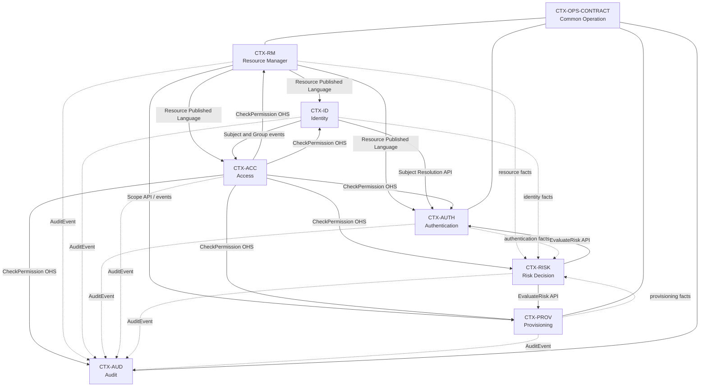

# 8. Карта контекстов {#pads-context-map}



[Оглавление PADS](../index.md) | [Предыдущий раздел: 7. Модель предметной области](07-domain-model.md) | [Следующий раздел: 9. Спецификации ограниченных контекстов](09-bounded-contexts.md)



## 8.1. Назначение главы

Настоящая глава определяет нормативную карту ограниченных контекстов (Context Map) M8 Platform и устанавливает:

1. перечень ограниченных контекстов платформы;
2. владельцев предметных моделей и контрактов;
3. направления зависимостей между контекстами;
4. типы отношений между поставщиками и потребителями;
5. допустимые синхронные и асинхронные взаимодействия;
6. правила использования локальных проекций;
7. антикоррупционные слои для внешних систем;
8. владельцев сквозных процессов;
9. запрещённые зависимости и циклы;
10. правила деградации при недоступности зависимостей;
11. требования к трассировке отношений до требований, контрактов и Structured Prompts.

Карта контекстов является нормативным продолжением:

- главы 4 «Архитектурные принципы»;
- главы 5 «Единый язык предметной области»;
- главы 6 «Карта бизнес-возможностей платформы»;
- главы 7 «Модель предметной области».

Граница контекста **НЕ РАВНА** автоматически границе процесса, таблицы, пакета, развёртывания или команды разработки. Ограниченный контекст определяется областью, внутри которой предметные термины, модели, инварианты и правила имеют единое и непротиворечивое значение.

## 8.2. Нормативные определения

| Термин | Нормативное значение |
| --- | --- |
| Ограниченный контекст | Явная семантическая граница, внутри которой действует одна предметная модель и единый язык. |
| Контекст-владелец | Контекст, имеющий исключительное право изменять каноническое состояние принадлежащих ему предметных объектов. |
| Поставщик (Upstream) | Контекст, определяющий модель или контракт, используемый другим контекстом. |
| Потребитель (Downstream) | Контекст, адаптирующийся к опубликованному контракту поставщика. |
| Опубликованный язык (Published Language) | Версионируемый межконтекстный контракт: Protobuf API, схема события, типизированная ссылка или иной формальный формат. |
| Открытый сервис (Open Host Service) | Стабильный API, предназначенный для использования несколькими контекстами. |
| Клиент–поставщик (Customer/Supplier) | Отношение, в котором поставщик обязан учитывать согласованные потребности конкретного потребителя. |
| Антикоррупционный слой (ACL) | Слой перевода, не позволяющий модели внешней системы проникать в предметную модель M8. |
| Согласование с поставщиком (Conformist) | Осознанное принятие потребителем опубликованной модели без собственной альтернативной семантики. |
| Партнёрство (Partnership) | Совместное развитие взаимозависимых контрактов двумя контекстами с согласованным планом изменений. |
| Раздельные пути (Separate Ways) | Отсутствие прямой интеграции; контексты решают задачу независимо или через нейтральный канал. |
| Общая часть модели (Shared Kernel) | Минимальный совместно управляемый набор контрактных типов, изменение которого требует согласования всех владельцев. |
| Локальная проекция | Неканоническая копия необходимых фактов другого контекста, используемая для чтения или локального решения. |
| Сквозной процесс | Процесс, затрагивающий несколько контекстов, но имеющий одного владельца оркестрации и явные компенсации. |

Слова «зависимость» и «вызов» **НЕ ЯВЛЯЮТСЯ** синонимами. Контекст может зависеть от опубликованных фактов другого контекста, не вызывая его синхронно. Контекст может вызывать API другого контекста, не импортируя его внутреннюю модель.

## 8.3. Каталог ограниченных контекстов

### 8.3.1. Основные контексты

| ID | Контекст | Тип | Сервис-владелец | Каноническая ответственность |
| --- | --- | --- | --- | --- |
| `CTX-RM` | Resource Manager | Основной | `m8-resource-manager` | Organization, Workspace, Project, ServiceRegistration и административная иерархия. |
| `CTX-ID` | Identity | Основной | `m8-identity` | UserPool, User, Group, Membership, ExternalIdentity и профиль идентичности. |
| `CTX-AUTH` | Authentication | Основной | `m8-authentication` | Client, AuthenticationTransaction, AuthenticationChallenge, AuthenticationSession и конфигурация способов аутентификации. |
| `CTX-ACC` | Access | Основной | `m8-access` | AuthorizationModel, Role, RoleBinding, AccessRelationship и решение о доступе. |
| `CTX-RISK` | Risk Decision | Основной | `m8-risk-decision` | DecisionPolicy, RiskAssessment, RiskSignalSnapshot и DecisionResult. |
| `CTX-PROV` | Provisioning | Основной | `m8-provisioning` | ResourceDefinition, PlacementPolicy, ManagedResource, DesiredState, ObservedState и Reconciliation. |
| `CTX-AUD` | Audit | Обеспечивающий обязательный | `m8-audit` | AuditEvent, RetentionPolicy, AuditExportJob, контроль целостности и поиск аудита. |

### 8.3.2. Общий контракт длительных операций

`Common Operation` имеет идентификатор `CTX-OPS-CONTRACT`, но в базовой архитектуре **НЕ ЯВЛЯЕТСЯ** самостоятельным централизованным ограниченным контекстом и **НЕ ТРЕБУЕТ** отдельного сервиса.

Он представляет минимальную общую контрактную модель:

- `Operation`;
- `OperationState`;
- `OperationProgress`;
- `OperationResult`;
- `OperationError`;
- `CancellationRequest`.

Каждая Operation принадлежит контексту, который владеет исходной мутацией. Например:

- каскадное удаление Project принадлежит `CTX-RM`;
- длительная аутентификация принадлежит `CTX-AUTH`;
- создание инфраструктурного ресурса принадлежит `CTX-PROV`;
- экспорт аудита принадлежит `CTX-AUD`.

Общий контракт Operation является ограниченным Shared Kernel. Предметные стадии, метаданные и результаты остаются собственностью контекста-владельца.

### 8.3.3. Технические возможности, не являющиеся ограниченными контекстами

Следующие элементы **НЕ ДОЛЖНЫ** моделироваться как самостоятельные предметные контексты без отдельного ADR:

- API Gateway;
- Kafka или YDB Topics;
- YDB;
- Redis;
- Temporal;
- OpenTelemetry;
- Kubernetes;
- CI/CD;
- конфигурация развёртывания;
- общий HTTP или gRPC transport;
- библиотека логирования;
- общий Repository framework.

Они являются инфраструктурой, платформенными механизмами либо внешними системами и подключаются через Ports, Adapters и Drivers.

## 8.4. Классификация контекстов по стратегической значимости

| Контекст | Классификация | Обоснование |
| --- | --- | --- |
| `CTX-RM` | Core Domain | Определяет каноническую ресурсную модель и границы изоляции всей платформы. |
| `CTX-ID` | Core Domain | Определяет идентичности и их жизненный цикл независимо от провайдера аутентификации. |
| `CTX-AUTH` | Core Domain | Управляет многошаговыми и адаптивными процессами подтверждения идентичности. |
| `CTX-ACC` | Core Domain | Предоставляет единообразную модель полномочий и объяснимое решение доступа. |
| `CTX-RISK` | Differentiating Core | Обеспечивает адаптивные решения безопасности и step-up на основе сигналов риска. |
| `CTX-PROV` | Core Domain | Реализует декларативный жизненный цикл управляемых ресурсов через независимые Driver. |
| `CTX-AUD` | Supporting Domain | Не является главным дифференциатором продукта, но обязателен для доверия, расследований и соответствия требованиям. |
| `CTX-OPS-CONTRACT` | Generic / Shared Contract | Унифицирует представление длительной операции без централизации предметного владения. |

Классификация влияет на приоритет проектирования, уровень допустимого использования готовых решений и глубину собственной предметной модели, но **НЕ ОСЛАБЛЯЕТ** требования к безопасности, совместимости и наблюдаемости.

## 8.5. Каноническая карта контекстов



Условные обозначения:

- сплошная стрелка означает использование опубликованного синхронного или канонического контракта;
- пунктирная стрелка означает асинхронную передачу фактов;
- линия без направления к `CTX-OPS-CONTRACT` означает применение общего контракта, но не передачу владения Operation;
- направление стрелки показывает движение предоставляемого контракта или факта, а не обязательно направление организационной зависимости команды.

## 8.6. Общие правила отношений между контекстами

### CM-RULE-001. Один владелец канонического факта

Каждый предметный факт **ДОЛЖЕН** иметь одного контекста-владельца. Другие контексты могут хранить только ссылку, локальную проекцию или неизменяемый снимок, необходимый для исторического решения.

### CM-RULE-002. Межконтекстный контракт предшествует реализации

До реализации взаимодействия **ДОЛЖНЫ** быть определены:

- поставщик и потребитель;
- тип отношения;
- синхронный либо асинхронный характер;
- Published Language;
- семантика ошибок и повторов;
- политика совместимости;
- поведение при недоступности;
- владелец контрактных тестов.

### CM-RULE-003. Внутренние модели не публикуются

Aggregate, Entity, Repository, ORM/YDB row, Temporal workflow type, SpiceDB tuple и Keycloak representation **НЕ ДОЛЖНЫ** становиться межконтекстным контрактом.

### CM-RULE-004. Нет транзакции через несколько контекстов

Ни один межконтекстный процесс **НЕ ДОЛЖЕН** полагаться на общую транзакцию базы данных, двухфазную фиксацию или синхронное удержание блокировок нескольких сервисов.

### CM-RULE-005. Синхронный вызов применяется для решения, требуемого сейчас

Синхронный API допустим, когда без актуального ответа нельзя безопасно продолжить текущую команду. Распространение состоявшихся фактов **ДОЛЖНО** выполняться событиями.

### CM-RULE-006. Асинхронный потребитель автономен

Потребитель события **ДОЛЖЕН** быть идемпотентным, хранить позицию обработки, различать дубликат и конфликт, а также иметь процедуру восстановления проекции.

### CM-RULE-007. Двунаправленная связь разделяется на независимые контракты

Когда два контекста предоставляют друг другу разные возможности, каждое направление **ДОЛЖНО** иметь отдельный контракт и отдельный идентификатор отношения. Наличие двух направлений **НЕ ДОЛЖНО** создавать синхронный рекурсивный цикл.

### CM-RULE-008. Авторизация не проникает в предметную модель владельца

Контексты вызывают Access на границе Application Layer. Объекты SpiceDB, permission string и детали вычисления графа **НЕ ДОЛЖНЫ** находиться внутри Aggregate другого контекста.

### CM-RULE-009. Аудит не блокирует через удалённый синхронный вызов

Обязательное Audit Event **ДОЛЖНО** фиксироваться атомарно с предметной мутацией через локальный Outbox либо эквивалентный надёжный механизм. Прямой синхронный вызов `m8-audit` в критической транзакции **НЕ ДОПУСКАЕТСЯ** как единственный механизм аудита.

### CM-RULE-010. Внешняя система всегда отделена ACL

Даже если внешняя система фактически хранит или вычисляет часть состояния, каноническая терминология и контракт M8 остаются независимыми от её API.

## 8.7. Типы отношений, разрешённые в M8 Platform

| ID | Тип отношения | Когда применяется | Обязательные ограничения |
| --- | --- | --- | --- |
| `CM-TYPE-PL` | Published Language | Для всех публичных API и событий | Версионирование, совместимость, контрактные тесты. |
| `CM-TYPE-OHS` | Open Host Service | Для общеплатформенных решений: Access Check, Resource Resolve, Operation Get/Wait | Стабильный API, лимиты, SLO и единая модель ошибок. |
| `CM-TYPE-CS` | Customer/Supplier | Когда конкретный процесс потребителя требует согласованного поведения поставщика | Совместное планирование изменений и consumer-driven tests. |
| `CM-TYPE-ACL` | Anti-Corruption Layer | Для Keycloak, SpiceDB, Temporal, облаков, Kubernetes, внешних IdP | Перевод типов, ошибок, состояний и идентификаторов. |
| `CM-TYPE-CONF` | Conformist | Для общего формата аудита и ограниченного общего Operation contract | Потребитель не переопределяет семантику общего контракта. |
| `CM-TYPE-PART` | Partnership | Для тесно связанных изменений нескольких M8-контекстов | Временное применение; общий план поставки и интеграционные тесты. |
| `CM-TYPE-SK` | Shared Kernel | Только для минимальных идентификаторов, metadata и Operation envelope | Запрещена общая бизнес-логика и общий persistence model. |
| `CM-TYPE-SW` | Separate Ways | Когда интеграция создаёт больше связности, чем ценности | Отсутствие скрытой синхронизации через БД или файлы. |

Shared Kernel **ДОЛЖЕН** быть минимальным. Добавление в него нового типа требует ADR и доказательства, что тип:

1. имеет одинаковую семантику во всех контекстах;
2. не содержит бизнес-правил одного владельца;
3. не привязывает контексты к поставщику технологии;
4. имеет согласованную политику версионирования;
5. не может безопасно быть опубликован обычным контрактом.

## 8.8. Отношения Resource Manager

### 8.8.1. Resource Manager → потребители ресурсных фактов

`CTX-RM` является поставщиком канонических фактов об Organization, Workspace, Project и ServiceRegistration.

| ID | Потребитель | Тип | Канал | Назначение |
| --- | --- | --- | --- | --- |
| `CM-RM-ID-001` | `CTX-ID` | Published Language | События и Resource Reference | Привязка UserPool и Membership scope к ресурсной иерархии. |
| `CM-RM-AUTH-001` | `CTX-AUTH` | Published Language | События и Resolve API | Проверка Project/Service scope для Client и Authentication. |
| `CM-RM-ACC-001` | `CTX-ACC` | Published Language | События | Построение локальной проекции ресурсного графа для решений доступа. |
| `CM-RM-RISK-001` | `CTX-RISK` | Published Language | События | Контекстные признаки организации, проекта и состояния ресурса. |
| `CM-RM-PROV-001` | `CTX-PROV` | Customer/Supplier | Resolve/Validate API и события | Проверка владельца Project, ServiceRegistration и допустимости размещения. |
| `CM-RM-AUD-001` | `CTX-AUD` | Published Language | Снимок ResourceReference в AuditEvent | Поиск и отображение исторического объекта аудита. |

Публикуемые факты Resource Manager **ДОЛЖНЫ** включать стабильный идентификатор, тип ресурса, непосредственного родителя, состояние, версию и время изменения. Событие **НЕ ДОЛЖНО** публиковать внутреннюю запись YDB или неограниченный снимок Aggregate.

### 8.8.2. Access → Resource Manager

| ID | Поставщик | Потребитель | Тип | Назначение |
| --- | --- | --- | --- | --- |
| `CM-ACC-RM-001` | `CTX-ACC` | `CTX-RM` | Open Host Service | Проверка полномочий на создание, изменение, перемещение и удаление ресурсов. |

Resource Manager вызывает Access до защищённой мутации. Access использует собственную локальную проекцию ресурсной иерархии и **НЕ ДОЛЖЕН** синхронно вызывать Resource Manager во время `CheckPermission`. Это устраняет рекурсивный цикл `RM → Access → RM`.

## 8.9. Отношения Identity

### 8.9.1. Identity → Authentication

| ID | Тип | Канал | Контракт |
| --- | --- | --- | --- |
| `CM-ID-AUTH-001` | Customer/Supplier | Синхронный API | `ResolveAuthenticationSubject`, `GetUserAuthenticationStatus`. |
| `CM-ID-AUTH-002` | Published Language | События | `UserDisabled`, `UserDeleted`, `ExternalIdentityChanged`, `CredentialReferenceChanged`. |

Authentication использует Identity для разрешения Subject в устойчивый `UserId` и проверки предметного статуса пользователя. Authentication **НЕ ДОЛЖЕН**:

- изменять User или ExternalIdentity напрямую;
- хранить канонический профиль пользователя;
- трактовать Keycloak user representation как User M8;
- использовать email или phone как постоянный внутренний идентификатор;
- продолжать новую аутентификацию для пользователя в запрещающем состоянии.

Identity не вызывает Authentication синхронно при блокировке пользователя. Он фиксирует изменение и публикует событие; Authentication обязан обработать его и завершить либо отозвать соответствующие сессии согласно требованиям.

### 8.9.2. Identity → Access

| ID | Тип | Канал | Назначение |
| --- | --- | --- | --- |
| `CM-ID-ACC-001` | Published Language | События | Локальная проекция Subject, Group и Membership для графа полномочий. |
| `CM-ACC-ID-001` | Open Host Service | Синхронный API | Авторизация административных операций Identity. |

Access **НЕ ДОЛЖЕН** получать полный профиль или чувствительные атрибуты пользователя, если они не требуются для политики. Для решений доступа предпочтительны стабильные SubjectReference, GroupReference, Membership status и минимальные policy attributes.

### 8.9.3. Identity → Risk Decision

`CTX-ID` публикует только минимальные факты, необходимые для риск-моделей: состояние пользователя, возраст учётной записи, изменения ключевых атрибутов и события восстановления. Передача полного профиля **ЗАПРЕЩЕНА** без отдельного требования по данным и оценки конфиденциальности.

## 8.10. Отношения Authentication

### 8.10.1. Risk Decision → Authentication

| ID | Поставщик | Потребитель | Тип | Контракт |
| --- | --- | --- | --- | --- |
| `CM-RISK-AUTH-001` | `CTX-RISK` | `CTX-AUTH` | Customer/Supplier + OHS | `EvaluateAuthenticationRisk`. |

Ответ Risk Decision должен содержать стабильное решение:

- `ALLOW`;
- `DENY`;
- `CHALLENGE`;
- `REVIEW`;

а также требуемый Assurance Level, применённую policy version, reason codes и срок допустимости решения.

Authentication владеет преобразованием решения `CHALLENGE` в конкретный Authentication Challenge. Risk Decision **НЕ ДОЛЖЕН** создавать AuthenticationTransaction или выбирать технический Keycloak flow напрямую.

### 8.10.2. Access → Authentication

| ID | Тип | Назначение |
| --- | --- | --- |
| `CM-ACC-AUTH-001` | Open Host Service | Авторизация административных операций над Client, Provider Configuration и Session. |

Проверка того, может ли конечный пользователь выполнить прикладную бизнес-операцию, обычно принадлежит вызывающему прикладному сервису, а не Authentication. Authentication подтверждает идентичность и достигнутый Assurance Level, но **НЕ ПОДМЕНЯЕТ** авторизацию бизнес-действия.

### 8.10.3. Authentication → Risk Decision

| ID | Тип | Канал | Назначение |
| --- | --- | --- | --- |
| `CM-AUTH-RISK-001` | Published Language | События | Сигналы об успехах, отказах, challenge, изменении устройства и аномальных последовательностях. |

Эта обратная связь асинхронна. Risk Decision **НЕ ДОЛЖЕН** синхронно вызывать Authentication во время оценки риска. Все необходимые входы передаются в запросе оценки либо доступны в локальной проекции Risk Decision.

### 8.10.4. Authentication → Audit

Authentication формирует аудит как минимум для:

- запуска аутентификации;
- выбора или замены способа;
- отправки и проверки challenge;
- успешного подтверждения;
- отказа, истечения и отмены;
- создания, обновления и отзыва сессии;
- административного изменения Client или Provider Configuration;
- step-up и изменения достигнутого Assurance Level.

Секреты, OTP, refresh token, private key, credential material и полные assertion **НЕ ДОЛЖНЫ** попадать в AuditEvent.

## 8.11. Отношения Access

### 8.11.1. Access как общеплатформенный поставщик решения

`CTX-ACC` предоставляет Open Host Service для:

- `CheckPermission`;
- пакетной проверки;
- объяснения решения;
- симуляции политики;
- чтения эффективных ролей и отношений в разрешённых административных сценариях.

Потребителями являются все контексты управляющей плоскости. Каждый защищённый endpoint **ДОЛЖЕН** явно указывать:

- SubjectReference;
- действие или Permission;
- ResourceReference;
- контекст Project/Organization;
- требуемые policy attributes;
- correlation_id;
- при необходимости достигнутый Assurance Level и Risk Decision reference.

### 8.11.2. Входящие факты Access

Access получает:

- ресурсную иерархию от Resource Manager;
- Subject, Group и Membership facts от Identity;
- при необходимости ServiceRegistration facts от Resource Manager;
- административные команды по созданию Role, RoleBinding и AccessRelationship через собственный API.

Проекции внешних фактов **ДОЛЖНЫ** хранить:

- `source_context`;
- `source_resource_id`;
- `source_version`;
- `source_event_id`;
- `last_applied_at`;
- признак удаления или недоступности.

### 8.11.3. Запрещённые зависимости Access

Access **НЕ ДОЛЖЕН**:

1. синхронно вызывать Resource Manager или Identity во время обычного permission check;
2. использовать их базы данных;
3. становиться владельцем User, Group, Project или Service;
4. возвращать SpiceDB-specific consistency token как обязательную часть публичной модели M8;
5. принимать решение на основе Labels без формально определённой политики;
6. хранить пароли, credential material или authentication session;
7. трактовать Risk Score как Permission без явной policy composition.

## 8.12. Отношения Risk Decision

### 8.12.1. Входящие данные

Risk Decision может использовать:

- контекст запроса, переданный вызывающим сервисом;
- локальные проекции событий Resource Manager;
- минимальные Identity facts;
- Authentication facts;
- Provisioning facts;
- device, network и velocity signals;
- внешние risk intelligence источники через ACL.

Каждый сигнал **ДОЛЖЕН** иметь происхождение, время наблюдения, срок актуальности, уровень доверия и классификацию чувствительности.

### 8.12.2. Потребители Risk Decision

| ID | Потребитель | Решение |
| --- | --- | --- |
| `CM-RISK-AUTH-001` | Authentication | Разрешить, запретить или потребовать дополнительное подтверждение. |
| `CM-RISK-PROV-001` | Provisioning | Разрешить, запретить, отправить на review или потребовать step-up для опасной операции. |
| `CM-RISK-RM-001` | Resource Manager | Опциональная оценка высокорискового удаления, перемещения или изменения границ. |
| `CM-RISK-ACC-001` | Access / policy composition | Передача нормализованного Risk Decision reference как атрибута политики, если это определено моделью. |

Risk Decision не должен сам выполнять защищаемую операцию. Его решение является входом в политику владельца команды.

### 8.12.3. Независимость от ML и rule engine

Модель Risk Decision **НЕ ДОЛЖНА** зависеть от конкретного ML framework, OPA, CEL или rule engine. Adapter переводит внутренний результат технологии в канонический `DecisionResult`.

## 8.13. Отношения Provisioning

### 8.13.1. Resource Manager → Provisioning

Provisioning использует Project и ServiceRegistration как границу владения и размещения ManagedResource. Перед принятием новой команды Provisioning должен подтвердить:

- существование Project;
- допустимое состояние Project;
- существование и тип ServiceRegistration, если он обязателен;
- принадлежность ресурса требуемой области;
- допустимость выбранного ResourceDefinition.

Для часто используемых безопасных чтений Provisioning может применять локальную проекцию Resource Manager. Для критической мутации требования должны явно определить, достаточно ли проекции или требуется актуальная синхронная валидация.

### 8.13.2. Access и Risk Decision → Provisioning

| ID | Контракт | Назначение |
| --- | --- | --- |
| `CM-ACC-PROV-001` | `CheckPermission` | Проверить полномочия на создание, изменение, reconcile, import и удаление ManagedResource. |
| `CM-RISK-PROV-001` | `EvaluateProvisioningRisk` | Оценить риск опасной или дорогостоящей инфраструктурной операции. |

Provisioning **ДОЛЖЕН** фиксировать ссылки на использованные Access decision и Risk decision в Operation metadata и AuditEvent, если решение влияло на выполнение.

### 8.13.3. Provisioning → Driver

Интеграция с Kubernetes, облаками, Kafka, базами данных и другими системами является ACL/Driver relationship.

Driver:

- переводит DesiredState в команды поставщика;
- переводит фактическое состояние поставщика в ObservedState;
- нормализует ошибки;
- поддерживает идемпотентность;
- не принимает предметных решений о доступе или риске;
- не изменяет Resource Manager;
- не публикует межконтекстные события напрямую, минуя Provisioning.

### 8.13.4. Provisioning → Risk Decision и Audit

Provisioning публикует факты о запросах, дрейфе, неуспешных попытках, изменении размещения и опасных операциях. Risk Decision использует их асинхронно. Audit получает обязательные события через надёжную доставку.

## 8.14. Отношения Audit

### 8.14.1. Audit как downstream-контекст

Audit является потребителем аудиторских фактов всех контекстов и **НЕ ДОЛЖЕН** становиться синхронным координатором их мутаций.

Отношение каждого контекста к Audit:

| ID | Поставщик | Тип | Контракт |
| --- | --- | --- | --- |
| `CM-RM-AUD-001` | Resource Manager | Conformist + Published Language | `AuditEvent.v1`. |
| `CM-ID-AUD-001` | Identity | Conformist + Published Language | `AuditEvent.v1`. |
| `CM-AUTH-AUD-001` | Authentication | Conformist + Published Language | `AuditEvent.v1`. |
| `CM-ACC-AUD-001` | Access | Conformist + Published Language | `AuditEvent.v1`. |
| `CM-RISK-AUD-001` | Risk Decision | Conformist + Published Language | `AuditEvent.v1`. |
| `CM-PROV-AUD-001` | Provisioning | Conformist + Published Language | `AuditEvent.v1`. |

`AuditEvent.v1` является общим опубликованным языком envelope. Поле `details` должно быть типизировано и версионироваться владельцем вида действия. Неограниченный map со случайными ключами **НЕ ДОПУСКАЕТСЯ** как единственный формат деталей.

### 8.14.2. Обогащение аудита

Audit может строить поисковые проекции и отображаемые названия, но историческая запись **ДОЛЖНА** сохранять исходные стабильные ссылки и снимок критических полей на момент действия. Недоступность текущего ресурса не должна делать исторический AuditEvent нечитаемым.

Audit **НЕ ДОЛЖЕН** синхронно вызывать все контексты при каждом поисковом запросе. Обогащение выполняется локальными проекциями, индексами или явным on-demand запросом с контролем деградации.

## 8.15. Применение Common Operation между контекстами

### 8.15.1. Владение Operation

Operation хранится у контекста, владеющего командой. Имя Operation должно включать адресуемую область владельца, например:

```text
organizations/{organization_id}/operations/{operation_id}
projects/{project_id}/operations/{operation_id}
authentications/{authentication_id}/operations/{operation_id}
```

Фактический формат ресурса определяется контрактом владельца, но глобально неоднозначный `operations/{id}` без области **НЕ РЕКОМЕНДУЕТСЯ**.

### 8.15.2. Общие операции API

Контекст-владелец должен поддерживать согласованный набор семантик:

- `GetOperation`;
- `WaitOperation`;
- `CancelOperation`, если отмена допустима;
- при необходимости `DeleteOperation` только для служебной записи, но не для удаления результата;
- типизированные metadata и result;
- стабильную модель terminal state.

### 8.15.3. Temporal не является владельцем Operation

Temporal Workflow Execution может обеспечивать выполнение, но:

- Workflow ID не заменяет Operation ID в публичном API;
- Temporal status не публикуется как Operation State напрямую;
- история Temporal не является публичным Audit Log;
- удаление Workflow history не удаляет Operation;
- retry activity не должен менять публичную семантику команды.

## 8.16. Карта внешних систем и антикоррупционных слоёв

| ID | Внешняя система | Контекст M8 | Тип связи | Обязанность ACL |
| --- | --- | --- | --- | --- |
| `EXT-KEYCLOAK` | Keycloak | Authentication | ACL | Перевод realm/client/session/CIBA сущностей в модель M8; нормализация ошибок и состояний. |
| `EXT-SPICEDB` | SpiceDB | Access | ACL | Перевод AuthorizationModel, RoleBinding и AccessRelationship в schema/relationship operations. |
| `EXT-TEMPORAL` | Temporal | RM, Authentication, Provisioning, Audit | ACL | Отделение Workflow/Activity от Operation, Aggregate и публичного API. |
| `EXT-YDB` | YDB | Все сервисы-владельцы | Repository Adapter | Перевод таблиц, транзакций и ошибок хранения в domain/application ports. |
| `EXT-TOPICS` | YDB Topics или Kafka | Все издатели и потребители | Messaging Adapter | Outbox publication, Inbox/deduplication, schema headers и позиция обработки. |
| `EXT-REDIS` | Redis | Выбранные сервисы | Cache/coordination adapter | Кэш не становится источником истины; потеря Redis не должна необратимо терять каноническое состояние. |
| `EXT-IDP` | OIDC/SAML IdP | Authentication / Identity | ACL | Нормализация issuer/subject, claims, assurance и ошибок федерации. |
| `EXT-MSG` | SMS, email, push, Mobile ID | Authentication | Provider Adapter | Отправка challenge без передачи провайдеру лишних данных; нормализация delivery status. |
| `EXT-WEBAUTHN` | WebAuthn/FIDO implementation | Authentication / Identity | ACL | Отделение credential reference и ceremony result от библиотечных типов. |
| `EXT-K8S` | Kubernetes | Provisioning | Driver | Desired/Observed State, condition и provider error translation. |
| `EXT-CLOUD` | Облачные API | Provisioning | Driver | Идемпотентное создание, изменение, удаление и импорт ресурсов. |
| `EXT-OTEL` | OpenTelemetry backend | Все сервисы | Telemetry Adapter | Экспорт telemetry без попадания provider SDK в предметный слой. |

Ни одна внешняя система не считается контекстом-владельцем M8 только потому, что физически хранит данные или выполняет вычисление.

## 8.17. Матрица синхронных взаимодействий

| Потребитель | Поставщик | Операция | Допустимость в критическом пути | Поведение при недоступности |
| --- | --- | --- | --- | --- |
| RM | Access | CheckPermission | Обязательно для защищённой мутации | Fail closed; команда не выполняется. |
| Identity | Access | CheckPermission | Обязательно для административной мутации | Fail closed. |
| Authentication | Identity | ResolveSubject / GetStatus | Обязательно при начале пользовательской аутентификации | Не создавать новую transaction; вернуть стабильную retriable/non-retriable ошибку. |
| Authentication | Risk Decision | EvaluateAuthenticationRisk | Согласно policy клиента; обычно обязательно | Fail closed либо заранее утверждённая fallback policy; поведение фиксируется требованием. |
| Authentication | Access | CheckPermission | Для административных API | Fail closed. |
| Provisioning | RM | Resolve/Validate scope | Обязательно до создания канонической заявки, если локальная проекция не признана достаточной | Не запускать workflow. |
| Provisioning | Access | CheckPermission | Обязательно | Fail closed. |
| Provisioning | Risk Decision | EvaluateProvisioningRisk | Обязательно для классов операций, указанных policy | Не выполнять опасную операцию; возможен REVIEW. |
| Audit | Access | CheckPermission | Для чтения/экспорта аудита | Fail closed для защищённых данных. |
| Любой сервис | Audit | Write audit remotely | Не допускается как единственный критический механизм | Использовать локальный Outbox. |

Каждый синхронный клиент **ДОЛЖЕН** иметь:

- deadline;
- ограниченную политику retry только для безопасных случаев;
- circuit breaker или эквивалентную защиту при необходимости;
- correlation и trace context;
- классификацию ошибок;
- метрики latency, error и timeout;
- контрактные тесты;
- явно определённое поведение при stale response.

## 8.18. Матрица асинхронных потоков

| Поставщик | Основные потребители | Категории фактов |
| --- | --- | --- |
| Resource Manager | Access, Risk, Provisioning, Identity, Authentication, Audit/Analytics | Создание, изменение состояния, перемещение, удаление и изменение иерархии ресурсов. |
| Identity | Authentication, Access, Risk, Audit/Analytics | Жизненный цикл User/Group/Membership, ExternalIdentity и status changes. |
| Authentication | Risk, Audit/Analytics, при необходимости Identity session views | Начало, challenge, успех, отказ, истечение, session lifecycle. |
| Access | Audit/Analytics, policy cache consumers | Изменение модели, роли, binding, relationship и административных решений. |
| Risk Decision | Authentication/Provisioning по correlation, Audit/Analytics | Завершение assessment, decision и policy version changes. |
| Provisioning | Risk, RM projections при необходимости, Audit/Analytics | Requested, planned, reconciled, ready, failed, drifted, deleting, deleted. |
| Audit | Экспорт/архив/аналитика | Подтверждённые записи, retention и export lifecycle; не заменяет исходные domain events. |

Domain Event и Audit Event имеют разную семантику:

- Domain Event сообщает предметный факт другим контекстам;
- Audit Event фиксирует кто, что, когда, откуда и на каком основании сделал;
- один факт может породить оба события;
- Audit Event **НЕ ДОЛЖЕН** использоваться как универсальный интеграционный event bus;
- Domain Event **НЕ ЗАМЕНЯЕТ** обязательную аудиторскую запись.

## 8.19. Правила локальных проекций

Локальная проекция допустима, когда контексту требуется автономное чтение или решение на основе фактов поставщика.

Каждая проекция **ДОЛЖНА** определять:

1. владельца исходного факта;
2. набор потребляемых событий;
3. ключ проекции;
4. source version;
5. правила идемпотентного применения;
6. поведение при пропуске версии;
7. процедуру полной перестройки;
8. допустимую задержку;
9. влияние stale data на решение;
10. метрики lag и ошибок;
11. правила удаления и tombstone;
12. ограничения по персональным данным.

Проекция **НЕ ДОЛЖНА**:

- принимать команды, изменяющие каноническое состояние поставщика;
- объявляться источником истины;
- использоваться для критического решения без определения допустимой свежести;
- восстанавливаться ручным копированием таблиц без контролируемой процедуры;
- скрывать потерю или перестановку событий;
- содержать больше чувствительных данных, чем требуется потребителю.

## 8.20. Владельцы сквозных процессов

| Процесс | Владелец | Участники | Модель координации |
| --- | --- | --- | --- |
| Создание/изменение ресурса иерархии | Resource Manager | Access, Audit | Локальная транзакция + Outbox; без Saga при простой мутации. |
| Каскадное удаление Organization/Workspace/Project | Resource Manager | Access, Provisioning, Identity, Audit | Operation + Process Manager/Temporal; явная политика дочерних ресурсов и компенсаций. |
| Блокировка пользователя и последствия | Identity | Authentication, Access, Risk, Audit | Identity фиксирует status и событие; потребители применяют последствия идемпотентно. |
| Многошаговая аутентификация | Authentication | Identity, Risk Decision, внешние Provider, Audit | AuthenticationTransaction + Operation/Workflow при необходимости. |
| Step-up для защищённой операции | Контекст защищаемой команды совместно с Authentication | Access, Risk, Authentication | Защищаемый контекст сохраняет intent; Authentication подтверждает assurance; повторная команда проверяет связанный proof. |
| Создание ManagedResource | Provisioning | RM, Access, Risk, Driver, Audit | Operation + Temporal; Desired/Observed State и reconcile loop. |
| Экспорт аудита | Audit | Access, объектное хранилище через adapter | AuditExportJob + Operation. |
| Изменение AuthorizationModel | Access | RM/Identity projections, Audit | Версионируемая модель, validation и controlled activation. |

Сквозной процесс имеет ровно одного владельца оркестрации. Участник не должен «перехватывать» процесс созданием собственного конкурирующего workflow на те же состояния.

## 8.21. Правила step-up между контекстами

Step-up является сквозным сценарием, но ответственность разделяется:

1. контекст защищаемой команды определяет требуемое действие и сохраняет ограниченный по времени `ActionIntent` либо эквивалентную ссылку;
2. Access проверяет базовое полномочие;
3. Risk Decision определяет необходимость и уровень дополнительного подтверждения;
4. Authentication выполняет новую аутентификацию с требуемым `requested_assurance_level`;
5. результат содержит ссылку на Subject, achieved assurance, время, client и bound intent;
6. контекст защищаемой команды повторно проверяет полномочие, риск, срок и привязку proof перед мутацией;
7. Audit связывает исходную попытку, step-up и итоговую команду correlation/causation identifiers.

Authentication **НЕ ДОЛЖЕН** самостоятельно выполнять защищаемую команду. Передача универсального «step-up completed» без привязки к Subject, Client, audience, intent и сроку **ЗАПРЕЩЕНА**.

## 8.22. Запрещённые синхронные циклы

Следующие цепочки **НЕ ДОПУСКАЮТСЯ**:

```text
Resource Manager → Access → Resource Manager
Identity → Access → Identity
Authentication → Risk Decision → Authentication
Provisioning → Risk Decision → Provisioning
Audit → Context A → Audit
Service A → Service B → Service C → Service A
```

Для устранения цикла применяется один или несколько механизмов:

- локальная проекция событий;
- передача необходимых фактов в исходном запросе;
- выделение нейтрального Published Language;
- перенос решения к владельцу процесса;
- асинхронный Process Manager;
- разделение команды и уведомления;
- изменение границы контекста через ADR, если цикл отражает ошибочную декомпозицию.

Архитектурный тест или анализ зависимостей **ДОЛЖЕН** выявлять циклы на уровне синхронных clients. Асинхронное потребление событий не считается синхронным циклом, но всё равно должно анализироваться на бесконечные event loops.

## 8.23. Запрещённые зависимости и интеграционные анти-паттерны

Запрещаются:

1. прямое чтение или запись таблиц другого сервиса;
2. общий mutable schema для нескольких контекстов;
3. shared Repository с доступом к Aggregate разных владельцев;
4. импорт domain package другого сервиса в собственный domain layer;
5. публикация внутренних enum/state без контрактной стабилизации;
6. событие-команда вида `CreateXEvent`, используемое для удалённого управления владельцем;
7. неограниченная цепочка синхронных вызовов;
8. транзакция, ожидающая внешний network call;
9. использование Audit Event как команды;
10. использование аналитического хранилища как operational source of truth;
11. общий Redis keyspace без владельца и namespace;
12. использование broker ordering как единственной защиты инварианта;
13. зависимость domain model от Keycloak, SpiceDB, Temporal, YDB или Kubernetes types;
14. скрытая интеграция через общий файловый каталог;
15. изменение чужой проекции как способ изменить исходный ресурс;
16. автоматический retry неидемпотентной команды без idempotency key;
17. бесконечная компенсация или retry без terminal state и operator action;
18. передача персональных данных «на будущее» без конкретной цели потребителя;
19. универсальное событие `EntityChanged` без предметной семантики;
20. двунаправленная синхронная интеграция, в которой оба сервиса блокируют друг друга.

## 8.24. Семантика отказов и деградации

### 8.24.1. Базовые классы зависимости

| Класс | Пример | Стратегия по умолчанию |
| --- | --- | --- |
| Security decision | Access, обязательный Risk Decision | Fail closed. |
| Identity resolution | ResolveSubject | Не создавать новую защищённую transaction без подтверждённого Subject. |
| Scope validation | Resource Manager validation | Не создавать ресурс при неопределённой области владения. |
| Audit delivery | Audit consumer unavailable | Локальная мутация допустима только если AuditEvent надёжно сохранён в Outbox; удалённая доставка повторяется. |
| Projection update | Access/Risk projection lag | Продолжать только в пределах явно определённой stale policy; иначе fail closed или defer. |
| Telemetry export | OTel backend unavailable | Не блокировать предметную операцию; буферизовать/терять согласно telemetry policy, но зафиксировать локальные метрики отказа. |
| Cache | Redis unavailable | Перейти к источнику истины либо контролируемо отказать; не терять каноническое состояние. |
| External provider | SMS/IdP/Cloud Driver | Обновить Operation/Challenge state, применить ограниченный retry и вернуть объяснимый статус. |

### 8.24.2. Требования к fallback

Fallback **ДОЛЖЕН** быть предметно определённой политикой, а не техническим catch-all. Для него указываются:

- условия активации;
- разрешённые классы операций;
- срок действия;
- уровень риска;
- источник последнего известного решения;
- ограничения свежести;
- Audit reason code;
- способ отключения;
- ответственный владелец.

Fallback, ослабляющий безопасность, требует ADR и не может включаться незаметно при timeout.

## 8.25. Версионирование межконтекстных контрактов

Каждый Published Language **ДОЛЖЕН** иметь:

- владельца;
- устойчивое имя;
- версию;
- правила backward compatibility;
- schema registry либо эквивалентный каталог;
- дату deprecation;
- список потребителей;
- contract tests;
- миграционный план для несовместимого изменения.

Поставщик не должен удалять поле, событие или поведение только потому, что собственная реализация больше его не использует. Потребители **ДОЛЖНЫ** быть терпимы к неизвестным полям и новым допустимым enum values согласно правилам конкретного формата.

Изменение семантики без изменения имени или версии считается несовместимым, даже если wire-format не изменился.

## 8.26. Границы доверия и безопасности

Карта контекстов включает следующие границы доверия:

1. внешний пользователь или клиент → публичный M8 API;
2. API Gateway/BFF → сервис управляющей плоскости;
3. сервис M8 → сервис M8;
4. сервис M8 → внешний поставщик;
5. сервис → broker;
6. сервис → собственное хранилище;
7. оператор/администратор → административный API;
8. экспорт Audit/данных → внешнее хранилище или получатель.

На каждой границе **ДОЛЖНЫ** быть определены:

- идентификация вызывающего;
- аутентификация;
- авторизация;
- audience и scope;
- защита от повторного воспроизведения;
- шифрование в пути;
- классификация данных;
- redaction;
- rate limit и abuse protection;
- correlation/trace context;
- Audit policy;
- обработка недоверенных входов.

Service-to-service authentication **НЕ ОТМЕНЯЕТ** предметную авторизацию Subject/Actor. Техническая identity сервиса и пользовательский Actor должны передаваться раздельно.

## 8.27. Соответствие контекстов сервисам и развёртываниям

В базовой редакции используется преимущественно соответствие «один основной bounded context — один логический сервис»:

| Контекст | Логический сервис | Возможное физическое разбиение без изменения границы |
| --- | --- | --- |
| Resource Manager | `m8-resource-manager` | API workers, workflow workers, projection workers. |
| Identity | `m8-identity` | API, import/sync workers, lifecycle processors. |
| Authentication | `m8-authentication` | API/BFF, provider callback workers, session workers. |
| Access | `m8-access` | Check API, management API, SpiceDB sync workers. |
| Risk Decision | `m8-risk-decision` | Online decision API, feature processors, policy management. |
| Provisioning | `m8-provisioning` | API, reconciler, driver workers. |
| Audit | `m8-audit` | ingest, query, integrity, export workers. |

Физическое разделение процессов **НЕ СОЗДАЁТ** новый bounded context, пока сохраняются:

- единый владелец модели;
- единая политика контрактов;
- согласованная транзакционная граница;
- отсутствие независимого предметного языка.

Объединение двух контекстов в одном deployment также **НЕ РАЗРЕШАЕТ** прямой доступ к внутренней модели друг друга. Модульные границы должны сохраняться.

## 8.28. Каталог опубликованных языков

Минимальный каталог Published Language:

| ID | Владелец | Назначение | Основные потребители |
| --- | --- | --- | --- |
| `PL-RESOURCE-REF-v1` | Resource Manager | Типизированная ссылка и снимок административного ресурса | Все контексты. |
| `PL-RESOURCE-EVENTS-v1` | Resource Manager | Жизненный цикл и иерархия ресурсов | Access, Risk, Provisioning, Audit/Analytics. |
| `PL-SUBJECT-REF-v1` | Identity | Стабильная ссылка на Subject | Authentication, Access, Risk, Audit. |
| `PL-IDENTITY-EVENTS-v1` | Identity | Жизненный цикл User, Group, Membership | Authentication, Access, Risk. |
| `PL-AUTH-CONTEXT-v1` | Authentication | Результат аутентификации и Assurance context | Защищаемые сервисы, Risk, Audit. |
| `PL-ACCESS-CHECK-v1` | Access | Запрос и результат проверки доступа | Все control-plane сервисы. |
| `PL-RISK-DECISION-v1` | Risk Decision | Запрос и объяснимый DecisionResult | Authentication, Provisioning, RM при необходимости. |
| `PL-PROVISIONING-EVENTS-v1` | Provisioning | Жизненный цикл ManagedResource | Risk, Audit/Analytics. |
| `PL-AUDIT-EVENT-v1` | Audit governance / совместное владение envelope | Надёжная аудиторская запись | Все издатели и Audit. |
| `PL-OPERATION-v1` | Architecture governance / владельцы операций | Единый envelope длительной операции | Клиенты всех LRO API. |
| `PL-ERROR-v1` | Architecture governance | Стабильная межсервисная модель ошибок | Все API и consumers. |
| `PL-EVENT-ENVELOPE-v1` | Architecture governance | Идентичность события, causation, correlation, schema version | Все event publishers/consumers. |

Совместное владение envelope **НЕ ОЗНАЧАЕТ** совместное владение предметным payload.

## 8.29. Распределение требований по отношениям карты

Межконтекстное требование **ДОЛЖНО** раскладываться минимум на:

1. требование поставщика контракта;
2. требование потребителя;
3. контракт Published Language;
4. требования по ошибкам, timeout, retry и идемпотентности;
5. требования к безопасности;
6. требования к наблюдаемости;
7. contract/integration test;
8. требования к миграции и совместимости;
9. поведение при недоступности;
10. трассировку к соответствующему `CM-*` relationship ID.

Пример:

```yaml
requirement:
  id: AUTH-FR-017
  owner_context: CTX-AUTH
  dependencies:
    - relationship: CM-ID-AUTH-001
      contract: identity.v1.IdentityQueryService.ResolveAuthenticationSubject
      freshness: current
      failure_policy: fail_closed
    - relationship: CM-RISK-AUTH-001
      contract: risk.v1.RiskDecisionService.EvaluateAuthenticationRisk
      failure_policy: policy_defined
    - relationship: CM-AUTH-AUD-001
      contract: m8.audit.event.v1.AuditEvent
      delivery: local_outbox
```

Требование без указанного владельца и без описания межконтекстных зависимостей считается неполным.

## 8.30. Трассировка карты контекстов до SPDD

Structured Prompt, затрагивающий интеграцию, **ДОЛЖЕН** ссылаться на контексты и отношения:

```yaml
traceability:
  pads:
    chapter: 8
    contexts:
      owner: CTX-AUTH
      suppliers:
        - CTX-ID
        - CTX-RISK
    relationships:
      - CM-ID-AUTH-001
      - CM-RISK-AUTH-001
      - CM-AUTH-AUD-001
    published_languages:
      - PL-SUBJECT-REF-v1
      - PL-RISK-DECISION-v1
      - PL-AUDIT-EVENT-v1
```

Раздел `integration_constraints` Structured Prompt должен содержать:

```yaml
integration_constraints:
  synchronous_calls:
    - target: m8-identity
      operation: ResolveAuthenticationSubject
      deadline: requirement_defined
      retry: safe_transient_only
      failure_policy: fail_closed
  asynchronous_publications:
    - event: AuthenticationStarted.v1
      delivery: transactional_outbox
  forbidden:
    - direct_identity_database_access
    - keycloak_types_in_domain
    - synchronous_audit_write_as_only_mechanism
    - risk_service_callback_to_authentication
```

ИИ-агенту **НЕ РАЗРЕШАЕТСЯ** самостоятельно добавлять новый межсервисный вызов, подписку, shared package или внешний provider dependency, если соответствующее отношение отсутствует в настоящей карте либо не утверждено ADR.

## 8.31. Изменение карты контекстов

Изменение карты требует ADR, если оно:

- создаёт новый bounded context;
- объединяет существующие контексты;
- передаёт владение Aggregate;
- вводит новую синхронную зависимость;
- создаёт двунаправленную связь;
- добавляет Shared Kernel;
- меняет владельца Published Language;
- делает внешний продукт каноническим владельцем модели M8;
- централизует Operation в отдельном сервисе;
- изменяет владельца сквозного процесса;
- допускает ослабляющий безопасность fallback.

ADR должен включать:

1. текущую и предлагаемую карту;
2. предметное обоснование;
3. влияние на данные и миграцию;
4. влияние на API и события;
5. анализ синхронных циклов;
6. анализ отказов;
7. план совместимости;
8. изменение требований и SPDD templates;
9. план удаления старого отношения;
10. владельцев и дату пересмотра.

## 8.32. Проверка соответствия карте контекстов

Изменение соответствует настоящей главе, если:

1. определён контекст-владелец каждого изменяемого предметного факта;
2. межконтекстное отношение имеет устойчивый `CM-*` ID;
3. поставщик и потребитель указаны явно;
4. выбран допустимый тип отношения;
5. определён Published Language;
6. внутренние модели и типы поставщика не утекли в контракт;
7. отсутствует прямой доступ к чужому хранилищу;
8. отсутствует распределённая транзакция;
9. синхронный вызов необходим для текущего решения;
10. событие описывает состоявшийся факт;
11. consumer идемпотентен;
12. локальная проекция имеет source version и процедуру rebuild;
13. двунаправленная связь разделена на два независимых контракта;
14. отсутствует синхронный цикл;
15. поведение при недоступности определено;
16. security decision по умолчанию fail closed;
17. аудит сохраняется через надёжный локальный механизм;
18. внешняя технология скрыта ACL/Adapter/Driver;
19. сквозной процесс имеет одного владельца;
20. Operation принадлежит владельцу команды;
21. контракт имеет политику совместимости;
22. определены contract и integration tests;
23. telemetry содержит correlation и dependency metrics;
24. требование ссылается на relationship ID;
25. Structured Prompt содержит integration constraints и forbidden dependencies;
26. изменение карты оформлено ADR, когда это обязательно.

---
