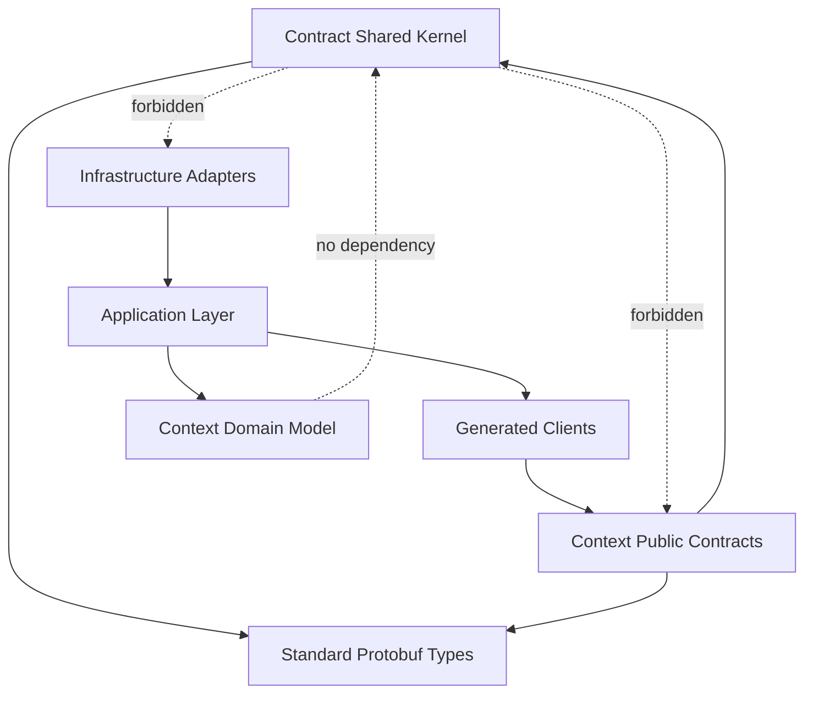

# 10. Shared Kernel и общие контракты {#pads-shared-kernel}



[Оглавление PADS](../index.md) | [Предыдущий раздел: 9. Спецификации ограниченных контекстов](09-bounded-contexts.md) | [Следующий раздел: 11. Владение данными](../platform/11-data-ownership.md)



## 10.1. Назначение главы

Настоящая глава определяет минимальный набор общих контрактных типов M8 Platform, правила их владения, изменения и использования ограниченными контекстами. Общие контракты обеспечивают совместимость API, событий, аудита, длительных операций и сквозной наблюдаемости, не объединяя предметные модели сервисов.

Shared Kernel в M8 Platform является **исключением**, а не способом повторного использования по умолчанию. Каждый ограниченный контекст сохраняет собственную предметную модель и переводит общие контрактные типы во внутренние типы через Boundary Mapper, Anti-Corruption Layer или Adapter.

Глава устанавливает:

- какие типы разрешено публиковать как общие;
- какие типы всегда остаются локальными для контекста;
- структуру канонических пакетов Protobuf;
- правила владения и совместного управления;
- требования к совместимости и версионированию;
- ограничения на зависимости исходного кода;
- проверки, предотвращающие превращение Shared Kernel в распределённый монолит;
- связь общих контрактов с требованиями и Structured Prompts.

## 10.2. Нормативное определение Shared Kernel

В рамках M8 Platform **Shared Kernel** — это малый, явно управляемый набор стабильных публичных семантических типов, которые:

1. одинаково понимаются несколькими ограниченными контекстами;
2. необходимы для обмена через API, события или аудит;
3. не содержат предметных правил конкретного контекста;
4. изменяются редко и только с учётом всех потребителей;
5. допускают независимое хранение и внутреннее представление у каждого потребителя.

Shared Kernel **НЕ ЯВЛЯЕТСЯ**:

- общей доменной моделью всей платформы;
- библиотекой бизнес-логики;
- общей схемой базы данных;
- набором ORM-сущностей;
- общим слоем репозиториев;
- библиотекой внешних интеграций;
- местом для типов, которые неудобно разместить в конкретном контексте;
- основанием для прямых импортов внутренних пакетов одного сервиса другим сервисом.

Общий контракт может использоваться несколькими сервисами, но это не означает совместное владение состоянием. Владение каждым экземпляром ресурса, операции, аудиторского события или ошибки определяется контекстом, выполняющим соответствующую предметную ответственность.

## 10.3. Категории повторно используемых элементов

Все повторно используемые элементы **ДОЛЖНЫ** относиться к одной из следующих категорий.

| Категория | Назначение | Допустимое содержимое | Модель управления |
| --- | --- | --- | --- |
| Contract Shared Kernel | Совместимый обмен между контекстами | Protobuf message, enum, value object envelope, schema annotations | Совместное управление через PADS и ADR |
| Technical Library | Повторное использование технической реализации | tracing middleware, retry helper, protobuf interceptor, test utility | Владение платформенной библиотекой |
| Context-local Domain Model | Реализация предметной модели конкретного контекста | агрегаты, сущности, политики, repository ports, state machine | Исключительное владение контекстом |
| Generated Client | Типобезопасный доступ к публичному API | generated Go/TS/Java clients | Генерация из опубликованного контракта |
| Integration Adapter | Перевод между M8 и внешней системой | Keycloak, SpiceDB, Temporal, YDB, Kafka adapters | Владение использующим контекстом |

Техническая библиотека **НЕ ДОЛЖНА** объявлять предметные типы. Contract Shared Kernel **НЕ ДОЛЖЕН** содержать исполняемую бизнес-логику. Контекстная модель **НЕ ДОЛЖНА** публиковаться как общий пакет только ради устранения дублирования кода.

## 10.4. Принципы общего ядра

| Идентификатор | Нормативный принцип |
| --- | --- |
| `SK-001` | Shared Kernel **ДОЛЖЕН** оставаться минимальным и включать только межконтекстные контрактные примитивы. |
| `SK-002` | Добавление нового общего типа **ДОЛЖНО** сопровождаться перечнем не менее двух независимых контекстов-потребителей. |
| `SK-003` | Тип, имеющий предметные инварианты одного контекста, **ДОЛЖЕН** принадлежать этому контексту, даже если похожие данные нужны другим сервисам. |
| `SK-004` | Общий контракт **ДОЛЖЕН** быть независим от конкретной базы данных, брокера, workflow engine и поставщика IAM. |
| `SK-005` | Изменение Shared Kernel **ДОЛЖНО** проходить проверку совместимости и оценку воздействия на всех потребителей. |
| `SK-006` | Контекст **ДОЛЖЕН** переводить общий контракт во внутреннюю модель на своей границе. |
| `SK-007` | Общий тип **НЕ ДОЛЖЕН** использоваться как внутренняя persistence model агрегата. |
| `SK-008` | Общий пакет **НЕ ДОЛЖЕН** импортировать публичные или внутренние пакеты ограниченных контекстов. |
| `SK-009` | Ограниченный контекст **НЕ ДОЛЖЕН** зависеть от внутреннего кода другого контекста через общий модуль. |
| `SK-010` | Общие enum **ДОЛЖНЫ** описывать только действительно закрытые и платформенно стабильные множества значений. |
| `SK-011` | Расширяемые понятия, такие как действие, тип ресурса, стадия операции или код способности, **СЛЕДУЕТ** представлять стабильной строкой с правилами именования, а не общим enum. |
| `SK-012` | Неизвестные значения общих enum **ДОЛЖНЫ** безопасно обрабатываться потребителями. |
| `SK-013` | Общий контракт **ДОЛЖЕН** иметь устойчивое имя пакета и явную major-версию. |
| `SK-014` | Breaking change общего контракта **ДОЛЖЕН** приводить к новой major-версии пакета либо к отдельному переходному контракту. |
| `SK-015` | Общие сообщения **НЕ ДОЛЖНЫ** содержать секреты, access token, refresh token, credential material или неограниченный произвольный payload. |
| `SK-016` | Shared Kernel **НЕ ДОЛЖЕН** задавать глобальный `BaseEntity`, `BaseAggregate`, `GenericRepository` или общую state machine. |
| `SK-017` | Общие контракты **ДОЛЖНЫ** быть применимы независимо от языка реализации сервиса. |
| `SK-018` | Каждое поле общего контракта **ДОЛЖНО** иметь определённую семантику, обязательность, правила privacy и совместимости. |
| `SK-019` | Контрактные аннотации валидации **ДОЛЖНЫ** проверять форму данных, но не подменять предметные инварианты контекста. |
| `SK-020` | Shared Kernel **ДОЛЖЕН** быть полностью трассируем до PADS, требований, контрактных тестов и ADR, изменяющих его состав. |

## 10.5. Решение о включении типа в Shared Kernel

Тип **МОЖЕТ** быть включён в Shared Kernel только при положительном ответе на все вопросы:

1. Требуется ли этот тип в публичных контрактах двух или более независимых контекстов?
2. Имеет ли он одинаковую семантику во всех этих контекстах?
3. Может ли тип быть определён без предметных правил одного владельца?
4. Стабильна ли его семантика в горизонте нескольких версий API?
5. Может ли каждый контекст использовать собственное внутреннее представление?
6. Не раскрывает ли тип детали реализации, хранения или внешнего поставщика?
7. Можно ли обеспечить обратную совместимость при его развитии?
8. Назначен ли владелец контракта и определён ли процесс согласования изменений?

Если хотя бы на один вопрос дан отрицательный ответ, тип **ДОЛЖЕН** оставаться локальным для контекста и передаваться через его Published Language.

### 10.5.1. Примеры допустимого включения

- `ResourceReference`, содержащий тип и идентификатор ресурса;
- `OperationProgress`, представляющий платформенно понятный прогресс;
- `AuditActorSnapshot`, сохраняющий безопасный исторический снимок инициатора;
- `ErrorInfo`, содержащий стабильный код, retryability и violations;
- `RequestCorrelation`, связывающий запрос, трассу, причинность и операцию;
- `PageRequest` и непрозрачный `PageToken`;
- `FieldMask` из стандартной экосистемы Protobuf;
- envelope интеграционного события.

### 10.5.2. Примеры запрещённого включения

- `AuthenticationTransaction`;
- `User`, `Membership`, `RoleBinding` или `ManagedResource` как общая внутренняя сущность;
- `YdbRepository`, `KafkaProducer` или `TemporalWorkflowContext`;
- Keycloak realm, SpiceDB tuple или Kubernetes object;
- общая таблица состояний всех агрегатов;
- общий интерфейс `Repository<T>`;
- универсальный `map<string, any>` для обхода типизации;
- общий объект `PlatformContext`, содержащий все возможные поля всех сервисов.

## 10.6. Владение и управление изменениями

### 10.6.1. Владелец общего контракта

Для каждого общего пакета назначается **Contract Owner**. Contract Owner отвечает за:

- нормативное определение семантики;
- поддержку схем и документации;
- проверку совместимости;
- публикацию версий;
- каталог потребителей;
- координацию миграций;
- контрактные тесты;
- решение о deprecated-полях;
- связь с PADS и ADR.

Contract Owner не становится владельцем состояния, передаваемого в общем типе.

### 10.6.2. Потребители

Каждый сервис-потребитель **ДОЛЖЕН**:

- фиксировать используемую версию общего пакета;
- поддерживать неизвестные значения расширяемых контрактов;
- иметь boundary mapper между transport и domain model;
- участвовать в проверке breaking changes;
- обновлять consumer contract tests;
- не полагаться на undocumented behavior.

### 10.6.3. Процесс изменения

Изменение общего контракта проходит следующие стадии:

```text
Proposal
  → Impact Analysis
  → Compatibility Check
  → Consumer Review
  → PADS / ADR Update
  → Schema Change
  → Contract Tests
  → Staged Publication
  → Consumer Migration
  → Deprecation Completion
```

Для неблокирующего добавления поля отдельный ADR не обязателен, если изменение:

- полностью обратно совместимо;
- не меняет семантику существующих полей;
- не вводит новый тип владения;
- не создаёт новую синхронную зависимость;
- отражено в каталоге контрактов и release notes.

Изменение границы Shared Kernel, семантики, владельца или major-версии **ДОЛЖНО** оформляться ADR.

## 10.7. Канонические пакеты общих контрактов

Базовая версия платформы определяет следующие пакеты.

| Пакет | Назначение | Разрешённое содержимое | Запрещённое содержимое |
| --- | --- | --- | --- |
| `m8.platform.common.identity.v1` | Нейтральные ссылки на субъектов и инициаторов | `SubjectReference`, `ActorReference`, `ClientReference`, безопасные snapshot-типы | User aggregate, credential, authentication rules |
| `m8.platform.common.resource.v1` | Адресация и представление ресурсов | `ResourceReference`, `ResourceName`, `ParentReference`, `ResourceScope`, labels | Иерархические инварианты Resource Manager, persistence model |
| `m8.platform.common.operation.v1` | Общий контракт длительной операции | metadata, progress, result reference, cancellation state | Temporal workflow, service-specific orchestration |
| `m8.platform.common.audit.v1` | Общий envelope аудиторской записи | actor, target, context, change set, integrity metadata | Предметная интерпретация события и retention policy |
| `m8.platform.common.error.v1` | Машиночитаемые сведения об ошибках | code, category, retryability, violations, resource info | transport exceptions, локализованный stack trace |
| `m8.platform.common.context.v1` | Безопасный контекст запроса и причинности | request, trace, correlation, causation, actor, client, source | решение Access или Risk Decision, token claims dump |
| `m8.platform.common.pagination.v1` | Единая форма постраничной выдачи | page size, opaque page token, next token | SQL offset, database cursor internals |
| `m8.platform.common.event.v1` | Envelope интеграционных событий | event id, type, version, source, subject, time, correlation | конкретный предметный payload другого контекста |
| `m8.platform.common.metadata.v1` | Общие пользовательские метаданные | labels, annotations, timestamps, revision | неограниченный секретный metadata bag |

Новый пакет **НЕ ДОЛЖЕН** создаваться для одного message. Сначала следует определить, относится ли тип к существующему семантическому пакету либо остаётся локальным для Published Language контекста.

## 10.8. Общие идентификаторы и ссылки

### 10.8.1. Typed ID

Публичные контракты **ДОЛЖНЫ** использовать типизированные поля идентификаторов, а не один универсальный `id` без контекста. В Protobuf типизация может выражаться:

- отдельным message, если идентификатор имеет собственную семантику;
- строковым полем с однозначным именем, например `project_id`;
- каноническим resource name;
- `ResourceReference` для полиморфной ссылки.

Внутренний доменный слой **ДОЛЖЕН** использовать отдельные value object для идентификаторов агрегатов, даже если транспортное представление является строкой.

### 10.8.2. ResourceReference

`ResourceReference` используется только когда контракт должен ссылаться на один из нескольких типов ресурсов.

Минимальная логическая модель:

```yaml
ResourceReference:
  resource_type: string
  resource_id: string
  resource_name: string | optional
  scope: ResourceScope | optional
```

Правила:

- `resource_type` **ДОЛЖЕН** использовать каноническое имя из реестра типов ресурсов;
- `resource_id` **ДОЛЖЕН** быть непрозрачным для потребителя;
- `resource_name` **МОЖЕТ** передаваться для маршрутизации и отображения, но не заменяет проверку существования;
- `scope` **МОЖЕТ** содержать безопасный административный контекст;
- ссылка не доказывает существование, активность или доступность ресурса;
- ссылка не является встроенной копией агрегата;
- исторический snapshot **ДОЛЖЕН** отличаться от живой ссылки.

### 10.8.3. SubjectReference, ActorReference и Principal

Общие контракты различают:

| Тип | Назначение |
| --- | --- |
| `SubjectReference` | Субъект, о котором выполняется операция или решение. |
| `ActorReference` | Инициатор действия, зафиксированный для аудита и причинности. |
| `ClientReference` | Клиентское приложение или workload, от имени которого выполнен запрос. |
| `PrincipalSnapshot` | Безопасный снимок подтверждённой стороны на момент действия. |

Общий контракт **НЕ ДОЛЖЕН** считать `User`, `Subject`, `Actor` и `Client` взаимозаменяемыми понятиями.

### 10.8.4. Идентификаторы корреляции

Общие контракты поддерживают следующие идентификаторы:

| Поле | Семантика |
| --- | --- |
| `request_id` | Идентификатор одного входящего запроса или команды. |
| `trace_id` | Идентификатор распределённой трассы. |
| `correlation_id` | Идентификатор логически связанной цепочки действий. |
| `causation_id` | Идентификатор непосредственного сообщения или действия-причины. |
| `operation_id` | Идентификатор длительной операции, если действие связано с ней. |
| `workflow_id` | Техническая ссылка на workflow только для внутренней эксплуатации; не заменяет Operation. |
| `idempotency_key` | Ключ повторяемости команды в пределах определённой области. |

Сервис **НЕ ДОЛЖЕН** генерировать новый `correlation_id`, если корректное значение уже передано доверенным upstream-компонентом. Недоверенные внешние значения должны быть проверены и при необходимости заменены на внутренние.

## 10.9. Общий контекст запроса

### 10.9.1. Назначение

`RequestContext` передаёт минимальный безопасный контекст, необходимый для авторизации, риска, аудита и наблюдаемости. Он не является контейнером для всех заголовков или claims.

Канонические логические группы:

```yaml
RequestContext:
  request: RequestCorrelation
  actor: ActorReference | optional
  subject: SubjectReference | optional
  client: ClientReference | optional
  resource_scope: ResourceScope | optional
  source: RequestSource
  network: NetworkContext | optional
  device: DeviceReference | optional
  assurance: AssuranceContext | optional
  risk: RiskContextReference | optional
  occurred_at: timestamp
```

### 10.9.2. Правила безопасности

- В контекст **НЕ ДОЛЖНЫ** копироваться raw JWT, refresh token, authorization header или credential.
- Claims **ДОЛЖНЫ** быть нормализованы в типизированные безопасные поля.
- Поля IP, geo и device **ДОЛЖНЫ** классифицироваться как чувствительные и обрабатываться по privacy policy.
- Сервис **ДОЛЖЕН** различать asserted context и verified context.
- Наличие `actor_id` не доказывает успешную аутентификацию без подтверждённого assurance context.
- Решение Access **НЕ ДОЛЖНО** передаваться как доверенный boolean от внешнего клиента.
- Risk score **НЕ СЛЕДУЕТ** распространять шире необходимого; предпочтительна ссылка на решение и его класс.

### 10.9.3. Нормализация на границе

Transport middleware **МОЖЕТ** извлекать технический контекст, но application layer **ДОЛЖЕН** получать нормализованный объект, не зависящий от ConnectRPC, HTTP или конкретного токена.

## 10.10. Общий контракт длительных операций

### 10.10.1. Статус Common Operation

`Common Operation` является ограниченным Shared Kernel (`CTX-OPS-CONTRACT`) и общим API-паттерном. В базовой архитектуре он **НЕ ЯВЛЯЕТСЯ** обязательным централизованным сервисом.

Operation хранится и обслуживается сервисом, владеющим исходной мутацией. Отдельный каталог или агрегатор операций **МОЖЕТ** быть создан позднее через проекции, не перенося владение исполнением.

### 10.10.2. Каноническая модель

```yaml
Operation:
  name: string
  done: boolean
  metadata: OperationMetadata
  result: typed response | optional
  error: OperationError | optional

OperationMetadata:
  operation_id: string
  action: string
  state: OperationState
  stage: string | optional
  progress: OperationProgress | optional
  target_resource: ResourceReference | optional
  created_at: timestamp
  started_at: timestamp | optional
  updated_at: timestamp
  completed_at: timestamp | optional
  request: RequestCorrelation
  cancellable: boolean
  cancellation_requested: boolean
  retryable: boolean
```

### 10.10.3. OperationMetadata rule

> **`COMMON-OP-001`:** `OperationMetadata` **ДОЛЖНА** принадлежать пакету `m8.platform.common.operation.v1`. Поле `action` **ДОЛЖНО** быть стабильной строкой, а не общим enum, чтобы каждый сервис мог добавлять действия без изменения Shared Kernel.

### 10.10.4. OperationState

Минимальный общий набор:

```text
OPERATION_STATE_UNSPECIFIED
PENDING
RUNNING
SUCCEEDED
FAILED
CANCELLING
CANCELLED
```

Предметные состояния ресурса не должны добавляться в `OperationState`. Например, `PROVISIONED`, `DEGRADED`, `DISABLED` и `DELETING` принадлежат соответствующим агрегатам.

### 10.10.5. Progress и Stage

- `progress.percent` **МОЖЕТ** отсутствовать, если точная доля неизвестна;
- процент **НЕ ДОЛЖЕН** уменьшаться без явного restart attempt;
- `stage` **ДОЛЖЕН** быть стабильным публичным именем, а не именем функции или Temporal activity;
- service-specific stages **ДОЛЖНЫ** определяться в Published Language сервиса;
- сообщение прогресса **НЕ ДОЛЖНО** содержать секреты или необработанные ошибки поставщика;
- progress не является SLA-обещанием времени завершения.

### 10.10.6. Result и Error

Успешный результат **ДОЛЖЕН** быть типизирован для конкретной операции либо представлен канонической ссылкой на ресурс. Универсальный `Any` допускается только в совместимом с google.longrunning контракте и должен иметь зарегистрированный type URL.

Operation Error **ДОЛЖНА** использовать общую taxonomy ошибок, но предметный код и детали определяет сервис-владелец.

### 10.10.7. Отмена

Cancellation request означает просьбу прекратить дальнейшую работу и **НЕ ГАРАНТИРУЕТ**:

- откат уже совершённых изменений;
- мгновенное завершение;
- отсутствие компенсационных шагов;
- возврат к исходному состоянию ресурса.

Контекст-владелец **ДОЛЖЕН** определить cancellable stages и конечный результат отмены.

## 10.11. Общий контракт аудита

### 10.11.1. Цель

Общий audit envelope позволяет всем сервисам формировать одинаково интерпретируемые записи без передачи контексту Audit права определять предметную семантику действий.

Логическая модель:

```yaml
AuditRecord:
  event_id: string
  event_type: string
  event_version: integer
  occurred_at: timestamp
  recorded_at: timestamp
  actor: AuditActorSnapshot
  subject: SubjectReference | optional
  targets: [AuditTargetSnapshot]
  action: string
  outcome: AuditOutcome
  context: AuditContext
  change_set: AuditChangeSet | optional
  source_service: string
  integrity: IntegrityMetadata | optional
```

### 10.11.2. Snapshot вместо живой ссылки

Аудит **ДОЛЖЕН** сохранять достаточный безопасный snapshot отображаемых данных, чтобы запись оставалась понятной после переименования, удаления или обезличивания ресурса. Snapshot не превращается в источник истины для текущего состояния.

### 10.11.3. ChangeSet

`AuditChangeSet` **ДОЛЖЕН**:

- содержать только разрешённые поля;
- поддерживать redaction;
- различать before/after там, где это допустимо;
- не сохранять credential, token, secret value или полный персональный профиль;
- указывать причины отсутствия значения: `REDACTED`, `NOT_CAPTURED`, `NOT_APPLICABLE`.

### 10.11.4. Outcome

Общий outcome может включать устойчивый закрытый набор: `SUCCEEDED`, `FAILED`, `DENIED`, `CANCELLED`, `PARTIAL`. Предметная причина передаётся отдельным стабильным кодом владельца действия.

## 10.12. Общая модель ошибок

Подробная нормативная taxonomy определена в главе 17. Shared Kernel содержит только форму машиночитаемых деталей.

Минимальная модель:

```yaml
ErrorInfo:
  code: string
  category: ErrorCategory
  message: string
  retryable: boolean
  retry_after: duration | optional
  resource: ResourceReference | optional
  violations: [Violation]
  correlation_id: string | optional
  documentation_ref: string | optional
```

Правила:

- `code` **ДОЛЖЕН** быть стабильным и принадлежать пространству имён сервиса;
- transport status и domain error code **НЕ ДОЛЖНЫ** смешиваться;
- `message` предназначен для безопасного отображения и **НЕ ДОЛЖЕН** содержать stack trace;
- `retryable` определяется владельцем ошибки, а не автоматически по HTTP/gRPC status;
- `Violation` **ДОЛЖЕН** ссылаться на публичное имя поля или правила, а не на внутреннюю структуру БД;
- неизвестный код ошибки **ДОЛЖЕН** обрабатываться как непрозрачный код соответствующей category;
- локализация текста не должна менять машиночитаемый `code`.

## 10.13. Метаданные ресурсов

### 10.13.1. Labels

Labels предназначены для фильтрации, группировки и политик, когда ключи и значения имеют ограниченный размер.

- ключи **ДОЛЖНЫ** иметь зарегистрированное или namespaced имя;
- системный namespace `m8.platform/*` резервируется платформой;
- пользователь не может изменять системные labels без отдельного разрешения;
- label не должен хранить секреты или большие значения;
- семантически значимое состояние не должно существовать только в label;
- ограничения размера и количества задаются контрактом.

### 10.13.2. Annotations

Annotations используются для необязательных интеграционных подсказок и display metadata. Они не участвуют в основных инвариантах, если это явно не зафиксировано в спецификации владельца.

### 10.13.3. Revision и ETag

Общий контракт **МОЖЕТ** предоставлять:

- `revision` как монотонную версию агрегата;
- `etag` как непрозрачный token условной мутации;
- `create_time` и `update_time` как серверные timestamps.

Правила:

- клиент не должен вычислять `etag`;
- `revision` не является глобальной последовательностью платформы;
- optimistic locking проверяется сервисом-владельцем;
- отсутствие `etag` в запросе не разрешает lost update, если операция требует concurrency control.

### 10.13.4. FieldMask

Для частичных update-операций используется `google.protobuf.FieldMask` либо эквивалентный стандартный тип.

- список изменяемых путей **ДОЛЖЕН** быть явно ограничен;
- пустой mask не должен неявно означать изменение всех полей без спецификации;
- immutable и output-only поля **НЕ ДОЛЖНЫ** приниматься;
- изменение вложенного объекта должно иметь определённую replace/merge semantics;
- domain invariants проверяются после применения mask.

## 10.14. Пагинация, фильтрация и сортировка

### 10.14.1. PageRequest

Канонический запрос включает:

```yaml
PageRequest:
  page_size: integer
  page_token: string | optional
```

`page_token` **ДОЛЖЕН** быть непрозрачным для клиента и защищать внутренние детали хранения. Он **МОЖЕТ** быть подписан или зашифрован.

### 10.14.2. PageResponse

Ответ списка **ДОЛЖЕН** содержать `next_page_token`, если существуют дополнительные элементы. `total_size` является необязательным, поскольку его вычисление может быть дорогим или несогласованным с snapshot.

### 10.14.3. Stable ordering

Сервис **ДОЛЖЕН** определить стабильный порядок результатов. При равных пользовательских ключах применяется устойчивый tie-breaker, обычно идентификатор ресурса.

### 10.14.4. Filter и OrderBy

Общий Shared Kernel не задаёт универсальный исполняемый язык фильтрации. Каждый Published Language определяет разрешённые поля и операторы. Общими могут быть только синтаксическая оболочка и требования безопасности.

Запрещено:

- принимать произвольный SQL или YQL;
- раскрывать имена колонок хранения;
- позволять фильтрацию по секретным или неиндексированным полям без явного решения;
- менять семантику существующего filter expression без версии.

## 10.15. Общий envelope интеграционных событий

### 10.15.1. Назначение

Event envelope обеспечивает транспортно-независимую идентификацию, причинность, версионирование и наблюдаемость. Предметный payload всегда принадлежит Published Language контекста-издателя.

```yaml
EventEnvelope:
  event_id: string
  event_type: string
  event_version: integer
  source: string
  subject: string | optional
  occurred_at: timestamp
  published_at: timestamp
  correlation_id: string | optional
  causation_id: string | optional
  trace_context: TraceContext | optional
  tenant_scope: ResourceScope | optional
  data_content_type: string
  schema_ref: string
  payload: typed message
```

### 10.15.2. Правила

- `event_id` **ДОЛЖЕН** быть уникальным и использоваться consumer Inbox для дедупликации;
- `event_type` **ДОЛЖЕН** быть стабильным именем свершившегося факта;
- `event_version` относится к схеме конкретного события, а не к версии всего сервиса;
- `occurred_at` отражает предметное время факта, `published_at` — время публикации;
- payload **ДОЛЖЕН** быть типизированным;
- envelope **НЕ ДОЛЖЕН** содержать transport offset как часть предметного контракта;
- schema reference **ДОЛЖНА** разрешать однозначную проверку версии;
- повторная публикация того же факта сохраняет `event_id`, если это retry доставки;
- новый предметный факт получает новый `event_id` даже при одинаковом payload.

Подробные правила событий приведены в главе 13.

## 10.16. Временные значения, длительности и часовые пояса

- Момент времени **ДОЛЖЕН** передаваться как `google.protobuf.Timestamp` в UTC.
- Длительность **ДОЛЖНА** передаваться как `google.protobuf.Duration` либо типизированное количество единиц, если это предметная величина.
- Локальный календарный день **НЕ ДОЛЖЕН** моделироваться timestamp без часового пояса и бизнес-календаря.
- Серверные `create_time`, `update_time`, `completed_at` устанавливаются владельцем состояния.
- Клиентское время **ДОЛЖНО** помечаться как asserted и не использоваться для security decision без проверки.
- Истечение срока **СЛЕДУЕТ** моделировать абсолютным `expires_at`; `ttl` может передаваться дополнительно для UX.
- Публичные контракты не должны зависеть от системной временной зоны экземпляра сервиса.

## 10.17. Денежные и количественные значения

M8 Platform не вводит глобальную денежную предметную модель, пока она не требуется нескольким ограниченным контекстам. При необходимости денежное значение **ДОЛЖНО** использовать точное представление `currency_code + units + nanos` или специализированный тип владельца.

Запрещено использовать `float`/`double` для денег, квот и величин, требующих точной арифметики.

Количественная величина **ДОЛЖНА** явно определять:

- единицу измерения;
- допустимую точность;
- правила округления;
- диапазон;
- возможность отрицательного значения;
- источник значения.

## 10.18. Protobuf package и namespace rules

### 10.18.1. Имена пакетов

Общие пакеты используют схему:

```text
m8.platform.common.<semantic-area>.v<major>
```

Контекстные публичные пакеты используют:

```text
m8.platform.<context>.<capability>.v<major>
```

Внутренние persistence и implementation packages не публикуются в registry контрактов.

### 10.18.2. Major version

Major-версия является частью package name. Пакеты разных major-версий могут сосуществовать в период миграции.

### 10.18.3. Импорты

Допустимое направление:

```text
context public contract
  → common contract
  → standard protobuf types
```

Запрещённое направление:

```text
common contract
  → context public contract
common contract
  → service internal package
context A internal package
  → context B internal package
```

### 10.18.4. Validation annotations

Protovalidate/buf.validate **МОЖЕТ** проверять:

- обязательность;
- длину и формат;
- диапазон;
- структуру resource name;
- допустимое количество элементов;
- взаимную исключительность полей.

Аннотации **НЕ ДОЛЖНЫ** содержать изменчивые бизнес-правила, требующие состояния другого агрегата или контекста.

## 10.19. Кодогенерация и runtime-библиотеки

### 10.19.1. Разделение схемы и runtime

Репозиторий общих схем **ДОЛЖЕН** быть отделён от runtime-библиотек. Сервис может использовать сгенерированные типы без зависимости от общего runtime SDK.

### 10.19.2. Generated code

- generated code **НЕ ДОЛЖЕН** редактироваться вручную;
- версия генератора и plugins **ДОЛЖНА** быть зафиксирована;
- code generation **ДОЛЖНА** быть воспроизводимой;
- generated clients **ДОЛЖНЫ** сохранять contract semantics;
- domain layer **НЕ СЛЕДУЕТ** напрямую зависеть от generated transport messages.

### 10.19.3. Technical SDK

Общий SDK **МОЖЕТ** включать:

- propagation correlation context;
- ConnectRPC interceptors;
- OpenTelemetry instrumentation;
- error mapping helpers;
- idempotency middleware contracts;
- contract test fixtures.

SDK **НЕ ДОЛЖЕН**:

- принимать решения Access или Risk;
- создавать агрегаты;
- скрывать сетевые вызовы как локальные функции;
- содержать глобальный service locator;
- требовать единой версии всех внутренних библиотек платформы.

## 10.20. Совместимость и эволюция

### 10.20.1. Обратно совместимые изменения

Как правило, допустимы:

- добавление optional-поля;
- добавление нового message;
- добавление новой RPC при сохранении существующих;
- добавление enum value при корректной обработке unknown;
- расширение documentation и validation, не отвергающее ранее допустимые корректные запросы;
- добавление нового event type.

### 10.20.2. Потенциально несовместимые изменения

Требуют отдельной оценки:

- ужесточение validation;
- изменение default semantics;
- превращение optional-поля в обязательное;
- изменение значения existing enum;
- смена units, timezone или precision;
- изменение idempotency scope;
- изменение ownership или consistency guarantees;
- изменение privacy classification.

### 10.20.3. Запрещённые изменения в рамках версии

- переиспользование удалённого field number;
- изменение типа поля на несовместимый;
- изменение смысла поля без нового имени;
- переименование стабильного error code;
- изменение event fact semantics при сохранении event type/version;
- публикация внутреннего persistence identifier вместо public ID.

### 10.20.4. Deprecation

Deprecated-поле или операция **ДОЛЖНЫ** иметь:

- причину;
- замену;
- дату или условие прекращения поддержки;
- список известных потребителей;
- миграционную инструкцию;
- telemetry использования, если технически возможно.

## 10.21. Ограничение связности версий

Общие контракты не должны заставлять все сервисы обновляться одновременно.

- сервисы **ДОЛЖНЫ** иметь независимый release lifecycle;
- common packages **ДОЛЖНЫ** поддерживать совместимый диапазон версий;
- generated clients **СЛЕДУЕТ** публиковать отдельно по языкам;
- изменение технической библиотеки не должно требовать изменения contract package без семантической причины;
- монорепозиторий не отменяет логическую независимость версий;
- единый commit не является доказательством атомарного platform deployment.

## 10.22. Запрещённые общие абстракции

Следующие абстракции запрещены без отдельного ADR:

| Запрещённая абстракция | Причина |
| --- | --- |
| `BaseEntity` со всеми возможными полями | Смешивает жизненные циклы и навязывает ложную однородность агрегатов. |
| `GenericRepository<T>` | Скрывает предметную семантику загрузки, блокировки и транзакций. |
| `UniversalDomainEvent` с `map<string, any>` | Уничтожает типизацию и совместимость схем. |
| `PlatformStatus` для всех ресурсов | Смешивает разные state machine. |
| Общий `Role`, `User`, `Policy`, `Resource` aggregate | Нарушает владение bounded context. |
| Общий persistence DTO | Связывает сервисы с единой моделью хранения. |
| Общий API Gateway DTO как доменная модель | Делает представление каноническим источником вместо владельцев данных. |
| Common Keycloak/SpiceDB/Kubernetes model | Протекает внешний язык в ядро платформы. |
| Global transaction abstraction | Создаёт ложное ожидание распределённой атомарности. |
| Универсальный workflow DSL без владельца процесса | Скрывает ответственность и компенсационные правила. |

## 10.23. Зависимости Shared Kernel

Каноническая зависимость модулей:



Domain layer может использовать собственные value objects с той же семантикой, но **СЛЕДУЕТ** избегать прямой зависимости от transport-generated messages. Преобразование выполняется в application/transport boundary.

## 10.24. Проверки соответствия

Для Shared Kernel **ДОЛЖНЫ** выполняться следующие автоматические проверки.

| Проверка | Ожидаемый результат |
| --- | --- |
| Buf breaking check | Не допускает несовместимые изменения в текущей major-версии. |
| Lint package boundaries | Common packages не импортируют context packages. |
| Dependency test | Domain packages не импортируют generated transport packages, если это запрещено модульной политикой. |
| Schema documentation check | Каждое message и публичное поле документировано. |
| Privacy lint | Запрещённые secret/credential поля отсутствуют в common schemas. |
| Enum compatibility test | Unknown values обрабатываются безопасно. |
| Contract consumer tests | Основные потребители подтверждают совместимость. |
| Serialization golden tests | Стабильные fixtures читаются новыми версиями. |
| Field number reservation check | Удалённые номера и имена зарезервированы. |
| Package ownership check | Для каждого common package указан Contract Owner. |
| Traceability check | Изменение содержит ссылку на `SK-*`, requirement или ADR. |

## 10.25. Критерии принятия нового общего контракта

Новый общий контракт готов к публикации, если:

1. определена единая семантика;
2. перечислены реальные потребители;
3. назначен Contract Owner;
4. подтверждено отсутствие предметной логики одного контекста;
5. определена privacy classification;
6. определены validation rules;
7. определены unknown/default semantics;
8. сформированы compatibility tests;
9. указан migration path;
10. создан boundary mapper как минимум в одном сервисе-потребителе;
11. обновлены PADS и каталог контрактов;
12. добавлена трассировка к требованиям и SPDD;
13. отсутствует запрещённая зависимость на инфраструктуру;
14. получено согласование владельцев затронутых контекстов.

## 10.26. Трассировка требований

Для общих контрактов используются следующие пространства идентификаторов.

| Семейство | Назначение | Пример |
| --- | --- | --- |
| `COMMON-FR-*` | Функциональное требование к общему контракту | `COMMON-FR-001` |
| `COMMON-NFR-*` | Нефункциональное требование совместимости или безопасности | `COMMON-NFR-004` |
| `COMMON-CON-*` | Конкретный публичный контракт | `COMMON-CON-OPERATION-V1` |
| `COMMON-INV-*` | Инвариант общей формы | `COMMON-INV-003` |
| `COMMON-TEST-*` | Контрактная проверка | `COMMON-TEST-BREAKING-001` |
| `SK-*` | Архитектурный принцип Shared Kernel | `SK-006` |

Трассировка должна иметь вид:

```text
Business / Platform Requirement
  → COMMON-FR / COMMON-NFR
  → SK principle
  → Common Contract
  → Context Contract Usage
  → Generated Artifact
  → Consumer Contract Test
  → SPDD Prompt
  → Acceptance Evidence
```

## 10.27. Требования к SPDD

Structured Prompt, изменяющий общий контракт, **ДОЛЖЕН** содержать:

```yaml
shared_kernel_change:
  contract_id: COMMON-CON-...
  package: m8.platform.common.<area>.v1
  change_type: additive | deprecation | breaking | clarification
  owner: <contract-owner>
  consumers:
    - <context/service>
  semantics:
    current: <current-definition>
    proposed: <proposed-definition>
  compatibility:
    wire_compatible: true | false
    source_compatible: true | false
    behavior_compatible: true | false
  privacy_classification: <classification>
  migration:
    producer_steps: []
    consumer_steps: []
    deprecation_end_condition: <condition>
  constraints:
    - no domain logic
    - no infrastructure types
    - no context-to-context internal dependency
  verification:
    - buf breaking
    - lint
    - contract tests
    - consumer tests
    - traceability check
```

ИИ-агент **НЕ ДОЛЖЕН** самостоятельно переносить тип в Shared Kernel только для устранения дублирования. Такое изменение требует явного требования или принятого архитектурного решения.

## 10.28. Реестр базовых общих контрактов

| Идентификатор | Пакет | Контракт | Владелец | Основные потребители |
| --- | --- | --- | --- | --- |
| `COMMON-CON-IDENTITY-REF-V1` | `common.identity.v1` | Subject/Actor/Client references | Platform Architecture + Identity | Authentication, Access, Risk, Audit |
| `COMMON-CON-RESOURCE-REF-V1` | `common.resource.v1` | ResourceReference и ResourceScope | Resource Manager | Все контексты |
| `COMMON-CON-OPERATION-V1` | `common.operation.v1` | Operation metadata и progress | Platform Architecture | Resource Manager, Identity, Authentication, Provisioning, Audit export |
| `COMMON-CON-AUDIT-V1` | `common.audit.v1` | Audit envelope и snapshots | Audit | Все производители аудита |
| `COMMON-CON-ERROR-V1` | `common.error.v1` | ErrorInfo и violations | Platform Architecture | Все API-сервисы |
| `COMMON-CON-CONTEXT-V1` | `common.context.v1` | Request/correlation context | Security Architecture | Все сервисы |
| `COMMON-CON-PAGE-V1` | `common.pagination.v1` | PageRequest/PageResponse primitives | Platform Architecture | Все list API |
| `COMMON-CON-EVENT-V1` | `common.event.v1` | EventEnvelope | Integration Architecture | Все publisher/consumer сервисы |
| `COMMON-CON-METADATA-V1` | `common.metadata.v1` | labels, annotations, revision | Resource Manager + Platform Architecture | Ресурсные сервисы |

## 10.29. Критерии соответствия главы

Архитектура соответствует настоящей главе, если одновременно выполняются условия:

1. Shared Kernel содержит только стабильные межконтекстные контрактные типы;
2. каждый общий пакет имеет Contract Owner;
3. все контексты сохраняют локальные domain model;
4. отсутствуют общие persistence model и generic repository;
5. зависимости направлены от context contracts к common contracts, но не наоборот;
6. общий Operation не создаёт централизованного владельца всех процессов;
7. ResourceReference, SubjectReference и ActorReference не смешиваются;
8. RequestContext не содержит credential material и необработанные token claims;
9. события имеют типизированный payload и общий envelope;
10. ошибки имеют стабильный service-owned code и transport-independent details;
11. общие schemas проходят breaking, lint, privacy и consumer tests;
12. breaking changes публикуются в новой major-версии или через утверждённый переходный план;
13. deprecated элементы имеют миграционный путь и условие удаления;
14. Structured Prompts не могут расширять Shared Kernel без явной архитектурной трассировки;
15. все общие контракты отражены в реестре и связаны с требованиями.

---
