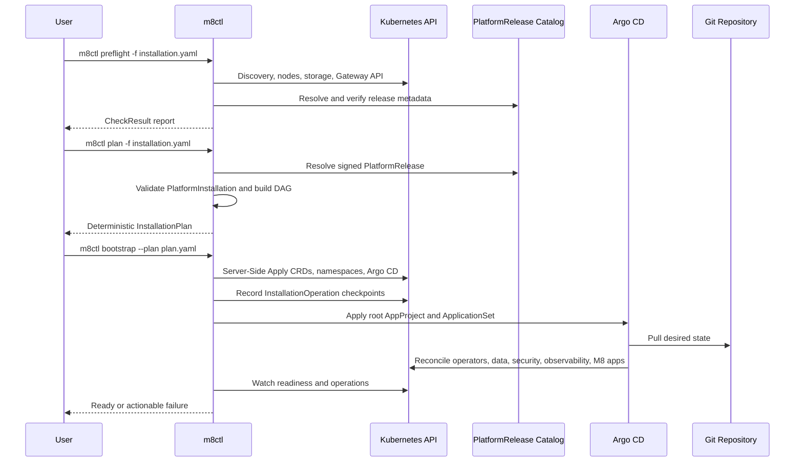

# M8 Installer 1.0

## Architectural Decision

M8 Installer is a bounded installer subsystem for reproducible Kubernetes installation, upgrade, diagnostics, backup and recovery of M8 Platform. The CLI performs bootstrap and operational planning, but after bootstrap the source of truth is Git plus `PlatformInstallation` plus signed `PlatformRelease`.

M8 Installer is not a long-running alternative control plane. It writes the minimum bootstrap layer directly, records resumable `InstallationOperation` state, then hands steady-state reconciliation to Argo CD.

## Assumptions

- Kubernetes API access is available through kubeconfig, OIDC or impersonation.
- Production installation uses external secrets and signed release artifacts.
- Air-gapped installation imports a complete release bundle into private registries before install.
- M8 Installer 1.0 is single-management-cluster-first, with API boundaries ready for member clusters.
- The first code baseline implements `preflight` and deterministic `plan`; mutating commands are explicit MVP stubs.

## Alternatives

| Alternative | Rejected Because |
| --- | --- |
| Helm-only installer | It cannot own preflight, resumable operations, air-gapped bundle verification and cross-component dependency readiness coherently. |
| Argo CD-only bootstrap | A clean cluster cannot reconcile Argo CD before Argo CD exists. |
| CLI as permanent controller | It would create two control planes and make drift ownership ambiguous. |
| Shelling out to kubectl/helm/jq/yq | It makes reproducibility, diagnostics and air-gapped support depend on host tools. |

## Component Boundaries

| Component | Responsibility | Must Not Own |
| --- | --- | --- |
| `cmd/m8ctl` | CLI entrypoint, signal handling, exit code | Business decisions |
| `api/installer/v1alpha1` | Kubernetes API types and validation/defaulting | Kubernetes clients, Helm clients |
| `internal/installer/preflight` | Check framework and live cluster checks | Installation mutation |
| `internal/installer/planner` | Deterministic plan generation | Direct apply |
| `internal/installer/graph` | Dependency DAG and sync ordering | Component-specific policy |
| `internal/installer/kubernetes` | client-go adapter | Business validation |
| `internal/installer/catalog` | Release catalog loading and verification | Registry implementation |
| `internal/installer/helm`, `registry`, `gitops` | Ports for external systems | Domain decisions |
| `charts/m8-installer-crds` | Bootstrap CRDs | Stateful platform resources |
| `gitops/root` | Argo CD handoff | CLI behavior |

## Sequence Diagram



## Dependency Graph

Sync waves are ordered by a DAG, not static waits.

| Wave | Step | Readiness Gate |
| ---: | --- | --- |
| -100 | CRDs | Established condition |
| -90 | Namespaces | Namespace and Pod Security labels exist |
| -80 | PKI and trust | cert-manager, trust-manager, SPIRE ready |
| -70 | Secrets and security | ESO/Kyverno webhooks ready |
| -65 | Cilium | Cilium nodes and Hubble ready when enabled |
| -60 | Data operators | Operator deployments ready |
| -50 | Data clusters | DB/Kafka/Redis endpoints ready |
| -40 | Identity and authorization | Keycloak realm and SpiceDB schema ready |
| -30 | Observability | Prometheus, OTel, Grafana ready |
| -20 | Envoy Gateway | GatewayClass accepted, Gateway programmed |
| -10 | Shared M8 services | Operations/idempotency APIs ready |
| 0 | M8 applications | Enabled module deployments ready |
| 10 | Routes and policies | Routes accepted and programmed |
| 20 | Bootstrap data | Jobs completed once with checkpoint |
| 30 | Smoke tests | Functional tests pass |

## Security And Trust Boundaries

- CLI host is a trusted operator workstation or CI runner, but secrets must not be passed as arguments.
- Kubernetes API is the only live cluster mutation boundary.
- Git and release catalog are signed trust inputs after bootstrap.
- OCI registry is trusted only when digest and signature verification pass.
- External secrets stores are the source of secret values; Git stores references only.
- Diagnostic archives must redact tokens, passwords, private keys, cookies and authorization headers.

## State Ownership

| State | Owner |
| --- | --- |
| Desired platform configuration | Git + `PlatformInstallation` |
| Release versions and digests | Signed `PlatformRelease` |
| Operation progress | `InstallationOperation` |
| Runtime reconciliation | Argo CD Applications |
| Stateful data | Component-native stores and backups |
| Diagnostics | Ephemeral CLI bundle, sanitized before write |

## Interfaces

The first code baseline includes these stable ports:

```go
type ReleaseCatalog interface {
    Resolve(ctx context.Context, version string) (PlatformRelease, error)
    Verify(ctx context.Context, release PlatformRelease) error
}

type Check interface {
    ID() string
    Run(ctx context.Context, installation PlatformInstallation) Result
}

type ClusterReader interface {
    ServerVersion(ctx context.Context) (string, error)
    NodeSummary(ctx context.Context) (NodeSummary, error)
    HasAPIResource(ctx context.Context, groupVersion, kind string) (bool, error)
    StorageClasses(ctx context.Context) ([]string, error)
}
```

## Readiness Criteria

- `m8ctl plan` produces a deterministic plan with config and release digests.
- `m8ctl preflight` reports check IDs, severity, status, remediation and documentation references.
- Mutating commands remain disabled until operation checkpoints and server-side apply execution are implemented.
- Release catalog validation rejects floating versions and missing digests.

## Open Questions And Risks

- Exact component versions must be finalized against M8 support policy.
- CRD schemas should be generated from Go types before beta to avoid manual drift.
- Bootstrap Cilium replacement needs a cluster-specific recovery runbook.
- Multi-cluster registration needs concrete Argo CD cluster secret and SPIRE federation flows.

