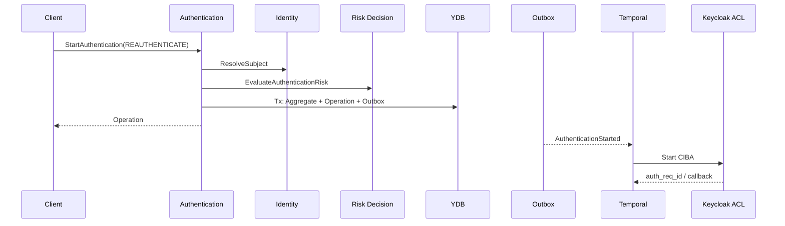

# UC-AUTH-017 — Начать повторную CIBA-аутентификацию {#uc-auth-017}



[Engineering artifacts](../../index.md) | [Pilot index](index.md) | [Requirements: AUTH-FR-017](../../../architecture/requirements/contexts/06-authentication.md#auth-fr-017) | [Traceability](../../traceability/traceability-registry.md) | [SPDD](../../spdd/index.md)



_UC-AUTH-017 · Версия 0.1 · 10 июля 2026 года_

| Поле | Значение |
| --- | --- |
| Идентификатор | `UC-AUTH-017` |
| Версия | `0.1` |
| Статус | Проект |
| Владелец | Sergey Gorbachev |
| Нормативная основа | `PADS-000@1.0`, `M8-REQ-000@0.1` |
| Область | AUTH-FR-017 |

# Основной поток

1. Доверенный Client получает отказ refresh от authorization component.
2. Client вызывает `StartAuthentication` с intent `REAUTHENTICATE`, reason `REFRESH_UNAVAILABLE` и idempotency key.
3. Authentication проверяет Client и permission.
4. Identity разрешает Subject.
5. Risk Decision возвращает ALLOW или CHALLENGE с required AAL.
6. Authentication создаёт aggregate в `CREATED/CHALLENGE_PENDING`, Operation и Outbox в одной YDB-транзакции.
7. API возвращает Operation.
8. Outbox публикует `AuthenticationStarted.v1`.
9. Temporal workflow вызывает Keycloak CIBA ACL и обновляет challenge/progress.
10. Provider callback завершает Authentication отдельным use case.

# Альтернативы

- Client disabled/flow forbidden → synchronous canonical error, no aggregate.
- Subject not found → no aggregate; enumeration-safe response policy.
- Risk DENY → failed Operation/audit; provider не вызывается.
- Risk/Identity unavailable → retryable error или failed Operation по моменту сбоя; no silent fallback.
- Keycloak unavailable after commit → Operation remains retryable; workflow retries with bounded backoff.
