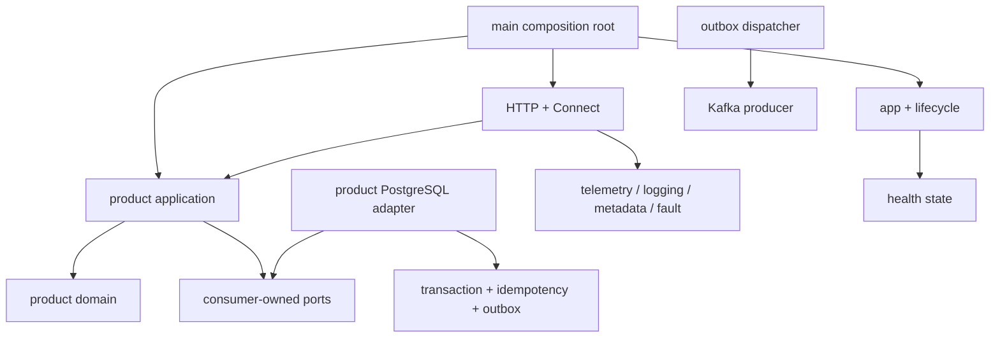
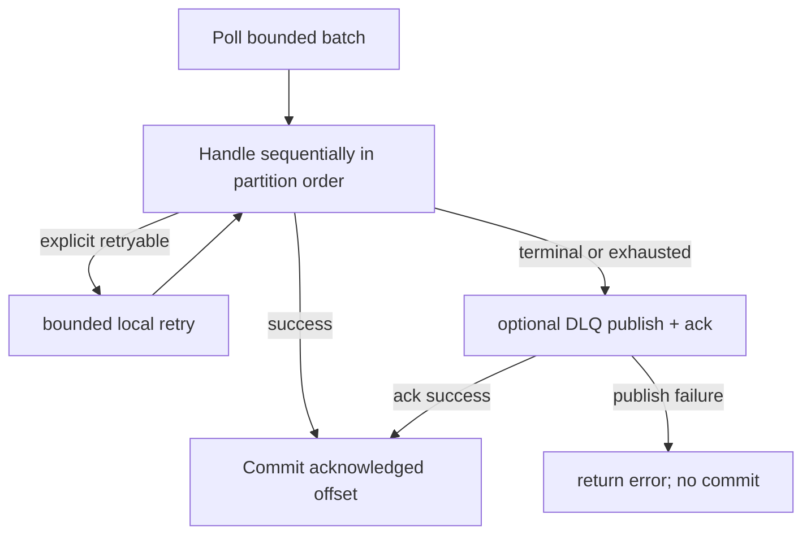
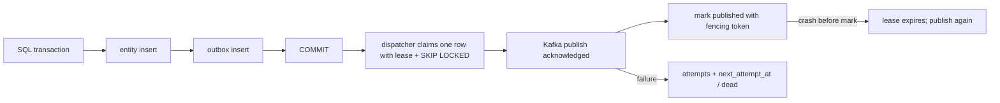
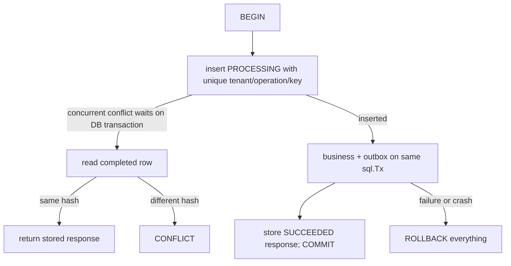

# Platform SDK: architecture and implementation boundary

## A. Architecture

The SDK is a separate Go module, not a global container. The existing platform
is not migrated in this change. The reference executable explicitly loads and
validates config, constructs a logger, telemetry, SQL pool, Kafka client,
repositories, use cases and Connect handlers. `app.Run(ctx, Config, components...)`
owns runtime only; it returns an error and never calls os.Exit. The main function
owns signals and exit codes. This is more legible than `WithKafka` options that
create invisible dependencies. No reflection DI, automatic registration or init
functions start work.



Register components in dependency order. No dependency graph solver: the order
is visible in main. Start is sequential and binds listeners before readiness.
Run owns long-running work. Stop is reverse order. A failed Start must clean up
its own partial acquisition; previously started components are rolled back.
All components must honor context deadlines. Go cannot safely kill arbitrary
goroutines; Force closes owned IO, and after the global budget main exits with
failure. A runtime task that ignores cancellation is a component contract bug,
not something the SDK can magically repair.

```mermaid
sequenceDiagram
  participant M as main
  participant A as app
  participant D as database
  participant K as Kafka
  participant T as telemetry
  participant H as HTTP
  participant W as workers
  M->>M: load + validate config; construct dependencies
  M->>A: Run(signal context, components)
  A->>D: Start / Ping
  A->>K: Start / Ping
  A->>T: Start
  A->>H: Start / bind
  A->>W: Start
  A->>A: launch owned Run tasks; readiness=true
  Note over A,H: failed HTTP Start => Stop telemetry, Kafka, database
  M->>A: SIGTERM / SIGINT / cancellation
  A->>A: readiness=false
  A->>W: cancel / Stop / join
  A->>H: Shutdown / drain / join
  A->>T: flush / Shutdown
  A->>K: Close
  A->>D: Close
  A-->>M: nil or error
```

Kubernetes termination budget must exceed the app shutdown budget (45s vs 30s).
Shutdown uses a fresh bounded context, not the canceled signal context. Readiness
is disabled first. Reverse-order Stop prevents closing a DB while HTTP is still
draining. Outbox does not attempt an unbounded backlog flush on termination;
unpublished events remain durable. Listeners force-close after drain timeout.
Runtime goroutines receive pprof labels containing component name only. On timeout
capture goroutine stacks to the server logger. Go 1.27 supports the
`goroutineleak` profile; expose it only through an authenticated/private diagnostic
endpoint or capture locally. It is reachability-based and cannot prove absence of
all leaks. See [Go 1.27 runtime notes](https://go.dev/doc/go1.27#runtime).

```mermaid
flowchart LR
  request --> trace[request metadata + trace + metrics + logs]
  trace --> recover[panic recovery + public error mapping]
  recover --> authn[authentication]
  authn --> methodauth[transport method authorization]
  methodauth --> limit[optional rate limit]
  limit --> validate[protobuf validation]
  validate --> handler[transport conversion]
  handler --> authorize[application resource authorization]
  authorize --> idem[transactional idempotency]
  idem --> business[domain + storage + outbox]
```



Recovery and error mapping must be inside the outer observation boundary, so
panic failures are measured. Recovery protects untrusted handler code; it does
not log panic values or request bodies. Authentication precedes validation and
deduplication; authorization must also execute on replays. Generic transport
authorization can reject methods, but resource authorization stays in the use
case. Idempotency is not generic middleware: its transaction must include the
business mutation. Rate limiting is a consumer-supplied policy; this reference
does not pretend a local bucket enforces a distributed tenant quota. Streaming
requires dedicated per-message validation/auth policy and no whole-response
idempotency; the reference exposes unary handlers only and fails closed for
streaming through its standard chain.



The first consumer implementation has concurrency=1 and bounded polling. This
is deliberately safe: a generic worker pool cannot commit a later offset while
an earlier record in the same partition is unfinished. Scale via consumer group
instances/partitions first. A future pool must assign ordered partition lanes,
commit only contiguous completed offsets, and fence revoked assignments. Franz-go
rebalance blocking is released after each bounded batch; max poll interval must
exceed batch size × handler deadline × retry budget. A timed-out handler that
ignores context cannot be forcibly killed; do not start detached timeout goroutines.



Publishing and marking are not atomic. Delivery is at-least-once. An event ID is
stable across every attempt; consumer inbox deduplicates in its business database.
Rows have leases/fencing tokens for concurrent dispatchers. Batches must not take
longer than leases: the reference claims one record per publish and bounds each
publish below lease duration. Dead rows require operator inspection and deliberate
replay. Cleanup never removes pending/dead rows automatically. Retention of
published/outbox and completed/inbox rows must exceed the supported replay window.



For SQL-only mutations, PROCESSING is never independently committed. A crash
rolls back business work and key together; no lease recovery job is needed.
Concurrent identical requests block on the unique constraint with a bounded
context. Store result bytes, not generic `any`; service controls serialization.
Do not cache transient errors. FAILED/leases are needed for detached operations
with external side effects, which this implementation deliberately does not offer.
An expired key is rejected until operator/retention cleanup; deleting keys permits
re-execution and must be an explicit API retention contract. Redis is unsuitable
for atomic SQL mutation/outbox deduplication. YDB should implement its own
transaction-scoped store rather than pretending sql.Tx is portable.

Inbox inserts its unique (consumer,message_id) marker BEFORE business work inside
the SAME SQL transaction. On conflict it waits and skips only committed work.
Marker insertion and mutation roll back together. This closes the race in
`check -> execute -> insert`. Inbox callbacks may only do transactional DB work.

## B. Packages

| Package | Responsibility |
|---|---|
| app | deterministic run, rollback, bounded shutdown, owned tasks |
| lifecycle | explicit Start/Run/Stop/Force function component |
| health | live/startup/ready state and bounded readiness checks |
| logging | slog configuration and recursive sensitive-key redaction |
| metadata | typed request ID/principal context values; no dependencies |
| telemetry | explicit OTel providers, OTLP gRPC traces, Prometheus metrics |
| connect | unary interception, authn, validation, recovery, correlation, mapping |
| fault | transport-neutral codes, safe messages, causes and field violations |
| retry | bounded opt-in backoff/jitter/classification; no default retries |
| kafka | thin franz-go producer/consumer, propagation, acknowledgment |
| transaction | explicit sql.Tx helper, no transaction hidden in context |
| idempotency | transaction-scoped SQL deduplication and response storage |
| outbox | SQL insertion, fenced claiming and at-least-once dispatch |
| inbox | transaction-scoped consumer deduplication |
| temporal | optional worker lifecycle adapter; no workflow abstraction |
| testkit | concurrency-safe event recorder and test logger; synctest supplies virtual time |

Config and shutdown do not need separate universal frameworks: typed config is
owned by each service; bounded shutdown is part of app. SQL schema creation is an
explicit migration, never automatic on every production startup. `service-template`
is a separate module with product domain/app/adapters, proto and generated Connect
code, migrations and deploy assets. Native SQL/Kafka/OTel/Connect APIs stay public.

## C–D. API and reference implementation

The Go files are the compilable public API, not aspirational interfaces. See
`service-template/cmd/api/main.go` for the complete dependency graph. Reference
service creates and reads products, publishes ProductCreated through SQL outbox,
uses tenant-scoped idempotency, validates protobuf requests, and serves Connect
plus the Connect HTTP GET protocol. Production IAM is a required injected adapter;
the reference supplies RFC 7662 introspection with company tenant/role extensions.
A development-only
static token requires an explicit insecure-local configuration; no allow-all
fallback is enabled in production. TLS is required unless local mode is selected.

## E. Failure scenarios

| Failure | Expected behavior |
|---|---|
| PostgreSQL unavailable at startup | bounded Ping fails; no readiness; rollback; exit failure |
| Kafka unavailable at startup | required Ping fails; close DB; exit failure; optionally defer Kafka readiness in a different host that accepts durable outbox backlog |
| Kafka fails later | producer returns ack failure; outbox reschedules; API may keep accepting durable writes while backlog is within operational limits |
| HTTP handler panic | recovery logs stack without request/panic payload; INTERNAL; trace error; process continues |
| Consumer handler panic | converted to terminal handler error; configured DLQ or stop; no commit before durable disposition |
| Consumer timeout | cancel handler context; retry only with explicit classifier/budget; uncooperative handler is diagnosed at process shutdown |
| Outbox publish fails | increment attempts, exponential reschedule; after max attempts mark dead and alert |
| Duplicate Kafka event | inbox unique marker + mutation in one transaction; replay does not repeat business effect |
| Duplicate HTTP request | same tenant/operation/key/hash returns stored bytes; different hash conflicts; auth is checked again |
| SIGTERM | not ready; stop intake; bounded reverse drain; flush telemetry; close clients |
| Shutdown timeout | force-close supported resources, log goroutine diagnostics, return error; main exits nonzero |
| Collector unavailable | bounded exporter queue/timeouts drop telemetry under pressure; no readiness/liveness failure; native OTel exporter diagnostics remain enabled (no global SDK error handler is replaced) |

Liveness never pings dependencies. Startup means initialization finished once.
Readiness means startup completed, not draining, and required checks pass. Checks
run only on readiness with a shared check deadline; production can cache them if the
probe rate justifies it. A Kafka outage must not trigger dependency-based liveness
restarts. Management/diagnostic listeners must not be exposed publicly.

## F. Testing and operations

Unit tests exercise rollback order, cancellation, errors, retry classification,
redaction and interceptors without launching an application. Use httptest for
Connect, testing/synctest for timers, race detector for ownership, fuzzing for
metadata/error/hash input. SQL integration tests use a real PostgreSQL database
and verify concurrent request deduplication, inbox rollback/replay, and outbox
acknowledgment. Kafka integration checks real broker acknowledgment and manual
commit. Crash-between-ack-and-mark, lease fencing races, failed DLQ publication,
rebalance, broker failover and retention races remain required failure-injection
coverage before production rollout; in-memory fakes cannot prove these semantics.
The local compose file is a repeatable integration fixture; tests skip only when
explicit integration environment variables are absent. CI must enable those jobs.

Prometheus/Mimir scrape `/metrics`; only bounded operation/status/topic/group
dimensions are allowed. Never SKU, tenant, user, request/event ID or raw paths.
Metrics include application_info, RPC requests/duration, producer results,
consumer results/duration and outbox publish results. Idempotency hit/conflict
metrics and retry/dead-row alerts are remaining instrumentation work. Kafka
lag/backlog gauges require broker/database polling with an owned lifecycle; do
not fake these gauges from a single request. SDK test coverage and runtime scope
are reported separately from deployment/capacity certification.

Retry policy is explicit at a single owner. Local retry: short transient faults
within a request budget; retry topics: asynchronous deferral that sacrifices
original partition ordering; delayed queue: scheduled delivery infrastructure;
Temporal: long workflows and compensation; DLQ: operator remediation. Kafka topics
are not delayed queues: consumers must schedule rather than busy-loop or sleep
while holding a partition. Suggested names are `<topic>.retry.1/2/3` and
`<topic>.dlq`; original event ID, attempt, source topic/partition/offset are retained.
No hidden client+application+Kafka+Temporal retry multiplication. Kafka protocol
producer retries are explicitly configured and bounded separately from business
retries. Idempotent producer does not imply exactly-once end-to-end.
The wrapper enables franz-go `AllowIdempotentProduceCancellation`: without it,
idempotent sequencing may defer cancellation/retry limits for an in-flight record
whose acknowledgment was lost. Cancellation therefore means an unknown delivery
outcome, not proof of non-delivery. Outbox replay preserves event IDs and inbox
deduplicates effects. Kafka transactions require a separately configured native
client because that cancellation option is incompatible with transactional IDs.

Temporal is optional: inject the native worker, configure native activity/workflow
options, SDK logger adapter and official OTel interceptor at composition. Stop
the worker before its client. Never put retry.Do in a workflow or use runtime
context/clock APIs for workflow decisions. The initial adapter owns worker
startup/shutdown only; complete Temporal tracing requires the official integration.

## G. Decision log and dependencies

| Decision | Selected | Alternative | Reason and maintenance cost |
|---|---|---|---|
| logging | slog | zap | standard structured API; redaction is explicit, not arbitrary-value PII detection |
| HTTP | net/http | Gin | stdlib routing, timeouts and shutdown; streaming uses a separately configured server |
| Kafka | franz-go | Sarama | native context, manual commits and rebalance controls; broker protocol/rebalance tests remain required |
| DI | constructors | Wire/Fx/reflection container | dependencies and ownership visible; modest manual wiring |
| telemetry | OTel SDK + OTLP + Prometheus exporter | custom tracing | portable collectors and Mimir-compatible scrape; pin compatible exporter versions and monitor queues |
| RPC | ConnectRPC | grpc-go only | protobuf plus HTTP interoperability; retain native handlers/client options |
| validation | protovalidate | handwritten transport checks | schema constraints and violations; CEL compile/cache cost requires startup construction |
| SQL | database/sql + pgx stdlib driver | ORM | explicit SQL and sql.Tx; PostgreSQL protocol is not in stdlib |
| retries | explicit local budget | retry topics everywhere | fewer moving parts for brief failures; long deferral belongs outside request path |
| outbox | polling + leases | CDC | small operational footprint; polling latency/DB load, no implied per-aggregate ordering across publishers |
| idempotency | same SQL transaction | Redis lock | crash-safe atomic effect and response; blocks duplicates for transaction duration |
| concurrency | errgroup | detached goroutines | owned tasks and error propagation; cancellation remains cooperative |
| event envelope | explicit headers | mandatory CloudEvents | no unnecessary wire constraint; optional CloudEvents adapter can map stable fields |

All external module versions are pinned by go.mod/go.sum. Standard Go cannot
implement Kafka/PostgreSQL protocols, Connect wire formats or OTel exporters by
itself. Protobuf-generated code is never edited. buf lint/build/generate and
govulncheck are required CI gates. govulncheck findings require triage, not blind
major-version upgrades. Native clients remain accessible for unsupported SDK use.

Version the module independently with SemVer (initial v0.x until APIs stabilize).
The selected import path assumes publication as the separate `m8-team/platform-sdk`
repository with `v0.x.y` tags; current development uses a local replace directive.
If publication remains in this monorepo instead, change the module/import prefix
to `github.com/m8-team/platform/platform-sdk` and use `platform-sdk/v0.x.y` tags.
Do not publish subdirectory tags for an unrelated repository import path.
In either case v2 uses a `/v2` module/import suffix.
Keep the core small; expensive optional integrations may split into separately
versioned modules if dependency cost warrants it. Services pin versions, upgrade
through automated PRs and canary rollout, not a synchronous big-bang deployment.
Deprecate with a documented replacement and migration window after v1. Template
updates are examples, not forced generated rewrites. A future generator should
only rename module/service/proto package and copy files, never generate business
logic. New service: copy template, set module replace/version, define proto,
implement use case, migrate DB and deploy.

Sources: [Connect interceptors](https://connectrpc.com/docs/go/interceptors/),
[franz-go](https://github.com/twmb/franz-go),
[OTel Go exporters](https://opentelemetry.io/docs/languages/go/exporters/).

### Direct dependency inventory

| Module family | Why stdlib is insufficient / operational cost |
|---|---|
| connectrpc.com/connect | Connect/gRPC wire framing and generated handlers; protocol compatibility testing |
| buf.build/go/protovalidate + generated constraint schema | schema-driven protobuf validation; CEL dependency/cache footprint |
| google.golang.org/protobuf | protobuf descriptors and serialization; generated-source/runtime version coordination |
| google.golang.org/genproto/googleapis/rpc | standard BadRequest field violations; generated schema dependency |
| github.com/twmb/franz-go | Kafka protocol, idempotent producer and consumer group coordination; broker/rebalance compatibility |
| github.com/jackc/pgx/v5 (service only) | PostgreSQL database/sql driver; connection/pool tuning and DB version tests |
| go.opentelemetry.io/otel, /trace, /metric | stable instrumentation and propagation APIs absent from stdlib |
| OTel /sdk, /sdk/metric | sampling, batching and metric aggregation; memory/cardinality limits |
| OTel OTLP gRPC trace exporter | collector protocol and bounded transport; exporter queue loss during outage |
| OTel Prometheus exporter + prometheus/client_golang | scrape format/registry and Mimir interoperability; exporter-version coordination |
| golang.org/x/sync | errgroup error propagation and joining; cancellation still cooperative |

Transitive dependencies are pinned in go.sum and scanned together. Temporal SDK
is not pulled into the dependency graph until a service actually uses it: the
lifecycle port is already satisfied by its native worker.
